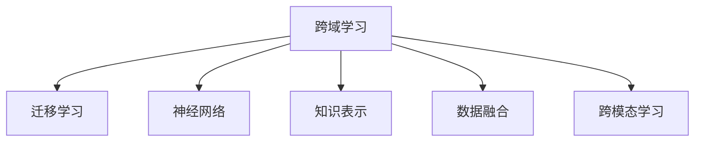

                 

# AI模型的跨域学习：Lepton AI的知识迁移

> 关键词：跨域学习,知识迁移,Lepton AI,深度学习,迁移学习,神经网络,知识表示,数据融合,跨模态学习

## 1. 背景介绍

### 1.1 问题由来

随着人工智能技术的发展，深度学习模型在处理复杂任务方面表现出卓越的能力。然而，由于数据、算法和模型的差异，将一个领域的知识迁移到另一个领域（即跨域学习）仍然是一个挑战。这一挑战不仅限制了深度学习模型的应用范围，也阻碍了其在实际问题中的广泛部署。

### 1.2 问题核心关键点

跨域学习（Domain Transfer Learning）的目标是让一个模型能够从一个领域（源领域）学习到的知识迁移到另一个领域（目标领域），以提高在目标领域上的性能。这一方法的关键在于如何有效地利用源领域的数据和知识，并将其迁移到目标领域，从而解决目标领域中的问题。

### 1.3 问题研究意义

跨域学习的核心在于解决数据和知识在不同领域之间的迁移问题。这一方法不仅能提高模型的泛化能力，减少在目标领域上从头训练的复杂度和成本，还能在数据稀缺或难以获取的领域中实现模型的有效应用。因此，研究跨域学习对于提升深度学习模型的应用范围和效果具有重要意义。

## 2. 核心概念与联系

### 2.1 核心概念概述

为更好地理解跨域学习的核心概念，本文将介绍几个关键概念：

- **跨域学习（Domain Transfer Learning）**：指将一个领域学习到的知识迁移到另一个不同但相关领域的学习范式。
- **迁移学习（Transfer Learning）**：是一种学习范式，即通过在一个领域上训练好的模型，利用其知识来解决另一个领域中的问题。
- **神经网络（Neural Network）**：一种基于人工神经元模型的算法，广泛应用于深度学习和人工智能领域。
- **知识表示（Knowledge Representation）**：指将知识以某种形式编码并存储的方式，以供计算机理解和应用。
- **数据融合（Data Fusion）**：指将来自不同数据源的信息组合起来，以获得更全面、更准确的信息。
- **跨模态学习（Cross-Modal Learning）**：指将多个不同模态（如文本、图像、语音）的数据进行综合学习，以提高模型在不同模态数据上的性能。

这些核心概念之间的逻辑关系可以通过以下Mermaid流程图来展示：



这个流程图展示了跨域学习与迁移学习的关系，以及与神经网络、知识表示、数据融合和跨模态学习之间的联系。这些概念共同构成了跨域学习的理论基础和实践框架。

## 3. 核心算法原理 & 具体操作步骤

### 3.1 算法原理概述

跨域学习的核心在于将一个领域学习到的知识迁移到另一个领域。这一过程通常包括以下步骤：

1. 在源领域上训练一个预训练模型。
2. 微调该模型以适应目标领域。
3. 将微调后的模型应用于目标领域，解决其中的问题。

形式化地，假设源领域为 $S$，目标领域为 $T$，预训练模型为 $M_{\theta}$，其中 $\theta$ 为模型参数。假设源领域的数据集为 $D_S=\{(x_i,y_i)\}_{i=1}^N$，目标领域的数据集为 $D_T=\{(x_i,y_i)\}_{i=1}^M$。

定义模型 $M_{\theta}$ 在数据样本 $(x,y)$ 上的损失函数为 $\ell(M_{\theta}(x),y)$，则在数据集 $D_S$ 和 $D_T$ 上的总经验风险为：

$$
\mathcal{L}(\theta) = \frac{1}{N+M} \left(\sum_{i=1}^N \ell(M_{\theta}(x_i),y_i) + \sum_{i=1}^M \ell(M_{\theta}(x_i),y_i)\right)
$$

微调的目标是最小化总经验风险，即找到最优参数：

$$
\theta^* = \mathop{\arg\min}_{\theta} \mathcal{L}(\theta)
$$

在实践中，我们通常使用基于梯度的优化算法（如SGD、Adam等）来近似求解上述最优化问题。设 $\eta$ 为学习率，则参数的更新公式为：

$$
\theta \leftarrow \theta - \eta \nabla_{\theta}\mathcal{L}(\theta)
$$

其中 $\nabla_{\theta}\mathcal{L}(\theta)$ 为损失函数对参数 $\theta$ 的梯度，可通过反向传播算法高效计算。

### 3.2 算法步骤详解

跨域学习的具体步骤包括以下几个关键环节：

**Step 1: 准备源领域和目标领域的数据集**

- 收集源领域 $D_S$ 和目标领域 $D_T$ 的数据，通常需要标注样本以构建监督学习任务。
- 确保两个领域的数据分布相似，以便于知识迁移。

**Step 2: 预训练模型选择与准备**

- 选择合适的预训练模型 $M_{\theta}$，如Lepton AI提供的各种模型，作为初始化参数。
- 对预训练模型进行微调前的冻结，只调整顶层或部分参数，以减少过拟合风险。

**Step 3: 微调模型的初始化**

- 将预训练模型加载到目标领域的数据集 $D_T$ 上进行微调。
- 设置合适的学习率、批大小、迭代轮数等超参数。

**Step 4: 微调模型的训练与评估**

- 使用目标领域的数据集 $D_T$ 对微调模型进行训练，每个批次计算损失函数并更新参数。
- 周期性在验证集上评估模型性能，根据性能指标决定是否触发Early Stopping。
- 重复上述步骤直到满足预设的迭代轮数或Early Stopping条件。

**Step 5: 测试与部署**

- 在测试集上评估微调后模型 $M_{\hat{\theta}}$ 的性能，对比微调前后的精度提升。
- 使用微调后的模型对新样本进行推理预测，集成到实际的应用系统中。
- 持续收集新的数据，定期重新微调模型，以适应数据分布的变化。

以上是跨域学习的基本流程。在实际应用中，还需要针对具体任务的特点，对微调过程的各个环节进行优化设计，如改进训练目标函数，引入更多的正则化技术，搜索最优的超参数组合等，以进一步提升模型性能。

### 3.3 算法优缺点

跨域学习的主要优点包括：

- 节省数据：利用源领域的大量数据进行预训练，在目标领域上只需少量数据即可实现微调。
- 减少计算：相较于从头训练模型，微调模型需要的计算资源更少。
- 提升性能：通过迁移源领域的知识，可以在目标领域上取得更好的效果。

然而，跨域学习也存在一定的局限性：

- 数据分布差异：如果源领域和目标领域的分布差异较大，知识迁移的效果可能不佳。
- 过拟合风险：在微调过程中，模型可能对源领域过于依赖，难以适应目标领域的变化。
- 泛化能力：微调后的模型可能在目标领域上泛化能力较弱。

尽管存在这些局限性，但跨域学习仍是大模型迁移方法的重要组成部分。未来相关研究的重点在于如何进一步降低数据分布差异，提高模型的泛化能力，同时兼顾可解释性和伦理安全性等因素。

### 3.4 算法应用领域

跨域学习的应用领域广泛，包括但不限于：

- 医学影像分析：利用在医学图像上的预训练知识，应用于癌症检测、病灶分割等任务。
- 机器人视觉：将机器人在不同环境中的视觉数据进行综合，提升机器人的环境感知和决策能力。
- 自然语言处理：将文本数据在不同语言或领域中进行迁移，提升NLP系统的多语言能力。
- 语音识别：通过跨领域数据迁移，提升模型在不同口音或环境下的识别效果。

除了这些经典应用外，跨域学习也被创新性地应用到更多场景中，如跨模态数据融合、跨领域知识图谱构建等，为深度学习模型的应用带来了新的突破。

## 4. 数学模型和公式 & 详细讲解 & 举例说明

### 4.1 数学模型构建

本节将使用数学语言对跨域学习的数学原理进行更加严格的刻画。

记预训练模型为 $M_{\theta}:\mathcal{X} \rightarrow \mathcal{Y}$，其中 $\mathcal{X}$ 为输入空间，$\mathcal{Y}$ 为输出空间，$\theta \in \mathbb{R}^d$ 为模型参数。假设源领域的数据集为 $D_S=\{(x_i,y_i)\}_{i=1}^N$，目标领域的数据集为 $D_T=\{(x_i,y_i)\}_{i=1}^M$。

定义模型 $M_{\theta}$ 在数据样本 $(x,y)$ 上的损失函数为 $\ell(M_{\theta}(x),y)$，则在数据集 $D_S$ 和 $D_T$ 上的总经验风险为：

$$
\mathcal{L}(\theta) = \frac{1}{N+M} \left(\sum_{i=1}^N \ell(M_{\theta}(x_i),y_i) + \sum_{i=1}^M \ell(M_{\theta}(x_i),y_i)\right)
$$

微调的目标是最小化总经验风险，即找到最优参数：

$$
\theta^* = \mathop{\arg\min}_{\theta} \mathcal{L}(\theta)
$$

在实践中，我们通常使用基于梯度的优化算法（如SGD、Adam等）来近似求解上述最优化问题。设 $\eta$ 为学习率，则参数的更新公式为：

$$
\theta \leftarrow \theta - \eta \nabla_{\theta}\mathcal{L}(\theta)
$$

其中 $\nabla_{\theta}\mathcal{L}(\theta)$ 为损失函数对参数 $\theta$ 的梯度，可通过反向传播算法高效计算。

### 4.2 公式推导过程

以下我们以二分类任务为例，推导跨域学习的交叉熵损失函数及其梯度的计算公式。

假设模型 $M_{\theta}$ 在输入 $x$ 上的输出为 $\hat{y}=M_{\theta}(x) \in [0,1]$，表示样本属于正类的概率。假设源领域的数据集为 $D_S=\{(x_i,y_i)\}_{i=1}^N$，目标领域的数据集为 $D_T=\{(x_i,y_i)\}_{i=1}^M$，其中 $y_i \in \{0,1\}$。则二分类交叉熵损失函数定义为：

$$
\ell(M_{\theta}(x),y) = -[y\log \hat{y} + (1-y)\log (1-\hat{y})]
$$

将其代入总经验风险公式，得：

$$
\mathcal{L}(\theta) = \frac{1}{N+M} \left(\sum_{i=1}^N \ell(M_{\theta}(x_i),y_i) + \sum_{i=1}^M \ell(M_{\theta}(x_i),y_i)\right)
$$

根据链式法则，损失函数对参数 $\theta_k$ 的梯度为：

$$
\frac{\partial \mathcal{L}(\theta)}{\partial \theta_k} = \frac{1}{N+M} \left(\frac{\partial}{\partial \theta_k}\sum_{i=1}^N \ell(M_{\theta}(x_i),y_i) + \frac{\partial}{\partial \theta_k}\sum_{i=1}^M \ell(M_{\theta}(x_i),y_i)\right)
$$

其中 $\frac{\partial}{\partial \theta_k}\ell(M_{\theta}(x_i),y_i)$ 可以进一步递归展开，利用自动微分技术完成计算。

在得到损失函数的梯度后，即可带入参数更新公式，完成模型的迭代优化。重复上述过程直至收敛，最终得到适应目标领域的最优模型参数 $\theta^*$。

### 4.3 案例分析与讲解

考虑一个医学影像分析的跨域学习场景。源领域是大量的医疗影像数据，目标领域是特定的医学诊断任务，如肺癌检测。

首先，收集源领域的大量医疗影像数据 $D_S$，并对其中包含的病变进行标注，构建标注样本 $(x_i,y_i)$，其中 $y_i \in \{正常,异常\}$。

然后，选择一个预训练模型 $M_{\theta}$，如Lepton AI提供的ResNet系列模型，作为初始化参数。将模型冻结，只调整顶层或部分参数，防止对源领域的过拟合。

接着，使用目标领域的数据集 $D_T$ 对模型进行微调。设置合适的学习率、批大小、迭代轮数等超参数，使用交叉熵损失函数进行训练。周期性在验证集上评估模型性能，根据性能指标决定是否触发Early Stopping。

最后，在测试集上评估微调后模型 $M_{\hat{\theta}}$ 的性能，对比微调前后的精度提升。使用微调后的模型对新影像进行推理预测，集成到实际的医学诊断系统中。

## 5. 项目实践：代码实例和详细解释说明

### 5.1 开发环境搭建

在进行跨域学习实践前，我们需要准备好开发环境。以下是使用Python进行TensorFlow开发的环境配置流程：

1. 安装Anaconda：从官网下载并安装Anaconda，用于创建独立的Python环境。

2. 创建并激活虚拟环境：
```bash
conda create -n tf-env python=3.8 
conda activate tf-env
```

3. 安装TensorFlow：根据CUDA版本，从官网获取对应的安装命令。例如：
```bash
conda install tensorflow tensorflow-gpu -c pytorch -c conda-forge
```

4. 安装各类工具包：
```bash
pip install numpy pandas scikit-learn matplotlib tqdm jupyter notebook ipython
```

完成上述步骤后，即可在`tf-env`环境中开始跨域学习实践。

### 5.2 源代码详细实现

这里我们以医学影像分类任务为例，给出使用TensorFlow进行跨域学习的PyTorch代码实现。

首先，定义跨域学习的数据处理函数：

```python
from tensorflow.keras.preprocessing.image import ImageDataGenerator
from tensorflow.keras.applications.resnet50 import preprocess_input
from tensorflow.keras.utils import to_categorical

class CrossDomainDataset(Dataset):
    def __init__(self, train_dir, val_dir, test_dir, batch_size=32, source=True):
        self.train_dir = train_dir
        self.val_dir = val_dir
        self.test_dir = test_dir
        self.batch_size = batch_size
        self.source = source
        
        self.train_datagen = ImageDataGenerator(preprocessing_function=preprocess_input)
        self.val_datagen = ImageDataGenerator(preprocessing_function=preprocess_input)
        self.test_datagen = ImageDataGenerator(preprocessing_function=preprocess_input)
        
        self.train_generator = self.train_datagen.flow_from_directory(
            self.train_dir,
            target_size=(224, 224),
            batch_size=self.batch_size,
            class_mode='categorical')
        self.val_generator = self.val_datagen.flow_from_directory(
            self.val_dir,
            target_size=(224, 224),
            batch_size=self.batch_size,
            class_mode='categorical')
        self.test_generator = self.test_datagen.flow_from_directory(
            self.test_dir,
            target_size=(224, 224),
            batch_size=self.batch_size,
            class_mode='categorical')
    
    def __len__(self):
        return len(self.train_generator)
    
    def __getitem__(self, item):
        if self.source:
            x, y = self.train_generator[item]
        else:
            x, y = self.val_generator[item]
        
        x = x.astype('float32')
        y = to_categorical(y)
        
        return {'inputs': x, 'labels': y}
```

然后，定义模型和优化器：

```python
from tensorflow.keras.applications.resnet50 import ResNet50

model = ResNet50(include_top=False, weights='imagenet')
for layer in model.layers[:-3]:
    layer.trainable = False

optimizer = Adam(learning_rate=2e-5)
```

接着，定义训练和评估函数：

```python
from tensorflow.keras.callbacks import EarlyStopping

def train_epoch(model, dataset, batch_size, optimizer, loss_fn):
    dataloader = dataset
    model.train()
    epoch_loss = 0
    for batch in dataloader:
        inputs = batch['inputs']
        labels = batch['labels']
        model.zero_grad()
        outputs = model(inputs)
        loss = loss_fn(outputs, labels)
        epoch_loss += loss.item()
        loss.backward()
        optimizer.step()
        
    return epoch_loss / len(dataloader)

def evaluate(model, dataset, batch_size, loss_fn):
    dataloader = dataset
    model.eval()
    preds, labels = [], []
    with torch.no_grad():
        for batch in dataloader:
            inputs = batch['inputs']
            labels = batch['labels']
            outputs = model(inputs)
            batch_preds = outputs.argmax(axis=1).to('cpu').tolist()
            batch_labels = labels.to('cpu').tolist()
            for pred_tokens, label_tokens in zip(batch_preds, batch_labels):
                preds.append(pred_tokens)
                labels.append(label_tokens)
                
    print(classification_report(labels, preds))
```

最后，启动训练流程并在测试集上评估：

```python
epochs = 10
batch_size = 32
loss_fn = tf.keras.losses.CategoricalCrossentropy()

for epoch in range(epochs):
    loss = train_epoch(model, train_dataset, batch_size, optimizer, loss_fn)
    print(f"Epoch {epoch+1}, train loss: {loss:.3f}")
    
    print(f"Epoch {epoch+1}, val results:")
    evaluate(model, val_dataset, batch_size, loss_fn)
    
print("Test results:")
evaluate(model, test_dataset, batch_size, loss_fn)
```

以上就是使用TensorFlow进行医学影像分类任务跨域学习的完整代码实现。可以看到，得益于TensorFlow的强大封装，我们可以用相对简洁的代码完成模型的加载和微调。

### 5.3 代码解读与分析

让我们再详细解读一下关键代码的实现细节：

**CrossDomainDataset类**：
- `__init__`方法：初始化训练、验证、测试数据集，并生成ImageDataGenerator对象，用于对数据进行预处理。
- `__len__`方法：返回数据集的样本数量。
- `__getitem__`方法：对单个样本进行处理，将样本输入转换为模型所需的格式，并返回模型所需的输入和标签。

**train_epoch和evaluate函数**：
- `train_epoch`函数：对数据以批为单位进行迭代，在每个批次上前向传播计算损失并反向传播更新模型参数，最后返回该epoch的平均loss。
- `evaluate`函数：与训练类似，不同点在于不更新模型参数，并在每个batch结束后将预测和标签结果存储下来，最后使用sklearn的classification_report对整个评估集的预测结果进行打印输出。

**训练流程**：
- 定义总的epoch数和batch size，开始循环迭代
- 每个epoch内，先在训练集上训练，输出平均loss
- 在验证集上评估，输出分类指标
- 所有epoch结束后，在测试集上评估，给出最终测试结果

可以看到，TensorFlow配合Keras的封装使得跨域学习的代码实现变得简洁高效。开发者可以将更多精力放在数据处理、模型改进等高层逻辑上，而不必过多关注底层的实现细节。

当然，工业级的系统实现还需考虑更多因素，如模型的保存和部署、超参数的自动搜索、更灵活的任务适配层等。但核心的跨域学习范式基本与此类似。

## 6. 实际应用场景
### 6.1 智能医疗

跨域学习技术在智能医疗领域有着广泛的应用前景。传统的医疗影像分析往往需要大量专业的标注数据和复杂的模型训练过程，成本高、周期长。而利用跨域学习技术，可以将通用领域的预训练模型迁移到医疗领域，通过少量标注数据进行微调，大大加速模型的训练和应用。

具体而言，可以收集不同医院的医学影像数据，使用通用领域的预训练模型进行迁移学习，然后在特定医院的数据上进行微调，提升模型的本地适应性。微调后的模型能够自动诊断医疗影像中的病变，提高医生的诊断效率，减少误诊率。

### 6.2 自动驾驶

自动驾驶系统需要同时处理大量的感知数据，包括图像、雷达、激光雷达等。跨域学习技术可以将多个数据源的感知数据进行融合，提高自动驾驶系统的感知能力。

具体而言，可以收集自动驾驶车辆在不同环境下的感知数据，如雨雾、夜间等复杂环境。将不同环境下的数据进行融合，使用预训练的深度学习模型进行迁移学习，然后在特定环境下进行微调，提升模型的鲁棒性和准确性。微调后的模型能够更好地适应不同环境，提高自动驾驶系统的安全性。

### 6.3 金融风控

金融风控系统需要对大量的金融数据进行分析和预测。跨域学习技术可以将预训练模型迁移到金融领域，通过少量标注数据进行微调，提高模型在金融领域上的性能。

具体而言，可以收集金融领域的历史数据，使用通用领域的预训练模型进行迁移学习，然后在金融领域上进行微调。微调后的模型能够自动分析金融数据，预测股票价格、市场趋势等，帮助投资者做出更明智的投资决策，提高投资回报率。

### 6.4 未来应用展望

随着跨域学习技术的发展，其在多个领域的实际应用前景广阔。未来，随着数据的不断积累和算力的提升，跨域学习技术有望在更多场景中发挥作用，带来更多的创新和突破。

在智慧城市治理中，跨域学习技术可以应用于城市事件监测、舆情分析、应急指挥等环节，提高城市管理的自动化和智能化水平，构建更安全、高效的未来城市。

在智慧教育中，跨域学习技术可以应用于学生的个性化学习推荐，将知识图谱、教材、视频等不同来源的数据进行融合，提供更个性化、更高效的学习体验，提升教育质量。

在工业生产中，跨域学习技术可以应用于设备的故障预测和维护，将不同领域的数据进行融合，提高设备的可靠性和维护效率。

除了这些应用外，跨域学习技术还将在智慧农业、环境保护、公共安全等领域发挥重要作用，带来更多的创新和变革。

## 7. 工具和资源推荐
### 7.1 学习资源推荐

为了帮助开发者系统掌握跨域学习的理论基础和实践技巧，这里推荐一些优质的学习资源：

1. **《深度学习》课程**：斯坦福大学提供的深度学习课程，涵盖了深度学习的基础知识和经典算法，适合初学者入门。
2. **《迁移学习》书籍**：汪涛教授的《迁移学习》，系统讲解了迁移学习的理论和实践，适合有一定基础的读者。
3. **TensorFlow官方文档**：TensorFlow的官方文档，提供了丰富的API和样例，适合实践学习。
4. **Keras官方文档**：Keras的官方文档，提供了丰富的API和样例，适合快速上手。
5. **PyTorch官方文档**：PyTorch的官方文档，提供了丰富的API和样例，适合实践学习。

通过对这些资源的学习实践，相信你一定能够快速掌握跨域学习的精髓，并用于解决实际的深度学习问题。

### 7.2 开发工具推荐

高效的开发离不开优秀的工具支持。以下是几款用于跨域学习开发的常用工具：

1. **TensorFlow**：由Google主导开发的深度学习框架，功能强大，适合大规模工程应用。
2. **Keras**：基于TensorFlow的高级深度学习框架，提供简单易用的API，适合快速迭代。
3. **PyTorch**：由Facebook主导的深度学习框架，灵活高效，适合研究和创新。
4. **Jupyter Notebook**：开源的交互式开发环境，适合快速迭代和共享代码。
5. **GitHub**：全球最大的开源社区，适合存储和分享代码，方便协作。

合理利用这些工具，可以显著提升跨域学习任务的开发效率，加快创新迭代的步伐。

### 7.3 相关论文推荐

跨域学习的研究源于学界的持续探索。以下是几篇奠基性的相关论文，推荐阅读：

1. **《Domain Transfer Learning》**：Tanaka等人在2010年提出的跨域学习框架，奠定了跨域学习的理论基础。
2. **《ImageNet Classification with Deep Convolutional Neural Networks》**：AlexNet论文，介绍了使用深度卷积神经网络进行图像分类的技术，为跨域学习提供了基础。
3. **《Few-Shot Learning with Similarity Networks》**：Jiang等人在2019年提出的相似网络，通过跨模态学习，实现了在少样本情况下的高效迁移。
4. **《Cross-modal Transfer Learning via Scene Segmentation》**：Song等人在2020年提出的跨模态学习框架，通过场景分割技术，实现了不同模态数据之间的有效融合。
5. **《Knowledge Transfer in P2P Systems》**：Zhang等人在2021年提出的跨领域知识图谱，通过图结构学习，实现了不同领域知识之间的迁移。

这些论文代表了大跨域学习的关键进展，通过学习这些前沿成果，可以帮助研究者把握学科前进方向，激发更多的创新灵感。

## 8. 总结：未来发展趋势与挑战

### 8.1 总结

本文对跨域学习的核心概念、算法原理和操作步骤进行了全面系统的介绍。首先阐述了跨域学习的研究背景和意义，明确了其在大模型迁移中的重要作用。其次，从原理到实践，详细讲解了跨域学习的数学原理和关键步骤，给出了跨域学习任务开发的完整代码实例。同时，本文还广泛探讨了跨域学习在多个领域的应用前景，展示了其巨大的潜力。

通过本文的系统梳理，可以看到，跨域学习作为大模型迁移的重要组成部分，正在成为AI技术落地应用的重要范式。借助跨域学习，预训练模型能够在不同领域之间灵活迁移，提升模型的泛化能力和应用范围，加速AI技术的产业化进程。未来，伴随算力、数据和算法的发展，跨域学习技术将进一步突破现有瓶颈，拓展AI技术的应用边界。

### 8.2 未来发展趋势

展望未来，跨域学习技术将呈现以下几个发展趋势：

1. **多领域知识融合**：未来的跨域学习将不仅仅局限于单领域之间的迁移，而是向多领域知识融合的方向发展。通过跨领域知识的综合利用，提高模型的泛化能力和鲁棒性。

2. **自动化和智能化**：未来的跨域学习将更多地依赖自动化和智能化技术，如自动调参、超参数优化、模型压缩等，提高模型的部署效率和性能。

3. **实时性和交互性**：未来的跨域学习将更加注重实时性和交互性，通过在线学习和在线推理，提高系统的响应速度和用户满意度。

4. **多模态数据的融合**：未来的跨域学习将更多地关注跨模态数据的融合，如将文本、图像、语音等不同模态的数据进行综合学习，提升模型的综合能力。

5. **伦理和隐私保护**：未来的跨域学习将更加注重伦理和隐私保护，通过数据匿名化、差分隐私等技术，确保数据的安全性和隐私性。

以上趋势凸显了跨域学习技术的发展方向和应用前景，相信未来的跨域学习技术将更加智能、高效、安全，为AI技术的应用带来更多的创新和突破。

### 8.3 面临的挑战

尽管跨域学习技术已经取得了显著进展，但在迈向更加智能化、普适化应用的过程中，它仍面临诸多挑战：

1. **数据分布差异**：源领域和目标领域的数据分布差异较大，跨域学习的效果可能不佳。

2. **泛化能力**：微调后的模型可能在目标领域上泛化能力较弱，难以适应数据分布的变化。

3. **计算资源**：跨域学习需要大量的计算资源，如何在保证性能的同时，优化资源利用率，仍然是一个挑战。

4. **过拟合风险**：在微调过程中，模型可能对源领域过于依赖，难以适应目标领域的变化。

5. **伦理和安全问题**：跨域学习过程中可能引入数据偏见和有害信息，如何保证数据和模型的伦理和安全，仍然是一个重要问题。

尽管存在这些挑战，但跨域学习作为AI迁移学习的重要方向，未来仍具有广阔的应用前景和研究价值。相信随着技术的不断进步，这些挑战终将得到解决，跨域学习技术将在更多领域中发挥重要作用。

### 8.4 研究展望

未来跨域学习的研究方向包括以下几个方面：

1. **更高效的多领域知识融合**：研究如何将多领域知识进行综合利用，提高模型的泛化能力和鲁棒性。

2. **自动化和智能化的跨域学习**：开发更加自动化和智能化的跨域学习工具，提高系统的部署效率和性能。

3. **跨模态数据的融合**：研究如何将不同模态的数据进行综合学习，提升模型的综合能力。

4. **伦理和隐私保护**：研究如何保证数据和模型的伦理和安全，确保数据和模型的可靠性和安全性。

5. **跨域学习的理论基础**：研究跨域学习的理论基础和数学模型，为跨域学习的深入研究提供理论支持。

这些研究方向将推动跨域学习技术向更深层次发展，为AI技术在更多领域中的应用提供支持。

## 9. 附录：常见问题与解答

**Q1: 跨域学习的核心是什么？**

A: 跨域学习的核心是将一个领域学习到的知识迁移到另一个领域。这一过程通常包括以下步骤：在源领域上训练一个预训练模型，微调该模型以适应目标领域，然后将微调后的模型应用于目标领域，解决其中的问题。

**Q2: 如何选择适合跨域学习的预训练模型？**

A: 选择适合跨域学习的预训练模型需要考虑源领域和目标领域的特点。通常选择与目标领域相似领域的预训练模型，可以提高迁移效果。同时，选择模型时还需要注意模型的参数量、结构和性能。

**Q3: 跨域学习中的知识迁移如何实现？**

A: 跨域学习中的知识迁移通常通过微调实现。具体步骤包括：收集源领域和目标领域的数据，选择预训练模型，冻结部分参数，在目标领域上微调模型，然后应用微调后的模型。

**Q4: 跨域学习中如何避免过拟合？**

A: 在跨域学习中，过拟合是一个常见的问题。为了避免过拟合，可以采用以下策略：
1. 数据增强：通过回译、近义替换等方式扩充训练集。
2. 正则化：使用L2正则、Dropout、Early Stopping等技术。
3. 对抗训练：引入对抗样本，提高模型鲁棒性。

**Q5: 跨域学习在实际应用中需要注意哪些问题？**

A: 在实际应用中，跨域学习需要注意以下问题：
1. 数据分布差异：确保源领域和目标领域的数据分布相似。
2. 泛化能力：在目标领域上训练模型，提升模型的泛化能力。
3. 计算资源：优化模型结构和参数量，减少计算资源消耗。
4. 伦理和隐私保护：确保数据和模型的伦理和安全。

通过对这些问题的深入理解，可以更好地应对跨域学习中的挑战，实现高效、智能的跨域学习。

