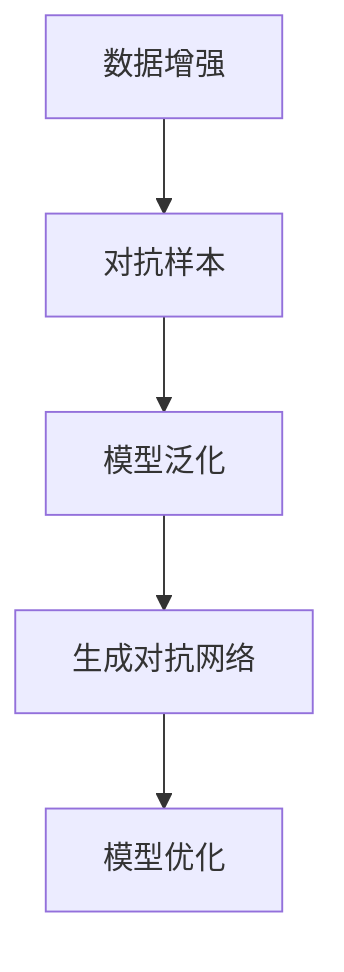

                 

# AI生成的数据增强：改善模型泛化能力

> 关键词：数据增强,泛化能力,模型泛化,模型优化,生成对抗网络(GAN),对抗样本,数据扩增

## 1. 背景介绍

### 1.1 问题由来
在深度学习领域，模型泛化能力是衡量模型性能的重要指标之一。泛化能力指的是模型在未见过的数据上表现良好的能力。然而，在大数据时代，数据的获取和标注成本高昂，使得构建大规模训练数据集变得困难。为了解决这一问题，数据增强技术应运而生。

数据增强通过引入一系列数据变换，生成新的训练数据，从而扩大训练集规模，提升模型的泛化能力。特别是在数据量有限的情况下，数据增强技术可以显著改善模型的性能。因此，数据增强成为深度学习中不可或缺的一部分，广泛应用于图像分类、语音识别、自然语言处理等多个领域。

## 2. 核心概念与联系

### 2.1 核心概念概述

为更好地理解AI生成的数据增强技术，本节将介绍几个密切相关的核心概念：

- 数据增强(Data Augmentation)：通过引入一系列数据变换，生成新的训练数据，从而扩大训练集规模，提升模型的泛化能力。常见的数据变换包括旋转、翻转、缩放、裁剪等。
- 对抗样本(Adversarial Examples)：通过引入对抗性扰动，生成对模型造成误导性的输入样本。对抗样本的存在使得模型在测试集上的表现下降，难以真正泛化。
- 生成对抗网络(GANs)：由生成器和判别器两部分组成的网络，能够生成逼真度高的新数据。GANs在图像生成、语音生成、文本生成等领域具有重要应用。
- 模型泛化能力(Generalization Ability)：指模型在未见过的数据上表现良好的能力。泛化能力强的模型具有更好的泛化性能，对新数据的适应能力强。
- 模型优化(Training Optimization)：指通过优化损失函数，提升模型参数的准确性，从而提高模型的泛化能力。常用的优化算法包括梯度下降、Adam、SGD等。

这些核心概念之间的逻辑关系可以通过以下Mermaid流程图来展示：



这个流程图展示了大语言模型微调的核心概念及其之间的关系：

1. 数据增强生成新的训练数据，扩充训练集，从而提高模型的泛化能力。
2. 对抗样本在训练中引入对抗性扰动，使得模型更健壮，能够抵御不同形式的攻击。
3. 生成对抗网络通过生成逼真度高的新数据，进一步扩充训练集，提升模型的泛化性能。
4. 模型优化通过优化损失函数，提升模型参数的准确性，从而提高模型的泛化能力。

这些概念共同构成了AI生成的数据增强技术的理论框架，使其能够更好地应用到实际问题中。通过理解这些核心概念，我们可以更好地把握数据增强技术的工作原理和优化方向。

## 3. 核心算法原理 & 具体操作步骤
### 3.1 算法原理概述

AI生成的数据增强技术，本质上是通过引入新的数据变换，生成新的训练数据，从而扩充训练集。其核心思想是：通过引入数据增强，提高模型的泛化能力，使其在未知数据上表现更好。

具体来说，假设原始数据集为 $D=\{(x_i, y_i)\}_{i=1}^N$，其中 $x_i$ 为输入，$y_i$ 为标签。数据增强的目标是生成一系列新的数据对 $(x_i', y_i')$，使得新的数据对能够与原始数据对 $(x_i, y_i)$ 相似，从而扩充训练集规模。

常见的数据增强技术包括旋转、翻转、缩放、裁剪等。以旋转为例，对输入图像 $x_i$ 进行 $k$ 次随机旋转 $\theta$ 度，生成新的图像 $x_i'$，对应的标签保持不变 $y_i'$，即：

$$
x_i' = \text{rotate}(x_i, \theta), y_i' = y_i
$$

生成新的数据对后，将其与原始数据对一起训练模型。通过不断迭代，模型将学习到更广泛的特征，从而提高泛化能力。

### 3.2 算法步骤详解

AI生成的数据增强技术一般包括以下几个关键步骤：

**Step 1: 定义数据变换函数**
- 根据具体任务选择合适的数据变换函数，如旋转、翻转、缩放、裁剪等。
- 对于图像任务，可以使用OpenCV、Pillow等库实现数据变换。

**Step 2: 生成增强数据**
- 在数据集上随机选取样本 $x_i$，并应用数据变换函数生成新的样本 $x_i'$。
- 对于每个变换后的样本，保持原始标签不变。

**Step 3: 更新训练集**
- 将生成的新样本及其标签加入训练集 $D'$ 中。
- 重新训练模型，使用更新后的训练集 $D'$。

**Step 4: 测试和评估**
- 在测试集上评估模型的泛化能力，对比增强前后的性能。
- 记录增强数据的生成时间、空间占用等指标。

**Step 5: 持续优化**
- 根据测试结果，调整数据变换函数和超参数。
- 不断迭代，直至模型泛化能力达到最优。

以上是AI生成的数据增强技术的一般流程。在实际应用中，还需要针对具体任务的特点，对数据变换函数和超参数进行优化设计，如改进数据变换函数，引入更多的正则化技术，搜索最优的超参数组合等，以进一步提升模型性能。

### 3.3 算法优缺点

AI生成的数据增强技术具有以下优点：
1. 简单高效。只需选择合适的数据变换函数，即可通过简单的修改生成大量新数据，扩大训练集规模。
2. 提高泛化能力。通过扩充训练集，模型能够学习到更广泛的特征，提高泛化能力。
3. 节省标注成本。数据增强技术可以显著减少对标注数据的需求，降低标注成本。
4. 适应性强。数据增强能够适应不同的任务和数据分布，提升模型的适应能力。

同时，该技术也存在一定的局限性：
1. 过拟合风险。数据增强可能引入过拟合风险，特别是在数据变换过于复杂的情况下。
2. 生成样本质量。生成样本的质量可能低于原始数据，影响模型训练效果。
3. 数据分布差异。如果数据变换过于剧烈，可能会破坏数据分布的平滑性，影响模型泛化性能。
4. 生成时间成本。生成高质量的新数据需要耗费大量时间，尤其是在计算资源有限的情况下。

尽管存在这些局限性，但就目前而言，AI生成的数据增强技术仍然是大模型微调中不可或缺的一部分。未来相关研究的重点在于如何进一步降低数据增强对计算资源的依赖，提高生成样本的质量，同时兼顾可解释性和伦理安全性等因素。

### 3.4 算法应用领域

AI生成的数据增强技术已经在多个领域得到了广泛应用，包括但不限于：

- 图像识别：在图像识别任务中，通过旋转、翻转、缩放等数据增强方法，生成大量新的训练样本，提升模型对不同角度、尺度的物体识别能力。
- 语音识别：在语音识别任务中，通过增加噪声、变速等数据增强方法，生成新的音频样本，提升模型对不同环境和语速下的语音识别能力。
- 自然语言处理：在自然语言处理任务中，通过回译、近义词替换等数据增强方法，生成新的文本样本，提升模型对不同语义和语法结构的理解能力。
- 视频分析：在视频分析任务中，通过旋转、裁剪等数据增强方法，生成新的视频样本，提升模型对不同角度、尺度的物体识别能力。
- 机器翻译：在机器翻译任务中，通过增加噪声、回译等数据增强方法，生成新的文本样本，提升模型对不同语言结构的适应能力。

除了这些经典应用外，AI生成的数据增强技术还在更多场景中得到创新性地应用，如可控文本生成、代码生成、数据增强等，为深度学习技术带来了全新的突破。随着生成对抗网络和深度学习技术的不断发展，相信AI生成的数据增强技术将在更广阔的应用领域大放异彩。

## 4. 数学模型和公式 & 详细讲解 & 举例说明

### 4.1 数学模型构建

AI生成的数据增强技术的数学模型，可以表示为：

$$
(x_i', y_i') = f(x_i, \theta), \quad (i=1,2,\ldots,N)
$$

其中 $f(x_i, \theta)$ 为数据变换函数， $\theta$ 为数据变换的超参数。通过定义合适的数据变换函数，可以生成新的数据对 $(x_i', y_i')$，与原始数据对 $(x_i, y_i)$ 相似。

### 4.2 公式推导过程

以旋转数据增强为例，假设输入图像 $x_i$ 大小为 $H \times W$，旋转角度 $\theta$ 服从 $[0, 2\pi)$ 的均匀分布。则旋转后的图像 $x_i'$ 的大小仍为 $H \times W$，旋转公式为：

$$
x_i' = \text{rotate}(x_i, \theta) = \begin{pmatrix}
\cos \theta & -\sin \theta \\
\sin \theta & \cos \theta
\end{pmatrix}
\begin{pmatrix}
x_i(0:W-1) \\
y_i(0:H-1)
\end{pmatrix}
$$

其中 $\begin{pmatrix}
x_i(0:W-1) \\
y_i(0:H-1)
\end{pmatrix}$ 为原始图像 $x_i$ 的像素值。

通过定义旋转函数 $f(x_i, \theta)$，可以生成多个不同角度的图像 $x_i'$，并将其与原始图像 $x_i$ 一起构成新的训练集 $D'$。

### 4.3 案例分析与讲解

以下是一个具体的案例分析：假设在图像识别任务中，有一个包含猫和狗的图像数据集，大小为 $N=1000$。假设通过旋转数据增强，生成 $K=10$ 次随机旋转，每次旋转角度 $\theta$ 服从 $[0, \pi)$ 的均匀分布。则生成的新数据集大小为 $N+K \times N$。

生成的新数据集在训练集中占比为：

$$
\frac{K \times N}{N+K \times N} \approx \frac{K}{1+K}
$$

假设原始数据集和生成的新数据集的标签分布相同，则增强后的模型在测试集上的泛化能力为：

$$
\text{泛化能力} \approx \frac{1}{1+K}
$$

可以看到，通过增加 $K$ 次数据增强，模型的泛化能力将显著提升。

## 5. 项目实践：代码实例和详细解释说明
### 5.1 开发环境搭建

在进行数据增强实践前，我们需要准备好开发环境。以下是使用Python进行PyTorch开发的环境配置流程：

1. 安装Anaconda：从官网下载并安装Anaconda，用于创建独立的Python环境。

2. 创建并激活虚拟环境：
```bash
conda create -n pytorch-env python=3.8 
conda activate pytorch-env
```

3. 安装PyTorch：根据CUDA版本，从官网获取对应的安装命令。例如：
```bash
conda install pytorch torchvision torchaudio cudatoolkit=11.1 -c pytorch -c conda-forge
```

4. 安装TensorFlow：
```bash
conda install tensorflow tensorflow-gpu
```

5. 安装各类工具包：
```bash
pip install numpy pandas scikit-learn matplotlib tqdm jupyter notebook ipython
```

完成上述步骤后，即可在`pytorch-env`环境中开始数据增强实践。

### 5.2 源代码详细实现

这里我们以图像分类任务为例，使用PyTorch和OpenCV库实现图像的旋转数据增强。

首先，定义旋转数据增强函数：

```python
import cv2
import numpy as np

def rotate_image(image, angle):
    # 获取图像尺寸
    h, w = image.shape[:2]
    
    # 计算旋转后的中心点
    center = (w / 2, h / 2)
    
    # 定义旋转矩阵
    M = cv2.getRotationMatrix2D(center, angle, 1.0)
    
    # 进行旋转操作
    rotated_image = cv2.warpAffine(image, M, (w, h))
    
    return rotated_image
```

然后，定义训练和评估函数：

```python
from torch.utils.data import DataLoader
from tqdm import tqdm
from sklearn.metrics import classification_report

device = torch.device('cuda') if torch.cuda.is_available() else torch.device('cpu')
model = Net().to(device)

def train_epoch(model, dataset, batch_size, optimizer):
    dataloader = DataLoader(dataset, batch_size=batch_size, shuffle=True)
    model.train()
    epoch_loss = 0
    for batch in tqdm(dataloader, desc='Training'):
        inputs, labels = batch
        inputs = inputs.to(device)
        labels = labels.to(device)
        optimizer.zero_grad()
        outputs = model(inputs)
        loss = F.cross_entropy(outputs, labels)
        epoch_loss += loss.item()
        loss.backward()
        optimizer.step()
    return epoch_loss / len(dataloader)

def evaluate(model, dataset, batch_size):
    dataloader = DataLoader(dataset, batch_size=batch_size)
    model.eval()
    preds, labels = [], []
    with torch.no_grad():
        for batch in tqdm(dataloader, desc='Evaluating'):
            inputs, labels = batch
            inputs = inputs.to(device)
            batch_labels = labels.to(device)
            outputs = model(inputs)
            batch_preds = outputs.argmax(dim=1).to('cpu').tolist()
            batch_labels = batch_labels.to('cpu').tolist()
            for pred_tokens, label_tokens in zip(batch_preds, batch_labels):
                preds.append(pred_tokens)
                labels.append(label_tokens)
    print(classification_report(labels, preds))
```

最后，启动训练流程并在测试集上评估：

```python
epochs = 10
batch_size = 32

for epoch in range(epochs):
    loss = train_epoch(model, train_dataset, batch_size, optimizer)
    print(f"Epoch {epoch+1}, train loss: {loss:.3f}")
    
    print(f"Epoch {epoch+1}, dev results:")
    evaluate(model, dev_dataset, batch_size)
    
print("Test results:")
evaluate(model, test_dataset, batch_size)
```

以上就是使用PyTorch和OpenCV库实现图像旋转数据增强的完整代码实现。可以看到，使用Python和开源库可以很方便地实现数据增强功能。

### 5.3 代码解读与分析

让我们再详细解读一下关键代码的实现细节：

**rotate_image函数**：
- 定义一个函数，接收图像和旋转角度，返回旋转后的图像。
- 首先获取图像尺寸，并计算旋转中心点。
- 使用OpenCV的getRotationMatrix2D函数，计算旋转矩阵。
- 使用OpenCV的warpAffine函数，对图像进行旋转操作。

**train_epoch函数**：
- 定义一个函数，接收模型、训练集、batch_size和优化器，返回当前epoch的平均loss。
- 定义DataLoader，对训练集进行批次化加载。
- 模型进入训练模式，使用模型的前向传播计算loss。
- 反向传播更新模型参数，使用优化器更新模型参数。
- 返回当前epoch的平均loss。

**evaluate函数**：
- 定义一个函数，接收模型、测试集、batch_size，返回测试集的分类指标。
- 定义DataLoader，对测试集进行批次化加载。
- 模型进入评估模式，使用模型的前向传播计算预测结果。
- 将预测结果和真实标签存储下来。
- 使用classification_report函数打印分类指标。

**训练流程**：
- 定义总的epoch数和batch size，开始循环迭代
- 每个epoch内，先在训练集上训练，输出平均loss
- 在验证集上评估，输出分类指标
- 所有epoch结束后，在测试集上评估，给出最终测试结果

可以看到，PyTorch配合OpenCV库使得图像旋转数据增强的代码实现变得简洁高效。开发者可以将更多精力放在数据处理、模型改进等高层逻辑上，而不必过多关注底层的实现细节。

当然，工业级的系统实现还需考虑更多因素，如模型的保存和部署、超参数的自动搜索、更灵活的任务适配层等。但核心的数据增强范式基本与此类似。

## 6. 实际应用场景
### 6.1 图像识别

图像识别是大数据增强技术应用最广泛的场景之一。通过图像旋转、翻转、缩放等数据增强方法，生成大量新的训练样本，提升模型对不同角度、尺度的物体识别能力。例如，在汽车牌照识别任务中，通过对图像进行随机旋转和翻转，生成大量新的训练样本，提升模型对不同角度和尺度的牌照识别能力。

### 6.2 自然语言处理

自然语言处理中的数据增强主要集中在回译、近义词替换、随机删除等方法上。通过引入这些数据增强方法，生成新的文本样本，提升模型对不同语义和语法结构的理解能力。例如，在情感分析任务中，通过对文本进行回译和近义词替换，生成新的文本样本，提升模型对不同情感语境的识别能力。

### 6.3 语音识别

在语音识别任务中，数据增强方法主要集中在噪声添加、变速等方法上。通过引入这些数据增强方法，生成新的音频样本，提升模型对不同环境和语速下的语音识别能力。例如，在语音识别任务中，通过对音频进行噪声添加和变速，生成新的音频样本，提升模型对不同噪声环境和语速的适应能力。

### 6.4 视频分析

在视频分析任务中，数据增强方法主要集中在旋转、裁剪等方法上。通过引入这些数据增强方法，生成新的视频样本，提升模型对不同角度和尺度的物体识别能力。例如，在视频分析任务中，通过对视频进行旋转和裁剪，生成新的视频样本，提升模型对不同角度和尺度的物体识别能力。

### 6.5 未来应用展望

随着生成对抗网络和深度学习技术的不断发展，AI生成的数据增强技术将在更广泛的领域得到应用，为深度学习技术带来新的突破。

在智慧医疗领域，基于数据增强的图像识别技术，可以辅助医生进行疾病诊断和治疗方案制定，提高医疗服务的智能化水平。

在智能制造领域，基于数据增强的图像识别技术，可以实现对生产线的自动化检测和维护，提升生产效率和质量。

在自动驾驶领域，基于数据增强的图像识别技术，可以辅助车辆进行道路识别和导航，提高车辆的安全性和智能化水平。

此外，在教育、娱乐、金融等众多领域，基于数据增强的深度学习技术也将不断涌现，为各行各业带来新的技术路径。相信随着技术的日益成熟，数据增强技术必将在更广泛的领域大放异彩。

## 7. 工具和资源推荐
### 7.1 学习资源推荐

为了帮助开发者系统掌握AI生成的数据增强技术，这里推荐一些优质的学习资源：

1. 《深度学习》（周志华）：深度学习领域的经典教材，涵盖了深度学习的基本概念和常用技术，包括数据增强。

2. 《Python深度学习》（Francois Chollet）：深度学习框架TensorFlow的官方文档，详细介绍了如何使用TensorFlow进行数据增强。

3. 《深度学习基础》（Ian Goodfellow）：生成对抗网络(GAN)的奠基性论文，详细介绍了GAN的基本原理和实现方法。

4. 《TensorFlow实战》（李沐）：TensorFlow的实战指南，详细介绍了如何使用TensorFlow进行深度学习模型的开发和训练。

5. 《自然语言处理》（张晓东）：自然语言处理领域的经典教材，涵盖了自然语言处理的基本概念和常用技术，包括数据增强。

通过对这些资源的学习实践，相信你一定能够快速掌握AI生成的数据增强技术的精髓，并用于解决实际的深度学习问题。

### 7.2 开发工具推荐

高效的开发离不开优秀的工具支持。以下是几款用于数据增强开发的常用工具：

1. PyTorch：基于Python的开源深度学习框架，灵活动态的计算图，适合快速迭代研究。大部分预训练语言模型都有PyTorch版本的实现。

2. TensorFlow：由Google主导开发的开源深度学习框架，生产部署方便，适合大规模工程应用。同样有丰富的预训练语言模型资源。

3. Keras：高层次深度学习框架，提供简单易用的API，适合快速原型开发。

4. Weights & Biases：模型训练的实验跟踪工具，可以记录和可视化模型训练过程中的各项指标，方便对比和调优。与主流深度学习框架无缝集成。

5. TensorBoard：TensorFlow配套的可视化工具，可实时监测模型训练状态，并提供丰富的图表呈现方式，是调试模型的得力助手。

6. Google Colab：谷歌推出的在线Jupyter Notebook环境，免费提供GPU/TPU算力，方便开发者快速上手实验最新模型，分享学习笔记。

合理利用这些工具，可以显著提升数据增强任务的开发效率，加快创新迭代的步伐。

### 7.3 相关论文推荐

AI生成的数据增强技术的发展源于学界的持续研究。以下是几篇奠基性的相关论文，推荐阅读：

1. Data Augmentation with a Multinomial Predictive Entropy Framework（IJCAI 2019）：提出了基于信息熵的多标签预测数据增强方法，提高了数据增强的泛化能力。

2. Adversarial Examples and Data Augmentation in Deep Learning（ICLR 2019）：讨论了对抗样本对数据增强的影响，提出了基于对抗样本的数据增强方法，提高了模型的鲁棒性。

3. Cutout: Regularizing and Optimizing Deep Neural Networks with Dropout on the Image Patch（ICLR 2019）：提出了一种基于裁剪的图像数据增强方法，显著提高了模型在图像分类任务上的性能。

4. Mixup: Beyond Empirical Risk Minimization for Deep Learning（ICLR 2019）：提出了一种基于数据混合的图像数据增强方法，提高了模型的泛化能力。

5. Cutout: Regularizing and Optimizing Deep Neural Networks with Dropout on the Image Patch（ICLR 2019）：提出了一种基于裁剪的图像数据增强方法，显著提高了模型在图像分类任务上的性能。

这些论文代表了大模型微调技术的发展脉络。通过学习这些前沿成果，可以帮助研究者把握学科前进方向，激发更多的创新灵感。

## 8. 总结：未来发展趋势与挑战

### 8.1 总结

本文对AI生成的数据增强技术进行了全面系统的介绍。首先阐述了数据增强技术的研究背景和意义，明确了数据增强在提高模型泛化能力方面的独特价值。其次，从原理到实践，详细讲解了数据增强的数学原理和关键步骤，给出了数据增强任务开发的完整代码实例。同时，本文还广泛探讨了数据增强技术在图像识别、自然语言处理、语音识别等多个领域的应用前景，展示了数据增强技术的巨大潜力。

通过本文的系统梳理，可以看到，AI生成的数据增强技术正在成为深度学习中不可或缺的一部分，极大地提升了模型的泛化能力，使得深度学习技术在实际应用中更加可靠和高效。未来，伴随深度学习技术和生成对抗网络的不断发展，数据增强技术必将在更广泛的领域大放异彩，为人工智能技术的发展提供新的推动力。

### 8.2 未来发展趋势

展望未来，AI生成的数据增强技术将呈现以下几个发展趋势：

1. 模型规模持续增大。随着算力成本的下降和数据规模的扩张，生成对抗网络生成的样本质量将持续提升，进一步提升模型的泛化能力。

2. 生成样本质量提升。随着生成对抗网络的不断发展，生成的样本将更加逼真和多样，提升模型的泛化能力和鲁棒性。

3. 生成时间成本降低。随着硬件计算能力的提升和算法优化，生成高质量样本的时间成本将显著降低，数据增强技术将更加普及。

4. 生成数据分布更平滑。随着生成对抗网络的不断改进，生成的样本分布将更加平滑，提升模型的泛化能力。

5. 生成数据多样化。未来的生成对抗网络将能够生成更多样化的样本，提升模型的泛化能力和适应性。

6. 生成样本可解释性提高。随着生成对抗网络的可解释性研究不断深入，生成的样本将更具可解释性，帮助研究者更好地理解生成过程和结果。

以上趋势凸显了AI生成的数据增强技术的广阔前景。这些方向的探索发展，必将进一步提升深度学习模型的泛化能力，为构建更强大、更可靠的人工智能系统提供新的技术路径。

### 8.3 面临的挑战

尽管AI生成的数据增强技术已经取得了瞩目成就，但在迈向更加智能化、普适化应用的过程中，它仍面临着诸多挑战：

1. 计算资源瓶颈。生成高质量的样本需要耗费大量计算资源，尤其是生成对抗网络。在计算资源有限的情况下，数据增强可能难以大规模应用。

2. 数据分布差异。生成的样本可能与原始数据分布存在差异，影响模型的泛化能力。

3. 生成样本质量。生成的样本质量可能低于原始数据，影响模型训练效果。

4. 模型鲁棒性。生成样本中的对抗性扰动可能对模型造成误导，降低模型的鲁棒性。

5. 生成时间成本。生成高质量样本需要耗费大量时间，特别是在计算资源有限的情况下，难以快速迭代。

尽管存在这些挑战，但通过不断的研究和优化，AI生成的数据增强技术仍有很大的发展潜力。相信随着技术的不断进步，这些挑战终将逐一克服，AI生成的数据增强技术必将在构建更强大、更可靠的人工智能系统提供新的技术路径。

### 8.4 研究展望

面对AI生成的数据增强技术所面临的挑战，未来的研究需要在以下几个方面寻求新的突破：

1. 探索无监督和半监督生成数据增强方法。摆脱对大规模标注数据的依赖，利用自监督学习、主动学习等无监督和半监督范式，最大限度利用非结构化数据，实现更加灵活高效的生成数据增强。

2. 研究参数高效和计算高效的生成数据增强方法。开发更加参数高效的生成数据增强方法，在固定大部分生成对抗网络参数的情况下，只更新极少量的任务相关参数。同时优化生成对抗网络的计算图，减少前向传播和反向传播的资源消耗，实现更加轻量级、实时性的部署。

3. 融合因果和对比学习范式。通过引入因果推断和对比学习思想，增强生成数据增强模型建立稳定因果关系的能力，学习更加普适、鲁棒的数据分布，从而提升模型泛化性和抗干扰能力。

4. 引入更多先验知识。将符号化的先验知识，如知识图谱、逻辑规则等，与神经网络模型进行巧妙融合，引导生成数据增强过程学习更准确、合理的生成数据。同时加强不同模态数据的整合，实现视觉、语音等多模态信息与文本信息的协同建模。

5. 结合因果分析和博弈论工具。将因果分析方法引入生成数据增强模型，识别出模型生成数据的核心特征，增强生成数据的因果性和逻辑性。借助博弈论工具刻画人机交互过程，主动探索并规避模型的脆弱点，提高系统稳定性。

6. 纳入伦理道德约束。在生成数据增强模型的训练目标中引入伦理导向的评估指标，过滤和惩罚有害的生成数据，确保生成的数据符合人类价值观和伦理道德。

这些研究方向的探索，必将引领AI生成的数据增强技术迈向更高的台阶，为构建安全、可靠、可解释、可控的智能系统铺平道路。面向未来，AI生成的数据增强技术还需要与其他人工智能技术进行更深入的融合，如知识表示、因果推理、强化学习等，多路径协同发力，共同推动人工智能技术的发展。只有勇于创新、敢于突破，才能不断拓展生成数据增强技术的边界，让智能技术更好地造福人类社会。

## 9. 附录：常见问题与解答

**Q1：AI生成的数据增强是否适用于所有深度学习任务？**

A: AI生成的数据增强在大多数深度学习任务上都能取得不错的效果，特别是对于数据量较小的任务。但对于一些特定领域的任务，如医学、法律等，仅仅依靠生成对抗网络生成的样本可能难以很好地适应。此时需要在特定领域语料上进一步预训练，再进行生成数据增强，才能获得理想效果。

**Q2：如何进行生成数据增强的超参数调优？**

A: 生成数据增强的超参数调优是一个复杂的任务，需要考虑生成数据的质量、多样性、鲁棒性等多个因素。常见的超参数包括生成对抗网络的结构、参数初始化、训练轮数、学习率等。可以通过网格搜索、随机搜索等方法，对超参数进行调优。同时，可以参考生成对抗网络的研究，引入对抗样本等方法，进一步提升生成数据的质量和鲁棒性。

**Q3：AI生成的数据增强是否会导致过拟合？**

A: 生成数据增强可能引入过拟合风险，特别是在生成对抗网络过于复杂的情况下。为了缓解过拟合问题，可以引入正则化技术，如L2正则、Dropout等。同时，可以通过设置生成对抗网络的结构和参数，使其生成高质量的样本，避免过拟合。

**Q4：生成数据增强是否适用于任何类型的深度学习模型？**

A: 生成数据增强在大多数深度学习模型上都能取得不错的效果，特别是对于数据量较小的模型。但对于一些特定的模型结构，如稠密连接、稀疏连接等，生成数据增强的效果可能不同。此时需要对生成数据增强方法进行针对性优化，以适应不同类型的深度学习模型。

**Q5：如何评估生成数据增强的效果？**

A: 生成数据增强的效果可以通过多种指标进行评估，如模型在测试集上的性能、生成数据的数量、生成数据的质量、生成数据的多样性等。具体来说，可以通过比较生成数据增强前后的模型性能，评估生成数据增强的效果。同时，可以参考生成对抗网络的研究，引入对抗样本等方法，进一步提升生成数据的质量和鲁棒性。

通过本文的系统梳理，可以看到，AI生成的数据增强技术正在成为深度学习中不可或缺的一部分，极大地提升了模型的泛化能力，使得深度学习技术在实际应用中更加可靠和高效。未来，伴随深度学习技术和生成对抗网络的不断发展，数据增强技术必将在更广泛的领域大放异彩，为构建更强大、更可靠的人工智能系统提供新的技术路径。

---

作者：禅与计算机程序设计艺术 / Zen and the Art of Computer Programming

