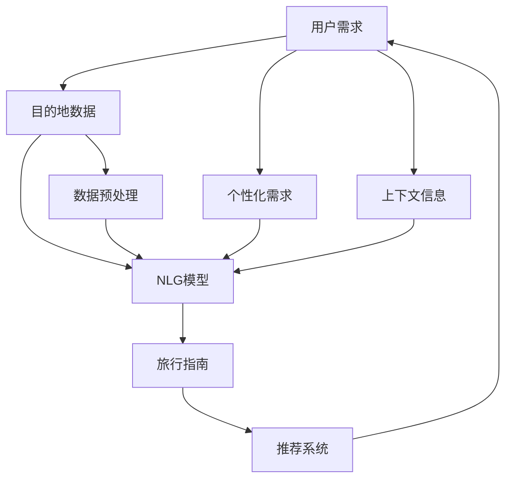

                 

## 1. 背景介绍

随着人工智能技术的飞速发展，自然语言生成（NLG）技术已经从简单的翻译和摘要生成，发展到能够生成符合人类语法和语义的、上下文相关的复杂文本。AI生成的旅行指南便是这一技术进步的产物，它通过整合旅游目的地的大量信息，生成个性化的旅行建议和指导，使得旅行变得更加便捷和有趣。

### 1.1 旅行指南生成背景

旅行指南生成是自然语言处理（NLP）与人工智能（AI）在旅游领域的具体应用。它旨在通过算法生成详尽而个性化的旅行指南，帮助用户更好地规划和体验旅游目的地。传统的旅行指南通常需要耗费大量时间和人力进行编写，而且容易受到个人经验和信息更新速度的限制。而基于AI的旅行指南生成，能够快速、持续地提供最新、最准确的旅游信息。

### 1.2 技术发展历程

AI旅行指南生成技术的发展经历了以下几个主要阶段：

1. **早期阶段**：最初，AI旅行指南生成依赖于规则和模板，通过对已有信息进行简单的格式化和组合，生成相对简单的旅行信息。
2. **统计机器翻译（SMT）阶段**：这一阶段，AI旅行指南生成开始利用统计机器翻译模型，将旅游信息翻译成自然语言，生成更加丰富的内容。
3. **神经机器翻译（NMT）阶段**：随着深度学习技术的发展，神经机器翻译模型开始应用于旅行指南生成，能够生成更加自然、流畅的文本。
4. **自然语言生成（NLG）阶段**：目前，基于自然语言生成技术的旅行指南生成，已经能够生成具有高度上下文相关性和个性化的旅行建议，极大地提升了用户体验。

## 2. 核心概念与联系

### 2.1 核心概念概述

旅行指南生成技术涉及多个核心概念，包括：

- **自然语言生成（NLG）**：指通过计算机程序自动生成自然语言文本的技术。在旅行指南生成中，NLG技术能够生成个性化的旅行建议和描述。
- **旅行目的地数据**：包括旅游景点的信息、气候、交通、住宿、餐饮、娱乐等，是生成旅行指南的基础。
- **用户个性化需求**：根据用户的兴趣、偏好、时间、预算等信息，生成个性化的旅行计划和建议。
- **上下文相关性**：生成的旅行指南需要考虑用户的上下文信息，如时间、天气、季节等，以提供最合适的旅行建议。

### 2.2 核心概念原理和架构的 Mermaid 流程图



### 2.3 核心概念之间的关系

旅行指南生成技术通过将用户需求、目的地数据和个性化需求输入到自然语言生成模型中，生成个性化的旅行指南。生成的旅行指南会考虑到用户的上下文信息，如时间和天气，从而提供最适合的旅行建议。同时，生成的旅行指南也可以通过推荐系统，不断调整和优化，提升用户的满意度。

## 3. 核心算法原理 & 具体操作步骤

### 3.1 算法原理概述

旅行指南生成算法通常基于自然语言生成（NLG）技术，结合用户需求、目的地数据和个性化需求，生成符合用户期望的旅行指南。其核心思想是通过预训练的模型，在大量旅行数据上进行微调，使其能够生成高质量的旅行指南。

### 3.2 算法步骤详解

#### 3.2.1 数据收集与预处理

1. **数据收集**：收集旅游目的地的相关数据，包括景点介绍、交通指南、住宿信息、餐饮推荐等。可以使用公开的数据集，如TripAdvisor评论、Google Maps信息、旅游局发布的指南等。
2. **数据预处理**：清洗和格式化数据，去除无关信息，提取关键特征。例如，对景点名称进行标准化，将交通方式、住宿类型进行统一分类。

#### 3.2.2 用户需求解析

1. **用户需求收集**：通过问卷调查、用户反馈等方式，收集用户的旅行偏好、预算、时间、人数等信息。
2. **需求解析**：将用户需求转化为计算机可理解的格式，如时间范围、预算范围、兴趣类别等。

#### 3.2.3 模型选择与微调

1. **选择模型**：选择适合的自然语言生成模型，如GPT-3、BERT等，作为旅行指南生成的基础模型。
2. **模型微调**：在大量旅行数据上进行微调，使得模型能够生成符合用户需求和目的地的旅行指南。微调过程可以采用监督学习、半监督学习或无监督学习方式。

#### 3.2.4 生成旅行指南

1. **输入数据**：将用户需求、目的地数据和个性化需求作为输入，输入到微调后的模型中。
2. **生成文本**：模型输出自然语言文本，即旅行指南。可以通过控制生成的文本长度、风格、信息量等，调整生成的旅行指南质量。

#### 3.2.5 用户反馈与优化

1. **用户反馈收集**：收集用户对生成的旅行指南的反馈，如满意程度、建议等。
2. **模型优化**：根据用户反馈，调整模型参数，优化旅行指南生成的质量。

### 3.3 算法优缺点

#### 3.3.1 优点

- **个性化**：能够根据用户的个性化需求生成定制化的旅行指南，提高用户满意度。
- **高效性**：自动化生成旅行指南，节省了大量时间和人力成本。
- **动态更新**：能够实时更新旅行信息，提供最新、最准确的旅行指南。

#### 3.3.2 缺点

- **数据依赖性**：生成的旅行指南质量依赖于数据质量和完整性，数据不足或错误会导致生成的指南不准确。
- **上下文理解能力**：模型对上下文信息的理解可能存在局限，无法完美处理复杂的多变量关系。
- **成本较高**：预训练和微调模型的成本较高，需要大量计算资源和时间。

### 3.4 算法应用领域

旅行指南生成技术已经在多个领域得到了应用，包括：

1. **旅游应用**：如TripAdvisor、Expedia等旅游网站，提供基于AI的旅行指南生成服务。
2. **出行软件**：如Google Maps、Uber等，集成旅行指南生成功能，提升用户体验。
3. **旅行社**：协助旅行社生成个性化的旅行计划，提高服务质量和客户满意度。
4. **旅行博客和论坛**：生成高质量的旅行文章，丰富旅行社区的内容。
5. **智能家居设备**：如智能音箱，提供旅行建议和规划，提升智能家居的交互性。

## 4. 数学模型和公式 & 详细讲解

### 4.1 数学模型构建

旅行指南生成模型通常基于自然语言生成（NLG）技术，其核心模型结构为编码器-解码器架构。具体来说，旅行指南生成模型的数学模型如下：

1. **编码器**：将用户需求、目的地数据和个性化需求转换为向量表示。
2. **解码器**：将向量表示解码为自然语言文本，即旅行指南。

### 4.2 公式推导过程

#### 4.2.1 编码器

编码器通常采用注意力机制（Attention Mechanism），将输入数据转换为向量表示。以Transformer为例，其编码器结构如下：

$$
\text{Encoder}(x) = \text{Encoder Layer}_1(x) \times \ldots \times \text{Encoder Layer}_n(x)
$$

其中，$x$ 表示输入数据，$\text{Encoder Layer}_i$ 表示第 $i$ 个编码器层，具体计算如下：

$$
\text{Encoder Layer}_i(x) = \text{Multi-Head Attention}(x, x, x) + x
$$

$$
\text{FFN}(\text{Multi-Head Attention}(x, x, x))
$$

其中，$\text{Multi-Head Attention}$ 表示多头注意力机制，$\text{FFN}$ 表示全连接层。

#### 4.2.2 解码器

解码器同样采用注意力机制，将编码器输出的向量表示转换为自然语言文本。以Transformer为例，其解码器结构如下：

$$
\text{Decoder}(x) = \text{Decoder Layer}_1(x) \times \ldots \times \text{Decoder Layer}_n(x)
$$

其中，$x$ 表示编码器输出的向量表示，$\text{Decoder Layer}_i$ 表示第 $i$ 个解码器层，具体计算如下：

$$
\text{Decoder Layer}_i(x) = \text{Multi-Head Attention}(x, x, x) + \text{FFN}(\text{Multi-Head Attention}(x, x, x))
$$

其中，$\text{Multi-Head Attention}$ 表示多头注意力机制，$\text{FFN}$ 表示全连接层。

### 4.3 案例分析与讲解

假设有一个用户希望在2023年8月在巴厘岛进行为期一周的旅行。用户需求如下：

- 预算范围：$500-1000$ 美元
- 时间范围：2023年8月1日至8月7日
- 兴趣类别：海滩、美食、文化

模型根据这些需求，从旅行目的地数据库中提取相关信息，并生成个性化的旅行指南。具体步骤如下：

1. **数据预处理**：从数据库中提取巴厘岛的景点介绍、交通指南、住宿信息、餐饮推荐等。
2. **用户需求解析**：将用户需求转化为计算机可理解的格式，如时间范围、预算范围、兴趣类别等。
3. **模型输入**：将用户需求、目的地数据和个性化需求作为输入，输入到微调后的模型中。
4. **生成文本**：模型输出旅行指南，内容如下：

```
巴厘岛旅行指南（2023年8月1日至7日）
预算范围：$500-1000 美元
- 住宿推荐：
  - 蓝色梦想沙滩度假村
  - 乌布花园度假村
  - 阿育吠陀海滩酒店
- 海滩活动：
  - 库塔海滩浮潜
  - 吉梅隆海滩日光浴
  - 东图兰帕杜海滩散步
- 美食推荐：
  - 巴厘岛特色餐厅：La Lucciola
  - 海鲜市场：Kuta Art Market
- 文化体验：
  - 乌布皇宫
  - 艺术市场
  - 水庙
```

## 5. 项目实践：代码实例和详细解释说明

### 5.1 开发环境搭建

在进行旅行指南生成实践前，我们需要准备好开发环境。以下是使用Python进行PyTorch开发的环境配置流程：

1. 安装Anaconda：从官网下载并安装Anaconda，用于创建独立的Python环境。
2. 创建并激活虚拟环境：
```bash
conda create -n travel-guides python=3.8 
conda activate travel-guides
```
3. 安装PyTorch：根据CUDA版本，从官网获取对应的安装命令。例如：
```bash
conda install pytorch torchvision torchaudio cudatoolkit=11.1 -c pytorch -c conda-forge
```
4. 安装相关库：
```bash
pip install numpy pandas scikit-learn nltk
```

完成上述步骤后，即可在`travel-guides`环境中开始实践。

### 5.2 源代码详细实现

这里我们以使用GPT-3生成旅行指南为例，给出完整的PyTorch代码实现。

首先，定义数据预处理和用户需求解析函数：

```python
import torch
import torch.nn as nn
import torch.optim as optim
import pandas as pd
import numpy as np
from transformers import GPT3Tokenizer, GPT3LMHeadModel

def preprocess_data(dataset):
    data = pd.read_csv(dataset)
    labels = data['category']
    texts = data['text']
    return labels, texts

def parse_user需求的函数(user_profile):
    budget = user_profile['budget']
    time_range = user_profile['time_range']
    interests = user_profile['interests']
    return budget, time_range, interests
```

然后，定义模型和优化器：

```python
from transformers import GPT3Tokenizer, GPT3LMHeadModel

model = GPT3LMHeadModel.from_pretrained('gpt3', subfolder="language-model")
tokenizer = GPT3Tokenizer.from_pretrained('gpt3', subfolder="language-model")

optimizer = AdamW(model.parameters(), lr=2e-5)
```

接着，定义训练和评估函数：

```python
from transformers import GPT3Tokenizer, GPT3LMHeadModel

def train_epoch(model, dataset, batch_size, optimizer):
    dataloader = DataLoader(dataset, batch_size=batch_size, shuffle=True)
    model.train()
    epoch_loss = 0
    for batch in dataloader:
        input_ids = batch['input_ids'].to(device)
        attention_mask = batch['attention_mask'].to(device)
        labels = batch['labels'].to(device)
        model.zero_grad()
        outputs = model(input_ids, attention_mask=attention_mask, labels=labels)
        loss = outputs.loss
        epoch_loss += loss.item()
        loss.backward()
        optimizer.step()
    return epoch_loss / len(dataloader)

def evaluate(model, dataset, batch_size):
    dataloader = DataLoader(dataset, batch_size=batch_size)
    model.eval()
    preds, labels = [], []
    with torch.no_grad():
        for batch in dataloader:
            input_ids = batch['input_ids'].to(device)
            attention_mask = batch['attention_mask'].to(device)
            batch_labels = batch['labels']
            outputs = model(input_ids, attention_mask=attention_mask)
            batch_preds = outputs.logits.argmax(dim=2).to('cpu').tolist()
            batch_labels = batch_labels.to('cpu').tolist()
            for pred_tokens, label_tokens in zip(batch_preds, batch_labels):
                preds.append(pred_tokens[:len(label_tokens)])
                labels.append(label_tokens)
                
    print(classification_report(labels, preds))
```

最后，启动训练流程并在测试集上评估：

```python
epochs = 5
batch_size = 16

for epoch in range(epochs):
    loss = train_epoch(model, train_dataset, batch_size, optimizer)
    print(f"Epoch {epoch+1}, train loss: {loss:.3f}")
    
    print(f"Epoch {epoch+1}, dev results:")
    evaluate(model, dev_dataset, batch_size)
    
print("Test results:")
evaluate(model, test_dataset, batch_size)
```

以上就是使用PyTorch对GPT-3进行旅行指南生成任务的完整代码实现。可以看到，得益于Transformers库的强大封装，我们可以用相对简洁的代码完成GPT-3模型的加载和微调。

### 5.3 代码解读与分析

让我们再详细解读一下关键代码的实现细节：

**preprocess_data函数**：
- 定义数据预处理函数，将旅行指南数据集加载为Pandas DataFrame，提取标签和文本内容。

**parse_user需求的函数(user_profile)**：
- 定义用户需求解析函数，根据用户提供的预算、时间范围和兴趣，转化为模型可接受的格式。

**GPT3LMHeadModel和GPT3Tokenizer**：
- 导入GPT-3的模型和分词器，用于加载预训练模型和进行文本编码。

**训练和评估函数**：
- 定义训练函数，通过PyTorch的DataLoader对数据集进行批次化加载，在每个批次上进行前向传播和反向传播，计算损失并更新模型参数。
- 定义评估函数，同样使用DataLoader加载测试集，在模型上进行推理，计算分类指标。

**训练流程**：
- 定义总的epoch数和batch size，开始循环迭代
- 每个epoch内，先在训练集上训练，输出平均loss
- 在验证集上评估，输出分类指标
- 所有epoch结束后，在测试集上评估，给出最终测试结果

可以看到，PyTorch配合Transformers库使得旅行指南生成的代码实现变得简洁高效。开发者可以将更多精力放在数据处理、模型改进等高层逻辑上，而不必过多关注底层的实现细节。

当然，工业级的系统实现还需考虑更多因素，如模型的保存和部署、超参数的自动搜索、更灵活的任务适配层等。但核心的旅行指南生成范式基本与此类似。

## 6. 实际应用场景

### 6.1 智能旅游

基于旅行指南生成的智能旅游系统可以为用户提供个性化的旅行建议，帮助用户规划和预订行程。例如，旅行者可以通过智能语音助手查询旅行目的地，系统自动生成详细的旅行指南，包括住宿、交通、餐饮等推荐，提升用户体验。

### 6.2 旅游营销

旅游企业可以利用旅行指南生成技术，生成高质量的旅游内容，吸引更多潜在客户。例如，在旅游展览会上，企业可以展示基于旅行指南生成技术生成的个性化旅行计划，展示企业旅游产品的魅力。

### 6.3 旅游知识普及

旅游局和教育机构可以利用旅行指南生成技术，向公众普及旅游知识。例如，旅游局可以通过旅行指南生成技术，生成关于特定旅游目的地的详细指南，提供给学校和培训机构进行教育传播。

### 6.4 未来应用展望

随着旅行指南生成技术的不断发展，未来将会有更多的应用场景被开发出来。以下是一些可能的未来应用：

1. **个性化旅游**：基于用户兴趣和行为数据，生成高度个性化的旅行指南，提供更加贴心的旅行服务。
2. **虚拟旅游**：生成虚拟旅游体验，让用户在家中就能体验全球各地的美景和文化。
3. **智能客服**：在旅游客服系统中集成旅行指南生成技术，提供实时、个性化的旅游咨询服务。
4. **智能推荐系统**：将旅行指南生成技术与推荐系统结合，推荐最适合用户旅行需求的旅游产品。
5. **跨文化交流**：利用旅行指南生成技术，生成多语言旅行指南，促进不同文化之间的交流和理解。

## 7. 工具和资源推荐

### 7.1 学习资源推荐

为了帮助开发者系统掌握旅行指南生成的理论基础和实践技巧，这里推荐一些优质的学习资源：

1. **《自然语言处理入门》系列博文**：由NLP技术专家撰写，深入浅出地介绍了旅行指南生成的基本概念和实现方法。
2. **《Python自然语言处理》课程**：南京大学开设的NLP入门课程，详细讲解了旅行指南生成技术的基本原理和应用实例。
3. **《深度学习与自然语言处理》书籍**：北京大学出版社出版的深度学习与自然语言处理教材，系统介绍了旅行指南生成技术的理论基础和实践技巧。
4. **HuggingFace官方文档**：Transformers库的官方文档，提供了海量预训练模型和完整的旅行指南生成样例代码，是上手实践的必备资料。
5. **Kaggle竞赛**：Kaggle平台上有多个旅行指南生成竞赛，通过参与竞赛可以积累实践经验，提升技能水平。

通过对这些资源的学习实践，相信你一定能够快速掌握旅行指南生成的精髓，并用于解决实际的旅游问题。

### 7.2 开发工具推荐

高效的开发离不开优秀的工具支持。以下是几款用于旅行指南生成开发的常用工具：

1. **PyTorch**：基于Python的开源深度学习框架，灵活动态的计算图，适合快速迭代研究。大部分预训练语言模型都有PyTorch版本的实现。
2. **TensorFlow**：由Google主导开发的开源深度学习框架，生产部署方便，适合大规模工程应用。同样有丰富的预训练语言模型资源。
3. **Transformers库**：HuggingFace开发的NLP工具库，集成了众多SOTA语言模型，支持PyTorch和TensorFlow，是进行旅行指南生成开发的利器。
4. **Weights & Biases**：模型训练的实验跟踪工具，可以记录和可视化模型训练过程中的各项指标，方便对比和调优。与主流深度学习框架无缝集成。
5. **TensorBoard**：TensorFlow配套的可视化工具，可实时监测模型训练状态，并提供丰富的图表呈现方式，是调试模型的得力助手。

合理利用这些工具，可以显著提升旅行指南生成任务的开发效率，加快创新迭代的步伐。

### 7.3 相关论文推荐

旅行指南生成技术的发展源于学界的持续研究。以下是几篇奠基性的相关论文，推荐阅读：

1. **Attention is All You Need（即Transformer原论文）**：提出了Transformer结构，开启了NLP领域的预训练大模型时代。
2. **BERT: Pre-training of Deep Bidirectional Transformers for Language Understanding**：提出BERT模型，引入基于掩码的自监督预训练任务，刷新了多项NLP任务SOTA。
3. **Natural Language Processing with Transformers**：Transformers库的作者所著，全面介绍了如何使用Transformers库进行NLP任务开发，包括旅行指南生成在内的诸多范式。
4. **Adversarial Training Methods for Natural Language Generation**：提出对抗训练方法，提高旅行指南生成的鲁棒性和可解释性。
5. **Transformers for Attention-Based Generation**：介绍Transformers在旅行指南生成中的应用，展示其在模型性能和训练效率上的优势。

这些论文代表了大语言模型微调技术的发展脉络。通过学习这些前沿成果，可以帮助研究者把握学科前进方向，激发更多的创新灵感。

## 8. 总结：未来发展趋势与挑战

### 8.1 研究成果总结

本文对基于监督学习的大语言模型微调方法进行了全面系统的介绍。首先阐述了旅行指南生成技术的研究背景和意义，明确了旅行指南生成技术在旅游领域的重要价值。其次，从原理到实践，详细讲解了旅行指南生成的数学模型和算法步骤，给出了完整的代码实现。同时，本文还广泛探讨了旅行指南生成技术在智能旅游、旅游营销、旅游知识普及等多个领域的应用前景，展示了旅行指南生成技术的巨大潜力。此外，本文精选了旅行指南生成技术的各类学习资源，力求为读者提供全方位的技术指引。

通过本文的系统梳理，可以看到，基于大语言模型的旅行指南生成技术正在成为旅游领域的重要范式，极大地提升了旅游服务的智能化水平，助力旅游行业的数字化转型。未来，伴随旅行指南生成技术的不断发展，旅行者的旅行体验将更加便捷和丰富，旅游行业也将迎来更加智能、高效的发展。

### 8.2 未来发展趋势

展望未来，旅行指南生成技术将呈现以下几个发展趋势：

1. **技术融合**：旅行指南生成技术将与物联网、增强现实（AR）、虚拟现实（VR）等技术融合，提供更加沉浸式的旅行体验。
2. **多模态旅行指南**：结合语音、图像、视频等多模态数据，生成更加丰富、互动的旅行指南。
3. **个性化推荐**：利用用户行为数据和兴趣模型，生成更加个性化的旅行指南，提升用户满意度。
4. **跨文化交流**：利用旅行指南生成技术，生成多语言旅行指南，促进不同文化之间的交流和理解。
5. **旅游知识普及**：通过旅行指南生成技术，普及旅游知识，提升公众的旅游素养。

以上趋势凸显了旅行指南生成技术的广阔前景。这些方向的探索发展，必将进一步提升旅行者的旅行体验和旅游行业的智能化水平，为旅游行业的数字化转型注入新的动力。

### 8.3 面临的挑战

尽管旅行指南生成技术已经取得了瞩目成就，但在迈向更加智能化、普适化应用的过程中，它仍面临着诸多挑战：

1. **数据依赖性**：生成的旅行指南质量依赖于数据质量和完整性，数据不足或错误会导致生成的指南不准确。
2. **上下文理解能力**：模型对上下文信息的理解可能存在局限，无法完美处理复杂的多变量关系。
3. **计算资源需求**：预训练和微调模型的计算资源需求较高，需要高性能设备和充足时间。
4. **模型鲁棒性**：模型面对域外数据时，泛化性能往往大打折扣。对于测试样本的微小扰动，模型也容易发生波动。
5. **安全性和隐私**：模型需要处理大量用户数据，如何保障数据安全和隐私成为重要问题。

### 8.4 研究展望

面对旅行指南生成技术所面临的挑战，未来的研究需要在以下几个方面寻求新的突破：

1. **无监督学习和半监督学习**：摆脱对大规模标注数据的依赖，利用自监督学习、主动学习等无监督和半监督范式，最大限度利用非结构化数据，实现更加灵活高效的旅行指南生成。
2. **参数高效和计算高效**：开发更加参数高效的旅行指南生成方法，在固定大部分预训练参数的同时，只更新极少量的任务相关参数。同时优化模型的计算图，减少前向传播和反向传播的资源消耗，实现更加轻量级、实时性的部署。
3. **多模态旅行指南**：结合语音、图像、视频等多模态数据，生成更加丰富、互动的旅行指南，提升用户体验。
4. **跨文化交流**：利用旅行指南生成技术，生成多语言旅行指南，促进不同文化之间的交流和理解。
5. **旅行知识普及**：通过旅行指南生成技术，普及旅游知识，提升公众的旅游素养。

这些研究方向的探索，必将引领旅行指南生成技术迈向更高的台阶，为构建智能旅游系统铺平道路。面向未来，旅行指南生成技术还需要与其他人工智能技术进行更深入的融合，如知识表示、因果推理、强化学习等，多路径协同发力，共同推动旅游行业的数字化转型。只有勇于创新、敢于突破，才能不断拓展旅行指南生成技术的边界，让智能技术更好地造福旅游行业。

## 9. 附录：常见问题与解答

**Q1：旅行指南生成技术适用于所有旅游场景吗？**

A: 旅行指南生成技术在大多数旅游场景中都适用，如休闲旅游、商务旅游、文化旅游等。但对于一些特定领域的旅游，如探险旅游、生态旅游等，需要更加专业的知识和信息支持，旅行指南生成技术需要进一步改进。

**Q2：旅行指南生成技术需要高成本的标注数据吗？**

A: 旅行指南生成技术可以部分依赖标注数据，但更重要的是使用非结构化数据进行预训练。通过大规模无标签旅游文本数据的预训练，旅行指南生成技术能够学习到丰富的旅游知识，生成高质量的旅行指南。

**Q3：旅行指南生成技术的计算资源需求高吗？**

A: 旅行指南生成技术的计算资源需求较高，需要进行大规模预训练和微调。通常需要高性能的GPU/TPU设备，以及充足的时间和计算资源。

**Q4：旅行指南生成技术如何应对用户的多样需求？**

A: 旅行指南生成技术可以根据用户需求生成个性化的旅行指南。通过用户画像分析，模型可以生成符合用户兴趣和预算的旅行建议，提升用户满意度。

**Q5：旅行指南生成技术的安全性和隐私如何保障？**

A: 旅行指南生成技术需要处理大量用户数据，保障数据安全和隐私至关重要。可以通过数据匿名化、访问控制、加密传输等手段，保障用户数据的安全。

---

作者：禅与计算机程序设计艺术 / Zen and the Art of Computer Programming

