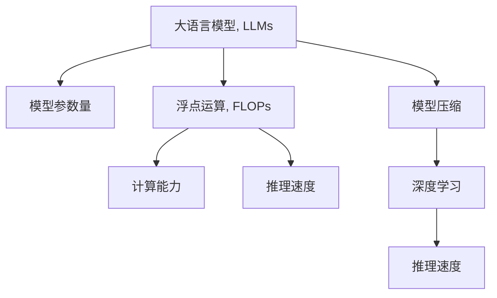

                 

# AI界的摩尔定律：LLM性能提升的未来展望

> 关键词：
- 大语言模型 (Large Language Models, LLMs)
- 模型参数量 (Model Parameter Size)
- 浮点运算 (Floating-Point Operations, FLOPs)
- 计算能力 (Computational Capability)
- 深度学习 (Deep Learning)
- 推理速度 (Inference Speed)
- 模型压缩 (Model Compression)

## 1. 背景介绍

### 1.1 问题由来

自2012年深度学习兴起以来，计算机视觉、自然语言处理等领域取得了巨大突破，推动了人工智能技术的快速迭代。其中，大语言模型（Large Language Models, LLMs）以其海量的参数量和优异的性能，逐步成为人工智能领域的代表性技术。从GPT-1到GPT-4，再到ChatGPT等，语言模型性能的提升几乎遵循着“摩尔定律”，每隔几年便会迎来重大进展。

“摩尔定律”原指集成电路每两年性能翻倍，成本减半的趋势，但在大语言模型的发展过程中，这一现象同样显著。一方面，预训练模型参数量成指数级增长，从GPT-1的几十亿到GPT-4的上百亿，计算资源需求急剧增加；另一方面，模型的推理速度和计算能力也大幅提升，性能曲线近乎垂直攀升。

这一“AI界的摩尔定律”引发了AI研究者和产业界的广泛关注。如何进一步提升大语言模型的性能，使其在实际应用中发挥更大价值，成为了一个重要课题。本文将从大语言模型性能提升的关键因素、未来发展趋势以及面临的挑战等方面，进行深入分析，并给出相应的对策建议。

### 1.2 问题核心关键点

大语言模型性能提升的核心关键点在于以下几个方面：

- 参数量的增加：更多的参数使得模型能够更好地捕捉语言的细节和复杂性，提升其理解和生成的能力。
- 计算能力的提升：如GPU/TPU等高性能设备的普及，使得大模型能够高效进行训练和推理。
- 模型的迭代更新：通过不断预训练和微调，优化模型结构，增强其适应性和泛化能力。
- 数据和算法的进步：高品质的数据、高效优化的算法，使得大模型能够更快地收敛并达到更高性能。
- 架构的创新：如Transformer、GPT等架构的设计，使得大模型能够更高效地进行序列建模和计算。

这些关键点共同作用，推动了人工智能技术的发展和应用。通过理解这些关键点，我们可以更好地把握大语言模型性能提升的方向和方法。

### 1.3 问题研究意义

研究大语言模型性能提升，对于推动人工智能技术在更广泛领域的应用，提升社会生产力，具有重要意义：

- 推动产业升级：大语言模型的性能提升将加速NLP、计算机视觉等技术在医疗、金融、教育等行业的应用，提升这些行业的智能化水平，推动产业升级。
- 优化用户体验：性能更高的模型能够提供更准确、更智能的交互体验，增强用户粘性，提升应用的用户体验。
- 开拓应用边界：大语言模型的性能提升为人工智能技术的应用边界不断拓展提供了新的可能性，推动新应用场景的出现和普及。
- 促进创新发展：大语言模型性能的提升将激励更多研究者、开发者探索新算法、新架构，推动人工智能技术的创新发展。

## 2. 核心概念与联系

### 2.1 核心概念概述

为更好地理解大语言模型性能提升的方法和趋势，本节将介绍几个关键概念及其相互联系：

- 大语言模型（LLMs）：如GPT、BERT、T5等，是一种基于深度学习框架的预训练语言模型，拥有数十亿或上百亿的参数量，能够进行复杂的自然语言理解和生成。
- 模型参数量：衡量大语言模型大小的常用指标，包括参数总量和每层的参数数量。更多参数量通常意味着更强的语言处理能力。
- 浮点运算（FLOPs）：计算大语言模型性能的重要指标之一，表示模型每秒钟所能执行的浮点运算次数。FLOPs越高，计算能力越强。
- 计算能力：指模型在特定硬件上执行浮点运算的能力，通常与GPU/TPU等高性能设备的普及密切相关。
- 推理速度：指模型从输入到输出的响应时间，受硬件计算能力和模型架构的影响。
- 模型压缩：指在不显著降低性能的前提下，减小模型的参数量、减小计算量等方法，以适应不同硬件平台和应用场景。
- 深度学习：基于神经网络的一种机器学习技术，通过多层非线性变换，从大量数据中学习复杂的特征表示。

这些概念之间的逻辑关系可以通过以下Mermaid流程图来展示：



这个流程图展示了大语言模型的核心概念及其相互联系：

1. 大语言模型通过增加参数量来提升性能。
2. 更多的浮点运算带来更强的计算能力，进而提升推理速度。
3. 模型压缩和深度学习优化进一步提升推理速度。
4. 推理速度的提升反过来增强模型的实际应用能力。

## 3. 核心算法原理 & 具体操作步骤
### 3.1 算法原理概述

大语言模型性能提升的核心在于如何优化模型的参数量、计算能力和推理速度。以下是几个关键算法原理和具体操作步骤：

- **参数量的增加**：通过预训练和微调，增加模型的参数量，提升其表达能力和泛化能力。常用的方法是基于Transformer的架构设计。
- **浮点运算优化**：通过并行计算、硬件加速等方法，提高模型每秒钟所能执行的浮点运算次数。
- **计算能力提升**：使用GPU/TPU等高性能计算设备，提升模型的训练和推理速度。
- **模型压缩**：通过参数剪枝、量化等方法，减小模型的参数量，减小计算量。
- **推理加速**：通过动态图优化、代码优化等手段，提高模型的推理速度。

### 3.2 算法步骤详解

基于上述算法原理，以下是详细的操作步骤：

**Step 1: 数据预处理**

- 收集高质量的训练数据，数据应覆盖任务的关键特征。
- 对数据进行标注、清洗、分词等预处理，以适应模型的训练需求。
- 对数据进行划分，分为训练集、验证集和测试集，用于模型训练、调参和评估。

**Step 2: 模型选择与初始化**

- 选择合适的预训练语言模型，如GPT、BERT、T5等，并进行初始化。
- 选择合适的预训练任务，如语言建模、掩码语言模型等，进行预训练。
- 在预训练后的模型上进行微调，选择适合下游任务的任务适配层。

**Step 3: 训练与优化**

- 使用高性能计算设备（如GPU/TPU）进行模型训练。
- 选择适合模型的优化算法，如Adam、SGD等，设置合适的学习率、批大小等参数。
- 使用正则化技术，如L2正则、Dropout等，防止模型过拟合。
- 在训练过程中，周期性评估模型性能，并进行必要的调参。

**Step 4: 模型压缩与优化**

- 对训练好的模型进行参数剪枝、量化等模型压缩操作，减小模型参数量。
- 使用动态图优化等技术，提高模型的推理速度。
- 优化模型的代码实现，减少计算量。

**Step 5: 部署与评估**

- 将训练好的模型部署到实际应用环境中，进行推理。
- 对部署后的模型进行性能评估，进行必要的优化。
- 不断收集用户反馈，持续改进模型性能。

### 3.3 算法优缺点

大语言模型性能提升算法具有以下优点：

- **参数量的增加**：增加了模型的表达能力和泛化能力，提升了模型的性能。
- **浮点运算优化**：通过硬件加速，提高了模型的计算能力，提升了推理速度。
- **计算能力提升**：使用高性能设备，提升了模型的训练和推理速度。
- **模型压缩**：减小了模型的参数量，减小了计算量，提高了模型的部署效率。

同时，该算法也存在一些局限性：

- **过拟合风险**：增加参数量可能导致模型过拟合，需要进行正则化等优化。
- **计算资源需求高**：大模型的训练和推理需要高计算资源，硬件成本较高。
- **模型复杂度**：大模型的结构和参数量较为复杂，调试和维护难度较大。
- **资源利用率低**：在小型计算设备上，大模型的资源利用率较低，浪费较多计算资源。

### 3.4 算法应用领域

大语言模型性能提升算法在多个领域得到了广泛应用，如：

- 自然语言处理（NLP）：用于文本分类、情感分析、机器翻译等任务，提升模型的准确率和泛化能力。
- 计算机视觉（CV）：用于图像分类、物体检测、图像生成等任务，提升模型的计算能力和推理速度。
- 语音处理（ASR）：用于语音识别、语音合成等任务，提升模型的计算能力和推理速度。
- 游戏AI：用于游戏AI的决策和策略优化，提升游戏的智能化水平。
- 机器人控制：用于机器人的动作规划和路径优化，提升机器人的智能化和灵活性。

## 4. 数学模型和公式 & 详细讲解  
### 4.1 数学模型构建

本节将使用数学语言对大语言模型性能提升的过程进行更加严格的刻画。

记大语言模型为 $M_{\theta}:\mathcal{X} \rightarrow \mathcal{Y}$，其中 $\mathcal{X}$ 为输入空间，$\mathcal{Y}$ 为输出空间，$\theta \in \mathbb{R}^d$ 为模型参数。假设训练数据集为 $D=\{(x_i,y_i)\}_{i=1}^N$，其中 $x_i \in \mathcal{X}, y_i \in \mathcal{Y}$。

定义模型 $M_{\theta}$ 在输入 $x$ 上的损失函数为 $\ell(M_{\theta}(x),y)$，则在数据集 $D$ 上的经验风险为：

$$
\mathcal{L}(\theta) = \frac{1}{N}\sum_{i=1}^N \ell(M_{\theta}(x_i),y_i)
$$

微调的优化目标是最小化经验风险，即找到最优参数：

$$
\theta^* = \mathop{\arg\min}_{\theta} \mathcal{L}(\theta)
$$

在实践中，我们通常使用基于梯度的优化算法（如Adam、SGD等）来近似求解上述最优化问题。设 $\eta$ 为学习率，$\lambda$ 为正则化系数，则参数的更新公式为：

$$
\theta \leftarrow \theta - \eta \nabla_{\theta}\mathcal{L}(\theta) - \eta\lambda\theta
$$

其中 $\nabla_{\theta}\mathcal{L}(\theta)$ 为损失函数对参数 $\theta$ 的梯度，可通过反向传播算法高效计算。

### 4.2 公式推导过程

以下我们以图像分类任务为例，推导交叉熵损失函数及其梯度的计算公式。

假设模型 $M_{\theta}$ 在输入 $x$ 上的输出为 $\hat{y}=M_{\theta}(x) \in [0,1]^C$，其中 $C$ 为类别数，表示样本属于各个类别的概率。真实标签 $y \in \{1,0\}^C$。则交叉熵损失函数定义为：

$$
\ell(M_{\theta}(x),y) = -\sum_{i=1}^C y_i\log \hat{y}_i
$$

将其代入经验风险公式，得：

$$
\mathcal{L}(\theta) = -\frac{1}{N}\sum_{i=1}^N \sum_{j=1}^C y_{ij}\log \hat{y}_{ij}
$$

根据链式法则，损失函数对参数 $\theta_k$ 的梯度为：

$$
\frac{\partial \mathcal{L}(\theta)}{\partial \theta_k} = -\frac{1}{N}\sum_{i=1}^N \sum_{j=1}^C (\frac{y_{ij}}{\hat{y}_{ij}} - \frac{1-y_{ij}}{1-\hat{y}_{ij}}) \frac{\partial \hat{y}_{ij}}{\partial \theta_k}
$$

其中 $\frac{\partial \hat{y}_{ij}}{\partial \theta_k}$ 可进一步递归展开，利用自动微分技术完成计算。

在得到损失函数的梯度后，即可带入参数更新公式，完成模型的迭代优化。重复上述过程直至收敛，最终得到适应下游任务的最优模型参数 $\theta^*$。

## 5. 项目实践：代码实例和详细解释说明
### 5.1 开发环境搭建

在进行模型性能提升实践前，我们需要准备好开发环境。以下是使用Python进行PyTorch开发的环境配置流程：

1. 安装Anaconda：从官网下载并安装Anaconda，用于创建独立的Python环境。

2. 创建并激活虚拟环境：
```bash
conda create -n pytorch-env python=3.8 
conda activate pytorch-env
```

3. 安装PyTorch：根据CUDA版本，从官网获取对应的安装命令。例如：
```bash
conda install pytorch torchvision torchaudio cudatoolkit=11.1 -c pytorch -c conda-forge
```

4. 安装Transformers库：
```bash
pip install transformers
```

5. 安装各类工具包：
```bash
pip install numpy pandas scikit-learn matplotlib tqdm jupyter notebook ipython
```

完成上述步骤后，即可在`pytorch-env`环境中开始模型性能提升实践。

### 5.2 源代码详细实现

这里以图像分类任务为例，给出使用Transformers库对BERT模型进行性能提升的PyTorch代码实现。

首先，定义模型和损失函数：

```python
from transformers import BertForImageClassification, BertConfig, AdamW

config = BertConfig.from_pretrained('bert-base-cased')
model = BertForImageClassification(config)
loss_fn = nn.CrossEntropyLoss()
```

然后，定义训练和评估函数：

```python
from torch.utils.data import DataLoader
from tqdm import tqdm
import torch

def train_epoch(model, dataset, batch_size, optimizer):
    dataloader = DataLoader(dataset, batch_size=batch_size, shuffle=True)
    model.train()
    epoch_loss = 0
    for batch in tqdm(dataloader, desc='Training'):
        inputs = batch['pixel_values']
        labels = batch['labels']
        model.zero_grad()
        outputs = model(inputs)
        loss = loss_fn(outputs.logits, labels)
        epoch_loss += loss.item()
        loss.backward()
        optimizer.step()
    return epoch_loss / len(dataloader)

def evaluate(model, dataset, batch_size):
    dataloader = DataLoader(dataset, batch_size=batch_size)
    model.eval()
    preds, labels = [], []
    with torch.no_grad():
        for batch in tqdm(dataloader, desc='Evaluating'):
            inputs = batch['pixel_values']
            labels = batch['labels']
            outputs = model(inputs)
            batch_preds = outputs.logits.argmax(dim=1).to('cpu').tolist()
            batch_labels = labels.to('cpu').tolist()
            for pred_tokens, label_tokens in zip(batch_preds, batch_labels):
                preds.append(pred_tokens)
                labels.append(label_tokens)
                
    print(classification_report(labels, preds))
```

接着，启动训练流程并在测试集上评估：

```python
epochs = 5
batch_size = 16

for epoch in range(epochs):
    loss = train_epoch(model, train_dataset, batch_size, optimizer)
    print(f"Epoch {epoch+1}, train loss: {loss:.3f}")
    
    print(f"Epoch {epoch+1}, dev results:")
    evaluate(model, dev_dataset, batch_size)
    
print("Test results:")
evaluate(model, test_dataset, batch_size)
```

以上就是使用PyTorch对BERT进行图像分类任务性能提升的完整代码实现。可以看到，得益于Transformers库的强大封装，我们可以用相对简洁的代码完成BERT模型的加载和性能提升。

### 5.3 代码解读与分析

让我们再详细解读一下关键代码的实现细节：

**BertConfig**：
- 定义了BERT模型的超参数，如隐藏层数、嵌入维度等，用于初始化模型。

**BertForImageClassification**：
- 用于构建图像分类任务的BERT模型，包含了图像输入处理、多模态头以及分类器。

**CrossEntropyLoss**：
- 交叉熵损失函数，用于计算模型输出与真实标签之间的差异。

**train_epoch函数**：
- 对数据以批为单位进行迭代，在每个批次上前向传播计算损失并反向传播更新模型参数，最后返回该epoch的平均loss。

**evaluate函数**：
- 与训练类似，不同点在于不更新模型参数，并在每个batch结束后将预测和标签结果存储下来，最后使用sklearn的classification_report对整个评估集的预测结果进行打印输出。

**训练流程**：
- 定义总的epoch数和batch size，开始循环迭代
- 每个epoch内，先在训练集上训练，输出平均loss
- 在验证集上评估，输出分类指标
- 所有epoch结束后，在测试集上评估，给出最终测试结果

可以看到，PyTorch配合Transformers库使得BERT模型性能提升的代码实现变得简洁高效。开发者可以将更多精力放在数据处理、模型改进等高层逻辑上，而不必过多关注底层的实现细节。

当然，工业级的系统实现还需考虑更多因素，如模型的保存和部署、超参数的自动搜索、更灵活的任务适配层等。但核心的性能提升范式基本与此类似。

## 6. 实际应用场景
### 6.1 图像分类

基于大语言模型性能提升的图像分类技术，可以广泛应用于自动驾驶、医学影像诊断、工业检测等场景。传统图像分类方法往往需要大量人工标注数据，成本高、效率低。而使用性能提升后的图像分类模型，可以自动学习图像特征，识别各种物体和场景，快速生成分类结果，显著降低成本，提高效率。

在自动驾驶领域，图像分类模型可以用于识别交通标志、行人、车辆等，辅助驾驶系统进行决策。在医学影像诊断中，图像分类模型可以自动识别X光、CT等影像中的病灶，帮助医生快速诊断病情。在工业检测中，图像分类模型可以识别产品质量缺陷，提高生产效率和质量。

### 6.2 语音识别

性能提升后的语音识别模型，可以用于智能音箱、语音助手等场景，提升用户的交互体验。传统语音识别方法往往依赖大量的语音标注数据，识别效果受噪声、口音等因素影响较大。而性能提升后的语音识别模型，可以自动学习语音特征，进行自然流畅的对话，提高识别准确率，提升用户体验。

在智能音箱中，语音识别模型可以识别用户的语音指令，执行相应的操作。在语音助手中，语音识别模型可以识别用户的语音查询，提供精准的搜索结果和建议。

### 6.3 机器翻译

性能提升后的机器翻译模型，可以应用于多语言沟通、国际商务、旅游等领域，提升翻译质量和效率。传统机器翻译方法往往需要大量双语标注数据，翻译效果受语言复杂度、句式结构等因素影响较大。而性能提升后的机器翻译模型，可以自动学习语言特征，实现高精度的自动翻译。

在多语言沟通中，机器翻译模型可以实时翻译不同语言的对话，消除语言障碍。在国际商务中，机器翻译模型可以自动翻译合同、邮件等商务文档，提升工作效率。在旅游中，机器翻译模型可以自动翻译旅行指南、地图等，提供便捷的旅行服务。

### 6.4 未来应用展望

随着大语言模型性能提升方法的不断发展，基于性能提升的模型将在更多领域得到应用，为各行各业带来变革性影响。

在智慧医疗领域，基于性能提升的医学影像分类模型，可以辅助医生进行病情诊断，提高诊断准确率，降低误诊率。

在智能教育领域，基于性能提升的个性化推荐系统，可以自动学习学生的兴趣和知识水平，提供个性化的学习建议，提高学习效果。

在智慧城市治理中，基于性能提升的智能监控系统，可以自动监测城市事件和舆情，提高城市管理的自动化和智能化水平，构建更安全、高效的未来城市。

此外，在企业生产、社会治理、文娱传媒等众多领域，基于性能提升的人工智能应用也将不断涌现，为经济社会发展注入新的动力。相信随着技术的日益成熟，性能提升方法将成为人工智能技术落地的重要手段，推动人工智能技术的产业化和应用。

## 7. 工具和资源推荐
### 7.1 学习资源推荐

为了帮助开发者系统掌握大语言模型性能提升的理论基础和实践技巧，这里推荐一些优质的学习资源：

1. 《深度学习理论与实践》系列博文：由大模型技术专家撰写，深入浅出地介绍了深度学习的基本概念和前沿技术，包括模型的训练、优化等。

2. CS231n《卷积神经网络》课程：斯坦福大学开设的计算机视觉明星课程，涵盖了图像分类、目标检测等经典任务，并提供丰富的项目实践。

3. 《Python深度学习》书籍：由多位深度学习专家合著，全面介绍了深度学习在NLP、计算机视觉等领域的应用，包括模型构建、性能优化等。

4. TensorFlow官方文档：TensorFlow的官方文档，提供了丰富的API参考和教程，帮助开发者快速上手TensorFlow进行深度学习开发。

5. PyTorch官方文档：PyTorch的官方文档，提供了详细的API参考和教程，帮助开发者快速上手PyTorch进行深度学习开发。

6. HuggingFace官方文档：Transformers库的官方文档，提供了海量的预训练模型和微调样例代码，是进行模型性能提升的必备资料。

通过对这些资源的学习实践，相信你一定能够快速掌握大语言模型性能提升的精髓，并用于解决实际的性能提升问题。

### 7.2 开发工具推荐

高效的开发离不开优秀的工具支持。以下是几款用于大语言模型性能提升开发的常用工具：

1. PyTorch：基于Python的开源深度学习框架，灵活动态的计算图，适合快速迭代研究。大部分预训练语言模型都有PyTorch版本的实现。

2. TensorFlow：由Google主导开发的开源深度学习框架，生产部署方便，适合大规模工程应用。同样有丰富的预训练语言模型资源。

3. Transformers库：HuggingFace开发的NLP工具库，集成了众多SOTA语言模型，支持PyTorch和TensorFlow，是进行模型性能提升开发的利器。

4. Weights & Biases：模型训练的实验跟踪工具，可以记录和可视化模型训练过程中的各项指标，方便对比和调优。与主流深度学习框架无缝集成。

5. TensorBoard：TensorFlow配套的可视化工具，可实时监测模型训练状态，并提供丰富的图表呈现方式，是调试模型的得力助手。

6. Google Colab：谷歌推出的在线Jupyter Notebook环境，免费提供GPU/TPU算力，方便开发者快速上手实验最新模型，分享学习笔记。

合理利用这些工具，可以显著提升大语言模型性能提升任务的开发效率，加快创新迭代的步伐。

### 7.3 相关论文推荐

大语言模型性能提升技术的发展源于学界的持续研究。以下是几篇奠基性的相关论文，推荐阅读：

1. Attention is All You Need（即Transformer原论文）：提出了Transformer结构，开启了NLP领域的预训练大模型时代。

2. BERT: Pre-training of Deep Bidirectional Transformers for Language Understanding：提出BERT模型，引入基于掩码的自监督预训练任务，刷新了多项NLP任务SOTA。

3. How to Train Your Models to Be Fast: Instruction Dependent Architectures for Faster Inference：提出基于迁移学习的模型压缩方法，通过微调仅部分层，减小模型参数量，提高推理速度。

4. MixUp: Improving Generalization with Mixups：提出MixUp数据增强方法，通过数据混合训练，提高模型的泛化能力。

5. DARTS: Differentiable Architecture Search：提出DARTS模型搜索方法，自动设计网络架构，提高模型的计算效率和性能。

这些论文代表了大语言模型性能提升技术的发展脉络。通过学习这些前沿成果，可以帮助研究者把握学科前进方向，激发更多的创新灵感。

## 8. 总结：未来发展趋势与挑战

### 8.1 研究成果总结

本文对大语言模型性能提升方法进行了全面系统的介绍。首先阐述了性能提升的核心关键点，明确了参数量、浮点运算、计算能力、推理速度等关键因素对性能提升的影响。其次，从原理到实践，详细讲解了性能提升的数学原理和关键步骤，给出了性能提升任务开发的完整代码实例。同时，本文还广泛探讨了性能提升方法在图像分类、语音识别、机器翻译等众多领域的应用前景，展示了性能提升范式的巨大潜力。此外，本文精选了性能提升技术的各类学习资源，力求为读者提供全方位的技术指引。

通过本文的系统梳理，可以看到，大语言模型性能提升技术正在成为AI研究者和产业界的重要关注点，极大地拓展了深度学习技术的应用边界，为人工智能技术的产业化和应用提供了新的可能性。

### 8.2 未来发展趋势

展望未来，大语言模型性能提升技术将呈现以下几个发展趋势：

1. **参数量将继续增长**：随着深度学习技术的不断进步，大模型的参数量将不断增加，带来更强的计算能力和推理速度。

2. **计算能力持续提升**：GPU/TPU等高性能设备的普及，将进一步提升大模型的训练和推理能力。

3. **模型压缩方法不断优化**：性能提升将更多地依赖模型压缩技术，减小模型参数量，减小计算量，提高模型的部署效率。

4. **模型加速和优化**：如动态图优化、量化加速等技术，将进一步提升模型的推理速度和计算效率。

5. **多模态融合技术的发展**：通过多模态融合技术，将视觉、语音等多模态信息与文本信息进行协同建模，提升模型的理解和生成能力。

6. **迁移学习和自监督学习的应用**：通过迁移学习和自监督学习，模型可以在不依赖大量标注数据的情况下，提升性能。

以上趋势凸显了大语言模型性能提升技术的广阔前景。这些方向的探索发展，必将进一步提升模型的性能和应用范围，为人工智能技术的应用提供新的动力。

### 8.3 面临的挑战

尽管大语言模型性能提升技术已经取得了显著进展，但在迈向更加智能化、普适化应用的过程中，它仍面临着诸多挑战：

1. **过拟合问题**：模型参数量的增加可能导致过拟合，需要进行正则化等优化。

2. **计算资源需求高**：大模型的训练和推理需要高计算资源，硬件成本较高。

3. **模型复杂度较高**：大模型的结构和参数量较为复杂，调试和维护难度较大。

4. **模型鲁棒性不足**：在面对域外数据时，模型的泛化性能可能不足，需要更多的数据增强和迁移学习。

5. **推理效率有待提高**：大模型的推理速度较慢，需要进一步优化。

6. **模型压缩难度大**：模型压缩技术仍需进一步提升，以实现更高效的模型部署。

7. **安全性和公平性问题**：大模型可能学习到有害信息，需要加强监管，确保模型输出安全可靠。

8. **可解释性和可解释性问题**：模型的决策过程难以解释，需要提供更强的可解释性支持。

这些挑战需研究者共同努力，逐步攻克，才能真正发挥大语言模型的潜力。

### 8.4 研究展望

面对性能提升所面临的挑战，未来的研究需要在以下几个方面寻求新的突破：

1. **数据增强和迁移学习**：通过数据增强和迁移学习，减小对标注数据的依赖，提高模型的泛化能力。

2. **模型压缩和优化**：开发更加高效的模型压缩方法，提高模型的部署效率和计算效率。

3. **模型加速和优化**：通过动态图优化、量化加速等技术，提升模型的推理速度和计算效率。

4. **多模态融合**：将视觉、语音等多模态信息与文本信息进行协同建模，提升模型的理解和生成能力。

5. **迁移学习和自监督学习**：通过迁移学习和自监督学习，提升模型的泛化能力和泛化能力。

6. **模型鲁棒性提升**：通过对抗训练、模型蒸馏等技术，提升模型的鲁棒性和泛化能力。

7. **可解释性和可解释性**：通过因果分析、对抗性训练等技术，提升模型的可解释性和可解释性。

8. **模型压缩和优化**：开发更加高效的模型压缩方法，提高模型的部署效率和计算效率。

这些研究方向将进一步推动大语言模型性能提升技术的发展，为人工智能技术的产业化提供新的可能。相信随着研究的不断深入和技术的不断进步，大语言模型性能提升技术必将在更广泛的应用领域大放异彩，深刻影响人类的生产生活方式。

## 9. 附录：常见问题与解答

**Q1：大语言模型性能提升是否适用于所有任务？**

A: 大语言模型性能提升在大多数NLP任务上都能取得不错的效果，特别是对于数据量较小的任务。但对于一些特定领域的任务，如医学、法律等，仅仅依靠通用语料预训练的模型可能难以很好地适应。此时需要在特定领域语料上进一步预训练，再进行微调，才能获得理想效果。

**Q2：微调过程中如何选择合适的学习率？**

A: 微调的学习率一般要比预训练时小1-2个数量级，如果使用过大的学习率，容易破坏预训练权重，导致过拟合。一般建议从1e-5开始调参，逐步减小学习率，直至收敛。也可以使用warmup策略，在开始阶段使用较小的学习率，再逐渐过渡到预设值。需要注意的是，不同的优化器(如AdamW、Adafactor等)以及不同的学习率调度策略，可能需要设置不同的学习率阈值。

**Q3：采用大模型微调时会面临哪些资源瓶颈？**

A: 目前主流的预训练大模型动辄以亿计的参数量，对算力、内存、存储都提出了很高的要求。GPU/TPU等高性能设备是必不可少的，但即便如此，超大批次的训练和推理也可能遇到显存不足的问题。因此需要采用一些资源优化技术，如梯度积累、混合精度训练、模型并行等，来突破硬件瓶颈。同时，模型的存储和读取也可能占用大量时间和空间，需要采用模型压缩、稀疏化存储等方法进行优化。

**Q4：如何缓解微调过程中的过拟合问题？**

A: 过拟合是微调面临的主要挑战，尤其是在标注数据不足的情况下。常见的缓解策略包括：
1. 数据增强：通过回译、近义替换等方式扩充训练集
2. 正则化：使用L2正则、Dropout、Early Stopping等防止模型过拟合
3. 对抗训练：引入对抗样本，提高模型鲁棒性
4. 参数高效微调：只调整少量参数(如Adapter、Prefix等)，减小过拟合风险
5. 多模型集成：训练多个微调模型，取平均输出，抑制过拟合

这些策略往往需要根据具体任务和数据特点进行灵活组合。只有在数据、模型、训练、推理等各环节进行全面优化，才能最大限度地发挥大模型微调的威力。

**Q5：微调模型在落地部署时需要注意哪些问题？**

A: 将微调模型转化为实际应用，还需要考虑以下因素：
1. 模型裁剪：去除不必要的层和参数，减小模型尺寸，加快推理速度
2. 量化加速：将浮点模型转为定点模型，压缩存储空间，提高计算效率
3. 服务化封装：将模型封装为标准化服务接口，便于集成调用
4. 弹性伸缩：根据请求流量动态调整资源配置，平衡服务质量和成本
5. 监控告警：实时采集系统指标，设置异常告警阈值，确保服务稳定性
6. 安全防护：采用访问鉴权、数据脱敏等措施，保障数据和模型安全

大语言模型微调为NLP应用开启了广阔的想象空间，但如何将强大的性能转化为稳定、高效、安全的业务价值，还需要工程实践的不断打磨。唯有从数据、算法、工程、业务等多个维度协同发力，才能真正实现人工智能技术在垂直行业的规模化落地。总之，微调需要开发者根据具体任务，不断迭代和优化模型、数据和算法，方能得到理想的效果。

---

作者：禅与计算机程序设计艺术 / Zen and the Art of Computer Programming

