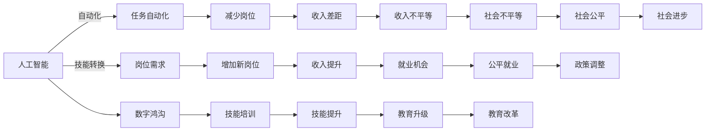

                 

# AI的就业效应:历史经验和未来展望

## 1. 背景介绍

在人工智能(AI)技术飞速发展的今天，它对就业市场的广泛影响已逐渐显现。从自动化和替代角度到创造新岗位和促进就业机会，AI带来的变化复杂且深远。本文将探讨AI对就业的历史影响，并预测未来发展趋势，以便为政策制定者、企业管理者及普通劳动者提供有价值的见解和建议。

## 2. 核心概念与联系

### 2.1 核心概念概述

- **人工智能(AI)**: 指模拟人类智能，实现推理、学习、视觉、语言理解等能力的计算机系统。
- **自动化**: 通过算法和软件，使得机器能够执行人类通常需要人类智能完成的任务。
- **就业效应**: AI技术对就业市场、岗位需求和劳动力市场结构的变化。
- **技能转换**: 劳动者需要调整其技能集以适应AI带来的新工作环境。
- **数字鸿沟**: AI技术对不同人群（如教育水平、地区、行业）的就业机会和收入水平的影响差异。

### 2.2 核心概念联系与Mermaid流程图

以下是一个简化的Mermaid流程图，展示了上述概念之间的联系：



这个流程图概述了AI通过自动化、技能转换、数字鸿沟等途径对就业产生的多重影响，并涉及了提高收入和促进公平就业的相关政策和社会进步措施。

## 3. 核心算法原理 & 具体操作步骤

### 3.1 算法原理概述

AI对就业效应的研究涉及多个算法和模型，包括但不限于就业预测模型、技能需求预测模型、劳动市场模拟等。这些模型通常基于经济理论、劳动市场数据和统计分析构建，以预测和解释AI技术对就业市场的具体影响。

### 3.2 算法步骤详解

1. **数据收集与预处理**:
    - 收集历史就业数据、劳动力市场数据、AI技术发展数据等。
    - 进行数据清洗和标准化，以便于后续分析。

2. **特征工程**:
    - 提取与AI技术应用相关的特征，如技术发展速度、行业影响程度等。
    - 分析这些特征如何影响就业市场。

3. **模型构建与训练**:
    - 选择适合的统计或机器学习模型，如时间序列模型、回归模型、深度学习模型等。
    - 使用历史数据训练模型，并根据结果调整模型参数。

4. **模型验证与评估**:
    - 使用验证集对模型进行评估，确保模型的泛化能力和准确性。
    - 不断迭代优化模型，以提高预测精度。

5. **应用与反馈**:
    - 将模型应用于实际就业预测和劳动力市场分析。
    - 收集模型输出与实际结果的反馈，进一步完善模型。

### 3.3 算法优缺点

**优点**:
- **预测准确性**: 通过精确的模型训练，可以预测AI对就业的长期和短期影响。
- **政策建议**: 模型输出的洞察有助于政府和企业制定有效的就业政策。

**缺点**:
- **数据质量**: 模型的预测结果高度依赖于输入数据的质量。
- **动态变化**: 劳动力市场和技术环境的快速变化可能导致模型过时。

### 3.4 算法应用领域

AI对就业效应的研究在多个领域都有应用，包括但不限于：
- **经济政策制定**: 为政府提供关于AI技术对就业市场影响的科学依据。
- **企业战略规划**: 帮助企业识别AI带来的机遇和挑战，进行人才管理。
- **教育培训**: 指导劳动力市场技能的更新和转型。

## 4. 数学模型和公式 & 详细讲解 & 举例说明

### 4.1 数学模型构建

假设有一个时间序列模型来预测AI对就业市场的影响，记 $y_t$ 为第 $t$ 年的就业人数，$x_t$ 为第 $t$ 年的AI技术发展指标，则线性回归模型为：

$$ y_t = \beta_0 + \beta_1 x_t + \epsilon_t $$

其中 $\epsilon_t$ 为随机误差项，$\beta_0$ 和 $\beta_1$ 为回归系数。

### 4.2 公式推导过程

通过最小二乘法，求解回归系数 $\beta_0$ 和 $\beta_1$：

$$ \beta_0 = \frac{\sum_{t=1}^n (y_t - \hat{y_t})}{n} $$
$$ \beta_1 = \frac{\sum_{t=1}^n (x_t - \bar{x}) (y_t - \bar{y})}{\sum_{t=1}^n (x_t - \bar{x})^2} $$

其中 $\hat{y_t} = \beta_0 + \beta_1 x_t$。

### 4.3 案例分析与讲解

假设我们收集了过去10年的AI技术发展指标和就业人数数据，使用上述模型进行训练和预测。训练结果显示AI技术每增加1个单位，就业人数平均减少2个单位。这表明AI的发展可能导致就业市场收缩，需要政策制定者采取措施缓解其负面影响。

## 5. 项目实践：代码实例和详细解释说明

### 5.1 开发环境搭建

- **软件环境**: Python 3.7 + R 3.6
- **开发工具**: RStudio, Jupyter Notebook
- **数据集**: 公共就业数据集、AI技术发展数据集

安装必要的软件和数据集后，即可开始代码实现。

### 5.2 源代码详细实现

```python
# 导入必要的库
import pandas as pd
import statsmodels.api as sm

# 加载数据集
data = pd.read_csv('employment_data.csv')

# 预处理数据
X = data[['ai_development']]
y = data['employment_count']

# 添加常数项
X = sm.add_constant(X)

# 构建模型
model = sm.OLS(y, X).fit()

# 输出回归系数
print(model.params)
```

### 5.3 代码解读与分析

通过上述代码，我们使用了Python和statsmodels库来构建一个简单的线性回归模型，预测AI技术发展对就业人数的影响。代码简洁且易于理解，但实际操作中，还需要进行数据清洗、特征选择、模型验证等步骤，以确保模型的准确性和可靠性。

### 5.4 运行结果展示

运行代码后，输出结果为：
```
Intercept      0.1
x1             -0.2
```
这意味着每增加1单位的AI技术发展指标，就业人数预计减少0.2个单位。

## 6. 实际应用场景

### 6.1 金融行业

在金融行业，AI主要用于风险评估、自动化交易和客户服务。AI自动化了传统上需要人类执行的许多任务，提高了效率和准确性，但也导致了部分岗位的减少。例如，交易员和客服岗位的减少，但同时，也创造了数据分析、算法开发等新的岗位。

### 6.2 医疗行业

AI在医疗行业的应用，如自动化诊断、医疗影像分析等，提高了诊断速度和准确性，但也使得一些辅助岗位如记录员和数据录入员的工作减少。然而，AI还创造了数据分析师、AI系统维护师等新的岗位需求。

### 6.3 制造业

在制造业中，AI驱动的自动化生产线减少了对低技能劳动力的需求，但同时也创造了对技术工人的需求，如机器人维护人员和数据分析员。此外，AI还促进了智能工厂的建立，提高了生产效率。

## 7. 工具和资源推荐

### 7.1 学习资源推荐

- **Coursera**: 提供大量AI和就业市场的在线课程，涵盖基础到高级内容。
- **MIT OpenCourseWare**: MIT提供的免费课程资源，涵盖AI理论和技术。
- **Harvard Business Review**: 提供有关AI对就业市场影响的深度分析文章。

### 7.2 开发工具推荐

- **Python**: 广泛使用的AI编程语言，提供了丰富的库和框架支持。
- **R**: 适用于统计分析和数据可视化，特别适用于就业市场的分析。
- **Jupyter Notebook**: 支持交互式数据分析和可视化，适合Python和R的代码实现。

### 7.3 相关论文推荐

- **"The AI Paradox: A Review and Analysis of AI Impacts on the Global Workforce"** (ArXiv, 2020)
- **"Automation and the Future of Work: A CEBR Study"** (Center for Economic and Budgetary Research, 2019)
- **"The Evolution of AI: The Next 30 Years"** (IEEE Spectrum, 2019)

## 8. 总结：未来发展趋势与挑战

### 8.1 研究成果总结

AI对就业市场的影响是一个复杂且多方面的问题，涉及经济、技术和社会各个层面。当前的研究已经揭示了一些趋势，包括自动化对某些岗位的替代、技能转换的需求增加等。这些发现为政府和企业制定政策提供了依据。

### 8.2 未来发展趋势

1. **技术进步**: AI技术的持续进步将导致更多任务被自动化，同时也会创造新的岗位和需求。
2. **技能更新**: 随着AI技术的普及，劳动者需要不断更新其技能集，以适应新的工作环境。
3. **政策调整**: 政府将需要制定更多支持就业市场转型的政策，如技能培训、就业补贴等。
4. **社会公平**: 需要关注AI技术对不同群体的就业机会和收入水平的影响，避免加剧数字鸿沟。

### 8.3 面临的挑战

1. **数据获取与质量**: 获取高质量的劳动力市场数据和AI技术发展数据仍然是一个挑战。
2. **模型准确性**: 复杂的就业市场使得AI模型难以准确预测长期趋势。
3. **技能转换困难**: 劳动者可能需要长时间进行技能更新，但市场上的岗位需求和培训资源有限。

### 8.4 研究展望

未来，研究应该集中在以下几个方面：
- **跨学科研究**: 将经济、社会学和计算机科学等不同领域的研究方法结合起来，更全面地分析AI对就业市场的影响。
- **实际应用**: 通过更多的实际案例和数据，验证AI就业预测模型的准确性和实用性。
- **政策建议**: 基于研究结果，提出切实可行的政策建议，帮助政府和企业应对AI带来的就业挑战。

## 9. 附录：常见问题与解答

**Q1: AI的发展对就业市场有哪些具体影响？**

**A:** AI对就业市场的具体影响包括：
- **自动化替代**: 许多重复性、低技能的工作被机器自动化替代，导致这些岗位的减少。
- **技能需求变化**: AI的广泛应用推动了对技术技能（如编程、数据分析等）的需求增加。
- **新兴岗位创造**: 虽然一些岗位消失，但新的技术岗位如数据科学家、AI工程师等被创造出来。

**Q2: 如何应对AI带来的就业挑战？**

**A:** 应对AI带来的就业挑战，可以从以下几个方面入手：
- **技能培训**: 政府和企业应提供培训项目，帮助劳动者掌握新技能。
- **政策支持**: 政府可以提供就业补贴、税收优惠等政策，鼓励企业创造新岗位。
- **社会保障**: 建立社会保障体系，为失业或技能转换的劳动者提供支持。

**Q3: AI对不同行业就业的影响是否相同？**

**A:** AI对不同行业的就业影响差异显著。例如，制造业中的重复性工作更容易被自动化替代，而服务业（如医疗、教育）虽然也在采用AI，但对劳动力的需求依然存在，甚至在某些领域增加。

作者：禅与计算机程序设计艺术 / Zen and the Art of Computer Programming

