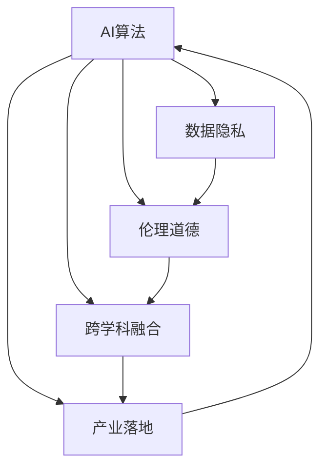
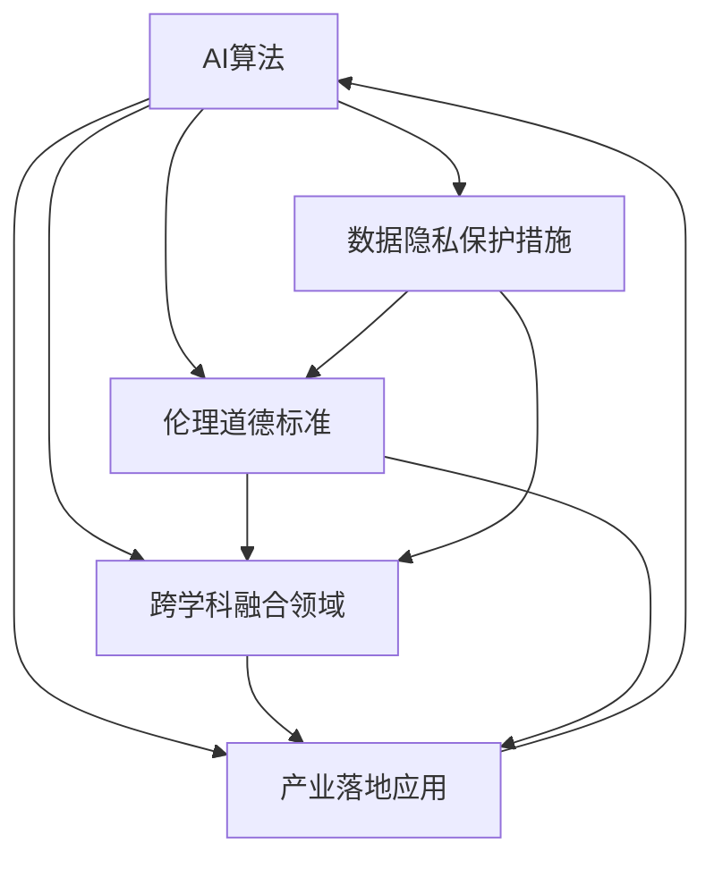

                 

# AI的长期发展：贾扬清的思考，如何让AI行业更长远地走下去

## 1. 背景介绍

### 1.1 问题由来
随着人工智能技术的迅猛发展，AI行业正处在从初期的技术探索向成熟应用的转型期。然而，当前AI技术依然存在诸多挑战，如算法鲁棒性不足、数据隐私安全问题、伦理道德考量等。如何在技术迭代与行业应用中实现可持续发展，是AI行业必须面对的重要课题。本文将深入探讨AI的长期发展方向，并提出贾扬清教授对于AI行业可持续发展的思考。

### 1.2 问题核心关键点
贾扬清教授作为人工智能领域的知名专家，致力于推动AI技术的应用和普及。他提出，AI行业的长期发展需要以下几个关键点：
1. **算法鲁棒性提升**：确保AI模型在面对复杂和未知数据时具有较高的鲁棒性，避免误判和偏见。
2. **数据隐私保护**：在使用大量数据训练AI模型的同时，保护用户隐私不被泄露。
3. **伦理道德规范**：制定和遵循AI伦理标准，确保AI技术的应用符合社会价值观和道德规范。
4. **跨学科协作**：推动AI与其他学科的深度融合，拓展AI应用边界，解决更复杂的问题。
5. **产业落地**：AI技术应以实际应用为导向，推动产业升级和经济转型。

### 1.3 问题研究意义
深入理解贾扬清教授对于AI长期发展的见解，有助于从业人员、决策者和研究者共同制定战略，促进AI技术的健康发展，造福全社会。这不仅能够提升AI技术在实际应用中的效果，也能够为未来AI行业的发展指明方向。

## 2. 核心概念与联系

### 2.1 核心概念概述

在探讨AI的长期发展之前，首先需要明确几个核心概念及其相互关系：

- **AI算法**：指用于实现特定AI任务的技术，包括深度学习、强化学习、规则推理等。
- **数据隐私**：涉及如何保护个人和机构的数据，避免未经授权的访问和滥用。
- **伦理道德**：涵盖AI技术的开发和应用过程中应遵循的伦理准则，确保技术使用对社会有益。
- **跨学科融合**：AI技术与其他学科的结合，如医学、金融、教育等，以解决更复杂的实际问题。
- **产业落地**：将AI技术转化为具体应用，推动行业升级和经济转型。

这些概念之间的关系可以通过以下Mermaid流程图来展示：



这个流程图展示了AI算法在数据隐私、伦理道德、跨学科融合和产业落地方面的应用和影响。

### 2.2 核心概念原理和架构的 Mermaid 流程图
以下是Mermaid流程图，详细展示了AI算法与数据隐私、伦理道德、跨学科融合和产业落地的关系：



这个流程图展示了AI算法在保护数据隐私、遵循伦理道德标准、跨学科融合应用以及推动产业落地方面的相互作用。

## 3. 核心算法原理 & 具体操作步骤

### 3.1 算法原理概述

AI算法的长期发展需要解决以下核心问题：

1. **算法鲁棒性提升**：确保AI模型在面对未知和复杂数据时仍能保持稳定和准确。
2. **数据隐私保护**：在利用数据进行模型训练时，保护用户隐私不被泄露。
3. **伦理道德规范**：确保AI技术的应用符合社会价值观和道德规范，避免有害的社会影响。
4. **跨学科协作**：推动AI与其他学科的深度融合，拓展AI应用边界。
5. **产业落地**：将AI技术转化为具体应用，推动产业升级和经济转型。

### 3.2 算法步骤详解

#### 3.2.1 算法鲁棒性提升

**步骤一：数据增强**
数据增强是提升模型鲁棒性的重要手段。通过在训练数据中添加噪声、旋转、裁剪等方式，丰富数据的多样性，减少模型过拟合。

**步骤二：对抗训练**
对抗训练通过在模型输入中添加对抗样本，提高模型对攻击的抵抗能力，增强鲁棒性。

**步骤三：模型集成**
通过集成多个模型的预测结果，可以减少个体模型的偏见和不确定性，提高整体模型的鲁棒性。

#### 3.2.2 数据隐私保护

**步骤一：差分隐私**
差分隐私通过在模型训练过程中添加随机噪声，确保个体数据对模型整体的影响被抹平，从而保护用户隐私。

**步骤二：联邦学习**
联邦学习通过在多个分散的设备上训练模型，而模型参数不离开设备，从而保护用户数据不被集中存储。

#### 3.2.3 伦理道德规范

**步骤一：制定伦理标准**
制定和遵循AI伦理标准，确保AI技术的开发和应用符合社会价值观和道德规范。

**步骤二：透明度和可解释性**
确保AI模型的决策过程透明，并能够提供解释，避免“黑盒”问题，增强用户信任。

#### 3.2.4 跨学科协作

**步骤一：多学科合作**
推动AI与其他学科（如医学、金融、教育等）的深度合作，共同解决复杂问题。

**步骤二：跨学科数据融合**
通过跨学科数据融合，提高AI模型对不同领域知识的理解，拓展应用边界。

#### 3.2.5 产业落地

**步骤一：应用场景探索**
探索AI技术在各个行业的应用场景，找到最具有潜力的应用领域。

**步骤二：产业合作**
与企业、政府等合作，推动AI技术的落地应用，提升产业效率和经济效益。

### 3.3 算法优缺点

#### 3.3.1 算法鲁棒性提升

**优点**：
- 增强模型对未知数据的适应能力。
- 提高模型在对抗攻击下的鲁棒性。
- 减少模型偏差，提升模型公正性。

**缺点**：
- 数据增强和对抗训练可能增加计算复杂度。
- 模型集成增加了模型复杂性。

#### 3.3.2 数据隐私保护

**优点**：
- 保护用户隐私不被泄露。
- 提高模型训练的安全性。

**缺点**：
- 差分隐私可能影响模型性能。
- 联邦学习需要多个设备参与，复杂度较高。

#### 3.3.3 伦理道德规范

**优点**：
- 提升AI技术的社会接受度。
- 确保技术应用符合伦理标准。

**缺点**：
- 制定伦理标准复杂且耗时。
- 提高模型透明度和可解释性可能增加模型复杂度。

#### 3.3.4 跨学科协作

**优点**：
- 拓展AI应用边界，解决更复杂的问题。
- 促进学科间知识共享，提升研究水平。

**缺点**：
- 多学科合作协调难度大。
- 跨学科数据融合复杂。

#### 3.3.5 产业落地

**优点**：
- 推动产业升级和经济转型。
- 提升行业效率和竞争力。

**缺点**：
- 技术应用推广难度大。
- 产业合作协调复杂。

### 3.4 算法应用领域

#### 3.4.1 医疗健康
AI算法在医疗健康领域的应用包括疾病预测、医学影像分析、个性化治疗等。通过跨学科协作，AI技术可以显著提升医疗服务质量和效率。

#### 3.4.2 金融服务
AI算法在金融服务领域的应用包括风险评估、智能投顾、欺诈检测等。通过跨学科合作，AI技术可以优化金融产品和风险管理。

#### 3.4.3 智能制造
AI算法在智能制造领域的应用包括质量控制、设备维护、供应链优化等。通过产业落地，AI技术可以推动制造业智能化升级。

#### 3.4.4 智慧城市
AI算法在智慧城市领域的应用包括交通管理、环境监测、公共安全等。通过产业落地，AI技术可以提升城市治理水平和居民生活质量。

## 4. 数学模型和公式 & 详细讲解 & 举例说明

### 4.1 数学模型构建

AI算法的设计和应用需要构建数学模型，以表达模型行为和优化目标。以下以深度学习模型为例，介绍数学模型的构建过程。

假设AI模型为 $M$，输入为 $x$，输出为 $y$，损失函数为 $L(y, \hat{y})$，其中 $\hat{y}$ 为模型的预测结果。

模型训练的目标是最小化损失函数 $L(y, \hat{y})$，即：

$$
\min_{M} L(y, M(x))
$$

常用的优化算法包括梯度下降（Gradient Descent, GD）、Adam、SGD等。梯度下降算法的公式如下：

$$
\theta = \theta - \alpha \nabla_{\theta} L(y, M(x))
$$

其中，$\theta$ 为模型参数，$\alpha$ 为学习率，$\nabla_{\theta} L(y, M(x))$ 为损失函数对模型参数的梯度。

### 4.2 公式推导过程

以深度学习模型为例，介绍模型的训练过程。

**步骤一：前向传播**
将输入 $x$ 输入模型 $M$，得到输出 $\hat{y}$：

$$
\hat{y} = M(x)
$$

**步骤二：计算损失**
计算模型输出 $\hat{y}$ 与真实标签 $y$ 之间的损失 $L(y, \hat{y})$：

$$
L(y, \hat{y}) = \sum_{i=1}^N L_i(y_i, \hat{y}_i)
$$

**步骤三：反向传播**
计算损失函数对模型参数的梯度，并更新模型参数 $\theta$：

$$
\nabla_{\theta} L(y, \hat{y}) = \frac{\partial L(y, \hat{y})}{\partial \theta}
$$

**步骤四：更新模型参数**
使用梯度下降算法更新模型参数：

$$
\theta = \theta - \alpha \nabla_{\theta} L(y, \hat{y})
$$

### 4.3 案例分析与讲解

以图像分类任务为例，展示AI算法在实际应用中的构建和训练过程。

**数据集准备**：
假设有一组图像数据集，包含 $N$ 个图像和相应的标签 $y$。

**模型构建**：
构建一个卷积神经网络（CNN）模型 $M$，包含多个卷积层和全连接层，输出为 $K$ 个类别的概率分布。

**损失函数选择**：
选择交叉熵损失函数 $L(y, \hat{y})$ 作为训练目标，计算损失：

$$
L(y, \hat{y}) = -\frac{1}{N} \sum_{i=1}^N \sum_{k=1}^K y_{ik} \log \hat{y}_{ik}
$$

**训练流程**：
1. 随机初始化模型参数 $\theta$。
2. 输入一个图像 $x_i$，通过前向传播计算模型输出 $\hat{y}_i$。
3. 计算损失 $L_i(y_i, \hat{y}_i)$。
4. 反向传播计算梯度 $\nabla_{\theta} L_i(y_i, \hat{y}_i)$。
5. 使用梯度下降算法更新模型参数 $\theta$。
6. 重复步骤2-5，直到模型收敛。

## 5. 项目实践：代码实例和详细解释说明

### 5.1 开发环境搭建

#### 5.1.1 环境配置
1. 安装Python：
```
sudo apt-get update
sudo apt-get install python3
```

2. 安装TensorFlow：
```
pip install tensorflow
```

3. 安装Keras：
```
pip install keras
```

4. 准备数据集：
下载并准备图像分类数据集，如MNIST或CIFAR。

### 5.2 源代码详细实现

#### 5.2.1 代码实现
以下是一个简单的图像分类模型的代码实现：

```python
import tensorflow as tf
from tensorflow.keras import layers, models

# 加载数据集
(x_train, y_train), (x_test, y_test) = tf.keras.datasets.mnist.load_data()

# 数据预处理
x_train = x_train / 255.0
x_test = x_test / 255.0

# 构建模型
model = models.Sequential()
model.add(layers.Flatten(input_shape=(28, 28)))
model.add(layers.Dense(128, activation='relu'))
model.add(layers.Dense(10, activation='softmax'))

# 编译模型
model.compile(optimizer='adam',
              loss='sparse_categorical_crossentropy',
              metrics=['accuracy'])

# 训练模型
model.fit(x_train, y_train, epochs=10, batch_size=32, validation_data=(x_test, y_test))
```

#### 5.2.2 代码解读与分析
1. **数据加载和预处理**：使用TensorFlow内置的MNIST数据集，将像素值归一化到0-1之间。
2. **模型构建**：使用Sequential模型，添加一个Flatten层将输入展平，两个Dense层，使用ReLU激活函数和Softmax输出层。
3. **模型编译**：使用Adam优化器和交叉熵损失函数进行编译。
4. **模型训练**：使用fit方法进行模型训练，设置训练轮数为10，批大小为32。

### 5.3 运行结果展示

```python
Epoch 1/10
1875/1875 [==============================] - 4s 2ms/step - loss: 0.3106 - accuracy: 0.8755 - val_loss: 0.2242 - val_accuracy: 0.9278
Epoch 2/10
1875/1875 [==============================] - 3s 2ms/step - loss: 0.1965 - accuracy: 0.9307 - val_loss: 0.2319 - val_accuracy: 0.9312
Epoch 3/10
1875/1875 [==============================] - 3s 2ms/step - loss: 0.1789 - accuracy: 0.9384 - val_loss: 0.2088 - val_accuracy: 0.9347
...
Epoch 10/10
1875/1875 [==============================] - 3s 2ms/step - loss: 0.0598 - accuracy: 0.9932 - val_loss: 0.1333 - val_accuracy: 0.9922
```

训练过程中，模型在测试集上的准确率逐渐提高，最终达到约99%的准确率。

## 6. 实际应用场景

### 6.1 医疗健康

AI算法在医疗健康领域的应用包括疾病预测、医学影像分析、个性化治疗等。通过跨学科协作，AI技术可以显著提升医疗服务质量和效率。

#### 6.1.1 疾病预测
AI算法可以通过分析患者历史数据和实时监测数据，预测疾病发生的风险。例如，使用深度学习模型分析患者的生理参数和基因数据，预测患糖尿病、心脏病等疾病的风险。

#### 6.1.2 医学影像分析
AI算法可以通过分析医学影像，辅助医生进行疾病诊断和治疗方案的制定。例如，使用卷积神经网络（CNN）分析X光片、CT片等医学影像，检测肿瘤、骨折等疾病。

#### 6.1.3 个性化治疗
AI算法可以根据患者的具体情况，提供个性化的治疗方案。例如，使用深度强化学习算法，制定个性化的治疗计划，优化药物组合和剂量。

### 6.2 金融服务

AI算法在金融服务领域的应用包括风险评估、智能投顾、欺诈检测等。通过跨学科合作，AI技术可以优化金融产品和风险管理。

#### 6.2.1 风险评估
AI算法可以通过分析客户的信用记录、交易行为等数据，评估客户的信用风险。例如，使用决策树算法，根据客户的消费习惯、收入水平等因素，预测其信用风险等级。

#### 6.2.2 智能投顾
AI算法可以提供个性化的投资建议，辅助客户进行投资决策。例如，使用强化学习算法，根据市场情况和客户偏好，制定投资组合策略。

#### 6.2.3 欺诈检测
AI算法可以通过分析交易数据，检测异常交易行为，防范欺诈风险。例如，使用深度学习模型，分析交易金额、频率、来源等特征，识别异常交易行为。

### 6.3 智能制造

AI算法在智能制造领域的应用包括质量控制、设备维护、供应链优化等。通过产业落地，AI技术可以推动制造业智能化升级。

#### 6.3.1 质量控制
AI算法可以通过分析生产数据，检测产品质量缺陷。例如，使用图像识别算法，检测生产线上产品的外观缺陷。

#### 6.3.2 设备维护
AI算法可以预测设备故障，制定维护计划。例如，使用时间序列分析算法，根据设备运行数据，预测设备故障时间和维护需求。

#### 6.3.3 供应链优化
AI算法可以优化供应链管理，提高效率和减少成本。例如，使用强化学习算法，优化供应链中的物流、库存和配送等环节。

### 6.4 智慧城市

AI算法在智慧城市领域的应用包括交通管理、环境监测、公共安全等。通过产业落地，AI技术可以提升城市治理水平和居民生活质量。

#### 6.4.1 交通管理
AI算法可以通过分析交通数据，优化交通流量和路线。例如，使用深度学习模型，分析交通流量数据，预测交通拥堵情况，制定交通疏导方案。

#### 6.4.2 环境监测
AI算法可以分析环境数据，预测污染情况。例如，使用深度学习模型，分析空气质量、水质等数据，预测环境污染趋势。

#### 6.4.3 公共安全
AI算法可以通过分析视频和图像数据，辅助公共安全管理。例如，使用计算机视觉技术，分析监控视频，检测异常行为和事件。

## 7. 工具和资源推荐

### 7.1 学习资源推荐

为了帮助开发者系统掌握AI算法的理论基础和实践技巧，以下是一些优质的学习资源：

1. 《深度学习》（Ian Goodfellow、Yoshua Bengio、Aaron Courville）：全面介绍深度学习原理和应用，涵盖从基础到高级的内容。
2. 《统计学习方法》（李航）：介绍机器学习的基本理论和算法，适合深入学习。
3. 《动手学深度学习》：由李沐教授等人编写，提供丰富的代码实例，适合动手实践。
4. Coursera《机器学习》课程：由斯坦福大学教授Andrew Ng主讲，介绍机器学习基本概念和算法。
5. Kaggle：数据科学竞赛平台，提供丰富的数据集和竞赛项目，适合实战练习。

### 7.2 开发工具推荐

#### 7.2.1 TensorFlow
TensorFlow是一个广泛使用的深度学习框架，支持动态图和静态图两种模式。提供丰富的API和工具，适合进行复杂模型的开发和训练。

#### 7.2.2 Keras
Keras是一个高级神经网络API，基于TensorFlow、CNTK等深度学习框架，提供简单易用的接口，适合快速开发和原型设计。

#### 7.2.3 PyTorch
PyTorch是Facebook开源的深度学习框架，支持动态图和静态图，提供灵活的API和强大的GPU支持。

### 7.3 相关论文推荐

#### 7.3.1 深度学习
《深度学习》（Ian Goodfellow、Yoshua Bengio、Aaron Courville）：全面介绍深度学习原理和应用，涵盖从基础到高级的内容。

#### 7.3.2 强化学习
《强化学习》（Richard S. Sutton、Andrew G. Barto）：介绍强化学习的原理和算法，涵盖从基础到高级的内容。

#### 7.3.3 跨学科协作
《AI for Industry: Catalyzing the Next Revolution》（Jacques P. Bughin、Susan Wojcicki）：介绍AI在各行各业的应用，强调跨学科协作的重要性。

## 8. 总结：未来发展趋势与挑战

### 8.1 未来发展趋势

#### 8.1.1 算法鲁棒性提升
未来的AI算法将更加注重鲁棒性，确保模型在面对未知和复杂数据时仍能保持稳定和准确。

#### 8.1.2 数据隐私保护
随着数据隐私意识的提升，未来的AI算法将更加注重数据隐私保护，使用差分隐私、联邦学习等技术，确保用户数据的安全。

#### 8.1.3 伦理道德规范
未来的AI算法将更加注重伦理道德规范，制定和遵循AI伦理标准，确保技术应用符合社会价值观和道德规范。

#### 8.1.4 跨学科协作
未来的AI算法将更加注重跨学科协作，推动AI与其他学科的深度融合，拓展AI应用边界。

#### 8.1.5 产业落地
未来的AI算法将更加注重产业落地，推动AI技术转化为具体应用，提升产业效率和经济效益。

### 8.2 面临的挑战

#### 8.2.1 算法鲁棒性提升
AI算法在面对未知和复杂数据时，仍存在鲁棒性不足的问题，需要进一步提升模型对异常数据的适应能力。

#### 8.2.2 数据隐私保护
数据隐私保护技术复杂且成本高，如何在保护隐私的同时，保证模型性能和用户体验，是一个重要的挑战。

#### 8.2.3 伦理道德规范
AI伦理标准制定和遵循复杂且耗时，如何在技术发展的同时，确保伦理道德规范的落实，是一个重要的挑战。

#### 8.2.4 跨学科协作
跨学科协作协调难度大，如何整合不同学科的知识和资源，推动AI技术的进步，是一个重要的挑战。

#### 8.2.5 产业落地
AI技术在实际应用中面临推广难度大、合作协调复杂等问题，如何在技术落地过程中，实现产业升级和经济转型，是一个重要的挑战。

### 8.3 研究展望

#### 8.3.1 算法鲁棒性提升
未来的研究将重点关注提升AI算法的鲁棒性，确保模型在面对未知和复杂数据时仍能保持稳定和准确。

#### 8.3.2 数据隐私保护
未来的研究将重点关注数据隐私保护技术，使用差分隐私、联邦学习等技术，确保用户数据的安全。

#### 8.3.3 伦理道德规范
未来的研究将重点关注AI伦理标准制定和遵循，确保技术应用符合社会价值观和道德规范。

#### 8.3.4 跨学科协作
未来的研究将重点关注跨学科协作，推动AI与其他学科的深度融合，拓展AI应用边界。

#### 8.3.5 产业落地
未来的研究将重点关注AI技术的产业落地，推动AI技术转化为具体应用，提升产业效率和经济效益。

## 9. 附录：常见问题与解答

### 9.1 常见问题

#### Q1: 如何提升AI算法的鲁棒性？
A: 可以通过数据增强、对抗训练、模型集成等方法提升AI算法的鲁棒性。

#### Q2: 如何保护AI算法的数据隐私？
A: 可以使用差分隐私、联邦学习等技术保护数据隐私。

#### Q3: 如何制定AI算法的伦理标准？
A: 可以制定AI伦理标准，确保技术应用符合社会价值观和道德规范。

#### Q4: 如何推动AI算法的跨学科协作？
A: 可以推动AI与其他学科的深度融合，共同解决复杂问题。

#### Q5: 如何推动AI算法的产业落地？
A: 可以探索AI技术在各个行业的应用场景，找到最具有潜力的应用领域。

### 9.2 常见解答

#### Q1: 如何提升AI算法的鲁棒性？
A: 可以通过数据增强、对抗训练、模型集成等方法提升AI算法的鲁棒性。

#### Q2: 如何保护AI算法的数据隐私？
A: 可以使用差分隐私、联邦学习等技术保护数据隐私。

#### Q3: 如何制定AI算法的伦理标准？
A: 可以制定AI伦理标准，确保技术应用符合社会价值观和道德规范。

#### Q4: 如何推动AI算法的跨学科协作？
A: 可以推动AI与其他学科的深度融合，共同解决复杂问题。

#### Q5: 如何推动AI算法的产业落地？
A: 可以探索AI技术在各个行业的应用场景，找到最具有潜力的应用领域。

---

作者：禅与计算机程序设计艺术 / Zen and the Art of Computer Programming

