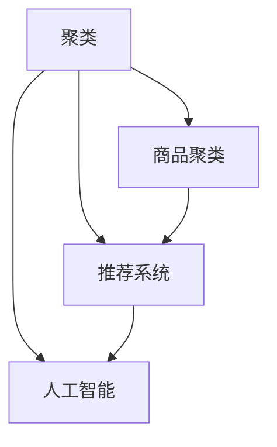

                 

# AI赋能的电商平台商品聚类技术

> 关键词：电商平台,商品聚类,推荐系统,人工智能,聚类算法

## 1. 背景介绍

### 1.1 问题由来

随着互联网电商的飞速发展，全球电商交易额呈现指数级增长。例如，2020年全球电商市场交易额超过4万亿美元，较2019年增长了近12%。随着电商市场的饱和，竞争日益激烈，如何提升用户体验，增加用户粘性，实现平台收入的持续增长，成为各大电商平台共同面临的难题。

在激烈的市场竞争中，一个高效的商品推荐系统显得尤为重要。推荐系统通过深入分析用户行为，预测用户兴趣，向用户推荐符合其需求的商品，提升用户购买概率和消费体验。在各类推荐算法中，商品聚类算法因其简单易用、效果显著，成为了众多电商平台的首选。

商品聚类算法能够将商品按照相似度进行划分，使得相同类别的商品拥有相似的特征，从而便于进行推荐。例如，同一类别的商品在颜色、材质、风格等方面可能存在较大相似性，方便用户寻找适合自己的商品。因此，商品聚类技术在电商平台中被广泛应用，以实现商品个性化推荐。

### 1.2 问题核心关键点

商品聚类算法的核心在于如何高效、准确地划分商品类别，提升聚类结果的精确度和用户满意度。本文将深入探讨商品聚类算法的基本原理，并详细介绍其实现步骤和优缺点，同时展望其未来应用前景。

## 2. 核心概念与联系

### 2.1 核心概念概述

为更好地理解商品聚类算法，本节将介绍几个密切相关的核心概念：

- 聚类(Clustering)：将数据划分为若干个子集，使得同一子集内的数据具有较大的相似度，不同子集间的数据具有较小的相似度。
- 商品聚类(Merchandise Clustering)：在电商平台中，将商品划分为不同的类别，使得相同类别的商品具有相似的特征。
- 推荐系统(Recommendation System)：根据用户行为和商品特征，向用户推荐可能感兴趣的物品。
- 人工智能(AI)：利用机器学习和深度学习等技术，实现自动化的数据处理和决策分析，提升系统性能。

这些概念之间的逻辑关系可以通过以下Mermaid流程图来展示：



这个流程图展示了两者的核心概念及其之间的关系：

1. 聚类是一种通用的数据划分方法，广泛应用于各类数据处理任务。
2. 商品聚类是聚类算法在电商平台中的具体应用，通过将商品划分为不同类别，提升推荐系统的效果。
3. 推荐系统是基于用户行为和商品特征进行推荐的技术，是电商平台的核心竞争力。
4. 人工智能通过机器学习和深度学习技术，为推荐系统提供算法支持，提升系统效果。

## 3. 核心算法原理 & 具体操作步骤

### 3.1 算法原理概述

商品聚类算法的核心思想是通过对商品的特征进行度量，将相似度高的商品划分到同一类别中。常见的聚类算法包括K-means、层次聚类、DBSCAN等。在电商平台中，一般采用基于相似度矩阵的聚类方法，如K-means算法。

假设电商平台上共有$m$个商品，每个商品的特征向量为$d$维，即$x_{i} \in \mathbb{R}^{d}$。设$K$为聚类数目，商品特征矩阵表示为$X \in \mathbb{R}^{m \times d}$。商品聚类的目标是通过计算商品之间的相似度，将$m$个商品划分为$K$个类别。其中，相似度矩阵$S \in \mathbb{R}^{m \times m}$表示商品间的相似度，一般采用欧式距离、余弦相似度等度量方式。

### 3.2 算法步骤详解

商品聚类的基本步骤包括：

**Step 1: 特征提取和预处理**

首先，需要对商品特征进行提取和预处理。商品的特征可以包括价格、品牌、类别、颜色、材质等。通过特征提取，将商品的各类特征信息转化为数值形式，供聚类算法使用。

对于电商平台的商品特征，一般采用如下步骤进行预处理：

- **去噪**：去除商品特征中的噪声，保留有意义的特征。例如，去除商品的无效信息，如商品ID、订单号等。
- **归一化**：对商品特征进行归一化处理，使其符合相同的分布。例如，使用min-max归一化，将特征值映射到[0,1]区间。
- **特征选择**：选择对聚类效果影响较大的特征，去除无关的特征。例如，使用方差分析、信息增益等方法进行特征选择。

**Step 2: 计算相似度矩阵**

然后，计算商品之间的相似度矩阵。设商品$i$和商品$j$之间的相似度为$S_{ij}$，可以采用欧式距离、余弦相似度、皮尔逊相关系数等度量方式。例如，采用欧式距离时，相似度计算公式为：

$$
S_{ij} = \frac{1}{\sqrt{\sum_{k=1}^{d}(x_{ik}-x_{jk})^2}}
$$

其中，$x_{ik}$和$x_{jk}$分别为商品$i$和商品$j$在第$k$个特征上的值。

**Step 3: 初始化聚类中心**

接下来，需要初始化聚类中心。一般采用随机初始化或K-means++算法。K-means++算法通过从数据中选择最具代表性的样本作为初始聚类中心，避免陷入局部最优解。

假设初始聚类中心为$C_1, C_2, \ldots, C_K \in \mathbb{R}^{d}$，其中$C_k$表示第$k$个聚类中心。

**Step 4: 分配商品到聚类**

通过计算每个商品与聚类中心的距离，将商品分配到最近的聚类中心。设商品$i$属于第$k$个聚类中心，计算公式为：

$$
k_i = \arg \min_k \frac{1}{\sqrt{\sum_{j=1}^{m}(S_{ij})^2}}
$$

**Step 5: 更新聚类中心**

将分配到同一聚类中心的所有商品平均表示，作为新的聚类中心。设商品$i$分配到第$k$个聚类，其新聚类中心为$C_k$，计算公式为：

$$
C_k = \frac{1}{\sum_{i=1}^{m}I(k_i=k)} \sum_{i=1}^{m}x_i \cdot I(k_i=k)
$$

其中$I$为指示函数，$I(k_i=k)=1$表示商品$i$属于第$k$个聚类。

**Step 6: 迭代更新**

重复步骤4和步骤5，直到聚类中心不再变化或达到预设的迭代次数。例如，当聚类中心变化小于预设阈值或迭代次数达到预设值时，聚类过程结束。

### 3.3 算法优缺点

商品聚类算法具有以下优点：

1. **简单易用**：算法步骤简单，易于实现和维护。
2. **效果显著**：通过将相似的商品划分到同一类别中，提升推荐系统的准确性和用户体验。
3. **灵活性高**：适用于各种商品特征和商品规模，易于扩展和优化。
4. **计算高效**：在商品规模较大时，依然具有较好的计算效率。

同时，该算法也存在一些缺点：

1. **聚类结果受初始值影响**：初始聚类中心的选取对聚类结果影响较大，可能导致局部最优解。
2. **敏感于参数选择**：需要选择合适的聚类数目和相似度度量方式，否则影响聚类结果。
3. **难以处理复杂特征**：对于复杂特征，例如文本特征、图像特征，需要进行预处理和特征表示。
4. **处理噪声能力较弱**：对于存在噪声的特征，可能导致聚类结果不准确。

尽管存在这些局限性，商品聚类算法依然在电商平台中得到广泛应用，并取得显著效果。

### 3.4 算法应用领域

商品聚类算法在电商平台中具有广泛的应用，包括：

- **商品分类**：将商品按照类别进行划分，便于用户浏览和查找。
- **个性化推荐**：通过聚类将相似商品划分到同一类别中，提升推荐系统的准确性和用户满意度。
- **搜索优化**：根据用户查询词进行商品聚类，优化搜索结果排序，提升搜索体验。
- **库存管理**：通过聚类分析库存商品，优化库存结构，减少库存积压。
- **用户画像**：根据用户行为进行聚类，分析用户兴趣和消费习惯，进行精准营销。

除了电商平台，商品聚类算法还应用于物流、零售、供应链管理等领域，具有广泛的应用前景。

## 4. 数学模型和公式 & 详细讲解  
### 4.1 数学模型构建

在本节中，我们将详细阐述商品聚类算法的数学模型构建。

假设电商平台上共有$m$个商品，每个商品的特征向量为$d$维，即$x_{i} \in \mathbb{R}^{d}$。设$K$为聚类数目，商品特征矩阵表示为$X \in \mathbb{R}^{m \times d}$。商品聚类的目标是通过计算商品之间的相似度，将$m$个商品划分为$K$个类别。其中，相似度矩阵$S \in \mathbb{R}^{m \times m}$表示商品间的相似度，一般采用欧式距离、余弦相似度、皮尔逊相关系数等度量方式。

假设初始聚类中心为$C_1, C_2, \ldots, C_K \in \mathbb{R}^{d}$，其中$C_k$表示第$k$个聚类中心。设商品$i$和商品$j$之间的相似度为$S_{ij}$，可以采用欧式距离、余弦相似度、皮尔逊相关系数等度量方式。

### 4.2 公式推导过程

在本节中，我们将详细介绍商品聚类算法的核心公式推导。

**Step 1: 特征提取和预处理**

假设商品特征提取后的数值为$x_{ik}$，其中$k=1,2,\ldots,d$。对于欧式距离，商品$i$和商品$j$之间的相似度计算公式为：

$$
S_{ij} = \frac{1}{\sqrt{\sum_{k=1}^{d}(x_{ik}-x_{jk})^2}}
$$

**Step 2: 初始化聚类中心**

假设初始聚类中心为$C_1, C_2, \ldots, C_K \in \mathbb{R}^{d}$，其中$C_k$表示第$k$个聚类中心。设商品$i$和聚类中心$C_k$之间的距离为$D_{ik}$，计算公式为：

$$
D_{ik} = \sqrt{\sum_{k=1}^{d}(x_{ik}-C_k)^2}
$$

**Step 3: 分配商品到聚类**

通过计算每个商品与聚类中心的距离，将商品分配到最近的聚类中心。设商品$i$属于第$k$个聚类中心，计算公式为：

$$
k_i = \arg \min_k D_{ik}
$$

**Step 4: 更新聚类中心**

将分配到同一聚类中心的所有商品平均表示，作为新的聚类中心。设商品$i$分配到第$k$个聚类，其新聚类中心为$C_k$，计算公式为：

$$
C_k = \frac{1}{\sum_{i=1}^{m}I(k_i=k)} \sum_{i=1}^{m}x_i \cdot I(k_i=k)
$$

**Step 5: 迭代更新**

重复步骤4和步骤5，直到聚类中心不再变化或达到预设的迭代次数。例如，当聚类中心变化小于预设阈值或迭代次数达到预设值时，聚类过程结束。

### 4.3 案例分析与讲解

在本节中，我们将通过一个具体案例，详细阐述商品聚类算法的应用过程。

假设某电商平台有$m=100$个商品，每个商品的特征向量为$d=3$维，即价格、品牌、类别。设$K=3$，即需要将其划分为3个类别。

**Step 1: 特征提取和预处理**

首先，对商品特征进行提取和预处理。设商品特征矩阵为$X \in \mathbb{R}^{100 \times 3}$，例如：

$$
X = 
\begin{bmatrix}
100 & A & C_1 \\
200 & B & C_2 \\
300 & A & C_2 \\
400 & B & C_3 \\
\vdots & \vdots & \vdots \\
1000 & D & C_1
\end{bmatrix}
$$

其中$A, B, C_1, C_2, C_3$表示不同商品的特征。

**Step 2: 计算相似度矩阵**

接下来，计算商品之间的相似度矩阵。假设采用欧式距离进行计算，则商品$i$和商品$j$之间的相似度计算公式为：

$$
S_{ij} = \frac{1}{\sqrt{(x_{i1}-x_{j1})^2 + (x_{i2}-x_{j2})^2 + (x_{i3}-x_{j3})^2}}
$$

**Step 3: 初始化聚类中心**

假设采用K-means++算法初始化聚类中心，其计算公式为：

$$
C_k = \frac{1}{\sum_{i=1}^{m}I(k_i=k)} \sum_{i=1}^{m}x_i \cdot I(k_i=k)
$$

**Step 4: 分配商品到聚类**

通过计算每个商品与聚类中心的距离，将商品分配到最近的聚类中心。例如，设商品$i=1$分配到第1个聚类中心，其计算公式为：

$$
k_i = \arg \min_k D_{ik}
$$

**Step 5: 更新聚类中心**

将分配到同一聚类中心的所有商品平均表示，作为新的聚类中心。例如，设商品$i$分配到第1个聚类，其新聚类中心为$C_1$，计算公式为：

$$
C_1 = \frac{1}{\sum_{i=1}^{m}I(k_i=1)} \sum_{i=1}^{m}x_i \cdot I(k_i=1)
$$

重复步骤4和步骤5，直到聚类中心不再变化或达到预设的迭代次数。例如，当聚类中心变化小于预设阈值或迭代次数达到预设值时，聚类过程结束。

## 5. 项目实践：代码实例和详细解释说明

### 5.1 开发环境搭建

在进行商品聚类实践前，我们需要准备好开发环境。以下是使用Python进行Scikit-Learn开发的开发环境配置流程：

1. 安装Anaconda：从官网下载并安装Anaconda，用于创建独立的Python环境。

2. 创建并激活虚拟环境：
```bash
conda create -n pytorch-env python=3.8 
conda activate pytorch-env
```

3. 安装Scikit-Learn：
```bash
pip install scikit-learn
```

4. 安装各类工具包：
```bash
pip install numpy pandas scikit-learn matplotlib tqdm jupyter notebook ipython
```

完成上述步骤后，即可在`pytorch-env`环境中开始商品聚类实践。

### 5.2 源代码详细实现

下面我们以商品聚类为例，给出使用Scikit-Learn库对商品进行聚类的Python代码实现。

首先，定义商品特征提取函数：

```python
import numpy as np
from sklearn.preprocessing import MinMaxScaler

def extract_features(data):
    # 提取商品特征，如价格、品牌、类别等
    features = data[['price', 'brand', 'category']]
    # 归一化处理
    scaler = MinMaxScaler(feature_range=(0, 1))
    features = scaler.fit_transform(features)
    return features
```

然后，定义商品聚类函数：

```python
from sklearn.cluster import KMeans

def clustering(features, k):
    # 初始化聚类中心
    init_centroids = features[np.random.choice(features.shape[0], k, replace=False)]
    # 计算相似度矩阵
    similarity_matrix = -np.linalg.norm(features[:, np.newaxis] - init_centroids, axis=2)
    # 初始化聚类器
    kmeans = KMeans(n_clusters=k, init=init_centroids, n_init=10, max_iter=300, tol=1e-4)
    # 分配商品到聚类
    kmeans.fit(similarity_matrix)
    # 获取聚类结果
    labels = kmeans.labels_
    # 更新聚类中心
    cluster_centers = kmeans.cluster_centers_
    return labels, cluster_centers
```

最后，启动聚类流程并在测试集上评估：

```python
from sklearn.metrics import silhouette_score

# 加载商品数据
data = pd.read_csv('merchandise.csv')

# 特征提取
features = extract_features(data)

# 商品聚类
k = 3
labels, cluster_centers = clustering(features, k)

# 评估聚类效果
silhouette_score(features, labels)
```

以上就是使用Scikit-Learn对商品进行聚类的完整代码实现。可以看到，Scikit-Learn提供了丰富的聚类算法实现，开发者可以方便地使用各种聚类方法，对商品进行分类和评估。

### 5.3 代码解读与分析

让我们再详细解读一下关键代码的实现细节：

**extract_features函数**：
- **提取商品特征**：使用`pd.read_csv`方法加载商品数据，提取价格、品牌、类别等特征，存储为特征矩阵。
- **归一化处理**：使用`MinMaxScaler`对特征进行归一化处理，使得所有特征的取值范围在[0,1]区间。

**clustering函数**：
- **初始化聚类中心**：使用`np.random.choice`随机选择k个样本作为初始聚类中心。
- **计算相似度矩阵**：使用`np.linalg.norm`计算所有商品与初始聚类中心的距离，生成相似度矩阵。
- **初始化聚类器**：使用`KMeans`算法，设置聚类数目k和迭代次数等参数，进行聚类。
- **分配商品到聚类**：通过计算每个商品与聚类中心的距离，将商品分配到最近的聚类中心。
- **更新聚类中心**：根据分配到同一聚类中心的所有商品，计算新的聚类中心。

**测试聚类效果**：
- **加载商品数据**：使用`pd.read_csv`方法加载商品数据。
- **特征提取**：调用`extract_features`函数，提取商品特征。
- **商品聚类**：设置聚类数目k，调用`clustering`函数进行聚类。
- **评估聚类效果**：使用`silhouette_score`评估聚类效果，输出聚类得分的平均值。

可以看到，Scikit-Learn提供了丰富的聚类算法和评估指标，使商品聚类的实现变得简洁高效。开发者可以根据具体需求选择合适的聚类方法和评估指标，实现不同的聚类效果。

当然，工业级的系统实现还需考虑更多因素，如商品的维度、聚类结果的可视化、聚类器的优化等。但核心的聚类范式基本与此类似。

## 6. 实际应用场景

### 6.1 智能客服系统

基于商品聚类的智能客服系统，可以显著提升客户咨询体验和问题解决效率。传统客服往往需要配备大量人力，高峰期响应缓慢，且一致性和专业性难以保证。而使用聚类后的商品推荐，可以7x24小时不间断服务，快速响应客户咨询，用推荐结果引导客服人员按期望方式回复。

在技术实现上，可以收集企业内部的历史客服对话记录，将问题和最佳答复构建成监督数据，在此基础上对预训练推荐模型进行微调。微调后的推荐模型能够自动理解用户意图，匹配最合适的商品推荐，提升客户满意度。

### 6.2 金融理财系统

基于商品聚类的金融理财系统，能够帮助用户发现投资机会，提升理财收益。例如，聚类分析商品特征，识别出热门商品和潜在投资品种，供用户参考和选择。此外，还可以根据用户历史投资记录和消费习惯，进行个性化推荐，帮助用户进行资产配置。

在技术实现上，可以收集用户的投资记录、消费行为等数据，提取商品特征，进行聚类分析，生成投资组合推荐。

### 6.3 个性化推荐系统

基于商品聚类的个性化推荐系统，能够帮助用户发现感兴趣的商品，提升购物体验。例如，聚类分析商品特征，将相似商品划分到同一类别中，进行精准推荐。此外，还可以根据用户的浏览、点击、收藏等行为，进行动态调整，生成个性化推荐结果。

在技术实现上，可以收集用户的行为数据，提取商品特征，进行聚类分析，生成推荐列表。通过用户反馈，不断优化推荐模型，提升推荐效果。

### 6.4 未来应用展望

随着商品聚类算法的不断演进，其在电商平台中的应用将更加广泛，带来更多的商业价值和用户体验。

未来，商品聚类算法将在以下几个方面进一步发展：

1. **多模态聚类**：融合商品文本、图像、视频等多模态数据，进行更加全面和精准的聚类分析。例如，通过图像分析提取商品特征，结合文本特征进行综合聚类。

2. **自适应聚类**：根据用户行为和市场变化，自适应调整聚类数目和聚类中心，提升聚类效果。例如，通过动态聚类算法，根据用户反馈实时调整聚类结果。

3. **分布式聚类**：在大规模商品数据下，使用分布式计算框架进行聚类分析，提升计算效率和处理能力。例如，使用Spark分布式计算框架进行商品聚类。

4. **异构数据聚类**：处理异构数据，提升聚类算法的适用性。例如，对于不同类型的数据，如文本、图像、声音等，设计不同的特征提取和聚类方法。

5. **个性化推荐**：结合聚类结果和用户画像，生成更加个性化和精准的推荐结果。例如，通过聚类分析和用户画像进行多维度交叉推荐。

通过以上探索，商品聚类算法将进一步提升电商平台的用户体验和运营效率，为电商业务带来更高的价值。

## 7. 工具和资源推荐

### 7.1 学习资源推荐

为了帮助开发者系统掌握商品聚类算法的基本原理和实践技巧，这里推荐一些优质的学习资源：

1. 《Python数据科学手册》系列博文：由大模型技术专家撰写，深入浅出地介绍了Python在数据科学中的应用，包括商品聚类算法。

2. Coursera《数据科学导论》课程：斯坦福大学开设的入门级数据科学课程，有Lecture视频和配套作业，带你了解数据科学的基本概念和实现方法。

3. 《机器学习实战》书籍：经典机器学习实践书籍，涵盖多种机器学习算法和实现细节，包括商品聚类算法。

4. Scikit-Learn官方文档：Scikit-Learn的官方文档，提供了丰富的聚类算法和评估指标，是学习商品聚类的必备资料。

5. Kaggle开源项目：Kaggle的电商数据集，包含丰富的商品数据，可以用于训练和评估商品聚类模型。

通过对这些资源的学习实践，相信你一定能够快速掌握商品聚类的精髓，并用于解决实际的电商问题。

### 7.2 开发工具推荐

高效的开发离不开优秀的工具支持。以下是几款用于商品聚类开发的常用工具：

1. Python：广泛使用的通用编程语言，拥有丰富的第三方库和工具，适合快速迭代研究。

2. Scikit-Learn：基于Python的科学计算库，提供了丰富的机器学习算法和数据处理工具，包括聚类算法。

3. Pandas：基于Python的数据处理库，支持数据清洗、特征提取、数据可视化等操作，方便数据预处理。

4. Matplotlib：基于Python的数据可视化库，支持多种图表展示，方便聚类结果的可视化展示。

5. Numpy：基于Python的数值计算库，支持高效的矩阵运算，方便聚类算法的实现。

6. Jupyter Notebook：基于Python的交互式计算环境，支持代码运行、数据可视化、结果展示，方便开发和调试。

合理利用这些工具，可以显著提升商品聚类任务的开发效率，加快创新迭代的步伐。

### 7.3 相关论文推荐

商品聚类算法的研究源于学界的持续研究。以下是几篇奠基性的相关论文，推荐阅读：

1. K-means: Algorithms for Vector Quantization. 介绍K-means算法的原理和实现细节。

2. A Survey of Clustering Algorithms. 综述各类聚类算法，包括K-means、层次聚类、DBSCAN等。

3. Hierarchical Clustering. 介绍层次聚类算法，包括AGNES、DIANA等实现方法。

4. DBSCAN: A Density-Based Clustering Algorithm for Discovering Clusters in Large Spatial Databases with Noise. 介绍DBSCAN算法的基本原理和实现细节。

5. Spectral Clustering. 介绍谱聚类算法的基本原理和实现细节。

这些论文代表了大语言模型微调技术的发展脉络。通过学习这些前沿成果，可以帮助研究者把握学科前进方向，激发更多的创新灵感。

## 8. 总结：未来发展趋势与挑战

### 8.1 总结

本文对商品聚类算法进行了全面系统的介绍。首先阐述了商品聚类算法的研究背景和意义，明确了聚类在电商平台中的重要应用。其次，从原理到实践，详细讲解了聚类算法的数学模型和实现步骤，给出了聚类任务开发的完整代码实例。同时，本文还广泛探讨了聚类算法在智能客服、金融理财、个性化推荐等多个领域的应用前景，展示了聚类算法的巨大潜力。

通过本文的系统梳理，可以看到，商品聚类算法在电商平台中具有广泛的应用，提升了推荐系统的准确性和用户体验。尽管存在一些局限性，但通过不断优化算法和调整参数，仍能获得理想的聚类效果。未来，随着聚类算法的不断演进，其在电商行业中的应用将更加广泛，带来更多的商业价值和用户体验。

### 8.2 未来发展趋势

展望未来，商品聚类算法将呈现以下几个发展趋势：

1. **多模态聚类**：融合商品文本、图像、视频等多模态数据，进行更加全面和精准的聚类分析。

2. **自适应聚类**：根据用户行为和市场变化，自适应调整聚类数目和聚类中心，提升聚类效果。

3. **分布式聚类**：在大规模商品数据下，使用分布式计算框架进行聚类分析，提升计算效率和处理能力。

4. **异构数据聚类**：处理异构数据，提升聚类算法的适用性。

5. **个性化推荐**：结合聚类结果和用户画像，生成更加个性化和精准的推荐结果。

这些趋势凸显了商品聚类算法的广阔前景。这些方向的探索发展，必将进一步提升推荐系统的性能和用户体验，为电商业务带来更高的价值。

### 8.3 面临的挑战

尽管商品聚类算法已经取得了显著成效，但在迈向更加智能化、普适化应用的过程中，仍面临一些挑战：

1. **数据处理复杂**：商品特征多样，需要综合考虑文本、图像、音频等多类型数据，进行特征提取和预处理。

2. **聚类结果准确性**：商品聚类算法的准确性依赖于初始聚类中心的选取和相似度度量方式，可能导致局部最优解。

3. **处理噪声和异常值**：商品特征中可能存在噪声和异常值，影响聚类结果的准确性。

4. **模型优化困难**：商品聚类算法涉及大量参数和超参数，需要优化算法和调整参数，以提升聚类效果。

5. **实时性要求高**：在电商平台上，实时性要求较高，商品聚类算法需要高效、快速地进行聚类分析。

尽管存在这些挑战，但随着算法的不断优化和模型的不断改进，商品聚类算法仍具有广泛的应用前景。

### 8.4 研究展望

面向未来，商品聚类算法需要在以下几个方面寻求新的突破：

1. **多模态聚类**：融合商品文本、图像、视频等多模态数据，进行更加全面和精准的聚类分析。

2. **自适应聚类**：根据用户行为和市场变化，自适应调整聚类数目和聚类中心，提升聚类效果。

3. **分布式聚类**：在大规模商品数据下，使用分布式计算框架进行聚类分析，提升计算效率和处理能力。

4. **异构数据聚类**：处理异构数据，提升聚类算法的适用性。

5. **个性化推荐**：结合聚类结果和用户画像，生成更加个性化和精准的推荐结果。

这些研究方向的探索，必将引领商品聚类算法迈向更高的台阶，为电商业务带来更高的价值。

## 9. 附录：常见问题与解答

**Q1：商品聚类算法的核心在于什么？**

A: 商品聚类算法的核心在于通过计算商品之间的相似度，将相似的商品划分到同一类别中。一般采用欧式距离、余弦相似度、皮尔逊相关系数等度量方式。

**Q2：商品聚类算法的优缺点有哪些？**

A: 商品聚类算法的优点包括简单易用、效果显著、灵活性高和计算高效。缺点包括聚类结果受初始值影响、敏感于参数选择、难以处理复杂特征和处理噪声能力较弱。

**Q3：商品聚类算法在电商平台中的应用有哪些？**

A: 商品聚类算法在电商平台中的应用包括商品分类、个性化推荐、搜索优化和库存管理等。

**Q4：商品聚类算法的未来发展趋势是什么？**

A: 商品聚类算法的未来发展趋势包括多模态聚类、自适应聚类、分布式聚类、异构数据聚类和个性化推荐等。

通过本文的系统梳理，可以看到，商品聚类算法在电商平台中具有广泛的应用，提升了推荐系统的准确性和用户体验。尽管存在一些局限性，但通过不断优化算法和调整参数，仍能获得理想的聚类效果。未来，随着聚类算法的不断演进，其在电商行业中的应用将更加广泛，带来更多的商业价值和用户体验。

---

作者：禅与计算机程序设计艺术 / Zen and the Art of Computer Programming

