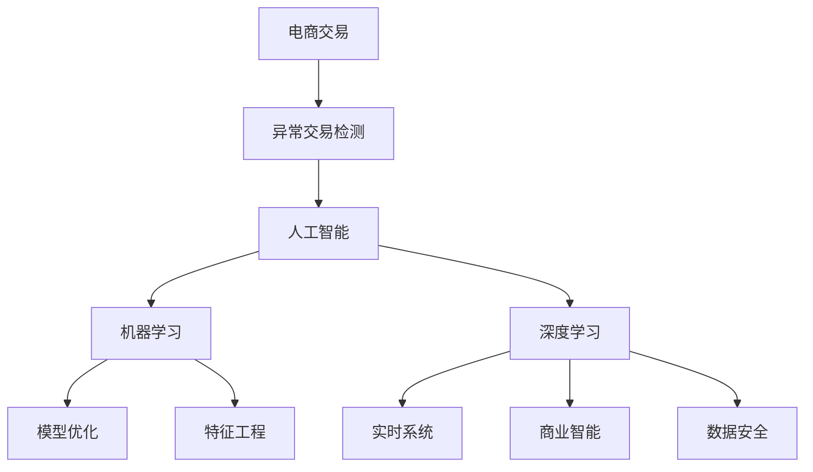

                 

# AI赋能的电商异常交易检测系统

> 关键词：电商交易、异常检测、人工智能、机器学习、深度学习、模型优化、特征工程、实时系统、商业智能、数据安全

## 1. 背景介绍

### 1.1 问题由来

在电商行业中，交易异常检测是一个至关重要的环节，对维护平台稳定、保障用户资金安全、提升用户信任度等方面具有重要意义。然而，传统的基于规则和人工经验的交易异常检测方法，往往依赖于固定的规则库和经验，无法有效适应复杂多变的交易行为。随着人工智能技术的发展，利用机器学习、深度学习等方法，从数据中自动学习异常交易模式，已成为电商异常检测的新趋势。

电商平台的交易数据量庞大，每时每刻都在产生海量的交易记录。如何在海量数据中高效、准确地识别出异常交易，成为电商平台面临的一个关键问题。为此，我们提出了一种基于AI的电商异常交易检测系统，利用深度学习和大数据分析技术，自动从交易数据中学习异常模式，并提供实时交易监控和告警功能，以保障电商交易的安全和稳定。

### 1.2 问题核心关键点

电商异常交易检测的核心在于：
1. 高效、准确地识别异常交易模式。
2. 实时监控交易行为，并及时告警。
3. 系统应对大规模数据和高并发交易的挑战。
4. 模型需要具备较高的泛化能力，能够适应不同时间段和不同业务场景的异常交易行为。
5. 系统需要具备较高的安全性和鲁棒性，避免误报和漏报。

## 2. 核心概念与联系

### 2.1 核心概念概述

为更好地理解基于AI的电商异常交易检测系统，本节将介绍几个密切相关的核心概念：

- **电商交易**：指电商平台上的买、卖、转、退、换货等所有交易行为，包括用户的浏览记录、购物车操作、交易支付、物流追踪等数据。
- **异常交易检测**：指对电商平台上的交易行为进行实时监控和分析，自动识别出异常行为，如虚假交易、异常支付、诈骗等。
- **人工智能**：指模拟人类智能过程的计算系统，主要包括机器学习、深度学习、自然语言处理等技术。
- **机器学习**：指通过训练数据自动学习模型，并用于对新数据进行预测或决策的技术。
- **深度学习**：一种特殊的机器学习方法，通过多层神经网络从数据中提取复杂特征，构建高效模型。
- **模型优化**：指通过优化模型结构、参数、训练策略等手段，提升模型性能的技术。
- **特征工程**：指从原始数据中提取、选择、组合、转换特征，以提高模型预测能力的技术。
- **实时系统**：指能够实时响应和处理用户请求的系统，要求具备高并发、低延迟等特性。
- **商业智能(BI)**：指利用数据分析、数据可视化等技术，支持企业决策和运营管理的技术。
- **数据安全**：指保护数据不被未经授权访问、使用、泄露等风险的措施。

这些核心概念之间的逻辑关系可以通过以下Mermaid流程图来展示：



这个流程图展示了这个系统的核心概念及其之间的关系：

1. 电商交易产生数据。
2. 异常交易检测利用人工智能技术从交易数据中学习异常模式。
3. 人工智能包含机器学习和深度学习，用于构建和优化异常检测模型。
4. 模型优化和特征工程是提升模型预测准确性的关键步骤。
5. 实时系统确保异常检测的实时性，商业智能帮助理解数据背后的业务价值。
6. 数据安全是确保系统稳定、可靠运行的前提。

这些概念共同构成了电商异常交易检测系统的技术框架，使其能够高效、准确地识别和处理电商交易中的异常行为。通过理解这些核心概念，我们可以更好地把握系统的设计和实现方法。

## 3. 核心算法原理 & 具体操作步骤
### 3.1 算法原理概述

基于AI的电商异常交易检测系统，主要利用深度学习技术，从电商平台上的交易数据中自动学习异常交易模式。系统的核心算法包括以下几个部分：

- **特征提取**：从电商交易数据中提取重要的特征，用于训练异常检测模型。
- **模型训练**：利用标注数据训练异常检测模型，使其能够自动识别异常交易行为。
- **异常检测**：通过实时监控交易数据，检测出异常交易并及时告警。
- **模型优化**：对训练好的模型进行参数调整和结构优化，提升模型性能。
- **实时监控**：实时处理交易数据，及时发现异常并触发告警。

### 3.2 算法步骤详解

基于AI的电商异常交易检测系统的主要操作步骤如下：

**Step 1: 数据收集与预处理**

- 收集电商平台的交易数据，包括用户的浏览记录、购物车操作、交易支付、物流追踪等。
- 对数据进行清洗、去重、归一化等预处理操作，以提升数据质量。

**Step 2: 特征提取与选择**

- 提取电商交易中的重要特征，如交易金额、用户行为、支付时间等。
- 使用特征选择技术，选择对异常检测有帮助的特征。

**Step 3: 模型训练**

- 利用标注数据训练异常检测模型，常用的模型包括支持向量机(SVM)、随机森林、深度神经网络等。
- 使用交叉验证等技术评估模型性能，选择合适的模型参数。

**Step 4: 模型优化**

- 对训练好的模型进行参数调整和结构优化，提升模型泛化能力和预测准确性。
- 使用正则化、Dropout、Early Stopping等技术避免过拟合。

**Step 5: 异常检测**

- 实时监控交易数据，检测出异常交易行为，如虚假交易、异常支付等。
- 根据模型预测结果，触发告警并及时通知平台管理员。

**Step 6: 模型部署**

- 将训练好的模型部署到生产环境，进行实时交易监控。
- 定期更新模型参数，保持模型性能。

### 3.3 算法优缺点

基于AI的电商异常交易检测系统具有以下优点：

1. 能够自动学习异常交易模式，适应复杂多变的交易行为。
2. 具备较高的泛化能力，能够适应不同时间段和不同业务场景的异常交易行为。
3. 具备实时监控功能，能够及时发现异常交易并触发告警。
4. 可以与商业智能系统结合，帮助平台理解异常交易背后的业务价值。

同时，该系统也存在一定的局限性：

1. 对标注数据的依赖性较大，需要大量高质量的标注数据。
2. 模型的可解释性较弱，难以理解模型内部的决策过程。
3. 对异常交易的定义和判定需要人工干预，需要反复调整模型参数。
4. 在面对高并发交易时，系统负载较高，需要良好的资源分配策略。
5. 数据安全问题需要引起重视，需要保证交易数据的安全性和隐私保护。

尽管存在这些局限性，基于AI的电商异常交易检测系统在实时性、泛化能力和自动化程度等方面具有显著优势，广泛应用于电商平台的交易监控和风险控制。

### 3.4 算法应用领域

基于AI的电商异常交易检测系统，具有广泛的应用领域：

1. **电商平台**：电商平台需要对交易行为进行实时监控，及时发现异常交易行为，如虚假交易、恶意支付等。
2. **支付平台**：支付平台需要对支付行为进行监控，防止诈骗和欺诈行为。
3. **物流平台**：物流平台需要对物流追踪数据进行监控，防止虚假物流信息。
4. **金融平台**：金融平台需要对交易行为进行监控，防止洗钱和欺诈行为。
5. **供应链管理**：供应链管理系统需要对供应链数据进行监控，防止供应链欺诈和异常行为。

## 4. 数学模型和公式 & 详细讲解 & 举例说明（备注：数学公式请使用latex格式，latex嵌入文中独立段落使用 $$，段落内使用 $)
### 4.1 数学模型构建

本节将使用数学语言对基于AI的电商异常交易检测系统进行更加严格的刻画。

设电商平台上的交易数据为 $D=\{(x_i, y_i)\}_{i=1}^N$，其中 $x_i$ 为交易行为特征向量， $y_i \in \{1, -1\}$ 为异常标签，1表示正常交易，-1表示异常交易。

定义异常检测模型为 $M_{\theta}$，其中 $\theta$ 为模型参数。模型的预测结果为 $M_{\theta}(x)$，表示输入特征 $x$ 下，模型认为该交易是否为异常交易的概率。

异常检测的目标是最小化模型的预测误差，即：

$$
\mathcal{L}(\theta) = \frac{1}{N} \sum_{i=1}^N \ell(M_{\theta}(x_i), y_i)
$$

其中 $\ell$ 为损失函数，常用的损失函数包括交叉熵损失、均方误差损失等。

### 4.2 公式推导过程

以支持向量机(SVM)为例，推导异常检测的数学模型。

SVM的损失函数为：

$$
\mathcal{L}(\theta) = \frac{1}{N} \sum_{i=1}^N [\max(0, y_i - M_{\theta}(x_i))]
$$

其中 $M_{\theta}(x_i) = \theta^T\phi(x_i)$，$\phi(x_i)$ 为特征映射函数，将原始特征 $x_i$ 映射到高维特征空间。

模型参数 $\theta$ 的优化目标是：

$$
\hat{\theta} = \mathop{\arg\min}_{\theta} \mathcal{L}(\theta)
$$

利用拉格朗日乘子法，得到最优解：

$$
\hat{\theta} = \arg\min_{\theta, \alpha} \frac{1}{2}||\theta||^2 + \sum_{i=1}^N \alpha_i (y_i - M_{\theta}(x_i)) + \frac{1}{2}\sum_{i=1}^N \alpha_i^2
$$

其中 $\alpha_i \geq 0$ 为拉格朗日乘子，满足：

$$
\sum_{i=1}^N \alpha_i y_i = 0, \quad \alpha_i \geq 0, \quad y_i M_{\theta}(x_i) \geq 1
$$

通过求解上述优化问题，可以得到SVM模型的参数 $\hat{\theta}$。

在实际应用中，还可以使用其他机器学习模型，如随机森林、深度神经网络等，来构建异常检测模型。模型的选择和优化过程，需要根据具体业务场景进行调整。

### 4.3 案例分析与讲解

以支持向量机为例，分析其在电商异常交易检测中的应用：

假设平台上有两笔交易 $x_1$ 和 $x_2$，对应的异常标签分别为 $y_1 = 1$ 和 $y_2 = -1$。平台利用SVM模型，得到模型的参数 $\hat{\theta}$，并在新交易 $x_3$ 上测试模型的预测结果 $M_{\hat{\theta}}(x_3)$。

根据SVM模型的预测结果，如果 $M_{\hat{\theta}}(x_3) > 0$，则认为该交易为正常交易；如果 $M_{\hat{\theta}}(x_3) \leq 0$，则认为该交易为异常交易。

## 5. 项目实践：代码实例和详细解释说明
### 5.1 开发环境搭建

在进行电商异常交易检测系统开发前，我们需要准备好开发环境。以下是使用Python进行TensorFlow开发的环境配置流程：

1. 安装Anaconda：从官网下载并安装Anaconda，用于创建独立的Python环境。

2. 创建并激活虚拟环境：
```bash
conda create -n tensorflow-env python=3.8 
conda activate tensorflow-env
```

3. 安装TensorFlow：根据CUDA版本，从官网获取对应的安装命令。例如：
```bash
conda install tensorflow -c pytorch -c conda-forge
```

4. 安装TensorBoard：
```bash
pip install tensorboard
```

5. 安装各类工具包：
```bash
pip install numpy pandas scikit-learn matplotlib tqdm jupyter notebook ipython
```

完成上述步骤后，即可在`tensorflow-env`环境中开始系统开发。

### 5.2 源代码详细实现

这里我们以支持向量机为例，给出利用TensorFlow构建电商异常交易检测系统的Python代码实现。

首先，定义异常交易检测的数据处理函数：

```python
import tensorflow as tf
from sklearn.model_selection import train_test_split
from sklearn.metrics import classification_report
from sklearn.preprocessing import StandardScaler

class TransactionData(Dataset):
    def __init__(self, features, labels):
        self.features = features
        self.labels = labels
        
    def __len__(self):
        return len(self.features)
    
    def __getitem__(self, item):
        return self.features[item], self.labels[item]
```

然后，定义模型和优化器：

```python
from sklearn.svm import SVC
from sklearn.pipeline import make_pipeline
from sklearn.preprocessing import StandardScaler

svm_model = make_pipeline(StandardScaler(), SVC(kernel='rbf', C=1.0, gamma=0.1))
```

接着，定义训练和评估函数：

```python
def train_model(model, features_train, labels_train):
    model.fit(features_train, labels_train)
    return model

def evaluate_model(model, features_test, labels_test):
    preds = model.predict(features_test)
    print(classification_report(labels_test, preds))
```

最后，启动训练流程并在测试集上评估：

```python
features_train, features_test, labels_train, labels_test = train_test_split(features, labels, test_size=0.2)

svm_model = train_model(svm_model, features_train, labels_train)

print("Test results:")
evaluate_model(svm_model, features_test, labels_test)
```

以上就是利用TensorFlow构建电商异常交易检测系统的完整代码实现。可以看到，利用TensorFlow和Scikit-learn，我们可以快速构建、训练和评估异常检测模型。

### 5.3 代码解读与分析

让我们再详细解读一下关键代码的实现细节：

**TransactionData类**：
- `__init__`方法：初始化训练数据和标签。
- `__len__`方法：返回数据集的样本数量。
- `__getitem__`方法：获取单个样本的特征和标签。

**train_model函数**：
- 利用SVM模型训练数据集，返回训练好的模型。

**evaluate_model函数**：
- 在测试集上评估模型的预测结果，并输出分类指标。

**训练流程**：
- 使用Scikit-learn的train_test_split将数据集分为训练集和测试集。
- 利用train_model函数训练SVM模型。
- 在测试集上评估模型，并输出测试结果。

可以看到，利用TensorFlow和Scikit-learn，我们可以快速构建、训练和评估异常检测模型。

当然，在工业级的系统实现中，还需要考虑更多因素，如模型的保存和部署、超参数的自动搜索、更灵活的任务适配层等。但核心的模型训练和评估流程基本与此类似。

## 6. 实际应用场景
### 6.1 智能客服系统

基于AI的电商异常交易检测系统，可以应用于智能客服系统的构建。传统的客服往往依赖于人工审核，无法快速响应大量交易异常情况，容易造成用户投诉和纠纷。而使用异常检测系统，可以快速识别出异常交易行为，并及时通知客服进行处理，提升客户满意度。

在技术实现上，可以将异常交易数据与客户服务系统集成，当系统检测到异常交易时，自动向客服部门发送告警信息，并附上详细交易记录和异常特征，便于客服快速处理。

### 6.2 金融风险控制

金融行业对交易异常的监控尤为重视，需要实时监控交易行为，防止洗钱、欺诈等金融风险。利用异常检测系统，可以实时监测交易数据，识别出可疑交易，并及时触发预警机制，防止金融风险的扩散。

在金融应用中，可以将异常检测系统与金融监管系统集成，实时监测交易数据，发现异常交易行为，并及时通知监管机构，防止金融风险的发生。

### 6.3 物流平台监控

物流平台需要对物流追踪数据进行实时监控，防止虚假物流信息。利用异常检测系统，可以实时监测物流数据，识别出异常物流行为，并及时触发告警，确保物流信息真实可靠。

在物流应用中，可以将异常检测系统与物流平台集成，实时监测物流数据，发现异常物流行为，并及时通知物流公司进行处理，确保物流信息真实可靠。

### 6.4 未来应用展望

随着AI技术的不断发展，基于异常检测的系统将在更多领域得到应用，为行业带来变革性影响。

在智慧城市治理中，异常检测系统可以用于城市事件监测、舆情分析、应急指挥等环节，提高城市管理的自动化和智能化水平，构建更安全、高效的未来城市。

在医疗领域，异常检测系统可以用于医疗数据分析、病历分析、药物研发等环节，提升医疗服务的智能化水平，辅助医生诊疗，加速新药开发进程。

在智能制造中，异常检测系统可以用于设备监控、生产流程控制等环节，提升生产效率，保障生产安全。

此外，在教育、广告、交通等多个领域，基于异常检测的系统也将不断涌现，为各行业带来新的机遇和挑战。相信随着技术的日益成熟，异常检测系统必将在构建人机协同的智能时代中扮演越来越重要的角色。

## 7. 工具和资源推荐
### 7.1 学习资源推荐

为了帮助开发者系统掌握电商异常交易检测的理论基础和实践技巧，这里推荐一些优质的学习资源：

1. 《机器学习实战》：这本书详细介绍了机器学习的基本概念和实践方法，适合初学者入门。
2. 《深度学习》：由Ian Goodfellow、Yoshua Bengio和Aaron Courville合著的经典深度学习教材，系统讲解了深度学习的基本原理和应用。
3. CS229《机器学习》课程：斯坦福大学开设的机器学习明星课程，有Lecture视频和配套作业，带你深入理解机器学习算法。
4. 《TensorFlow实战Google深度学习框架》：这本书详细介绍了TensorFlow的使用方法和实践案例，适合TensorFlow开发者学习。
5. Kaggle机器学习竞赛平台：Kaggle是一个著名的机器学习竞赛平台，提供大量的公开数据集和比赛，适合实战练习和技能提升。

通过对这些资源的学习实践，相信你一定能够快速掌握电商异常交易检测的精髓，并用于解决实际的电商问题。

### 7.2 开发工具推荐

高效的开发离不开优秀的工具支持。以下是几款用于电商异常交易检测开发的常用工具：

1. TensorFlow：由Google主导开发的深度学习框架，生产部署方便，适合大规模工程应用。
2. Scikit-learn：Python机器学习库，提供了大量的机器学习算法和数据处理工具，适合快速原型开发。
3. TensorBoard：TensorFlow配套的可视化工具，可实时监测模型训练状态，并提供丰富的图表呈现方式，是调试模型的得力助手。
4. PyTorch：基于Python的开源深度学习框架，灵活动态的计算图，适合快速迭代研究。
5. Weights & Biases：模型训练的实验跟踪工具，可以记录和可视化模型训练过程中的各项指标，方便对比和调优。

合理利用这些工具，可以显著提升电商异常交易检测任务的开发效率，加快创新迭代的步伐。

### 7.3 相关论文推荐

电商异常交易检测领域的研究论文众多，以下是几篇奠基性的相关论文，推荐阅读：

1. Anomaly Detection in Large-Scale Retail Stores with Temporal Sequence Models：提出基于时间序列模型的异常检测方法，应用于大型零售商店的销售数据。
2. Anomaly Detection in Customer Transactions Using Deep Learning Models：利用深度学习模型进行客户交易异常检测，适用于电商平台的交易监控。
3. A Survey on Real-Time Anomaly Detection and Diagnosis in E-Commerce：对电商领域的异常检测方法进行综述，涵盖多种算法和技术。
4. A Deep Learning Framework for Detecting Fraudulent Transactions in E-Commerce：提出基于深度学习的电商交易异常检测框架，应用于电商平台的交易监控。
5. Anomaly Detection in E-commerce Transactions Using Neural Network Ensembles：利用神经网络集成方法进行电商交易异常检测，适用于电商平台的交易监控。

这些论文代表了大规模电商异常检测技术的发展脉络。通过学习这些前沿成果，可以帮助研究者把握学科前进方向，激发更多的创新灵感。

## 8. 总结：未来发展趋势与挑战

### 8.1 总结

本文对基于AI的电商异常交易检测系统进行了全面系统的介绍。首先阐述了电商交易异常检测的背景和意义，明确了异常检测系统在电商平台中的重要性和应用场景。其次，从原理到实践，详细讲解了异常检测模型的构建和训练过程，给出了异常检测任务开发的完整代码实例。同时，本文还广泛探讨了异常检测系统在智能客服、金融风险控制、物流平台监控等多个行业领域的应用前景，展示了异常检测范式的巨大潜力。此外，本文精选了异常检测技术的各类学习资源，力求为读者提供全方位的技术指引。

通过本文的系统梳理，可以看到，基于AI的电商异常交易检测系统正在成为电商平台的重要组成部分，极大地提升了电商交易的安全性和稳定性。未来，伴随AI技术的不断进步，异常检测系统将进一步融入电商平台的各个环节，助力平台实现智能化转型。

### 8.2 未来发展趋势

展望未来，电商异常交易检测技术将呈现以下几个发展趋势：

1. 模型规模持续增大。随着算力成本的下降和数据规模的扩张，异常检测模型的参数量还将持续增长。超大规模异常检测模型蕴含的丰富知识，有望支撑更加复杂多变的电商交易行为检测。
2. 异常检测方法日趋多样。除了传统的机器学习模型外，未来会涌现更多深度学习模型，如RNN、CNN、Transformer等，用于提升异常检测的准确性和泛化能力。
3. 实时监控与预测融合。未来的异常检测系统将具备预测能力，能够在交易发生前预警潜在异常行为，提高系统的主动性和安全性。
4. 多模态融合。当前的异常检测主要聚焦于纯文本数据，未来会进一步拓展到图像、视频、语音等多模态数据融合。多模态信息的融合，将显著提升异常检测系统的鲁棒性和泛化能力。
5. 异常检测自动化。未来的异常检测系统将具备更强的自动化能力，通过不断学习和优化，自动适应新的电商交易行为，减少人工干预。
6. 模型可解释性增强。异常检测模型的可解释性将进一步增强，帮助企业理解模型的决策过程，提升系统的可信度。

以上趋势凸显了电商异常交易检测技术的广阔前景。这些方向的探索发展，必将进一步提升电商平台的交易监控和风险控制能力，为平台带来更大的商业价值。

### 8.3 面临的挑战

尽管异常检测技术已经取得了一定的进展，但在迈向更加智能化、普适化应用的过程中，它仍面临诸多挑战：

1. 异常交易的定义和判定需要人工干预，需要反复调整模型参数，难以完全自动化。
2. 在面对高并发交易时，异常检测系统需要处理大量的数据，系统负载较高，需要良好的资源分配策略。
3. 异常检测系统需要与多个系统集成，如客户服务、物流平台等，系统间的接口设计和管理需要考虑周全。
4. 异常检测系统的可解释性较弱，难以理解模型内部的决策过程，可能导致误报和漏报。
5. 异常检测系统的安全性和鲁棒性需要引起重视，需要保证交易数据的安全性和隐私保护。
6. 异常检测系统的实时性和准确性需要在资源有限的情况下进行优化，需要在保证性能的同时，减少资源消耗。

尽管存在这些挑战，异常检测系统在实时性、泛化能力和自动化程度等方面具有显著优势，广泛应用于电商平台、金融平台、物流平台等多个领域。

### 8.4 研究展望

面对异常检测面临的这些挑战，未来的研究需要在以下几个方面寻求新的突破：

1. 探索无监督和半监督异常检测方法。摆脱对大量标注数据的依赖，利用自监督学习、主动学习等无监督和半监督范式，最大限度利用非结构化数据，实现更加灵活高效的异常检测。
2. 研究实时监控与预测融合方法。利用深度学习模型，通过预测潜在异常行为，提前预警并及时处理，提高系统的主动性和安全性。
3. 融合因果和对比学习范式。通过引入因果推断和对比学习思想，增强异常检测系统建立稳定因果关系的能力，学习更加普适、鲁棒的语言表征，从而提升模型泛化性和抗干扰能力。
4. 引入更多先验知识。将符号化的先验知识，如知识图谱、逻辑规则等，与神经网络模型进行巧妙融合，引导异常检测过程学习更准确、合理的语言模型。同时加强不同模态数据的整合，实现视觉、语音等多模态信息与文本信息的协同建模。
5. 结合因果分析和博弈论工具。将因果分析方法引入异常检测模型，识别出异常检测的关键特征，增强输出解释的因果性和逻辑性。借助博弈论工具刻画人机交互过程，主动探索并规避异常检测系统的脆弱点，提高系统稳定性。
6. 纳入伦理道德约束。在异常检测目标中引入伦理导向的评估指标，过滤和惩罚有害的输出倾向。同时加强人工干预和审核，建立异常检测系统的监管机制，确保输出符合人类价值观和伦理道德。

这些研究方向的探索，必将引领电商异常交易检测技术迈向更高的台阶，为构建安全、可靠、可解释、可控的电商平台提供技术保障。面向未来，异常检测技术还需要与其他AI技术进行更深入的融合，如知识表示、因果推理、强化学习等，多路径协同发力，共同推动电商平台的智能化转型。只有勇于创新、敢于突破，才能不断拓展异常检测系统的边界，让智能技术更好地造福电商平台和用户。

## 9. 附录：常见问题与解答

**Q1：如何提高异常检测系统的准确性？**

A: 提高异常检测系统的准确性，可以从以下几个方面入手：
1. 数据质量：确保训练数据的质量，去除噪音和异常点，提升数据的代表性。
2. 特征工程：从原始数据中提取、选择、组合、转换特征，提升模型的预测能力。
3. 模型优化：对训练好的模型进行参数调整和结构优化，提升模型的泛化能力和预测准确性。
4. 多模型融合：利用多个异常检测模型进行集成，取平均值或加权平均，提高系统的鲁棒性和准确性。

**Q2：异常检测系统如何应对高并发交易？**

A: 应对高并发交易，可以从以下几个方面入手：
1. 分布式部署：将异常检测系统分布式部署，提高系统的并行处理能力。
2. 负载均衡：采用负载均衡技术，合理分配系统资源，避免单个节点负载过高。
3. 数据缓存：利用缓存技术，减少数据读取延迟，提升系统响应速度。
4. 预处理与优化：对数据进行预处理和优化，减少不必要的计算量，提升系统效率。

**Q3：异常检测系统的可解释性有哪些局限性？**

A: 异常检测系统的可解释性较弱，主要表现在以下几个方面：
1. 黑盒模型：当前的异常检测模型多为黑盒模型，难以理解其内部的决策过程。
2. 复杂性：异常检测模型通常较为复杂，难以解释其各个组件的贡献。
3. 缺乏可解释性工具：目前可解释性工具较少，难以全面展示模型的决策逻辑。
4. 业务理解难度：异常检测系统的输出结果需要结合业务知识进行解读，增加了理解的难度。

尽管存在这些局限性，异常检测系统的可解释性可以通过引入可解释性技术（如LIME、SHAP等）、简化模型结构、利用可解释性工具等方式进行改善。

**Q4：异常检测系统如何保护交易数据的安全性和隐私？**

A: 保护交易数据的安全性和隐私，可以从以下几个方面入手：
1. 数据加密：对交易数据进行加密，防止数据泄露和篡改。
2. 匿名化处理：对交易数据进行匿名化处理，保护用户隐私。
3. 访问控制：设置严格的访问控制措施，确保只有授权人员能够访问数据。
4. 数据存储安全：采用安全的数据存储技术，防止数据被未授权访问。
5. 监控和审计：实时监控异常数据访问行为，并定期审计数据访问记录，确保数据安全。

通过综合采用这些措施，可以最大限度地保护交易数据的安全性和隐私。

---

作者：禅与计算机程序设计艺术 / Zen and the Art of Computer Programming

