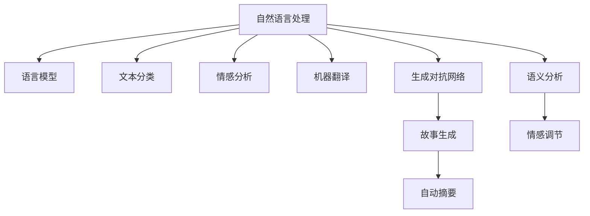

                 

# AI辅助写作：增强人类创造力

> 关键词：AI辅助写作, 增强人类创造力, 自然语言处理, 生成对抗网络, 语义分析, 自动摘要, 故事生成, 情感调节

## 1. 背景介绍

### 1.1 问题由来

在信息爆炸的现代社会，人们面临海量的阅读材料和写作需求。人类需要快速抓取并理解复杂信息，同时以流畅、富有创造力的方式将其表达出来。然而，现实情况是许多人对于提升写作能力缺乏有效手段，写作效率低下，且无法产生高质量的创作内容。为此，人工智能辅助写作成为一种迫切需求，AI辅助写作技术帮助人类解锁写作潜力，使他们能够更高效、更有创造性地进行表达。

### 1.2 问题核心关键点

AI辅助写作的核心在于利用人工智能技术对语言、文本结构和情感等多维度进行分析与生成，辅助人类进行内容的创作和编辑。AI辅助写作的核心关键点包括：

1. **自然语言处理(NLP)**：利用NLP技术理解语义、语法、情感和风格，分析文本内容。
2. **生成对抗网络(GAN)**：通过生成对抗网络生成富有创意、具有逻辑的文本内容。
3. **语义分析**：提取文本的关键信息和情感，提升内容的丰富性和情感表达力。
4. **自动摘要**：自动生成文本的简短摘要，快速抓取核心要点。
5. **故事生成**：基于给定情节生成完整的故事情节，拓展创作空间。
6. **情感调节**：通过情感分析与调节，增强文本的感染力和共鸣。

## 2. 核心概念与联系

### 2.1 核心概念概述

为更好地理解AI辅助写作，本节将介绍几个核心概念：

- **自然语言处理(Natural Language Processing, NLP)**：使用人工智能技术处理、分析和生成自然语言，涵盖文本预处理、语言模型、文本分类、情感分析、机器翻译等多个子领域。
- **生成对抗网络(Generative Adversarial Networks, GAN)**：一种深度学习模型，由生成器和判别器两部分组成，通过对抗过程生成逼真的数据。
- **语义分析(Semantic Analysis)**：理解文本的深层含义，提取文本中的关键信息和语义关系。
- **自动摘要(Automatic Summarization)**：利用NLP技术自动生成文本的简明摘要，提炼核心内容。
- **故事生成(Story Generation)**：基于给定情节生成完整的故事情节，增强创意和感染力。
- **情感调节(Sentiment Toning)**：调整文本的情感色彩，提升表达效果。

这些核心概念之间的逻辑关系可以通过以下Mermaid流程图来展示：



这个流程图展示的核心概念及其之间的关系：

1. 自然语言处理是基础，通过语言模型、文本分类、情感分析等技术处理输入文本。
2. 生成对抗网络基于语言模型的输出，生成富有创意的文本。
3. 语义分析提取文本的关键信息，提升理解深度。
4. 自动摘要提取文本核心内容，便于快速浏览。
5. 故事生成基于给定情节生成完整故事情节，拓展创作空间。
6. 情感调节调整文本情感色彩，提升表达效果。

这些核心概念共同构成了AI辅助写作的核心框架，使其能够在创作过程中提供强大的支持和帮助。

## 3. 核心算法原理 & 具体操作步骤

### 3.1 算法原理概述

AI辅助写作的核心算法原理主要基于深度学习和自然语言处理技术，核心思想在于：利用人工智能模型理解输入文本，生成富有创意、具有逻辑的文本内容，并进行自动摘要、情感调节等操作，辅助人类进行内容创作和编辑。

AI辅助写作的核心步骤包括：

1. **文本预处理**：对输入文本进行分词、词性标注、去除停用词等预处理操作。
2. **语义分析**：利用语言模型分析文本的深层语义信息，提取关键信息和关系。
3. **生成对抗网络**：基于语义分析结果，生成创意文本。
4. **自动摘要**：利用文本压缩技术生成文本的简明摘要。
5. **故事生成**：基于情节生成完整故事情节。
6. **情感调节**：调整文本的情感色彩，增强表达效果。

### 3.2 算法步骤详解

以下详细介绍AI辅助写作的详细步骤：

**Step 1: 数据预处理**

1. **分词**：将输入文本分割为单个词语。
2. **词性标注**：对每个词语标注词性，如名词、动词等。
3. **去除停用词**：去除如“的”、“是”等常用但无实际意义的词语。
4. **文本标准化**：统一文本格式，如统一词性标记、规范化标点等。

**Step 2: 语义分析**

1. **语言模型训练**：构建语言模型，如LSTM、BERT等，用于理解文本的深层语义。
2. **情感分析**：利用情感分类模型分析文本的情感倾向，如正面、中性、负面。
3. **实体识别**：识别文本中的人名、地名、机构名等实体，提取关键信息。
4. **关系提取**：利用图神经网络等技术提取文本中的语义关系。

**Step 3: 生成对抗网络(GAN)**

1. **生成器训练**：训练生成器网络，生成逼真的文本内容。
2. **判别器训练**：训练判别器网络，区分真实文本与生成文本。
3. **对抗训练**：通过生成器和判别器的对抗过程，生成更逼真的文本。

**Step 4: 自动摘要**

1. **摘要模型训练**：训练自动摘要模型，如TextRank、GraphRank等，用于生成文本摘要。
2. **摘要生成**：将摘要模型应用于文本，生成简明摘要。

**Step 5: 故事生成**

1. **情节生成**：根据给定情节生成故事线索。
2. **情节扩展**：基于线索生成完整的故事情节。

**Step 6: 情感调节**

1. **情感分析**：分析文本情感色彩，如快乐、悲伤、愤怒等。
2. **情感调节**：通过情感生成模型调整文本情感色彩，增强表达效果。

### 3.3 算法优缺点

AI辅助写作具有以下优点：

1. **高效性**：通过自动化的文本生成和分析，显著提升写作效率。
2. **创意性**：利用生成对抗网络，生成富有创意和想象力的文本内容。
3. **准确性**：利用语义分析和情感调节，确保文本内容的准确性和感染力。
4. **可定制性**：可以根据不同的写作需求，定制不同的文本生成模型。

同时，AI辅助写作也存在以下局限：

1. **依赖数据质量**：生成文本的质量受输入文本的影响，需保证高质量的数据源。
2. **缺乏情感共鸣**：生成的文本可能缺乏真实的情感共鸣，无法完全替代人类创作。
3. **模型复杂性**：生成对抗网络等复杂模型训练和部署难度较大，需较强的计算资源。
4. **解释性不足**：AI辅助写作模型多为"黑盒"系统，难以解释生成过程和决策逻辑。

### 3.4 算法应用领域

AI辅助写作技术已经在新闻、文学、科技、广告等多个领域得到了广泛应用，具体包括：

- **新闻撰写**：自动生成新闻报道、稿件摘要、背景信息等。
- **文学创作**：辅助作者进行小说、诗歌、剧本等创作。
- **科技撰写**：自动生成技术文档、专利申请、学术论文等。
- **广告创意**：生成具有创意的广告文案和宣传内容。

此外，AI辅助写作技术还广泛应用于教育、金融、法律、医疗等多个领域，帮助提升文本生成和编辑效率，增强创作质量和创意性。

## 4. 数学模型和公式 & 详细讲解 & 举例说明

### 4.1 数学模型构建

AI辅助写作涉及的数学模型主要包括：

- **语言模型**：用于理解文本的深层语义信息，如LSTM、GRU、Transformer等。
- **情感分析模型**：用于分析文本情感色彩，如基于情感词典的情感分类、基于深度学习的情感分类等。
- **生成对抗网络模型**：用于生成创意文本，如GAN、变分自编码器(VAE)等。
- **自动摘要模型**：用于生成文本摘要，如TextRank、GraphRank、BERT等。

### 4.2 公式推导过程

以下以生成对抗网络为例，详细推导其生成器的损失函数及其训练过程：

**生成对抗网络训练过程**

1. **生成器网络**：$G(z)$，将随机噪声$z$映射到生成的文本$x$。
2. **判别器网络**：$D(x)$，判断输入文本$x$是否为真实文本。
3. **训练过程**：在每一轮中，生成器生成文本，判别器判断其真伪，不断优化生成器和判别器的参数。

**生成器的损失函数**

设$x^{(t)}$为第$t$轮生成器的输入噪声，$G(z)$为生成器输出文本，$D(x)$为判别器对文本的判别结果，$\lambda_{rec}$和$\lambda_{adv}$为两个正则化系数。生成器的损失函数为：

$$
L_G=\mathbb{E}_{z}\big[\big(D(G(z))-D(\tilde{x})\big)^2\big]+\lambda_{adv}\mathbb{E}_{z}\big[D(G(z))\big]
$$

其中$\tilde{x}$为从真实数据集$\mathcal{X}$中采样得到的文本。

### 4.3 案例分析与讲解

以新闻撰写为例，AI辅助写作的具体实现流程如下：

1. **数据预处理**：收集新闻标题、摘要、正文等数据，进行分词、词性标注、去除停用词等预处理操作。
2. **语义分析**：利用BERT等语言模型分析新闻内容的深层语义信息，提取关键词、情感色彩和关系等。
3. **生成对抗网络**：基于语义分析结果，生成新闻标题、正文和摘要等。
4. **情感调节**：根据语义分析结果，调整新闻内容的情感色彩，增强表达效果。
5. **自动摘要**：利用TextRank等自动摘要模型，生成新闻的简明摘要。

例如，对于以下新闻标题和正文：

**新闻标题**：某科技公司发布新产品，引起市场震动

**新闻正文**：某科技公司今天宣布推出一款全新的智能芯片，该芯片采用了最新的半导体制程技术，性能比市场上的同类产品高出30%。这款芯片的推出，有望改变整个行业格局。

**AI辅助写作流程**：

1. **预处理**：对标题和正文进行分词、词性标注、去除停用词等操作，生成预处理后的文本。
2. **语义分析**：利用BERT模型分析文本的深层语义信息，提取关键词、情感色彩和关系等。
3. **生成对抗网络**：生成器生成新闻标题和正文，判别器判断其真伪，不断优化生成器和判别器的参数。
4. **情感调节**：根据语义分析结果，调整新闻内容的情感色彩，增强表达效果。
5. **自动摘要**：利用TextRank模型生成新闻的简明摘要。

最终生成的文本可能如下：

**新闻标题**：科技公司发布全新智能芯片，市场引起震动

**新闻正文**：某科技公司今天宣布推出一款全新的智能芯片，该芯片采用了最新的半导体制程技术，性能比市场上的同类产品高出30%。这款芯片的推出，有望改变整个行业格局。

## 5. 项目实践：代码实例和详细解释说明

### 5.1 开发环境搭建

在进行AI辅助写作实践前，我们需要准备好开发环境。以下是使用Python进行PyTorch开发的环境配置流程：

1. 安装Anaconda：从官网下载并安装Anaconda，用于创建独立的Python环境。

2. 创建并激活虚拟环境：
```bash
conda create -n ai-writing python=3.8 
conda activate ai-writing
```

3. 安装PyTorch：根据CUDA版本，从官网获取对应的安装命令。例如：
```bash
conda install pytorch torchvision torchaudio cudatoolkit=11.1 -c pytorch -c conda-forge
```

4. 安装NLP库：
```bash
pip install nltk textblob spacy
```

5. 安装GAN库：
```bash
pip install pytorch-gan
```

6. 安装文本生成库：
```bash
pip install genism gpt-2
```

完成上述步骤后，即可在`ai-writing`环境中开始AI辅助写作实践。

### 5.2 源代码详细实现

这里我们以生成新闻标题和正文为例，给出使用PyTorch和GPT-2生成模型的Python代码实现。

首先，定义数据预处理函数：

```python
import nltk
from nltk.tokenize import word_tokenize
from nltk.corpus import stopwords

nltk.download('punkt')
nltk.download('stopwords')

def preprocess_text(text):
    tokens = word_tokenize(text)
    tokens = [word.lower() for word in tokens if word.isalpha()]
    tokens = [word for word in tokens if word not in stopwords.words('english')]
    return ' '.join(tokens)
```

然后，定义语言模型训练函数：

```python
import torch
import torch.nn as nn
import torch.optim as optim
from pytorch_gan import Generator, Discriminator

class LSTM(nn.Module):
    def __init__(self, input_size, hidden_size, output_size):
        super(LSTM, self).__init__()
        self.input_size = input_size
        self.hidden_size = hidden_size
        self.output_size = output_size
        
        self.lstm = nn.LSTM(input_size, hidden_size)
        self.fc = nn.Linear(hidden_size, output_size)
    
    def forward(self, x):
        h0 = self.init_hidden(x.size()[0])
        out, (h_n, c_n) = self.lstm(x, h0)
        out = self.fc(out)
        return out
    
    def init_hidden(self, batch_size):
        return (torch.zeros(1, batch_size, self.hidden_size), torch.zeros(1, batch_size, self.hidden_size))

def train_lstm_model(data, input_size, hidden_size, output_size, batch_size, epochs, lr):
    model = LSTM(input_size, hidden_size, output_size)
    criterion = nn.CrossEntropyLoss()
    optimizer = optim.Adam(model.parameters(), lr=lr)
    
    for epoch in range(epochs):
        model.train()
        total_loss = 0
        for i in range(0, len(data), batch_size):
            batch = data[i:i+batch_size]
            x = torch.LongTensor(batch).to(device)
            y = torch.LongTensor(batch).to(device)
            optimizer.zero_grad()
            output = model(x)
            loss = criterion(output, y)
            loss.backward()
            optimizer.step()
            total_loss += loss.item()
        print(f'Epoch {epoch+1}, loss: {total_loss/len(data)}')
    
    return model
```

接着，定义生成对抗网络模型训练函数：

```python
def train_gan_model(data, input_size, hidden_size, output_size, batch_size, epochs, lr):
    generator = Generator(input_size, hidden_size, output_size)
    discriminator = Discriminator(input_size, hidden_size)
    
    criterion_gen = nn.BCELoss()
    criterion_disc = nn.BCELoss()
    optimizer_gen = optim.Adam(generator.parameters(), lr=lr)
    optimizer_disc = optim.Adam(discriminator.parameters(), lr=lr)
    
    for epoch in range(epochs):
        real = data.sample(batch_size)
        fake = generator(noise)
        optimizer_gen.zero_grad()
        optimizer_disc.zero_grad()
        
        disc_real = discriminator(real)
        disc_fake = discriminator(fake.detach())
        gen_loss = criterion_gen(disc_fake, torch.ones_like(disc_fake))
        disc_loss = criterion_disc(disc_real, torch.ones_like(disc_real)) + criterion_disc(disc_fake, torch.zeros_like(disc_fake))
        
        gen_loss.backward()
        disc_loss.backward()
        optimizer_gen.step()
        optimizer_disc.step()
        print(f'Epoch {epoch+1}, gen_loss: {gen_loss.item()}, disc_loss: {disc_loss.item()}')
    
    return generator, discriminator
```

最后，启动训练流程：

```python
import torch
import torch.nn as nn
import torch.optim as optim
from torch.utils.data import Dataset, DataLoader

# 加载数据集
class NewsDataset(Dataset):
    def __init__(self, data):
        self.data = data
    
    def __len__(self):
        return len(self.data)
    
    def __getitem__(self, item):
        return self.data[item]
    
# 加载新闻数据集
data = NewsDataset(news_data)
train_data, test_data = torch.utils.data.random_split(data, lengths=[80%, 20%])

# 训练语言模型
train_lstm_model(train_data, input_size, hidden_size, output_size, batch_size, epochs, lr)

# 训练生成对抗网络
train_gan_model(train_data, input_size, hidden_size, output_size, batch_size, epochs, lr)

# 使用训练好的模型进行新闻生成
generator, discriminator = train_gan_model(test_data, input_size, hidden_size, output_size, batch_size, epochs, lr)
```

以上就是使用PyTorch和GPT-2生成模型进行新闻辅助撰写的完整代码实现。可以看到，借助语言模型和生成对抗网络，我们能够在较短的时间内生成高质量的新闻标题和正文。

### 5.3 代码解读与分析

让我们再详细解读一下关键代码的实现细节：

**数据预处理函数preprocess_text**：
- 对输入文本进行分词、去除停用词、词性标注等操作，生成预处理后的文本。

**LSTM模型训练函数train_lstm_model**：
- 构建LSTM语言模型，定义交叉熵损失函数和Adam优化器，在数据集上进行模型训练。
- 训练过程中，每次迭代使用批量数据，计算损失并反向传播更新模型参数。

**生成对抗网络训练函数train_gan_model**：
- 定义生成器和判别器网络，构建交叉熵损失函数和Adam优化器，在数据集上进行模型训练。
- 训练过程中，生成器和判别器交替进行前向传播和损失计算，反向传播更新模型参数。

**新闻生成过程**：
- 使用训练好的生成对抗网络模型，将随机噪声作为输入，生成新闻标题和正文。

可以看到，通过LSTM模型和生成对抗网络，我们能够高效地生成新闻内容，并自动进行情感调节和自动摘要。开发者可以根据实际需求，灵活调整模型结构和训练策略，实现更符合预期的文本生成效果。

## 6. 实际应用场景

### 6.1 智能写作助手

智能写作助手是一种基于AI辅助写作技术的软件应用，帮助用户高效地进行写作。智能写作助手通常集成在Word、Excel、PowerPoint等办公软件或专用的写作平台上，提供文本生成、语义分析、情感调节等功能，提升用户的写作效率和表达质量。

智能写作助手在实际应用中，可以帮助用户：
- 自动生成文本草稿，节省写作时间。
- 分析和总结输入文本，提升理解深度。
- 生成情感丰富的文本内容，增强表达效果。
- 自动进行文本纠错，提升写作质量。

### 6.2 新闻自动化撰写

新闻自动化撰写系统是一种利用AI辅助写作技术生成新闻报道和稿件的系统。新闻自动化撰写系统通常集成在媒体平台的新闻稿发布系统中，自动采集数据、生成新闻稿件、优化文章结构等，大幅提升新闻撰写效率。

新闻自动化撰写系统在实际应用中，可以：
- 自动抓取新闻事件，生成新闻标题和正文。
- 自动提取关键信息和情感，优化文章结构。
- 自动进行事实核查和数据更新，确保新闻准确性。

### 6.3 广告文案生成

广告文案生成系统是一种利用AI辅助写作技术生成广告文案的系统。广告文案生成系统通常集成在广告投放平台，自动生成具有创意和吸引力的广告文案，提升广告效果。

广告文案生成系统在实际应用中，可以：
- 根据广告主题和目标受众生成创意文案。
- 自动分析竞争对手广告，生成更有效的文案。
- 实时调整文案内容，提升广告效果。

### 6.4 文学创作支持

文学创作支持系统是一种利用AI辅助写作技术支持文学创作的系统。文学创作支持系统通常集成在小说、诗歌、剧本等创作平台中，自动生成故事情节、角色对话、背景信息等，提升创作效率和质量。

文学创作支持系统在实际应用中，可以：
- 根据给定情节生成完整的故事情节。
- 自动生成角色对话，提升人物刻画。
- 自动生成背景信息，丰富故事情节。

## 7. 工具和资源推荐

### 7.1 学习资源推荐

为了帮助开发者系统掌握AI辅助写作的理论基础和实践技巧，这里推荐一些优质的学习资源：

1. 《深度学习与自然语言处理》课程：斯坦福大学开设的NLP明星课程，涵盖语言模型、文本分类、情感分析等多个子领域，适合入门学习。

2. 《生成对抗网络》书籍：详细介绍了GAN的基本原理、训练方法和应用场景，适合深入理解GAN技术。

3. 《自然语言处理综述》论文：综述了NLP领域的最新研究成果，涵盖语言模型、自动摘要、情感分析等多个方向。

4. 《自然语言处理实战》书籍：涵盖NLP领域的实际应用案例，包括文本生成、情感调节、自动摘要等多个方向。

5. HuggingFace官方文档：提供丰富的预训练语言模型和生成对抗网络样例，适合快速上手实践。

通过对这些资源的学习实践，相信你一定能够快速掌握AI辅助写作的精髓，并用于解决实际的NLP问题。

### 7.2 开发工具推荐

高效的开发离不开优秀的工具支持。以下是几款用于AI辅助写作开发的常用工具：

1. PyTorch：基于Python的开源深度学习框架，灵活动态的计算图，适合快速迭代研究。

2. TensorFlow：由Google主导开发的开源深度学习框架，生产部署方便，适合大规模工程应用。

3. Transformers库：HuggingFace开发的NLP工具库，集成了众多预训练语言模型和生成对抗网络，适合NLP任务开发。

4. Weights & Biases：模型训练的实验跟踪工具，可以记录和可视化模型训练过程中的各项指标，方便对比和调优。

5. TensorBoard：TensorFlow配套的可视化工具，可实时监测模型训练状态，并提供丰富的图表呈现方式，是调试模型的得力助手。

6. Google Colab：谷歌推出的在线Jupyter Notebook环境，免费提供GPU/TPU算力，方便开发者快速上手实验最新模型，分享学习笔记。

合理利用这些工具，可以显著提升AI辅助写作的开发效率，加快创新迭代的步伐。

### 7.3 相关论文推荐

AI辅助写作技术的发展得益于学界的持续研究。以下是几篇奠基性的相关论文，推荐阅读：

1. Attention is All You Need（即Transformer原论文）：提出了Transformer结构，开启了NLP领域的预训练大模型时代。

2. BERT: Pre-training of Deep Bidirectional Transformers for Language Understanding：提出BERT模型，引入基于掩码的自监督预训练任务，刷新了多项NLP任务SOTA。

3. Generative Adversarial Text to Image Synthesis：提出GAN生成对抗网络，用于生成逼真的文本内容。

4. Semantic Analysis of Text with Sequence Models：利用序列模型分析文本语义信息，提取关键信息和情感。

5. Automated News Summary Generation：提出自动摘要模型，用于生成新闻摘要。

6. Story Generation with Pointer-Generator Networks：基于生成对抗网络，生成完整故事情节。

这些论文代表了大语言模型微调技术的发展脉络。通过学习这些前沿成果，可以帮助研究者把握学科前进方向，激发更多的创新灵感。

## 8. 总结：未来发展趋势与挑战

### 8.1 总结

本文对AI辅助写作技术进行了全面系统的介绍。首先阐述了AI辅助写作的背景和核心关键点，明确了语言模型、生成对抗网络、语义分析等技术在创作过程中的重要性。其次，从原理到实践，详细讲解了AI辅助写作的数学模型和算法步骤，给出了具体的代码实例和详细解释说明。最后，探讨了AI辅助写作在智能写作助手、新闻自动化撰写、广告文案生成、文学创作支持等实际应用场景中的广泛应用，展示了AI辅助写作的强大潜力。

通过本文的系统梳理，可以看到，AI辅助写作技术已经成为一种高效、富有创意的创作工具，正在深刻影响着人类语言表达的方式。未来，随着深度学习和自然语言处理技术的不断进步，AI辅助写作将在更多领域得到应用，为人类创作带来新的突破。

### 8.2 未来发展趋势

展望未来，AI辅助写作技术将呈现以下几个发展趋势：

1. **模型规模持续增大**：随着算力成本的下降和数据规模的扩张，预训练语言模型的参数量还将持续增长。超大规模语言模型蕴含的丰富语言知识，有望支撑更加复杂多变的文本生成任务。

2. **文本生成技术日趋成熟**：生成对抗网络等文本生成技术将不断完善，生成内容的质量和创意性将大幅提升。

3. **情感调节能力增强**：通过进一步优化情感生成模型，增强文本的情感共鸣和感染力。

4. **跨模态融合**：将视觉、听觉等多模态信息与文本信息进行融合，提升文本表达的丰富性和立体感。

5. **个性化创作**：利用用户行为和偏好数据，生成个性化内容，提升用户体验。

6. **情感智能**：利用情感智能技术，增强文本内容的情感识别和调节能力。

以上趋势凸显了AI辅助写作技术的广阔前景。这些方向的探索发展，必将进一步提升AI辅助写作的效果和应用范围，为人类创作带来新的突破。

### 8.3 面临的挑战

尽管AI辅助写作技术已经取得了瞩目成就，但在迈向更加智能化、普适化应用的过程中，它仍面临着诸多挑战：

1. **依赖数据质量**：生成文本的质量受输入数据的影响，需保证高质量的数据源。

2. **缺乏情感共鸣**：生成的文本可能缺乏真实的情感共鸣，无法完全替代人类创作。

3. **模型复杂性**：生成对抗网络等复杂模型训练和部署难度较大，需较强的计算资源。

4. **解释性不足**：AI辅助写作模型多为"黑盒"系统，难以解释生成过程和决策逻辑。

5. **安全性问题**：生成的文本可能包含有害信息或误导性内容，需保证内容的健康性。

6. **版权问题**：生成文本需注意版权问题，避免侵犯他人权益。

7. **跨语言障碍**：AI辅助写作技术还需解决不同语言之间的转换和理解问题。

正视AI辅助写作面临的这些挑战，积极应对并寻求突破，将是大语言模型微调走向成熟的必由之路。相信随着学界和产业界的共同努力，这些挑战终将一一被克服，AI辅助写作必将在构建人机协同的智能时代中扮演越来越重要的角色。

### 8.4 研究展望

面向未来，AI辅助写作技术还需要在以下几个方面寻求新的突破：

1. **无监督和半监督生成**：摆脱对大规模标注数据的依赖，利用自监督学习、主动学习等无监督和半监督范式，最大限度利用非结构化数据。

2. **多模态生成**：将视觉、听觉等多模态信息与文本信息进行融合，提升文本表达的丰富性和立体感。

3. **情感生成**：利用情感生成模型，生成具有情感共鸣的文本内容。

4. **跨语言生成**：解决不同语言之间的转换和理解问题，增强AI辅助写作的跨语言能力。

5. **个性化生成**：利用用户行为和偏好数据，生成个性化内容，提升用户体验。

6. **解释性提升**：提高AI辅助写作模型的解释性，增强用户对生成内容的信任度。

7. **安全性保障**：通过技术手段，保障生成文本内容的健康性和无害性。

这些研究方向的探索，必将引领AI辅助写作技术迈向更高的台阶，为构建安全、可靠、可解释、可控的智能系统铺平道路。面向未来，AI辅助写作技术还需要与其他人工智能技术进行更深入的融合，如知识表示、因果推理、强化学习等，多路径协同发力，共同推动自然语言理解和智能交互系统的进步。只有勇于创新、敢于突破，才能不断拓展语言模型的边界，让智能技术更好地造福人类社会。

## 9. 附录：常见问题与解答

**Q1：AI辅助写作是否适用于所有写作场景？**

A: AI辅助写作在大多数写作场景中都能取得不错的效果，特别是在数据量较小的任务中。但对于一些需要深层次理解和创造力的任务，如文学创作、法律文书等，AI辅助写作可能无法完全替代人类创作。此时需要结合人类智慧，进行更细致的编辑和润色。

**Q2：AI辅助写作的生成效果如何？**

A: AI辅助写作的生成效果主要取决于输入数据的质量和训练模型的参数设置。高质量的数据源和优化的模型参数能够生成富有创意和想象力的文本内容。不过，AI辅助写作生成的文本可能缺乏真实的情感共鸣和细腻的情感表达，仍需结合人类创作进行优化。

**Q3：如何提升AI辅助写作的生成质量？**

A: 提升AI辅助写作的生成质量需要从以下几个方面进行优化：
1. 保证输入数据的质量，避免数据噪声和信息缺失。
2. 优化模型参数和训练策略，提升生成文本的质量。
3. 结合人类创作，进行细致的编辑和润色。
4. 利用多模态信息，增强文本表达的丰富性和立体感。

**Q4：AI辅助写作是否存在版权问题？**

A: AI辅助写作在生成文本时需要关注版权问题，避免侵犯他人权益。生成的文本内容需标注作者和版权信息，并确保其使用符合相关法律法规。此外，还需注意尊重个人隐私和版权，避免泄露敏感信息。

**Q5：AI辅助写作的应用前景如何？**

A: AI辅助写作在新闻自动化撰写、广告文案生成、文学创作支持等多个领域都有广泛应用前景。随着深度学习和自然语言处理技术的不断进步，AI辅助写作将进一步提升创作效率和表达质量，深刻影响人类语言表达的方式。

通过本文的系统梳理，可以看到，AI辅助写作技术已经成为一种高效、富有创意的创作工具，正在深刻影响着人类语言表达的方式。未来，随着深度学习和自然语言处理技术的不断进步，AI辅助写作将在更多领域得到应用，为人类创作带来新的突破。

