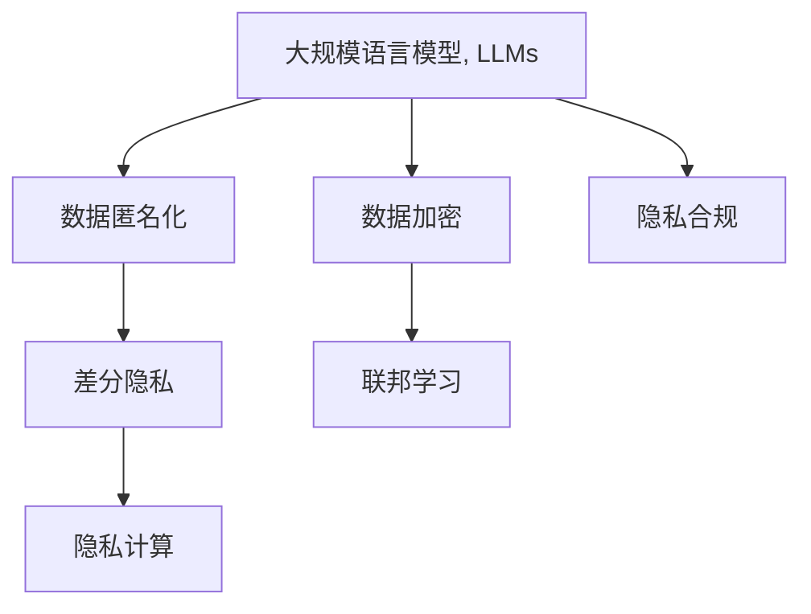

                 

# AI隐私保护：LLM时代的数据安全

## 1. 背景介绍

### 1.1 问题由来

随着人工智能技术的迅猛发展，特别是大规模语言模型（Large Language Models, LLMs）的崛起，自然语言处理（Natural Language Processing, NLP）技术的应用场景不断拓展，涉及到的数据量也在急剧增长。与此同时，数据隐私保护问题也日益凸显，成为AI应用中的一大难题。

大语言模型，如GPT-3、BERT等，通常以数十亿参数量级存在，这些模型在训练和推理过程中需要大量的数据支持。然而，这些数据往往包含敏感信息，如个人隐私、商业机密等，如果处理不当，可能导致严重的隐私泄露问题。此外，LLM在生成式模型上的特点，还使得其生成的文本可能无意中包含敏感信息，进一步加剧了隐私保护的风险。

因此，如何在享受LLM带来的便捷与高效的同时，有效保护用户隐私，成为一个亟需解决的问题。本文将对LLM时代的数据隐私保护进行深入探讨，从原理到实践，提出一系列隐私保护策略和解决方案，帮助开发者在使用LLM时，有效应对数据隐私挑战。

### 1.2 问题核心关键点

在LLM时代，数据隐私保护的核心问题包括：

1. **数据匿名化**：在模型训练和推理中，如何保证数据不被反向追踪，保障用户隐私。
2. **数据加密**：在数据传输和存储过程中，如何保证数据不被未授权访问，避免数据泄露。
3. **模型鲁棒性**：在模型生成文本时，如何避免敏感信息的误触发，确保输出的安全性。
4. **隐私计算**：在多方协作的数据处理中，如何在不共享原始数据的情况下，进行有效的计算和分析。
5. **隐私合规**：在法律法规的约束下，如何确保数据处理活动符合隐私保护的相关法规要求。

以上问题构成了LLM时代数据隐私保护的主要挑战，解决这些问题需要综合运用多种技术手段，构建完善的隐私保护框架。

## 2. 核心概念与联系

### 2.1 核心概念概述

为更好地理解LLM时代的数据隐私保护，本节将介绍几个关键概念及其相互之间的联系：

- **大规模语言模型（Large Language Models, LLMs）**：指以Transformer架构为基础，参数量级在数十亿以上的预训练模型。通过在大量无标签文本数据上自监督预训练，LLMs具备强大的语言理解和生成能力。
- **隐私保护（Privacy Protection）**：指在数据处理过程中，确保用户隐私不受侵犯，防止数据泄露、滥用或误用的一系列技术手段和方法。
- **数据匿名化（Data Anonymization）**：指通过数据变换，将个人身份信息隐藏，避免数据被反向追踪的技术。
- **数据加密（Data Encryption）**：指通过加密算法，保护数据在存储和传输过程中的安全性，防止未经授权的访问。
- **差分隐私（Differential Privacy）**：指在数据统计和分析中，通过加入噪声，确保个体数据不被泄露的一种隐私保护机制。
- **联邦学习（Federated Learning）**：指在分布式环境中，多个参与方通过模型参数共享，在不共享原始数据的情况下，协同训练模型。
- **隐私计算（Privacy-Preserving Computation）**：指在数据不出本地环境的情况下，通过计算外包等技术手段，进行隐私保护的计算任务。

这些概念之间存在紧密联系，共同构成了LLM时代数据隐私保护的完整体系。

### 2.2 核心概念原理和架构的 Mermaid 流程图



这个流程图展示了LLM与隐私保护各核心概念之间的联系，以及它们如何共同保护用户隐私。

## 3. 核心算法原理 & 具体操作步骤

### 3.1 算法原理概述

LLM时代的数据隐私保护，本质上是通过一系列算法和技术手段，在保证模型性能的前提下，尽可能地减少数据泄露和隐私侵害的风险。常见的隐私保护算法包括：

1. **数据匿名化算法**：通过替换、扰动、去标识化等手段，保护数据中的敏感信息。
2. **差分隐私算法**：在模型训练和推理中，加入噪声，确保个体数据不被泄露。
3. **数据加密算法**：通过加密算法保护数据在传输和存储过程中的安全性。
4. **隐私计算算法**：在不共享原始数据的情况下，进行隐私保护的计算任务。

这些算法可以单独使用，也可以结合使用，构建更全面、更安全的隐私保护框架。

### 3.2 算法步骤详解

以差分隐私算法为例，其具体步骤如下：

1. **隐私预算设定**：定义一个隐私预算 $\epsilon$，用于衡量差分隐私的程度。$\epsilon$ 越小，隐私保护越强，但模型的实用性也会随之降低。
2. **噪声加入**：在模型输入或输出中加入噪声，以防止个体数据被泄露。常用的噪声类型包括拉普拉斯噪声、高斯噪声等。
3. **模型训练与推理**：在加入噪声的情况下，训练和推理模型。
4. **隐私损失评估**：通过评估模型输出的差分隐私损失，确保满足设定的隐私预算。

差分隐私的数学模型和具体实现过程较为复杂，本文将在后续章节中详细介绍。

### 3.3 算法优缺点

差分隐私算法的优点包括：

1. **隐私保护强**：通过加入噪声，可以有效地保护个体数据不被泄露。
2. **适用范围广**：可以应用于各种类型的NLP任务，如文本分类、命名实体识别、对话系统等。

其缺点包括：

1. **性能损失**：噪声的加入会影响模型的精度和鲁棒性。
2. **参数复杂**：设定隐私预算和噪声分布需要精心设计，调整过程复杂。
3. **计算开销大**：噪声的加入和隐私损失评估需要额外的计算资源。

总体而言，差分隐私算法在隐私保护方面表现优异，但在实际应用中需要权衡隐私保护与模型性能之间的关系。

### 3.4 算法应用领域

差分隐私算法已经在多个领域得到了广泛应用，例如：

1. **金融风控**：在用户数据收集和分析过程中，使用差分隐私保护用户隐私，防止金融风险信息泄露。
2. **医疗隐私保护**：在医学研究和医疗服务中，使用差分隐私保护患者隐私，确保数据安全。
3. **社交网络隐私**：在社交媒体数据分析中，使用差分隐私保护用户行为数据，防止数据滥用。
4. **智能推荐系统**：在推荐算法中，使用差分隐私保护用户偏好数据，防止数据泄露。

LLM时代的数据隐私保护技术，也将在上述领域得到更广泛的应用，为数据驱动型业务提供更强的隐私保障。

## 4. 数学模型和公式 & 详细讲解 & 举例说明

### 4.1 数学模型构建

差分隐私（Differential Privacy, DP）模型定义如下：

假设模型 $M$ 接受输入数据 $x$，输出结果 $y$。为了保护隐私，模型在每次输入 $x$ 时，都会加入噪声 $\xi$，得到输出 $y'$：

$$
y' = M(x, \xi)
$$

其中，$\xi$ 遵循某种噪声分布 $P(\xi)$。模型的差分隐私定义为：

$$
\epsilon\text{-}DP \iff \forall x, x' \sim P_x, ||M(x) - M(x')||_{\infty} \leq \epsilon + \frac{\Delta}{\epsilon} \cdot ||\xi||_{\infty}
$$

其中，$\Delta$ 是数据的敏感度，$||.||_{\infty}$ 表示无穷范数，$P_x$ 表示 $x$ 的分布。

差分隐私的目标是在加入噪声后，模型的输出变化不超过 $\epsilon$，同时噪声的敏感度不超过 $\Delta$。

### 4.2 公式推导过程

为了实现差分隐私，通常使用拉普拉斯噪声和高斯噪声两种噪声。以拉普拉斯噪声为例，其数学推导过程如下：

假设模型 $M$ 的输出 $y$ 为一个向量，$y_i$ 表示模型对输入 $x$ 中第 $i$ 个特征的预测值。加入拉普拉斯噪声后的输出为 $y'_i$：

$$
y'_i = y_i + \xi_i
$$

其中，$\xi_i \sim L(1/\sigma)$，$\sigma$ 是噪声的标准差。为了满足 $\epsilon$ 差分隐私的要求，拉普拉斯噪声的敏感度 $\Delta$ 需要满足：

$$
\Delta = \max_i ||y_i - y'_i||_{\infty} \leq \frac{\epsilon}{\sigma}
$$

因此，$\sigma$ 需要满足：

$$
\sigma \geq \frac{\epsilon}{\Delta}
$$

在实际应用中，$P_x$ 可以是数据集的分布，也可以是模型训练数据的分布。为了计算差分隐私损失，需要对每个特征进行噪声加入，然后计算输出变化的无穷范数，并确保其不超过 $\epsilon + \frac{\Delta}{\epsilon} \cdot ||\xi||_{\infty}$。

### 4.3 案例分析与讲解

以文本分类为例，假设模型 $M$ 接受输入文本 $x$，输出分类结果 $y$。加入拉普拉斯噪声后，输出为 $y'$：

$$
y'_i = y_i + \xi_i
$$

其中，$\xi_i \sim L(1/\sigma)$。为了满足 $\epsilon$ 差分隐私的要求，需要对每个特征 $x_i$ 进行噪声加入，并计算输出变化的无穷范数：

$$
\max_i ||y_i - y'_i||_{\infty} \leq \frac{\epsilon}{\sigma} + \frac{\Delta}{\epsilon}
$$

其中，$\Delta$ 是文本分类的敏感度。通过合理选择 $\epsilon$ 和 $\sigma$，可以在满足隐私要求的前提下，尽可能地提高模型的实用性。

## 5. 项目实践：代码实例和详细解释说明

### 5.1 开发环境搭建

在进行差分隐私实践前，我们需要准备好开发环境。以下是使用Python进行PyTorch开发的环境配置流程：

1. 安装Anaconda：从官网下载并安装Anaconda，用于创建独立的Python环境。

2. 创建并激活虚拟环境：
```bash
conda create -n dp-env python=3.8 
conda activate dp-env
```

3. 安装PyTorch：根据CUDA版本，从官网获取对应的安装命令。例如：
```bash
conda install pytorch torchvision torchaudio cudatoolkit=11.1 -c pytorch -c conda-forge
```

4. 安装TensorFlow：
```bash
conda install tensorflow -c conda-forge
```

5. 安装TensorFlow Privacy库：
```bash
pip install tensorflow-privacy
```

完成上述步骤后，即可在`dp-env`环境中开始差分隐私实践。

### 5.2 源代码详细实现

下面是使用TensorFlow Privacy库进行文本分类任务差分隐私保护的具体代码实现。

首先，定义差分隐私保护函数：

```python
import tensorflow as tf
import tensorflow_privacy as tfpriv

def add_laplacian_noise(feature, epsilon, delta):
    laplace = tfpriv.add_laplacian_noise(feature, epsilon, delta)
    return laplace
```

然后，定义模型和数据集：

```python
from tensorflow.keras import datasets, layers, models

(train_images, train_labels), (test_images, test_labels) = datasets.cifar10.load_data()

model = models.Sequential()
model.add(layers.Conv2D(32, (3, 3), activation='relu', input_shape=(32, 32, 3)))
model.add(layers.MaxPooling2D((2, 2)))
model.add(layers.Conv2D(64, (3, 3), activation='relu'))
model.add(layers.MaxPooling2D((2, 2)))
model.add(layers.Conv2D(64, (3, 3), activation='relu'))
model.add(layers.Flatten())
model.add(layers.Dense(64, activation='relu'))
model.add(layers.Dense(10))

model.compile(optimizer='adam',
              loss=tf.keras.losses.SparseCategoricalCrossentropy(from_logits=True),
              metrics=['accuracy'])

train_dataset = tf.data.Dataset.from_tensor_slices((train_images, train_labels))
train_dataset = train_dataset.shuffle(10000).batch(64)

test_dataset = tf.data.Dataset.from_tensor_slices((test_images, test_labels))
test_dataset = test_dataset.batch(64)

noise_epsilon = 0.1
noise_delta = 0.1
```

最后，使用差分隐私保护函数进行差分隐私训练：

```python
for epoch in range(epochs):
    for batch in train_dataset:
        images, labels = batch
        with tf.GradientTape() as tape:
            logits = model(images)
            loss = tf.keras.losses.SparseCategoricalCrossentropy()(labels, logits)
        gradients = tape.gradient(loss, model.trainable_variables)
        noise = add_laplacian_noise(gradients, noise_epsilon, noise_delta)
        optimizer.apply_gradients(zip(noise, model.trainable_variables))
    test_loss, test_acc = model.evaluate(test_images, test_labels)
    print(f"Epoch {epoch+1}, test loss: {test_loss:.4f}, test acc: {test_acc:.4f}")
```

以上就是使用TensorFlow进行差分隐私保护的完整代码实现。可以看到，通过引入差分隐私保护函数，模型在训练过程中加入了拉普拉斯噪声，实现了差分隐私保护。

### 5.3 代码解读与分析

让我们再详细解读一下关键代码的实现细节：

**add_laplacian_noise函数**：
- 定义在`tensorflow_privacy`库中，用于向梯度加入拉普拉斯噪声。
- 函数接受模型梯度`feature`，隐私保护参数`epsilon`和`delta`，返回加入噪声后的梯度。

**模型和数据集定义**：
- 使用`tensorflow.keras`定义了一个简单的卷积神经网络模型。
- 加载CIFAR-10数据集，将其转换为TensorFlow Dataset对象，进行批量化处理。
- 设置噪声参数`noise_epsilon`和`noise_delta`，用于差分隐私保护。

**差分隐私训练**：
- 在每个epoch中，对训练集数据进行迭代训练。
- 使用`tf.GradientTape`记录梯度，并加入拉普拉斯噪声。
- 使用优化器`optimizer`更新模型参数。
- 在每个epoch结束后，评估模型在测试集上的性能。

可以看到，差分隐私保护的实现，主要是在模型的训练过程中加入拉普拉斯噪声，从而保护数据隐私。在实际应用中，还需要根据具体任务和数据特点，选择合适的噪声分布和隐私保护参数，以平衡隐私保护和模型性能。

## 6. 实际应用场景

### 6.1 智能客服系统

智能客服系统在处理用户咨询时，往往需要访问用户的聊天记录和个人信息。为保护用户隐私，可以在客服系统内部进行差分隐私保护，确保用户在对话过程中，个人信息不被泄露。具体而言，可以在客服系统中引入差分隐私保护机制，对用户的聊天记录进行噪声加入，使得信息难以被反向追踪。

### 6.2 金融风控系统

金融机构在处理用户数据时，需要确保用户隐私不被泄露。在金融风控系统中，可以使用差分隐私保护机制，对用户的历史交易数据进行噪声加入，防止数据被非法访问和滥用。同时，在模型训练过程中，可以采用差分隐私保护算法，确保模型在保护隐私的同时，仍能获得较高的预测精度。

### 6.3 医疗数据分析

医疗数据包含大量敏感信息，如患者病历、诊断记录等。在医疗数据分析中，可以采用差分隐私保护算法，对患者数据进行噪声加入，保护患者隐私。同时，在模型训练过程中，可以使用差分隐私保护算法，确保模型的训练数据和推理结果符合隐私保护的要求。

### 6.4 社交媒体分析

社交媒体平台在用户数据收集和分析过程中，需要确保用户隐私不被泄露。在社交媒体分析中，可以采用差分隐私保护算法，对用户行为数据进行噪声加入，防止数据被滥用。同时，在模型训练过程中，可以采用差分隐私保护算法，确保模型在保护隐私的同时，仍能获得较高的预测精度。

## 7. 工具和资源推荐

### 7.1 学习资源推荐

为了帮助开发者系统掌握差分隐私保护的理论基础和实践技巧，这里推荐一些优质的学习资源：

1. 《Differential Privacy: Foundations, Techniques, and Applications》书籍：该书系统介绍了差分隐私的原理、技术和应用，是差分隐私领域的经典之作。
2. CS636《隐私保护技术》课程：斯坦福大学开设的隐私保护课程，涵盖了差分隐私、同态加密等隐私保护技术。
3. TensorFlow Privacy官方文档：提供了详细的差分隐私保护API，以及相关的样例代码。
4. PyTorch Privacy官方文档：提供了差分隐私保护的官方API和示例代码。
5. Kaggle差分隐私竞赛：提供了大量的差分隐私保护实践案例，供开发者学习和实践。

通过对这些资源的学习实践，相信你一定能够快速掌握差分隐私保护的技巧，并用于解决实际的隐私保护问题。

### 7.2 开发工具推荐

高效的开发离不开优秀的工具支持。以下是几款用于差分隐私保护开发的常用工具：

1. TensorFlow Privacy：Google开源的差分隐私保护库，支持TensorFlow模型，提供了丰富的API和样例代码。
2. PyTorch Privacy：Facebook开源的差分隐私保护库，支持PyTorch模型，提供了详细的文档和教程。
3. OpenDP：由IBM开发的开源差分隐私保护框架，支持多种数据类型和算法。
4. PySyft：Facebook开发的隐私保护机器学习框架，支持差分隐私保护、同态加密等多种隐私保护技术。
5. TensorBoard：TensorFlow配套的可视化工具，可实时监测模型训练状态，提供丰富的图表呈现方式。

合理利用这些工具，可以显著提升差分隐私保护的开发效率，加快创新迭代的步伐。

### 7.3 相关论文推荐

差分隐私保护技术的研究源于学界的持续努力。以下是几篇奠基性的相关论文，推荐阅读：

1. Differential Privacy：A Framework for Privacy-Preserving Data Analysis：差分隐私的开创性论文，提出了差分隐私的定义和隐私预算的概念。
2. Privacy-Preserving Deep Learning: Architectures, Estimators, and Tools：介绍了差分隐私保护在深度学习中的应用，包括模型架构、隐私预算估计和隐私保护工具。
3. Machine Learning Privacy: Privacy Preserving Deep Learning and Statistical Machine Learning：讨论了差分隐私保护在深度学习和统计学习中的应用，提供了丰富的案例分析。
4. Privacy-Preserving Collaborative Learning in Multi-Party Systems：探讨了多方协作数据处理中的隐私保护问题，提出了联邦学习等隐私保护技术。
5. Privacy-Preserving Mining of Association Rules from a Decentralized Database using Differential Privacy：提出了在分布式数据库中保护隐私的关联规则挖掘方法，具有较强的实际应用价值。

这些论文代表了大规模语言模型隐私保护技术的发展脉络。通过学习这些前沿成果，可以帮助研究者把握学科前进方向，激发更多的创新灵感。

## 8. 总结：未来发展趋势与挑战

### 8.1 总结

本文对基于差分隐私保护的LLM时代数据隐私保护方法进行了全面系统的介绍。首先阐述了LLM时代数据隐私保护的重要性，明确了差分隐私保护在隐私保护中的核心地位。其次，从原理到实践，详细讲解了差分隐私保护的数学模型和关键步骤，给出了差分隐私保护的完整代码实例。同时，本文还广泛探讨了差分隐私保护在智能客服、金融风控、医疗隐私保护等多个行业领域的应用前景，展示了差分隐私保护范式的巨大潜力。此外，本文精选了差分隐私保护的各类学习资源，力求为读者提供全方位的技术指引。

通过本文的系统梳理，可以看到，基于差分隐私保护的LLM隐私保护技术正在成为NLP领域的重要范式，极大地拓展了LLM的应用边界，保护了用户隐私，提升了数据处理的安全性。未来，伴随差分隐私保护方法的不断演进，基于LLM的隐私保护技术也将不断优化，更好地服务于各类NLP应用。

### 8.2 未来发展趋势

展望未来，差分隐私保护技术将呈现以下几个发展趋势：

1. **模型高效化**：差分隐私保护将更加注重模型的高效化和性能提升，引入更高效的噪声分布和隐私保护算法，实现更低隐私损失和更高模型性能的平衡。
2. **多模态融合**：差分隐私保护将逐步拓展到多模态数据融合中，结合视觉、听觉、文本等多种模态，进行更全面、更细致的隐私保护。
3. **跨领域应用**：差分隐私保护将更广泛地应用于金融、医疗、教育等多个垂直行业，为数据驱动型业务提供更强的隐私保护。
4. **自动化调参**：差分隐私保护将引入自动化调参技术，通过算法优化和参数调整，实现隐私预算的最优设定，提高差分隐私保护的效果。
5. **联邦学习结合**：差分隐私保护将与联邦学习技术结合，在不共享原始数据的情况下，进行分布式模型训练，提高隐私保护的鲁棒性。

以上趋势凸显了差分隐私保护技术的广阔前景。这些方向的探索发展，必将进一步提升差分隐私保护技术的应用水平，为数据驱动型业务提供更强的隐私保障。

### 8.3 面临的挑战

尽管差分隐私保护技术已经取得了一定的进展，但在实现大规模语言模型隐私保护的过程中，仍然面临诸多挑战：

1. **隐私预算设定**：隐私预算的设定需要兼顾隐私保护和模型性能，调整过程复杂，容易出现隐私损失和模型性能的权衡问题。
2. **噪声分布选择**：不同的噪声分布对隐私保护效果和模型性能的影响较大，选择合适的噪声分布需要深入研究和大量实验。
3. **多目标优化**：差分隐私保护需要同时考虑隐私保护和模型性能，存在多目标优化的挑战，需要开发更高效的优化算法。
4. **隐私计算效率**：在分布式环境中，隐私保护计算的开销较大，需要优化计算资源，提高隐私计算的效率。
5. **隐私合规性**：差分隐私保护需要符合不同国家和地区的隐私保护法规，增加隐私保护的复杂度。

正视差分隐私保护面临的这些挑战，积极应对并寻求突破，将是大规模语言模型隐私保护技术走向成熟的必由之路。相信随着学界和产业界的共同努力，这些挑战终将一一被克服，差分隐私保护技术必将在构建安全、可靠、可控的智能系统中扮演越来越重要的角色。

### 8.4 研究展望

面对差分隐私保护所面临的挑战，未来的研究需要在以下几个方面寻求新的突破：

1. **隐私保护范式创新**：探索新的隐私保护范式，如隐私增强学习、隐私生成对抗网络等，提升隐私保护的深度和广度。
2. **隐私保护模型优化**：开发更高效的隐私保护模型，如联邦学习、隐私计算、差分隐私等，实现更低隐私损失和更高模型性能的平衡。
3. **隐私保护算法优化**：优化隐私保护算法的计算效率和准确性，提高隐私保护的效果和实时性。
4. **隐私保护技术集成**：将隐私保护技术与大数据、云计算等技术深度融合，实现更全面、更可靠的隐私保护。
5. **隐私保护法规研究**：深入研究不同国家和地区的隐私保护法规，开发符合法规要求的隐私保护方案，确保数据处理的合法性和合规性。

这些研究方向将引领差分隐私保护技术迈向更高的台阶，为大规模语言模型的隐私保护提供更加坚实的理论基础和实践指南。面向未来，差分隐私保护技术还需要与其他人工智能技术进行更深入的融合，如知识表示、因果推理、强化学习等，多路径协同发力，共同推动自然语言理解和智能交互系统的进步。只有勇于创新、敢于突破，才能不断拓展隐私保护技术的边界，让智能技术更好地造福人类社会。

## 9. 附录：常见问题与解答

**Q1：差分隐私保护是否适用于所有NLP任务？**

A: 差分隐私保护在大多数NLP任务上都能取得不错的效果，特别是对于数据量较小的任务。但对于一些特定领域的任务，如医学、法律等，仅仅依靠通用语料预训练的模型可能难以很好地适应。此时需要在特定领域语料上进一步预训练，再进行差分隐私保护，才能获得理想效果。此外，对于一些需要时效性、个性化很强的任务，如对话、推荐等，差分隐私保护方法也需要针对性的改进优化。

**Q2：如何选择合适的差分隐私保护参数？**

A: 差分隐私保护参数的选择需要兼顾隐私保护和模型性能。通常，隐私预算 $\epsilon$ 和噪声标准差 $\sigma$ 需要根据具体任务和数据特点进行调整。一般来说，$\epsilon$ 越小，隐私保护越强，但模型性能也会随之降低。因此，需要根据实际应用需求，综合考虑隐私保护和模型性能，合理设定隐私预算和噪声标准差。

**Q3：差分隐私保护是否会影响模型性能？**

A: 差分隐私保护会在模型训练过程中加入噪声，影响模型的精度和鲁棒性。但通过合理选择噪声分布和隐私预算，可以在保护隐私的同时，尽可能地提高模型的实用性。此外，一些差分隐私保护算法，如联邦学习，可以在不共享原始数据的情况下，进行分布式模型训练，提高隐私保护的效果和模型性能。

**Q4：如何在实际应用中实施差分隐私保护？**

A: 在实际应用中，差分隐私保护需要结合具体的业务场景和数据特点，进行有针对性的设计和调整。以下是一些实施差分隐私保护的基本步骤：

1. **隐私预算设定**：根据数据敏感度和业务需求，设定隐私预算 $\epsilon$。
2. **噪声加入**：选择合适的噪声分布，向模型梯度加入噪声。
3. **模型训练与推理**：在加入噪声的情况下，训练和推理模型。
4. **隐私损失评估**：通过评估模型输出的差分隐私损失，确保满足设定的隐私预算。
5. **隐私保护验证**：定期对模型进行隐私保护验证，确保隐私保护效果符合要求。

通过以上步骤，可以在保护用户隐私的同时，实现差分隐私保护。

**Q5：差分隐私保护是否需要额外的计算资源？**

A: 差分隐私保护需要在模型训练过程中加入噪声，因此会消耗一定的计算资源。但通过合理优化隐私保护算法和噪声分布，可以在保证隐私保护效果的同时，尽量降低额外的计算开销。此外，联邦学习和差分隐私保护结合，可以在不共享原始数据的情况下，进行分布式模型训练，减少计算资源的消耗。

通过本文的系统梳理，可以看到，基于差分隐私保护的LLM隐私保护技术正在成为NLP领域的重要范式，极大地拓展了LLM的应用边界，保护了用户隐私，提升了数据处理的安全性。未来，伴随差分隐私保护方法的不断演进，基于LLM的隐私保护技术也将不断优化，更好地服务于各类NLP应用。

---

作者：禅与计算机程序设计艺术 / Zen and the Art of Computer Programming

