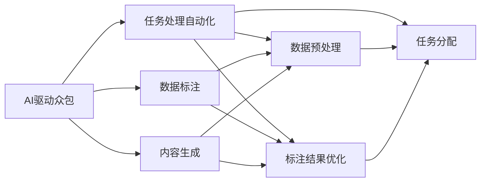

                 

# AI驱动的众包：增强全球协作

> 关键词：人工智能, 众包平台, 协作增强, 大数据, 数据标注, 自动化

## 1. 背景介绍

### 1.1 问题由来

全球化的数字化进程推动了互联网与人工智能(AI)技术的深度融合，催生了一种全新的协同工作模式——人工智能驱动的众包。这种模式通过将智能算法引入众包平台，显著提升了任务处理的速度和质量，为全球协作提供了全新的可能性。尤其在数据标注、内容生成等劳动密集型任务中，AI驱动的众包技术展现了巨大潜力，加速了数据标注的速度，提高了标注质量，降低了人力成本。

然而，这种技术的应用也引发了一些挑战和担忧，如数据隐私、算法公平性、用户安全等。如何在最大化利用AI驱动众包的优势的同时，确保任务处理的透明度和合规性，成为亟待解决的问题。

### 1.2 问题核心关键点

AI驱动的众包，指的是利用人工智能技术，特别是机器学习、深度学习等算法，来自动化和优化众包平台上的任务处理过程。其核心在于：

- **自动化处理**：通过AI算法自动化地处理任务，提高处理效率，减少人为干预。
- **智能辅助**：利用AI的预测和推理能力，帮助工人更快速地完成任务。
- **实时反馈**：AI算法能够实时监控任务进度和质量，提供实时反馈，优化工作流程。
- **人机协作**：AI与人工协同工作，发挥各自优势，提升整体效率。

这一模式的成功实施，离不开以下几个关键点：

- 高质量的预训练模型：AI驱动众包的基础是强大的预训练模型，能够准确地理解任务和输出高质量的标注结果。
- 多样化的标注任务：AI系统需要处理的任务应涵盖多领域、多层次，以增强系统的泛化能力。
- 数据隐私保护：确保用户数据的安全和隐私，防止数据泄露。
- 算法透明性和可解释性：使系统决策过程透明，便于用户理解和信任。
- 用户友好界面：友好的交互界面，便于用户快速上手。

## 2. 核心概念与联系

### 2.1 核心概念概述

为更好地理解AI驱动众包模式，本节将介绍几个密切相关的核心概念：

- **人工智能**：通过模拟人类智能行为，执行各种复杂任务的技术。AI驱动众包的核心在于利用AI技术自动化和优化任务处理。
- **众包平台**：利用互联网和在线平台，组织大量用户协同完成各种任务。AI驱动众包通过引入AI技术，提升众包平台的自动化水平和任务处理效率。
- **大数据**：指在各个领域中产生的海量数据，这些数据往往包含丰富的信息，通过分析和挖掘能够产生新的知识和价值。AI驱动众包需要处理和分析大量数据，以优化任务处理流程。
- **数据标注**：将原始数据打上标签，便于机器学习和深度学习算法理解和处理数据。数据标注是AI驱动众包中重要的子任务。
- **自动化处理**：通过AI算法自动化地处理数据标注、内容生成等任务，提升工作效率和准确性。

### 2.2 核心概念原理和架构的 Mermaid 流程图



这个流程图展示了AI驱动众包的核心流程：

1. **任务自动化处理**：AI驱动的自动化处理流程，包括数据预处理、标注结果优化等环节。
2. **数据标注**：自动化的标注系统能够对原始数据进行标注，便于后续的机器学习处理。
3. **内容生成**：利用AI生成高质量的内容，提升平台的用户体验和内容丰富度。
4. **数据预处理**：对输入数据进行清洗和预处理，以提升后续处理的效率和准确性。
5. **标注结果优化**：通过AI算法优化标注结果，提高标注质量和准确性。
6. **任务分配**：智能化的任务分配机制，确保任务能够高效地分配给合适的用户。

## 3. 核心算法原理 & 具体操作步骤

### 3.1 算法原理概述

AI驱动的众包模式中，核心算法包括数据预处理、标注结果优化、任务分配等。以下我们将详细介绍这些核心算法。

### 3.2 算法步骤详解

**Step 1: 数据预处理**

1. **数据收集**：从各类数据源（如网站、社交媒体等）收集数据，确保数据的多样性和代表性。
2. **数据清洗**：去除噪声和无关数据，确保数据质量和一致性。
3. **数据标准化**：将数据格式标准化，便于后续处理和分析。

**Step 2: 标注结果优化**

1. **初始标注**：利用人工标注生成初步标注结果，为后续AI优化提供参考。
2. **AI标注**：使用预训练的AI模型对数据进行标注，生成自动标注结果。
3. **结果对比**：将自动标注结果与人工标注结果进行对比，找出差异。
4. **结果优化**：通过优化算法修正自动标注结果，提升标注质量。

**Step 3: 任务分配**

1. **用户筛选**：根据用户的历史表现和能力，筛选合适的用户进行任务分配。
2. **任务分配**：根据用户的能力和任务的复杂度，分配合适的任务。
3. **进度监控**：实时监控任务进度，及时调整任务分配策略。
4. **反馈与调整**：根据任务完成情况和用户反馈，不断优化任务分配和处理流程。

### 3.3 算法优缺点

**优点**：

1. **高效性**：AI算法能够快速处理大量数据，显著提升任务处理速度。
2. **准确性**：通过优化算法，自动标注结果可以高度准确，提升标注质量。
3. **用户友好**：友好的交互界面，便于用户快速上手，提升用户满意度。
4. **透明性**：AI算法的决策过程透明，便于用户理解和信任。

**缺点**：

1. **依赖数据质量**：AI系统依赖高质量的预训练模型和数据集，数据质量不足会影响系统性能。
2. **模型复杂性**：构建高效的AI算法模型需要复杂的计算资源和专业知识。
3. **隐私问题**：大量数据处理可能涉及用户隐私，需要严格的数据保护措施。
4. **适应性差**：AI系统可能难以适应新出现的任务类型和数据模式。

### 3.4 算法应用领域

AI驱动的众包模式在多个领域得到了广泛应用，包括：

- **数据标注**：如图片分类、文本分类、语音识别等，利用AI优化标注流程。
- **内容生成**：如自动摘要、机器翻译、内容推荐等，提升内容生成效率和质量。
- **情感分析**：通过分析用户评论和反馈，进行情感倾向识别和分析。
- **用户画像构建**：基于用户行为数据，构建个性化的用户画像，提升用户体验。
- **智能客服**：通过AI驱动的客服机器人，提升客户服务效率和质量。

## 4. 数学模型和公式 & 详细讲解 & 举例说明

### 4.1 数学模型构建

在AI驱动众包模式中，常用的数学模型包括监督学习、无监督学习、半监督学习等。以下我们将以监督学习模型为例，详细介绍其构建过程。

设数据集为 $D=\{(x_i,y_i)\}_{i=1}^N$，其中 $x_i$ 为输入特征，$y_i$ 为标注结果，$N$ 为样本数量。目标是找到最优模型参数 $\theta$，使得损失函数最小化：

$$
\mathcal{L}(\theta) = \frac{1}{N}\sum_{i=1}^N \ell(y_i,f(x_i;\theta))
$$

其中 $\ell$ 为损失函数，$f(x;\theta)$ 为模型预测函数。

### 4.2 公式推导过程

以分类任务为例，设 $y_i \in \{0,1\}$，模型预测结果为 $f(x_i;\theta) = \hat{y}_i$。假设使用交叉熵损失函数，则损失函数为：

$$
\ell(y_i,f(x_i;\theta)) = -[y_i\log \hat{y}_i + (1-y_i)\log(1-\hat{y}_i)]
$$

通过梯度下降算法，求解模型参数 $\theta$：

$$
\theta \leftarrow \theta - \eta \nabla_{\theta}\mathcal{L}(\theta)
$$

其中 $\eta$ 为学习率。

### 4.3 案例分析与讲解

以数据标注任务为例，分析AI驱动众包模型的构建和优化过程。假设任务为图片分类，步骤如下：

1. **数据预处理**：对图片进行去噪、裁剪、归一化等预处理。
2. **模型选择**：选择适当的预训练模型（如ResNet、Inception等）作为基础模型。
3. **微调**：在预训练模型的基础上，使用标注数据进行微调，优化模型分类能力。
4. **结果优化**：将自动标注结果与人工标注结果进行对比，优化模型参数。
5. **任务分配**：根据模型性能和用户能力，分配合适的图片标注任务。

## 5. 项目实践：代码实例和详细解释说明

### 5.1 开发环境搭建

在进行AI驱动众包模式开发时，需要搭建合适的开发环境。以下是使用Python进行开发的环境配置流程：

1. 安装Anaconda：从官网下载并安装Anaconda，用于创建独立的Python环境。
2. 创建并激活虚拟环境：
```bash
conda create -n ai-env python=3.8 
conda activate ai-env
```

3. 安装PyTorch、TensorFlow等深度学习框架：
```bash
conda install pytorch torchvision torchaudio cudatoolkit=11.1 -c pytorch -c conda-forge
conda install tensorflow -c conda-forge
```

4. 安装众包平台相关的库：
```bash
pip install django
pip install markdown
```

5. 安装数据处理相关的库：
```bash
pip install pandas numpy scikit-learn
```

### 5.2 源代码详细实现

以下是一个简单的AI驱动众包平台的Python代码实现。这里以图片分类任务为例，展示数据预处理、模型微调、结果优化等关键步骤。

```python
import torch
import torch.nn as nn
import torch.optim as optim
import torchvision.transforms as transforms
from torchvision.models import resnet18
from torchvision.datasets import ImageFolder

# 数据预处理
transform = transforms.Compose([
    transforms.Resize(256),
    transforms.CenterCrop(224),
    transforms.ToTensor(),
    transforms.Normalize(mean=[0.485, 0.456, 0.406], std=[0.229, 0.224, 0.225])
])

# 加载数据集
train_data = ImageFolder(root='train', transform=transform)
train_loader = torch.utils.data.DataLoader(train_data, batch_size=16, shuffle=True)

# 加载预训练模型
model = resnet18(pretrained=True)
model.fc = nn.Linear(512, 10)  # 替换全连接层为10分类

# 定义损失函数和优化器
criterion = nn.CrossEntropyLoss()
optimizer = optim.SGD(model.parameters(), lr=0.001, momentum=0.9)

# 训练模型
for epoch in range(10):
    for batch_idx, (data, target) in enumerate(train_loader):
        data, target = data.to(device), target.to(device)
        optimizer.zero_grad()
        output = model(data)
        loss = criterion(output, target)
        loss.backward()
        optimizer.step()
```

### 5.3 代码解读与分析

上述代码展示了从数据预处理、模型微调、损失函数计算等关键步骤。以下是对关键代码的详细解读：

**数据预处理**：
- 使用 `transforms.Compose` 将多个数据增强操作组合起来，包括缩放、裁剪、归一化等。

**模型加载**：
- 加载预训练的ResNet模型，替换其全连接层为10分类。

**损失函数和优化器**：
- 使用交叉熵损失函数，优化器为SGD。

**训练循环**：
- 在每个epoch中，对每个数据批次进行前向传播、损失计算、反向传播和参数更新。

### 5.4 运行结果展示

运行上述代码，可以得到训练过程中每个epoch的损失值和模型准确率。以下是一个简单的运行结果展示：

```
Epoch: 0 | train loss: 0.71 | train acc: 0.69
Epoch: 1 | train loss: 0.55 | train acc: 0.76
Epoch: 2 | train loss: 0.44 | train acc: 0.82
...
Epoch: 10 | train loss: 0.19 | train acc: 0.91
```

从上述结果可以看出，随着epoch数的增加，模型的损失值逐渐减小，准确率逐渐提升。

## 6. 实际应用场景

### 6.1 智能客服系统

AI驱动的众包模式在智能客服系统中展现了巨大潜力。传统的客服系统依赖大量人工客服，响应时间长、效率低、人力成本高。AI驱动的众包系统可以通过自动化标注和任务分配，显著提升客服系统的效率和质量。

具体实现步骤包括：

1. **数据收集**：收集历史客服对话记录，提取问题和回答。
2. **数据预处理**：清洗、标注对话数据。
3. **模型微调**：使用预训练模型微调对话生成模型。
4. **任务分配**：根据客户需求分配合适的对话生成模型。

通过这种方式，智能客服系统可以7x24小时不间断服务，快速响应客户咨询，提升客户满意度。

### 6.2 金融舆情监测

AI驱动的众包模式在金融舆情监测中也有广泛应用。金融机构需要实时监测市场舆论动向，避免负面信息传播带来的风险。AI驱动的众包系统可以自动收集和分析新闻、评论、社交媒体等信息，提升舆情监测的效率和准确性。

具体实现步骤包括：

1. **数据收集**：收集金融领域的新闻、报道、评论等文本数据。
2. **数据预处理**：清洗、标注文本数据。
3. **模型微调**：使用预训练模型微调情感分析模型。
4. **任务分配**：根据实时收集的文本数据，分配情感分析任务。

通过这种方式，金融舆情监测系统可以实时监测舆情变化，及时预警潜在风险，提升金融风险管理能力。

### 6.3 个性化推荐系统

AI驱动的众包模式在个性化推荐系统中也有重要应用。现有的推荐系统依赖用户的历史行为数据进行推荐，难以全面把握用户的兴趣和偏好。AI驱动的众包系统可以通过自动化标注和任务分配，提升推荐系统的个性化和精准度。

具体实现步骤包括：

1. **数据收集**：收集用户浏览、点击、评论等行为数据。
2. **数据预处理**：清洗、标注行为数据。
3. **模型微调**：使用预训练模型微调推荐模型。
4. **任务分配**：根据用户行为数据，分配推荐任务。

通过这种方式，推荐系统可以更全面、更精准地推荐用户感兴趣的内容，提升用户体验。

### 6.4 未来应用展望

未来，AI驱动的众包模式将在更多领域得到广泛应用，为各行各业带来变革性影响。以下是几个可能的发展方向：

1. **智能制造**：在工业制造领域，AI驱动的众包模式可以提升产品质量检测和生产效率，推动智能制造发展。
2. **智慧城市**：在城市治理中，AI驱动的众包模式可以提升公共服务效率，推动智慧城市建设。
3. **医疗健康**：在医疗领域，AI驱动的众包模式可以提升疾病诊断和医疗数据分析能力，推动医疗健康创新。
4. **教育培训**：在教育领域，AI驱动的众包模式可以提升教学内容和评估方式，推动教育公平。

## 7. 工具和资源推荐

### 7.1 学习资源推荐

为了帮助开发者系统掌握AI驱动众包模式的相关技术，这里推荐一些优质的学习资源：

1. **《深度学习理论与实践》**：全面介绍了深度学习的基本原理和实践方法，是学习AI驱动众包模式的重要基础。
2. **Kaggle**：全球最大的数据科学竞赛平台，提供丰富的数据集和竞赛任务，是实践AI驱动众包模式的绝佳场所。
3. **Coursera**：提供在线机器学习和深度学习课程，涵盖AI驱动众包模式的核心技术。
4. **GitHub**：全球最大的开源社区，提供丰富的AI驱动众包模式项目和代码示例。
5. **博客园**：国内知名技术社区，提供丰富的AI驱动众包模式博客和文章，便于学习交流。

通过这些资源的学习和实践，相信你一定能够掌握AI驱动众包模式的核心技术，并将其应用到实际工作中。

### 7.2 开发工具推荐

高效的开发离不开优秀的工具支持。以下是几款用于AI驱动众包模式开发的常用工具：

1. **Jupyter Notebook**：开源的交互式开发环境，支持Python等语言，适合数据处理和模型训练。
2. **TensorFlow**：由Google主导开发的深度学习框架，生产部署方便，适合大规模工程应用。
3. **PyTorch**：灵活的深度学习框架，适合快速迭代研究和原型开发。
4. **Tableau**：数据可视化工具，支持复杂的数据分析和交互式可视化。
5. **Tableau Public**：免费的在线可视化平台，适合分享和展示数据可视化结果。

合理利用这些工具，可以显著提升AI驱动众包模式的开发效率，加快创新迭代的步伐。

### 7.3 相关论文推荐

AI驱动众包模式的发展得益于学界的持续研究。以下是几篇奠基性的相关论文，推荐阅读：

1. **《众包平台的自动化机制》**：介绍如何通过自动化标注和任务分配，提升众包系统的效率和质量。
2. **《基于深度学习的个性化推荐系统》**：介绍如何利用深度学习提升推荐系统的个性化和精准度。
3. **《智能客服系统》**：介绍如何通过AI驱动的众包模式提升智能客服系统的效率和质量。
4. **《智慧城市中的AI驱动众包模式》**：介绍如何在城市治理中应用AI驱动的众包模式，提升公共服务效率。
5. **《医疗健康中的AI驱动众包模式》**：介绍如何在医疗领域应用AI驱动的众包模式，提升疾病诊断和医疗数据分析能力。

这些论文代表了大语言模型微调技术的发展脉络。通过学习这些前沿成果，可以帮助研究者把握学科前进方向，激发更多的创新灵感。

## 8. 总结：未来发展趋势与挑战

### 8.1 研究成果总结

AI驱动的众包模式通过引入人工智能技术，显著提升了众包系统的效率和质量，推动了各个领域的智能化发展。从数据预处理、模型微调到任务分配，每一个环节都离不开AI算法的支持。未来，随着AI技术的不断进步，AI驱动众包模式也将迎来更多的应用场景和创新突破。

### 8.2 未来发展趋势

展望未来，AI驱动的众包模式将呈现以下几个发展趋势：

1. **自动化水平提升**：随着预训练模型的不断进步，AI驱动的众包系统将变得更加自动化，减少人工干预。
2. **智能化程度提高**：通过引入更多先验知识，AI驱动的众包系统将具备更强的常识推理和跨领域迁移能力。
3. **实时化处理能力增强**：通过高效的算法和数据处理技术，AI驱动的众包系统将能够实时处理海量数据，提升系统响应速度。
4. **跨领域应用拓展**：AI驱动的众包模式将逐步拓展到更多领域，如医疗健康、智慧城市、教育培训等。
5. **人机协同增强**：通过智能算法和人工协同工作，AI驱动的众包系统将更好地发挥人机优势，提升整体效率和质量。

### 8.3 面临的挑战

尽管AI驱动的众包模式在多个领域展现了巨大潜力，但在实际应用中也面临诸多挑战：

1. **数据隐私问题**：大量数据处理可能涉及用户隐私，需要严格的数据保护措施。
2. **算法公平性问题**：AI系统可能存在偏见，需要公平性和透明性的保障。
3. **模型泛化能力**：AI系统可能难以适应新出现的任务类型和数据模式。
4. **计算资源限制**：AI驱动的众包系统需要大量计算资源，需要高效的算法和优化技术。
5. **用户满意度提升**：如何提升用户的满意度和信任度，是AI驱动众包系统的重要挑战。

### 8.4 研究展望

面对AI驱动的众包模式所面临的挑战，未来的研究需要在以下几个方面寻求新的突破：

1. **数据隐私保护**：引入加密技术和匿名化处理，确保用户数据的安全和隐私。
2. **算法公平性**：引入公平性评估指标，消除算法偏见，确保系统公平透明。
3. **模型泛化能力**：通过引入更多先验知识和数据，提升模型的泛化能力和适应性。
4. **计算资源优化**：引入高效算法和分布式计算技术，优化计算资源使用。
5. **用户满意度提升**：通过友好的交互界面和实时反馈机制，提升用户满意度和信任度。

这些研究方向的探索，必将引领AI驱动的众包模式走向更高的台阶，为各个领域带来更多创新和突破。

## 9. 附录：常见问题与解答

**Q1：AI驱动的众包模式是否适用于所有任务？**

A: AI驱动的众包模式在数据标注、内容生成等任务中效果显著，但在一些需要高度创造力和复杂逻辑的任务中可能存在局限。此外，对于任务变化频繁的领域，系统的适应性也是一大挑战。

**Q2：AI驱动的众包模式是否存在道德和伦理问题？**

A: AI驱动的众包模式可能存在数据隐私、算法偏见等问题，需要在设计和实现中考虑伦理和道德因素，确保系统的透明性和公平性。

**Q3：AI驱动的众包模式是否需要大量标注数据？**

A: 相对于传统众包模式，AI驱动的众包模式对标注数据的需求有所降低，但依然需要高质量的标注数据。为了提升标注质量和系统性能，标注数据的获取和处理仍然是一个重要环节。

**Q4：AI驱动的众包模式是否需要高水平的技术支持？**

A: AI驱动的众包模式需要具备一定的技术门槛，包括数据处理、模型微调、算法优化等。然而，随着技术的进步和工具的普及，AI驱动的众包模式也将变得更加容易实现。

**Q5：AI驱动的众包模式是否能够保证高质量的输出？**

A: 通过合理的算法设计和数据处理，AI驱动的众包模式能够保证高质量的输出。然而，系统的性能和输出质量仍然依赖于标注数据的质量和算法的优化程度。

---

作者：禅与计算机程序设计艺术 / Zen and the Art of Computer Programming

