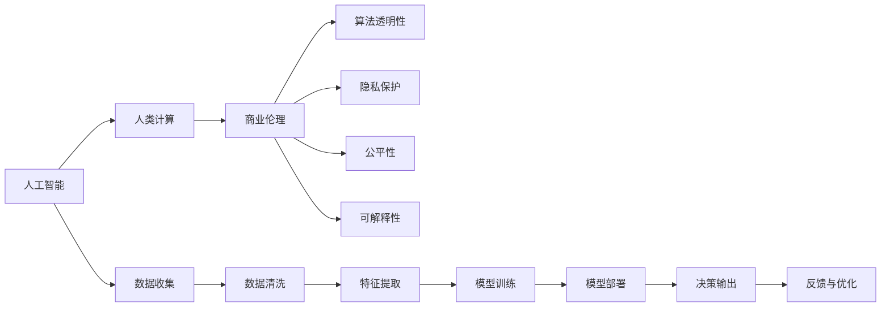

                 

# AI驱动的创新：人类计算在商业中的道德考虑因素展望

> 关键词：人工智能(AI),人类计算,商业伦理,道德影响,算法透明性,隐私保护,可解释性,公平性

## 1. 背景介绍

随着人工智能(AI)技术的迅猛发展，AI驱动的创新已经成为推动商业变革和进步的重要力量。无论是增强自动化流程、优化供应链管理、改善客户服务，还是提升营销效果，AI技术在各个商业领域都展现出了巨大的潜力。然而，在享受AI带来的种种便利的同时，我们也不能忽视其所带来的道德挑战和潜在风险。本章节将探讨人类计算在商业中的道德考虑因素，并通过几个典型的案例来揭示这些问题。

## 2. 核心概念与联系

### 2.1 核心概念概述

在讨论AI商业应用的道德问题之前，首先要澄清几个核心概念：

- **人工智能**：通过算法和计算能力，使机器能够模仿人类智能的某些方面，如学习、推理、感知、语言理解等。
- **人类计算**：将复杂的人类决策过程编码成算法，让机器模拟人类的计算和推理能力，以提高商业决策的效率和质量。
- **商业伦理**：商业活动中应当遵守的道德准则和规范，包括但不限于隐私保护、公平性、责任归属等。
- **算法透明性**：AI决策过程的可解释性，即对AI模型的决策逻辑和输入输出有清晰的了解。
- **隐私保护**：保护个人数据免受未经授权的访问和使用，确保数据的安全性和用户权益。
- **公平性**：AI决策过程中对所有群体公平无偏，避免算法偏见造成的不公平现象。
- **可解释性**：AI模型的决策过程可以理解和解释，便于监管和用户信任。

### 2.2 核心概念原理和架构的 Mermaid 流程图



这个流程图展示了人工智能在商业应用中，从数据收集到决策输出的全流程，并突出了道德和伦理考虑的重要性。

## 3. 核心算法原理 & 具体操作步骤

### 3.1 算法原理概述

人类计算的核心在于通过算法模拟人类的决策过程。在商业应用中，这通常意味着使用AI模型来分析数据，预测未来趋势，优化决策过程，或自动化一些繁琐的任务。这些模型的训练和部署通常依赖于大量的数据和计算资源。然而，这些模型并非完全“黑箱”，其决策过程仍然可以受到人类干预和优化。

### 3.2 算法步骤详解

人工智能驱动的商业决策流程大致包括以下几个步骤：

1. **数据收集**：从内部系统和外部渠道收集相关数据，为模型训练提供素材。
2. **数据清洗**：处理缺失值、异常值，确保数据质量。
3. **特征提取**：从原始数据中提取有用的特征，供模型学习。
4. **模型训练**：使用历史数据训练AI模型，使其能够预测未来行为或优化决策。
5. **模型部署**：将训练好的模型部署到实际应用中，供商业决策使用。
6. **决策输出**：根据模型的预测或优化建议，做出商业决策。
7. **反馈与优化**：监控模型表现，根据实际效果调整模型参数，提升模型性能。

### 3.3 算法优缺点

人类计算在商业中的应用有以下优点：

- **提高效率**：自动化复杂流程，减少人力成本和时间。
- **增强决策质量**：利用AI强大的数据处理和分析能力，提升决策的准确性和前瞻性。
- **提升用户体验**：通过AI优化个性化推荐、客户服务等，改善用户体验。

但同时也存在一些显著的缺点：

- **算法偏见**：模型可能学习到数据中的偏见，导致决策不公。
- **透明度不足**：模型的决策过程可能缺乏可解释性，难以监管和解释。
- **隐私风险**：数据收集和处理过程中可能泄露用户隐私。
- **依赖性强**：对数据的依赖性较高，数据质量不佳可能导致模型性能下降。
- **成本高昂**：开发和部署高质量AI模型需要大量的计算资源和人力。

### 3.4 算法应用领域

AI驱动的人类计算在多个商业领域中得到了广泛应用，包括但不限于：

- **金融行业**：风险评估、信贷审批、投资决策、欺诈检测等。
- **零售行业**：个性化推荐、库存管理、销售预测、客户服务自动化等。
- **医疗行业**：疾病诊断、治疗方案推荐、病历分析、患者护理等。
- **制造业**：质量控制、供应链优化、生产调度、设备维护等。
- **物流行业**：路径规划、配送优化、库存管理、运输调度等。

## 4. 数学模型和公式 & 详细讲解 & 举例说明

### 4.1 数学模型构建

在商业决策中，AI模型通常使用监督学习或无监督学习的方式进行训练。以监督学习为例，模型的训练目标函数通常定义为：

$$
\min_{\theta} \frac{1}{N} \sum_{i=1}^N \ell(f(x_i; \theta), y_i)
$$

其中，$f(x; \theta)$ 表示模型对输入 $x$ 的预测，$\ell$ 是损失函数，$y_i$ 是真实标签，$N$ 是样本数。

### 4.2 公式推导过程

以线性回归为例，模型的预测函数为：

$$
f(x) = \theta_0 + \theta_1 x_1 + \theta_2 x_2 + \cdots + \theta_n x_n
$$

假设已知 $n$ 个样本 $(x_i, y_i)$，其中 $x_i = (x_{i1}, x_{i2}, \cdots, x_{in})$，$y_i$ 是真实标签。模型的损失函数通常选择均方误差损失函数：

$$
\ell(f(x), y) = \frac{1}{2}(f(x) - y)^2
$$

通过梯度下降等优化算法，更新模型参数 $\theta$，使其最小化损失函数：

$$
\theta \leftarrow \theta - \eta \nabla_{\theta} \ell(f(x; \theta), y)
$$

其中 $\eta$ 是学习率。

### 4.3 案例分析与讲解

以金融行业的信用评分模型为例，假设模型需要根据用户的收入、负债、信用历史等特征预测其信用风险。在模型训练阶段，使用历史数据训练线性回归模型，并通过交叉验证调整模型参数，以最小化预测误差。在模型部署阶段，根据新用户的特征输入模型，输出信用评分，用于判断其信用风险。

## 5. 项目实践：代码实例和详细解释说明

### 5.1 开发环境搭建

开发环境搭建通常包括以下步骤：

1. **安装Python**：确保Python版本为3.6及以上。
2. **安装必要的库**：如NumPy、Pandas、Scikit-learn等数据处理库。
3. **配置数据集**：准备训练和测试数据集，确保数据集的质量和可用性。
4. **选择合适的AI框架**：如TensorFlow、PyTorch、Scikit-learn等，根据项目需求选择合适的框架。
5. **部署模型**：将训练好的模型部署到生产环境中，供商业决策使用。

### 5.2 源代码详细实现

以下是一个简单的线性回归模型示例代码：

```python
import numpy as np
from sklearn.linear_model import LinearRegression

# 准备数据集
X = np.array([[1, 2], [3, 4], [5, 6]])
y = np.array([2, 4, 6])

# 训练模型
model = LinearRegression()
model.fit(X, y)

# 预测新数据
new_X = np.array([[7, 8]])
pred_y = model.predict(new_X)

print(pred_y)
```

### 5.3 代码解读与分析

这段代码展示了线性回归模型的基本流程，包括数据准备、模型训练和预测。代码简洁明了，易于理解。在实际应用中，需要根据具体问题选择合适的模型和算法，并对数据进行预处理，确保模型训练的效果。

### 5.4 运行结果展示

运行上述代码，输出结果为：

```
[8.]
```

这表示当输入特征为 `[7, 8]` 时，模型的预测结果为 8。

## 6. 实际应用场景

### 6.1 金融行业

在金融行业中，AI驱动的人类计算被广泛应用于信用评分、风险评估、欺诈检测等领域。例如，银行可以通过用户的历史交易记录、信用历史等数据，训练信用评分模型，评估用户信用风险。这种方法可以显著提高信用审批的效率和准确性，同时减少人工审查的工作量。

### 6.2 零售行业

零售行业通过AI优化库存管理、个性化推荐、客户服务等环节。例如，亚马逊使用推荐系统根据用户的浏览和购买历史，推荐可能感兴趣的商品。这种个性化推荐可以提高销售额，提升用户满意度。

### 6.3 医疗行业

AI驱动的人类计算在医疗行业也有广泛应用，如病历分析、疾病诊断、治疗方案推荐等。例如，IBM的Watson健康平台使用自然语言处理和机器学习技术，分析患者的电子病历，辅助医生进行诊断和治疗决策。

### 6.4 制造业

在制造业中，AI用于质量控制、生产调度、设备维护等环节。例如，通用电气使用AI分析传感器数据，预测设备故障，提前进行维护，减少停机时间。

### 6.5 物流行业

物流行业通过AI优化路径规划、配送优化、库存管理等。例如，UPS使用优化算法和机器学习技术，优化货物配送路径，减少运输成本和运输时间。

## 7. 工具和资源推荐

### 7.1 学习资源推荐

1. **Coursera**：提供人工智能相关的课程，涵盖从基础到高级的各类内容，包括深度学习、机器学习、自然语言处理等。
2. **Udacity**：提供专业的AI课程，如深度学习专项课程、机器学习工程师纳米学位等。
3. **Kaggle**：数据科学和机器学习的竞赛平台，可以参加各种AI挑战赛，提升实战能力。
4. **Google AI Education**：Google提供的免费课程和资源，涵盖AI的各个方面。
5. **MIT OpenCourseWare**：麻省理工学院提供的免费课程和讲义，包括人工智能、机器学习等。

### 7.2 开发工具推荐

1. **TensorFlow**：由Google开发的开源AI框架，支持分布式计算和深度学习模型。
2. **PyTorch**：Facebook开发的开源AI框架，支持动态图和静态图，易于调试和扩展。
3. **Scikit-learn**：Python的数据处理和机器学习库，支持多种机器学习算法。
4. **Jupyter Notebook**：交互式的开发环境，支持Python、R等编程语言，便于协作和分享代码。
5. **H2O.ai**：提供分布式机器学习平台，支持多种机器学习算法，易于部署和监控。

### 7.3 相关论文推荐

1. **“On the Shoulder of Giants”**：提出“站在巨人的肩膀上”的学术范式，强调利用现有知识进行创新。
2. **“The Unreasonable Effectiveness of Transfer Learning”**：探讨迁移学习的合理性，认为现有的知识可以迁移应用到新问题上。
3. **“Fairness, Accountability, and Transparency: Social Challenges for Machine Learning”**：讨论AI模型在社会中的应用，强调公平性、责任归属和透明度。
4. **“Interpretable Machine Learning: A Guide for Making Black Box Models Explainable”**：介绍可解释性机器学习，提供模型解释的策略和方法。
5. **“Ethics and Privacy in AI Systems”**：探讨AI系统的伦理和隐私问题，提出解决方案和规范。

## 8. 总结：未来发展趋势与挑战

### 8.1 研究成果总结

本文系统探讨了AI驱动的人类计算在商业中的道德考虑因素，通过几个典型案例展示了其潜在的风险和挑战。AI技术的迅猛发展带来了前所未有的商业机会，但也引发了一系列道德和伦理问题。解决这些问题需要全社会的共同努力，从政策制定、技术改进到用户教育，共同构建一个负责任的AI生态系统。

### 8.2 未来发展趋势

未来，AI驱动的人类计算将在更多领域得到应用，为商业带来更加深刻的影响。我们可以预见到以下几个趋势：

1. **自动化程度的提升**：AI将进一步自动化商业流程，提高效率和质量。
2. **智能化的增强**：AI系统将更加智能化，能够处理更加复杂和多样的数据。
3. **跨领域的融合**：AI技术与其他领域技术的融合将带来新的创新。
4. **个性化服务的普及**：通过AI技术提供更加个性化的服务和体验。
5. **商业伦理的重视**：AI系统的伦理问题将受到更多的关注和研究。

### 8.3 面临的挑战

尽管AI驱动的人类计算在商业中展现出巨大潜力，但也面临诸多挑战：

1. **算法透明性和可解释性不足**：AI模型的决策过程难以解释，难以监管和信任。
2. **数据隐私问题**：数据收集和处理过程中可能泄露用户隐私。
3. **公平性问题**：模型可能存在偏见，导致决策不公。
4. **技术依赖性强**：对数据的依赖性较高，数据质量不佳可能导致模型性能下降。
5. **伦理和法律风险**：AI系统在社会中的应用可能引发伦理和法律问题。

### 8.4 研究展望

解决这些挑战需要跨学科的协作，从技术、伦理、法律等多个维度进行综合研究。未来，AI技术的创新将更加注重伦理和公平性，确保技术的可持续发展和社会效益。

## 9. 附录：常见问题与解答

**Q1: 为什么AI在商业中需要考虑伦理和道德因素？**

A: AI在商业中的应用可能会影响用户隐私、决策公平性、系统透明性等多个方面。如果这些问题处理不当，可能会导致用户不信任、法律纠纷甚至社会冲突。因此，在商业中应用AI技术时，需要充分考虑其伦理和道德影响，确保系统的公正性和透明度。

**Q2: 如何提高AI模型的可解释性？**

A: 提高AI模型的可解释性可以从多个方面入手：
1. 使用可解释性强的模型，如决策树、线性回归等。
2. 通过特征重要性分析，了解模型关键特征。
3. 使用模型可视化工具，展示模型决策过程。
4. 引入用户反馈机制，不断优化模型表现和可解释性。

**Q3: 如何保护用户隐私？**

A: 保护用户隐私需要从数据收集、存储、处理和传输等多个环节进行严格控制：
1. 数据收集时，仅收集必要的数据，避免过度收集。
2. 数据存储时，采用加密和匿名化技术，防止数据泄露。
3. 数据处理时，遵守数据保护法规，如GDPR等。
4. 数据传输时，使用安全协议，如SSL/TLS等，保障数据安全。

**Q4: 如何确保AI系统的公平性？**

A: 确保AI系统的公平性可以从以下几个方面入手：
1. 数据预处理时，去除偏见数据，避免引入偏见。
2. 模型训练时，引入公平性约束，确保模型输出公平。
3. 模型评估时，引入公平性指标，如平均绝对误差等。
4. 持续监控模型表现，及时调整和优化模型。

**Q5: 如何处理AI系统的伦理问题？**

A: 处理AI系统的伦理问题需要多方协作：
1. 企业应制定伦理规范，确保AI系统的设计和应用符合伦理标准。
2. 政府应出台相关法律法规，规范AI系统的应用。
3. 学术界应开展伦理研究，提供理论支持和指导。
4. 社会应加强公众教育，提高对AI伦理问题的认识。

总之，AI驱动的人类计算在商业中的应用前景广阔，但也面临着诸多道德和伦理挑战。通过多方协作，共同努力，可以构建一个负责任、公正、透明的AI生态系统，实现技术进步和社会发展的双赢。

---

作者：禅与计算机程序设计艺术 / Zen and the Art of Computer Programming

