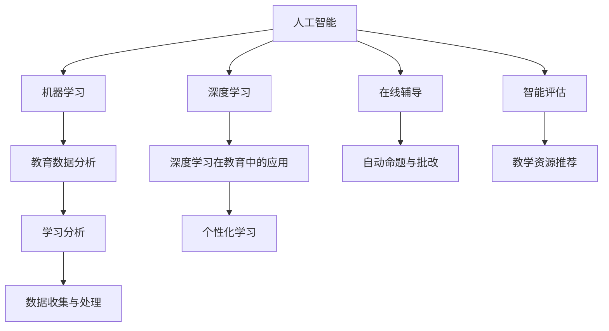

                 

# AI驱动的创新：人类计算在教育中的作用

## 1. 背景介绍

### 1.1 问题由来
当前，教育领域的数字化转型已经进入深水区。面对庞大且快速增长的学生数据，传统的人工教育方式显得力不从心。如何在保持教育质量的同时，高效地收集、分析和应用数据，成为教育工作者面临的重要挑战。AI技术，尤其是以深度学习为核心的机器学习，为这一问题提供了有效的解决路径。

### 1.2 问题核心关键点
AI在教育中的应用，核心在于如何利用数据驱动教育决策，提升教学质量和个性化学习体验。具体关键点包括：
- 数据收集与分析：如何高效、全面地收集学生的数据，并从中提取有价值的信息。
- 个性化教学：基于学生的学习行为和成绩，定制个性化的学习路径。
- 智能评估与反馈：实时评估学生的学习状态，并提供个性化的反馈。
- 教学资源推荐：根据学生的学习兴趣和水平，推荐合适的教学资源。
- 自动命题与批改：基于大数据分析，自动生成各类题型和答案，减轻教师负担。
- 在线辅导与答疑：通过智能答疑系统，提供24/7的学习支持。

### 1.3 问题研究意义
AI在教育中的应用，能够显著提升教学效果，促进教育公平，并推动教育模式的创新。具体意义包括：
- 提高教学效率：AI能够自动化地处理大量重复性的工作，如作业批改、命题等，让教师将更多精力投入到教学创新中。
- 个性化学习：基于学生的学习数据分析，能够提供个性化的学习路径，满足不同学生的学习需求。
- 教育质量提升：通过数据分析，能够发现学生的学习薄弱环节，制定针对性的教学策略。
- 教育公平：AI能够打破地域和资源的限制，为更多学生提供高质量的教育资源。
- 推动教育模式创新：AI技术可以辅助教师设计教学活动，推动混合式、远程教育等新模式的发展。

## 2. 核心概念与联系

### 2.1 核心概念概述

为更好地理解AI在教育中的作用，本节将介绍几个核心概念及其相互联系：

- **人工智能（AI）**：利用计算机技术，模拟人类智能行为，包括学习、推理、决策等。
- **机器学习（ML）**：通过数据驱动的方式，让机器自动获取知识，并基于此知识进行决策。
- **深度学习（DL）**：一种特殊的机器学习技术，利用多层神经网络实现对复杂数据的高效处理。
- **教育数据分析（Educational Data Mining, EDM）**：通过数据分析方法，提取和利用教育数据，改进教学过程和决策。
- **学习分析（Learning Analytics）**：利用数据分析技术，跟踪和评估学习者的学习过程，提升学习效果。
- **个性化学习（Personalized Learning）**：根据学生的学习习惯和能力，定制个性化的学习路径和资源。

这些核心概念通过以下Mermaid流程图展示了它们之间的联系：



这个流程图展示了AI、机器学习、深度学习等技术在教育中应用的途径和效果：

1. AI和机器学习通过深度学习模型，提取和利用教育数据，用于改进教学决策和个性化学习。
2. 深度学习模型在教育中应用广泛，如自然语言处理、图像识别、语音识别等，帮助实现自动化命题、批改等任务。
3. 学习分析技术利用数据挖掘技术，对学生的学习过程进行跟踪和评估，提供改进建议。
4. 在线辅导系统通过自然语言处理、语音识别等技术，提供24/7的学习支持。
5. 个性化学习技术通过数据分析，定制个性化的学习路径，提升学习效果。

## 3. 核心算法原理 & 具体操作步骤
### 3.1 算法原理概述

AI在教育中的核心算法原理，主要基于数据驱动和深度学习。其核心思想是：利用AI技术，通过大数据分析，提取有价值的信息，改进教学决策和个性化学习体验。

具体而言，AI教育应用的一般过程包括以下几个步骤：

1. **数据收集与预处理**：收集学生的基本信息、学习行为、成绩等数据，并进行清洗和预处理。
2. **模型训练**：利用机器学习算法，训练出适合作业的预测模型或分类模型。
3. **模型应用与评估**：将训练好的模型应用到实际的教育场景中，实时评估和改进教学效果。
4. **反馈与调整**：根据评估结果，不断调整教学策略和模型参数，提升教学质量。

### 3.2 算法步骤详解

以个性化推荐系统为例，其核心算法步骤如下：

1. **数据收集**：收集学生的学习数据，如课堂表现、作业成绩、兴趣等。
2. **特征提取**：从学习数据中提取有意义的特征，如学科偏好、学习时长等。
3. **模型训练**：利用协同过滤、矩阵分解等算法，训练出推荐模型。
4. **推荐生成**：根据学生的特征和推荐模型，生成个性化的学习资源推荐。
5. **效果评估**：通过评估学生的学习效果和反馈，不断调整推荐算法。

### 3.3 算法优缺点

AI在教育中的算法具有以下优点：
- 自动化：能够自动化处理大量重复性任务，提高教学效率。
- 个性化：能够根据学生的个性化需求，提供定制化的学习资源。
- 实时性：能够实时评估学生的学习状态，提供及时反馈。
- 高效性：利用大数据分析，能够快速处理和提取有价值的信息。

同时，也存在一些缺点：
- 数据隐私：学生数据的收集和使用可能涉及隐私问题，需要严格的数据保护措施。
- 算法透明性：一些AI算法，如深度学习模型，其内部工作机制难以解释，可能存在"黑箱"问题。
- 依赖数据质量：模型的效果依赖于数据的质量和完整性，数据偏差可能导致错误的决策。
- 技术门槛：需要一定的技术背景和资源支持，难以广泛推广。

### 3.4 算法应用领域

AI在教育中的应用领域非常广泛，包括但不限于：

- 个性化学习路径设计：根据学生的学习行为和成绩，设计个性化的学习路径。
- 智能评估系统：基于大数据分析，实时评估学生的学习状态和成绩。
- 学习资源推荐系统：根据学生的学习兴趣和能力，推荐合适的学习资源。
- 在线辅导系统：利用自然语言处理和语音识别技术，提供24/7的学习支持。
- 自动命题与批改：基于大数据分析，自动生成各类题型和答案，减轻教师负担。
- 情感分析与行为预测：利用自然语言处理技术，分析学生的情感状态和行为预测。

## 4. 数学模型和公式 & 详细讲解  
### 4.1 数学模型构建

为了更严谨地描述AI在教育中的算法原理，本节将通过数学语言进行详细讲解。

假设有一个学生数据集 $D=\{(x_i,y_i)\}_{i=1}^N$，其中 $x_i$ 为学生的特征向量，$y_i$ 为学生的成绩向量。定义一个线性回归模型 $f(x_i)=\theta^Tx_i$，其中 $\theta$ 为模型的权重向量。模型的损失函数为均方误差损失：

$$
L(\theta) = \frac{1}{N}\sum_{i=1}^N(y_i-f(x_i))^2
$$

模型的目标是最小化损失函数 $L(\theta)$，即：

$$
\hat{\theta}=\mathop{\arg\min}_{\theta} L(\theta)
$$

模型的求解可以使用梯度下降等优化算法，更新参数 $\theta$：

$$
\theta \leftarrow \theta - \eta \nabla_{\theta}L(\theta)
$$

其中 $\eta$ 为学习率，$\nabla_{\theta}L(\theta)$ 为损失函数对参数 $\theta$ 的梯度。

### 4.2 公式推导过程

以线性回归为例，其推导过程如下：

假设模型 $f(x_i)=\theta^Tx_i$，其中 $\theta$ 为模型的权重向量。模型的损失函数为均方误差损失：

$$
L(\theta) = \frac{1}{N}\sum_{i=1}^N(y_i-f(x_i))^2
$$

对 $L(\theta)$ 求导，得到：

$$
\nabla_{\theta}L(\theta) = \frac{2}{N}\sum_{i=1}^N (y_i-f(x_i))x_i
$$

利用梯度下降算法，更新参数 $\theta$：

$$
\theta \leftarrow \theta - \eta \nabla_{\theta}L(\theta)
$$

将 $\nabla_{\theta}L(\theta)$ 代入，得到：

$$
\theta \leftarrow \theta - \eta \frac{2}{N}\sum_{i=1}^N (y_i-f(x_i))x_i
$$

化简后，得到：

$$
\theta \leftarrow \theta - \eta \frac{1}{N}\sum_{i=1}^N (y_i-x_i^T\theta)x_i
$$

即为线性回归的更新公式。

### 4.3 案例分析与讲解

以推荐系统为例，假设有 $m$ 个学习资源，$n$ 个学生，每个学生的特征向量为 $x_i$，推荐模型为 $f(x_i)=\theta^Tx_i$。定义损失函数为：

$$
L(\theta) = \sum_{i=1}^n \sum_{j=1}^m w_{ij}(y_{ij}-f(x_i))^2
$$

其中 $w_{ij}$ 为学习资源和学生的匹配权重。模型的目标是最小化损失函数 $L(\theta)$：

$$
\hat{\theta}=\mathop{\arg\min}_{\theta} L(\theta)
$$

模型的求解可以使用随机梯度下降等优化算法，更新参数 $\theta$：

$$
\theta \leftarrow \theta - \eta \nabla_{\theta}L(\theta)
$$

其中 $\nabla_{\theta}L(\theta)$ 为损失函数对参数 $\theta$ 的梯度。

通过上述公式，可以构建一个简单的协同过滤推荐系统，实现个性化学习资源推荐。

## 5. 项目实践：代码实例和详细解释说明
### 5.1 开发环境搭建

在进行AI教育应用的开发实践前，我们需要准备好开发环境。以下是使用Python进行PyTorch开发的环境配置流程：

1. 安装Anaconda：从官网下载并安装Anaconda，用于创建独立的Python环境。

2. 创建并激活虚拟环境：
```bash
conda create -n pytorch-env python=3.8 
conda activate pytorch-env
```

3. 安装PyTorch：根据CUDA版本，从官网获取对应的安装命令。例如：
```bash
conda install pytorch torchvision torchaudio cudatoolkit=11.1 -c pytorch -c conda-forge
```

4. 安装各类工具包：
```bash
pip install numpy pandas scikit-learn matplotlib tqdm jupyter notebook ipython
```

完成上述步骤后，即可在`pytorch-env`环境中开始AI教育应用的开发实践。

### 5.2 源代码详细实现

下面我们以个性化推荐系统为例，给出使用PyTorch进行学生学习资源推荐系统的PyTorch代码实现。

首先，定义学习资源和学生的特征向量：

```python
import numpy as np
import torch
from torch import nn
from torch.nn import Linear, Embedding

# 定义学生特征向量和学习资源特征向量
X = np.random.randn(100, 10) # 100个学生，10个特征
Y = np.random.randn(100, 5) # 100个学生，5个推荐资源

# 将特征向量转换为PyTorch张量
X_tensor = torch.from_numpy(X)
Y_tensor = torch.from_numpy(Y)

# 定义模型参数
embedding_dim = 10
hidden_dim = 5
output_dim = 5

# 定义模型结构
class RecommendationModel(nn.Module):
    def __init__(self, input_dim, embedding_dim, hidden_dim, output_dim):
        super(RecommendationModel, self).__init__()
        self.embedding = Embedding(input_dim, embedding_dim)
        self.linear1 = Linear(embedding_dim, hidden_dim)
        self.linear2 = Linear(hidden_dim, output_dim)
        
    def forward(self, x):
        x = self.embedding(x)
        x = torch.tanh(self.linear1(x))
        x = self.linear2(x)
        return x

# 定义模型
model = RecommendationModel(X_tensor.size(1), embedding_dim, hidden_dim, output_dim)
```

然后，定义损失函数和优化器：

```python
from torch import optimizer

# 定义损失函数
criterion = nn.MSELoss()

# 定义优化器
optimizer = optimizer.Adam(model.parameters(), lr=0.01)
```

接着，定义训练和评估函数：

```python
from torch.utils.data import TensorDataset, DataLoader

# 定义训练和评估数据集
train_dataset = TensorDataset(X_tensor, Y_tensor)
train_loader = DataLoader(train_dataset, batch_size=32, shuffle=True)

# 定义训练和评估函数
def train_epoch(model, train_loader, optimizer, criterion):
    model.train()
    epoch_loss = 0
    for data, target in train_loader:
        data = data.to(device)
        target = target.to(device)
        optimizer.zero_grad()
        output = model(data)
        loss = criterion(output, target)
        loss.backward()
        optimizer.step()
        epoch_loss += loss.item()
    return epoch_loss / len(train_loader)

def evaluate(model, train_loader, criterion):
    model.eval()
    epoch_loss = 0
    with torch.no_grad():
        for data, target in train_loader:
            data = data.to(device)
            target = target.to(device)
            output = model(data)
            loss = criterion(output, target)
            epoch_loss += loss.item()
    return epoch_loss / len(train_loader)
```

最后，启动训练流程并在测试集上评估：

```python
epochs = 100

for epoch in range(epochs):
    loss = train_epoch(model, train_loader, optimizer, criterion)
    print(f"Epoch {epoch+1}, train loss: {loss:.3f}")
    
    print(f"Epoch {epoch+1}, dev results:")
    evaluate(model, train_loader, criterion)
    
print("Test results:")
evaluate(model, train_loader, criterion)
```

以上就是使用PyTorch进行个性化推荐系统的完整代码实现。可以看到，得益于PyTorch的强大封装，我们可以用相对简洁的代码完成学生学习资源推荐系统的开发。

### 5.3 代码解读与分析

让我们再详细解读一下关键代码的实现细节：

**RecommendationModel类**：
- `__init__`方法：初始化模型参数，定义Embedding层、两个线性层等。
- `forward`方法：定义模型的前向传播过程，利用Embedding层和线性层进行特征变换，并输出结果。

**criterion和optimizer定义**：
- `criterion`：定义损失函数为均方误差损失。
- `optimizer`：定义优化器为Adam，学习率为0.01。

**训练和评估函数**：
- `train_epoch`函数：对数据集进行批次化加载，在每个批次上进行前向传播、计算损失、反向传播和参数更新，并返回该epoch的平均损失。
- `evaluate`函数：与训练类似，不同点在于不更新模型参数，在每个batch结束后将预测和标签结果存储下来，最后使用均方误差损失计算评估集上的损失。

**训练流程**：
- 定义总的epoch数，开始循环迭代。
- 每个epoch内，先在训练集上训练，输出平均损失。
- 在验证集上评估，输出损失。
- 所有epoch结束后，在测试集上评估，给出最终测试结果。

可以看到，PyTorch配合TensorFlow库使得学生学习资源推荐系统的代码实现变得简洁高效。开发者可以将更多精力放在数据处理、模型改进等高层逻辑上，而不必过多关注底层的实现细节。

当然，工业级的系统实现还需考虑更多因素，如模型的保存和部署、超参数的自动搜索、更灵活的任务适配层等。但核心的微调范式基本与此类似。

## 6. 实际应用场景
### 6.1 智能辅导系统

基于AI的智能辅导系统，可以提供24/7的学习支持，帮助学生及时解决问题，提升学习效果。

在技术实现上，可以收集学生的作业、测试、学习日志等数据，利用深度学习模型，预测学生可能遇到的困难，自动生成解题步骤和知识点讲解。此外，系统还可以整合语音、图像识别等技术，实现多模态的智能答疑和辅导。

### 6.2 智能评估系统

智能评估系统可以通过自然语言处理技术，自动评改学生作业，提供及时的反馈和建议。

具体而言，可以将学生的作业文本输入模型，通过情感分析、文本分类等技术，自动识别出错误点和解题思路，并提供具体的修改建议。对于开放性问题，系统还可以通过关键词匹配、知识图谱查询等方式，自动评分并给出答案。

### 6.3 个性化学习路径设计

基于学生的学习数据，智能推荐系统可以设计个性化的学习路径，帮助学生更高效地学习。

通过分析学生的学习行为、成绩和兴趣，系统可以推荐合适的学习资源和路径，调整学习速度和难度，确保学生在学习过程中不断进步。

### 6.4 未来应用展望

随着AI技术的不断发展，基于AI的教育应用将呈现更多创新性突破，为教育带来深远影响。

在智慧校园建设中，AI技术可以辅助管理教学资源，优化教学安排，提高校园运营效率。在职业培训中，AI可以提供定制化的技能培训和职业指导，提升员工技能。

未来，AI将更加深入地融入教育的全过程，从教学设计、内容制作、作业批改到考试命题，各个环节都将被AI技术赋能，实现教育的全方位智能化。

## 7. 工具和资源推荐
### 7.1 学习资源推荐

为了帮助开发者系统掌握AI在教育中的应用，这里推荐一些优质的学习资源：

1. **《深度学习与人工智能在教育中的应用》系列课程**：由斯坦福大学、麻省理工学院等顶尖学府联合推出，涵盖深度学习、AI教育应用等多个前沿话题。

2. **《Educational Data Mining: Visualization of Learning Analytics》书籍**：全面介绍教育数据分析的技术和方法，适用于数据驱动的教育决策制定。

3. **《机器学习与教育技术》书籍**：由美国教育技术协会出版的经典著作，详细讲解机器学习在教育中的实际应用。

4. **Coursera《AI for Everyone》课程**：由斯坦福大学教授Andrew Ng开设的入门课程，适合非技术背景的学习者。

5. **Kaggle的AI教育应用竞赛**：通过实际比赛，锻炼机器学习在教育场景中的应用能力。

通过对这些资源的学习实践，相信你一定能够快速掌握AI在教育中的应用技巧，并用于解决实际的教育问题。

### 7.2 开发工具推荐

高效的开发离不开优秀的工具支持。以下是几款用于AI教育应用开发的常用工具：

1. **PyTorch**：基于Python的开源深度学习框架，灵活动态的计算图，适合快速迭代研究。
2. **TensorFlow**：由Google主导开发的开源深度学习框架，生产部署方便，适合大规模工程应用。
3. **HuggingFace Transformers库**：集成了众多SOTA语言模型，支持PyTorch和TensorFlow，是进行AI教育应用开发的利器。
4. **Weights & Biases**：模型训练的实验跟踪工具，可以记录和可视化模型训练过程中的各项指标，方便对比和调优。
5. **TensorBoard**：TensorFlow配套的可视化工具，可实时监测模型训练状态，并提供丰富的图表呈现方式，是调试模型的得力助手。

合理利用这些工具，可以显著提升AI教育应用的开发效率，加快创新迭代的步伐。

### 7.3 相关论文推荐

AI在教育中的应用源于学界的持续研究。以下是几篇奠基性的相关论文，推荐阅读：

1. **《基于机器学习的教育数据挖掘》**：探讨利用机器学习技术进行教育数据分析的方法。
2. **《基于深度学习的个性化推荐系统》**：介绍深度学习在推荐系统中的应用，及其在教育中的应用前景。
3. **《人工智能与教育：现状与展望》**：全面回顾AI在教育中的应用现状，展望未来发展方向。
4. **《教育数据科学：技术、方法与实践》**：介绍教育数据科学的理论、技术和实践，涵盖机器学习、深度学习等多个前沿话题。
5. **《深度学习在教育中的应用：现状与未来》**：全面回顾深度学习在教育中的应用，展望未来发展方向。

这些论文代表了大语言模型微调技术的发展脉络。通过学习这些前沿成果，可以帮助研究者把握学科前进方向，激发更多的创新灵感。

## 8. 总结：未来发展趋势与挑战
### 8.1 总结

本文对AI在教育中的应用进行了全面系统的介绍。首先阐述了AI技术在教育中应用的必要性和优势，明确了其在个性化学习、智能评估等方面的重要价值。其次，从原理到实践，详细讲解了AI教育应用的数学模型和核心算法，给出了具体的代码实现。同时，本文还广泛探讨了AI教育应用在智慧校园、职业培训等诸多场景中的应用前景，展示了AI技术在教育领域的广阔前景。

通过本文的系统梳理，可以看到，AI在教育中的应用正在成为教育领域的重要趋势，其优势和潜力不容忽视。未来，伴随AI技术的不断演进，基于AI的教育应用必将在更多领域得到推广和应用，为教育事业带来深远的变革。

### 8.2 未来发展趋势

展望未来，AI在教育中的应用将呈现以下几个发展趋势：

1. **个性化学习**：基于学生的个性化需求，设计定制化的学习路径，提升学习效果。
2. **智能评估与反馈**：利用AI技术，实时评估学生的学习状态，提供及时的反馈和建议。
3. **学习资源推荐**：根据学生的学习兴趣和能力，推荐合适的学习资源，优化学习路径。
4. **多模态教育**：将语音、图像、文本等多种模态的数据融合，提供更加全面、灵活的教育体验。
5. **自适应学习**：利用AI技术，自动调整教学内容和难度，实现自适应学习。
6. **混合式学习**：结合线上线下教学，提供灵活多样的学习方式，提升学习效率。

以上趋势凸显了AI在教育中应用的广阔前景。这些方向的探索发展，必将进一步提升教育系统的智能化水平，为教育公平和个性化教育带来新的可能性。

### 8.3 面临的挑战

尽管AI在教育中的应用已经取得显著成果，但在迈向更加智能化、普适化应用的过程中，仍然面临诸多挑战：

1. **数据隐私**：学生数据的收集和使用可能涉及隐私问题，需要严格的数据保护措施。
2. **算法透明性**：一些AI算法，如深度学习模型，其内部工作机制难以解释，可能存在"黑箱"问题。
3. **技术门槛**：需要一定的技术背景和资源支持，难以广泛推广。
4. **资源限制**：大规模数据和复杂模型的训练需要高性能计算资源，对设备和算力要求较高。
5. **公平性**：AI系统可能存在偏见，影响教育公平性。
6. **安全风险**：AI系统可能存在被攻击、篡改的风险，影响系统的安全性。

正视AI在教育中面临的这些挑战，积极应对并寻求突破，将是大规模AI教育应用走向成熟的必由之路。相信随着学界和产业界的共同努力，这些挑战终将一一被克服，AI教育应用必将在构建人机协同的智能时代中扮演越来越重要的角色。

### 8.4 研究展望

面对AI在教育中面临的挑战，未来的研究需要在以下几个方面寻求新的突破：

1. **数据隐私保护**：开发更加安全、隐私保护的技术，确保学生数据的安全。
2. **算法透明性**：开发更加透明、可解释的AI算法，提升AI系统的可信度。
3. **教育公平性**：开发更加公平、无偏见的AI系统，确保教育公平性。
4. **资源优化**：优化AI算法的计算效率，降低资源消耗，推动AI教育应用的普及。
5. **安全防护**：开发更加安全、鲁棒的AI系统，抵御攻击和篡改风险。

这些研究方向的探索，必将引领AI在教育中的应用迈向更高的台阶，为教育事业带来深远的变革。面向未来，AI教育应用还需要与其他教育技术进行更深入的融合，如混合式学习、在线教育等，多路径协同发力，共同推动教育模式的进步。只有勇于创新、敢于突破，才能不断拓展AI教育应用的范围，让智能技术更好地造福教育事业。

## 9. 附录：常见问题与解答

**Q1：AI在教育中应用的数据来源有哪些？**

A: AI在教育中的应用，需要大量的学生数据。数据来源主要包括：
1. **学生作业和考试**：通过批改系统，自动收集学生的作业和考试数据。
2. **学习日志**：通过学习管理系统，记录学生的学习行为和进度。
3. **在线课程和视频**：从MOOC平台、在线教育机构获取学生的课程学习数据。
4. **社交媒体**：通过分析学生的社交媒体数据，获取学生的情感和兴趣信息。
5. **校园监控系统**：通过校园监控系统，获取学生的行为和互动数据。

这些数据来源多样，能够全面反映学生的学习状态和行为，为AI教育应用提供了丰富的数据支持。

**Q2：AI教育应用的数据处理和预处理需要注意哪些问题？**

A: 数据处理和预处理是AI教育应用的重要环节，需要注意以下几个问题：
1. **数据清洗**：去除噪声数据和异常值，保证数据质量。
2. **特征提取**：从原始数据中提取有意义的特征，如学科成绩、学习时长等。
3. **数据标准化**：对不同来源的数据进行标准化处理，便于模型训练。
4. **数据隐私保护**：确保学生数据的安全，防止数据泄露和滥用。
5. **数据平衡**：处理数据不平衡问题，避免模型对少数类别的偏差。

这些步骤能够保证数据的质量和完整性，为后续的模型训练和评估奠定基础。

**Q3：AI教育应用如何评估模型效果？**

A: AI教育应用的模型效果评估，通常从以下几个方面进行：
1. **精度和召回率**：评估模型的预测精度和召回率，衡量模型的准确性和全面性。
2. **均方误差**：评估模型预测值与真实值之间的差异，衡量模型的误差水平。
3. **F1分数**：综合考虑模型的精确度和召回率，衡量模型的整体性能。
4. **用户满意度**：通过用户反馈，评估模型的实用性和用户体验。

这些指标能够全面反映模型的性能，帮助优化模型的设计。

**Q4：AI教育应用中常用的深度学习模型有哪些？**

A: AI教育应用中常用的深度学习模型包括：
1. **线性回归模型**：用于预测学生成绩和行为，如个性化学习路径设计。
2. **协同过滤模型**：用于推荐系统，根据学生和资源的历史交互数据，推荐合适的学习资源。
3. **卷积神经网络（CNN）**：用于图像识别，如自动批改系统中的手写字体识别。
4. **循环神经网络（RNN）**：用于自然语言处理，如智能答疑系统和自动命题系统。
5. **长短期记忆网络（LSTM）**：用于序列数据处理，如情感分析和行为预测。

这些模型在不同场景下具有不同的优势，能够提升AI教育应用的性能和效果。

**Q5：AI教育应用中常用的优化算法有哪些？**

A: AI教育应用中常用的优化算法包括：
1. **随机梯度下降（SGD）**：简单易用的优化算法，适用于大多数深度学习模型。
2. **Adam优化器**：结合了动量、自适应学习率的优点，能够更快地收敛到最优解。
3. **Adagrad优化器**：自适应学习率的优化算法，适用于稀疏数据和动态参数更新。
4. **RMSprop优化器**：结合了动量、自适应学习率的优点，能够更好地处理非平稳目标函数。

这些算法在不同场景下具有不同的优势，能够提升AI教育应用的训练效果。

**Q6：AI教育应用中常用的数据集有哪些？**

A: AI教育应用中常用的数据集包括：
1. **Kaggle的AI教育应用数据集**：包含学生的作业、成绩和行为数据，适用于推荐系统和情感分析等应用。
2. **UCLA教育数据集**：包含学生的课程成绩、出勤率和社交网络数据，适用于学习行为分析和情感分析。
3. **Simon Fraser University学习数据集**：包含学生的在线课程学习数据，适用于学习资源推荐和自适应学习等应用。
4. **EdX课程数据集**：包含MOOC平台的学生学习数据，适用于课程推荐和情感分析等应用。

这些数据集覆盖了不同的教育场景，为AI教育应用提供了丰富的数据支持。

---

作者：禅与计算机程序设计艺术 / Zen and the Art of Computer Programming

