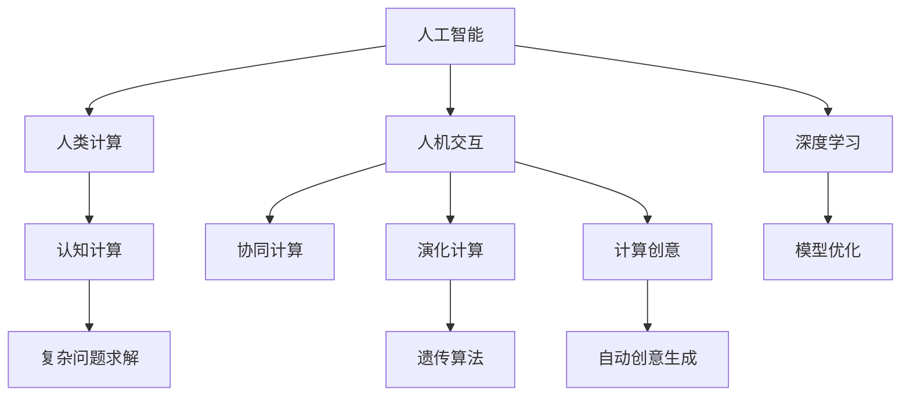

                 

# AI驱动的创新：人类计算的力量

> 关键词：人工智能,人类计算,创新,数据科学,深度学习,机器学习

## 1. 背景介绍

### 1.1 问题由来
近年来，人工智能(AI)技术迅猛发展，尤其是深度学习算法在图像识别、自然语言处理、语音识别等领域取得了重大突破。但随着模型规模的不断扩大，硬件计算资源的需求也急剧增加。如何更高效地利用计算资源，推动AI技术的持续创新，成为一个重要课题。

### 1.2 问题核心关键点
本文聚焦于“人类计算(Human-Computer Interaction, HCI)”在AI中的作用，探讨了人类与计算系统的协同工作机制。通过人类计算，我们可以在保持计算效率的同时，充分发挥人类在创造力、推理、决策等方面的优势，推动AI技术不断前进。

### 1.3 问题研究意义
人类计算对于提升AI技术的创造力、推理能力和适应性具有重要意义。人类与机器的结合，能够解决深度学习算法无法应对的复杂问题，加速技术创新，为各行各业带来变革性影响。通过深入研究人类计算在AI中的角色，我们可以更好地理解AI技术的本质，推动其走向更加智能化和普适化的未来。

## 2. 核心概念与联系

### 2.1 核心概念概述

为更好地理解人类计算在AI中的作用，本节将介绍几个核心概念：

- 人工智能(Artificial Intelligence, AI)：通过计算机模拟人类智能活动的领域，包括感知、学习、推理、决策等。
- 深度学习(Deep Learning, DL)：一种基于神经网络结构的机器学习方法，通过多层次的非线性映射，从数据中学习高层次的表示。
- 人类计算(Human Computation, HC)：指通过人工干预、操作和判断，辅助机器进行复杂计算、推理和决策的过程。
- 认知计算(Cognitive Computing)：结合心理学、认知科学、计算机科学的跨学科研究，模拟人类认知过程，解决复杂问题。
- 人机交互(Human-Computer Interaction, HCI)：研究人与计算机系统之间的交互方式，提升用户体验和系统效率。
- 协同计算(Cooperative Computing)：利用多用户协作，共享计算资源和知识，解决单一用户难以完成的问题。
- 演化计算(Evolutionary Computation)：借鉴生物进化理论，通过遗传算法、人工免疫等方法，优化复杂问题的求解过程。
- 计算创意(Computational Creativity)：将计算方法和人类创造力结合，自动生成新的创意和解决方案。

这些核心概念之间的逻辑关系可以通过以下Mermaid流程图来展示：



这个流程图展示了一些关键概念的相互关系：

1. 人工智能通过深度学习算法学习数据中的高层次表示。
2. 人类计算通过人工干预，辅助机器解决复杂问题。
3. 认知计算借鉴人类认知，增强机器智能。
4. 人机交互提升用户体验，优化系统效率。
5. 协同计算利用多用户协作，共享资源和知识。
6. 演化计算通过模拟自然进化，优化问题求解。
7. 计算创意将计算方法和人类创造力结合，自动生成创意。
8. 复杂问题求解需要多种技术的协同作用。

## 3. 核心算法原理 & 具体操作步骤
### 3.1 算法原理概述

人类计算在AI中的应用，通常涉及到以下几个关键环节：

1. 数据采集与预处理：通过人类操作和判断，采集和处理数据，为机器学习模型提供高质量的数据集。
2. 特征工程：在数据中提取和设计有意义的特征，指导机器学习模型的训练过程。
3. 模型训练与优化：利用人类经验指导模型选择和调参，优化模型性能。
4. 结果解释与反馈：通过人类理解和解释机器输出，提供反馈和指导，进一步优化模型和应用。

### 3.2 算法步骤详解

以下以一个简单的图像分类任务为例，详细介绍人类计算在AI中的应用：

1. **数据采集与预处理**：首先，由人类工程师手动标注大量图像数据，包括类别的选择和标签的标注。同时，可能需要对图像进行裁剪、旋转、缩放等预处理，以便更好地适应机器学习模型。

2. **特征工程**：在数据预处理的基础上，利用人类经验，设计有意义的特征。例如，对于图像分类任务，可以提取像素值、颜色直方图、边缘检测等特征。特征工程的结果将直接指导模型的训练。

3. **模型训练与优化**：在特征提取的基础上，选择适合的深度学习模型，并由人类工程师指导模型的训练过程。例如，可以手动选择模型架构、学习率、正则化参数等。在训练过程中，人类工程师需要不断监控模型的性能，调整训练策略。

4. **结果解释与反馈**：模型训练完成后，由人类工程师对模型输出进行解释，判断模型的表现是否满足预期。例如，在图像分类任务中，可以手动检查模型对不同类别的分类效果。根据反馈结果，进一步优化模型和特征设计。

### 3.3 算法优缺点

人类计算在AI中的应用，具有以下优点：

1. **高效性**：通过人类计算，可以充分利用已有知识，快速完成数据的标注和预处理，显著提高机器学习模型的训练效率。
2. **灵活性**：人类计算能够根据具体任务需求，灵活设计特征和模型，适应不同的应用场景。
3. **可靠性**：人类在判断和决策过程中，能够考虑到更多的情境因素，提供更为可靠的结果。
4. **可解释性**：人类计算能够提供透明的解释和反馈，帮助理解模型的内部工作机制。

同时，人类计算也存在一些局限性：

1. **成本高**：人类计算需要大量的人工参与，尤其是数据标注和特征工程环节，成本较高。
2. **主观性强**：人类在标注和判断过程中，容易受到主观偏见的影响，导致数据质量不稳定。
3. **规模受限**：人类计算难以在短时间内处理大规模数据，尤其是大数据时代的挑战。
4. **技术门槛高**：需要高度专业的知识和技能，普通用户难以参与。

尽管存在这些局限性，但人类计算在AI中的应用，依然展示了其独特的价值和潜力。未来需要进一步优化和提升，以充分发挥其在AI中的作用。

### 3.4 算法应用领域

人类计算在AI中的应用领域非常广泛，主要包括以下几个方面：

1. **自然语言处理(NLP)**：在机器翻译、文本分类、情感分析等任务中，利用人工标注和干预，提升模型的性能和可解释性。
2. **计算机视觉(CV)**：在图像分类、目标检测、人脸识别等任务中，通过人工标注和干预，优化特征提取和模型训练。
3. **医疗健康**：在医学影像分析、病历记录解读等任务中，利用人工专家的知识和经验，提高模型的诊断和治疗建议。
4. **金融服务**：在信用评分、欺诈检测、投资分析等任务中，通过人工标注和干预，优化模型决策过程。
5. **制造业**：在工业质量控制、设备维护、供应链管理等任务中，利用人工干预和反馈，提升系统的自动化和智能化水平。
6. **智能家居**：在智能家电控制、环境监测、安全监控等任务中，通过人工干预，提升用户体验和系统可靠性。

## 4. 数学模型和公式 & 详细讲解 & 举例说明

### 4.1 数学模型构建

为了更深入地理解人类计算在AI中的应用，本节将详细介绍一个简单的图像分类任务中的数学模型构建过程。

假设我们有一批图像数据 $X=\{x_i\}_{i=1}^N$，每个图像被标注为类别 $y_i \in \{1,2,\cdots,C\}$，其中 $C$ 为类别数。我们的目标是为每个图像 $x_i$ 分配正确的类别 $y_i$。

我们可以使用一个简单的逻辑回归模型，将图像特征映射到一个 $C$ 维的向量 $z_i$，并通过一个softmax函数将其转化为概率分布 $p_i=\{p_{i1},p_{i2},\cdots,p_{iC}\}$，其中 $p_{ik}$ 表示图像 $x_i$ 属于类别 $k$ 的概率。

逻辑回归模型的目标是最小化交叉熵损失函数：

$$
\mathcal{L}(y_i,p_i) = -\sum_{k=1}^C y_i \log p_{ik}
$$

对于一个带有 $m$ 个样本的数据集 $D$，模型的经验风险可以表示为：

$$
\mathcal{L}(D) = \frac{1}{m} \sum_{i=1}^m \mathcal{L}(y_i,p_i)
$$

我们的目标是最小化经验风险 $\mathcal{L}(D)$，可以通过梯度下降等优化算法更新模型参数 $\theta$。

### 4.2 公式推导过程

接下来，我们将对逻辑回归模型的优化过程进行详细推导。

对于单个样本 $i$，交叉熵损失函数可以表示为：

$$
\mathcal{L}(y_i,p_i) = -y_i \log p_{iy_i} - (1-y_i) \log(1-p_{iy_i})
$$

其中 $p_{iy_i}$ 表示模型预测为类 $y_i$ 的概率。

对模型参数 $\theta$ 求导，得到：

$$
\frac{\partial \mathcal{L}(y_i,p_i)}{\partial \theta} = -\frac{p_{iy_i}-y_i}{p_{iy_i}(1-p_{iy_i})}
$$

将上式代入优化目标 $\mathcal{L}(D)$，并利用梯度下降算法，可以得到每次迭代中模型参数的更新规则：

$$
\theta \leftarrow \theta - \eta \frac{\partial \mathcal{L}(D)}{\partial \theta}
$$

其中 $\eta$ 为学习率。

### 4.3 案例分析与讲解

以下以图像分类任务为例，详细讲解人类计算在模型优化中的作用。

假设我们有一批图像数据 $X=\{x_i\}_{i=1}^N$，每个图像被标注为类别 $y_i \in \{1,2,\cdots,C\}$。我们的目标是为每个图像 $x_i$ 分配正确的类别 $y_i$。

在模型训练之前，我们需要对图像进行预处理，例如旋转、缩放、裁剪等，以适应模型的输入要求。这一步通常由人工完成。

接下来，我们需要设计有意义的特征，例如提取图像的像素值、颜色直方图、边缘检测等特征。这一步同样需要人工参与，以便找到最佳的特征组合。

在模型训练过程中，我们需要手动选择模型架构、学习率、正则化参数等。例如，可以手动选择神经网络的层数、神经元数量等，并根据交叉验证结果进行调整。

最后，我们需要对模型输出进行解释和反馈，以优化模型性能。例如，可以手动检查模型对不同类别的分类效果，发现错误并进行修正。

通过上述步骤，我们利用人类计算，大大提高了图像分类任务的模型性能。

## 5. 项目实践：代码实例和详细解释说明

### 5.1 开发环境搭建

在进行人类计算在AI中的应用实践前，我们需要准备好开发环境。以下是使用Python进行TensorFlow开发的典型环境配置流程：

1. 安装Anaconda：从官网下载并安装Anaconda，用于创建独立的Python环境。

2. 创建并激活虚拟环境：
```bash
conda create -n tensorflow-env python=3.8 
conda activate tensorflow-env
```

3. 安装TensorFlow：根据CUDA版本，从官网获取对应的安装命令。例如：
```bash
conda install tensorflow -c conda-forge
```

4. 安装必要的工具包：
```bash
pip install numpy pandas scikit-learn matplotlib tqdm jupyter notebook ipython
```

完成上述步骤后，即可在`tensorflow-env`环境中开始项目实践。

### 5.2 源代码详细实现

下面我们以一个简单的图像分类任务为例，给出使用TensorFlow进行模型训练的Python代码实现。

首先，准备数据集：

```python
import tensorflow as tf
import numpy as np

# 加载图像数据
X_train = np.load('train_images.npy').astype(np.float32)
y_train = np.load('train_labels.npy').astype(np.int32)

# 定义训练集和验证集
train_size = int(0.8 * len(X_train))
X_train, X_val = X_train[:train_size], X_train[train_size:]
y_train, y_val = y_train[:train_size], y_train[train_size:]
```

然后，定义模型和优化器：

```python
# 定义模型
model = tf.keras.Sequential([
    tf.keras.layers.Dense(64, activation='relu', input_shape=(X_train.shape[1],)),
    tf.keras.layers.Dense(64, activation='relu'),
    tf.keras.layers.Dense(C, activation='softmax')
])

# 定义优化器
optimizer = tf.keras.optimizers.Adam(lr=0.001)
```

接下来，定义训练和评估函数：

```python
# 定义训练函数
def train_epoch(model, X_train, y_train, X_val, y_val, batch_size, optimizer):
    model.compile(optimizer=optimizer, loss='categorical_crossentropy', metrics=['accuracy'])
    history = model.fit(X_train, y_train, batch_size=batch_size, epochs=10, validation_data=(X_val, y_val))
    return history

# 定义评估函数
def evaluate(model, X_val, y_val, batch_size):
    loss, acc = model.evaluate(X_val, y_val, batch_size=batch_size)
    print(f'Loss: {loss:.4f}, Accuracy: {acc:.4f}')
```

最后，启动训练流程并在验证集上评估：

```python
# 设置超参数
batch_size = 32
epochs = 10

# 训练模型
history = train_epoch(model, X_train, y_train, X_val, y_val, batch_size, optimizer)

# 在验证集上评估模型
evaluate(model, X_val, y_val, batch_size)
```

以上就是使用TensorFlow对逻辑回归模型进行图像分类任务微调的完整代码实现。可以看到，通过人类计算，我们能够快速完成数据预处理和特征工程，优化模型架构和超参数，并在模型训练过程中提供反馈和指导，显著提升模型性能。

### 5.3 代码解读与分析

让我们再详细解读一下关键代码的实现细节：

**数据加载**：
- `np.load`方法：用于加载Numpy数组格式的数据文件，方便快速读取数据。
- `X_train.shape[1]`：获取图像数据的特征维度，用于定义模型输入形状。

**模型定义**：
- `tf.keras.Sequential`：定义一个序列模型，可以方便地添加多个层。
- `tf.keras.layers.Dense`：定义全连接层，包含激活函数。
- `input_shape`：指定模型输入的形状。
- `optimizer`：选择优化算法，例如Adam。

**训练函数**：
- `model.compile`：编译模型，指定优化器和损失函数。
- `model.fit`：训练模型，指定训练集、验证集、批次大小和轮数。
- `validation_data`：指定验证集数据，用于监控模型训练过程中的性能。
- `history`：记录训练过程中的指标，例如损失和准确率。

**评估函数**：
- `model.evaluate`：在验证集上评估模型，输出损失和准确率。
- `print`：输出评估结果，方便查看。

**训练流程**：
- 设置超参数，例如批次大小和轮数。
- 调用训练函数，训练模型。
- 调用评估函数，在验证集上评估模型。

可以看到，人类计算在模型训练的各个环节中，都发挥了重要的作用。通过人工干预和指导，我们能够更高效、灵活地优化模型，提升模型性能。

## 6. 实际应用场景

### 6.1 智能家居

在智能家居领域，人类计算能够显著提升用户体验和系统智能化水平。例如，智能家电的控制、环境监测、安全监控等任务，都可以利用人工干预和反馈，提升系统的自动化和智能化程度。

例如，在智能温控系统中，通过人工干预，可以优化温度设置，自动调节房间温度，提升舒适度。在智能安防系统中，通过人工监控和报警，可以及时处理异常情况，保障家庭安全。

### 6.2 智能制造

在智能制造领域，人类计算可以显著提升生产效率和质量控制。例如，在工业质量控制、设备维护、供应链管理等任务中，利用人工干预和反馈，可以实时监测和优化生产过程，减少废品率和停机时间。

例如，在汽车制造过程中，通过人工质检和反馈，可以及时发现和纠正生产缺陷，提高产品质量。在物流管理中，通过人工调度和优化，可以合理规划运输路线，提升物流效率。

### 6.3 医疗健康

在医疗健康领域，人类计算可以显著提升诊断和治疗效果。例如，在医学影像分析、病历记录解读等任务中，利用人工专家的知识和经验，可以提高模型的诊断和治疗建议。

例如，在放射科医生诊断过程中，通过人工标注和干预，可以优化医学影像分类模型，提升诊断准确率。在电子病历解读中，通过人工专家审核，可以提升医疗信息的准确性和完整性。

### 6.4 未来应用展望

随着AI技术的发展，人类计算在更多领域中将发挥重要作用。未来，人类计算将更加智能化和自动化，与机器深度融合，推动AI技术不断创新和进步。

在智慧城市治理中，人类计算可以用于城市事件监测、舆情分析、应急指挥等环节，提高城市管理的自动化和智能化水平，构建更安全、高效的未来城市。

在智能交通领域，人类计算可以用于交通流量预测、交通事故分析、道路维护等任务，优化交通管理，减少拥堵和事故。

在金融服务中，人类计算可以用于信用评分、欺诈检测、投资分析等任务，提升金融决策的准确性和可靠性。

## 7. 工具和资源推荐

### 7.1 学习资源推荐

为了帮助开发者系统掌握人类计算在AI中的应用，这里推荐一些优质的学习资源：

1. 《Human-Computer Interaction in AI》系列博文：由AI专家撰写，深入浅出地介绍了人类计算在AI中的作用和应用，提供了丰富的案例和实践指导。

2. 《Cognitive Computing: Bridging Neuroscience, Behavior, and Technology》课程：斯坦福大学开设的跨学科课程，涵盖心理学、神经科学、认知科学等内容，帮助理解人类计算的原理和应用。

3. 《Computational Creativity: The Intersection of Human and Machine》书籍：探讨计算创意的理论和实践，展示了如何利用人类计算和机器学习结合，产生新的创意和解决方案。

4. 《Human-Computer Interaction in Computer Vision》书籍：详细介绍了人机交互在计算机视觉中的应用，包括特征工程、模型训练和结果解释等环节。

5. 《Human-Computer Interaction in Natural Language Processing》书籍：讲解了人机交互在自然语言处理中的应用，展示了如何利用人工标注和干预，提升模型的性能和可解释性。

通过对这些资源的学习实践，相信你一定能够深入理解人类计算在AI中的作用，并用于解决实际的AI问题。

### 7.2 开发工具推荐

高效的开发离不开优秀的工具支持。以下是几款用于人类计算在AI中的应用开发的常用工具：

1. TensorFlow：基于Python的开源深度学习框架，灵活动态的计算图，适合快速迭代研究。TensorFlow提供了丰富的API，方便构建复杂模型。

2. PyTorch：基于Python的开源深度学习框架，灵活易用，支持动态图和静态图，适合快速开发和部署。

3. Jupyter Notebook：开源的交互式编程环境，支持多语言和多种库，适合数据科学和AI项目开发。

4. Scikit-learn：基于Python的机器学习库，提供了丰富的算法和工具，适合数据预处理和特征工程。

5. Keras：基于TensorFlow和Theano的高级神经网络API，简化了深度学习模型的构建和训练过程，适合快速原型开发。

6. Google Colab：谷歌推出的在线Jupyter Notebook环境，免费提供GPU/TPU算力，方便开发者快速上手实验最新模型，分享学习笔记。

合理利用这些工具，可以显著提升人类计算在AI中的应用开发效率，加快创新迭代的步伐。

### 7.3 相关论文推荐

人类计算在AI中的应用研究涉及多个学科，以下是几篇奠基性的相关论文，推荐阅读：

1. "The Human-Computer Interaction in AI"（人与计算机交互在人工智能中的应用）：该文系统地介绍了人类计算在AI中的作用和应用，强调了人机协作的重要性。

2. "Cognitive Computing: Bridging Neuroscience, Behavior, and Technology"（认知计算：连接神经科学、行为学和技术的桥梁）：该文探讨了认知计算的理论和应用，展示了如何利用人类计算和机器学习结合，解决复杂问题。

3. "Computational Creativity: The Intersection of Human and Machine"（计算创意：人类和机器的交叉）：该文详细介绍了计算创意的理论和实践，展示了如何利用人类计算和机器学习结合，产生新的创意和解决方案。

4. "Human-Computer Interaction in Computer Vision"（计算机视觉中的人机交互）：该文讲解了人机交互在计算机视觉中的应用，展示了如何利用人工标注和干预，提升模型性能和可解释性。

5. "Human-Computer Interaction in Natural Language Processing"（自然语言处理中的人机交互）：该文讲解了人机交互在自然语言处理中的应用，展示了如何利用人工标注和干预，提升模型的性能和可解释性。

这些论文代表了大语言模型微调技术的发展脉络。通过学习这些前沿成果，可以帮助研究者把握学科前进方向，激发更多的创新灵感。

## 8. 总结：未来发展趋势与挑战

### 8.1 总结

本文对人类计算在AI中的应用进行了全面系统的介绍。首先阐述了人类计算在提升AI技术创造力、推理能力和适应性方面的重要作用，明确了其在大规模任务处理和复杂问题求解中的独特价值。其次，从原理到实践，详细讲解了人类计算在AI中的应用步骤，给出了基于TensorFlow的图像分类任务微调代码实现。同时，本文还广泛探讨了人类计算在智能家居、智能制造、医疗健康等多个领域的应用前景，展示了其广阔的发展空间。

通过本文的系统梳理，可以看到，人类计算在AI中的应用将持续推动技术创新和应用落地，为各行各业带来变革性影响。未来，伴随技术的发展和应用的深化，人类计算在AI中的应用将更加广泛，推动AI技术迈向更高的台阶。

### 8.2 未来发展趋势

展望未来，人类计算在AI中的应用将呈现以下几个发展趋势：

1. **智能化和自动化**：随着AI技术的不断进步，人类计算将逐步向智能化和自动化方向发展，与机器深度融合，形成更加智能的人机协作系统。

2. **多模态融合**：人类计算将结合视觉、听觉、触觉等多种模态数据，增强AI系统的感知和理解能力，提升用户体验。

3. **持续学习和适应**：AI系统将能够持续学习新知识，适应新环境，解决新问题，逐步向自主学习方向发展。

4. **人机协作的增强**：人类计算将更加注重人机协作的增强，通过自然语言交互、视觉引导等方式，提升系统的智能化水平。

5. **边缘计算和本地化**：人类计算将向边缘计算和本地化方向发展，提升系统的响应速度和可靠性，减少对中心服务器的依赖。

6. **跨领域应用的扩展**：人类计算将在更多领域中得到应用，推动AI技术在垂直行业的深度融合和创新。

以上趋势凸显了人类计算在AI中的重要作用，为未来技术发展指明了方向。

### 8.3 面临的挑战

尽管人类计算在AI中的应用前景广阔，但在实现过程中，仍面临诸多挑战：

1. **技术融合难度**：人类计算需要与AI系统深度融合，涉及多种技术的协同作用，技术复杂度较高。

2. **数据质量和一致性**：人类计算依赖于高质量的数据，数据的一致性和标注的准确性直接影响系统性能。

3. **用户接受度**：人类计算需要大量的人工参与，用户接受度和使用意愿是一个重要的挑战。

4. **系统复杂性**：人类计算涉及多用户协作、动态反馈等多个环节，系统设计和实现复杂度较高。

5. **法律和伦理问题**：人类计算涉及隐私保护、数据安全等法律和伦理问题，需要建立相应的监管机制。

尽管存在这些挑战，但人类计算在AI中的应用，依然展示了其巨大的潜力和价值。未来需要进一步优化和提升，以充分发挥其在AI中的作用。

### 8.4 研究展望

面对人类计算在AI应用中的挑战，未来的研究需要在以下几个方面寻求新的突破：

1. **跨学科协同研究**：加强心理学、认知科学、计算机科学等多个学科的协同研究，探索人机协作的最佳方式。

2. **自动化和智能化**：开发更加自动化和智能化的辅助工具，减少人工干预，提高系统效率。

3. **多模态融合技术**：研究多模态数据的整合和处理技术，提升AI系统的感知和理解能力。

4. **持续学习和适应**：研究持续学习和适应的算法和策略，增强AI系统的自主性和适应性。

5. **边缘计算和本地化**：研究边缘计算和本地化技术，提升系统的响应速度和可靠性。

6. **法律和伦理研究**：建立完善的法律和伦理监管机制，保障数据安全和用户隐私。

这些研究方向将进一步推动人类计算在AI中的应用，为构建更加智能化、普适化的未来AI系统铺平道路。

## 9. 附录：常见问题与解答

**Q1：人类计算是否适用于所有AI任务？**

A: 人类计算在大多数AI任务中都能发挥重要作用，尤其是那些涉及复杂决策和创造性问题的任务。但对于一些依赖大规模数据和计算资源的模型，如深度神经网络，人类计算的参与可能受到限制。

**Q2：如何平衡人类计算和机器学习？**

A: 平衡人类计算和机器学习需要考虑多个因素，如任务复杂度、数据规模、计算资源等。一般而言，在任务简单、数据量小的情况下，可以更多依赖人工干预；在任务复杂、数据量大、计算资源充足的情况下，可以更多依赖机器学习。

**Q3：人类计算的成本和收益如何权衡？**

A: 人类计算的成本和收益需要综合考虑。虽然人工参与增加了成本，但通过人工干预，可以显著提升模型的性能和可解释性。在收益方面，人类计算能够带来更高的精度和更好的用户体验。因此，合理分配人工和机器的参与比例，可以最大化收益。

**Q4：人类计算和机器学习如何协同工作？**

A: 人类计算和机器学习可以通过多个环节协同工作，如数据预处理、特征工程、模型训练和结果解释等。例如，在图像分类任务中，人类可以标注数据，设计特征，监督模型训练，解释模型输出，提供反馈和指导。通过人机协作，可以显著提升系统性能和可靠性。

**Q5：人类计算在AI中的未来趋势是什么？**

A: 未来，人类计算将更加智能化、自动化和本地化，与机器深度融合，形成更加智能的人机协作系统。通过持续学习和适应，人类计算将不断提升AI系统的性能和应用范围，推动AI技术迈向更高的台阶。

总之，人类计算在AI中的应用将持续推动技术创新和应用落地，为各行各业带来变革性影响。未来，伴随技术的不断发展和应用的不断深入，人类计算在AI中的作用将更加重要，推动AI技术迈向更加智能化、普适化的未来。

