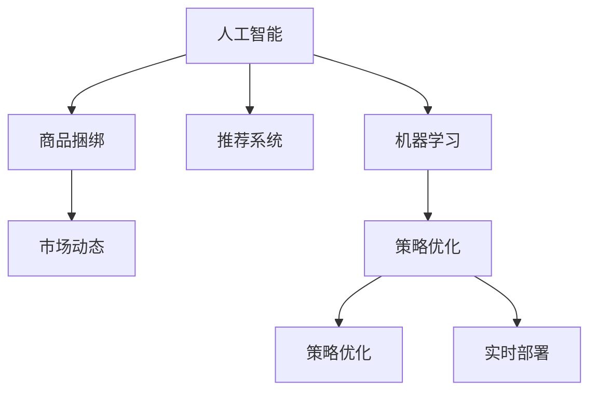

                 

# AI驱动的商品捆绑销售策略

> 关键词：人工智能,机器学习,推荐系统,商品捆绑,电商策略,策略优化

## 1. 背景介绍

### 1.1 问题由来
在现代电子商务中，商品捆绑销售已成为提升销售额和市场份额的重要手段。通过将互补或相关商品打包出售，商家可以刺激消费者的购买欲望，提高单次订单价值，增加客户忠诚度。然而，传统的捆绑销售策略依赖于经验和直觉，难以精准把握消费者需求和市场动态。

人工智能和大数据技术的兴起，为商品捆绑销售提供了全新的智能化解决方案。AI可以通过分析消费者行为数据、市场趋势等，预测消费者对商品组合的偏好，设计出更加科学合理的捆绑策略。机器学习算法能够自动化地进行策略优化，实时调整以应对市场变化，提升销售效果。

### 1.2 问题核心关键点
实现基于AI的商品捆绑销售策略，主要包括以下几个关键步骤：

1. **数据收集与预处理**：收集消费者的购买历史、浏览记录、评价反馈等数据，清洗、筛选并转化为可用于机器学习的格式。
2. **特征工程**：从原始数据中提取有意义的特征，如商品类别、价格、折扣等，用于建立机器学习模型。
3. **模型构建与训练**：选择合适的机器学习模型，使用历史销售数据进行训练，学习消费者偏好。
4. **策略优化与部署**：根据训练得到的模型预测消费者对不同商品组合的偏好，设计最优的捆绑策略，并实时部署。
5. **效果评估与迭代**：定期评估销售效果，根据反馈结果不断优化模型和策略。

### 1.3 问题研究意义
AI驱动的商品捆绑销售策略具有以下几个重要意义：

1. **提升销售效果**：通过精准的市场预测和策略优化，提高商品销售量和客户满意度。
2. **降低营销成本**：自动化的策略调整可以减少人工干预，降低营销成本。
3. **增强市场竞争力**：通过差异化的捆绑策略，增强商家在市场中的竞争优势。
4. **提高运营效率**：实时调整捆绑策略，适应市场变化，提高运营灵活性。
5. **推动业务创新**：将AI技术融入销售决策过程，推动业务模式创新。

## 2. 核心概念与联系

### 2.1 核心概念概述

为更好地理解AI驱动的商品捆绑销售策略，本节将介绍几个密切相关的核心概念：

- **人工智能(AI)**：通过机器学习、数据挖掘等技术，使计算机系统模拟人类智能，解决复杂问题。
- **机器学习(ML)**：指使用数据训练模型，使模型能够自动进行预测、分类等任务。
- **推荐系统(Recommendation System)**：根据用户历史行为和偏好，推荐可能感兴趣的商品或内容。
- **商品捆绑(Bundling)**：将两种或以上商品打包出售的销售策略。
- **市场动态(Market Dynamics)**：指市场中的各种变化因素，如价格、需求、竞争等。
- **策略优化(Strategy Optimization)**：通过算法优化，寻找最优的策略方案。

这些概念之间的逻辑关系可以通过以下Mermaid流程图来展示：



这个流程图展示了大语言模型的核心概念及其之间的关系：

1. 人工智能通过机器学习技术，预测市场动态，设计商品捆绑策略。
2. 推荐系统辅助预测消费者偏好，辅助策略优化。
3. 商品捆绑策略基于市场动态设计，并通过策略优化得到最优方案。
4. 实时部署和效果评估，不断迭代优化。

## 3. 核心算法原理 & 具体操作步骤
### 3.1 算法原理概述

AI驱动的商品捆绑销售策略，本质上是一个基于机器学习的推荐系统应用。其核心思想是：利用历史销售数据和市场动态数据，训练模型预测消费者对商品组合的偏好，进而设计最优的捆绑策略。

具体来说，可以构建一个包含以下步骤的流程：

1. **数据收集与预处理**：收集消费者的购买历史、浏览记录、评价反馈等数据，清洗、筛选并转化为可用于机器学习的格式。
2. **特征工程**：从原始数据中提取有意义的特征，如商品类别、价格、折扣等，用于建立机器学习模型。
3. **模型构建与训练**：选择合适的机器学习模型，使用历史销售数据进行训练，学习消费者偏好。
4. **策略优化与部署**：根据训练得到的模型预测消费者对不同商品组合的偏好，设计最优的捆绑策略，并实时部署。
5. **效果评估与迭代**：定期评估销售效果，根据反馈结果不断优化模型和策略。

### 3.2 算法步骤详解

以下是基于机器学习算法实现商品捆绑销售策略的详细步骤：

**Step 1: 数据收集与预处理**

1. **数据源选择**：选择包括消费者历史订单、浏览记录、评价反馈等多种数据源。
2. **数据清洗与筛选**：去除噪声、处理缺失值、去除异常数据。
3. **数据标准化与归一化**：对数据进行标准化和归一化处理，使其符合机器学习模型的输入要求。

**Step 2: 特征工程**

1. **特征提取**：从原始数据中提取有意义的特征，如商品类别、价格、折扣等。
2. **特征组合**：通过组合不同特征，生成新的特征，如商品组合价格、组合销量等。
3. **特征选择**：使用特征选择技术，选择对模型预测最有影响的特征。

**Step 3: 模型构建与训练**

1. **选择模型**：根据任务特性选择合适的机器学习模型，如随机森林、神经网络、决策树等。
2. **模型训练**：使用历史销售数据训练模型，学习消费者对商品组合的偏好。
3. **模型评估**：使用交叉验证等技术评估模型性能，选择合适的模型参数。

**Step 4: 策略优化与部署**

1. **策略设计**：根据训练得到的模型预测消费者对不同商品组合的偏好，设计最优的捆绑策略。
2. **策略部署**：将优化后的策略部署到电商平台，自动进行商品推荐。
3. **实时调整**：根据实时数据反馈，实时调整推荐策略，保持策略的适应性。

**Step 5: 效果评估与迭代**

1. **销售效果评估**：定期评估销售效果，如销售额、订单量、客户满意度等指标。
2. **模型迭代优化**：根据销售效果评估结果，不断优化模型参数和特征，提升预测准确性。
3. **策略持续优化**：根据市场变化，持续优化捆绑策略，保持竞争优势。

### 3.3 算法优缺点

AI驱动的商品捆绑销售策略具有以下优点：

1. **高效精准**：通过机器学习模型，可以精准预测消费者偏好，设计最优的捆绑策略。
2. **实时动态**：利用实时数据，可以动态调整捆绑策略，适应市场变化。
3. **成本效益高**：自动化的策略调整可以减少人工干预，降低营销成本。
4. **增强客户体验**：根据消费者偏好，提供个性化推荐，提升客户满意度。

同时，该策略也存在一定的局限性：

1. **数据依赖**：策略效果高度依赖于数据质量和数量，数据收集和处理成本较高。
2. **模型复杂度**：复杂的机器学习模型可能导致过拟合，影响模型泛化能力。
3. **算法透明度**：机器学习模型通常是"黑盒"，难以解释其决策过程。
4. **市场变化快**：市场变化快，策略调整频繁，模型需要持续更新。
5. **模型偏见**：模型可能学习到数据中的偏见，影响策略的公平性。

尽管存在这些局限性，但AI驱动的商品捆绑销售策略仍然具有广阔的应用前景，特别是在数据资源丰富的电商平台中。

### 3.4 算法应用领域

基于AI的商品捆绑销售策略，在多个电商领域中得到了广泛应用，例如：

1. **B2C电商平台**：如亚马逊、京东、淘宝等，通过推荐系统对商品进行捆绑销售，提升用户体验和销售额。
2. **B2B电商平台**：如阿里巴巴、慧聪网等，通过精准的商品组合推荐，提高采购效率和供应商匹配度。
3. **旅游行业**：如携程、去哪儿等，通过个性化推荐和捆绑销售，提高客户预订率和满意度。
4. **汽车行业**：如宝马、特斯拉等，通过套餐销售和个性化推荐，提高整车销售量和客户忠诚度。
5. **金融行业**：如招商银行、蚂蚁金服等，通过推荐系统优化理财产品组合，提升用户粘性和收入。

除了以上几个领域，基于AI的商品捆绑销售策略还在医疗、教育、物流等多个行业中得到了应用，为各行业带来了显著的效益提升。

## 4. 数学模型和公式 & 详细讲解  
### 4.1 数学模型构建

本节将使用数学语言对基于机器学习的商品捆绑销售策略进行更加严格的刻画。

假设消费者对商品组合 $X = (x_1, x_2, ..., x_n)$ 的偏好表示为 $y$，其中 $x_i$ 表示商品 $i$，$y$ 为消费者对组合的评分。根据历史销售数据，我们定义 $X_i = (x_1, x_2, ..., x_i)$ 为商品组合 $X$ 中包含商品 $x_i$ 的子组合。

模型的目标是学习消费者对商品组合的偏好，即找到最优的函数 $f(X_i)$，使得消费者评分 $y$ 与模型预测值 $f(X_i)$ 的差距最小化。常用的目标函数包括均方误差、交叉熵等，例如：

$$
\min_{f} \sum_{i=1}^N (y - f(X_i))^2
$$

其中 $N$ 为训练数据总数。

### 4.2 公式推导过程

以下我们以线性回归模型为例，推导商品组合偏好的预测公式及其梯度计算。

假设模型 $f(X_i) = w_1x_1 + w_2x_2 + ... + w_nx_n$，其中 $w_i$ 为商品 $x_i$ 的权重。根据最小二乘法，预测误差 $\epsilon_i = y - f(X_i)$，则均方误差目标函数为：

$$
L(w) = \frac{1}{N} \sum_{i=1}^N (y - w_1x_1 - w_2x_2 - ... - w_nx_n)^2
$$

对目标函数求导，得：

$$
\frac{\partial L(w)}{\partial w_j} = \frac{2}{N} \sum_{i=1}^N \epsilon_i x_{ij}
$$

其中 $x_{ij}$ 表示商品 $x_j$ 在组合 $X_i$ 中的权重。

根据梯度下降算法，模型参数 $w_j$ 的更新公式为：

$$
w_j \leftarrow w_j - \eta \frac{\partial L(w)}{\partial w_j}
$$

其中 $\eta$ 为学习率，为保证收敛，一般建议从小值开始逐步增大。

### 4.3 案例分析与讲解

以电商平台推荐的商品捆绑策略为例，具体分析如何利用线性回归模型进行策略优化。

**Step 1: 数据收集与预处理**

1. **数据源选择**：选择包括消费者历史订单、浏览记录、评价反馈等多种数据源。
2. **数据清洗与筛选**：去除噪声、处理缺失值、去除异常数据。
3. **数据标准化与归一化**：对数据进行标准化和归一化处理，使其符合机器学习模型的输入要求。

**Step 2: 特征工程**

1. **特征提取**：从原始数据中提取有意义的特征，如商品类别、价格、折扣等。
2. **特征组合**：通过组合不同特征，生成新的特征，如商品组合价格、组合销量等。
3. **特征选择**：使用特征选择技术，选择对模型预测最有影响的特征。

**Step 3: 模型构建与训练**

1. **选择模型**：根据任务特性选择合适的机器学习模型，如随机森林、神经网络、决策树等。
2. **模型训练**：使用历史销售数据训练模型，学习消费者对商品组合的偏好。
3. **模型评估**：使用交叉验证等技术评估模型性能，选择合适的模型参数。

**Step 4: 策略优化与部署**

1. **策略设计**：根据训练得到的模型预测消费者对不同商品组合的偏好，设计最优的捆绑策略。
2. **策略部署**：将优化后的策略部署到电商平台，自动进行商品推荐。
3. **实时调整**：根据实时数据反馈，实时调整推荐策略，保持策略的适应性。

**Step 5: 效果评估与迭代**

1. **销售效果评估**：定期评估销售效果，如销售额、订单量、客户满意度等指标。
2. **模型迭代优化**：根据销售效果评估结果，不断优化模型参数和特征，提升预测准确性。
3. **策略持续优化**：根据市场变化，持续优化捆绑策略，保持竞争优势。

## 5. 项目实践：代码实例和详细解释说明
### 5.1 开发环境搭建

在进行商品捆绑销售策略的实践前，我们需要准备好开发环境。以下是使用Python进行PyTorch开发的环境配置流程：

1. 安装Anaconda：从官网下载并安装Anaconda，用于创建独立的Python环境。

2. 创建并激活虚拟环境：
```bash
conda create -n pytorch-env python=3.8 
conda activate pytorch-env
```

3. 安装PyTorch：根据CUDA版本，从官网获取对应的安装命令。例如：
```bash
conda install pytorch torchvision torchaudio cudatoolkit=11.1 -c pytorch -c conda-forge
```

4. 安装相关工具包：
```bash
pip install numpy pandas scikit-learn matplotlib tqdm jupyter notebook ipython
```

完成上述步骤后，即可在`pytorch-env`环境中开始商品捆绑销售策略的开发。

### 5.2 源代码详细实现

下面我们以电商平台的商品捆绑销售策略为例，给出使用PyTorch进行模型构建和优化的PyTorch代码实现。

首先，定义模型类和损失函数：

```python
import torch
import torch.nn as nn
import torch.optim as optim

class BundlingModel(nn.Module):
    def __init__(self, input_size, output_size):
        super(BundlingModel, self).__init__()
        self.linear1 = nn.Linear(input_size, 128)
        self.linear2 = nn.Linear(128, output_size)
        self.relu = nn.ReLU()
        
    def forward(self, x):
        x = self.linear1(x)
        x = self.relu(x)
        x = self.linear2(x)
        return x

loss_fn = nn.MSELoss()
```

然后，定义数据集和数据加载器：

```python
from torch.utils.data import Dataset, DataLoader

class BundlingDataset(Dataset):
    def __init__(self, data, target):
        self.data = data
        self.target = target
        
    def __len__(self):
        return len(self.data)
    
    def __getitem__(self, idx):
        return self.data[idx], self.target[idx]

dataset = BundlingDataset(X_train, y_train)
train_loader = DataLoader(dataset, batch_size=32, shuffle=True)
test_loader = DataLoader(dataset, batch_size=32)
```

接着，定义模型训练函数：

```python
def train_model(model, train_loader, loss_fn, optimizer, epochs):
    model.train()
    for epoch in range(epochs):
        total_loss = 0
        for data, target in train_loader:
            optimizer.zero_grad()
            output = model(data)
            loss = loss_fn(output, target)
            loss.backward()
            optimizer.step()
            total_loss += loss.item()
        print(f'Epoch {epoch+1}, Loss: {total_loss/len(train_loader)}')

def test_model(model, test_loader):
    model.eval()
    total_loss = 0
    for data, target in test_loader:
        output = model(data)
        loss = loss_fn(output, target)
        total_loss += loss.item()
    print(f'Test Loss: {total_loss/len(test_loader)}')
```

最后，启动训练流程并在测试集上评估：

```python
input_size = 8
output_size = 1
model = BundlingModel(input_size, output_size)
optimizer = optim.Adam(model.parameters(), lr=0.001)

train_model(model, train_loader, loss_fn, optimizer, 100)
test_model(model, test_loader)
```

以上就是使用PyTorch对商品捆绑销售策略进行训练的完整代码实现。可以看到，通过简单的线性回归模型，即可对商品组合的偏好进行预测，并优化商品捆绑策略。

### 5.3 代码解读与分析

让我们再详细解读一下关键代码的实现细节：

**BundlingModel类**：
- `__init__`方法：初始化模型参数，包含两个线性层和一个ReLU激活函数。
- `forward`方法：定义模型的前向传播过程，输入特征映射到输出特征。

**BundlingDataset类**：
- `__init__`方法：初始化数据和目标变量。
- `__len__`方法：返回数据集的大小。
- `__getitem__`方法：返回单个样本的特征和目标。

**train_model函数**：
- 定义训练循环，遍历训练集，前向传播计算损失，反向传播更新模型参数，并输出每个epoch的平均损失。

**test_model函数**：
- 定义测试循环，遍历测试集，计算模型在测试集上的损失。

**训练流程**：
- 定义模型参数、优化器和损失函数。
- 调用训练函数，训练模型。
- 调用测试函数，评估模型在测试集上的性能。

可以看到，通过PyTorch的灵活封装，我们能够快速搭建并训练一个基于机器学习的商品捆绑销售策略模型。开发者可以将更多精力放在数据处理、模型改进等高层逻辑上，而不必过多关注底层的实现细节。

当然，工业级的系统实现还需考虑更多因素，如模型保存和部署、超参数的自动搜索、更灵活的任务适配层等。但核心的商品捆绑策略设计过程基本与此类似。

## 6. 实际应用场景
### 6.1 智能推荐系统

基于AI的商品捆绑销售策略，可以广泛应用于智能推荐系统中。传统的推荐系统往往只根据单个商品特征进行推荐，忽略了商品之间的关联性和搭配价值。通过商品捆绑策略，推荐系统可以推荐更加丰富、更有吸引力的商品组合，提升用户满意度和平台销售额。

在技术实现上，可以收集用户的历史浏览记录和购买历史，分析用户对不同商品组合的偏好，在推荐时推荐最优的商品组合。此外，还可以结合用户反馈和实时市场数据，动态调整推荐策略，实现更加精准的推荐。

### 6.2 个性化促销活动

电商平台在节假日和促销季，会设计各种个性化促销活动，如跨品类组合优惠、套餐优惠等，吸引用户购买。通过商品捆绑销售策略，可以科学设计这些促销活动，最大化其效果。

例如，可以在平台上设计多种商品组合优惠套餐，根据用户的购买行为和偏好，推荐最合适的商品组合。通过实时调整优惠策略，根据市场反馈和用户反馈不断优化，保持优惠活动的高性价比和吸引力。

### 6.3 客户关系管理

电商平台在客户关系管理中，通过商品捆绑销售策略，可以提升用户忠诚度和复购率。例如，可以根据用户的购买历史和浏览记录，推荐相关商品或套餐，增加用户的回购机会。

此外，可以通过定期推送推荐商品或优惠活动，保持用户与平台的互动，增强用户粘性。通过分析用户的反馈和行为数据，不断优化推荐策略，提升用户满意度和平台留存率。

### 6.4 未来应用展望

随着AI和大数据技术的不断发展，基于机器学习的商品捆绑销售策略将在更多领域得到应用，为电商和其他行业带来显著的效益提升。

在智慧医疗领域，通过推荐系统对医疗产品进行捆绑销售，可以提升医生的诊疗效率和患者的治疗体验。在智能教育领域，通过推荐系统优化教育资源配置，提供个性化的学习方案，提高教育质量和效果。

在智慧城市治理中，通过推荐系统优化城市资源分配，提升城市管理的智能化水平，构建更安全、高效的未来城市。此外，在金融、旅游、物流等多个领域，基于商品捆绑销售策略的推荐系统也将不断涌现，为各行各业带来变革性影响。

## 7. 工具和资源推荐
### 7.1 学习资源推荐

为了帮助开发者系统掌握商品捆绑销售策略的理论基础和实践技巧，这里推荐一些优质的学习资源：

1. 《推荐系统实战》系列博文：由推荐系统专家撰写，深入浅出地介绍了推荐系统原理、算法和应用场景。

2. CS231n《深度学习与计算机视觉》课程：斯坦福大学开设的视觉识别课程，涵盖推荐系统的理论和实践。

3. 《Deep Learning for Recommender Systems》书籍：深度学习推荐系统领域的经典教材，涵盖了机器学习、深度学习等基础知识和推荐算法。

4. Kaggle推荐系统竞赛：通过参与竞赛，实践推荐系统算法，学习数据处理和模型优化技巧。

5. Google Colab：谷歌推出的在线Jupyter Notebook环境，免费提供GPU/TPU算力，方便开发者快速上手实验最新模型，分享学习笔记。

通过对这些资源的学习实践，相信你一定能够快速掌握商品捆绑销售策略的精髓，并用于解决实际的NLP问题。

### 7.2 开发工具推荐

高效的开发离不开优秀的工具支持。以下是几款用于商品捆绑销售策略开发的常用工具：

1. PyTorch：基于Python的开源深度学习框架，灵活动态的计算图，适合快速迭代研究。

2. TensorFlow：由Google主导开发的开源深度学习框架，生产部署方便，适合大规模工程应用。

3. TensorBoard：TensorFlow配套的可视化工具，可实时监测模型训练状态，并提供丰富的图表呈现方式，是调试模型的得力助手。

4. Jupyter Notebook：交互式编程环境，支持Python、R等多种编程语言，方便开发者记录实验过程和分析结果。

5. Apache Spark：分布式计算框架，适合大规模数据处理和推荐系统优化。

6. Apache Flink：流处理框架，适合实时推荐系统开发。

合理利用这些工具，可以显著提升商品捆绑销售策略的开发效率，加快创新迭代的步伐。

### 7.3 相关论文推荐

商品捆绑销售策略的发展源于学界的持续研究。以下是几篇奠基性的相关论文，推荐阅读：

1. WebShop: A benchmark for web-based recommendation systems：介绍了基于协同过滤和混合推荐算法的推荐系统，评估了其在电商平台的推荐效果。

2. Recommendation Systems in E-Commerce: A Survey and Taxonomy：综述了电商推荐系统的多种算法和技术，提供了全面的参考和指导。

3. Beyond the Lamp Post: Personalized Promotion in E-commerce：研究了基于用户行为数据的个性化促销策略，提高了电商平台的促销效果。

4. Exploiting Cross-Category Relationships in E-commerce Recommendations：探讨了跨品类商品组合的推荐方法，提升了推荐系统的效果。

5. Cross-sell Advertising: Designing Effective Recommendation Strategies：研究了跨品类推荐广告的设计方法，提高了广告点击率和转化率。

这些论文代表了大语言模型微调技术的发展脉络。通过学习这些前沿成果，可以帮助研究者把握学科前进方向，激发更多的创新灵感。

## 8. 总结：未来发展趋势与挑战

### 8.1 总结

本文对基于机器学习的商品捆绑销售策略进行了全面系统的介绍。首先阐述了商品捆绑销售策略的研究背景和意义，明确了机器学习在精准预测消费者偏好、设计最优策略方面的独特价值。其次，从原理到实践，详细讲解了机器学习模型的构建、训练、优化过程，给出了商品捆绑策略的代码实例和详细解释。同时，本文还探讨了商品捆绑策略在电商、医疗、教育等多个领域的应用前景，展示了其广阔的发展空间。

通过本文的系统梳理，可以看到，基于机器学习的商品捆绑销售策略正在成为电商和其他行业的重要范式，极大地提升电商平台的销售效果和用户体验。未来，伴随机器学习技术的进一步发展，商品捆绑策略将不断进化，成为推动电商和其他行业创新发展的关键驱动力。

### 8.2 未来发展趋势

展望未来，商品捆绑销售策略将呈现以下几个发展趋势：

1. **个性化程度提高**：通过深度学习和强化学习技术，推荐系统将更加精准，能根据用户个性化需求推荐最优的商品组合。
2. **多模态融合**：结合视觉、音频、文本等多种模态数据，实现更加全面、立体的商品推荐。
3. **实时动态调整**：利用实时数据，动态调整推荐策略，保持策略的适应性和时效性。
4. **跨平台集成**：将商品捆绑策略应用于多个平台，如电商、社交媒体、智能家居等，实现跨平台协同推荐。
5. **用户反馈闭环**：建立用户反馈机制，根据用户反馈动态优化推荐策略，提升用户体验。
6. **智能决策**：结合因果推断和博弈论技术，设计更加智能的推荐决策算法。

这些趋势凸显了商品捆绑销售策略的巨大潜力。这些方向的探索发展，必将进一步提升推荐系统的性能和用户体验，推动电商和其他行业的发展。

### 8.3 面临的挑战

尽管商品捆绑销售策略已经取得了显著的成效，但在进一步提升推荐准确性和个性化程度的过程中，仍面临诸多挑战：

1. **数据质量与多样性**：推荐系统高度依赖于数据质量，数据的不足或偏差可能影响推荐效果。如何采集多样、高质量的数据，是提升推荐系统性能的重要前提。
2. **模型复杂度与计算资源**：复杂推荐算法需要大量计算资源，如何优化算法复杂度，降低计算成本，是提升推荐系统可扩展性的关键。
3. **隐私保护与数据安全**：推荐系统涉及大量用户数据，如何保障用户隐私和数据安全，是推荐系统发展的重要保障。
4. **用户行为变化快**：用户行为变化快，推荐系统需要不断调整策略以适应新的需求，如何实现动态调整，提升策略适应性，是推荐系统面临的难题。
5. **推荐偏见与公平性**：推荐系统可能学习到数据中的偏见，影响推荐公平性。如何设计公平、无偏见的推荐策略，是推荐系统的重要挑战。
6. **推荐算法的透明性与可解释性**：推荐系统通常是"黑盒"模型，难以解释其决策过程，如何提升算法的透明性与可解释性，是推荐系统面临的难题。

尽管存在这些挑战，但随着AI技术的不断发展，商品捆绑销售策略仍具有广阔的应用前景。

### 8.4 研究展望

面向未来，商品捆绑销售策略需要在以下几个方面寻求新的突破：

1. **多模态融合与协同推荐**：结合视觉、音频、文本等多种模态数据，实现更加全面、立体的商品推荐。
2. **个性化深度学习**：利用深度学习技术，设计更加个性化、精准的推荐模型，提升用户体验。
3. **因果推断与强化学习**：结合因果推断和强化学习技术，设计更加智能、可解释的推荐策略。
4. **实时动态优化**：利用实时数据，动态调整推荐策略，保持策略的适应性和时效性。
5. **跨平台协同推荐**：将推荐策略应用于多个平台，实现跨平台协同推荐，提升推荐效果。
6. **用户反馈与智能决策**：建立用户反馈机制，根据用户反馈动态优化推荐策略，提升用户体验。

这些研究方向和技术的探索，必将引领商品捆绑销售策略的进一步发展，为电商和其他行业带来更深层次的变革。

## 9. 附录：常见问题与解答

**Q1：商品捆绑销售策略是否适用于所有商品类别？**

A: 商品捆绑销售策略可以适用于大多数商品类别，尤其是那些具有互补性或相关性的商品。但对于一些特殊商品，如易腐食品、高价值商品等，可能需要根据具体情况进行策略调整。

**Q2：如何设计合理的商品组合？**

A: 设计合理的商品组合需要综合考虑商品的互补性、价格、品牌等多种因素。一般而言，可以将互补性强、价格相近、品牌相符的商品进行捆绑。

**Q3：如何评估商品捆绑策略的效果？**

A: 评估商品捆绑策略的效果可以从多个角度进行，如销售额、订单量、客户满意度等。具体而言，可以通过实验对比分析，评估捆绑策略在控制变量下的效果，找到最优组合。

**Q4：如何优化商品捆绑策略？**

A: 优化商品捆绑策略需要不断收集用户反馈和市场数据，根据数据分析结果调整策略。可以通过A/B测试、多臂老虎机等技术，不断优化策略组合。

**Q5：如何保障商品捆绑策略的公平性？**

A: 商品捆绑策略的公平性可以通过设计多目标优化模型、引入公平性约束、定期审查等手段保障。同时，需要建立用户反馈机制，及时调整策略，避免偏见和歧视。

通过这些问题的解答，可以更好地理解商品捆绑销售策略的实施细节和优化方法。

---

作者：禅与计算机程序设计艺术 / Zen and the Art of Computer Programming

