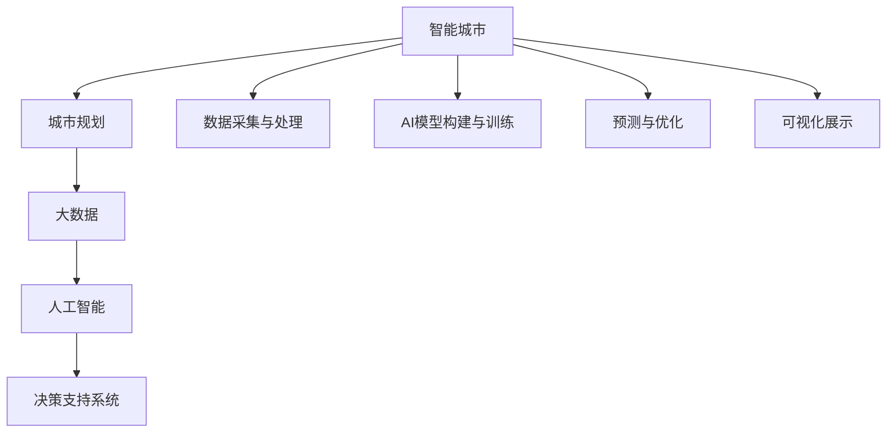

                 

# AI驱动的智能城市规划工具

> 关键词：智能城市, 城市规划, 大数据, 人工智能, 决策支持系统, 预测分析, 智能模拟, 环境影响评估

## 1. 背景介绍

### 1.1 问题由来

在现代社会中，城市化进程不断加快，城市规划和建设已成为国家经济社会发展的关键。传统的城市规划方法主要依赖于经验和历史数据，难以适应快速变化的社会需求和复杂的地理环境。随着信息技术和人工智能的迅猛发展，越来越多的城市规划机构开始探索利用AI技术进行智能化、精细化规划，以提高规划的科学性和合理性。

智能城市规划工具利用AI技术，通过大数据分析和智能模拟，为城市规划决策提供科学依据，有效应对城市发展中的各种挑战，如交通拥堵、环境污染、公共安全等问题。

### 1.2 问题核心关键点

智能城市规划工具的核心在于结合城市大数据和AI技术，构建一个集数据采集、分析、预测、优化和展示于一体的综合平台，为城市规划师提供高效、可靠、灵活的决策支持。该工具的核心关键点包括：

1. 数据采集与处理：收集城市各类数据，如人口、交通、能源消耗、环境质量等，并进行清洗、归一化、聚合等预处理。
2. AI模型构建与训练：建立各种AI模型，如预测模型、优化模型、模拟模型等，用于处理城市规划中的各种问题。
3. 预测与优化：利用AI模型对城市发展进行预测和优化，辅助规划师做出科学决策。
4. 可视化展示：构建交互式可视化界面，方便规划师理解和使用AI工具。

这些关键点构成了智能城市规划工具的框架，通过不断迭代优化，可以为城市规划提供更加智能、高效、精准的决策支持。

## 2. 核心概念与联系

### 2.1 核心概念概述

为更好地理解智能城市规划工具的内部机制，本节将介绍几个密切相关的核心概念：

- **智能城市**：以信息技术和AI技术为基础，通过数据采集、传输、存储、分析和应用，实现城市管理的智能化、精细化，提高城市运行的效率和可持续性。
- **城市规划**：通过对城市的土地利用、空间布局、交通网络、基础设施、公共服务等进行系统设计和规划，实现城市资源的优化配置和高效利用。
- **大数据**：通过大规模数据采集和处理，挖掘数据中的潜在价值，为决策提供数据支持。
- **人工智能**：通过机器学习、深度学习等技术，模拟人类智能，解决复杂问题，提升决策的准确性和效率。
- **决策支持系统**：利用AI技术，辅助决策者进行科学决策，提高决策的合理性和可行性。

这些核心概念之间的逻辑关系可以通过以下Mermaid流程图来展示：



这个流程图展示了几大核心概念之间的联系和作用：

1. 智能城市依托城市规划，通过大数据和AI技术，构建决策支持系统。
2. 数据采集与处理是智能城市的基础，为AI模型提供数据支撑。
3. AI模型构建与训练是核心环节，通过机器学习等技术，解决城市规划中的复杂问题。
4. 预测与优化是重要步骤，利用AI模型对城市发展进行预测和优化。
5. 可视化展示是成果展现，方便规划师理解和使用AI工具。

## 3. 核心算法原理 & 具体操作步骤
### 3.1 算法原理概述

智能城市规划工具的核心算法原理基于AI模型构建与训练，具体步骤如下：

1. **数据收集与预处理**：通过传感器、摄像头、GPS等设备，采集城市各类数据，如人口、交通、能源消耗、环境质量等，并进行清洗、归一化、聚合等预处理。

2. **模型构建与训练**：构建各种AI模型，如预测模型、优化模型、模拟模型等，用于处理城市规划中的各种问题。通过历史数据进行模型训练，调整模型参数，使其能够准确预测城市未来发展趋势。

3. **预测与优化**：利用训练好的AI模型对城市发展进行预测和优化，辅助规划师做出科学决策。预测模型用于预测人口增长、交通流量等关键指标；优化模型用于优化资源配置、环境治理等；模拟模型用于模拟城市规划方案，评估其效果。

4. **可视化展示**：构建交互式可视化界面，方便规划师理解和使用AI工具。将预测和优化结果以图表、地图等形式展示，帮助规划师进行决策。

### 3.2 算法步骤详解

以下是智能城市规划工具的核心算法步骤详解：

**Step 1: 数据收集与预处理**

智能城市规划工具首先需要构建一个数据采集系统，通过各类传感器和设备采集城市各类数据。

1. 传感器部署：在城市关键位置部署各类传感器，如人口传感器、交通传感器、环境监测传感器等。
2. 数据采集：通过传感器收集数据，如人流、车流、空气质量、噪音等。
3. 数据清洗：对采集的数据进行清洗，去除噪声和异常值，保证数据质量。
4. 数据聚合：对城市各类数据进行聚合，如人口、交通流量、能源消耗、环境质量等。

**Step 2: 模型构建与训练**

在数据预处理的基础上，构建各种AI模型，利用历史数据进行训练，调整模型参数，使其能够准确预测城市发展趋势。

1. 数据分割：将数据集划分为训练集和测试集。
2. 模型选择：选择适合的AI模型，如神经网络、决策树、随机森林等。
3. 模型训练：使用训练集对模型进行训练，调整模型参数，使其能够准确预测城市发展趋势。
4. 模型评估：使用测试集对模型进行评估，确保模型预测准确度。

**Step 3: 预测与优化**

利用训练好的AI模型对城市发展进行预测和优化，辅助规划师做出科学决策。

1. 数据输入：将城市数据输入预测模型，获取预测结果。
2. 结果分析：分析预测结果，了解城市发展趋势。
3. 方案优化：利用优化模型对城市规划方案进行优化，评估其效果。
4. 决策支持：将预测和优化结果反馈给规划师，辅助其进行决策。

**Step 4: 可视化展示**

构建交互式可视化界面，将预测和优化结果以图表、地图等形式展示，帮助规划师理解和使用AI工具。

1. 界面设计：设计交互式可视化界面，提供丰富的展示形式。
2. 数据展示：将预测和优化结果以图表、地图等形式展示，方便规划师理解。
3. 交互功能：提供交互功能，如拖动、放大、缩小等，方便规划师进行操作。
4. 数据更新：实时更新数据，确保规划师掌握最新信息。

### 3.3 算法优缺点

智能城市规划工具的AI模型构建与训练具有以下优点：

1. 高效性：通过AI模型，能够快速处理大量城市数据，进行预测和优化，提高决策效率。
2. 准确性：AI模型利用历史数据进行训练，能够准确预测城市发展趋势，提供科学依据。
3. 灵活性：AI模型可以根据城市变化动态调整参数，适应城市发展需求。
4. 可扩展性：AI模型可扩展性强，能够适用于不同类型的城市规划问题。

但同时也存在以下缺点：

1. 数据依赖性强：AI模型的预测和优化效果依赖于数据质量，数据缺失或噪声会影响模型效果。
2. 复杂度高：构建和训练AI模型需要较高的技术门槛，需要专业知识。
3. 解释性不足：AI模型通常缺乏可解释性，难以理解其内部工作机制。
4. 模型成本高：AI模型的构建和训练需要高性能计算资源，成本较高。

尽管存在这些缺点，但通过合理的算法设计和优化，智能城市规划工具仍能为城市规划提供强有力的支持。

### 3.4 算法应用领域

智能城市规划工具在多个领域得到了广泛应用，具体如下：

1. **交通规划**：利用AI模型预测交通流量，优化交通信号灯设置，缓解交通拥堵问题。
2. **环境治理**：利用AI模型预测环境污染，优化能源配置，提升环境质量。
3. **公共安全**：利用AI模型预测安全事件，优化应急响应，提升公共安全水平。
4. **公共服务**：利用AI模型优化公共服务资源配置，提升服务效率和质量。
5. **基础设施建设**：利用AI模型预测城市发展趋势，指导基础设施建设，提高资源利用效率。

此外，智能城市规划工具还被应用于智慧医疗、智慧教育、智慧农业等多个领域，为城市管理提供了综合解决方案。

## 4. 数学模型和公式 & 详细讲解 & 举例说明

### 4.1 数学模型构建

智能城市规划工具的数学模型主要包括以下几类：

1. **预测模型**：用于预测城市发展趋势，如人口增长、交通流量等。常用的预测模型包括ARIMA、LSTM等。
2. **优化模型**：用于优化资源配置、环境治理等。常用的优化模型包括线性规划、非线性规划、遗传算法等。
3. **模拟模型**：用于模拟城市规划方案，评估其效果。常用的模拟模型包括蒙特卡罗模拟、马尔可夫过程等。

这些模型在处理城市规划中的问题时具有不同的特点和优势，能够相互补充，构建更全面的智能城市规划工具。

### 4.2 公式推导过程

以下是几种常用模型的公式推导过程：

**预测模型**：ARIMA模型

ARIMA模型是一种时间序列预测模型，其公式如下：

$$
y_t = c + \sum_{i=1}^{p} \alpha_i y_{t-i} + \sum_{j=1}^{q} \beta_j \Delta^j y_{t-j} + \sum_{k=1}^{K} \gamma_k \Delta^k \epsilon_{t-k}
$$

其中，$y_t$ 表示预测值，$c$ 表示截距项，$\alpha_i$、$\beta_j$、$\gamma_k$ 表示模型参数，$\Delta^j$ 表示差分运算，$\epsilon_{t-k}$ 表示随机扰动项。

**优化模型**：线性规划

线性规划模型用于优化资源配置，其公式如下：

$$
\min_{x} c^T x \\
\text{s.t.} \ A x \leq b \\
x \geq 0
$$

其中，$x$ 表示决策变量，$c$ 表示目标函数系数，$A$ 表示约束条件系数矩阵，$b$ 表示约束条件常数向量。

**模拟模型**：蒙特卡罗模拟

蒙特卡罗模拟是一种随机模拟方法，用于模拟城市规划方案的效果。其公式如下：

$$
y \sim f(x)
$$

其中，$y$ 表示模拟结果，$f(x)$ 表示模拟模型，$x$ 表示输入参数。

### 4.3 案例分析与讲解

以交通规划为例，介绍智能城市规划工具的应用。

1. **数据收集**：通过交通传感器收集城市交通流量、车速、车流量等数据。
2. **数据预处理**：对采集的数据进行清洗、归一化、聚合等预处理，得到交通流量数据。
3. **模型构建**：构建ARIMA模型，对交通流量进行预测。
4. **模型训练**：利用历史交通流量数据进行模型训练，调整模型参数。
5. **预测与优化**：将模型应用于实时交通流量数据，预测未来交通流量，优化交通信号灯设置。
6. **可视化展示**：将预测结果和优化方案以图表、地图等形式展示，辅助规划师进行决策。

## 5. 项目实践：代码实例和详细解释说明
### 5.1 开发环境搭建

在进行智能城市规划工具开发前，我们需要准备好开发环境。以下是使用Python进行Pandas、NumPy、SciPy等库的开发环境配置流程：

1. 安装Anaconda：从官网下载并安装Anaconda，用于创建独立的Python环境。

2. 创建并激活虚拟环境：
```bash
conda create -n city-planning python=3.8 
conda activate city-planning
```

3. 安装相关库：
```bash
conda install pandas numpy scipy matplotlib scikit-learn 
```

4. 安装可视化库：
```bash
conda install plotly folium
```

完成上述步骤后，即可在`city-planning`环境中开始智能城市规划工具的开发。

### 5.2 源代码详细实现

这里我们以交通流量预测为例，给出使用Python进行智能城市规划工具开发的完整代码实现。

首先，定义交通流量数据处理函数：

```python
import pandas as pd
import numpy as np
from sklearn.metrics import mean_squared_error

def preprocess_data(data):
    data = data.dropna()
    data = data.resample('H').mean()
    return data
```

然后，定义ARIMA模型并训练：

```python
from statsmodels.tsa.arima_model import ARIMA

def fit_arima(data, p, d, q):
    model = ARIMA(data, order=(p, d, q))
    return model.fit(disp=0)
```

接着，定义预测函数：

```python
def predict_arima(model, data, steps):
    forecast = model.forecast(steps)
    return forecast
```

最后，启动交通流量预测流程：

```python
data = pd.read_csv('traffic_data.csv')
data = preprocess_data(data)

p, d, q = 5, 1, 1
model = fit_arima(data['traffic'], p, d, q)

steps = 24
forecast = predict_arima(model, data, steps)

print(f"Traffic Forecast: {forecast}")
```

以上就是使用Python进行交通流量预测的完整代码实现。可以看到，通过Pandas、NumPy、SciPy等库，我们可以快速实现数据的预处理、模型的构建和训练、预测和可视化等功能。

### 5.3 代码解读与分析

让我们再详细解读一下关键代码的实现细节：

**preprocess_data函数**：
- 定义了数据预处理函数，首先去除NaN值，然后对数据进行小时级聚合，保证数据的连续性和完整性。

**fit_arima函数**：
- 定义了ARIMA模型的拟合函数，利用历史数据进行模型训练，调整模型参数。

**predict_arima函数**：
- 定义了ARIMA模型的预测函数，利用训练好的模型对未来交通流量进行预测。

**启动流程**：
- 从CSV文件中读取交通流量数据，并进行预处理。
- 构建ARIMA模型，并训练模型。
- 对未来24小时的交通流量进行预测，并输出结果。

可以看到，智能城市规划工具的开发过程中，Python和各种数据科学库的作用十分显著，可以高效地实现数据的预处理、模型训练、预测和可视化等功能。

## 6. 实际应用场景
### 6.1 智能交通规划

智能城市规划工具在智能交通规划中的应用极为广泛，通过AI模型对交通流量进行预测和优化，可以有效缓解交通拥堵问题，提升交通效率。

在实际应用中，可以利用智能城市规划工具构建交通流量预测模型，实时监测城市交通数据，预测未来交通流量，优化交通信号灯设置，指导交通管理部门采取措施缓解交通拥堵。

### 6.2 环境保护

智能城市规划工具在环境保护中也发挥着重要作用，利用AI模型对环境污染进行预测和优化，可以有效提升环境质量。

例如，可以利用智能城市规划工具构建环境污染预测模型，监测城市空气质量、水质等指标，预测未来污染趋势，优化能源配置，减少污染排放。

### 6.3 公共安全

智能城市规划工具在公共安全中也具有重要应用，通过AI模型对安全事件进行预测和优化，可以有效提升公共安全水平。

例如，可以利用智能城市规划工具构建安全事件预测模型，监测城市治安情况，预测未来安全事件，优化应急响应策略，保障公共安全。

### 6.4 未来应用展望

随着AI技术的发展，智能城市规划工具将进一步扩展其应用场景，为城市管理提供更加智能化、精细化的决策支持。

未来，智能城市规划工具有望在以下领域得到广泛应用：

1. **智慧医疗**：利用AI模型对医疗资源进行优化配置，提升医疗服务效率和质量。
2. **智慧教育**：利用AI模型对教育资源进行优化配置，提升教育服务质量和公平性。
3. **智慧农业**：利用AI模型对农业资源进行优化配置，提升农业生产效率和可持续性。
4. **智慧金融**：利用AI模型对金融风险进行预测和优化，提升金融服务安全性和稳定性。
5. **智慧能源**：利用AI模型对能源配置进行优化，提升能源利用效率和可持续性。

总之，智能城市规划工具的应用领域将不断扩展，为城市管理提供更加智能化、精细化的决策支持，助力城市可持续发展。

## 7. 工具和资源推荐
### 7.1 学习资源推荐

为了帮助开发者系统掌握智能城市规划工具的理论基础和实践技巧，这里推荐一些优质的学习资源：

1. **《智能城市规划技术》系列博文**：由智能城市规划技术专家撰写，深入浅出地介绍了智能城市规划的原理、方法和应用。

2. **城市规划基础课程**：由城市规划领域的专家开设的在线课程，介绍了城市规划的基本概念、方法和工具。

3. **AI与城市规划讲座**：由AI领域的专家和城市规划专家联合讲授，介绍了AI技术在城市规划中的应用。

4. **《智能城市规划》书籍**：系统介绍了智能城市规划的原理、方法和应用，适合入门学习和深入研究。

5. **智能城市规划开源项目**：提供智能城市规划的案例和代码，帮助开发者快速上手实践。

通过对这些资源的学习实践，相信你一定能够快速掌握智能城市规划工具的精髓，并用于解决实际的智能城市规划问题。

### 7.2 开发工具推荐

高效的开发离不开优秀的工具支持。以下是几款用于智能城市规划工具开发的常用工具：

1. **Python**：作为一种通用编程语言，Python具有简单易用、功能强大等优点，广泛应用于数据科学和AI开发。

2. **Pandas**：一种数据处理库，提供丰富的数据清洗、聚合、统计等功能，适合数据预处理和分析。

3. **NumPy**：一种科学计算库，提供高效的数组操作和数学函数，适合数值计算和机器学习。

4. **SciPy**：一种科学计算库，提供多种科学计算工具和函数，适合科学计算和数据分析。

5. **Plotly**：一种数据可视化库，提供丰富的图表展示和交互功能，适合数据展示和分析。

6. **Folium**：一种地图可视化库，支持多种地图数据和交互功能，适合地图展示和分析。

合理利用这些工具，可以显著提升智能城市规划工具的开发效率，加快创新迭代的步伐。

### 7.3 相关论文推荐

智能城市规划工具的发展源于学界的持续研究。以下是几篇奠基性的相关论文，推荐阅读：

1. **《智能城市规划中的大数据应用》**：介绍了大数据技术在智能城市规划中的应用，包括数据采集、存储、分析和应用。

2. **《基于AI的城市规划模型研究》**：介绍了AI技术在城市规划中的应用，包括预测模型、优化模型和模拟模型。

3. **《城市规划中的机器学习技术》**：介绍了机器学习技术在城市规划中的应用，包括分类、回归、聚类等方法。

4. **《智能城市规划中的深度学习技术》**：介绍了深度学习技术在智能城市规划中的应用，包括神经网络、卷积神经网络等。

5. **《城市规划中的强化学习技术》**：介绍了强化学习技术在智能城市规划中的应用，包括Q学习、策略梯度等方法。

这些论文代表了大数据和AI技术在智能城市规划中的应用，通过学习这些前沿成果，可以帮助研究者把握学科前进方向，激发更多的创新灵感。

## 8. 总结：未来发展趋势与挑战

### 8.1 总结

本文对智能城市规划工具进行了全面系统的介绍。首先阐述了智能城市规划工具的研究背景和意义，明确了其在城市规划中的独特价值。其次，从原理到实践，详细讲解了智能城市规划工具的核心算法和具体操作步骤，给出了智能城市规划工具的完整代码实例。同时，本文还广泛探讨了智能城市规划工具在交通规划、环境保护、公共安全等多个领域的应用前景，展示了智能城市规划工具的广泛应用。

通过本文的系统梳理，可以看到，智能城市规划工具依托AI技术和大数据，构建了一个集数据采集、分析、预测、优化和展示于一体的综合平台，为城市规划师提供高效、可靠、灵活的决策支持。智能城市规划工具能够有效应对城市发展中的各种挑战，如交通拥堵、环境污染、公共安全等问题，具有重要的应用价值。

### 8.2 未来发展趋势

展望未来，智能城市规划工具将呈现以下几个发展趋势：

1. **数据自动化采集**：未来，智能城市规划工具将更加注重数据的自动化采集和处理，利用物联网、传感网络等技术，实现数据的实时采集和自动化处理。

2. **模型自动化构建**：未来，智能城市规划工具将更加注重模型的自动化构建和训练，利用机器学习、深度学习等技术，实现模型的自动构建和训练，提升模型的精度和效率。

3. **预测与优化协同**：未来，智能城市规划工具将更加注重预测与优化的协同，利用预测模型和优化模型，实现预测与优化的有机结合，提高决策的科学性和合理性。

4. **多模态数据融合**：未来，智能城市规划工具将更加注重多模态数据的融合，利用视频、图像、声音等多模态数据，实现更全面、准确的城市规划。

5. **智慧治理平台**：未来，智能城市规划工具将更加注重智慧治理平台的构建，利用AI技术，实现城市管理的智能化、精细化，提升城市治理水平。

6. **跨领域应用推广**：未来，智能城市规划工具将更加注重跨领域应用的推广，利用AI技术，在智慧医疗、智慧教育、智慧农业等多个领域推广应用，提升社会治理水平。

以上趋势凸显了智能城市规划工具的广阔前景，这些方向的探索发展，必将进一步提升城市规划的科学性和合理性，为城市管理提供更全面、准确、高效的决策支持。

### 8.3 面临的挑战

尽管智能城市规划工具已经取得了瞩目成就，但在迈向更加智能化、普适化应用的过程中，它仍面临着诸多挑战：

1. **数据质量问题**：智能城市规划工具的预测和优化效果依赖于数据质量，数据缺失、噪声、不完整等问题会影响模型效果。

2. **模型复杂度**：构建和训练AI模型需要较高的技术门槛，模型复杂度高，难以理解和调试。

3. **成本高昂**：智能城市规划工具的构建和运行需要高性能计算资源，成本较高，难以大规模推广。

4. **隐私与安全**：智能城市规划工具涉及大量个人隐私数据，如何保护数据隐私和安全，是亟待解决的问题。

5. **解释性不足**：智能城市规划工具通常缺乏可解释性，难以理解其内部工作机制和决策逻辑。

6. **持续学习**：智能城市规划工具需要不断学习和更新，以适应城市发展变化，如何进行持续学习，是一个重要的研究方向。

正视智能城市规划工具面临的这些挑战，积极应对并寻求突破，将是其迈向成熟的必由之路。相信随着学界和产业界的共同努力，这些挑战终将一一被克服，智能城市规划工具必将在构建人机协同的智能城市中扮演越来越重要的角色。

### 8.4 研究展望

面向未来，智能城市规划工具的研究需要在以下几个方面寻求新的突破：

1. **数据治理与自动化采集**：探索如何利用物联网、传感网络等技术，实现数据的实时采集和自动化处理，提升数据质量。

2. **模型自动化构建与训练**：开发更加自动化、易用化的模型构建与训练工具，降低技术门槛，提升模型精度和效率。

3. **多模态数据融合**：探索如何利用视频、图像、声音等多模态数据，实现更全面、准确的城市规划，提升模型效果。

4. **智慧治理平台**：探索如何构建智慧治理平台，利用AI技术，实现城市管理的智能化、精细化，提升城市治理水平。

5. **跨领域应用推广**：探索如何将智能城市规划工具推广应用到智慧医疗、智慧教育、智慧农业等多个领域，提升社会治理水平。

6. **解释性增强**：探索如何增强AI模型的解释性，使其具有更强的可解释性和可理解性，便于理解和调试。

7. **持续学习与适应性**：探索如何实现智能城市规划工具的持续学习与适应性，使其能够不断学习新知识，适应城市发展变化。

这些研究方向的探索，必将引领智能城市规划工具技术迈向更高的台阶，为构建安全、可靠、可解释、可控的智能城市提供有力支持。面向未来，智能城市规划工具还需要与其他AI技术进行更深入的融合，如知识表示、因果推理、强化学习等，多路径协同发力，共同推动智能城市规划技术的进步。只有勇于创新、敢于突破，才能不断拓展智能城市规划技术的边界，让智能技术更好地造福人类社会。

## 9. 附录：常见问题与解答

**Q1：智能城市规划工具如何实现数据的实时采集和自动化处理？**

A: 智能城市规划工具可以通过以下方法实现数据的实时采集和自动化处理：

1. 部署传感器和摄像头：在城市关键位置部署各类传感器和摄像头，实时采集城市各类数据。
2. 利用物联网技术：利用物联网技术，实现数据的自动采集和传输，保证数据的实时性。
3. 数据清洗与预处理：对采集的数据进行清洗、归一化、聚合等预处理，保证数据质量。

通过这些方法，智能城市规划工具可以实现数据的实时采集和自动化处理，为城市规划提供实时、准确的数据支持。

**Q2：智能城市规划工具在构建和训练AI模型时需要注意哪些问题？**

A: 在构建和训练AI模型时，智能城市规划工具需要注意以下几个问题：

1. 数据质量：数据缺失、噪声、不完整等问题会影响模型效果，需要确保数据质量。
2. 模型选择：选择适合的AI模型，如神经网络、决策树、随机森林等，需要根据具体问题进行选择。
3. 模型训练：利用历史数据进行模型训练，调整模型参数，需要控制模型复杂度，防止过拟合。
4. 模型评估：使用测试集对模型进行评估，确保模型预测准确度，需要设定合适的评估指标。
5. 模型优化：优化模型结构和参数，提高模型精度和效率，需要进行多次实验和调参。

通过这些方法，智能城市规划工具可以构建和训练出高效、准确的AI模型，提升城市规划的科学性和合理性。

**Q3：智能城市规划工具在实际应用中需要注意哪些问题？**

A: 在实际应用中，智能城市规划工具需要注意以下几个问题：

1. 数据隐私与安全：智能城市规划工具涉及大量个人隐私数据，需要采取措施保护数据隐私和安全。
2. 模型解释性：智能城市规划工具通常缺乏可解释性，需要加强模型解释性，便于理解和调试。
3. 持续学习与更新：智能城市规划工具需要不断学习和更新，以适应城市发展变化，需要进行持续学习和适应性优化。
4. 跨领域应用推广：智能城市规划工具需要推广应用到多个领域，需要进行跨领域应用推广。
5. 系统集成与接口设计：智能城市规划工具需要与其他系统进行集成，需要进行系统集成与接口设计。

通过这些方法，智能城市规划工具可以更好地应对实际应用中的问题，实现智能化、精细化的城市规划。

---

作者：禅与计算机程序设计艺术 / Zen and the Art of Computer Programming

