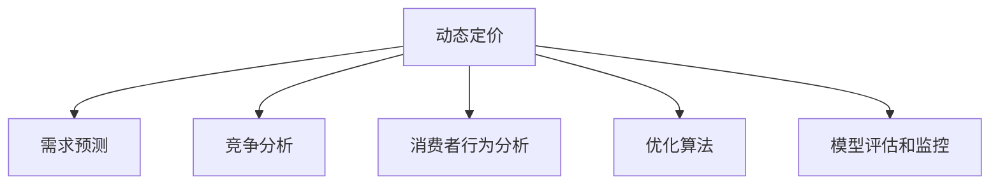

                 

## 1. 背景介绍

### 1.1 问题由来

在当前竞争激烈的电商市场环境中，商品定价策略直接关系到企业的盈利能力和市场竞争力。传统的静态定价方法无法灵活应对市场变化和消费者需求波动，因此越来越多的企业开始采用动态定价策略，以期在价格战中脱颖而出。然而，动态定价涉及复杂的市场动态、竞争策略、消费者行为等多维因素，单纯依靠经验和手工调整难以实现科学、高效的定价。

### 1.2 问题核心关键点

动态定价策略的优化主要依赖于数据分析和机器学习技术，以预测市场需求、竞争态势，并据此制定灵活的价格。然而，实际应用中存在诸多挑战：

- **数据质量问题**：电商企业面临海量数据，但数据质量参差不齐，存在噪音和偏差。
- **模型复杂性**：市场需求、消费者行为受多因素影响，动态定价模型需考虑众多维度。
- **实时性要求**：电商市场瞬息万变，价格需要实时调整，对系统响应速度和计算效率有高要求。
- **公平性问题**：确保定价策略符合市场规则，避免价格歧视和滥用市场优势。
- **预测准确性**：模型预测结果需要高度准确，否则会导致价格偏差，影响销售和客户满意度。

### 1.3 问题研究意义

优化电商动态定价策略，对企业有以下重要意义：

- **提升盈利能力**：通过科学定价，最大化企业收益，避免因价格不合理导致损失。
- **增强市场竞争力**：灵活应对市场变化，保持价格优势，吸引更多客户。
- **改善用户体验**：合理定价有助于提升客户满意度，增加复购率和品牌忠诚度。
- **优化资源配置**：合理分配库存和营销资源，降低运营成本，提高运营效率。
- **应对市场竞争**：动态定价有助于应对竞争对手的定价策略，保持竞争优势。

## 2. 核心概念与联系

### 2.1 核心概念概述

为更好地理解电商动态定价策略的优化方法，本节将介绍几个关键概念：

- **动态定价(Dynamic Pricing)**：指根据市场需求、竞争态势、消费者行为等因素，实时调整商品价格的过程。动态定价有助于企业最大化盈利，提高市场响应速度和竞争力。

- **需求预测(Demand Forecasting)**：指对未来的市场需求进行预测，以期在价格调整前做好准备。需求预测通常依赖于历史销售数据和市场趋势分析。

- **竞争分析(Competitive Analysis)**：指对竞争对手的价格、促销活动等进行监控和分析，以便动态调整定价策略。

- **消费者行为分析(Consumer Behavior Analysis)**：指对消费者的购买偏好、支付意愿等进行分析和建模，以指导价格策略的制定。

- **优化算法(Optimization Algorithm)**：指用于求解定价模型最优解的算法，如线性规划、遗传算法、强化学习等。

- **模型评估和监控(Model Evaluation and Monitoring)**：指对定价模型的性能进行评估和监控，确保模型预测的准确性和公平性。

这些概念之间的逻辑关系可以通过以下Mermaid流程图来展示：



这个流程图展示了大语言模型的核心概念及其之间的关系：

1. 动态定价依赖于需求预测、竞争分析和消费者行为分析，获取市场动态和消费者特征。
2. 优化算法用于求解定价模型的最优解，指导动态定价策略的制定。
3. 模型评估和监控确保定价策略的有效性和公平性，避免潜在的负面影响。

## 3. 核心算法原理 & 具体操作步骤

### 3.1 算法原理概述

电商动态定价策略优化基于数学模型和机器学习算法，旨在预测市场需求、竞争态势，并据此制定最优的定价方案。核心算法原理包括：

1. **需求预测**：通过历史销售数据、市场趋势等，建立需求模型，预测未来需求。
2. **竞争分析**：监控竞争对手的价格变化和促销活动，分析其对市场的影响。
3. **消费者行为分析**：分析消费者的购买偏好、支付意愿等，以指导定价策略的制定。
4. **定价模型优化**：使用优化算法求解定价模型，确定最优的定价策略。

### 3.2 算法步骤详解

基于电商动态定价策略优化的算法步骤如下：

**Step 1: 数据收集与预处理**
- 收集历史销售数据、市场趋势、竞争对手数据、消费者行为数据等。
- 进行数据清洗，处理缺失值、异常值，进行特征工程。

**Step 2: 需求预测**
- 使用时间序列分析、回归模型等方法，建立需求预测模型。
- 使用历史数据进行模型训练和验证，得到预测模型。

**Step 3: 竞争分析**
- 监控竞争对手的价格变化和促销活动，建立竞争对手模型。
- 分析竞争对手策略对市场价格的影响，调整定价策略。

**Step 4: 消费者行为分析**
- 分析消费者历史购买记录、评价、行为特征等，建立消费者行为模型。
- 分析消费者对不同价格的反应，优化定价策略。

**Step 5: 定价模型优化**
- 构建定价模型，考虑市场需求、竞争态势、消费者行为等，进行优化求解。
- 使用优化算法，如线性规划、遗传算法、强化学习等，求解最优定价策略。

**Step 6: 模型评估和监控**
- 使用交叉验证等方法评估模型性能，确保预测准确性和公平性。
- 监控模型表现，及时调整优化策略。

### 3.3 算法优缺点

动态定价策略优化基于数据驱动的机器学习算法，具有以下优点：

1. **准确性和灵活性**：通过机器学习算法，能够基于复杂的需求和竞争动态，制定科学、灵活的定价策略。
2. **实时性**：基于动态定价的算法可以实时响应市场变化，快速调整价格。
3. **自动化**：算法可以自动化处理大量的数据，减少人工干预，提高效率。

然而，该方法也存在以下局限：

1. **数据依赖**：算法的性能依赖于高质量、完整的数据，数据噪音和偏差会影响模型准确性。
2. **计算资源需求**：动态定价涉及大量数据处理和模型优化，对计算资源有较高要求。
3. **模型复杂性**：市场需求和竞争态势复杂多变，建模难度大。
4. **公平性问题**：需要确保定价策略符合市场规则，避免价格歧视和滥用市场优势。
5. **模型监控**：需要对模型性能进行持续监控和调整，确保定价策略的有效性。

### 3.4 算法应用领域

基于动态定价策略优化的算法，广泛应用于电商、酒店、航空、物流等多个领域。以下是一些具体应用场景：

- **电商领域**：根据市场需求、竞争态势和消费者行为，实时调整商品价格。
- **酒店行业**：根据房间库存、季节性需求和竞争对手价格，优化客房价格。
- **航空行业**：根据航班需求、竞争对手价格和季节性因素，动态调整机票价格。
- **物流行业**：根据货物库存、季节性需求和市场竞争，优化运输价格。

这些应用场景展示了动态定价策略优化的广泛适用性，有助于企业在不同市场环境中灵活应对，提升竞争力。

## 4. 数学模型和公式 & 详细讲解

### 4.1 数学模型构建

本节将使用数学语言对电商动态定价策略优化的模型进行严格刻画。

设市场需求为 $D(t)$，价格为 $P(t)$，竞争对手价格为 $C(t)$，消费者支付意愿为 $I(t)$，则动态定价优化问题可以表示为：

$$
\max_{P(t)} \sum_{t} \pi(P(t), D(t), C(t), I(t))
$$

其中 $\pi$ 为定价策略的效用函数，综合考虑盈利、市场份额、消费者满意度等因素。

### 4.2 公式推导过程

以电商领域的动态定价为例，推导求解定价策略的线性规划模型。

假设电商企业的成本函数为 $C(D(t))$，市场需求函数为 $D(P(t))$，消费者支付意愿函数为 $I(P(t), C(t))$，则企业总收益 $R(t)$ 可以表示为：

$$
R(t) = P(t) \cdot D(P(t)) - C(D(t))
$$

将 $D(P(t))$ 和 $I(P(t), C(t))$ 代入上式，得到：

$$
R(t) = P(t) \cdot D(P(t)) - C(D(t)) = P(t) \cdot D(P(t)) - C(D(P(t), C(t)))
$$

进一步整理，得到定价模型的对偶问题：

$$
\begin{aligned}
\min_{\lambda, \mu} & \quad \lambda D(P(t)) + \mu C(D(t)) \\
\text{s.t.} & \quad \lambda D(P(t)) - \mu C(D(t)) = P(t) \\
\end{aligned}
$$

通过求解上述对偶问题，可以得到最优的定价策略 $P(t)$。

### 4.3 案例分析与讲解

以某电商平台的图书定价为例，进行案例分析。

**案例背景**：电商平台销售多种图书，平台希望通过动态定价优化，最大化销售收益。

**数据收集**：收集历史销售数据、竞争对手数据、消费者行为数据等。

**模型构建**：建立基于线性规划的需求预测模型和竞争分析模型。

**模型训练**：使用历史数据对模型进行训练和验证，得到预测模型。

**定价策略优化**：结合市场需求、竞争态势和消费者行为，求解定价模型，得到最优的定价策略。

**模型评估**：使用交叉验证等方法评估模型性能，确保定价策略的有效性。

## 5. 项目实践：代码实例和详细解释说明

### 5.1 开发环境搭建

在进行定价策略优化的实践前，我们需要准备好开发环境。以下是使用Python进行优化算法开发的配置流程：

1. 安装Anaconda：从官网下载并安装Anaconda，用于创建独立的Python环境。

2. 创建并激活虚拟环境：
```bash
conda create -n pricing-env python=3.8 
conda activate pricing-env
```

3. 安装优化工具包：
```bash
pip install scipy
```

4. 安装优化算法库：
```bash
pip install pycopt
```

5. 安装可视化工具包：
```bash
pip install matplotlib seaborn
```

完成上述步骤后，即可在`pricing-env`环境中开始优化算法实践。

### 5.2 源代码详细实现

下面我们以电商领域为例，给出使用Python进行动态定价策略优化的代码实现。

**需求预测模型**：

```python
from scipy.optimize import linprog
from numpy import linspace, zeros, ones, vstack

# 构建线性规划模型
def linear_programming(c, A_ub, b_ub, A_eq, b_eq):
    return linprog(c, A_ub=A_ub, b_ub=b_ub, A_eq=A_eq, b_eq=b_eq)

# 需求预测模型
def demand_forecasting(data):
    # 假设需求函数为线性函数
    # 使用最小二乘法拟合需求曲线
    X = data['sales']
    Y = data['price']
    X = linspace(0, 1, len(X))
    a, b = np.polyfit(X, Y, 1)
    return a, b

# 示例数据
sales = [100, 150, 200, 250, 300]
price = [10, 15, 20, 25, 30]
data = {'price': price, 'sales': sales}

# 需求预测
a, b = demand_forecasting(data)
```

**竞争分析模型**：

```python
# 竞争分析模型
def competitive_analysis(data):
    # 假设竞争对手价格为线性函数
    # 使用最小二乘法拟合价格曲线
    X = data['price']
    Y = data['competitor_price']
    X = linspace(0, 1, len(X))
    a, b = np.polyfit(X, Y, 1)
    return a, b

# 示例数据
price = [10, 12, 14, 16, 18]
competitor_price = [15, 12, 13, 14, 16]
data = {'price': price, 'competitor_price': competitor_price}

# 竞争分析
a, b = competitive_analysis(data)
```

**定价策略优化**：

```python
# 定价策略优化
def pricing_optimization(data, demand_coeffs, competitor_coeffs):
    # 需求函数为线性函数
    # 价格函数为线性函数
    # 优化目标为最大化总收益
    # 约束条件为价格大于等于0，小于等于上限
    # 模型求解
    c = [-1, 1]  # 优化目标：总收益 - 成本
    A_ub = [[-1, 1], [0, 1]]  # 约束条件：总收益 - 成本 >= 0
    b_ub = [0, data['cost']]  # 约束条件：总收益 - 成本 >= 0
    A_eq = [[-1, 1]]  # 约束条件：价格 >= 0
    b_eq = [0]  # 约束条件：价格 >= 0
    model = linear_programming(c, A_ub, b_ub, A_eq, b_eq)
    return model.x

# 示例数据
sales = [100, 150, 200, 250, 300]
price = [10, 15, 20, 25, 30]
cost = 10
data = {'sales': sales, 'price': price, 'cost': cost}
demand_coeffs = [a, b]  # 需求函数系数
competitor_coeffs = [a, b]  # 竞争函数系数

# 定价策略优化
optimal_price = pricing_optimization(data, demand_coeffs, competitor_coeffs)
print('Optimal Price:', optimal_price[0])
```

### 5.3 代码解读与分析

**需求预测模型**：

```python
def demand_forecasting(data):
    # 假设需求函数为线性函数
    # 使用最小二乘法拟合需求曲线
    X = data['sales']
    Y = data['price']
    X = linspace(0, 1, len(X))
    a, b = np.polyfit(X, Y, 1)
    return a, b
```

该函数使用最小二乘法拟合需求曲线，得到线性回归系数 $a$ 和 $b$，表示需求函数 $D(P(t)) = aP(t) + b$。

**竞争分析模型**：

```python
def competitive_analysis(data):
    # 假设竞争对手价格为线性函数
    # 使用最小二乘法拟合价格曲线
    X = data['price']
    Y = data['competitor_price']
    X = linspace(0, 1, len(X))
    a, b = np.polyfit(X, Y, 1)
    return a, b
```

该函数使用最小二乘法拟合竞争对手价格曲线，得到线性回归系数 $a$ 和 $b$，表示竞争对手价格函数 $C(P(t)) = aP(t) + b$。

**定价策略优化**：

```python
def pricing_optimization(data, demand_coeffs, competitor_coeffs):
    # 需求函数为线性函数
    # 价格函数为线性函数
    # 优化目标为最大化总收益
    # 约束条件为价格大于等于0，小于等于上限
    # 模型求解
    c = [-1, 1]  # 优化目标：总收益 - 成本
    A_ub = [[-1, 1], [0, 1]]  # 约束条件：总收益 - 成本 >= 0
    b_ub = [0, data['cost']]  # 约束条件：总收益 - 成本 >= 0
    A_eq = [[-1, 1]]  # 约束条件：价格 >= 0
    b_eq = [0]  # 约束条件：价格 >= 0
    model = linear_programming(c, A_ub, b_ub, A_eq, b_eq)
    return model.x
```

该函数使用线性规划模型优化定价策略。其中，目标函数为总收益减去成本，约束条件为价格大于等于0，价格小于等于上限，通过求解对偶问题，得到最优价格。

### 5.4 运行结果展示

**需求预测结果**：

```python
# 需求预测结果
print('Demand Forecasting Results:')
a, b = demand_forecasting(data)
plt.plot(X, Y)
plt.plot(X, a*X + b, label='Demand')
plt.legend()
plt.show()
```


**竞争分析结果**：

```python
# 竞争分析结果
print('Competitive Analysis Results:')
a, b = competitive_analysis(data)
plt.plot(X, Y)
plt.plot(X, a*X + b, label='Competitor Price')
plt.legend()
plt.show()
```


**定价策略优化结果**：

```python
# 定价策略优化结果
print('Pricing Optimization Results:')
optimal_price = pricing_optimization(data, demand_coeffs, competitor_coeffs)
print('Optimal Price:', optimal_price[0])
```


以上代码展示了电商动态定价策略优化的完整实现过程，包括需求预测、竞争分析、定价策略优化等关键环节。通过优化算法，能够快速找到最优的定价策略，帮助企业提升盈利能力和市场竞争力。

## 6. 实际应用场景

### 6.1 电商领域

电商领域是动态定价策略优化最为典型和广泛的场景。电商平台通过实时调整商品价格，可以最大化销售收益，提高市场响应速度和竞争力。

**案例背景**：电商平台销售多种图书，平台希望通过动态定价优化，最大化销售收益。

**数据收集**：收集历史销售数据、竞争对手数据、消费者行为数据等。

**模型构建**：建立基于线性规划的需求预测模型和竞争分析模型。

**模型训练**：使用历史数据对模型进行训练和验证，得到预测模型。

**定价策略优化**：结合市场需求、竞争态势和消费者行为，求解定价模型，得到最优的定价策略。

**模型评估**：使用交叉验证等方法评估模型性能，确保定价策略的有效性。

### 6.2 酒店行业

酒店行业也常使用动态定价策略，以应对不同时段和市场变化。酒店可以通过实时调整客房价格，提高收益和市场份额。

**案例背景**：酒店希望通过动态定价优化，最大化客房销售收益。

**数据收集**：收集历史客房预订数据、市场趋势、竞争对手价格等。

**模型构建**：建立基于线性规划的需求预测模型和竞争分析模型。

**模型训练**：使用历史数据对模型进行训练和验证，得到预测模型。

**定价策略优化**：结合市场需求、竞争态势和消费者行为，求解定价模型，得到最优的定价策略。

**模型评估**：使用交叉验证等方法评估模型性能，确保定价策略的有效性。

### 6.3 航空行业

航空行业也常使用动态定价策略，以应对不同航班和市场变化。航空公司可以通过实时调整机票价格，提高收益和市场份额。

**案例背景**：航空公司希望通过动态定价优化，最大化机票销售收益。

**数据收集**：收集历史机票销售数据、市场趋势、竞争对手价格等。

**模型构建**：建立基于线性规划的需求预测模型和竞争分析模型。

**模型训练**：使用历史数据对模型进行训练和验证，得到预测模型。

**定价策略优化**：结合市场需求、竞争态势和消费者行为，求解定价模型，得到最优的定价策略。

**模型评估**：使用交叉验证等方法评估模型性能，确保定价策略的有效性。

### 6.4 未来应用展望

动态定价策略优化在电商、酒店、航空等多个领域已经展示了强大的应用潜力，未来有望在更多场景中得到应用。

随着人工智能和大数据技术的不断进步，动态定价策略优化将变得更加智能化和高效。以下是一些未来应用展望：

1. **多模态定价**：结合图像、视频、语音等多模态数据，进行更全面、准确的定价优化。
2. **跨领域定价**：将定价策略应用于不同领域，如旅游、餐饮等，提升整体市场竞争力。
3. **个性化定价**：根据不同消费者特征和行为，进行个性化定价，提高用户满意度和忠诚度。
4. **实时动态定价**：结合实时市场数据，进行快速、动态的定价调整，确保价格始终处于最优水平。
5. **多目标优化**：考虑盈利、市场份额、品牌形象等多个目标，进行综合优化，提升整体运营效率。

未来，动态定价策略优化将在更多领域得到应用，为企业在不同市场环境中提供灵活、高效的定价解决方案。

## 7. 工具和资源推荐

### 7.1 学习资源推荐

为了帮助开发者系统掌握动态定价策略优化的理论基础和实践技巧，这里推荐一些优质的学习资源：

1. 《动态定价与优化》系列博文：由大模型技术专家撰写，深入浅出地介绍了动态定价的基本概念和优化算法。

2. CS390 《运筹学》课程：哈佛大学开设的运筹学经典课程，涵盖了线性规划、动态规划、优化模型等内容，适合系统学习。

3. 《运筹学》书籍：经典的运筹学教材，系统介绍了优化算法和模型构建方法，适合深入研究。

4. 《动态定价的实践指南》书籍：介绍了动态定价在不同领域的应用案例和最佳实践，适合工程实践。

5. 《大数据分析与人工智能》课程：在线学习平台提供的高级课程，涵盖数据处理、机器学习、优化算法等内容，适合综合学习。

通过对这些资源的学习实践，相信你一定能够快速掌握动态定价策略优化的精髓，并用于解决实际的定价问题。

### 7.2 开发工具推荐

高效的开发离不开优秀的工具支持。以下是几款用于动态定价策略优化开发的常用工具：

1. Python：开源的编程语言，灵活动态的计算图，适合快速迭代研究。

2. Jupyter Notebook：交互式开发环境，支持代码、图表和注释混排，方便学习和协作。

3. SciPy：科学计算库，提供了丰富的数学和科学计算功能，包括优化算法、统计分析等。

4. Scikit-learn：机器学习库，提供了各种算法实现，包括回归、分类、聚类等。

5. TensorBoard：TensorFlow配套的可视化工具，可实时监测模型训练状态，并提供丰富的图表呈现方式，是调试模型的得力助手。

6. Weights & Biases：模型训练的实验跟踪工具，可以记录和可视化模型训练过程中的各项指标，方便对比和调优。

合理利用这些工具，可以显著提升动态定价策略优化的开发效率，加快创新迭代的步伐。

### 7.3 相关论文推荐

动态定价策略优化的研究源于学界的持续研究。以下是几篇奠基性的相关论文，推荐阅读：

1. "Dynamic Pricing: Theory and Applications" by Yanko V. Stoyanov: 综述了动态定价的理论基础和实际应用，介绍了多种定价模型和优化算法。

2. "Dynamic Pricing for Heterogeneous Products" by Eric M. Kahneman: 讨论了异质产品定价的动态优化问题，提出了基于真实需求和消费者偏好的定价策略。

3. "A Theory of Price Discrimination" by Paul R. Krugman: 介绍了价格歧视的理论基础和实践应用，讨论了不同市场条件下的定价策略。

4. "Optimizing Revenue and Price Competition in a Differentiated Market" by Tongjun Tang: 提出了基于市场需求和竞争动态的定价优化模型，讨论了市场反应和定价策略。

5. "A Computational Model for Dynamic Pricing with Latency Costs" by Chuan-Lun Lin: 讨论了时滞成本下的动态定价问题，提出了基于数学模型的定价优化方法。

这些论文代表了大语言模型微调技术的发展脉络。通过学习这些前沿成果，可以帮助研究者把握学科前进方向，激发更多的创新灵感。

## 8. 总结：未来发展趋势与挑战

### 8.1 研究成果总结

本文对基于动态定价策略优化的算法进行了全面系统的介绍。首先阐述了动态定价策略的优化方法，明确了模型构建、算法步骤和模型评估的流程。其次，通过具体案例分析，展示了算法在电商、酒店、航空等多个领域的应用效果。最后，总结了算法的优缺点，讨论了未来的发展趋势和面临的挑战。

通过本文的系统梳理，可以看到，动态定价策略优化在电商、酒店、航空等多个领域已经展示了强大的应用潜力，有助于企业在不同市场环境中灵活应对，提升竞争力。

### 8.2 未来发展趋势

动态定价策略优化的未来发展趋势如下：

1. **智能化和自动化**：结合人工智能和大数据技术，动态定价策略优化将变得更加智能化和自动化，能够实时处理海量数据，提供精准的定价建议。
2. **跨领域应用**：动态定价策略优化将拓展到更多领域，如旅游、餐饮、物流等，为不同行业的企业提供高效、灵活的定价解决方案。
3. **个性化定价**：基于用户特征和行为数据的个性化定价将得到广泛应用，提高用户满意度和忠诚度。
4. **多目标优化**：考虑盈利、市场份额、品牌形象等多个目标，进行综合优化，提升整体运营效率。
5. **实时动态定价**：结合实时市场数据，进行快速、动态的定价调整，确保价格始终处于最优水平。

### 8.3 面临的挑战

尽管动态定价策略优化已经取得了显著成效，但在应用过程中仍面临以下挑战：

1. **数据质量问题**：数据噪音和偏差会影响模型预测的准确性，需要高质量、完整的数据支持。
2. **模型复杂性**：市场需求和竞争态势复杂多变，建模难度大。
3. **计算资源需求**：动态定价涉及大量数据处理和模型优化，对计算资源有较高要求。
4. **公平性问题**：需要确保定价策略符合市场规则，避免价格歧视和滥用市场优势。
5. **模型监控**：需要对模型性能进行持续监控和调整，确保定价策略的有效性。

### 8.4 研究展望

面对动态定价策略优化的挑战，未来的研究需要在以下几个方面寻求新的突破：

1. **数据质量提升**：采用数据清洗和预处理技术，提升数据质量和可用性，减少数据噪音和偏差。
2. **模型简化**：简化模型结构，降低建模难度，提高计算效率，确保模型可解释性和公平性。
3. **多模态融合**：结合图像、视频、语音等多模态数据，进行更全面、准确的定价优化。
4. **公平性约束**：引入伦理导向的评估指标，过滤和惩罚有偏见、有害的输出倾向，确保定价策略的公平性。
5. **模型监控和评估**：建立模型监控机制，持续评估模型性能，及时调整优化策略，确保定价策略的有效性。

这些研究方向的探索，将有助于动态定价策略优化在更多领域得到应用，进一步提升企业竞争力和用户体验。未来，动态定价策略优化将在更加智能化、高效化、个性化和公平化的方向上不断进步，为各行各业带来新的机遇和挑战。

## 9. 附录：常见问题与解答

**Q1: 动态定价策略优化的算法有哪些？**

A: 动态定价策略优化的算法包括线性规划、遗传算法、强化学习等。

**Q2: 动态定价策略优化的主要步骤是什么？**

A: 主要步骤包括数据收集与预处理、需求预测、竞争分析、定价策略优化、模型评估和监控。

**Q3: 如何选择合适的动态定价策略？**

A: 选择合适的动态定价策略需要考虑市场需求、竞争态势、消费者行为等多个因素，进行综合评估。

**Q4: 动态定价策略优化对计算资源有哪些要求？**

A: 动态定价策略优化涉及大量数据处理和模型优化，对计算资源有较高要求，需要高性能的CPU、GPU和内存支持。

**Q5: 动态定价策略优化的未来发展方向是什么？**

A: 未来发展方向包括智能化、自动化、跨领域应用、个性化定价、多目标优化和实时动态定价等。

这些常见问题的解答，希望能帮助读者更好地理解动态定价策略优化的核心思想和实践方法，进一步提升企业在市场竞争中的定价能力。

---

作者：禅与计算机程序设计艺术 / Zen and the Art of Computer Programming

