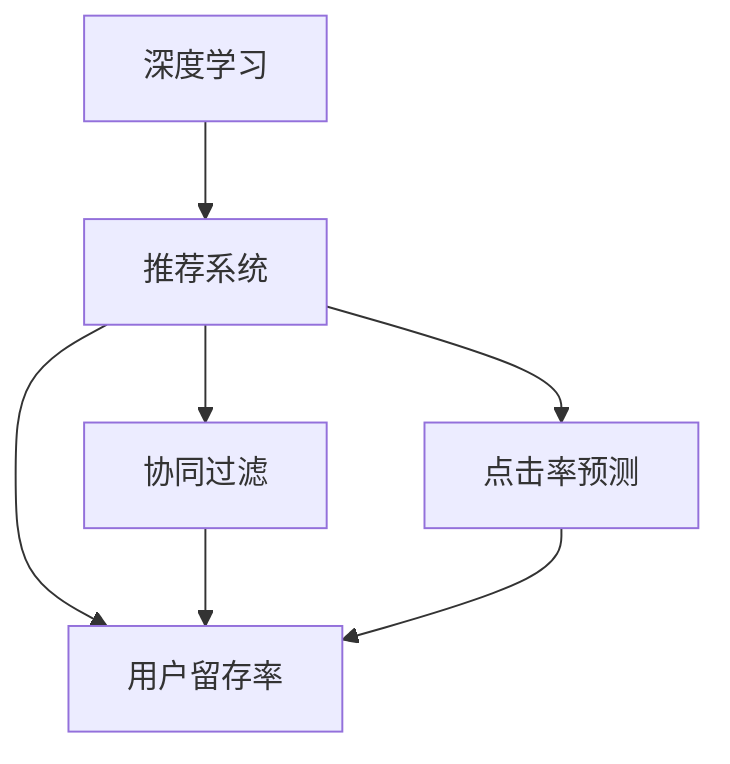

                 

# AI驱动的电商平台个性化登陆页优化

> 关键词：人工智能,电商平台,个性化登陆页,用户行为分析,深度学习,推荐系统,决策树,协同过滤,点击率预测,用户留存率

## 1. 背景介绍

### 1.1 问题由来

在快速变化的电子商务市场中，电商平台面对着日益激烈的市场竞争。如何提高用户转化率和用户留存率，是电商平台持续关注的重点。传统的基于规则的推荐系统已难以适应复杂多变的用户需求。人工智能技术的广泛应用，为电商平台个性化登陆页优化提供了新的解决思路。

通过深度学习和大数据技术，电商平台可以实时分析用户行为数据，预测用户偏好，生成个性化的登陆页内容。这不仅提升了用户体验，还能显著提高转化率和留存率，带来可观的经济收益。

### 1.2 问题核心关键点

实现个性化登陆页优化的核心在于：
1. 实时采集和分析用户行为数据，构建全面的用户画像。
2. 利用人工智能技术，构建推荐模型，预测用户点击行为。
3. 基于推荐结果，优化登陆页布局和内容，提升用户体验和转化率。
4. 定期更新模型参数，持续改进推荐系统性能。

### 1.3 问题研究意义

通过深度学习驱动的推荐系统优化登陆页，具有以下重要意义：
1. 大幅提升用户转化率。推荐系统能够精准推送用户感兴趣的商品，减少搜索和浏览时间，快速促成购买。
2. 提高用户留存率。个性化推荐内容和布局能更好地满足用户需求，增强用户粘性。
3. 增加平台收益。通过精准营销，最大化用户购买潜力，为电商平台创造更多价值。
4. 优化用户体验。通过界面设计和内容推荐，提升用户使用电商平台的满意度。
5. 加速技术迭代。利用AI技术不断优化推荐算法，保持平台竞争优势。

## 2. 核心概念与联系

### 2.1 核心概念概述

为更好地理解AI驱动的电商平台个性化登陆页优化方法，本节将介绍几个密切相关的核心概念：

- **深度学习(Deep Learning)**：一种基于多层神经网络的机器学习方法，能够处理非线性关系，适用于大规模数据分析。
- **推荐系统(Recommendation System)**：利用用户历史行为数据，预测用户偏好，向用户推荐商品的智能系统。
- **协同过滤(Collaborative Filtering)**：一种基于用户历史行为和相似用户行为的推荐方法，常用于电商平台的商品推荐。
- **点击率预测(Click-Through Rate Prediction)**：预测用户点击商品的概率，是电商推荐系统的重要指标。
- **用户留存率(User Retention Rate)**：衡量用户持续使用平台的时间比例，是平台健康度的重要指标。

这些核心概念之间的逻辑关系可以通过以下Mermaid流程图来展示：



这个流程图展示了几者之间的关系：
1. 深度学习为推荐系统提供强大的数据分析能力。
2. 协同过滤和点击率预测是推荐系统的两种重要技术。
3. 用户留存率是推荐系统优化的最终目标之一。

## 3. 核心算法原理 & 具体操作步骤
### 3.1 算法原理概述

个性化登陆页优化的核心算法原理是利用深度学习和推荐系统技术，构建点击率预测模型，生成个性化推荐内容。具体步骤如下：

1. **用户行为数据采集**：通过用户在电商平台上的浏览、点击、购买等行为，采集用户行为数据。
2. **用户画像构建**：利用深度学习技术，对用户行为数据进行建模，构建用户画像。
3. **点击率预测模型构建**：根据用户画像和商品特征，构建点击率预测模型，预测用户点击商品的概率。
4. **推荐内容生成**：基于预测结果，生成个性化推荐的商品和布局。
5. **用户反馈采集**：收集用户对推荐内容的反馈，用于模型更新。
6. **模型参数更新**：定期使用用户反馈数据，更新推荐模型参数，持续改进推荐系统性能。

### 3.2 算法步骤详解

以下是详细的操作步骤：

**Step 1: 数据准备**
- 收集用户在电商平台上的历史行为数据，包括浏览记录、点击次数、购买记录等。
- 数据预处理：去除噪声数据，对缺失值进行填充，归一化处理等。

**Step 2: 特征工程**
- 设计特征变量，如商品类别、价格、品牌、用户历史行为等。
- 利用深度学习技术，将原始数据映射为高维特征表示。

**Step 3: 模型训练**
- 选择适合的模型架构，如深度神经网络、决策树等。
- 将特征数据输入模型，训练点击率预测模型。
- 设定合适的损失函数和优化器，如交叉熵损失、Adam等。
- 设置训练轮数和超参数，进行模型训练。

**Step 4: 推荐内容生成**
- 根据用户画像和预测结果，生成个性化推荐的商品列表和页面布局。
- 利用模板引擎，渲染推荐内容，生成登陆页。

**Step 5: 用户反馈采集**
- 通过点击率、购买率等指标，评估推荐效果。
- 收集用户对推荐内容的满意度反馈。

**Step 6: 模型更新**
- 定期使用最新用户反馈数据，更新模型参数。
- 根据用户行为数据和模型性能，调整特征选择和模型结构。

### 3.3 算法优缺点

深度学习和推荐系统驱动的个性化登陆页优化具有以下优点：
1. 灵活性高。深度学习模型能够处理复杂的非线性关系，适应多种推荐场景。
2. 效果显著。通过大规模数据分析，推荐系统能够准确预测用户偏好，提升点击率和转化率。
3. 可扩展性强。推荐模型可以动态更新，支持平台持续扩展和优化。

同时，也存在一些局限性：
1. 数据质量依赖性强。推荐系统的准确性高度依赖于用户数据的完整性和准确性。
2. 计算资源需求高。深度学习模型需要大量的计算资源进行训练和推理。
3. 用户隐私问题。收集用户数据可能引发隐私保护和数据安全问题。
4. 算法复杂度高。深度学习模型需要精心设计，调参难度大。

尽管存在这些局限性，基于深度学习和推荐系统的个性化登陆页优化仍是目前电商平台提升用户体验和转化率的有效手段。

### 3.4 算法应用领域

该算法在电商平台的个性化推荐、搜索优化、广告投放等场景中得到了广泛应用，带来了显著的经济效益和用户满意度提升。具体应用场景包括：

1. 商品推荐：根据用户历史行为和点击率预测，个性化推荐商品，提高用户购买意愿。
2. 搜索优化：优化搜索结果排序，让用户快速找到所需商品，提升搜索体验。
3. 广告投放：基于用户画像和行为数据，精准投放广告，提高广告点击率。
4. 用户留存：通过个性化内容和推荐，增强用户粘性，提升平台留存率。
5. 个性化体验：定制化登陆页内容，提升用户界面友好度和满意度。

## 4. 数学模型和公式 & 详细讲解 & 举例说明

### 4.1 数学模型构建

假设平台有 $N$ 个用户，每个用户的历史行为表示为 $\{x_i, y_i\}_{i=1}^N$，其中 $x_i$ 为用户行为特征向量，$y_i$ 为用户点击行为。点击率预测模型为 $f(x_i, \theta)$，其中 $\theta$ 为模型参数。预测结果 $y_i^*$ 与真实标签 $y_i$ 的误差用均方误差(MSE)表示，模型优化目标为：

$$
\min_{\theta} \frac{1}{N} \sum_{i=1}^N (y_i - y_i^*)^2
$$

### 4.2 公式推导过程

假设点击率预测模型为单层神经网络，输入为 $x_i$，输出为 $y_i^*$，损失函数为均方误差。则预测模型为：

$$
f(x_i, \theta) = \sigma(Wx_i + b)
$$

其中 $W$ 为权重矩阵，$b$ 为偏置项，$\sigma$ 为激活函数，通常选择ReLU或Sigmoid。通过反向传播算法，可以计算损失函数对参数 $\theta$ 的梯度：

$$
\frac{\partial \mathcal{L}}{\partial \theta} = \frac{2}{N} \sum_{i=1}^N (\hat{y}_i - y_i) x_i
$$

其中 $\hat{y}_i = \sigma(Wx_i + b)$ 为模型预测值。

通过最小化损失函数，可以得到最优参数：

$$
\theta^* = \mathop{\arg\min}_{\theta} \mathcal{L}(\theta)
$$

### 4.3 案例分析与讲解

以电商平台商品推荐为例，假设用户 $i$ 的历史行为数据为 $\{x_{i1}, x_{i2}, \ldots, x_{in}\}$，商品 $j$ 的特征为 $\{x_{1j}, x_{2j}, \ldots, x_{nj}\}$，则点击率预测模型为：

$$
f(x_i, \theta) = \sigma(W \begin{bmatrix} x_{i1} \\ x_{i2} \\ \vdots \\ x_{in} \end{bmatrix} + \begin{bmatrix} W_{1j} \\ W_{2j} \\ \vdots \\ W_{nj} \end{bmatrix} y_j + b)
$$

其中 $W$ 为用户的权重矩阵，$W_{kj}$ 为商品 $j$ 在特征 $k$ 上的权重，$b$ 为偏置项。通过反向传播算法计算梯度：

$$
\frac{\partial \mathcal{L}}{\partial W} = \frac{2}{N} \sum_{i=1}^N (\hat{y}_i - y_i) x_i x_j^T
$$

$$
\frac{\partial \mathcal{L}}{\partial W_{kj}} = \frac{2}{N} \sum_{i=1}^N (\hat{y}_i - y_i) x_i y_j
$$

通过更新参数 $W$、$W_{kj}$ 和 $b$，优化模型性能。

## 5. 项目实践：代码实例和详细解释说明
### 5.1 开发环境搭建

在进行项目实践前，我们需要准备好开发环境。以下是使用Python进行TensorFlow开发的环境配置流程：

1. 安装Anaconda：从官网下载并安装Anaconda，用于创建独立的Python环境。

2. 创建并激活虚拟环境：
```bash
conda create -n tensorflow-env python=3.8 
conda activate tensorflow-env
```

3. 安装TensorFlow：根据CUDA版本，从官网获取对应的安装命令。例如：
```bash
conda install tensorflow -c conda-forge -c pypi
```

4. 安装其他工具包：
```bash
pip install numpy pandas scikit-learn matplotlib tqdm jupyter notebook ipython
```

完成上述步骤后，即可在`tensorflow-env`环境中开始项目实践。

### 5.2 源代码详细实现

下面我们以电商平台商品推荐为例，给出使用TensorFlow进行推荐系统开发的PyTorch代码实现。

首先，定义推荐系统中的数据处理函数：

```python
import tensorflow as tf
from tensorflow.keras.layers import Input, Dense, Embedding, Concatenate
from tensorflow.keras.models import Model
from tensorflow.keras.optimizers import Adam

class RecommendationSystem(tf.keras.Model):
    def __init__(self, vocab_size, embedding_dim, hidden_units):
        super(RecommendationSystem, self).__init__()
        self.user_embedding = Embedding(vocab_size, embedding_dim, input_length=1)
        self.item_embedding = Embedding(vocab_size, embedding_dim, input_length=1)
        self.interaction = tf.keras.layers.Dot(axes=1, normalize=True, use bruhat=True)
        self.dense1 = Dense(hidden_units, activation='relu')
        self.dense2 = Dense(1, activation='sigmoid')
    
    def call(self, inputs):
        user_features, item_features = inputs
        user_embedding = self.user_embedding(user_features)
        item_embedding = self.item_embedding(item_features)
        interaction = self.interaction([user_embedding, item_embedding])
        interaction = self.dense1(interaction)
        output = self.dense2(interaction)
        return output
```

然后，定义训练和评估函数：

```python
from tensorflow.keras.utils import to_categorical
from sklearn.metrics import roc_auc_score

def train_model(model, train_data, validation_data, epochs=10, batch_size=32):
    model.compile(optimizer=Adam(), loss='binary_crossentropy', metrics=['auc'])
    model.fit(train_data, epochs=epochs, batch_size=batch_size, validation_data=validation_data)
    
def evaluate_model(model, test_data):
    predictions = model.predict(test_data)
    auc = roc_auc_score(test_data.labels, predictions)
    print(f"AUC Score: {auc}")
```

接着，启动训练流程并在测试集上评估：

```python
# 加载数据
train_data = ...
validation_data = ...
test_data = ...

# 构建模型
model = RecommendationSystem(vocab_size, embedding_dim, hidden_units)

# 训练模型
train_model(model, train_data, validation_data)

# 评估模型
evaluate_model(model, test_data)
```

以上就是使用TensorFlow进行推荐系统开发的完整代码实现。可以看到，TensorFlow提供了丰富的层和优化器，方便开发者构建和训练深度学习模型。

### 5.3 代码解读与分析

让我们再详细解读一下关键代码的实现细节：

**RecommendationSystem类**：
- `__init__`方法：定义了模型的基本结构，包括用户嵌入层、物品嵌入层、交互层、全连接层和输出层。
- `call`方法：定义了模型的前向传播过程，将用户特征和物品特征进行交互，再经过多层全连接和激活函数，输出预测结果。

**train_model和evaluate_model函数**：
- 使用TensorFlow的Keras API，定义了模型编译、训练和评估流程。
- 训练时使用二元交叉熵损失函数，评估时使用ROC曲线下的面积(AUC)指标。

**数据加载和处理**：
- 使用TensorFlow的数据流管道，加载训练数据和测试数据。
- 将数据集转换为TensorFlow支持的格式，如张量和序列。

通过这些代码实现，可以完成一个基本的电商推荐系统的构建。然而，实际应用中还需要针对具体任务进行优化，如添加正则化、引入Dropout等技术，以提高模型的泛化能力和鲁棒性。

## 6. 实际应用场景
### 6.1 电商平台的个性化推荐

基于深度学习和推荐系统的个性化登陆页优化，可以广泛应用于电商平台的个性化推荐系统。传统推荐系统往往依赖用户历史行为数据，难以应对新用户和老用户的多样化需求。通过深度学习技术，电商推荐系统可以更好地捕捉用户潜在的偏好，实现冷启动和个性化推荐。

在技术实现上，可以收集用户的历史浏览、点击、购买等行为数据，构建用户画像。利用点击率预测模型，预测用户对商品的点击概率，从而生成个性化推荐列表。通过动态调整商品展示位置和布局，优化登陆页设计，提升用户体验和转化率。

### 6.2 实时广告投放

基于深度学习和推荐系统的个性化登陆页优化，还可以应用于实时广告投放的优化。通过收集用户的历史行为数据和点击反馈，动态调整广告内容和投放策略，实现精准投放和高效转化。

在技术实现上，可以实时监控用户行为数据，构建用户画像和广告投放策略。利用推荐模型预测用户对广告的点击概率，动态调整广告展示位置和内容。通过A/B测试等手段，不断优化广告投放效果，提高广告点击率和转化率。

### 6.3 搜索优化

基于深度学习和推荐系统的个性化登陆页优化，也可以应用于电商平台的搜索优化。通过收集用户搜索行为数据，构建用户画像和商品特征向量。利用点击率预测模型，预测用户对搜索结果的点击概率，从而优化搜索排序。通过动态调整搜索结果和展示方式，提升搜索体验和转化率。

在技术实现上，可以收集用户的搜索关键词和点击记录，构建搜索行为特征。利用推荐模型预测用户对搜索结果的点击概率，优化搜索结果排序。通过A/B测试等手段，不断优化搜索效果，提高用户满意度。

### 6.4 用户留存率提升

基于深度学习和推荐系统的个性化登陆页优化，还可以应用于用户留存率的提升。通过收集用户的历史行为数据和点击反馈，动态调整登陆页内容和布局，提升用户体验和粘性。

在技术实现上，可以收集用户的历史行为数据和点击记录，构建用户画像和行为特征。利用推荐模型预测用户对登陆页内容的点击概率，动态调整内容展示位置和布局。通过动态调整登陆页设计，提升用户粘性和留存率。

## 7. 工具和资源推荐
### 7.1 学习资源推荐

为了帮助开发者系统掌握深度学习和推荐系统的原理和实践技巧，这里推荐一些优质的学习资源：

1. 《Deep Learning Specialization》系列课程：由Andrew Ng教授开设的深度学习系列课程，涵盖从基础到高级的深度学习技术，适合初学者和进阶者。
2. 《Recommender Systems》书籍：由Hallan教授编写，全面介绍了推荐系统的理论基础和实际应用，适合研究者和工程师。
3. 《Hands-On Recommender Systems with TensorFlow》书籍：由Google工程师编写，介绍了TensorFlow在推荐系统中的应用，适合TensorFlow用户。
4. TensorFlow官方文档：包含深度学习模型和推荐系统的详细介绍，是快速上手TensorFlow的必备资料。
5. Kaggle数据竞赛：参加Kaggle推荐系统竞赛，实战训练推荐系统技能，提高推荐系统设计能力。

通过对这些资源的学习实践，相信你一定能够快速掌握深度学习和推荐系统的精髓，并用于解决实际的推荐问题。

### 7.2 开发工具推荐

高效的开发离不开优秀的工具支持。以下是几款用于深度学习和推荐系统开发的常用工具：

1. TensorFlow：由Google主导开发的深度学习框架，功能强大，生产部署方便，适合大规模工程应用。
2. PyTorch：由Facebook主导开发的深度学习框架，灵活易用，适合快速迭代研究。
3. Keras：基于TensorFlow和Theano的高级神经网络API，适合初学者快速上手。
4. Scikit-learn：Python的机器学习库，提供丰富的数据处理和模型训练功能，适合数据预处理和特征工程。
5. Jupyter Notebook：交互式的编程环境，方便代码调试和数据分析，适合开发和实验。

合理利用这些工具，可以显著提升深度学习和推荐系统的开发效率，加快创新迭代的步伐。

### 7.3 相关论文推荐

深度学习和推荐系统的发展源于学界的持续研究。以下是几篇奠基性的相关论文，推荐阅读：

1. Neural Collaborative Filtering（NCF）: A Model for Collective Recommendation：提出基于深度学习的协同过滤方法，刷新了多项推荐任务SOTA。
2. Attention-Based Recommender Systems: A Tutorial：介绍基于注意力机制的推荐系统设计，适用于复杂的推荐场景。
3. Deep Learning for Recommender Systems：综述深度学习在推荐系统中的应用，涵盖多种技术和算法。
4. Multi-Task Learning for Recommendation Systems：提出多任务学习的方法，提高推荐系统的泛化能力和性能。
5. Recommendation Systems with Matrix Factorization：介绍矩阵分解方法，适用于推荐系统的基础建模。

这些论文代表了大语言模型微调技术的发展脉络。通过学习这些前沿成果，可以帮助研究者把握学科前进方向，激发更多的创新灵感。

## 8. 总结：未来发展趋势与挑战
### 8.1 总结

本文对基于深度学习和推荐系统的电商平台个性化登陆页优化方法进行了全面系统的介绍。首先阐述了深度学习和推荐系统的研究背景和意义，明确了推荐系统在电商平台上提升用户体验和转化率的重要价值。其次，从原理到实践，详细讲解了推荐系统的数学模型和操作步骤，给出了推荐系统开发的完整代码实现。同时，本文还广泛探讨了推荐系统在电商推荐、广告投放、搜索优化、用户留存等领域的实际应用前景，展示了深度学习技术在电商平台中的广阔应用。

通过本文的系统梳理，可以看到，基于深度学习和推荐系统的个性化登陆页优化方法，正逐步成为电商平台优化用户体验和提升转化率的重要手段。未来，伴随深度学习和推荐技术的持续演进，电商推荐系统必将在个性化推荐、广告投放、搜索优化等方面发挥更大的作用，为电商平台带来更大的商业价值。

### 8.2 未来发展趋势

展望未来，电商平台个性化推荐系统将呈现以下几个发展趋势：

1. 实时化增强。推荐系统将通过实时数据采集和处理，实现动态优化和个性化推荐，进一步提升用户体验。
2. 多模态融合。推荐系统将融合视觉、语音、文本等多模态数据，提高对用户需求的全面理解和预测能力。
3. 跨平台优化。推荐系统将跨多个平台进行协同优化，如PC、移动端、广告等，实现无缝衔接和一体化推荐。
4. 个性化增强。推荐系统将进一步细化用户画像，实现更加个性化的推荐和布局。
5. 效果评估多样。推荐系统将采用多种指标评估推荐效果，如点击率、转化率、用户满意度等，综合衡量模型性能。

这些趋势凸显了电商平台个性化推荐系统的发展方向，展示了其在未来电商数字化转型中的巨大潜力。

### 8.3 面临的挑战

尽管电商平台推荐系统已经取得了显著效果，但在迈向更加智能化、普适化应用的过程中，仍面临诸多挑战：

1. 数据质量瓶颈。推荐系统高度依赖用户数据的质量，数据噪声和不完整性可能影响模型性能。
2. 计算资源限制。推荐模型需要大量的计算资源进行训练和推理，如何降低资源消耗，提高模型效率，是一大难题。
3. 用户隐私问题。推荐系统需要收集大量用户数据，如何保护用户隐私和数据安全，成为平台运营的重要考量。
4. 算法复杂度高。推荐系统涉及深度学习、协同过滤等多种技术，模型设计复杂，调参难度大。
5. 冷启动问题。新用户和老用户需求差异大，如何快速准确地对新用户进行个性化推荐，是一大挑战。

尽管存在这些挑战，电商平台个性化推荐系统仍是大数据时代提升用户体验和商业价值的有效手段。未来，通过技术创新和协同优化，推荐系统必将在电商领域发挥更大作用，推动电商平台的数字化转型。

### 8.4 研究展望

面对电商平台个性化推荐系统所面临的挑战，未来的研究需要在以下几个方面寻求新的突破：

1. 优化数据采集和处理。通过大数据技术和智能算法，提高用户行为数据的采集质量和处理效率，减少数据噪声，提高模型性能。
2. 引入更多先验知识。将符号化的先验知识，如知识图谱、逻辑规则等，与神经网络模型进行巧妙融合，增强推荐系统对知识理解和应用能力。
3. 优化推荐模型架构。设计轻量级、高效的模型架构，降低计算资源消耗，提高推荐系统的实时性。
4. 强化隐私保护和数据安全。采用隐私保护技术和安全算法，保护用户数据隐私，防止数据泄露和滥用。
5. 解决冷启动问题。开发新用户快速推荐算法，利用用户兴趣泛化技术，快速适应用户需求。

这些研究方向的探索，必将引领电商平台推荐系统迈向更高的台阶，为电商平台带来更大的商业价值和用户体验。面向未来，电商平台推荐系统需要在技术创新、数据管理、用户隐私、模型优化等方面不断突破，推动电商平台的数字化转型升级。

## 9. 附录：常见问题与解答

**Q1：电商平台推荐系统如何实时更新推荐内容？**

A: 电商平台推荐系统可以通过实时数据流管道，动态采集用户行为数据，实时更新用户画像和推荐模型。利用分布式计算和流式处理技术，实现模型参数的动态更新和优化。例如，可以采用TensorFlow的Estimator框架，通过流式数据管道进行实时模型训练和评估。

**Q2：电商平台的推荐系统如何应对新用户的推荐？**

A: 电商平台可以利用冷启动技术和新用户行为泛化方法，快速适应用户需求。例如，可以使用用户兴趣标签、商品分类等先验知识，辅助推荐系统进行新用户推荐。同时，可以设计多种推荐策略，如基于协同过滤的推荐、基于内容的推荐等，多策略结合，提高推荐效果。

**Q3：电商平台的推荐系统如何提高用户留存率？**

A: 电商平台可以通过个性化推荐和登陆页优化，提升用户满意度，增强用户粘性。例如，可以动态调整登陆页内容和布局，增加个性化推荐商品的展示位置。同时，可以设计个性化活动和奖励机制，增加用户参与度和留存率。

**Q4：电商平台推荐系统如何处理数据隐私和安全问题？**

A: 电商平台需要采用隐私保护技术和安全算法，保护用户数据隐私和安全。例如，可以采用差分隐私技术，在数据收集和处理过程中保护用户隐私。同时，可以设计安全审计和监控机制，防止数据泄露和滥用。

**Q5：电商平台推荐系统如何提高模型泛化能力？**

A: 电商平台可以通过多任务学习和知识图谱技术，提高推荐模型的泛化能力。例如，可以设计多任务学习模型，同时优化多个推荐任务，提高模型的泛化能力。同时，可以引入知识图谱技术，增强模型对知识理解和应用能力。

通过这些问题的解答，可以看到，电商平台推荐系统面临着诸多挑战，但通过技术创新和协同优化，可以在电商领域发挥更大的作用，推动电商平台的数字化转型升级。相信在未来，电商平台推荐系统必将在用户推荐、广告投放、搜索优化等方面发挥更大的作用，为电商平台带来更大的商业价值和用户体验。

---

作者：禅与计算机程序设计艺术 / Zen and the Art of Computer Programming

