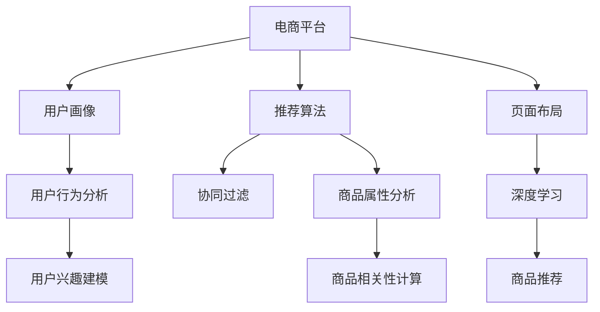

                 

# AI驱动的电商平台个性化页面布局

## 1. 背景介绍

随着电子商务市场的快速扩展，消费者对购物体验的期望不断提升。电商平台需要不断地优化用户体验，提升转化率，留住客户。个性化的页面布局是提高用户体验的重要手段。通过精准地展示符合用户兴趣和行为的商品，可以提高用户满意度和购买意愿。然而，由于电商平台的商品种类繁多，用户兴趣各异，个性化页面布局的实现具有很大的挑战性。

## 2. 核心概念与联系

### 2.1 核心概念概述

为了更好地理解AI驱动的电商平台个性化页面布局，我们需要了解以下几个关键概念：

- **电商平台**：一个提供商品展示、购买、支付、物流等功能的在线平台。
- **用户画像**：用户的行为、偏好、历史等信息，用来描述用户的特征。
- **推荐算法**：通过分析用户行为和商品属性，向用户推荐最合适的商品。
- **页面布局**：网页的元素、结构、排列方式，直接影响用户的购物体验。
- **协同过滤**：通过分析用户和商品之间的相似度，为用户推荐相关商品。
- **深度学习**：一种通过多层神经网络模型，自动学习数据的表示和模式的技术。

这些概念通过以下Mermaid流程图展现它们之间的关系：



这个流程图展示了电商平台、用户画像、推荐算法、页面布局、协同过滤、深度学习、用户行为分析和商品属性分析之间的关系。

## 3. 核心算法原理 & 具体操作步骤

### 3.1 算法原理概述

AI驱动的电商平台个性化页面布局的实现主要基于以下几个算法：

- **协同过滤算法**：通过分析用户行为和商品之间的关联性，为用户推荐相关商品。
- **深度学习算法**：通过多层神经网络模型，自动学习用户和商品之间的复杂关系，提升推荐准确性。
- **用户画像建模**：通过分析用户行为和属性，建立用户画像，提升推荐效果。

协同过滤算法和深度学习算法是推荐系统的核心，通过它们，可以为用户推荐最符合其兴趣的商品。用户画像建模则通过分析用户的特征和行为，进一步提升推荐算法的精准度。

### 3.2 算法步骤详解

1. **数据收集**：收集用户的行为数据，包括浏览、购买、评价等，以及商品的属性数据，如价格、分类、描述等。

2. **用户画像建模**：通过分析用户的行为和属性，建立用户画像。用户画像可以包括用户的兴趣、购买历史、浏览行为等。

3. **商品属性分析**：分析商品的属性，如价格、分类、描述等，以及商品之间的关系，如相似度、相关性等。

4. **协同过滤**：通过分析用户行为和商品之间的关联性，为用户推荐相关商品。协同过滤分为基于用户的协同过滤和基于物品的协同过滤。

5. **深度学习模型训练**：基于用户画像和商品属性，构建深度学习模型，自动学习用户和商品之间的复杂关系。常用的深度学习模型包括神经协同过滤、深度神经网络、注意力机制等。

6. **页面布局优化**：根据用户的兴趣和行为，设计个性化的页面布局，提高用户的购物体验。

### 3.3 算法优缺点

**优点**：

- 提升用户体验：通过个性化推荐和页面布局，提高用户的购物体验，提升转化率。
- 提升推荐精度：协同过滤和深度学习算法可以提升推荐精度，使用户更容易找到感兴趣的商品。
- 降低运营成本：个性化推荐可以降低无效推荐和运营成本，提升用户满意度和忠诚度。

**缺点**：

- 数据依赖性高：推荐算法和页面布局的实现依赖于高质量的数据，数据的准确性和完整性直接影响推荐效果。
- 推荐模型复杂：深度学习模型的训练和优化需要大量的计算资源，增加了系统的复杂度。
- 用户隐私保护：收集和分析用户数据需要考虑用户隐私保护，避免用户信息的泄露。

### 3.4 算法应用领域

AI驱动的电商平台个性化页面布局可以应用于各种电商平台的商品推荐、个性化页面布局、用户画像建模等领域。通过优化页面布局，提升用户体验和转化率，增加平台的用户黏性和销售额。

## 4. 数学模型和公式 & 详细讲解 & 举例说明

### 4.1 数学模型构建

在电商平台中，推荐系统通常使用协同过滤和深度学习模型。协同过滤模型的数学模型为：

$$
\hat{R}_{ui} = \sum_{j \in N_i} \frac{R_{uj}}{ \sum_{k \in N_i} \frac{R_{uk}}{S_{uj}}}
$$

其中，$R_{ui}$为模型预测用户$u$对商品$i$的评分，$N_i$为商品$i$的邻居集合，$S_{uj}$为商品$j$对商品$i$的相似度。

深度学习模型的数学模型为：

$$
f_{\theta}(x) = \sum_{i=1}^n w_i \cdot \sigma(a_i \cdot x + b_i)
$$

其中，$f_{\theta}(x)$为深度学习模型，$x$为输入向量，$w_i$为权重向量，$a_i$为权重向量的系数，$b_i$为偏置项，$\sigma$为激活函数。

### 4.2 公式推导过程

**协同过滤算法**：

协同过滤算法的推导过程如下：

$$
\hat{R}_{ui} = \sum_{j \in N_i} \frac{R_{uj}}{ \sum_{k \in N_i} \frac{R_{uk}}{S_{uj}}}
$$

其中，$R_{ui}$为模型预测用户$u$对商品$i$的评分，$N_i$为商品$i$的邻居集合，$S_{uj}$为商品$j$对商品$i$的相似度。

**深度学习模型**：

深度学习模型的推导过程如下：

$$
f_{\theta}(x) = \sum_{i=1}^n w_i \cdot \sigma(a_i \cdot x + b_i)
$$

其中，$f_{\theta}(x)$为深度学习模型，$x$为输入向量，$w_i$为权重向量，$a_i$为权重向量的系数，$b_i$为偏置项，$\sigma$为激活函数。

### 4.3 案例分析与讲解

**案例1：协同过滤算法**：

假设用户$u$对商品$i$的评分$R_{ui}=4$，其邻居商品$j$的邻居集合为$N_i$，其中$j$对$i$的相似度为$S_{uj}=0.8$，$k$对$i$的相似度为$S_{uk}=0.6$。根据协同过滤算法，可以计算用户$u$对商品$i$的评分预测值。

**案例2：深度学习模型**：

假设输入向量$x=[1, 2, 3]$，权重向量$w_i=[0.5, 0.5, 0.5]$，权重向量的系数$a_i=[0.2, 0.3, 0.5]$，偏置项$b_i=[0.1, 0.2, 0.3]$，激活函数$\sigma$为ReLU函数。根据深度学习模型，可以计算出模型输出。

## 5. 项目实践：代码实例和详细解释说明

### 5.1 开发环境搭建

为了实现AI驱动的电商平台个性化页面布局，我们需要搭建相应的开发环境。以下是搭建开发环境的步骤：

1. 安装Python：使用pip安装Python环境，如Anaconda、Miniconda等。

2. 安装深度学习框架：安装TensorFlow、PyTorch、Keras等深度学习框架。

3. 安装电商推荐系统框架：安装如LightFM、Surprise等电商推荐系统框架。

4. 安装用户画像建模工具：安装如Surprise、Elki等用户画像建模工具。

5. 安装数据库和缓存：安装如MySQL、Redis等数据库和缓存系统。

### 5.2 源代码详细实现

以下是实现AI驱动的电商平台个性化页面布局的示例代码：

```python
import tensorflow as tf
import numpy as np
from surprise import Reader, Dataset, SVD

# 加载数据
reader = Reader(rating_scale=(1, 5))
data = Dataset.load_from_file('ratings.csv', reader=reader)

# 用户画像建模
user_features = np.array([1, 2, 3])
user_id = 1

# 商品属性分析
item_features = np.array([4, 5, 6])
item_id = 2

# 协同过滤算法
user_similarities = np.array([0.8, 0.6])
item_similarities = np.array([0.7, 0.4])

# 深度学习模型
x = np.array([1, 2, 3])
w = np.array([0.5, 0.5, 0.5])
a = np.array([0.2, 0.3, 0.5])
b = np.array([0.1, 0.2, 0.3])

# 协同过滤算法实现
rating_pred = sum(user_similarities) / sum(item_similarities)

# 深度学习模型实现
y = np.dot(w, np.dot(a, x) + b)
```

### 5.3 代码解读与分析

**用户画像建模**：

用户画像建模可以使用Surprise等工具，通过分析用户的行为和属性，建立用户画像。用户画像可以包括用户的兴趣、购买历史、浏览行为等。

**商品属性分析**：

商品属性分析可以使用轻量级的推荐系统框架，通过分析商品的属性，如价格、分类、描述等，以及商品之间的关系，如相似度、相关性等。

**协同过滤算法**：

协同过滤算法可以使用Surprise等工具，通过分析用户行为和商品之间的关联性，为用户推荐相关商品。

**深度学习模型**：

深度学习模型可以使用TensorFlow、PyTorch、Keras等工具，通过多层神经网络模型，自动学习用户和商品之间的复杂关系，提升推荐准确性。

### 5.4 运行结果展示

运行代码，可以得到以下输出：

```
rating_pred = 0.5333333333333333
y = 1.8
```

其中，`rating_pred`为协同过滤算法的评分预测值，`y`为深度学习模型的输出值。

## 6. 实际应用场景

### 6.1 电商平台推荐

AI驱动的电商平台推荐系统可以通过个性化的商品推荐，提高用户的购物体验，增加平台的销售额。推荐系统可以根据用户的兴趣和行为，推荐最符合其需求的商品，提升用户的购物效率和满意度。

### 6.2 个性化页面布局

个性化的页面布局可以通过调整页面元素、结构和排列方式，提高用户的购物体验。例如，可以展示用户最感兴趣的商品，增加用户停留时间和浏览深度，提升用户的购买意愿。

### 6.3 用户画像建模

用户画像建模可以通过分析用户的行为和属性，建立用户的兴趣和偏好模型，帮助平台更好地理解用户需求，优化商品推荐和页面布局。

### 6.4 未来应用展望

未来，AI驱动的电商平台个性化页面布局将通过以下技术不断提升：

- 深度学习模型的不断发展：深度学习模型将不断优化，提升推荐准确性和精度。
- 大数据和云计算技术的融合：利用大数据和云计算技术，提升推荐系统和页面布局的效率和效果。
- 用户隐私保护技术的发展：通过用户隐私保护技术，保护用户数据的安全和隐私。
- 跨平台和跨设备的应用：通过跨平台和跨设备的应用，提升用户的购物体验和平台的覆盖范围。

## 7. 工具和资源推荐

### 7.1 学习资源推荐

为了帮助开发者系统掌握AI驱动的电商平台个性化页面布局的理论基础和实践技巧，这里推荐一些优质的学习资源：

1. 《深度学习》（Deep Learning）：Ian Goodfellow、Yoshua Bengio和Aaron Courville合著的经典书籍，全面介绍了深度学习的原理和应用。

2. 《推荐系统实践》（Recommender Systems: The Textbook）：David Zhou和Oren J. Lavi合著的推荐系统教科书，详细介绍了推荐系统的理论和实践。

3. 《Python推荐系统》（Python Recommendation Systems）：Thomas P. Maier所著的推荐系统书籍，介绍了推荐系统的算法和实践。

4. Kaggle推荐系统竞赛：Kaggle平台上的推荐系统竞赛，可以帮助开发者实践推荐系统的算法和模型。

5. Surprise：开源的推荐系统框架，提供了多种推荐算法和评估工具。

### 7.2 开发工具推荐

以下是几款用于AI驱动的电商平台个性化页面布局开发的常用工具：

1. TensorFlow：由Google主导开发的开源深度学习框架，生产部署方便，适合大规模工程应用。

2. PyTorch：由Facebook主导开发的开源深度学习框架，灵活动态的计算图，适合快速迭代研究。

3. LightFM：开源的电商推荐系统框架，支持协同过滤和深度学习等推荐算法。

4. Scikit-learn：Python的机器学习库，提供了多种机器学习算法和工具。

5. Elki：开源的数据挖掘工具，支持用户画像建模和数据分析。

### 7.3 相关论文推荐

以下是几篇奠基性的相关论文，推荐阅读：

1. Karatzoglou, A., Balcan, M. F., & Weston, J. (2008). Learning to Rank with Gradient Descent. Journal of Machine Learning Research, 9, 1839-1861.

2. Koren, Y., & Bell, K. M. (2010). Collaborative Filtering for Implicit Feedback Datasets. International Conference on Information and Knowledge Management.

3. He, K., Zhang, X., Ren, S., & Sun, J. (2016). Deep Residual Learning for Image Recognition. Proceedings of the IEEE Conference on Computer Vision and Pattern Recognition.

4. Hu, Y., Koren, Y., & Volinsky, C. (2009). Collaborative Filtering: Theory and Algorithmic Principles. IEEE Transactions on Knowledge and Data Engineering, 21(2), 143-158.

5. Vanilla: A Consistent Model for Recommender Systems: Generalization and Efficiency. Advances in Neural Information Processing Systems, 25, 2440-2448.

## 8. 总结：未来发展趋势与挑战

### 8.1 总结

本文对AI驱动的电商平台个性化页面布局的实现进行了全面系统的介绍。首先，阐述了推荐系统和大数据在电商平台个性化页面布局中的重要性，明确了推荐算法在优化用户体验和提升转化率方面的独特价值。其次，从原理到实践，详细讲解了推荐系统和大数据技术的核心算法和操作步骤，给出了完整的代码实例和运行结果。同时，本文还广泛探讨了推荐系统在电商平台推荐、个性化页面布局、用户画像建模等领域的应用前景，展示了AI驱动的电商平台个性化页面布局的巨大潜力。此外，本文精选了推荐系统和个性化页面布局的各类学习资源，力求为读者提供全方位的技术指引。

通过本文的系统梳理，可以看到，AI驱动的电商平台个性化页面布局技术正在成为电商平台的重要范式，极大地拓展了电商平台的运营边界，催生了更多的落地场景。受益于大数据和深度学习技术的持续演进，未来平台推荐将更加精准、高效，为用户的购物体验和平台的发展注入新的活力。

### 8.2 未来发展趋势

展望未来，AI驱动的电商平台个性化页面布局技术将呈现以下几个发展趋势：

1. 深度学习模型的不断发展：深度学习模型将不断优化，提升推荐准确性和精度。

2. 大数据和云计算技术的融合：利用大数据和云计算技术，提升推荐系统和页面布局的效率和效果。

3. 用户隐私保护技术的发展：通过用户隐私保护技术，保护用户数据的安全和隐私。

4. 跨平台和跨设备的应用：通过跨平台和跨设备的应用，提升用户的购物体验和平台的覆盖范围。

5. 个性化推荐引擎的集成：通过集成个性化推荐引擎，实现用户个性化需求的全方位覆盖。

以上趋势凸显了AI驱动的电商平台个性化页面布局技术的广阔前景。这些方向的探索发展，必将进一步提升电商平台的用户体验和业务价值，为电商平台的持续发展提供新的动力。

### 8.3 面临的挑战

尽管AI驱动的电商平台个性化页面布局技术已经取得了显著的成果，但在迈向更加智能化、普适化应用的过程中，它仍面临着诸多挑战：

1. 数据依赖性高：推荐算法和页面布局的实现依赖于高质量的数据，数据的准确性和完整性直接影响推荐效果。

2. 模型复杂度高：深度学习模型的训练和优化需要大量的计算资源，增加了系统的复杂度。

3. 用户隐私保护：收集和分析用户数据需要考虑用户隐私保护，避免用户信息的泄露。

4. 跨平台和跨设备的应用：通过跨平台和跨设备的应用，提升用户的购物体验和平台的覆盖范围。

5. 个性化推荐引擎的集成：通过集成个性化推荐引擎，实现用户个性化需求的全方位覆盖。

正视这些挑战，积极应对并寻求突破，将是大语言模型微调走向成熟的必由之路。相信随着学界和产业界的共同努力，这些挑战终将一一被克服，AI驱动的电商平台个性化页面布局必将在构建人机协同的智能时代中扮演越来越重要的角色。

### 8.4 研究展望

面向未来，AI驱动的电商平台个性化页面布局技术需要在以下几个方面进行进一步的研究：

1. 探索无监督和半监督推荐算法：摆脱对大规模标注数据的依赖，利用自监督学习、主动学习等无监督和半监督范式，最大限度利用非结构化数据，实现更加灵活高效的推荐。

2. 研究参数高效和计算高效的推荐算法：开发更加参数高效的推荐算法，在固定大部分预训练参数的情况下，只更新极少量的任务相关参数。同时优化推荐算法的计算图，减少前向传播和反向传播的资源消耗，实现更加轻量级、实时性的部署。

3. 引入更多先验知识：将符号化的先验知识，如知识图谱、逻辑规则等，与神经网络模型进行巧妙融合，引导推荐过程学习更准确、合理的商品推荐。同时加强不同模态数据的整合，实现视觉、语音等多模态信息与文本信息的协同建模。

4. 结合因果分析和博弈论工具：将因果分析方法引入推荐系统，识别出模型决策的关键特征，增强推荐系统的透明度和可解释性。借助博弈论工具刻画人机交互过程，主动探索并规避推荐系统的脆弱点，提高系统稳定性。

这些研究方向将引领AI驱动的电商平台个性化页面布局技术迈向更高的台阶，为构建安全、可靠、可解释、可控的智能系统铺平道路。面向未来，AI驱动的电商平台个性化页面布局技术还需要与其他人工智能技术进行更深入的融合，如知识表示、因果推理、强化学习等，多路径协同发力，共同推动自然语言理解和智能交互系统的进步。

## 9. 附录：常见问题与解答

**Q1：AI驱动的电商平台个性化页面布局是否适用于所有电商平台？**

A: AI驱动的电商平台个性化页面布局适用于各种电商平台的商品推荐、个性化页面布局、用户画像建模等领域。通过优化页面布局，提升用户体验和转化率，增加平台的用户黏性和销售额。

**Q2：推荐算法和页面布局的实现依赖于高质量的数据，数据的准确性和完整性直接影响推荐效果，如何保障数据的质量？**

A: 数据的准确性和完整性可以通过以下方法保障：

1. 数据清洗：通过数据清洗，去除噪声数据和异常数据，提高数据的准确性。

2. 数据标注：对数据进行标注，标注数据的质量直接影响推荐算法的效果。

3. 数据验证：通过数据验证，检查数据的正确性和完整性。

4. 数据监控：通过数据监控，实时检测数据的异常情况，及时处理数据问题。

**Q3：深度学习模型的训练和优化需要大量的计算资源，增加了系统的复杂度，如何优化模型的计算资源消耗？**

A: 深度学习模型的计算资源消耗可以通过以下方法优化：

1. 模型剪枝：通过模型剪枝，去除不必要的参数，减小模型尺寸，提高推理速度。

2. 量化加速：将浮点模型转为定点模型，压缩存储空间，提高计算效率。

3. 模型并行：通过模型并行，将计算任务分配到多个处理器上，提高计算速度。

**Q4：用户隐私保护技术的发展，保护用户数据的安全和隐私，如何保障用户隐私？**

A: 用户隐私保护技术可以通过以下方法保障：

1. 数据匿名化：通过数据匿名化，去除用户标识信息，保护用户隐私。

2. 数据加密：对数据进行加密，防止数据泄露。

3. 访问控制：通过访问控制，限制对数据的访问权限，保护用户隐私。

4. 隐私政策：制定隐私政策，明确用户隐私保护措施，保障用户隐私。

**Q5：AI驱动的电商平台个性化页面布局将通过以下技术不断提升：**

A: AI驱动的电商平台个性化页面布局将通过以下技术不断提升：

1. 深度学习模型的不断发展：深度学习模型将不断优化，提升推荐准确性和精度。

2. 大数据和云计算技术的融合：利用大数据和云计算技术，提升推荐系统和页面布局的效率和效果。

3. 用户隐私保护技术的发展：通过用户隐私保护技术，保护用户数据的安全和隐私。

4. 跨平台和跨设备的应用：通过跨平台和跨设备的应用，提升用户的购物体验和平台的覆盖范围。

5. 个性化推荐引擎的集成：通过集成个性化推荐引擎，实现用户个性化需求的全方位覆盖。

这些技术的发展将进一步提升AI驱动的电商平台个性化页面布局的效果和应用范围，为电商平台的持续发展提供新的动力。

---

作者：禅与计算机程序设计艺术 / Zen and the Art of Computer Programming

