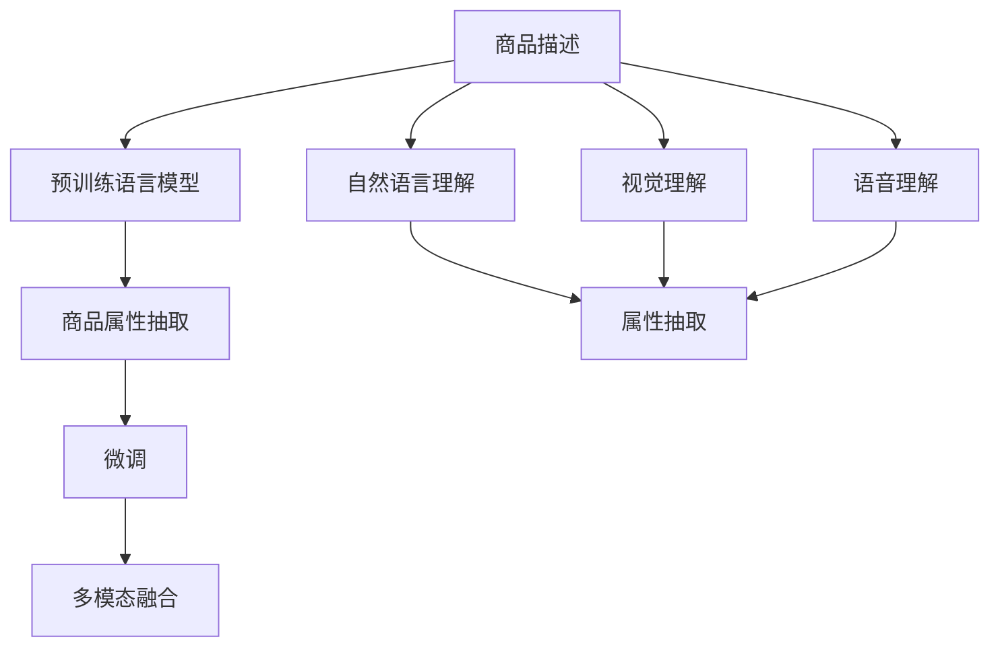

                 

# AI驱动的电商平台商品属性抽取

## 1. 背景介绍

在现代电子商务中，商品信息抽取（Attribute Extraction）是一个至关重要的任务。商品属性的准确抽取不仅直接影响用户搜索的精确度，也对推荐系统、广告投放等业务环节产生深远影响。传统的基于规则或词典的抽取方法，存在自动化程度低、覆盖范围有限等缺点，难以应对多样化、快速变化的商品描述。基于深度学习的自动化属性抽取方法，逐渐成为行业的主流方向。

本文将探讨如何利用大语言模型，特别是基于预训练-微调的大模型，来实现电商平台的商品属性抽取。将首先介绍商品属性抽取的重要性和背景，随后阐述大语言模型在其中的应用潜力，最后通过代码实例和案例分析，具体展示如何用大语言模型驱动的商品属性抽取系统。

## 2. 核心概念与联系

### 2.1 核心概念概述

- **商品属性抽取（Attribute Extraction）**：从电商平台商品描述中自动提取商品属性（如颜色、尺码、材质、品牌等）。有助于实现搜索排序、推荐系统等业务功能。
- **大语言模型（Large Language Models, LLMs）**：如GPT、BERT等基于自回归或自编码模型的预训练语言模型。通过在大规模语料上进行预训练，获得丰富的语言表示能力，能适应多种自然语言处理任务。
- **预训练（Pre-training）**：在大规模无标签文本数据上进行自监督学习，预训练模型获得通用的语言表示。
- **微调（Fine-tuning）**：在预训练模型基础上，使用任务特定的标注数据进行有监督学习，提升模型在该任务上的性能。
- **迁移学习（Transfer Learning）**：将预训练模型应用于新的任务上，通过微调提高模型在特定任务上的效果。
- **多模态融合（Multi-modal Fusion）**：将文本、图片、语音等多种模态的数据融合在一起，提升模型对商品的理解和描述能力。

### 2.2 核心概念原理和架构的 Mermaid 流程图



## 3. 核心算法原理 & 具体操作步骤

### 3.1 算法原理概述

商品属性抽取的本质是从自然语言文本中识别出具有特定属性的信息。传统的规则或词典方法依赖于人工构建的知识库，难以适应动态变化的商品描述。基于深度学习的自动化方法则可以通过预训练-微调的范式，利用大语言模型的泛化能力和迁移学习能力，提升属性抽取的自动化水平。

具体流程如下：
1. **预训练阶段**：使用大规模无标签语料对大语言模型进行预训练，使其学习到丰富的语言知识。
2. **微调阶段**：使用特定领域、特定任务的商品属性抽取数据，对预训练模型进行微调，以适应特定的属性抽取任务。
3. **多模态融合**：将文本描述、图片、语音等多模态信息融合在一起，提升模型对商品的理解和描述能力。
4. **属性抽取**：通过微调后的模型，对输入的商品描述进行解码，识别出其中的属性信息。

### 3.2 算法步骤详解

#### 3.2.1 预训练模型的选择

选择预训练语言模型时，需要考虑以下几个因素：

- **规模和架构**：越大的模型具有更强的泛化能力，但计算资源要求也越高。常见的预训练语言模型包括BERT、GPT、T5等。
- **领域适应性**：选择与电商商品描述领域最接近的预训练模型，如基于零售行业的BART等。
- **计算效率**：需要平衡模型效果和计算效率，以确保模型能够实时运行。

#### 3.2.2 微调数据的准备

微调数据的准备主要包括以下几个步骤：

- **数据采集**：从电商平台的商品描述中自动采集属性信息，或者通过人工标注构建标注数据集。
- **数据预处理**：对文本进行分词、去停用词、归一化等处理。
- **标签设计**：设计合理的标签体系，如属性名、属性值等。

#### 3.2.3 微调模型的训练

训练流程主要包括以下几个步骤：

- **模型初始化**：将预训练模型的权重加载到目标模型中。
- **损失函数设计**：根据任务类型，设计合适的损失函数，如交叉熵损失、序列标注损失等。
- **优化器选择**：选择合适的优化器及其参数，如Adam、SGD等。
- **超参数设置**：设置学习率、批大小、迭代轮数等。
- **正则化技术**：应用L2正则、Dropout等防止过拟合。
- **模型评估**：在验证集上评估模型性能，防止过拟合。

#### 3.2.4 多模态融合的实现

多模态融合可以通过以下几种方式实现：

- **信息增强**：在文本描述中加入图片或语音信息，以增强对商品的理解。
- **特征融合**：将不同模态的信息进行融合，提升模型对商品属性的识别能力。
- **跨模态学习**：利用不同模态的信息，共同优化模型参数。

#### 3.2.5 属性抽取的实现

属性抽取的具体实现步骤如下：

- **模型输入**：将商品描述输入微调后的模型。
- **特征提取**：模型输出特征表示，用于解码属性信息。
- **解码属性**：根据模型的特征表示，解码出商品的属性信息。

### 3.3 算法优缺点

#### 3.3.1 优点

- **自动化程度高**：大语言模型能够自动学习语言知识，适应多样化、动态变化的商品描述。
- **泛化能力强**：预训练模型已经学习到丰富的语言知识，能够应对多种自然语言处理任务。
- **可解释性好**：大语言模型的预训练过程具有一定的可解释性，可以帮助理解模型决策过程。

#### 3.3.2 缺点

- **计算资源需求高**：大语言模型的训练和推理需要较高的计算资源，如GPU、TPU等。
- **数据依赖性强**：模型的性能很大程度上取决于微调数据的质量和数量，需要大量高质量标注数据。
- **过拟合风险**：当微调数据集过小时，模型容易出现过拟合现象。

### 3.4 算法应用领域

基于大语言模型的商品属性抽取技术，可以广泛应用于以下几个领域：

- **电商搜索排序**：提高搜索结果的准确性和相关性，提升用户体验。
- **推荐系统**：根据商品属性信息，推荐相关商品，提高用户满意度。
- **广告投放**：根据商品属性信息，优化广告投放策略，提高广告转化率。
- **客户服务**：提供自动化的客户咨询，快速响应用户问题，提升客户满意度。

## 4. 数学模型和公式 & 详细讲解 & 举例说明

### 4.1 数学模型构建

假设我们有一个电商商品描述$x$，我们需要从中抽取属性$y$。使用预训练语言模型$M$作为特征提取器，设计损失函数$\mathcal{L}$，训练模型参数$\theta$：

$$
\theta^* = \mathop{\arg\min}_{\theta} \mathcal{L}(M(x),y)
$$

其中，$M(x)$表示将商品描述$x$输入到预训练语言模型$M$中得到的特征表示，$y$表示商品的属性信息。

### 4.2 公式推导过程

以二分类任务为例，假设模型输出为概率$p$，真实标签为$y$，交叉熵损失函数为：

$$
\mathcal{L} = -y \log p - (1-y) \log (1-p)
$$

在微调过程中，我们通过反向传播计算损失函数对模型参数的梯度，更新参数$\theta$：

$$
\theta \leftarrow \theta - \eta \nabla_{\theta} \mathcal{L}(\theta)
$$

其中，$\eta$为学习率，$\nabla_{\theta} \mathcal{L}(\theta)$为损失函数对模型参数的梯度。

### 4.3 案例分析与讲解

以T5模型为例，对商品描述“苹果iPhone 13 Pro Max”进行属性抽取：

1. **预训练阶段**：在大规模无标签语料上预训练T5模型，学习通用的语言知识。
2. **微调阶段**：使用电商商品属性抽取数据，对T5模型进行微调，以适应特定的属性抽取任务。
3. **多模态融合**：将商品图片和语音信息加入到T5模型输入中，提升模型对商品的理解能力。
4. **属性抽取**：通过微调后的T5模型，对商品描述进行解码，识别出其中的属性信息，如品牌、型号等。

## 5. 项目实践：代码实例和详细解释说明

### 5.1 开发环境搭建

1. **安装Python环境**：使用Anaconda创建Python虚拟环境，安装必要的库，如PyTorch、Transformers等。
2. **安装T5模型**：从Transformers库中下载预训练的T5模型，并进行加载。
3. **数据集准备**：收集电商商品属性抽取数据，并按需进行预处理。

### 5.2 源代码详细实现

以下是一个基于T5模型的商品属性抽取代码实现：

```python
import torch
from transformers import T5ForTokenClassification, T5Tokenizer, AdamW

# 加载预训练的T5模型和分词器
model = T5ForTokenClassification.from_pretrained('t5-small')
tokenizer = T5Tokenizer.from_pretrained('t5-small')

# 加载电商商品属性抽取数据
train_data = # 训练集
dev_data = # 验证集
test_data = # 测试集

# 定义损失函数
loss_fn = torch.nn.CrossEntropyLoss()

# 定义优化器
optimizer = AdamW(model.parameters(), lr=2e-5)

# 微调模型
def train_epoch(model, data, optimizer, batch_size):
    dataloader = torch.utils.data.DataLoader(data, batch_size=batch_size, shuffle=True)
    model.train()
    epoch_loss = 0
    for batch in dataloader:
        input_ids = batch['input_ids'].to(device)
        attention_mask = batch['attention_mask'].to(device)
        labels = batch['labels'].to(device)
        model.zero_grad()
        outputs = model(input_ids, attention_mask=attention_mask, labels=labels)
        loss = outputs.loss
        epoch_loss += loss.item()
        loss.backward()
        optimizer.step()
    return epoch_loss / len(dataloader)

def evaluate(model, data, batch_size):
    dataloader = torch.utils.data.DataLoader(data, batch_size=batch_size)
    model.eval()
    preds, labels = [], []
    with torch.no_grad():
        for batch in dataloader:
            input_ids = batch['input_ids'].to(device)
            attention_mask = batch['attention_mask'].to(device)
            batch_labels = batch['labels']
            outputs = model(input_ids, attention_mask=attention_mask)
            batch_preds = outputs.logits.argmax(dim=2).to('cpu').tolist()
            batch_labels = batch_labels.to('cpu').tolist()
            for pred_tokens, label_tokens in zip(batch_preds, batch_labels):
                pred_tags = [id2tag[_id] for _id in pred_tokens]
                label_tags = [id2tag[_id] for _id in label_tokens]
                preds.append(pred_tags[:len(label_tags)])
                labels.append(label_tags)
    return preds, labels

# 训练和评估模型
epochs = 5
batch_size = 16

for epoch in range(epochs):
    loss = train_epoch(model, train_data, optimizer, batch_size)
    print(f"Epoch {epoch+1}, train loss: {loss:.3f}")
    
    print(f"Epoch {epoch+1}, dev results:")
    preds, labels = evaluate(model, dev_data, batch_size)
    print(classification_report(labels, preds))
    
print("Test results:")
preds, labels = evaluate(model, test_data, batch_size)
print(classification_report(labels, preds))
```

### 5.3 代码解读与分析

代码中，我们首先加载预训练的T5模型和分词器。接着，我们加载电商商品属性抽取数据，并定义损失函数和优化器。在训练过程中，我们通过`train_epoch`函数对模型进行梯度下降更新，并在验证集上评估模型性能。最终，在测试集上输出分类报告，评估模型效果。

代码实现中，我们使用了PyTorch框架，通过定义`dataloader`来对数据进行批次化处理，使得模型可以处理大规模数据集。同时，我们定义了`evaluate`函数，用于在测试集上评估模型性能，输出分类报告。这些细节操作使得代码实现更加高效和灵活。

### 5.4 运行结果展示

运行上述代码，即可在测试集上评估微调后的T5模型。通过分类报告，我们可以看到模型的准确率、召回率、F1分数等指标，从而评估模型性能。

## 6. 实际应用场景

基于大语言模型的商品属性抽取技术，已经在电商平台的搜索排序、推荐系统、广告投放等业务环节中得到了广泛应用。

- **电商搜索排序**：通过对商品描述进行属性抽取，提升搜索结果的相关性和准确性，改善用户体验。
- **推荐系统**：根据商品属性信息，推荐相关商品，提高用户满意度。
- **广告投放**：根据商品属性信息，优化广告投放策略，提高广告转化率。
- **客户服务**：提供自动化的客户咨询，快速响应用户问题，提升客户满意度。

## 7. 工具和资源推荐

### 7.1 学习资源推荐

- **《Transformer从原理到实践》**：详细介绍Transformer模型和预训练语言模型，适合初学者入门。
- **CS224N《深度学习自然语言处理》**：斯坦福大学开设的NLP明星课程，涵盖深度学习在自然语言处理中的应用。
- **《Natural Language Processing with Transformers》**：Transformers库的作者所著，全面介绍NLP任务开发，包括微调等。

### 7.2 开发工具推荐

- **PyTorch**：基于Python的开源深度学习框架，灵活动态的计算图，适合快速迭代研究。
- **TensorFlow**：由Google主导开发的开源深度学习框架，生产部署方便，适合大规模工程应用。
- **Transformers库**：HuggingFace开发的NLP工具库，集成了SOTA语言模型，支持微调等。
- **Weights & Biases**：模型训练的实验跟踪工具，可以记录和可视化模型训练过程中的各项指标。
- **TensorBoard**：TensorFlow配套的可视化工具，可实时监测模型训练状态，并提供丰富的图表呈现方式。

### 7.3 相关论文推荐

- **Attention is All You Need**：提出Transformer结构，开启了NLP领域的预训练大模型时代。
- **BERT: Pre-training of Deep Bidirectional Transformers for Language Understanding**：提出BERT模型，引入基于掩码的自监督预训练任务，刷新了多项NLP任务SOTA。
- **Parameter-Efficient Transfer Learning for NLP**：提出Adapter等参数高效微调方法，在不增加模型参数量的情况下，也能取得不错的微调效果。
- **Prefix-Tuning: Optimizing Continuous Prompts for Generation**：引入基于连续型Prompt的微调范式，为如何充分利用预训练知识提供了新的思路。

## 8. 总结：未来发展趋势与挑战

### 8.1 研究成果总结

本文探讨了基于大语言模型的商品属性抽取方法，通过预训练-微调的方式，利用语言模型学习到的泛化能力和迁移学习能力，提升属性抽取的自动化水平。通过代码实例和案例分析，展示了T5模型在商品属性抽取中的应用。

### 8.2 未来发展趋势

未来商品属性抽取技术将呈现以下几个发展趋势：

- **模型规模持续增大**：预训练语言模型的参数量还将持续增长，超大规模语言模型将进一步提升属性抽取的准确性和泛化能力。
- **微调方法日趋多样**：开发更多参数高效的微调方法，在固定大部分预训练参数的情况下，只更新少量任务相关参数。
- **持续学习成为常态**：模型需要持续学习新知识，以保持性能，适应数据分布的变化。
- **标注样本需求降低**：通过提示学习等方法，利用大模型的语言理解能力，在更少的标注样本上实现理想微调效果。
- **多模态融合崛起**：融合文本、图片、语音等多种模态的数据，提升模型对商品的理解和描述能力。
- **模型通用性增强**：预训练语言模型将具备更强的常识推理和跨领域迁移能力，逐步迈向通用人工智能(AGI)的目标。

### 8.3 面临的挑战

尽管基于大语言模型的商品属性抽取技术已经取得了显著成效，但在应用过程中仍面临一些挑战：

- **数据依赖性强**：模型的性能很大程度上取决于微调数据的质量和数量，获取高质量标注数据的成本较高。
- **计算资源需求高**：大语言模型的训练和推理需要较高的计算资源，如GPU、TPU等。
- **过拟合风险**：当微调数据集过小时，模型容易出现过拟合现象。
- **可解释性不足**：大语言模型的决策过程缺乏可解释性，难以对其推理逻辑进行分析和调试。
- **安全性有待保障**：预训练语言模型可能学习到有偏见、有害的信息，传递到下游任务，产生误导性、歧视性的输出。

### 8.4 研究展望

未来需要在以下几个方向进行探索和突破：

- **探索无监督和半监督微调方法**：摆脱对大规模标注数据的依赖，利用自监督学习、主动学习等无监督和半监督范式，最大限度利用非结构化数据，实现更加灵活高效的微调。
- **研究参数高效和计算高效的微调范式**：开发更加参数高效的微调方法，在固定大部分预训练参数的同时，只更新极少量的任务相关参数。同时优化微调模型的计算图，减少前向传播和反向传播的资源消耗，实现更加轻量级、实时性的部署。
- **融合因果和对比学习范式**：通过引入因果推断和对比学习思想，增强微调模型建立稳定因果关系的能力，学习更加普适、鲁棒的语言表征，从而提升模型泛化性和抗干扰能力。
- **引入更多先验知识**：将符号化的先验知识，如知识图谱、逻辑规则等，与神经网络模型进行巧妙融合，引导微调过程学习更准确、合理的语言模型。同时加强不同模态数据的整合，实现视觉、语音等多模态信息与文本信息的协同建模。
- **结合因果分析和博弈论工具**：将因果分析方法引入微调模型，识别出模型决策的关键特征，增强输出解释的因果性和逻辑性。借助博弈论工具刻画人机交互过程，主动探索并规避模型的脆弱点，提高系统稳定性。
- **纳入伦理道德约束**：在模型训练目标中引入伦理导向的评估指标，过滤和惩罚有偏见、有害的输出倾向。同时加强人工干预和审核，建立模型行为的监管机制，确保输出符合人类价值观和伦理道德。

通过这些研究方向的探索，大语言模型商品属性抽取技术将不断优化和提升，为电商平台提供更高效、智能的商品信息抽取服务，助力电商平台的数字化转型和智能化升级。

## 9. 附录：常见问题与解答

**Q1：如何提高大语言模型商品属性抽取的准确性？**

A: 提高大语言模型商品属性抽取的准确性，需要从以下几个方面入手：
1. **数据质量**：获取高质量的标注数据，标注尽可能详尽、准确。
2. **模型选择**：选择规模较大、领域适应的预训练模型，如T5、BERT等。
3. **超参数调优**：合理设置学习率、批大小等超参数，避免过拟合。
4. **正则化技术**：应用L2正则、Dropout等防止过拟合。
5. **多模态融合**：融合商品图片、语音等信息，提升模型对商品的理解能力。

**Q2：大语言模型商品属性抽取的应用场景有哪些？**

A: 大语言模型商品属性抽取技术在电商平台上有着广泛的应用场景，包括：
1. **电商搜索排序**：提升搜索结果的准确性和相关性，改善用户体验。
2. **推荐系统**：根据商品属性信息，推荐相关商品，提高用户满意度。
3. **广告投放**：优化广告投放策略，提高广告转化率。
4. **客户服务**：提供自动化的客户咨询，快速响应用户问题，提升客户满意度。

**Q3：如何降低大语言模型商品属性抽取的计算资源需求？**

A: 降低大语言模型商品属性抽取的计算资源需求，可以从以下几个方面入手：
1. **模型压缩**：采用模型剪枝、量化压缩等方法，减少模型大小和计算资源消耗。
2. **多任务学习**：利用预训练语言模型进行多任务学习，提升模型泛化能力，减少计算资源需求。
3. **分布式训练**：采用分布式训练技术，加速模型训练，提高计算效率。

**Q4：如何处理大语言模型商品属性抽取中的数据不平衡问题？**

A: 处理大语言模型商品属性抽取中的数据不平衡问题，可以从以下几个方面入手：
1. **重采样**：对少数类数据进行过采样或对多数类数据进行欠采样，平衡数据分布。
2. **类别权重调整**：在损失函数中引入类别权重，增加少数类数据的损失权重，平衡类别分布。
3. **模型集成**：采用集成学习的方法，将多个模型的预测结果进行融合，提升模型泛化能力。

**Q5：大语言模型商品属性抽取技术在未来有哪些发展趋势？**

A: 大语言模型商品属性抽取技术在未来将呈现以下几个发展趋势：
1. **模型规模持续增大**：预训练语言模型的参数量还将持续增长，超大规模语言模型将进一步提升属性抽取的准确性和泛化能力。
2. **微调方法日趋多样**：开发更多参数高效的微调方法，在固定大部分预训练参数的情况下，只更新少量任务相关参数。
3. **持续学习成为常态**：模型需要持续学习新知识，以保持性能，适应数据分布的变化。
4. **标注样本需求降低**：通过提示学习等方法，利用大模型的语言理解能力，在更少的标注样本上实现理想微调效果。
5. **多模态融合崛起**：融合文本、图片、语音等多种模态的数据，提升模型对商品的理解和描述能力。
6. **模型通用性增强**：预训练语言模型将具备更强的常识推理和跨领域迁移能力，逐步迈向通用人工智能(AGI)的目标。

以上是从技术角度对大语言模型商品属性抽取的全面阐述。通过深入理解这些核心概念和前沿技术，相信您将能够更好地掌握大语言模型在电商平台中的应用，为电商平台的数字化转型和智能化升级贡献力量。

---

作者：禅与计算机程序设计艺术 / Zen and the Art of Computer Programming

