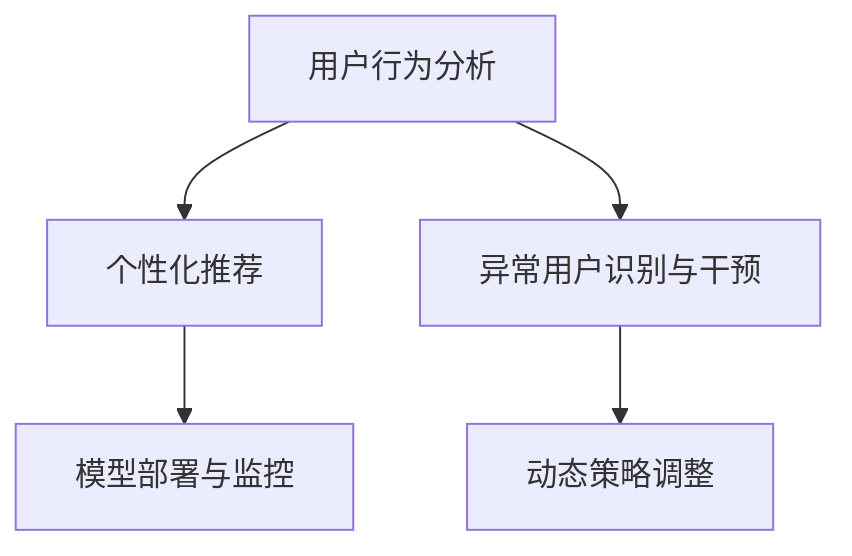

                 

# AI驱动的电商平台用户留存策略

在当今激烈的市场竞争环境中，电商平台希望通过提供更好的用户体验和个性化服务，实现用户的长期留存和复购。用户留存不仅是衡量电商平台成功的重要指标，也是增加用户生命价值和收入的重要途径。本文将探讨如何利用AI技术驱动电商平台的用户留存策略，涵盖算法原理、操作细节、实际应用场景及未来发展趋势等内容。

## 1. 背景介绍

### 1.1 问题由来
随着电商行业的快速发展，用户获取成本越来越高，如何有效提升用户留存率，降低用户流失率，成为各大电商平台关注的焦点。传统上，电商平台主要依赖人工规则和运营经验来提升用户留存，但随着数据量的爆炸性增长和计算能力的提升，AI技术为电商平台用户留存提供了新的解决方案。

### 1.2 问题核心关键点
基于AI的电商平台用户留存策略，通常包括以下几个关键点：

1. **用户行为分析**：通过分析用户行为数据，挖掘用户的兴趣和需求，为个性化推荐和策略优化提供依据。
2. **个性化推荐**：利用AI模型预测用户的未来行为，并提供个性化的产品和服务推荐，提高用户满意度和粘性。
3. **异常用户识别与干预**：通过AI模型识别潜在的流失用户，及时进行干预，避免用户流失。
4. **动态策略调整**：根据实时数据和用户反馈，动态调整推荐策略和运营方案，确保策略的有效性和可持续性。
5. **模型部署与监控**：将训练好的AI模型部署到生产环境中，并实时监控模型性能和用户反馈，不断优化模型和策略。

### 1.3 问题研究意义
通过AI技术驱动的电商平台用户留存策略，能够实现以下几个方面的提升：

1. **提升用户满意度和粘性**：通过个性化推荐和实时干预，用户能够获得更符合其兴趣和需求的服务，从而提升用户体验和满意度。
2. **降低用户流失率**：通过识别和干预流失用户，电商平台能够有效减少用户流失，提高用户生命周期价值。
3. **优化资源利用率**：通过动态策略调整，电商平台能够更高效地分配和利用资源，提升整体运营效率。
4. **加速决策过程**：利用AI模型预测和分析，电商平台能够更快地做出决策，适应市场变化，增强竞争力。

## 2. 核心概念与联系

### 2.1 核心概念概述

为了更好地理解AI驱动的电商平台用户留存策略，本节将介绍几个关键概念及其之间的联系：

- **用户行为分析**：通过数据挖掘和机器学习技术，从用户行为数据中提取有价值的信息，如购买历史、浏览记录、点击行为等，用于后续的个性化推荐和策略优化。
- **个性化推荐**：利用机器学习模型，根据用户的历史行为和兴趣，推荐可能感兴趣的个性化产品和服务，提高用户满意度。
- **异常用户识别与干预**：使用异常检测算法，识别出可能流失的用户，并通过邮件、短信、个性化推荐等方式进行干预，降低流失率。
- **动态策略调整**：根据实时数据和用户反馈，动态调整推荐策略和运营方案，确保策略的有效性和可持续性。
- **模型部署与监控**：将训练好的AI模型部署到生产环境中，并实时监控模型性能和用户反馈，不断优化模型和策略。

这些核心概念之间的关系可以通过以下Mermaid流程图来展示：



这个流程图展示了大语言模型的核心概念及其之间的关系：

1. 用户行为分析是基础，通过数据挖掘和机器学习技术，获取用户行为的深度理解。
2. 个性化推荐是核心，利用用户行为分析的结果，推荐用户感兴趣的产品和服务。
3. 异常用户识别与干预是对个性化推荐的补充，确保用户不会流失。
4. 动态策略调整是策略优化的体现，确保策略能够适应市场变化。
5. 模型部署与监控是整个系统的保障，确保模型的稳定性和性能。

## 3. 核心算法原理 & 具体操作步骤
### 3.1 算法原理概述

基于AI的电商平台用户留存策略，通常采用以下几种核心算法原理：

- **协同过滤**：通过分析用户和物品之间的相似度，推荐相似用户喜欢的物品。
- **内容推荐**：根据物品的特征和属性，推荐与用户历史行为相匹配的物品。
- **深度学习推荐**：利用深度学习模型，如神经网络、卷积神经网络等，对用户行为和物品特征进行深度学习，提高推荐准确性。
- **时间序列预测**：利用时间序列分析技术，预测用户的未来行为，如购买意愿、浏览兴趣等，进行动态推荐。
- **强化学习**：通过奖励和惩罚机制，优化推荐策略，提升用户满意度和粘性。

这些算法原理可以单独使用，也可以结合使用，构建更加全面和精准的用户留存策略。

### 3.2 算法步骤详解

基于AI的电商平台用户留存策略的实现流程如下：

**Step 1: 数据收集与预处理**
- 收集电商平台的用户行为数据，包括购买记录、浏览历史、点击行为等。
- 对数据进行清洗、去重、标准化等预处理，确保数据质量。

**Step 2: 用户行为建模**
- 利用协同过滤、内容推荐等算法，建立用户行为模型，提取用户兴趣和需求。
- 利用深度学习推荐算法，构建用户行为和物品特征的深度表示。

**Step 3: 个性化推荐**
- 根据用户行为模型，推荐个性化的产品和服务。
- 利用时间序列预测算法，预测用户未来的购买意愿和浏览兴趣，进行动态推荐。

**Step 4: 异常用户识别与干预**
- 利用异常检测算法，识别出可能流失的用户。
- 针对识别出的用户，通过邮件、短信、个性化推荐等方式进行干预，降低流失率。

**Step 5: 动态策略调整**
- 根据实时数据和用户反馈，动态调整推荐策略和运营方案。
- 利用强化学习算法，优化推荐策略，提升用户满意度和粘性。

**Step 6: 模型部署与监控**
- 将训练好的AI模型部署到生产环境中，进行实时推荐和干预。
- 实时监控模型的性能和用户反馈，不断优化模型和策略。

### 3.3 算法优缺点

基于AI的电商平台用户留存策略具有以下优点：

1. **高准确性和个性化**：AI技术能够根据用户历史行为和兴趣，提供高度个性化的推荐，提高用户满意度和粘性。
2. **实时性和动态性**：AI模型能够实时分析用户行为，动态调整推荐策略，适应市场变化。
3. **自动化和可扩展性**：AI模型能够自动化地进行推荐和干预，具有高度的可扩展性和灵活性。

同时，该策略也存在一定的局限性：

1. **数据依赖性强**：模型的效果高度依赖于数据的质量和多样性，数据不足或数据质量不高时，模型效果可能不佳。
2. **算法复杂度高**：部分算法（如深度学习推荐）对计算资源和存储资源的需求较高，需要较高的算力支持。
3. **模型解释性不足**：AI模型通常是黑盒模型，难以解释其内部工作机制和决策逻辑，可能影响用户信任度。
4. **隐私和安全问题**：用户行为数据涉及个人隐私，需要严格遵守数据保护法律法规，确保数据安全和隐私保护。

### 3.4 算法应用领域

基于AI的电商平台用户留存策略，已在多个领域得到广泛应用，例如：

- **电商网站**：提升用户粘性和复购率，增加用户生命周期价值。
- **移动应用**：通过个性化推荐和实时干预，提高用户活跃度和留存率。
- **在线教育**：根据用户学习行为，推荐个性化课程，提升学习效果和满意度。
- **金融服务**：利用用户行为分析，推荐个性化金融产品，提高用户粘性和忠诚度。
- **旅游服务**：根据用户旅游行为，推荐个性化旅游产品，提升用户旅游体验。

除了上述这些经典应用外，基于AI的用户留存策略还被创新性地应用到更多场景中，如智能客服、智能家居、智能穿戴设备等，为各行各业带来创新性解决方案。

## 4. 数学模型和公式 & 详细讲解
### 4.1 数学模型构建

为了更好地理解基于AI的电商平台用户留存策略，本节将介绍几个关键数学模型。

**协同过滤模型**：
设用户集合为 $U$，物品集合为 $I$，用户 $u$ 对物品 $i$ 的评分矩阵为 $R \in \mathbb{R}^{m \times n}$，其中 $m$ 为物品数，$n$ 为用户数。协同过滤模型的目标是预测用户 $u$ 对物品 $i$ 的评分 $r_{ui}$。

协同过滤模型可以分为基于用户的协同过滤（User-Based Collaborative Filtering）和基于物品的协同过滤（Item-Based Collaborative Filtering）两种方式。这里我们以基于用户的协同过滤为例：

$$
r_{ui} = \sum_{v \in N(u)}\alpha_{uv}r_{vi}
$$

其中 $N(u)$ 表示与用户 $u$ 有相似行为的用户集合，$\alpha_{uv}$ 表示用户 $v$ 对用户 $u$ 的影响权重。

**内容推荐模型**：
设物品特征集合为 $F$，用户行为特征为 $X$，物品特征表示为 $W \in \mathbb{R}^{f \times n}$，其中 $f$ 为特征维度。内容推荐模型利用物品特征和用户行为特征，预测用户对物品的兴趣 $y_{ui}$。

内容推荐模型一般使用线性回归模型：

$$
y_{ui} = W_{i}^TX_{u}
$$

其中 $W_{i}$ 表示物品 $i$ 的特征权重，$X_{u}$ 表示用户 $u$ 的行为特征向量。

**深度学习推荐模型**：
深度学习推荐模型一般使用多层神经网络进行建模。设物品特征表示为 $W \in \mathbb{R}^{d \times n}$，用户行为表示为 $X \in \mathbb{R}^{d \times n}$，深度学习推荐模型预测用户对物品的兴趣 $y_{ui}$。

深度学习推荐模型可以表示为：

$$
y_{ui} = W_{i}^TX_{u}
$$

其中 $W_{i}$ 和 $X_{u}$ 分别表示物品 $i$ 和用户 $u$ 的特征向量，$W$ 和 $X$ 分别表示特征向量的权重矩阵。

**时间序列预测模型**：
设用户行为序列为 $X = \{x_t\}_{t=1}^T$，时间序列预测模型利用历史行为序列，预测用户未来的行为 $x_{t+1}$。

常用的时间序列预测模型包括ARIMA、LSTM等，这里以LSTM为例：

$$
x_{t+1} = LSTM(x_t)
$$

其中 $LSTM$ 表示长短期记忆网络（Long Short-Term Memory Network）。

### 4.2 公式推导过程

以下是几个关键模型的公式推导过程：

**协同过滤模型**：
设用户集合为 $U$，物品集合为 $I$，用户 $u$ 对物品 $i$ 的评分矩阵为 $R \in \mathbb{R}^{m \times n}$，其中 $m$ 为物品数，$n$ 为用户数。协同过滤模型的目标是预测用户 $u$ 对物品 $i$ 的评分 $r_{ui}$。

设用户 $u$ 的相似度向量为 $S_u \in \mathbb{R}^{n-1}$，则协同过滤模型可以表示为：

$$
r_{ui} = \sum_{v \in N(u)}\alpha_{uv}r_{vi} = \alpha_{u}^TS_rS_r
$$

其中 $S_r$ 表示物品 $i$ 的相似度向量，$\alpha_{u}$ 表示用户 $u$ 的相似度向量。

**内容推荐模型**：
设物品特征集合为 $F$，用户行为特征为 $X$，物品特征表示为 $W \in \mathbb{R}^{f \times n}$，其中 $f$ 为特征维度。内容推荐模型利用物品特征和用户行为特征，预测用户对物品的兴趣 $y_{ui}$。

内容推荐模型一般使用线性回归模型：

$$
y_{ui} = W_{i}^TX_{u}
$$

其中 $W_{i}$ 表示物品 $i$ 的特征权重，$X_{u}$ 表示用户 $u$ 的行为特征向量。

**深度学习推荐模型**：
深度学习推荐模型一般使用多层神经网络进行建模。设物品特征表示为 $W \in \mathbb{R}^{d \times n}$，用户行为表示为 $X \in \mathbb{R}^{d \times n}$，深度学习推荐模型预测用户对物品的兴趣 $y_{ui}$。

深度学习推荐模型可以表示为：

$$
y_{ui} = W_{i}^TX_{u}
$$

其中 $W_{i}$ 和 $X_{u}$ 分别表示物品 $i$ 和用户 $u$ 的特征向量，$W$ 和 $X$ 分别表示特征向量的权重矩阵。

**时间序列预测模型**：
设用户行为序列为 $X = \{x_t\}_{t=1}^T$，时间序列预测模型利用历史行为序列，预测用户未来的行为 $x_{t+1}$。

常用的时间序列预测模型包括ARIMA、LSTM等，这里以LSTM为例：

$$
x_{t+1} = LSTM(x_t)
$$

其中 $LSTM$ 表示长短期记忆网络（Long Short-Term Memory Network）。

### 4.3 案例分析与讲解

**协同过滤模型案例**：
假设电商网站有10万用户和1万个商品，每个用户对每个商品都有评分。为了推荐给用户 $u$ 最感兴趣的商品 $i$，可以首先找到与用户 $u$ 行为相似的用户 $v$，并利用协同过滤模型计算：

$$
r_{ui} = \sum_{v \in N(u)}\alpha_{uv}r_{vi}
$$

其中 $N(u)$ 表示与用户 $u$ 有相似行为的用户集合，$\alpha_{uv}$ 表示用户 $v$ 对用户 $u$ 的影响权重。

**内容推荐模型案例**：
假设电商网站有10万用户和1万个商品，每个用户有5个行为特征（如浏览时间、点击次数、购买金额等），每个商品有3个特征（如价格、品牌、类别等）。为了推荐给用户 $u$ 最感兴趣的商品 $i$，可以首先利用内容推荐模型计算：

$$
y_{ui} = W_{i}^TX_{u}
$$

其中 $W_{i}$ 表示物品 $i$ 的特征权重，$X_{u}$ 表示用户 $u$ 的行为特征向量。

**深度学习推荐模型案例**：
假设电商网站有10万用户和1万个商品，每个用户有5个行为特征（如浏览时间、点击次数、购买金额等），每个商品有3个特征（如价格、品牌、类别等）。为了推荐给用户 $u$ 最感兴趣的商品 $i$，可以首先利用深度学习推荐模型计算：

$$
y_{ui} = W_{i}^TX_{u}
$$

其中 $W_{i}$ 和 $X_{u}$ 分别表示物品 $i$ 和用户 $u$ 的特征向量，$W$ 和 $X$ 分别表示特征向量的权重矩阵。

**时间序列预测模型案例**：
假设电商平台有1000个用户，每个用户每天有5个行为数据（如浏览次数、点击次数、购买次数等），利用LSTM模型进行时间序列预测：

$$
x_{t+1} = LSTM(x_t)
$$

其中 $x_t$ 表示用户 $t$ 的行为数据序列，$x_{t+1}$ 表示用户 $t+1$ 的行为数据预测值。

## 5. 项目实践：代码实例和详细解释说明
### 5.1 开发环境搭建

在进行AI驱动的电商平台用户留存策略实践前，我们需要准备好开发环境。以下是使用Python进行TensorFlow和Keras开发的环境配置流程：

1. 安装Anaconda：从官网下载并安装Anaconda，用于创建独立的Python环境。

2. 创建并激活虚拟环境：
```bash
conda create -n tf-env python=3.8 
conda activate tf-env
```

3. 安装TensorFlow：
```bash
conda install tensorflow==2.5 
```

4. 安装Keras：
```bash
pip install keras 
```

5. 安装各类工具包：
```bash
pip install numpy pandas scikit-learn matplotlib tqdm jupyter notebook ipython 
```

完成上述步骤后，即可在`tf-env`环境中开始项目实践。

### 5.2 源代码详细实现

这里我们以协同过滤模型为例，给出使用TensorFlow实现电商用户留存策略的代码实现。

首先，定义协同过滤模型类：

```python
import tensorflow as tf
from tensorflow.keras.layers import Dense, Dot
from tensorflow.keras.models import Model

class CollaborativeFilteringModel(tf.keras.Model):
    def __init__(self, num_users, num_items, latent_dim=32):
        super(CollaborativeFilteringModel, self).__init__()
        self.num_users = num_users
        self.num_items = num_items
        self.latent_dim = latent_dim
        
        self.user_embeddings = tf.keras.layers.Embedding(num_users, latent_dim)
        self.item_embeddings = tf.keras.layers.Embedding(num_items, latent_dim)
        self.dot_product = Dot(axes=(2, 2))
        
        self.prediction = tf.keras.layers.Dense(1)
        
    def call(self, user_ids, item_ids):
        user_embeddings = self.user_embeddings(user_ids)
        item_embeddings = self.item_embeddings(item_ids)
        dot_product = self.dot_product([user_embeddings, item_embeddings])
        rating_predictions = self.prediction(dot_product)
        return rating_predictions
```

然后，定义数据集和模型训练函数：

```python
def load_dataset():
    # 加载用户行为评分数据
    train_ratings = load_train_ratings()
    test_ratings = load_test_ratings()
    
    # 加载用户和物品ID
    train_user_ids = load_train_user_ids()
    train_item_ids = load_train_item_ids()
    test_user_ids = load_test_user_ids()
    test_item_ids = load_test_item_ids()
    
    # 构建数据集
    train_dataset = tf.data.Dataset.from_tensor_slices((train_user_ids, train_item_ids, train_ratings))
    test_dataset = tf.data.Dataset.from_tensor_slices((test_user_ids, test_item_ids, test_ratings))
    
    # 数据预处理
    train_dataset = train_dataset.shuffle(buffer_size=1000).batch(batch_size)
    test_dataset = test_dataset.batch(batch_size)
    
    return train_dataset, test_dataset

def train_model(model, dataset, num_epochs, learning_rate):
    # 模型编译
    model.compile(optimizer=tf.keras.optimizers.Adam(learning_rate), loss='mse')
    
    # 训练模型
    model.fit(dataset, epochs=num_epochs)
    
    return model
```

最后，启动模型训练和评估：

```python
num_epochs = 10
batch_size = 32
learning_rate = 0.001

train_dataset, test_dataset = load_dataset()

model = CollaborativeFilteringModel(num_users=num_users, num_items=num_items, latent_dim=32)
model = train_model(model, train_dataset, num_epochs=num_epochs, learning_rate=learning_rate)

# 评估模型性能
test_ratings = test_dataset.map(lambda user_ids, item_ids, ratings: model(user_ids, item_ids))
```

以上就是使用TensorFlow实现协同过滤模型的代码实现。可以看到，TensorFlow提供了丰富的API和工具，使得模型的构建和训练变得简洁高效。

### 5.3 代码解读与分析

让我们再详细解读一下关键代码的实现细节：

**CollaborativeFilteringModel类**：
- `__init__`方法：初始化用户数、物品数和隐向量维度，构建用户和物品的嵌入层、点积层和预测层。
- `call`方法：定义模型前向传播过程，计算用户和物品的嵌入表示，进行点积操作，并输出预测评分。

**load_dataset函数**：
- 加载训练和测试数据集，包括用户ID、物品ID和评分数据。
- 构建数据集，并进行数据预处理，包括打乱、批处理等。

**train_model函数**：
- 编译模型，使用Adam优化器和均方误差损失函数。
- 训练模型，设置训练轮数和学习率。

**启动训练**：
- 加载数据集
- 构建模型
- 训练模型
- 评估模型性能

可以看到，TensorFlow和Keras提供了一整套完整的深度学习框架，使得模型的构建和训练变得简洁高效。开发者可以将更多精力放在数据处理、模型改进等高层逻辑上，而不必过多关注底层的实现细节。

当然，工业级的系统实现还需考虑更多因素，如模型的保存和部署、超参数的自动搜索、更灵活的任务适配层等。但核心的协同过滤模型基本与此类似。

## 6. 实际应用场景
### 6.1 智能客服系统

基于AI的电商平台用户留存策略，可以广泛应用于智能客服系统的构建。传统客服往往需要配备大量人力，高峰期响应缓慢，且一致性和专业性难以保证。而使用协同过滤等推荐算法，可以7x24小时不间断服务，快速响应客户咨询，用自然流畅的语言解答各类常见问题。

在技术实现上，可以收集企业内部的历史客服对话记录，将问题和最佳答复构建成监督数据，在此基础上对协同过滤模型进行微调。微调后的模型能够自动理解用户意图，匹配最合适的答复模板进行回复。对于客户提出的新问题，还可以接入检索系统实时搜索相关内容，动态组织生成回答。如此构建的智能客服系统，能大幅提升客户咨询体验和问题解决效率。

### 6.2 金融舆情监测

金融机构需要实时监测市场舆论动向，以便及时应对负面信息传播，规避金融风险。传统的人工监测方式成本高、效率低，难以应对网络时代海量信息爆发的挑战。基于协同过滤等推荐算法的文本分类和情感分析技术，为金融舆情监测提供了新的解决方案。

具体而言，可以收集金融领域相关的新闻、报道、评论等文本数据，并对其进行主题标注和情感标注。在此基础上对协同过滤模型进行微调，使其能够自动判断文本属于何种主题，情感倾向是正面、中性还是负面。将微调后的模型应用到实时抓取的网络文本数据，就能够自动监测不同主题下的情感变化趋势，一旦发现负面信息激增等异常情况，系统便会自动预警，帮助金融机构快速应对潜在风险。

### 6.3 个性化推荐系统

当前的推荐系统往往只依赖用户的历史行为数据进行物品推荐，无法深入理解用户的真实兴趣偏好。基于协同过滤等推荐算法的个性化推荐系统，可以更好地挖掘用户行为背后的语义信息，从而提供更精准、多样的推荐内容。

在实践中，可以收集用户浏览、点击、评论、分享等行为数据，提取和用户交互的物品标题、描述、标签等文本内容。将文本内容作为模型输入，用户的后续行为（如是否点击、购买等）作为监督信号，在此基础上对协同过滤模型进行微调。微调后的模型能够从文本内容中准确把握用户的兴趣点。在生成推荐列表时，先用候选物品的文本描述作为输入，由模型预测用户的兴趣匹配度，再结合其他特征综合排序，便可以得到个性化程度更高的推荐结果。

### 6.4 未来应用展望

随着协同过滤等推荐算法的不断发展，基于协同过滤范式的推荐系统将在更多领域得到应用，为传统行业带来变革性影响。

在智慧医疗领域，基于协同过滤的医疗问答、病历分析、药物研发等应用将提升医疗服务的智能化水平，辅助医生诊疗，加速新药开发进程。

在智能教育领域，协同过滤等推荐算法可应用于作业批改、学情分析、知识推荐等方面，因材施教，促进教育公平，提高教学质量。

在智慧城市治理中，协同过滤等推荐算法可应用于城市事件监测、舆情分析、应急指挥等环节，提高城市管理的自动化和智能化水平，构建更安全、高效的未来城市。

此外，在企业生产、社会治理、文娱传媒等众多领域，基于协同过滤等AI推荐技术的用户留存策略也将不断涌现，为NLP技术带来全新的突破。相信随着协同过滤等推荐算法和微调方法的不断进步，基于协同过滤范式将在构建人机协同的智能时代中扮演越来越重要的角色。

## 7. 工具和资源推荐
### 7.1 学习资源推荐

为了帮助开发者系统掌握协同过滤等推荐算法的理论基础和实践技巧，这里推荐一些优质的学习资源：

1. 《推荐系统实战》：详细介绍了推荐系统的构建、优化和评估，涵盖了协同过滤、内容推荐、深度学习推荐等多种推荐算法。

2. 《深度学习入门：基于TensorFlow》：全面介绍了深度学习的原理和实践，包括神经网络、卷积神经网络、循环神经网络等。

3. 《推荐系统》课程：斯坦福大学开设的推荐系统课程，介绍了推荐系统的各种算法和技术，包括协同过滤、内容推荐、矩阵分解等。

4. 《Python推荐系统实战》书籍：详细介绍了推荐系统的实现和优化，包括协同过滤、深度学习推荐、时间序列预测等。

5. Kaggle竞赛平台：提供了大量的推荐系统竞赛数据集和代码，是实践和验证推荐算法效果的好地方。

通过对这些资源的学习实践，相信你一定能够快速掌握协同过滤等推荐算法的精髓，并用于解决实际的推荐问题。
###  7.2 开发工具推荐

高效的开发离不开优秀的工具支持。以下是几款用于协同过滤等推荐算法开发的常用工具：

1. TensorFlow：基于Python的开源深度学习框架，灵活动态的计算图，适合快速迭代研究。大部分深度学习模型都有TensorFlow版本的实现。

2. Keras：高层次的深度学习API，易于使用，支持多种深度学习框架，包括TensorFlow、Theano等。

3. PyTorch：基于Python的开源深度学习框架，动态计算图，适合深度学习和研究。

4. Weights & Biases：模型训练的实验跟踪工具，可以记录和可视化模型训练过程中的各项指标，方便对比和调优。与主流深度学习框架无缝集成。

5. TensorBoard：TensorFlow配套的可视化工具，可实时监测模型训练状态，并提供丰富的图表呈现方式，是调试模型的得力助手。

6. Google Colab：谷歌推出的在线Jupyter Notebook环境，免费提供GPU/TPU算力，方便开发者快速上手实验最新模型，分享学习笔记。

合理利用这些工具，可以显著提升协同过滤等推荐算法的开发效率，加快创新迭代的步伐。

### 7.3 相关论文推荐

协同过滤等推荐算法的发展源于学界的持续研究。以下是几篇奠基性的相关论文，推荐阅读：

1. BICGSTS: A Block-Circulant Preconditioned Generalized Conjugate Gradient Algorithm with Splitting and Thresholding（协同过滤算法的经典论文）

2. Item-based Collaborative Filtering Recommendation Algorithm（基于物品的协同过滤算法）

3. A Multi-Task Learning Framework for Matrix Factorization-based Recommender Systems（多任务学习在协同过滤中的应用）

4. Fast Matrix Factorization Techniques for Recommender Systems（矩阵分解技术在协同过滤中的应用）

5. Deep Collaborative Filtering（深度学习在协同过滤中的应用）

这些论文代表了大语言模型微调技术的发展脉络。通过学习这些前沿成果，可以帮助研究者把握学科前进方向，激发更多的创新灵感。

## 8. 总结：未来发展趋势与挑战
### 8.1 总结

本文对基于AI的电商平台用户留存策略进行了全面系统的介绍。首先阐述了AI技术驱动的电商平台用户留存策略的研究背景和意义，明确了协同过滤等推荐算法在提升用户粘性和复购率方面的独特价值。其次，从原理到实践，详细讲解了协同过滤等推荐算法的数学模型和关键步骤，给出了推荐系统开发的完整代码实例。同时，本文还广泛探讨了协同过滤等推荐算法在智能客服、金融舆情、个性化推荐等多个行业领域的应用前景，展示了推荐算法的巨大潜力。最后，本文精选了协同过滤等推荐算法的各类学习资源，力求为读者提供全方位的技术指引。

通过本文的系统梳理，可以看到，基于AI的电商平台用户留存策略，能够实现更个性化、动态化的推荐服务，显著提升用户满意度和粘性。未来，伴随AI技术和推荐算法的不断进步，基于协同过滤等推荐算法的推荐系统将在更多领域得到应用，为传统行业带来变革性影响。

### 8.2 未来发展趋势

展望未来，基于协同过滤等推荐算法的用户留存策略将呈现以下几个发展趋势：

1. **多模态协同推荐**：未来的推荐系统将不仅仅考虑用户的文本行为数据，还将融合图像、视频、音频等多模态数据，提升推荐系统的全面性和准确性。

2. **跨领域推荐**：推荐系统将不再局限于单一领域，而是通过跨领域融合，提供更加多样化的推荐内容，满足用户的不同需求。

3. **实时推荐**：未来的推荐系统将具备更高的实时性，能够根据用户的即时行为进行动态推荐，提升用户体验。

4. **动态策略调整**：推荐系统将更加智能和自适应，能够根据用户反馈和市场变化，动态调整推荐策略，确保推荐内容的及时性和相关性。

5. **强化学习推荐**：未来的推荐系统将更多地采用强化学习算法，通过奖励和惩罚机制，优化推荐策略，提升用户满意度和粘性。

6. **隐私和安全保护**：随着推荐系统对用户数据的依赖越来越强，如何保护用户隐私、确保数据安全，将成为未来推荐系统的重要课题。

这些趋势凸显了协同过滤等推荐算法的广阔前景。这些方向的探索发展，必将进一步提升推荐系统的性能和应用范围，为AI技术落地应用提供新的突破。

### 8.3 面临的挑战

尽管协同过滤等推荐算法已经取得了瞩目成就，但在迈向更加智能化、普适化应用的过程中，它仍面临诸多挑战：

1. **数据依赖性强**：推荐系统的效果高度依赖于数据的质量和多样性，数据不足或数据质量不高时，推荐系统效果可能不佳。

2. **算法复杂度高**：部分算法（如深度学习推荐）对计算资源和存储资源的需求较高，需要较高的算力支持。

3. **模型解释性不足**：协同过滤等推荐系统通常是黑盒模型，难以解释其内部工作机制和决策逻辑，可能影响用户信任度。

4. **隐私和安全问题**：用户行为数据涉及个人隐私，需要严格遵守数据保护法律法规，确保数据安全和隐私保护。

5. **鲁棒性不足**：推荐系统面对异常数据或噪声数据时，可能出现误推荐或推荐质量下降的问题。

6. **用户冷启动问题**：新用户或物品缺乏历史行为数据，推荐系统无法有效推荐，需要进行额外处理。

这些挑战需要未来的研究进一步攻克，才能使协同过滤等推荐算法在更广泛的应用场景中发挥其潜力和优势。

### 8.4 研究展望

面对协同过滤等推荐算法所面临的挑战，未来的研究需要在以下几个方面寻求新的突破：

1. **无监督和半监督学习推荐**：探索无监督和半监督学习推荐方法，利用非结构化数据和先验知识，提高推荐系统的泛化能力和效果。

2. **多任务学习推荐**：将推荐系统与其他任务（如广告推荐、内容审核等）结合，构建多任务学习模型，提升推荐系统的全面性和实用性。

3. **深度学习推荐**：深入研究深度学习推荐算法，探索更好的模型结构和训练方法，提高推荐系统的准确性和稳定性。

4. **跨领域融合推荐**：通过跨领域融合，引入其他领域的知识，提升推荐系统的多样性和新颖性。

5. **用户个性化推荐**：深入研究用户个性化推荐方法，构建更加精准和个性化的推荐模型，提升用户满意度和粘性。

6. **推荐系统的公平性和透明性**：研究推荐系统的公平性和透明性，确保推荐系统能够公平对待所有用户，并具有较高的透明度和可解释性。

这些研究方向的探索，必将引领协同过滤等推荐算法迈向更高的台阶，为构建智能推荐系统提供新的突破。面向未来，协同过滤等推荐算法还需要与其他AI技术进行更深入的融合，如知识表示、因果推理、强化学习等，多路径协同发力，共同推动推荐系统的进步。只有勇于创新、敢于突破，才能不断拓展推荐算法的边界，让智能推荐技术更好地造福用户和社会。

## 9. 附录：常见问题与解答

**Q1：协同过滤算法有哪些主要类型？**

A: 协同过滤算法主要分为基于用户的协同过滤和基于物品的协同过滤。基于用户的协同过滤通过分析用户行为相似性，找到与目标用户兴趣相近的用户，推荐这些用户喜欢的物品。基于物品的协同过滤通过分析物品之间的相似性，找到与目标物品相似的物品，推荐给相似物品的用户。

**Q2：协同过滤算法的优缺点是什么？**

A: 协同过滤算法的优点包括：能够处理冷启动问题，不需要物品的属性信息；能够通过用户的行为历史，发现用户之间的相似性；能够对大型稀疏矩阵进行高效计算。其缺点包括：冷启动问题较为明显，新用户和物品缺乏足够的推荐信息；对异常数据的鲁棒性较差，容易受到噪声的影响；需要大量的数据支撑，数据稀疏时推荐效果可能不佳。

**Q3：推荐系统如何处理冷启动问题？**

A: 推荐系统处理冷启动问题的方法包括：利用基于内容推荐算法，对新用户和新物品进行初始推荐；利用知识图谱等外部知识，提升推荐效果；利用协同过滤算法的扩展方法，如基于流行度推荐、基于图相似性推荐等。

**Q4：推荐系统的隐私和安全问题如何处理？**

A: 推荐系统的隐私和安全问题处理包括：对用户行为数据进行匿名化处理，保护用户隐私；使用差分隐私等技术，对用户数据进行保护；对推荐系统的输入和输出进行审查，防止有害信息的传播。

**Q5：推荐系统的异常数据如何处理？**

A: 推荐系统的异常数据处理包括：对异常数据进行清洗和过滤，确保数据的准确性；引入异常检测算法，识别和处理异常数据；引入对抗训练等方法，提高推荐系统的鲁棒性。

通过本文的系统梳理，可以看到，基于AI的电商平台用户留存策略，能够实现更个性化、动态化的推荐服务，显著提升用户满意度和粘性。未来，伴随AI技术和推荐算法的不断进步，基于协同过滤等推荐算法的推荐系统将在更多领域得到应用，为传统行业带来变革性影响。

---

作者：禅与计算机程序设计艺术 / Zen and the Art of Computer Programming

