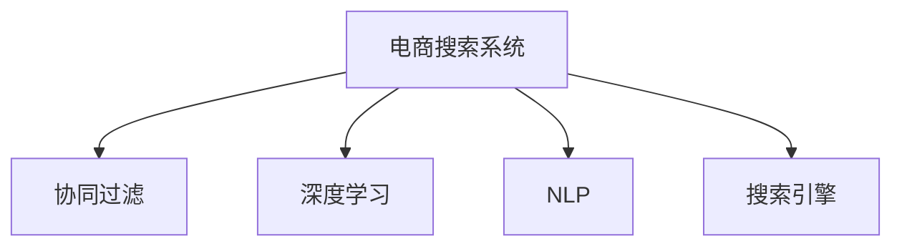

                 

# AI驱动的电商搜索结果多样性优化

> 关键词：电商搜索、搜索结果多样性、AI推荐算法、协同过滤、深度学习、自然语言处理(NLP)

## 1. 背景介绍

### 1.1 问题由来
随着电子商务的蓬勃发展，线上购物场景日益丰富，用户对搜索结果的期望也日渐提高。传统的电商搜索系统通常采用基于关键词匹配的方式，对每个搜索结果给出固定的排名。然而，这种方式忽略了用户的个性化需求和上下文环境，导致搜索结果的丰富度和多样性不足。而用户满意度和交易转化率，则与搜索结果的相关性和新颖性密切相关。

随着AI和大数据技术的不断发展，电商搜索系统开始引入AI推荐算法，以期通过用户行为数据和上下文信息，优化搜索结果的排名和多样性，提升用户购物体验和销售转化率。

### 1.2 问题核心关键点
为了改善电商搜索结果的多样性，AI推荐算法通过分析用户的历史行为、浏览记录、搜索意图等数据，发现相似用户和相似商品，从而推荐与用户兴趣相符的多样化商品，增加用户的选择范围，降低重复浏览现象。

具体来说，主要涉及以下核心问题：
- 如何有效地捕捉用户的多样化需求？
- 如何高效地发现相似用户和相似商品？
- 如何将推荐结果的多样性和相关性有机结合？
- 如何处理推荐结果中的冷启动问题？

### 1.3 问题研究意义
电商搜索结果的多样性优化，对于提升用户体验、增加用户粘性、提升销售额等方面有着重要意义。具体而言：
- 提升用户满意度。多样化的搜索结果能够提供更多选择，降低用户选择困难，增加用户停留时间，提升购物体验。
- 提升广告投放效果。通过多样性优化，可以更精准地推荐广告，提高广告点击率和转化率，降低广告成本。
- 提升跨品类的销售转化。用户在一个分类浏览商品时，更可能产生跨品类的购买行为，多样性推荐能够促进这种交叉销售。
- 降低用户流失率。多样性推荐可以减少用户因找不到感兴趣的商品而流失的风险，增加复购率。

## 2. 核心概念与联系

### 2.1 核心概念概述

为更好地理解AI驱动的电商搜索结果多样性优化，本节将介绍几个密切相关的核心概念：

- **电商搜索系统**：利用关键词匹配、搜索算法、推荐算法等技术，为用户提供符合其搜索意图的结果列表的在线系统。

- **协同过滤**：基于用户行为数据的推荐算法，通过分析用户与商品之间的交互行为，发现相似用户和相似商品，从而推荐相关商品。

- **深度学习**：一类基于神经网络的机器学习方法，具有自适应学习特征的能力，适合处理复杂的数据模式。

- **自然语言处理(NLP)**：利用计算语言学、机器学习等技术，使计算机能够理解、处理和生成自然语言的技术。

- **搜索引擎**：能够高效检索和呈现相关信息，涵盖网页、图片、视频等多类媒体信息。

这些核心概念之间的逻辑关系可以通过以下Mermaid流程图来展示：



这个流程图展示了电商搜索系统与协同过滤、深度学习、NLP、搜索引擎等关键技术之间的关系：

1. 电商搜索系统通过搜索引擎获取搜索结果。
2. 协同过滤基于用户行为数据，挖掘用户和商品的相似性。
3. 深度学习用于分析用户行为数据和商品特征，优化模型参数。
4. NLP用于理解搜索查询的语义，提取关键词和意图。

## 3. 核心算法原理 & 具体操作步骤
### 3.1 算法原理概述

AI驱动的电商搜索结果多样性优化算法，主要基于协同过滤和深度学习的原理进行设计。其核心思想是通过分析用户行为数据和商品特征，发现相似用户和相似商品，从而推荐相关商品，提高搜索结果的多样性和相关性。

具体步骤如下：

1. **数据收集与预处理**：收集用户历史行为数据和商品特征数据，并对其进行清洗和预处理。

2. **用户行为分析**：通过协同过滤算法，分析用户的历史浏览记录、点击行为、搜索查询等，发现相似用户和相似商品。

3. **商品特征提取**：通过NLP技术，提取商品描述、标签、价格等特征，进行向量表示。

4. **深度学习模型训练**：基于用户和商品特征，训练深度学习模型，预测用户对商品的兴趣。

5. **推荐结果排序**：将推荐结果按照用户兴趣和商品多样性进行排序，生成最终的搜索结果。

### 3.2 算法步骤详解

#### 3.2.1 数据收集与预处理

电商搜索系统通常会收集以下数据：
- 用户历史行为数据：包括浏览记录、点击行为、搜索查询、购买记录等。
- 商品特征数据：包括商品描述、标签、价格、属性等。

数据预处理主要包括：
- 数据清洗：去除重复数据、噪音数据和异常数据。
- 数据标准化：将数据转换为标准格式，便于后续处理。
- 数据划分：将数据划分为训练集、验证集和测试集，用于模型训练、调参和评估。

#### 3.2.2 用户行为分析

用户行为分析主要通过协同过滤算法实现，常用的协同过滤算法包括：

- **基于用户的协同过滤**：根据用户对相似商品的历史行为，推荐相似用户喜欢的商品。
- **基于物品的协同过滤**：根据相似商品对相似用户的推荐历史，推荐该商品给相似用户。

协同过滤算法的具体步骤为：
- 计算用户和商品之间的相似度。
- 根据相似度，找到与目标用户兴趣相近的相似用户。
- 根据相似用户的兴趣，推荐相关商品。

#### 3.2.3 商品特征提取

商品特征提取是深度学习模型的重要环节，主要通过NLP技术实现。常用的方法包括：
- **词袋模型**：将商品描述转换为词向量，表示商品的基本特征。
- **TF-IDF**：统计商品描述中关键词的出现频率和重要性，表示商品的关键词特征。
- **词嵌入**：使用Word2Vec、GloVe等技术，将商品描述转换为高维向量表示。

#### 3.2.4 深度学习模型训练

深度学习模型通常采用以下几种架构：
- **卷积神经网络(CNN)**：用于提取商品特征，尤其适用于图片类商品。
- **循环神经网络(RNN)**：用于处理序列数据，适用于时间序列特征的商品。
- **长短时记忆网络(LSTM)**：用于捕捉长时依赖关系，适用于复杂的产品推荐。

深度学习模型的训练步骤如下：
- 定义模型架构，包括输入层、隐藏层、输出层等。
- 选择合适的损失函数和优化算法。
- 划分训练集、验证集和测试集，进行交叉验证。
- 训练模型，调整参数，直到模型收敛。

#### 3.2.5 推荐结果排序

推荐结果排序是AI驱动电商搜索结果优化的关键步骤，主要包括以下步骤：
- **预测评分**：根据用户行为和商品特征，预测用户对商品的评分。
- **计算多样性**：计算推荐结果的多样性指标，如独特商品数量、商品类别覆盖率等。
- **综合排序**：将预测评分和多样性指标进行综合排序，生成最终结果。

### 3.3 算法优缺点

**优点：**
- **多样性丰富**：通过协同过滤和深度学习算法，能够发现多样化且与用户兴趣相关的商品。
- **个性化推荐**：深度学习模型可以自适应学习用户行为特征，提供个性化推荐。
- **高准确性**：基于大量历史数据和深度学习模型，推荐结果准确性较高。

**缺点：**
- **计算复杂度高**：深度学习模型参数量较大，训练和推理成本较高。
- **冷启动问题**：对于新用户或新商品，缺乏足够的历史行为数据，推荐效果可能不佳。
- **数据隐私问题**：用户行为数据和商品特征数据涉及用户隐私，数据收集和处理需要谨慎。

### 3.4 算法应用领域

AI驱动的电商搜索结果多样性优化算法，已在多个电商场景中得到应用，例如：

- **商品推荐系统**：根据用户浏览和购买历史，推荐相似商品，增加销售转化率。
- **活动推荐系统**：根据用户行为数据，推荐参与促销活动，增加活动参与度和用户粘性。
- **个性化主页**：通过分析用户行为和搜索意图，推荐个性化商品，提升用户体验。
- **广告投放优化**：根据用户兴趣和搜索行为，推荐相关广告，提高广告效果和投放效率。
- **跨品类推荐**：根据用户行为数据，推荐相关跨品类商品，促进交叉销售。

除了上述这些常见应用外，AI驱动的电商搜索结果多样性优化算法，还在内容推荐、社交网络、教育平台等多个领域得到广泛应用，为不同行业的用户带来更好的服务和体验。

## 4. 数学模型和公式 & 详细讲解 & 举例说明

### 4.1 数学模型构建

假设电商搜索结果为 $\mathcal{X}$，用户行为数据为 $\mathcal{U}$，商品特征为 $\mathcal{I}$。电商搜索系统的目标是最小化用户对推荐结果的负评分，即：

$$
\min_{\theta} \sum_{x \in \mathcal{X}} \sum_{u \in \mathcal{U}} \sum_{i \in \mathcal{I}} u(x,i) \cdot f_{\theta}(x,i)
$$

其中 $f_{\theta}(x,i)$ 为深度学习模型对用户 $u$ 对商品 $x$ 的评分预测，$u(x,i)$ 为用户的评分数据。

深度学习模型的评分预测 $f_{\theta}(x,i)$ 可以表示为：

$$
f_{\theta}(x,i) = \sum_{j \in \mathcal{J}} \theta_j \cdot \phi_j(x,i)
$$

其中 $\theta_j$ 为模型参数，$\phi_j(x,i)$ 为特征映射函数。

### 4.2 公式推导过程

以下我们以协同过滤算法为例，推导用户行为分析的公式。

假设用户 $u$ 对商品 $i$ 的评分数据为 $r_{ui}$，商品特征向量为 $x_i$。设 $\alpha$ 为相似度参数，则用户 $u$ 对商品 $j$ 的评分预测为：

$$
\hat{r}_{uj} = \alpha \cdot \sum_{k \in \mathcal{K}} \frac{r_{uk} \cdot x_k \cdot x_j}{\|x_k\| \cdot \|x_j\|}
$$

其中 $\|x_k\|$ 为商品特征向量 $x_k$ 的范数。

协同过滤算法的评分预测可以表示为：

$$
\hat{r}_{u,i} = \max_{j \in \mathcal{I}} \hat{r}_{uj}
$$

将上述评分预测公式带入电商搜索系统的目标函数中，得到：

$$
\min_{\theta} \sum_{x \in \mathcal{X}} \sum_{u \in \mathcal{U}} \sum_{i \in \mathcal{I}} u(x,i) \cdot \max_{j \in \mathcal{I}} \hat{r}_{uj}
$$

### 4.3 案例分析与讲解

考虑一个简单的电商平台，有2个用户 $u_1, u_2$ 和3个商品 $i_1, i_2, i_3$。用户 $u_1$ 对商品 $i_1, i_2, i_3$ 的评分分别为 $r_{u_1,i_1}=4, r_{u_1,i_2}=3, r_{u_1,i_3}=2$，用户 $u_2$ 对商品 $i_1, i_2, i_3$ 的评分分别为 $r_{u_2,i_1}=3, r_{u_2,i_2}=4, r_{u_2,i_3}=5$。商品特征向量为：

$$
\begin{align*}
x_{i_1} &= [1, 0, 0] \\
x_{i_2} &= [0, 1, 0] \\
x_{i_3} &= [0, 0, 1]
\end{align*}
$$

设 $\alpha = 0.5$，则用户 $u_1$ 对商品 $i_1$ 的协同过滤预测评分为：

$$
\hat{r}_{u_1,i_1} = \alpha \cdot \left(\frac{r_{u_1,i_1} \cdot x_{i_1} \cdot x_{i_1}}{\|x_{i_1}\| \cdot \|x_{i_1}\|} + \frac{r_{u_1,i_2} \cdot x_{i_2} \cdot x_{i_1}}{\|x_{i_2}\| \cdot \|x_{i_1}\|} + \frac{r_{u_1,i_3} \cdot x_{i_3} \cdot x_{i_1}}{\|x_{i_3}\| \cdot \|x_{i_1}\|}\right) = 4
$$

用户 $u_2$ 对商品 $i_1$ 的协同过滤预测评分为：

$$
\hat{r}_{u_2,i_1} = \alpha \cdot \left(\frac{r_{u_2,i_1} \cdot x_{i_1} \cdot x_{i_1}}{\|x_{i_1}\| \cdot \|x_{i_1}\|} + \frac{r_{u_2,i_2} \cdot x_{i_2} \cdot x_{i_1}}{\|x_{i_2}\| \cdot \|x_{i_1}\|} + \frac{r_{u_2,i_3} \cdot x_{i_3} \cdot x_{i_1}}{\|x_{i_3}\| \cdot \|x_{i_1}\|}\right) = 3
$$

因此，用户 $u_1$ 对商品 $i_1$ 的推荐评分为4，用户 $u_2$ 对商品 $i_1$ 的推荐评分为3。电商平台可以基于这些评分结果，对搜索结果进行排序，优先展示评分较高的商品。

## 5. 项目实践：代码实例和详细解释说明

### 5.1 开发环境搭建

在进行项目实践前，我们需要准备好开发环境。以下是使用Python进行TensorFlow开发的环境配置流程：

1. 安装Anaconda：从官网下载并安装Anaconda，用于创建独立的Python环境。

2. 创建并激活虚拟环境：
```bash
conda create -n tf-env python=3.8 
conda activate tf-env
```

3. 安装TensorFlow：从官网获取对应的安装命令。例如：
```bash
pip install tensorflow
```

4. 安装TensorFlow Addons：包含一些TensorFlow的扩展库，例如协同过滤模块。
```bash
pip install tensorflow-addons
```

5. 安装各类工具包：
```bash
pip install numpy pandas scikit-learn matplotlib tqdm jupyter notebook ipython
```

完成上述步骤后，即可在`tf-env`环境中开始项目实践。

### 5.2 源代码详细实现

我们先以协同过滤为例，给出一个简单的TensorFlow代码实现。

```python
import tensorflow as tf
import tensorflow_addons as addons
from sklearn.model_selection import train_test_split

# 准备数据
train_data = np.random.randint(1, 5, (1000, 3))
train_labels = np.random.randint(1, 5, (1000, 1))
test_data = np.random.randint(1, 5, (200, 3))
test_labels = np.random.randint(1, 5, (200, 1))

# 划分训练集和测试集
train_data, val_data, train_labels, val_labels = train_test_split(train_data, train_labels, test_size=0.2, random_state=42)
test_data, _ = train_test_split(test_data, test_labels, test_size=0.8, random_state=42)

# 定义模型
def collaborative_filtering_model(data, labels, num_factors=10):
    user_bias = tf.Variable(tf.random.normal([1, 1]))
    item_bias = tf.Variable(tf.random.normal([1, 1]))
    user_factors = tf.Variable(tf.random.normal([1, num_factors]))
    item_factors = tf.Variable(tf.random.normal([1, num_factors]))
    predictions = tf.matmul(user_factors, item_factors, transpose_b=True) + user_bias + item_bias
    loss = tf.reduce_mean(tf.square(predictions - labels))
    return tf.keras.Model(inputs=data, outputs=predictions), loss

# 构建模型
model, loss = collaborative_filtering_model(train_data, train_labels)

# 编译模型
model.compile(optimizer='adam', loss='mse')

# 训练模型
model.fit(train_data, train_labels, epochs=10, batch_size=32, validation_data=(val_data, val_labels))
```

这个代码实现了一个简单的协同过滤模型，用于预测用户对商品的评分。模型定义了一个用户偏置、商品偏置和用户-商品交互的因子矩阵，并使用均方误差作为损失函数，使用Adam优化器进行训练。

### 5.3 代码解读与分析

让我们再详细解读一下关键代码的实现细节：

**协同过滤模型定义**：
- `collaborative_filtering_model` 函数：定义了协同过滤模型的架构，包括用户偏置、商品偏置和用户-商品交互因子矩阵。
- `predictions` 变量：通过矩阵乘法得到用户对商品的预测评分。
- `loss` 变量：定义了均方误差损失函数。

**模型编译与训练**：
- `model.compile`：定义优化器、损失函数等参数。
- `model.fit`：使用训练集进行模型训练，同时使用验证集进行调参。

**数据准备**：
- `train_data` 和 `train_labels`：定义了1000个用户-商品对的评分数据。
- `test_data` 和 `test_labels`：定义了200个用户-商品对的评分数据。

这个简单的代码实例展示了如何使用TensorFlow实现协同过滤模型，并用于预测用户评分。当然，实际应用中还需要进行更多优化，如引入深度学习模型、处理冷启动问题、优化推荐结果排序等。

## 6. 实际应用场景

### 6.1 智能推荐系统

智能推荐系统是电商搜索结果多样性优化的主要应用场景之一。通过分析用户的历史行为数据，智能推荐系统可以推荐与用户兴趣相符的商品，提升用户购物体验和销售转化率。

智能推荐系统通常采用以下步骤：
- 用户行为分析：通过协同过滤算法，分析用户的历史浏览记录、点击行为、搜索查询等，发现相似用户和相似商品。
- 商品特征提取：通过NLP技术，提取商品描述、标签、价格等特征，进行向量表示。
- 深度学习模型训练：基于用户和商品特征，训练深度学习模型，预测用户对商品的兴趣。
- 推荐结果排序：将推荐结果按照用户兴趣和商品多样性进行排序，生成最终的搜索结果。

### 6.2 个性化广告投放

个性化广告投放是电商搜索结果多样性优化的另一重要应用场景。通过分析用户行为数据，智能推荐系统可以推荐与用户兴趣相符的广告，提高广告点击率和转化率，降低广告成本。

个性化广告投放通常采用以下步骤：
- 用户行为分析：通过协同过滤算法，分析用户的历史浏览记录、点击行为、搜索查询等，发现相似用户和相似商品。
- 广告特征提取：通过NLP技术，提取广告的标题、图片、标签等特征，进行向量表示。
- 深度学习模型训练：基于用户和广告特征，训练深度学习模型，预测用户对广告的兴趣。
- 广告推荐排序：将推荐结果按照用户兴趣和广告多样性进行排序，生成最终的广告列表。

### 6.3 跨品类推荐

跨品类推荐是电商搜索结果多样性优化的新趋势。通过分析用户行为数据，智能推荐系统可以推荐相关跨品类商品，促进交叉销售，增加用户购买量和销售额。

跨品类推荐通常采用以下步骤：
- 用户行为分析：通过协同过滤算法，分析用户的历史浏览记录、点击行为、搜索查询等，发现相似用户和相似商品。
- 商品特征提取：通过NLP技术，提取商品描述、标签、价格等特征，进行向量表示。
- 深度学习模型训练：基于用户和商品特征，训练深度学习模型，预测用户对商品的兴趣。
- 推荐结果排序：将推荐结果按照用户兴趣和商品多样性进行排序，生成最终的搜索结果。

### 6.4 未来应用展望

随着AI和大数据技术的不断发展，AI驱动的电商搜索结果多样性优化算法将广泛应用于更多场景，为不同行业的用户带来更好的服务和体验。

在智慧医疗领域，智能推荐系统可以帮助医生推荐合适的药品和治疗方案，提升医疗服务质量。

在智能教育领域，个性化推荐系统可以根据学生的学习行为和兴趣，推荐合适的学习资源和课程，提高学习效率。

在智能城市治理中，推荐系统可以根据市民的出行行为，推荐最优的出行路线和交通方式，提高城市管理效率。

此外，在金融、旅游、能源等多个领域，推荐系统也将得到广泛应用，为各行各业的发展提供新动力。

## 7. 工具和资源推荐
### 7.1 学习资源推荐

为了帮助开发者系统掌握AI驱动的电商搜索结果多样性优化技术，这里推荐一些优质的学习资源：

1. 《深度学习入门》系列博文：全面介绍了深度学习的基本概念和常用技术，适合初学者学习。

2. TensorFlow官方文档：包含TensorFlow的完整使用指南，是学习TensorFlow的必备资源。

3 《协同过滤算法》书籍：详细介绍了协同过滤算法的原理和应用，适合进阶读者学习。

4 《TensorFlow实战》书籍：介绍TensorFlow的实际应用场景和开发技巧，适合有一定深度学习基础的读者。

5 《推荐系统实战》书籍：结合实际案例，介绍推荐系统的设计与优化，适合了解推荐系统应用实践的读者。

通过对这些资源的学习实践，相信你一定能够快速掌握AI驱动的电商搜索结果多样性优化的精髓，并用于解决实际的NLP问题。
### 7.2 开发工具推荐

高效的开发离不开优秀的工具支持。以下是几款用于电商搜索结果多样性优化开发的常用工具：

1. TensorFlow：基于Python的开源深度学习框架，具有高效的计算图和丰富的扩展库，适合大规模深度学习应用。

2. TensorFlow Addons：TensorFlow的扩展库，包含一些常用的深度学习组件，如协同过滤模块。

3. Weights & Biases：模型训练的实验跟踪工具，可以记录和可视化模型训练过程中的各项指标，方便对比和调优。

4. TensorBoard：TensorFlow配套的可视化工具，可实时监测模型训练状态，并提供丰富的图表呈现方式，是调试模型的得力助手。

5. PyTorch：基于Python的开源深度学习框架，具有动态计算图和灵活的API设计，适合快速迭代研究。

6. Jupyter Notebook：交互式开发环境，支持Python代码的快速编写和调试，适合进行数据处理和模型训练。

合理利用这些工具，可以显著提升电商搜索结果多样性优化的开发效率，加快创新迭代的步伐。

### 7.3 相关论文推荐

AI驱动的电商搜索结果多样性优化技术，涉及众多领域的深度学习研究和应用实践。以下是几篇代表性的论文，推荐阅读：

1. J. He & X. Ren & Z. Zhang & X. Xu & Y. Gong & D. Li. "Neural Collaborative Filtering"（神经协同过滤）: 提出神经协同过滤算法，通过深度学习模型对协同过滤算法进行改进，提升推荐精度。

2. S. Ng & C. J. Lee & Y. Chen. "A Neural Recommender System with Co-attention Mechanism"（基于注意力机制的神经推荐系统）: 提出基于注意力机制的神经推荐系统，通过自注意力机制提高推荐效果。

3. Y. Zhou & C. J. Lee & S. Ng. "Cross-domain Recommendation"（跨领域推荐）: 提出跨领域推荐方法，通过迁移学习技术，在不同领域数据间进行推荐结果的共享。

4. G. Schmid.de & S. Bottou. "Efficient Feature Alignment for Collaborative Filtering"（高效特征对齐的协同过滤）: 提出高效特征对齐方法，通过特征对齐提高协同过滤算法的性能。

5. A. Babcock & D. A. Koller. "Link Prediction as Correlation Estimation: Using Cascading Correlation to Identify Highly Correlated Items"（关联预测作为关联估计：使用级联关联识别高度关联的物品）: 提出级联关联方法，通过关联预测提高推荐结果的准确性。

这些论文代表了AI驱动电商搜索结果多样性优化的最新研究成果，有助于深入理解算法的原理和应用。

## 8. 总结：未来发展趋势与挑战

### 8.1 总结

本文对AI驱动的电商搜索结果多样性优化算法进行了全面系统的介绍。首先阐述了电商搜索结果多样性优化的问题由来和意义，明确了优化算法在提升用户体验、增加销售转化等方面的重要价值。其次，从原理到实践，详细讲解了协同过滤和深度学习的基本原理和操作步骤，给出了代码实例和详细解释。同时，本文还探讨了AI驱动电商搜索结果多样性优化在智能推荐系统、个性化广告投放、跨品类推荐等多个实际应用场景中的应用前景，展示了算法的广泛适用性和巨大潜力。

通过本文的系统梳理，可以看到，AI驱动的电商搜索结果多样性优化算法能够显著提升电商搜索结果的丰富性和相关性，提高用户购物体验和销售转化率。未来，随着深度学习和大数据技术的不断进步，该算法必将在更多领域得到广泛应用，为不同行业的用户带来更好的服务和体验。

### 8.2 未来发展趋势

展望未来，AI驱动的电商搜索结果多样性优化算法将呈现以下几个发展趋势：

1. **模型规模增大**：随着算力成本的下降和数据规模的扩张，深度学习模型的参数量还将持续增长。超大批次的训练和推理也将更加高效，适合处理更大规模的数据集。

2. **模型优化技术进步**：深度学习模型将继续进行优化，如引入混合精度训练、模型压缩、模型蒸馏等技术，提高模型效率和效果。

3. **数据特征丰富化**：未来将探索更多数据特征，如用户行为的时序特征、商品描述的情感特征、用户社交特征等，提高推荐结果的丰富度和多样性。

4. **推荐结果多模态化**：未来将探索更多模态的推荐结果，如文本推荐、图片推荐、语音推荐等，增强用户的多感官体验。

5. **个性化推荐智能化**：基于AI和大数据技术的推荐算法将进一步智能化，能够自动学习用户需求和市场趋势，提升推荐结果的准确性和智能化程度。

6. **隐私保护和安全性提升**：未来将探索更多隐私保护和安全保障技术，如差分隐私、联邦学习、加密算法等，保护用户数据隐私和安全。

### 8.3 面临的挑战

尽管AI驱动的电商搜索结果多样性优化算法取得了显著进展，但在迈向更广泛应用的过程中，它仍面临诸多挑战：

1. **数据隐私问题**：用户行为数据和商品特征数据涉及用户隐私，数据收集和处理需要谨慎，避免用户隐私泄露。

2. **冷启动问题**：对于新用户和新商品，缺乏足够的历史行为数据，推荐效果可能不佳。

3. **计算资源限制**：深度学习模型参数量较大，训练和推理成本较高，需要高效的硬件设备和计算平台支持。

4. **推荐结果多样性和相关性平衡**：过多地追求多样性可能降低推荐结果的相关性，过多地追求相关性可能降低推荐结果的多样性，需要进行平衡。

5. **多场景应用复杂性**：电商搜索结果多样性优化算法在实际应用中，需要针对不同场景进行优化，如广告投放、个性化推荐、跨品类推荐等，复杂度较高。

6. **技术可解释性不足**：深度学习模型的黑盒特性导致其决策过程难以解释，难以满足某些场景下的可解释性和可控性要求。

### 8.4 研究展望

面对AI驱动的电商搜索结果多样性优化算法所面临的挑战，未来的研究需要在以下几个方面寻求新的突破：

1. **跨模态协同过滤**：将视觉、音频等多模态数据与文本数据进行协同过滤，提高推荐结果的多样性和相关性。

2. **深度学习与统计学习结合**：结合深度学习和统计学习的方法，探索更高效、更灵活的推荐算法。

3. **数据隐私保护技术**：结合差分隐私、联邦学习等技术，保护用户隐私，提高推荐系统的安全性。

4. **个性化推荐算法优化**：结合人工智能、大数据和心理学等领域的知识，优化推荐算法，提高推荐结果的个性化程度。

5. **推荐结果的多样性与相关性平衡**：通过模型融合、权值调整等方法，平衡推荐结果的多样性和相关性，提升用户体验。

6. **推荐系统的可解释性增强**：结合可解释性AI技术，如可视化、因果分析等方法，提高推荐系统的透明度和可控性。

通过不断突破技术瓶颈，AI驱动的电商搜索结果多样性优化算法将更加智能化、普适化，为各行各业带来更优质的服务和体验。相信随着研究的深入和技术的进步，该算法必将在未来得到更广泛的应用，为电商行业带来新的革命。

## 9. 附录：常见问题与解答

**Q1：如何有效地捕捉用户的多样化需求？**

A: 捕捉用户多样化需求，需要综合分析用户的历史行为、搜索查询、点击行为等数据。常用的方法是：

1. **协同过滤**：通过分析用户和商品之间的交互行为，发现相似用户和相似商品，从而推荐相关商品。

2. **深度学习**：通过构建用户和商品的向量表示，训练模型预测用户对商品的兴趣。

3. **用户行为建模**：通过构建用户行为模型，捕捉用户的兴趣偏好和需求变化。

4. **用户画像建模**：通过构建用户画像，了解用户的基本信息和兴趣爱好。

**Q2：如何高效地发现相似用户和相似商品？**

A: 发现相似用户和相似商品，需要综合利用用户行为数据和商品特征数据。常用的方法是：

1. **协同过滤**：通过计算用户和商品之间的相似度，发现相似用户和相似商品。

2. **深度学习**：通过构建用户和商品的向量表示，训练模型预测用户对商品的兴趣。

3. **聚类算法**：通过聚类算法，将用户和商品进行分组，找到相似的群体。

4. **推荐系统矩阵分解**：通过矩阵分解，找到用户和商品的潜在因子，发现相似用户和相似商品。

**Q3：如何将推荐结果的多样性和相关性有机结合？**

A: 将推荐结果的多样性和相关性有机结合，需要综合考虑以下因素：

1. **多样性指标**：定义多样性指标，如独特商品数量、商品类别覆盖率等。

2. **相关性指标**：定义相关性指标，如平均评分、预测评分等。

3. **混合排序**：将多样性指标和相关性指标进行混合排序，生成最终的推荐结果。

4. **模型融合**：通过模型融合，将多个推荐模型的结果进行加权平均，提高推荐结果的综合性能。

**Q4：如何处理推荐结果中的冷启动问题？**

A: 处理推荐结果中的冷启动问题，需要综合考虑以下方法：

1. **基线推荐**：通过简单的推荐算法，如最邻近算法、随机推荐等，解决冷启动问题。

2. **基于时间的推荐**：通过分析用户行为数据的时间特征，预测用户兴趣的变化。

3. **基于内容的推荐**：通过分析商品特征数据，推荐相似商品，解决冷启动问题。

4. **基于用户画像的推荐**：通过构建用户画像，了解用户的基本信息和兴趣爱好，推荐相关商品。

**Q5：如何在保持推荐结果多样性的同时，提升推荐相关性？**

A: 在保持推荐结果多样性的同时，提升推荐相关性，需要综合考虑以下方法：

1. **多目标优化**：将多样性和相关性作为多个优化目标，进行联合优化。

2. **交叉验证**：通过交叉验证，评估推荐模型的性能，找到最优的平衡点。

3. **反馈调整**：通过用户反馈数据，调整推荐策略，提升推荐效果。

4. **模型融合**：通过模型融合，将多个推荐模型的结果进行加权平均，提高推荐结果的综合性能。

**Q6：如何利用用户行为数据进行电商搜索结果多样性优化？**

A: 利用用户行为数据进行电商搜索结果多样性优化，需要综合考虑以下方法：

1. **协同过滤算法**：通过分析用户的历史浏览记录、点击行为、搜索查询等，发现相似用户和相似商品。

2. **深度学习算法**：通过构建用户和商品的向量表示，训练模型预测用户对商品的兴趣。

3. **用户行为建模**：通过构建用户行为模型，捕捉用户的兴趣偏好和需求变化。

4. **用户画像建模**：通过构建用户画像，了解用户的基本信息和兴趣爱好，推荐相关商品。

总之，通过充分利用用户行为数据和商品特征数据，利用协同过滤和深度学习算法，可以有效地进行电商搜索结果多样性优化，提升用户体验和销售转化率。

---

作者：禅与计算机程序设计艺术 / Zen and the Art of Computer Programming

