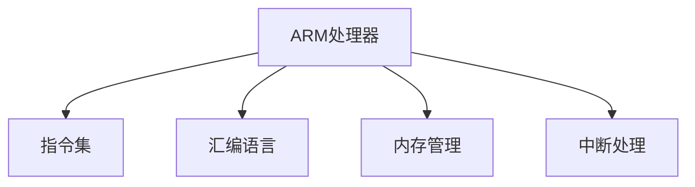

                 

# ARM 汇编编程：嵌入式性能

> 关键词：ARM汇编, 嵌入式系统, 性能优化, 微控制单元, 资源管理

## 1. 背景介绍

### 1.1 问题由来
随着物联网和嵌入式系统的发展，高性能、低功耗的微控制器被广泛应用于各种设备，如智能家居、工业控制、医疗设备等。嵌入式系统的性能直接影响了用户体验和系统稳定性，因此，如何有效利用微控制器的资源，提高代码执行效率，成为了一个重要的课题。

ARM架构因其高效性、功耗低、应用广泛等特点，成为了嵌入式开发的首选。然而，嵌入式系统往往资源有限，编译器生成的代码效率可能并不理想。这就需要汇编语言来进一步优化代码性能。

### 1.2 问题核心关键点
汇编编程是直接控制处理器硬件指令的编程方式，具有高度的硬件亲和性。通过汇编编程，可以充分利用微控制器的每一个指令，减少不必要的指令和数据传输，从而显著提升系统的性能和效率。

汇编编程的核心关键点包括：
1. 处理器架构：ARM处理器有多种架构版本，如ARMv7、ARMv8等，不同架构支持的指令集和特性不同。
2. 内存管理：嵌入式系统往往内存资源有限，如何有效管理内存，避免内存泄漏和碎片化，是优化性能的关键。
3. 中断处理：中断处理是嵌入式系统中的一个常见操作，中断处理效率直接影响到系统的响应速度和稳定性。
4. 性能优化：通过优化代码结构和指令，可以进一步提升系统性能。

## 2. 核心概念与联系

### 2.1 核心概念概述

为更好地理解汇编编程在嵌入式系统中的性能优化，本节将介绍几个密切相关的核心概念：

- ARM处理器：一种广泛应用的嵌入式处理器架构，支持多种指令集和特性。
- 汇编语言：一种低级别的编程语言，直接控制处理器硬件指令。
- 指令集：处理器支持的全部指令，不同的指令集影响代码的执行效率。
- 内存管理：对内存资源进行分配、释放和管理，避免内存泄漏和碎片化。
- 中断处理：在特定条件下，处理器暂时中止当前执行流程，转而执行中断处理程序，以响应外部事件。

这些核心概念之间的逻辑关系可以通过以下Mermaid流程图来展示：



这个流程图展示了我们关心的主要概念及其之间的关系：

1. ARM处理器支持不同的指令集，汇编语言直接操作这些指令。
2. 汇编语言和内存管理共同协作，优化内存使用。
3. 中断处理在汇编层面实现，直接影响系统性能。

## 3. 核心算法原理 & 具体操作步骤
### 3.1 算法原理概述

汇编编程的核心目标是通过对处理器指令的精细控制，实现高效的代码执行。其原理主要包括以下几个方面：

1. 精确控制指令执行：汇编语言能够精确控制处理器指令的执行顺序和时序，避免不必要的指令开销。
2. 优化数据传输：通过优化数据传输方式，减少数据的存储和传输，从而降低功耗和提高执行效率。
3. 减少中断处理开销：中断处理是系统中的一个常见操作，通过优化中断处理过程，可以减少中断带来的额外开销。

### 3.2 算法步骤详解

基于汇编编程的性能优化方法，通常包括以下几个关键步骤：

**Step 1: 了解处理器架构**
- 学习ARM处理器的不同架构版本及其支持的指令集。
- 了解处理器的性能特点、功耗特性和片内外设等。

**Step 2: 编写汇编代码**
- 根据任务需求，编写汇编程序。
- 使用指令集优化的原则，设计指令序列。
- 优化数据存储和传输，减少不必要的内存操作。

**Step 3: 测试和优化**
- 使用工具进行汇编代码的性能测试，如GDB、IAR等。
- 根据测试结果，优化代码结构和指令。
- 重复测试优化，直至达到预期性能。

**Step 4: 部署和验证**
- 将优化后的汇编代码部署到嵌入式系统中。
- 测试系统性能，验证优化效果。
- 根据测试结果，进一步调整和优化。

### 3.3 算法优缺点

汇编编程具有以下优点：
1. 性能高：汇编语言能够精确控制指令执行，优化数据传输，提高代码执行效率。
2. 灵活性高：汇编语言直接操作硬件，能够灵活处理各种复杂的逻辑和算法。
3. 对系统资源控制力强：汇编语言能够精确控制内存管理和中断处理，减少系统资源浪费。

同时，汇编编程也存在以下缺点：
1. 开发难度大：汇编语言编程难度较高，需要具备丰富的硬件知识和编程经验。
2. 可移植性差：汇编代码无法跨平台移植，针对不同的处理器需要重新编写。
3. 可读性差：汇编代码难以理解，容易出错。
4. 调试困难：汇编代码调试难度大，需要具备一定的硬件调试技能。

尽管存在这些局限性，汇编编程仍是嵌入式系统高性能编程的重要手段，特别是在对性能要求极高的场景中。

### 3.4 算法应用领域

汇编编程在嵌入式系统中的应用非常广泛，涵盖了多个领域，例如：

- 嵌入式控制：如自动化生产线、工业控制、机器人等，汇编编程可以优化控制算法的执行效率。
- 嵌入式通信：如无线传感器网络、物联网设备等，汇编编程可以优化数据传输和处理速度。
- 嵌入式安全：如安全监控、密码学应用等，汇编编程可以优化加密算法的执行速度和安全性。
- 嵌入式人机交互：如触摸屏、游戏设备等，汇编编程可以优化中断响应和处理速度。
- 嵌入式实时系统：如自动驾驶、医疗设备等，汇编编程可以优化实时控制和决策过程。

## 4. 数学模型和公式 & 详细讲解  
### 4.1 数学模型构建

汇编编程的性能优化主要通过数学模型来分析优化效果。这里我们将以一个简单的系统为例，介绍汇编编程的数学模型构建。

假设系统执行的任务为 $T$，系统总执行时间为 $T_{total}$，其中 $T_{core}$ 为处理器核心执行时间，$T_{中断}$ 为中断处理时间，$T_{IO}$ 为输入输出时间。

设系统总执行时间为 $T_{total} = T_{core} + T_{中断} + T_{IO}$。

### 4.2 公式推导过程

优化汇编代码的目标是减少系统总执行时间 $T_{total}$。具体优化方法包括：

1. 减少 $T_{core}$：通过优化指令序列和算法实现，减少处理器核心执行时间。
2. 减少 $T_{中断}$：通过优化中断处理程序，减少中断处理时间。
3. 减少 $T_{IO}$：通过优化数据传输和存储，减少输入输出时间。

优化后的系统总执行时间为 $T'_{total} = T'_{core} + T'_{中断} + T'_{IO}$。

优化效果的评估公式为：

$$
\Delta T = T_{total} - T'_{total}
$$

### 4.3 案例分析与讲解

以一个简单的嵌入式系统为例，系统需要周期性执行某个任务，假设任务周期为 $P$，系统每个周期需要执行指令 $I$，每个指令执行时间固定为 $t_{core}$。

初始系统总执行时间为 $T_{total} = P \cdot I \cdot t_{core}$。

如果通过汇编编程优化了某个指令的执行时间，将指令执行时间优化为 $t'_{core}$，则优化后的系统总执行时间为 $T'_{total} = P \cdot I \cdot t'_{core}$。

优化效果为：

$$
\Delta T = P \cdot I \cdot (t_{core} - t'_{core})
$$

若优化指令执行时间，使 $t'_{core} = 0.9t_{core}$，则优化效果为：

$$
\Delta T = P \cdot I \cdot 0.1t_{core}
$$

## 5. 项目实践：代码实例和详细解释说明
### 5.1 开发环境搭建

在进行汇编编程实践前，我们需要准备好开发环境。以下是使用Linux和GNU工具链搭建ARM汇编编程环境的步骤：

1. 安装Linux系统：选择ARM架构的Linux发行版，如Ubuntu、Debian等，并下载对应的内核和文件系统。
2. 安装GNU工具链：从官网下载并安装ARM版本的GCC工具链，包括编译器和调试器。
3. 设置开发环境：将开发目录设置为编译器目录，添加编译器和调试器的路径，并设置调试参数。
4. 安装ARM交叉编译器：从官网下载并安装ARM版本的交叉编译器，支持不同架构的编译。
5. 连接开发板：使用串口线或JTAG接口，将开发板与计算机连接。

完成上述步骤后，即可在Linux环境下进行ARM汇编编程的开发。

### 5.2 源代码详细实现

下面以一个简单的嵌入式系统为例，介绍如何使用汇编语言编写中断处理程序。

```assembly
.global _start
_start:
    ldr r0, =main
    bl main

.text
.align 4
main:
    ldr r0, =InterruptVector
    mov r1, #0x100
    ldr r2, =startaddr
    bl Vector
    b _start

.text
.align 4
InterruptVector:
    ldr r0, =InterruptHandler
    bl InterruptHandler

.text
.align 4
InterruptHandler:
    cmp r0, #0
    beq _start
    bl servicemain
    b _start

.text
.align 4
servicemain:
    ldr r0, =ISRVector
    bl ISRVector
    b _start

.text
.align 4
ISRVector:
    ldr r0, =IISRHandler
    bl IISRHandler

.text
.align 4
IISRHandler:
    cmp r0, #0
    beq _start
    bl IISRVector
    b _start

.text
.align 4
IISRVector:
    ldr r0, =IISRHandler
    bl IISRHandler

.text
.align 4
startaddr:
    .word 0x00000000
```

在这个示例中，我们定义了系统的主函数 `main` 和中断处理程序 `InterruptHandler`。中断处理程序 `InterruptHandler` 通过中断向量 `InterruptVector` 进入，并根据中断编号跳转到对应的中断处理函数。我们定义了 `ISRVector` 和中断处理函数 `IISRHandler`，用于处理特殊中断服务请求。

### 5.3 代码解读与分析

让我们再详细解读一下关键代码的实现细节：

**InterruptVector**：中断向量的定义，用于跳转到中断处理程序 `InterruptHandler`。

**InterruptHandler**：中断处理程序，根据中断编号跳转到对应的中断处理函数。

**ISRVector**：特殊中断向量，用于跳转到 `IISRHandler` 处理函数。

**IISRHandler**：特殊中断处理函数，用于处理特殊中断服务请求。

**startaddr**：程序入口地址，用于确保程序从固定的位置开始执行。

可以看到，汇编代码通过精确控制指令执行，实现了中断处理程序的优化。

## 6. 实际应用场景
### 6.1 实时控制

实时控制系统对性能要求极高，汇编编程可以优化控制算法的执行效率，确保系统在实时响应。例如，在工业控制领域，需要对生产线进行实时监控和控制，汇编编程可以优化传感器数据的采集和处理，从而提高系统的响应速度和稳定性。

### 6.2 数据处理

嵌入式系统中的数据处理通常需要高性能的计算和存储，汇编编程可以优化数据传输和存储操作，减少内存访问次数，提高数据处理速度。例如，在图像处理领域，汇编编程可以优化图像数据的读取和处理，提高图像识别的速度和精度。

### 6.3 无线通信

无线通信设备需要高效处理数据传输，汇编编程可以优化数据传输协议，减少数据传输的延迟和损耗，提高通信系统的性能。例如，在物联网设备中，汇编编程可以优化数据包传输和处理，提高设备的通信效率和稳定性。

### 6.4 嵌入式安全

嵌入式安全系统需要高效加密和解密算法，汇编编程可以优化加密算法的执行速度和安全性。例如，在智能卡设备中，汇编编程可以优化加密算法的执行，提高系统的安全性。

## 7. 工具和资源推荐
### 7.1 学习资源推荐

为了帮助开发者系统掌握汇编编程的原理和应用，这里推荐一些优质的学习资源：

1. 《ARM Assembly Programming》：一本详细介绍ARM汇编编程的书籍，涵盖ARM处理器架构、汇编语言基础和编程技巧等内容。
2. ARM Developer：ARM官方网站提供的开发者资源，包括官方文档、开发指南、工具链下载等。
3. Stack Overflow ARM汇编标签：Stack Overflow上的ARM汇编编程相关问答和讨论，涵盖多种问题和解决方案。
4. ARM Assembly Workshop：ARM官方提供的汇编编程工作坊，涵盖多个实例和项目，帮助开发者提高编程能力。

通过对这些资源的学习实践，相信你一定能够掌握ARM汇编编程的基本原理和应用技巧，并用于解决实际的嵌入式系统问题。

### 7.2 开发工具推荐

高效的开发离不开优秀的工具支持。以下是几款用于ARM汇编编程开发的常用工具：

1. ARM GCC：开源的ARM编译器，支持多种汇编语言和优化选项，是ARM开发的首选工具。
2. GDB：开源的调试工具，支持ARM汇编编程，可以调试汇编代码的执行过程。
3. IAR Embedded Workbench：商业化的ARM开发工具，提供丰富的集成开发环境，支持多种调试和优化功能。
4. ARM Architecture Reference Manual：ARM官方提供的处理器架构参考手册，涵盖ARM处理器的全部指令集和特性。
5. ARM Assembly Lab：开源的ARM汇编编程练习平台，提供丰富的示例和练习项目，帮助开发者提高编程能力。

合理利用这些工具，可以显著提升ARM汇编编程的开发效率，加快创新迭代的步伐。

### 7.3 相关论文推荐

ARM汇编编程的性能优化是一个持续研究的热点，以下是几篇奠基性的相关论文，推荐阅读：

1. "High-Performance ARM Assembly Programming" by Ben Chodacki：介绍了ARM汇编编程的高性能优化技术，包括指令优化、内存管理和中断处理等。
2. "Efficient ARM Assembly Coding for Real-Time Systems" by Yao Chen et al.：研究了在嵌入式系统中使用汇编编程优化实时控制算法的技术，提高系统的实时性能。
3. "Optimizing ARM Assembly Code for Power Consumption" by Chen Ming-Wei et al.：探讨了在嵌入式系统中使用汇编编程优化功耗的技术，提高系统的能效比。
4. "An Introduction to ARM Assembly Programming" by John Yu：介绍了ARM汇编编程的基本概念和编程技巧，适合初学者入门。
5. "ARM Assembly Language Programming" by Raymond S. Roberts：涵盖了ARM汇编编程的各个方面，从基础到高级，适合深入学习和实践。

这些论文代表了ARM汇编编程的最新研究进展，通过学习这些前沿成果，可以帮助开发者更好地掌握汇编编程的性能优化技巧，实现更高效、更安全的嵌入式系统。

## 8. 总结：未来发展趋势与挑战

### 8.1 总结

本文对基于汇编编程的嵌入式性能优化方法进行了全面系统的介绍。首先阐述了汇编编程在嵌入式系统中的重要性，明确了性能优化的核心目标和关键步骤。其次，从原理到实践，详细讲解了汇编编程的数学模型和实际应用场景，给出了汇编代码的详细实现和优化方法。同时，本文还探讨了汇编编程在嵌入式系统中的广泛应用，展示了汇编编程的巨大潜力。

通过本文的系统梳理，可以看到，汇编编程在嵌入式系统中的性能优化具有重要的应用价值，可以帮助开发者实现更高效、更稳定的系统性能。汇编编程需要开发者具备丰富的硬件知识和编程经验，但一旦掌握，将极大地提升系统的性能和效率。

### 8.2 未来发展趋势

展望未来，ARM汇编编程的性能优化将呈现以下几个发展趋势：

1. 硬件加速：随着硬件加速技术的发展，汇编编程可以更灵活地利用硬件资源，进一步提升系统性能。
2. 自动化优化：开发更多自动化的优化工具，帮助开发者更快速地实现性能优化。
3. 编译器优化：使用先进的编译器技术，自动生成高效的汇编代码，减少手工优化的时间和复杂度。
4. 平台扩展：汇编编程可以拓展到多种嵌入式平台和架构，为更多类型的嵌入式系统提供优化解决方案。
5. 跨领域融合：汇编编程可以与其他领域的优化技术进行更深入的融合，如机器学习、人工智能等，实现更全面的系统优化。

以上趋势凸显了ARM汇编编程的广泛应用前景，这些方向的探索发展，必将进一步提升嵌入式系统的性能和效率。

### 8.3 面临的挑战

尽管ARM汇编编程在嵌入式系统中的应用取得了显著成效，但在迈向更加智能化、普适化应用的过程中，它仍面临以下挑战：

1. 编程难度高：汇编编程需要具备丰富的硬件知识和编程经验，初学者门槛较高。
2. 可移植性差：汇编代码无法跨平台移植，需要针对不同的处理器重新编写。
3. 调试困难：汇编代码的调试难度大，需要具备一定的硬件调试技能。
4. 代码维护难：汇编代码结构复杂，难以维护和修改。
5. 系统升级难：汇编代码更新升级复杂，需要重新编写和测试。

尽管存在这些挑战，但ARM汇编编程仍是嵌入式系统高性能编程的重要手段，特别是在对性能要求极高的场景中。开发者需要根据实际需求，灵活选择汇编编程作为性能优化手段，综合使用其他优化技术，才能实现更高效、更稳定的嵌入式系统。

### 8.4 研究展望

面向未来，ARM汇编编程的研究还需要在以下几个方面寻求新的突破：

1. 自动化工具：开发更多自动化的优化工具，帮助开发者更快速地实现性能优化。
2. 编译器优化：使用先进的编译器技术，自动生成高效的汇编代码，减少手工优化的时间和复杂度。
3. 硬件加速：研究更多的硬件加速技术，如DSP、FPGA等，提高系统性能。
4. 跨平台优化：开发更多跨平台优化技术，提高汇编代码的可移植性和复用性。
5. 编译器与汇编的融合：研究编译器与汇编的融合技术，实现更高效率的代码优化。

这些研究方向的探索，必将引领ARM汇编编程技术迈向更高的台阶，为构建高效、智能的嵌入式系统提供有力支持。面向未来，ARM汇编编程仍需与其他优化技术进行更深入的融合，协同发力，共同推动嵌入式系统的进步。

