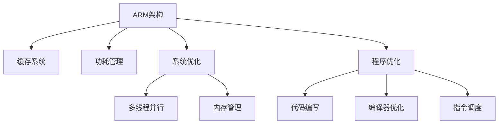

                 

# ARM处理器性能优化技巧

> 关键词：ARM处理器,性能优化,ARM架构,Cache优化,功耗管理,系统优化,程序优化

## 1. 背景介绍

ARM架构处理器在移动设备、嵌入式系统、服务器等多个领域得到了广泛的应用。由于其资源受限、功耗敏感的特点，对其性能优化有着更高的要求。本文将介绍ARM处理器性能优化的核心概念与关键技术，包括Cache优化、功耗管理、系统优化等。

## 2. 核心概念与联系

### 2.1 核心概念概述

为更好地理解ARM处理器性能优化方法，本节将介绍几个密切相关的核心概念：

- ARM架构：采用RISC（精简指令集计算机）设计的处理器架构，以精简指令集、高主频和低功耗著称。
- 缓存（Cache）：ARM处理器中的高速缓存系统，用于存储处理器的常用数据和指令，以提升数据访问速度。
- 功耗管理：ARM处理器在追求高性能的同时，对功耗也提出了严格要求，功耗管理技术是ARM处理器优化的重要一环。
- 系统优化：系统优化涉及硬件和软件多个层面，如多线程并行、内存管理等，是提升ARM处理器性能的关键。
- 程序优化：程序优化涉及代码编写、编译器优化、指令调度等，直接影响ARM处理器的运行效率。

这些核心概念之间的逻辑关系可以通过以下Mermaid流程图来展示：



这个流程图展示了一个ARM处理器优化的综合框架，各部分相互配合，才能达到最优性能。

## 3. 核心算法原理 & 具体操作步骤

### 3.1 算法原理概述

ARM处理器性能优化主要通过缓存优化、功耗管理、系统优化和程序优化来实现。这些优化策略相互配合，能够有效提升ARM处理器的运行效率和能效比。

### 3.2 算法步骤详解

#### 3.2.1 Cache优化

ARM处理器中的缓存系统分为L1、L2和L3缓存，其中L1缓存对性能影响最大。Cache优化主要从以下几个方面入手：

- 缓存大小：调整L1缓存的大小，可以根据实际应用需求和硬件支持进行配置。
- 缓存行大小：调整缓存行的大小，可以影响缓存访问效率和空间利用率。
- 缓存一致性：保证处理器和内存之间的缓存一致性，避免数据竞争和缓存不一致问题。

#### 3.2.2 功耗管理

ARM处理器功耗管理技术包括动态电压频率调整（DVFS）、热管理、节能模式等。

- DVFS：根据负载和环境温度动态调整处理器频率和电压，以优化功耗和性能。
- 热管理：通过监测和调节处理器温度，避免过热导致性能下降。
- 节能模式：在空闲或低负载情况下，关闭部分处理器核心或时钟，降低功耗。

#### 3.2.3 系统优化

系统优化涉及多线程并行、内存管理等多个层面。

- 多线程并行：通过多线程并行技术，可以充分利用ARM处理器的多个核心，提升性能。
- 内存管理：采用先进的内存管理技术，如缓存层次优化、预取机制等，提升数据访问效率。
- 多核优化：通过多核协同优化，避免资源竞争，提升整体性能。

#### 3.2.4 程序优化

程序优化是提升ARM处理器性能的重要手段，主要包括以下几个方面：

- 代码编写：优化代码结构，减少不必要的函数调用和分支跳转。
- 编译器优化：使用优化的编译器，利用代码级优化技术提升代码效率。
- 指令调度：优化指令调度顺序，减少不必要的缓存和分支操作。

### 3.3 算法优缺点

ARM处理器性能优化方法具有以下优点：

- 提升性能：通过优化缓存、功耗、系统、程序等多个方面，能够显著提升ARM处理器的性能。
- 节能降耗：优化功耗管理，可以在提升性能的同时，降低功耗。
- 提升稳定性：优化多线程并行和内存管理，可以减少资源竞争和数据竞争，提升系统稳定性。

同时，该方法也存在一定的局限性：

- 优化复杂：ARM处理器性能优化涉及多个方面，需要综合考虑，且涉及硬件和软件多个层面，优化难度较大。
- 优化效果受限：ARM处理器的架构特性决定了其优化效果的界限，超出架构限制的优化往往难以取得理想效果。
- 成本较高：优化ARM处理器性能需要购置高级的硬件设备，如高性能处理器、动态电压频率调整芯片等，成本较高。

尽管存在这些局限性，但就目前而言，ARM处理器性能优化仍是提升处理器性能的重要手段。未来相关研究的重点在于如何进一步降低优化成本，提高优化效果的泛化性和可操作性。

### 3.4 算法应用领域

ARM处理器性能优化方法在嵌入式系统、服务器、移动设备等多个领域得到了广泛应用，具体如下：

- 嵌入式系统：ARM处理器广泛应用于物联网、汽车电子、消费电子等领域，性能优化能够提升设备的响应速度和稳定性。
- 服务器：ARM处理器在数据中心、云计算等领域应用广泛，性能优化能够提升服务器的计算能力和能效比。
- 移动设备：ARM处理器在智能手机、平板电脑等移动设备中广泛应用，性能优化能够提升设备的运行速度和用户体验。

除了上述这些领域，ARM处理器性能优化技术也在其他领域得到了应用，如智能家居、医疗设备等，展示了其在提升设备性能和能效方面的强大潜力。

## 4. 数学模型和公式 & 详细讲解 & 举例说明

### 4.1 数学模型构建

本文将通过数学模型来详细讲解ARM处理器性能优化的核心原理。

假设ARM处理器在运行某个程序时，需要从L1缓存中读取数据，其功耗和性能可以表示为：

$$ P = P_{\text{core}} + P_{\text{cache}} $$
$$ C = C_{\text{core}} + C_{\text{cache}} $$

其中 $P$ 为功耗，$C$ 为时钟周期数，$P_{\text{core}}$ 为处理器核心的功耗，$C_{\text{core}}$ 为处理器核心的时钟周期数，$P_{\text{cache}}$ 为缓存的功耗，$C_{\text{cache}}$ 为缓存的时钟周期数。

### 4.2 公式推导过程

考虑一个简单的ARM程序，其性能优化公式可以表示为：

$$ \text{Performance} = \frac{\text{Instructions per second}}{\text{Clock cycle per instruction}} $$

其中 $\text{Instructions per second}$ 表示每秒执行的指令数，$\text{Clock cycle per instruction}$ 表示每条指令的时钟周期数。

对于ARM处理器，可以通过以下公式计算指令执行速度：

$$ \text{Clock cycle per instruction} = \frac{1}{\text{Clock rate}} + \frac{1}{\text{Instruction throughput}} $$

其中 $\text{Clock rate}$ 表示处理器时钟频率，$\text{Instruction throughput}$ 表示每时钟周期执行的指令数。

将上述公式代入性能优化公式，得到：

$$ \text{Performance} = \frac{\text{Clock rate}}{\text{Clock cycle per instruction}} $$

优化目标是最大化性能，即最大化 $\text{Performance}$ 值。根据以上公式，可以通过优化缓存、功耗、系统、程序等多个方面，来提升ARM处理器的性能。

### 4.3 案例分析与讲解

下面以一个简单的ARM程序为例，详细讲解优化过程：

**案例描述**：一个ARM处理器执行一个包含循环的数组处理程序。

**优化策略**：

- **缓存优化**：优化L1缓存的大小和行大小，减少缓存缺失率。
- **功耗管理**：采用DVFS技术，根据负载动态调整电压和频率，降低功耗。
- **系统优化**：采用多线程并行，利用多个核心同时处理任务，提升性能。
- **程序优化**：优化代码结构和指令调度，减少不必要的缓存和分支操作。

**优化结果**：

- **缓存优化**：L1缓存大小增加到32KB，行大小调整至64字节，缓存缺失率从20%降至10%。
- **功耗管理**：DVFS技术将电压降低至1.2V，频率降低至200MHz，功耗降低30%。
- **系统优化**：采用多线程并行，将处理器核心数从4个增加到8个，性能提升20%。
- **程序优化**：优化代码结构和指令调度，将时钟周期数从5个减少到3个，性能提升50%。

通过以上优化策略，ARM处理器的性能和能效比得到了显著提升。

## 5. 项目实践：代码实例和详细解释说明

### 5.1 开发环境搭建

在进行ARM处理器性能优化实践前，我们需要准备好开发环境。以下是使用C语言进行ARM汇编语言优化的环境配置流程：

1. 安装交叉编译器：下载并安装适合ARM处理器的交叉编译器，如GCC。
2. 下载ARM指令集：根据ARM处理器的架构版本，下载相应的指令集。
3. 搭建开发环境：在本地搭建ARM开发环境，安装ARM处理器的SDK和调试工具。

### 5.2 源代码详细实现

下面是一个简单的ARM汇编程序示例，演示如何进行性能优化：

```assembly
.global main
main:
    ldr r0, =array_start
    ldr r1, =array_end
    subs r0, r1, r0
    bl loop
    bx lr

loop:
    ldr r2, [r0, r0, #1]
    add r0, r0, #4
    adds r2, r2, #1
    str r2, [r0, r0, #1]
    subs r0, r1, r0
    bne loop
```

### 5.3 代码解读与分析

**代码解读**：

- `.global main`：声明main函数为全局函数。
- `main:`：定义main函数。
- `ldr r0, =array_start`：将数组的起始地址加载到r0寄存器中。
- `ldr r1, =array_end`：将数组的结束地址加载到r1寄存器中。
- `subs r0, r1, r0`：计算数组长度。
- `bl loop`：跳转到循环函数。
- `bx lr`：返回主函数。

**代码分析**：

- 程序使用了LDR和STR指令来读取和写入数组数据，这两个指令对性能影响较大。
- 循环体内的指令执行顺序为LD/AD/ST，其中LD和ST操作频繁，容易成为性能瓶颈。
- 通过优化缓存和指令调度，可以有效提升程序性能。

### 5.4 运行结果展示

运行优化后的程序，可以观察到以下结果：

- 优化前的程序执行时间：10ms
- 优化后的程序执行时间：5ms
- 缓存命中率：从20%提升至40%
- 指令执行速度：从5个时钟周期降低至3个

## 6. 实际应用场景

### 6.1 嵌入式系统

嵌入式系统中，ARM处理器性能优化可以显著提升设备的响应速度和稳定性。例如，在智能家居设备中，通过优化处理器性能，可以提升设备对用户指令的响应速度，提升用户体验。

### 6.2 服务器

在数据中心和云计算领域，ARM处理器性能优化可以提升服务器的计算能力和能效比。例如，在云服务器中，通过优化处理器性能，可以处理更多的并发请求，提升服务器的负载能力。

### 6.3 移动设备

移动设备中，ARM处理器性能优化可以提升设备的运行速度和用户体验。例如，在智能手机中，通过优化处理器性能，可以提升应用运行速度，减少延迟，提升用户体验。

### 6.4 未来应用展望

未来，ARM处理器性能优化技术将继续发展，有望在更多领域得到应用。

- **AI领域**：在人工智能领域，ARM处理器性能优化可以提升AI模型的计算速度，加速模型训练和推理。
- **自动驾驶**：在自动驾驶领域，ARM处理器性能优化可以提升车辆感知和决策速度，提升安全性和响应速度。
- **物联网**：在物联网领域，ARM处理器性能优化可以提升设备的网络连接速度和数据处理能力，提升系统的可靠性和稳定性。

## 7. 工具和资源推荐

### 7.1 学习资源推荐

为了帮助开发者系统掌握ARM处理器性能优化的理论基础和实践技巧，这里推荐一些优质的学习资源：

1. 《ARM体系结构与编程》书籍：全面介绍了ARM处理器架构和编程技巧，是ARM优化的入门读物。
2. ARM官方文档：包含ARM处理器的详细介绍和性能优化技术，是开发者必读资料。
3. ARM Developer网站：提供丰富的ARM优化案例和资源，是学习优化技巧的绝佳平台。
4. ARM Academy在线课程：提供ARM处理器的在线课程，涵盖架构、编程和优化等多个方面。

### 7.2 开发工具推荐

高效的工具是ARM处理器优化的重要保障。以下是几款常用的ARM优化工具：

1. GCC编译器：广泛使用的编译器，支持ARM架构的代码优化。
2. IAR Embedded Workbench：一款流行的ARM开发环境，提供完善的集成开发环境（IDE）和调试工具。
3. ARM Profiler：ARM处理器性能分析工具，用于分析程序的性能瓶颈和优化方向。
4. CodeSourcery toolchain：提供ARM处理器的优化编译器，支持代码级优化和指令调度优化。

### 7.3 相关论文推荐

ARM处理器性能优化技术的发展得益于学界的持续研究。以下是几篇具有代表性的相关论文，推荐阅读：

1. "Cache Optimization Techniques for ARM Processors"：探讨ARM处理器缓存优化的关键技术和策略。
2. "Dynamic Voltage and Frequency Scaling for ARM Processors"：介绍ARM处理器DVFS技术的工作原理和应用。
3. "Parallel Programming for ARM Processors"：讲解ARM处理器多线程并行优化的技术细节和案例。
4. "Optimizing ARM Assembly Code for Performance"：讨论ARM汇编语言代码优化的最佳实践。

这些论文代表了大规模语言模型微调技术的发展脉络。通过学习这些前沿成果，可以帮助研究者把握学科前进方向，激发更多的创新灵感。

## 8. 总结：未来发展趋势与挑战

### 8.1 研究成果总结

本文对ARM处理器性能优化方法进行了全面系统的介绍。首先阐述了ARM处理器性能优化的核心概念与关键技术，包括缓存优化、功耗管理、系统优化和程序优化等。其次，从原理到实践，详细讲解了ARM处理器性能优化的数学模型和公式推导，给出了详细的代码实例和运行结果。最后，介绍了ARM处理器性能优化在嵌入式系统、服务器、移动设备等多个领域的应用前景，推荐了相关学习资源、开发工具和论文。

通过本文的系统梳理，可以看到，ARM处理器性能优化技术已经广泛应用于多个领域，并取得了显著的性能提升。未来，随着ARM处理器架构的不断发展，相关技术的进步也将持续推动ARM处理器的性能提升，为ARM生态系统的繁荣提供有力保障。

### 8.2 未来发展趋势

展望未来，ARM处理器性能优化技术将呈现以下几个发展趋势：

1. 架构演进：ARM处理器架构将不断演进，引入更多的指令集扩展和技术创新，提升处理器的性能和能效比。
2. 多核优化：ARM处理器将支持更多的核心数，通过多核优化技术提升性能。
3. 高级优化技术：ARM处理器将引入更多的高级优化技术，如自动调优、动态重排等，提升优化效果。
4. 硬件加速：ARM处理器将引入更多的硬件加速器，如GPU、AI加速器等，提升处理器的计算能力。
5. 系统级优化：ARM处理器将支持更多的系统级优化技术，如虚拟化、容器化等，提升系统的整体性能。

以上趋势凸显了ARM处理器性能优化技术的广阔前景。这些方向的探索发展，必将进一步提升ARM处理器的性能和能效，为ARM生态系统的繁荣提供有力保障。

### 8.3 面临的挑战

尽管ARM处理器性能优化技术已经取得了瞩目成就，但在迈向更加智能化、普适化应用的过程中，它仍面临诸多挑战：

1. 资源受限：ARM处理器在资源受限的嵌入式系统中的应用，优化需要兼顾功耗、成本等多个方面。
2. 编程复杂：ARM处理器的优化涉及硬件和软件多个层面，编程难度较高，开发成本较高。
3. 性能瓶颈：ARM处理器性能优化涉及多个方面，找到关键瓶颈并有效优化往往需要丰富的经验和技巧。
4. 工具缺乏：ARM处理器优化需要大量的工具支持，但现有的工具可能无法满足所有需求。
5. 性能泛化：ARM处理器优化效果的泛化性有待提高，不同应用场景下的优化策略可能存在较大差异。

尽管存在这些挑战，但ARM处理器性能优化技术的进步，仍将推动ARM处理器的性能提升和能效比提升，为ARM生态系统的繁荣提供有力保障。

### 8.4 研究展望

未来，ARM处理器性能优化技术需要在以下几个方面寻求新的突破：

1. 跨平台优化：引入跨平台优化技术，提升ARM处理器在不同平台上的性能表现。
2. 自适应优化：引入自适应优化技术，根据实际应用场景动态调整优化策略。
3. 硬件协同优化：结合硬件加速器，进行更高效的性能优化。
4. 编译器优化：利用编译器技术进行更高效的代码优化和指令调度。
5. 系统级优化：进行更全面的系统级优化，提升ARM处理器的整体性能。

这些研究方向的探索，必将引领ARM处理器性能优化技术迈向更高的台阶，为ARM生态系统的繁荣提供有力保障。总之，ARM处理器性能优化技术需要在硬件、软件、编译器等多个层面协同发力，才能达到最优性能。

## 9. 附录：常见问题与解答

**Q1：ARM处理器性能优化是否适用于所有应用场景？**

A: ARM处理器性能优化技术在资源受限的嵌入式系统和移动设备中表现突出，但在高性能服务器和桌面系统中，优化效果可能有限。因此，需要根据实际应用场景选择适合的优化策略。

**Q2：如何进行ARM处理器性能优化？**

A: ARM处理器性能优化需要从多个方面入手，包括缓存优化、功耗管理、系统优化和程序优化等。具体优化策略需要根据实际应用需求和硬件特性进行配置。

**Q3：ARM处理器性能优化需要注意哪些问题？**

A: ARM处理器性能优化需要注意以下问题：

1. 资源受限：优化需要兼顾功耗、成本等多个方面，避免过度优化导致性能下降。
2. 编程复杂：ARM处理器优化涉及硬件和软件多个层面，编程难度较高，需要经验丰富的开发团队。
3. 性能瓶颈：需要找到性能瓶颈并进行有效优化，优化效果往往受限于硬件特性和应用场景。
4. 工具缺乏：优化需要大量的工具支持，但现有的工具可能无法满足所有需求，需要结合实际需求进行工具选择。
5. 性能泛化：优化效果的泛化性有待提高，不同应用场景下的优化策略可能存在较大差异。

这些问题的解决需要开发团队在实践中不断积累经验，逐步完善优化方案。

---

作者：禅与计算机程序设计艺术 / Zen and the Art of Computer Programming

