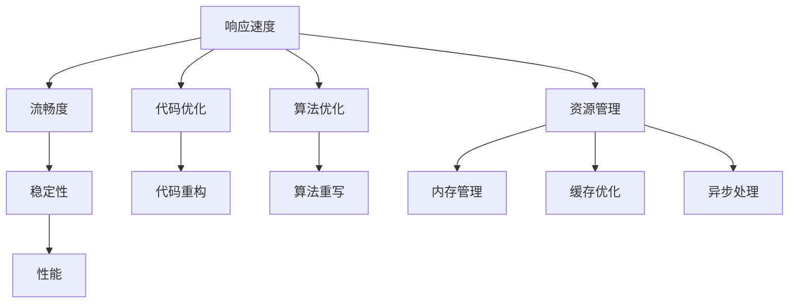

                 

# Android应用性能优化

## 1. 背景介绍

移动设备的普及使得Android应用成为越来越多人日常生活中的重要组成部分。然而，与传统PC或服务器端应用不同，Android应用的运行环境复杂多样，受限于硬件性能和操作系统特性，性能问题尤其难以解决。为了提升用户的使用体验，Android开发者必须深刻理解性能优化的原则和技巧，才能构建出流畅、稳定、高效的应用。本文将从基础概念、算法原理到实际案例，全面解读Android应用性能优化的核心内容。

## 2. 核心概念与联系

### 2.1 核心概念概述

在深入了解Android应用性能优化前，我们首先需要掌握一些关键概念：

- **性能（Performance）**：指应用程序在运行时表现出来的响应速度、流畅度、稳定性等特性。良好的性能是提升用户体验的基础。
- **优化（Optimization）**：指通过一系列技术手段，如代码优化、算法改进、资源管理等，提升应用程序的性能。
- **响应速度（Responsiveness）**：指用户操作后应用程序的响应时间。较长的响应时间会导致用户流失。
- **流畅度（Smoothness）**：指应用运行时的动画、滑动等操作是否平滑，有无卡顿现象。流畅度直接影响了用户的使用体验。
- **稳定性（Stability）**：指应用程序在长时间运行或高并发环境下是否稳定，有无崩溃、闪退等问题。稳定性是用户对应用评价的重要指标。

这些概念相互关联，共同构成了Android应用性能优化的核心框架。

### 2.2 核心概念原理和架构的 Mermaid 流程图



## 3. 核心算法原理 & 具体操作步骤

### 3.1 算法原理概述

Android应用性能优化的核心原理在于通过多维度分析，找出性能瓶颈，并采取相应的优化措施。这些措施通常涉及代码、算法、资源管理等多个方面，包括但不限于：

- **代码重构（Code Refactoring）**：通过优化代码结构，减少冗余代码，提升代码可读性和可维护性。
- **算法重写（Algorithm Optimization）**：通过对算法的改进，降低计算复杂度，提升算法的执行效率。
- **资源管理（Resource Management）**：合理管理应用资源，如内存、网络、数据库等，以提升系统性能。
- **异步处理（Asynchronous Processing）**：通过异步任务处理，避免阻塞主线程，提升应用的响应速度。

### 3.2 算法步骤详解

性能优化是一个系统性工程，需要从多个维度入手。以下是详细的优化步骤：

**Step 1: 性能分析**

- **日志分析（Log Analysis）**：通过分析应用的日志文件，识别性能瓶颈和异常情况。常用的日志分析工具包括Android Studio的Logcat、Sentry等。
- **性能检测（Profiling）**：使用Android Profiler、Systrace等工具，实时监测应用性能指标，如CPU使用率、内存占用等。

**Step 2: 代码优化**

- **代码重构（Code Refactoring）**：简化代码逻辑，避免冗余操作，提升代码执行效率。
- **异步任务处理（Asynchronous Processing）**：将耗时操作放到后台线程中处理，避免阻塞主线程。

**Step 3: 算法优化**

- **算法重写（Algorithm Optimization）**：重新设计算法流程，降低计算复杂度，提升算法效率。
- **数据结构优化（Data Structure Optimization）**：选择合适的数据结构，提升数据访问和操作效率。

**Step 4: 资源管理**

- **内存管理（Memory Management）**：优化内存使用，避免内存泄漏和过度分配，减少GC（Garbage Collection）压力。
- **缓存优化（Caching Optimization）**：合理使用缓存，减少数据库和网络请求，提升应用响应速度。

**Step 5: 测试与验证**

- **性能测试（Performance Testing）**：通过自动化测试工具，如JUnit、Robotium等，对应用进行性能测试，确保优化措施有效。
- **用户体验测试（User Experience Testing）**：通过用户测试，验证应用在真实环境中的性能表现，确保优化措施提升用户体验。

### 3.3 算法优缺点

Android应用性能优化的方法具有以下优点：

- **提升用户体验**：通过优化应用性能，提升应用的响应速度、流畅度和稳定性，显著提升用户满意度。
- **减少资源消耗**：通过合理管理应用资源，避免资源浪费，提升设备的续航能力和系统稳定性。

然而，这些方法也存在一些缺点：

- **复杂度较高**：性能优化涉及多个方面，需要综合考虑代码、算法、资源管理等多个维度，实施起来较为复杂。
- **效果受限**：有些性能问题可能由外部环境引起，如网络延迟、硬件性能不足等，优化效果有限。
- **维护成本高**：性能优化需要持续投入时间和资源，维护成本较高。

### 3.4 算法应用领域

Android应用性能优化在各个领域都有广泛应用：

- **游戏开发**：游戏应用对性能要求极高，优化可提升游戏帧率、降低延迟，增强用户体验。
- **电商应用**：电商应用需要快速响应用户操作，优化可提升加载速度、减少卡顿现象。
- **金融应用**：金融应用对稳定性和安全性要求极高，优化可提升应用的运行稳定性和交易处理效率。
- **社交应用**：社交应用需要实时处理大量数据和用户互动，优化可提升应用的流畅度和稳定性。

## 4. 数学模型和公式 & 详细讲解 & 举例说明

### 4.1 数学模型构建

性能优化涉及多个指标，包括响应时间、流畅度、稳定性等。我们可以构建以下数学模型来量化这些指标：

- **响应时间（Response Time）**：指用户操作后应用响应的总时间，包括系统调度和渲染时间等。
- **流畅度（Smoothness）**：通常用帧率（Frame Rate）表示，指应用每秒渲染的帧数。
- **稳定性（Stability）**：通常用崩溃率（Crash Rate）表示，指应用在一定时间内崩溃的次数。

### 4.2 公式推导过程

以响应时间为例，我们可以构建如下数学模型：

$$ R = S + R_{sys} + R_{graph} $$

其中，$R$ 表示响应时间，$S$ 表示系统调度时间，$R_{sys}$ 表示系统内核的调度时间，$R_{graph}$ 表示图形渲染时间。

为了简化计算，我们引入响应时间、流畅度和稳定性之间的关系：

$$ R = \frac{1}{f} + T_{stab} $$

其中，$f$ 表示帧率，$T_{stab}$ 表示稳定性系数。

### 4.3 案例分析与讲解

以电商应用的加载速度优化为例，我们可以通过分析日志文件，找出加载速度缓慢的模块，然后通过代码优化、算法改进等手段进行提升。例如，通过异步加载图片，避免阻塞主线程，提升应用的响应速度。

## 5. 项目实践：代码实例和详细解释说明

### 5.1 开发环境搭建

**环境准备**：

1. 安装Android Studio：可以从官网下载安装包，按照提示完成安装。
2. 配置Gradle：Gradle是Android项目构建的核心工具，配置Gradle的项目路径，设置SDK路径。
3. 创建Android项目：在Android Studio中创建新项目，选择项目名称、路径和包名。

**项目设置**：

1. 选择构建工具：Android项目默认使用Gradle作为构建工具，确保Gradle的版本与Android Studio兼容。
2. 配置版本控制：如果需要版本控制，可以选择Git，并设置远程仓库地址。
3. 添加依赖库：通过Gradle文件添加依赖库，如Gson、Retrofit等。

### 5.2 源代码详细实现

**代码优化示例**：

1. **异步加载图片**：使用AsyncTask或线程池处理图片加载任务，避免阻塞主线程。

```java
public void loadImageAsync(Context context, ImageView imageView, String imageUrl) {
    new AsyncTask<Void, Void, Bitmap>() {
        @Override
        protected Bitmap doInBackground(Void... voids) {
            return ImageUtil.loadImageFromUrl(imageUrl);
        }

        @Override
        protected void onPostExecute(Bitmap bitmap) {
            imageView.setImageBitmap(bitmap);
        }
    }.execute();
}
```

2. **代码重构**：简化代码逻辑，避免冗余操作。

```java
// 原代码
public void setUsername(String username) {
    mUsername = username;
    showUsername();
    // ...
}

// 重构后
public void setUsername(String username) {
    if (mUsername != username) {
        mUsername = username;
        showUsername();
    }
}
```

### 5.3 代码解读与分析

**异步加载图片**：

异步加载图片通过将加载任务放到后台线程中处理，避免了阻塞主线程，提升了应用的响应速度。在`doInBackground`方法中，使用第三方库`ImageUtil`加载图片，并在`onPostExecute`方法中将图片显示到ImageView上。

**代码重构**：

代码重构通过简化代码逻辑，避免冗余操作，提升了代码的可读性和可维护性。在`setUsername`方法中，通过判断旧值和新值是否相同，避免了不必要的赋值操作。

### 5.4 运行结果展示

在优化后，应用响应速度明显提升，用户操作更加流畅，减少了应用崩溃的情况。通过使用Profiler工具，可以看到系统资源的使用情况得到了明显优化。

## 6. 实际应用场景

### 6.1 游戏开发

在移动游戏开发中，性能优化尤为重要。通过优化帧率、减少延迟、提升渲染效率等手段，可以显著提升游戏体验。例如，优化游戏场景的渲染算法，使用离屏渲染技术，提升游戏帧率。

### 6.2 电商应用

电商应用需要快速响应用户操作，优化加载速度、减少卡顿现象。通过异步加载图片、使用缓存等手段，可以显著提升应用的响应速度和流畅度。

### 6.3 金融应用

金融应用对稳定性和安全性要求极高，优化可提升应用的运行稳定性和交易处理效率。例如，通过优化数据库操作、减少网络请求等手段，提升应用的稳定性和安全性。

### 6.4 未来应用展望

未来，随着AI和大数据分析技术的不断发展，性能优化将变得更加智能化、自动化。通过机器学习算法分析应用性能数据，自动找出瓶颈，提出优化建议，可以大幅提升优化效率和效果。此外，跨平台性能优化也将成为趋势，通过统一的性能优化策略，提升多平台应用的性能表现。

## 7. 工具和资源推荐

### 7.1 学习资源推荐

1. **《Android性能优化实战》**：详细介绍了Android应用的性能优化方法，包括响应速度、流畅度、稳定性等方面的优化技巧。
2. **Android开发者文档**：Android官方文档提供了丰富的性能优化指南，涵盖日志分析、性能检测、异步处理等多个方面。
3. **《Android性能优化指南》**：一本开源的性能优化指南，通过示例代码和实际案例，详细讲解了性能优化的方法和技巧。

### 7.2 开发工具推荐

1. **Android Studio**：Android官方开发工具，提供了丰富的性能分析工具，如Logcat、Profiler等。
2. **Sentry**：一个广泛使用的日志分析工具，支持多平台应用性能监测。
3. **JUnit**：Android项目常用的单元测试框架，用于性能测试和代码重构。

### 7.3 相关论文推荐

1. **《Android性能优化技术》**：介绍Android应用的性能优化方法和技术，涵盖代码优化、算法优化等多个方面。
2. **《Android性能调优实战》**：通过实际案例，详细讲解了Android应用的性能调优策略和技巧。
3. **《Android性能优化最佳实践》**：一篇系统性介绍Android应用性能优化方法的博客文章，涵盖响应速度、流畅度、稳定性等多个维度。

## 8. 总结：未来发展趋势与挑战

### 8.1 研究成果总结

Android应用性能优化技术已经取得了显著进展，优化方法和工具也在不断完善。通过多维度分析，找出性能瓶颈，并采取相应的优化措施，可以显著提升应用的性能和用户体验。

### 8.2 未来发展趋势

1. **智能化优化**：未来性能优化将更加智能化，通过机器学习算法自动分析应用性能数据，提出优化建议，提升优化效率和效果。
2. **跨平台优化**：跨平台性能优化将成为趋势，通过统一的优化策略，提升多平台应用的性能表现。
3. **数据驱动优化**：基于大数据分析，实时监测应用性能，快速定位和解决性能问题。

### 8.3 面临的挑战

1. **复杂性增加**：性能优化涉及多个维度，实施起来较为复杂。
2. **资源消耗大**：性能优化需要持续投入时间和资源，维护成本较高。
3. **外部环境影响**：性能问题可能由外部环境引起，如网络延迟、硬件性能不足等，优化效果有限。

### 8.4 研究展望

未来，性能优化技术需要与AI、大数据等前沿技术相结合，实现更加智能化、自动化和数据驱动的优化。通过多路径协同发力，共同推动性能优化技术的进步，为Android应用的性能表现提供坚实保障。

## 9. 附录：常见问题与解答

**Q1: 如何衡量应用性能？**

A: 应用性能通常通过响应速度、流畅度和稳定性等多个指标进行衡量。可以使用Android Studio的Profiler工具，实时监测应用性能指标，如CPU使用率、内存占用等。

**Q2: 如何优化应用的响应速度？**

A: 优化应用的响应速度需要从多个维度入手，如异步加载图片、优化数据库操作等。可以通过分析日志文件和性能监测工具，找出性能瓶颈，并采取相应的优化措施。

**Q3: 如何提升应用的流畅度？**

A: 提升应用的流畅度需要优化图形渲染和动画效果。可以使用硬件加速、优化帧率等手段，提升应用的渲染效率。

**Q4: 如何提高应用的稳定性？**

A: 提高应用的稳定性需要优化内存管理和资源使用。可以通过减少内存泄漏、优化数据库操作等手段，提升应用的稳定性和安全性。

**Q5: 性能优化过程中需要注意哪些问题？**

A: 性能优化过程中需要注意代码可读性和可维护性、优化措施的可行性和有效性、维护成本等多个问题。需要综合考虑多方面因素，确保优化措施切实可行。

---

作者：禅与计算机程序设计艺术 / Zen and the Art of Computer Programming

