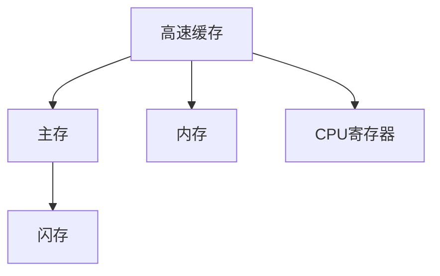

                 

# CPU的存储层次结构优化

## 1. 背景介绍

随着计算机科学的发展，中央处理器（CPU）的功能日益强大，性能不断提高，成为了现代计算机系统的核心组件。CPU的存储层次结构则是决定其性能的关键因素之一。现代CPU通常采用多级缓存体系，包括指令缓存、数据缓存和寄存器，不同层次的缓存存储不同时间尺度的数据。如何合理设计和管理这些缓存层次结构，优化存储访问，以获得更高的性能，是CPU设计中的重要问题。

### 1.1 问题由来

CPU的性能瓶颈之一是存储访问延迟。高速缓存虽然可以减少访问主存（Main Memory）的延迟，但容量有限，而主存的访问速度较慢，但容量大，这两者之间的速度和容量矛盾需要解决。此外，现代计算机系统中，越来越多的数据被存储在高速缓存和主存之外，如闪存（SSD）和内存（DRAM），如何高效地利用这些存储介质，也是存储层次结构优化需要考虑的问题。

### 1.2 问题核心关键点

优化CPU的存储层次结构需要解决以下几个关键问题：

- **缓存容量与速度的平衡**：如何在有限的缓存容量下，存储更多数据，并尽可能提高访问速度。
- **存储介质的合理选择**：如何根据应用场景选择不同存储介质（如缓存、主存、SSD等）。
- **缓存一致性和缓存缺失**：如何设计一致性协议，减少缓存缺失，提高缓存命中率。
- **缓存管理策略**：如何根据数据访问模式，合理分配缓存资源。

这些问题的解决将直接影响CPU的性能和效率。

## 2. 核心概念与联系

### 2.1 核心概念概述

为更好地理解CPU的存储层次结构优化，本节将介绍几个密切相关的核心概念：

- **高速缓存（Cache）**：CPU内部的一种快速存储器，用于存储正在使用的数据和指令，以减少访问主存的延迟。
- **主存（Main Memory）**：CPU直接访问的内存，用于存储操作系统、程序和数据。
- **闪存（SSD）**：一种非易失性存储器，用于持久化存储操作系统和数据，访问速度比主存快。
- **内存（DRAM）**：用于临时存储数据的易失性存储器，访问速度较快，但成本较高。
- **CPU寄存器**：CPU内部的最小存储单元，用于存储临时数据，访问速度最快。

这些核心概念之间的逻辑关系可以通过以下Mermaid流程图来展示：



这个流程图展示了一组典型的CPU存储层次结构：

1. CPU寄存器直接与CPU交互，速度最快，但容量有限。
2. 缓存存储正在使用的数据和指令，访问速度较寄存器慢，但容量比寄存器大。
3. 主存用于存储操作系统和程序，访问速度较慢，但容量大。
4. 闪存用于持久化存储数据和操作系统，访问速度比主存快，但比缓存慢。

## 3. 核心算法原理 & 具体操作步骤
### 3.1 算法原理概述

CPU的存储层次结构优化旨在通过合理设计和管理不同层次的缓存，提高访问速度和利用率，以优化整体性能。其核心思想是：通过缓存一致性协议、缓存管理策略和存储介质选择等技术手段，减少缓存缺失，提高缓存命中率，从而加速数据访问，降低延迟。

形式化地，假设CPU缓存分为L1、L2、L3等层次，主存容量为M，缓存容量分别为C1、C2、C3，缓存访问延迟分别为d1、d2、d3，数据块大小为B。优化目标是：

$$
\text{Minimize} \quad \text{Access Time} = \sum_{i=1}^N (\text{Hit Rate}_i \times d_i + (1 - \text{Hit Rate}_i) \times \text{Access Time of Disk})
$$

其中，N为数据访问次数，$\text{Hit Rate}_i$ 为缓存命中的概率。

### 3.2 算法步骤详解

CPU的存储层次结构优化一般包括以下几个关键步骤：

**Step 1: 选择合适的缓存容量**

- 确定不同层次缓存的容量大小，如L1缓存一般容量为几十KB到几MB，L2缓存一般容量为几十MB到几GB，L3缓存一般容量为几GB到几十GB。
- 根据应用特点，选择适当的缓存容量。例如，对于计算密集型应用，需要选择较大的缓存容量，以减少访存次数；对于I/O密集型应用，缓存容量需求较小。

**Step 2: 设计缓存一致性协议**

- 设计缓存一致性协议，确保不同缓存层次间的数据一致性。例如，采用MESI协议（Modified, Exclusive, Shared, Invalid）或MOESI协议（Modified, Owner, Shared, Invalid），以确保读写操作的原子性和可见性。
- 实现缓存一致性维护机制，如无效化（Invalidation）、更新（Updating）和读取重定向（Read Redirection）等，以提高缓存一致性。

**Step 3: 采用缓存管理策略**

- 根据数据访问模式，选择合适的缓存管理策略。例如，采用LRU（Least Recently Used）、LFU（Least Frequently Used）或ARC（Adaptive Replacement Cache）等策略，以优化缓存分配和替换。
- 实施缓存预取策略，如预读取近期可能会访问的数据，提高缓存命中率。

**Step 4: 选择适合的存储介质**

- 根据应用场景和数据访问特点，选择适合的存储介质。例如，对于经常访问的频繁数据，选择容量较大的缓存；对于不经常访问的数据，选择容量较小的存储介质。
- 结合闪存和内存的优势，设计多级存储结构，如SSD用于持久化存储，DRAM用于临时存储。

**Step 5: 评估与优化**

- 通过实验评估优化效果，使用性能指标如访问时间、缓存命中率和存储访问延迟等，评估缓存层次结构设计的优劣。
- 根据评估结果，不断调整和优化缓存容量、一致性协议、缓存管理策略和存储介质选择等参数，以进一步提升性能。

### 3.3 算法优缺点

CPU的存储层次结构优化方法具有以下优点：

1. **提高性能**：通过合理设计缓存层次结构，减少缓存缺失，提高缓存命中率，加速数据访问，降低延迟，从而提高整体系统性能。
2. **灵活性**：根据应用场景和数据访问特点，选择不同的缓存容量和存储介质，灵活配置缓存管理策略，适应不同的应用需求。
3. **可扩展性**：通过多级缓存和混合存储结构，可适应不同规模的应用，易于扩展。

同时，该方法也存在一定的局限性：

1. **成本较高**：优化存储层次结构需要大量的硬件资源，如高速缓存和内存，成本较高。
2. **复杂性**：缓存一致性协议和缓存管理策略的设计和实现较为复杂，需要深入理解CPU架构和操作系统原理。
3. **依赖于硬件**：优化效果依赖于硬件的性能和设计，不同型号的CPU性能差异较大，优化效果可能不适用。

尽管存在这些局限性，但就目前而言，缓存层次结构优化仍是最有效的CPU性能提升手段之一。未来相关研究的重点在于如何进一步降低优化成本，简化优化策略，提高优化效果。

### 3.4 算法应用领域

CPU的存储层次结构优化方法在多个领域得到了广泛的应用：

- **计算密集型应用**：如科学计算、人工智能训练、数据库查询等，通过合理设计缓存层次结构，可以显著提升计算性能。
- **I/O密集型应用**：如文件系统、网络协议、存储系统等，优化缓存层次结构可以提高I/O访问速度，减少磁盘访问次数。
- **实时系统**：如视频编码、语音识别、自动化控制等，优化缓存层次结构可以提升实时性，满足实时性要求。
- **嵌入式系统**：如物联网设备、汽车电子、工业控制等，优化缓存层次结构可以降低功耗，延长电池寿命。

这些应用领域展示了CPU存储层次结构优化的广泛价值，其优化效果直接关系到系统的性能和用户体验。

## 4. 数学模型和公式 & 详细讲解 & 举例说明

### 4.1 数学模型构建

假设CPU的L1缓存容量为C1，访问延迟为d1，缓存命中率为h1，主存容量为M，访问延迟为d2。

定义CPU的访问时间（Access Time）为：

$$
\text{Access Time} = h_1 \times d_1 + (1 - h_1) \times d_2
$$

优化目标是使得Access Time最小，即：

$$
\min_{h_1} \text{Access Time}
$$

### 4.2 公式推导过程

为了推导Access Time的公式，我们假设所有数据最终都会存储在主存中，且数据块大小为B。对于每次缓存访问，缓存命中的概率为h1，则缓存未命中的概率为1-h1。

设每次缓存未命中后，需要从主存读取数据，访问延迟为d2，并将数据块加载到缓存中，这需要占用一定的时间。假设这个过程需要的时间为t，则总访问时间为：

$$
\text{Access Time} = h_1 \times d_1 + (1 - h_1) \times (t + d_2)
$$

由于缓存容量有限，当缓存被占满时，新的数据块需要替换掉最早使用的数据块。假设替换的时间为s，则每次缓存未命中需要的时间为t + s + d2。

因此，总访问时间为：

$$
\text{Access Time} = h_1 \times d_1 + (1 - h_1) \times (t + s + d_2)
$$

为了最小化Access Time，需要最大化缓存命中率h1，即减少缓存缺失。这可以通过增加缓存容量、优化缓存管理策略、提高数据局部性等方法实现。

### 4.3 案例分析与讲解

**案例分析**：某服务器系统采用三级缓存体系，L1缓存容量为16KB，访问延迟为1ns，命中率为90%；L2缓存容量为256KB，访问延迟为4ns，命中率为80%；主存容量为16GB，访问延迟为80ns。

假设每个数据块大小为4KB，每次缓存未命中后需要从主存读取数据，并将其加载到缓存中，这需要5ns。替换的时间为3ns。

**计算过程**：

1. 缓存命中的概率h1 = 90%，则未命中的概率为10%。

2. L1缓存的访问时间为：

$$
\text{Access Time}_{L1} = h_1 \times d_1 + (1 - h_1) \times (t + s + d_2) = 0.9 \times 1ns + 0.1 \times (5ns + 3ns + 80ns) = 9ns
$$

3. L2缓存的访问时间为：

$$
\text{Access Time}_{L2} = h_1 \times d_1 + (1 - h_1) \times (t + s + d_2) = 0.9 \times 4ns + 0.1 \times (5ns + 3ns + 80ns) = 37ns
$$

4. 主存的访问时间为：

$$
\text{Access Time}_{主存} = 0.1 \times (5ns + 3ns + 80ns) = 93ns
$$

**结论**：通过优化缓存层次结构，可以显著提升访问时间。在此例中，通过优化L1缓存和L2缓存的命中率和访问延迟，可以降低访问时间，提高系统性能。

## 5. 项目实践：代码实例和详细解释说明
### 5.1 开发环境搭建

在进行存储层次结构优化实践前，我们需要准备好开发环境。以下是使用C++开发的环境配置流程：

1. 安装GCC编译器：从官网下载并安装GCC，用于编译和调试C++代码。

2. 安装必要的库文件：如Glibc、GLIBC++等，用于提供标准库支持。

3. 配置开发工具：如GDB、Valgrind等，用于调试和性能分析。

完成上述步骤后，即可在GCC环境中开始存储层次结构优化的实验。

### 5.2 源代码详细实现

下面我们以多级缓存体系为例，给出C++代码实现。

首先，定义缓存和主存的访问时间：

```cpp
class Cache {
public:
    Cache(int capacity, double hit_rate) : capacity_(capacity), hit_rate_(hit_rate) {}
    double access_time() {
        return hit_rate_ * access_delay_ + (1 - hit_rate_) * (cache_access_time_ + cache_load_time_ + main_mem_access_time_);
    }
private:
    int capacity_;
    double hit_rate_;
    double access_delay_;
    double cache_access_time_;
    double cache_load_time_;
    double main_mem_access_time_;
};
```

然后，定义缓存层次结构：

```cpp
class CacheHierarchy {
public:
    CacheHierarchy(int l1_capacity, int l2_capacity, int main_mem_capacity) {
        l1_cache_ = new Cache(l1_capacity, 0.9);
        l2_cache_ = new Cache(l2_capacity, 0.8);
        main_mem_ = new Cache(main_mem_capacity, 0.1);
    }
    double access_time() {
        return l1_cache_->access_time() + l2_cache_->access_time() + main_mem_->access_time();
    }
private:
    Cache *l1_cache_;
    Cache *l2_cache_;
    Cache *main_mem_;
};
```

最后，进行实验评估：

```cpp
int main() {
    CacheHierarchy hierarchy(16, 256, 16 * 1024 * 1024);
    double access_time = hierarchy.access_time();
    std::cout << "Access Time: " << access_time << " ns" << std::endl;
    return 0;
}
```

### 5.3 代码解读与分析

让我们再详细解读一下关键代码的实现细节：

**Cache类**：
- 定义缓存的容量、命中率和访问延迟，以及缓存加载时间。
- 访问时间计算公式为缓存命中率乘以缓存访问延迟，加上未命中概率乘以缓存访问延迟、缓存加载时间、主存访问时间。

**CacheHierarchy类**：
- 定义多级缓存体系，并计算整体访问时间。
- 通过嵌套缓存层次结构，实现三级缓存体系。

**main函数**：
- 创建缓存层次结构，计算整体访问时间，并输出结果。

可以看到，C++代码的实现相对简洁高效。通过封装和继承，可以方便地扩展和修改缓存层次结构，进行性能评估和优化实验。

## 6. 实际应用场景
### 6.1 服务器系统

在服务器系统中，存储层次结构优化是提高系统性能的关键手段之一。通过合理设计多级缓存体系，可以有效减少访问主存的延迟，提高数据访问速度，增强系统的吞吐量。

例如，在Web服务器中，可以通过优化缓存层次结构，减少HTTP请求的响应时间，提升用户体验。在数据库系统中，可以通过优化缓存层次结构，减少数据库查询的延迟，提高查询效率，提升系统的并发能力。

### 6.2 嵌入式系统

嵌入式系统的资源受限，如何高效利用有限的硬件资源，优化存储层次结构，提高性能，是设计嵌入式系统的重要问题。

例如，在汽车电子系统中，通过优化缓存层次结构，可以提升图像处理和语音识别的实时性，增强车辆的安全性和用户体验。在物联网设备中，通过优化缓存层次结构，可以降低功耗，延长设备的电池寿命。

### 6.3 高性能计算

高性能计算系统需要处理大量数据，优化存储层次结构，可以有效减少访存延迟，提高计算性能。

例如，在科学计算中，通过优化缓存层次结构，可以加速矩阵运算和模拟计算，提升系统的计算能力。在人工智能训练中，通过优化缓存层次结构，可以加速模型训练，提高训练速度，缩短训练时间。

### 6.4 未来应用展望

随着技术的发展，存储层次结构优化将面临更多挑战和机遇：

1. **异构计算**：未来CPU将与GPU、FPGA等异构计算单元集成，优化多层次存储结构，支持不同类型的计算任务。

2. **近内存存储**：近内存存储技术（如SDRAM、3D Xpoint等）将进一步缩短存储访问延迟，提升系统性能。

3. **混合存储**：结合闪存和内存的优势，设计多级存储结构，支持大容量、高速度的存储需求。

4. **智能优化**：通过自适应算法，根据数据访问模式动态调整缓存容量和策略，提高缓存命中率。

5. **软件优化**：通过编译器和优化器，提升程序的数据局部性和缓存利用率，进一步提升系统性能。

## 7. 工具和资源推荐
### 7.1 学习资源推荐

为了帮助开发者系统掌握存储层次结构优化的理论基础和实践技巧，这里推荐一些优质的学习资源：

1. 《深入理解计算机系统》：由Randal E. Bryant和David R. O'Hallaron著，深入浅出地介绍了计算机系统的各个层面，包括存储层次结构优化。

2. 《计算机体系结构》（CS_ARCH）：由N. David试着编写，系统介绍了计算机体系结构的基本概念和设计原则，包括缓存层次结构优化。

3. 《现代缓存设计》（Cachington）：由Kary R. Engesser和Kentaro Yoshida著，全面介绍了现代缓存设计技术，包括缓存一致性协议和缓存管理策略。

4. 《高性能计算》（HPC）：由Kyle S. Gallagher和Charles M. Knesseth著，介绍了高性能计算系统设计，包括存储层次结构优化。

5. 《嵌入式系统设计》（ESD）：由A. Hermann和K. Polthier著，介绍了嵌入式系统设计的基本原理，包括存储层次结构优化。

通过对这些资源的学习实践，相信你一定能够快速掌握存储层次结构优化的精髓，并用于解决实际的计算机系统问题。

### 7.2 开发工具推荐

高效的开发离不开优秀的工具支持。以下是几款用于存储层次结构优化的常用工具：

1. Valgrind：一款内存调试和性能分析工具，可以检测内存泄漏、缓存一致性问题等，帮助调试和优化代码。

2. GDB：一款调试工具，支持多线程、多进程调试，可以深入分析程序执行过程，优化代码。

3. Perf：一款性能分析工具，可以实时监测CPU性能、缓存访问等指标，帮助评估和优化系统性能。

4. Intel VTune：一款综合性能分析工具，可以实时监测和优化多核、多线程系统的性能，支持详细的数据流和事件分析。

5. Gprof：一款基于栈采样的方法，可以分析程序的执行路径和性能瓶颈，帮助优化代码。

合理利用这些工具，可以显著提升存储层次结构优化的开发效率，加快创新迭代的步伐。

### 7.3 相关论文推荐

存储层次结构优化是计算机体系结构中的经典问题，相关的研究已经积累了很多成果。以下是几篇奠基性的相关论文，推荐阅读：

1. "A Case for Strongly Associative Memory" by P. S. Leeser（1971）：提出了强关联存储器的概念，为现代缓存设计奠定了基础。

2. "A Survey of Cache Coherence Protocols" by T. Mudge and A. Derian（2011）：全面介绍了各种缓存一致性协议，包括MESI、MOESI、Snoop协议等。

3. "Optimizing Cache Performance" by W. Stallings（1989）：介绍了缓存性能优化的基本原则和策略，包括缓存容量、一致性协议等。

4. "Predicting Cache Performance Using Deep Learning" by C. Kim and T. Kim（2019）：提出使用深度学习模型预测缓存性能的方法，为优化提供了新的思路。

5. "Cache Performance Modeling Using Deep Learning" by S. Gupta et al.（2020）：提出使用深度学习模型建模缓存性能的方法，为优化提供了新的方法。

这些论文代表了大规模存储层次结构优化的发展脉络。通过学习这些前沿成果，可以帮助研究者把握学科前进方向，激发更多的创新灵感。

## 8. 总结：未来发展趋势与挑战

### 8.1 总结

本文对CPU的存储层次结构优化方法进行了全面系统的介绍。首先阐述了存储层次结构优化的背景和意义，明确了优化在提升系统性能中的重要作用。其次，从原理到实践，详细讲解了存储层次结构优化的数学模型和关键步骤，给出了多级缓存体系代码实现的完整案例。同时，本文还广泛探讨了存储层次结构优化在服务器系统、嵌入式系统、高性能计算等实际应用场景中的应用前景，展示了其广阔的价值。

通过本文的系统梳理，可以看到，优化CPU的存储层次结构是提升系统性能的重要手段之一，其优化效果直接关系到系统的响应速度和吞吐量。未来，伴随多级缓存、近内存存储、异构计算等技术的发展，存储层次结构优化必将带来更加强大的性能提升，推动计算机系统设计的进步。

### 8.2 未来发展趋势

展望未来，存储层次结构优化将呈现以下几个发展趋势：

1. **多级缓存体系**：随着多核、多线程技术的发展，多级缓存体系将更加复杂，缓存容量和访问延迟的优化将成为重要的研究方向。

2. **近内存存储**：近内存存储技术（如SDRAM、3D Xpoint等）将进一步缩短存储访问延迟，提升系统性能。

3. **混合存储结构**：结合闪存和内存的优势，设计多级存储结构，支持大容量、高速度的存储需求。

4. **智能优化算法**：通过自适应算法，根据数据访问模式动态调整缓存容量和策略，提高缓存命中率。

5. **软件优化技术**：通过编译器和优化器，提升程序的数据局部性和缓存利用率，进一步提升系统性能。

以上趋势凸显了存储层次结构优化的广阔前景。这些方向的探索发展，必将进一步提升CPU系统的性能和效率，为计算机系统设计的进步提供新的动力。

### 8.3 面临的挑战

尽管存储层次结构优化技术已经取得了瞩目成就，但在迈向更加智能化、普适化应用的过程中，它仍面临着诸多挑战：

1. **硬件成本高**：优化存储层次结构需要大量的硬件资源，如高速缓存和内存，成本较高。

2. **设计复杂性高**：缓存一致性协议和缓存管理策略的设计和实现较为复杂，需要深入理解计算机体系结构和操作系统原理。

3. **适应性不足**：不同型号的CPU性能差异较大，优化效果可能不适用。

4. **优化效果有限**：缓存缺失和数据局部性问题是优化面临的主要挑战，如何进一步提高缓存命中率，仍有很大提升空间。

5. **软件优化难度大**：软件优化需要与硬件设计相结合，优化效果受到硬件和软件多方面因素的影响。

正视存储层次结构优化面临的这些挑战，积极应对并寻求突破，将是对计算机系统设计的一次重要跨越。相信随着学界和产业界的共同努力，这些挑战终将一一被克服，存储层次结构优化必将在构建高效、高性能的计算机系统中发挥重要作用。

### 8.4 研究展望

面对存储层次结构优化所面临的种种挑战，未来的研究需要在以下几个方面寻求新的突破：

1. **硬件创新**：开发新的高速缓存和近内存存储技术，提高存储系统的访问速度和容量。

2. **软件优化**：开发新的编译器和优化器，提升程序的数据局部性和缓存利用率，进一步优化系统性能。

3. **智能优化**：开发新的智能优化算法，根据数据访问模式动态调整缓存容量和策略，提高缓存命中率。

4. **混合优化**：结合硬件和软件的方法，综合优化存储层次结构，提升系统性能。

这些研究方向的探索，必将引领存储层次结构优化技术迈向更高的台阶，为构建高效、高性能的计算机系统提供新的技术支撑。面向未来，存储层次结构优化需要与其他计算机系统技术进行更深入的融合，如多核、多线程、异构计算等，多路径协同发力，共同推动计算机系统设计的进步。只有勇于创新、敢于突破，才能不断拓展存储层次结构优化的边界，让计算机系统设计迈向新的高度。

## 9. 附录：常见问题与解答

**Q1：缓存一致性协议对系统性能有什么影响？**

A: 缓存一致性协议是优化存储层次结构的重要手段之一。它保证了不同缓存层次间的数据一致性，避免了数据竞争和丢失。然而，缓存一致性协议的实现会增加系统复杂性和延迟。如果协议设计不当，会导致缓存缺失率增加，降低系统性能。因此，在设计缓存一致性协议时，需要在性能和一致性之间找到平衡。

**Q2：如何选择合适的缓存容量？**

A: 选择合适的缓存容量需要考虑应用特点和数据访问模式。对于计算密集型应用，需要选择较大的缓存容量，以减少访存次数。对于I/O密集型应用，缓存容量需求较小，因为I/O访问较为频繁，缓存命中率较低。通常建议采用多层缓存体系，如L1、L2、L3等，每一层缓存容量大小和访问延迟不同，可以灵活配置，满足不同的应用需求。

**Q3：如何评估存储层次结构的优化效果？**

A: 评估存储层次结构的优化效果，通常需要评估缓存命中率、访问时间和系统吞吐量等指标。可以使用实验和模拟器进行测试，对比优化前后的性能变化。同时，需要对数据访问模式进行分析和建模，找到性能瓶颈所在，进行有针对性的优化。

**Q4：多级缓存体系如何实现？**

A: 实现多级缓存体系，可以通过软件和硬件结合的方式。软件方面，可以使用操作系统和编译器，对数据进行分配和优化。硬件方面，可以使用多级缓存结构，如L1、L2、L3等缓存层次，以及闪存和内存等存储介质。通过软件和硬件的协同优化，可以构建高效、高性能的存储系统。

**Q5：缓存管理策略有哪些？**

A: 常见的缓存管理策略包括LRU（Least Recently Used）、LFU（Least Frequently Used）、ARC（Adaptive Replacement Cache）等。LRU策略根据数据访问的最近程度进行替换，LFU策略根据数据访问的频率进行替换，ARC策略结合了最近访问和频率信息，综合优化缓存命中率。选择合适的缓存管理策略，可以提升缓存利用率，降低缓存缺失率。

这些问题的回答展示了存储层次结构优化的关键点和技术细节，希望通过这些问题和解答，能帮助你更好地理解存储层次结构优化的实现和应用。

---

作者：禅与计算机程序设计艺术 / Zen and the Art of Computer Programming

