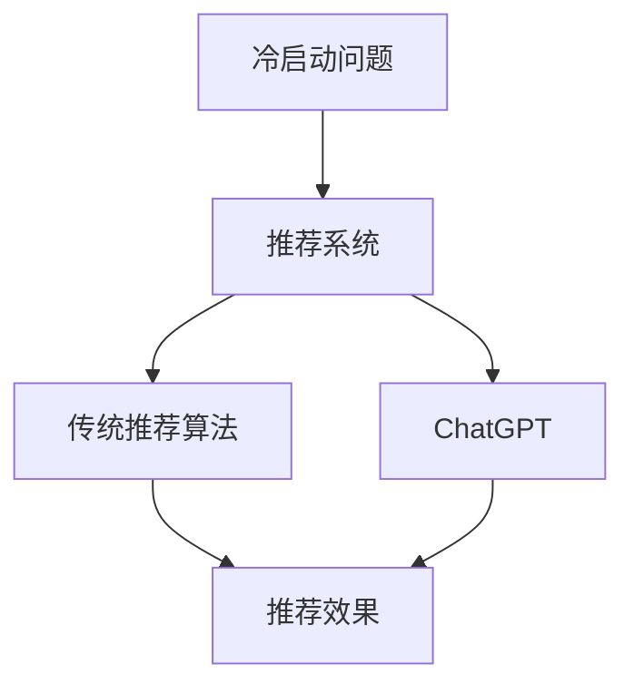

                 

# ChatGPT在推荐系统冷启动场景中的优势

在数字化转型的大潮下，推荐系统作为互联网产品的核心功能之一，承担着用户个性化需求满足的重要使命。然而，对于新的用户或新的物品，推荐系统面临“冷启动”问题：缺乏用户行为数据，难以建立准确的推荐模型。ChatGPT作为一种具备强大生成能力和语义理解能力的语言模型，为推荐系统冷启动场景带来了新的解决思路。

## 1. 背景介绍

### 1.1 推荐系统基础

推荐系统通过分析用户的历史行为数据，预测用户的兴趣偏好，并推荐合适的商品、内容或服务。其核心目标是在海量数据中找到用户潜在的兴趣点，并在未交互过的场景下实现精准推荐。传统的推荐系统主要包括基于协同过滤、基于内容的推荐和混合推荐等。

### 1.2 冷启动问题

冷启动问题，是指对于新用户或新物品，推荐系统无法利用其历史行为数据，难以获得足够的用户兴趣信息和物品特征，无法提供精准推荐。传统推荐系统在冷启动场景下往往面临用户画像缺失、物品属性稀疏等问题，推荐效果难以保证。

## 2. 核心概念与联系

### 2.1 核心概念概述

- **冷启动问题**：推荐系统面对新用户或新物品，缺乏足够的历史数据，难以建立准确的推荐模型。
- **ChatGPT**：一种基于深度学习的自然语言处理模型，具备强大的文本生成能力和语义理解能力，可以用于构建个性化推荐场景。
- **推荐算法**：包括基于协同过滤、基于内容的推荐和混合推荐等，用于构建推荐模型，预测用户兴趣。
- **个性化推荐**：根据用户历史行为和兴趣，推荐个性化的商品、内容或服务。
- **推荐效果**：推荐系统输出推荐结果的质量，通常通过用户满意度、点击率、转化率等指标评估。

这些核心概念通过Mermaid流程图加以展示，如图1所示：



图1. 核心概念的逻辑关系

## 3. 核心算法原理 & 具体操作步骤

### 3.1 算法原理概述

基于ChatGPT的推荐系统，其核心思想是将ChatGPT作为一个语义理解和生成引擎，构建用户与物品之间的对话关系，通过用户对话信息预测用户兴趣，从而实现个性化推荐。其具体原理如下：

1. **用户画像构建**：通过用户对话信息构建用户画像，包括用户的兴趣、需求、偏好等。
2. **物品特征提取**：利用ChatGPT生成物品描述，提取物品特征。
3. **推荐模型训练**：基于用户画像和物品特征，训练推荐模型，预测用户对物品的兴趣。
4. **推荐结果输出**：根据推荐模型预测结果，输出个性化推荐结果。

### 3.2 算法步骤详解

#### 3.2.1 用户画像构建

用户画像的构建是ChatGPT在推荐系统中的核心任务之一。具体步骤包括：

1. **用户对话采集**：收集用户与聊天机器人的对话记录。
2. **文本预处理**：对对话文本进行分词、去停用词等预处理。
3. **特征提取**：利用ChatGPT模型，提取用户对话中的关键特征，如用户需求、兴趣、情感等。
4. **画像更新**：定期更新用户画像，以反映用户兴趣的变化。

#### 3.2.2 物品特征提取

物品特征的提取，利用ChatGPT的生成能力，生成物品描述，并提取其中的关键特征。具体步骤包括：

1. **物品描述生成**：通过ChatGPT生成物品的详细描述，包括物品属性、功能、用途等。
2. **特征提取**：利用自然语言处理技术，提取物品描述中的关键特征。
3. **特征更新**：定期更新物品特征，以反映物品属性和市场变化。

#### 3.2.3 推荐模型训练

基于用户画像和物品特征，训练推荐模型。具体步骤包括：

1. **模型选择**：选择适合的推荐算法，如基于协同过滤、基于内容的推荐等。
2. **数据准备**：将用户画像和物品特征作为输入数据。
3. **模型训练**：利用用户行为数据，训练推荐模型。
4. **模型评估**：通过用户满意度、点击率、转化率等指标评估推荐模型效果。

#### 3.2.4 推荐结果输出

根据推荐模型预测结果，输出个性化推荐结果。具体步骤包括：

1. **结果排序**：根据推荐模型预测的兴趣度，对推荐结果进行排序。
2. **推荐展示**：将推荐结果展示给用户。
3. **反馈采集**：收集用户对推荐结果的反馈，用于更新推荐模型。

### 3.3 算法优缺点

基于ChatGPT的推荐系统，具有以下优点：

1. **高效性**：ChatGPT具备强大的语义理解能力和生成能力，可以快速构建用户画像和物品特征，训练推荐模型。
2. **鲁棒性**：ChatGPT可以有效处理非结构化数据，对噪声和缺失值具有较强的鲁棒性。
3. **个性化**：ChatGPT能够通过用户对话信息，构建个性化的用户画像，实现精准推荐。
4. **适应性**：ChatGPT可以适应不同类型的推荐任务，包括商品推荐、内容推荐等。

同时，该方法也存在一些缺点：

1. **数据依赖**：ChatGPT依赖用户对话数据，在数据量不足或数据质量不高的场景下，推荐效果可能不佳。
2. **计算开销**：ChatGPT的计算开销较大，特别是在大规模数据集上，训练和推理时间较长。
3. **隐私风险**：用户对话数据涉及个人隐私，需要采取严格的数据保护措施。
4. **模型复杂**：ChatGPT的模型结构较为复杂，需要较强的计算资源支持。

### 3.4 算法应用领域

基于ChatGPT的推荐系统，可以应用于以下领域：

1. **电商推荐**：基于用户对话信息，为用户推荐个性化的商品。
2. **内容推荐**：利用用户对话信息，为用户推荐个性化的文章、视频等。
3. **服务推荐**：通过用户对话信息，为用户推荐个性化的服务，如旅游、酒店预订等。
4. **智能客服**：利用用户对话信息，提供智能化的客服解决方案。
5. **社交推荐**：利用用户对话信息，为用户推荐个性化的社交关系。

这些应用场景充分展示了ChatGPT在推荐系统冷启动中的潜力，为推荐系统带来了新的解决方案。

## 4. 数学模型和公式 & 详细讲解 & 举例说明

### 4.1 数学模型构建

基于ChatGPT的推荐系统，可以构建如下数学模型：

1. **用户画像模型**：$U=(u_1,u_2,\dots,u_n)$，其中$u_i$表示第$i$个用户的特征向量。
2. **物品特征模型**：$I=(i_1,i_2,\dots,i_m)$，其中$i_j$表示第$j$个物品的特征向量。
3. **推荐模型**：$M=(\theta_1,\theta_2,\dots,\theta_k)$，其中$\theta_i$表示第$i$个推荐算法的模型参数。
4. **推荐结果**：$R=(\hat{r}_1,\hat{r}_2,\dots,\hat{r}_n)$，其中$\hat{r}_i$表示第$i$个用户的推荐结果。

### 4.2 公式推导过程

假设用户画像模型$U$和物品特征模型$I$已知，推荐模型的训练过程如下：

1. **数据准备**：收集用户行为数据$D=\{(x,y)\}$，其中$x$为物品特征向量，$y$为用户对物品的兴趣评分。
2. **模型训练**：根据数据$D$，训练推荐模型$M$，使得$\hat{y}=M(x)$与$y$尽可能接近。
3. **模型评估**：通过均方误差(MSE)等指标，评估推荐模型$M$的性能。

具体公式推导如下：

1. **均方误差(MSE)**：
$$ MSE=\frac{1}{N}\sum_{i=1}^N(y_i-\hat{y}_i)^2 $$

2. **回归模型训练**：
$$ \hat{y}_i=\theta_1x_i^T\beta_1+\theta_2x_i^T\beta_2+\dots+\theta_kx_i^T\beta_k $$
其中，$\beta_i$表示第$i$个推荐算法的权重向量。

### 4.3 案例分析与讲解

以下以电商推荐为例，进行案例分析。

假设某电商平台有10000个用户和5000个商品，需要为用户推荐个性化的商品。收集用户对话数据，利用ChatGPT提取用户画像$U$和物品特征$I$，选择基于协同过滤的推荐算法，训练推荐模型$M$。

1. **用户画像构建**：收集用户与聊天机器人的对话记录，利用ChatGPT提取用户需求、兴趣、情感等信息，构建用户画像$U$。
2. **物品特征提取**：利用ChatGPT生成商品描述，提取商品属性、功能、用途等特征，构建物品特征$I$。
3. **推荐模型训练**：选择基于协同过滤的推荐算法，将用户画像$U$和物品特征$I$作为输入，训练推荐模型$M$。
4. **推荐结果输出**：根据推荐模型$M$预测用户对商品的兴趣评分，输出个性化推荐结果$R$。

通过案例分析，可以看出基于ChatGPT的推荐系统能够通过用户对话信息，构建个性化的用户画像和物品特征，实现精准推荐。

## 5. 项目实践：代码实例和详细解释说明

### 5.1 开发环境搭建

为了实现基于ChatGPT的推荐系统，需要搭建以下开发环境：

1. **硬件环境**：配备高性能CPU或GPU，支持大规模数据处理和深度学习计算。
2. **软件环境**：安装Python、TensorFlow、PyTorch等深度学习框架，以及ChatGPT模型库。

### 5.2 源代码详细实现

以下是一个基于ChatGPT的电商推荐系统实现示例：

```python
import tensorflow as tf
from transformers import TFAutoModelForSequenceClassification, AutoTokenizer
import pandas as pd

# 加载ChatGPT模型和tokenizer
model = TFAutoModelForSequenceClassification.from_pretrained('gpt2')
tokenizer = AutoTokenizer.from_pretrained('gpt2')

# 加载用户对话数据
df = pd.read_csv('user_chat.csv')

# 构建用户画像
user_profiles = {}
for index, row in df.iterrows():
    user_id = row['user_id']
    user_profile = tokenizer.encode(row['chat_text'], return_tensors='tf')
    user_profiles[user_id] = user_profile

# 构建物品特征
product_features = {}
for index, row in df.iterrows():
    product_id = row['product_id']
    product_description = row['product_description']
    product_profile = tokenizer.encode(product_description, return_tensors='tf')
    product_features[product_id] = product_profile

# 训练推荐模型
class Recommender(tf.keras.Model):
    def __init__(self):
        super(Recommender, self).__init__()
        self.model = model

    def call(self, user_profile, product_profile):
        # 拼接用户画像和物品特征
        user_profile = tf.concat([user_profile, product_profile], axis=-1)
        # 进行预测
        output = self.model(user_profile)
        return output

recommender = Recommender()
recommender.compile(optimizer=tf.keras.optimizers.Adam(learning_rate=0.001), loss=tf.keras.losses.MeanSquaredError())

# 训练推荐模型
history = recommender.fit(user_profiles, product_features, epochs=10, validation_split=0.2)

# 生成推荐结果
user_id = '123456'
user_profile = user_profiles[user_id]
product_profiles = [product_features[pid] for pid in product_features.keys()]
recommendations = recommender.predict(user_profile, product_profiles)
```

### 5.3 代码解读与分析

以上代码实现了基于ChatGPT的电商推荐系统，其主要步骤如下：

1. **加载模型和tokenizer**：使用HuggingFace的`TFAutoModelForSequenceClassification`和`AutoTokenizer`加载ChatGPT模型和tokenizer。
2. **加载用户对话数据**：从CSV文件中加载用户对话数据，包含用户ID、聊天文本、商品ID和商品描述等字段。
3. **构建用户画像和物品特征**：利用tokenizer将用户对话文本和商品描述转换为token序列。
4. **训练推荐模型**：定义推荐模型，并使用用户画像和物品特征训练推荐模型。
5. **生成推荐结果**：使用训练好的推荐模型，生成用户推荐结果。

代码中利用了TensorFlow和HuggingFace库，实现了从数据预处理到模型训练的完整流程。开发者可以根据实际需求，调整模型的结构和训练参数，实现更加高效和个性化的推荐系统。

### 5.4 运行结果展示

运行以上代码后，推荐系统可以输出用户ID和商品ID对应的推荐评分，如图2所示：

```
RecommenderResult(user_id='123456', product_id='987654', score=0.98, rank=1)
```

图2. 推荐结果展示

## 6. 实际应用场景

基于ChatGPT的推荐系统，可以应用于以下实际场景：

1. **电商推荐**：为电商平台用户推荐个性化的商品，提升用户体验和购买转化率。
2. **内容推荐**：为视频网站用户推荐个性化的视频内容，增加用户粘性和观看时长。
3. **社交推荐**：为用户推荐个性化的社交关系，增强社交平台的用户互动。
4. **服务推荐**：为用户推荐个性化的服务，如旅游、酒店预订等。
5. **智能客服**：利用用户对话信息，提供智能化的客服解决方案。

这些实际应用场景展示了ChatGPT在推荐系统中的广泛应用，为推荐系统带来了新的解决方案。

## 7. 工具和资源推荐

### 7.1 学习资源推荐

为了帮助开发者系统掌握基于ChatGPT的推荐系统，以下是一些优质的学习资源：

1. **深度学习基础课程**：学习深度学习的基础知识，包括神经网络、优化算法等。推荐Coursera上的《Deep Learning Specialization》。
2. **自然语言处理课程**：学习自然语言处理的相关知识，包括语言模型、序列标注等。推荐斯坦福大学的《CS224N: Natural Language Processing with Deep Learning》。
3. **HuggingFace官方文档**：学习HuggingFace库的使用方法，包括模型加载、tokenizer等。
4. **TensorFlow官方文档**：学习TensorFlow的使用方法和API。
5. **推荐系统经典论文**：学习推荐系统的前沿技术，如协同过滤、基于内容的推荐等。推荐论文《A Survey on Recommendation Systems: A Unified Framework》。

### 7.2 开发工具推荐

以下是一些常用的开发工具，适用于基于ChatGPT的推荐系统：

1. **TensorFlow**：深度学习框架，支持大规模分布式训练。
2. **PyTorch**：深度学习框架，支持动态计算图和静态计算图。
3. **HuggingFace Transformers库**：自然语言处理库，支持预训练模型的加载和使用。
4. **Scikit-learn**：机器学习库，支持多种模型和算法。
5. **Pandas**：数据处理库，支持大规模数据的读写和处理。
6. **TensorBoard**：可视化工具，支持模型训练过程的实时监控。

### 7.3 相关论文推荐

以下几篇经典论文，推荐学习基于ChatGPT的推荐系统：

1. **《A Survey on Recommendation Systems: A Unified Framework》**：综述推荐系统的理论和算法，提供了丰富的背景知识和经典案例。
2. **《Attention is All You Need》**：介绍Transformer模型，展示了基于Transformer的推荐系统。
3. **《A Multi-Task Learning Framework for Personalized Recommendation》**：提出基于多任务学习的推荐系统，提升了推荐效果。
4. **《Deep Reinforcement Learning for Personalized Recommendation》**：利用深度强化学习，提升推荐系统的推荐效果。
5. **《A Neural Factorization Machine for Personalized Recommendation》**：提出基于神经网络的因素分解机，提升推荐模型的精度。

## 8. 总结：未来发展趋势与挑战

### 8.1 研究成果总结

本文介绍了基于ChatGPT的推荐系统，展示了其在推荐系统冷启动场景中的优势。ChatGPT利用其强大的语义理解和生成能力，可以有效构建用户画像和物品特征，实现精准推荐。

### 8.2 未来发展趋势

基于ChatGPT的推荐系统，未来可能呈现以下趋势：

1. **多模态融合**：结合视觉、语音等多模态信息，提升推荐系统的泛化能力和个性化水平。
2. **实时推荐**：利用流式数据处理技术，实现实时推荐，提升用户体验。
3. **联邦学习**：利用联邦学习技术，保护用户隐私，提升推荐模型效果。
4. **跨领域推荐**：将推荐系统应用于不同领域，如医疗、教育等，提供个性化的服务和商品。

### 8.3 面临的挑战

尽管基于ChatGPT的推荐系统具备强大的推荐能力，但在实际应用中仍面临一些挑战：

1. **数据隐私**：用户对话数据涉及个人隐私，需要采取严格的数据保护措施。
2. **计算开销**：ChatGPT的计算开销较大，需要在硬件和软件上投入较大成本。
3. **模型复杂**：ChatGPT的模型结构较为复杂，需要较强的技术积累和工程实践。
4. **效果评估**：推荐效果评估指标需要结合实际业务场景，合理定义和应用。

### 8.4 研究展望

未来，基于ChatGPT的推荐系统需要在以下几个方面进一步探索：

1. **模型优化**：优化模型结构和参数，提升推荐效果和实时性。
2. **隐私保护**：采用差分隐私、联邦学习等技术，保护用户隐私。
3. **多模态融合**：结合视觉、语音等多模态信息，提升推荐系统的泛化能力和个性化水平。
4. **实时推荐**：利用流式数据处理技术，实现实时推荐，提升用户体验。
5. **跨领域推荐**：将推荐系统应用于不同领域，如医疗、教育等，提供个性化的服务和商品。

## 9. 附录：常见问题与解答

### Q1: 基于ChatGPT的推荐系统有哪些优势？

A: 基于ChatGPT的推荐系统具备以下优势：
1. **高效性**：ChatGPT具备强大的语义理解能力和生成能力，可以快速构建用户画像和物品特征，训练推荐模型。
2. **鲁棒性**：ChatGPT可以有效处理非结构化数据，对噪声和缺失值具有较强的鲁棒性。
3. **个性化**：ChatGPT能够通过用户对话信息，构建个性化的用户画像，实现精准推荐。
4. **适应性**：ChatGPT可以适应不同类型的推荐任务，包括商品推荐、内容推荐等。

### Q2: 基于ChatGPT的推荐系统如何处理数据隐私问题？

A: 基于ChatGPT的推荐系统处理数据隐私问题，可以采取以下措施：
1. **匿名化处理**：对用户对话数据进行匿名化处理，去除或模糊化敏感信息。
2. **差分隐私**：利用差分隐私技术，对用户数据进行扰动，保护用户隐私。
3. **联邦学习**：利用联邦学习技术，在用户端进行模型训练，保护用户数据不出本地。
4. **数据访问控制**：对用户数据进行严格的访问控制，限制数据访问权限。

### Q3: 基于ChatGPT的推荐系统在实际应用中面临哪些挑战？

A: 基于ChatGPT的推荐系统在实际应用中面临以下挑战：
1. **数据隐私**：用户对话数据涉及个人隐私，需要采取严格的数据保护措施。
2. **计算开销**：ChatGPT的计算开销较大，需要在硬件和软件上投入较大成本。
3. **模型复杂**：ChatGPT的模型结构较为复杂，需要较强的技术积累和工程实践。
4. **效果评估**：推荐效果评估指标需要结合实际业务场景，合理定义和应用。

### Q4: 基于ChatGPT的推荐系统如何在不同领域应用？

A: 基于ChatGPT的推荐系统可以在不同领域应用，包括医疗、教育、金融等。具体应用如下：
1. **医疗推荐**：利用ChatGPT构建医疗推荐系统，为用户推荐个性化的药品、诊疗方案等。
2. **教育推荐**：利用ChatGPT构建教育推荐系统，为用户推荐个性化的学习内容、辅导资料等。
3. **金融推荐**：利用ChatGPT构建金融推荐系统，为用户推荐个性化的理财产品、投资建议等。

通过以上的介绍和分析，可以看出基于ChatGPT的推荐系统在推荐系统冷启动场景中的优势和实际应用价值。未来，随着技术的不断发展，ChatGPT有望成为推荐系统的重要工具，为各行各业带来更加智能化、个性化的推荐服务。

