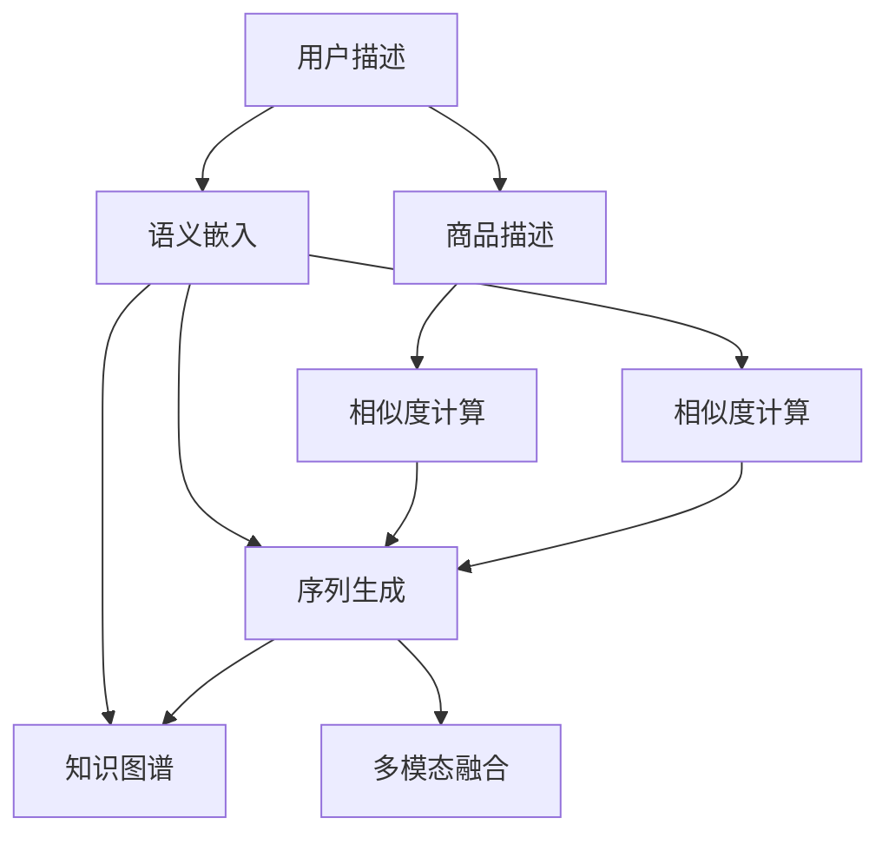

                 

# ChatGPT在推荐系统的表现：对冷启动场景的分析

## 1. 背景介绍

在智能推荐系统中，冷启动问题（Cold Start Problem）是一个长期困扰着推荐系统的难题。冷启动用户或商品在系统中缺乏历史行为数据，推荐系统难以准确预测其兴趣或质量。传统的基于协同过滤（Collaborative Filtering）的方法，如基于矩阵分解的隐式推荐系统，在冷启动场景下效果较差，无法覆盖所有用户和商品，且容易受到数据稀疏性的影响。

### 1.1 冷启动问题概述

冷启动问题主要分为两大类：

1. **用户冷启动**：新加入系统的用户没有历史行为数据，无法利用基于行为相似性的方法进行推荐。
2. **商品冷启动**：新加入系统的商品没有历史互动数据，无法利用基于商品相似性的方法进行推荐。

对于用户冷启动，一些方法如K近邻算法、基于内容的推荐等能够发挥一定作用。但对于商品冷启动，由于用户对商品的评价往往需要时间积累，这些方法效果有限。因此，在推荐系统中，冷启动问题常常特指商品冷启动。

### 1.2 ChatGPT与推荐系统结合

近年来，ChatGPT等大语言模型在自然语言处理（NLP）领域取得了显著进展，展现了强大的自然语言生成和理解能力。将大语言模型引入推荐系统，有助于解决冷启动问题。通过对用户描述、商品描述等自然语言文本的建模，可以更好地捕捉用户和商品的语义信息，从而在缺乏数据的情况下进行推荐。

## 2. 核心概念与联系

### 2.1 核心概念概述

在推荐系统中，大语言模型与冷启动问题的联系主要体现在以下几个方面：

1. **语义嵌入（Semantic Embedding）**：将用户描述和商品描述转换为高维向量，捕捉其中的语义信息。语义嵌入在推荐系统的许多任务中均有应用，如推荐排序、相似度计算等。
2. **序列生成（Sequence Generation）**：使用大语言模型生成用户兴趣序列、商品推荐序列等，以预测用户未来的行为。
3. **自然语言推理（Natural Language Reasoning）**：通过大语言模型进行实体关系抽取、因果推断等，提升推荐的准确性和鲁棒性。
4. **知识图谱（Knowledge Graph）**：将大语言模型生成的语义嵌入嵌入到知识图谱中，结合图谱中的先验知识进行推荐。
5. **多模态融合（Multimodal Fusion）**：将大语言模型与视觉、听觉等其他模态的数据融合，构建更为全面丰富的推荐模型。

### 2.2 核心概念原理和架构的 Mermaid 流程图



以上流程图展示了大语言模型在推荐系统中的主要作用，即语义嵌入、序列生成、知识图谱嵌入和多模态融合。这些技术可以相互结合，共同提升推荐的准确性和全面性。

## 3. 核心算法原理 & 具体操作步骤

### 3.1 算法原理概述

基于大语言模型的推荐系统，主要通过以下步骤实现冷启动推荐：

1. **用户描述编码**：将用户描述转换为向量表示，捕捉用户的语义信息。
2. **商品描述编码**：将商品描述转换为向量表示，捕捉商品的属性和语义。
3. **相似度计算**：计算用户描述向量与商品描述向量的相似度，选出与用户兴趣最相关的商品。
4. **序列生成**：基于用户描述和商品描述，生成用户兴趣序列和商品推荐序列，预测未来行为。
5. **多模态融合**：结合视觉、听觉等模态数据，丰富推荐系统的信息来源。

### 3.2 算法步骤详解

下面以ChatGPT在推荐系统中的应用为例，详细阐述其核心步骤。

#### 步骤1：用户描述编码

ChatGPT通过预训练模型将用户描述转换为语义嵌入向量。具体过程包括：

1. **分词和预处理**：对用户描述进行分词、去除停用词等预处理步骤。
2. **序列输入**：将预处理后的文本作为ChatGPT的输入序列。
3. **编码输出**：ChatGPT输出用户描述的语义嵌入向量。

```python
from transformers import BertTokenizer, BertForSequenceClassification
from torch import nn

# 初始化模型和分词器
model = BertForSequenceClassification.from_pretrained('bert-base-cased')
tokenizer = BertTokenizer.from_pretrained('bert-base-cased')

# 用户描述预处理
user_description = "我喜欢看科幻小说"
input_ids = tokenizer(user_description, return_tensors='pt')['input_ids']

# 编码输出
with torch.no_grad():
    user_embedding = model(input_ids).last_hidden_state[:, 0, :].numpy()
```

#### 步骤2：商品描述编码

ChatGPT同样可以将商品描述转换为语义嵌入向量，方法类似。

```python
# 商品描述预处理
product_description = "一部动作电影"
product_input_ids = tokenizer(product_description, return_tensors='pt')['input_ids']

# 编码输出
with torch.no_grad():
    product_embedding = model(product_input_ids).last_hidden_state[:, 0, :].numpy()
```

#### 步骤3：相似度计算

使用余弦相似度或其他相似度度量方法，计算用户描述向量与商品描述向量的相似度。

```python
# 计算相似度
cosine_similarity = np.dot(user_embedding, product_embedding) / (np.linalg.norm(user_embedding) * np.linalg.norm(product_embedding))
```

#### 步骤4：序列生成

利用ChatGPT进行序列生成，预测用户对商品的兴趣程度。

```python
# 生成用户兴趣序列
sequence_prompt = "用户对以下商品感兴趣的概率排序为："
interest_sequence = sequence_prompt + " ".join([str(product_id) for product_id in range(1, 6)])

# 输出序列预测
with torch.no_grad():
    predicted_probs = model(sequence_prompt, interest_sequence.split(" ")).logits
```

#### 步骤5：多模态融合

结合其他模态数据（如图像、音频等）进行融合，进一步提升推荐效果。

```python
# 加载图像特征
image_embeddings = load_image_embeddings()

# 融合特征
fused_features = concatenate([user_embedding, product_embedding, image_embeddings])
```

### 3.3 算法优缺点

#### 优点

1. **语义表示丰富**：利用大语言模型进行语义嵌入，能够捕捉更为丰富的语义信息，提升推荐的准确性。
2. **零样本推荐**：通过自然语言描述，ChatGPT可以进行零样本推荐，无需大量数据支撑。
3. **泛化性强**：大语言模型在大规模无标签数据上预训练，具有较强的泛化能力，适用于各种推荐场景。

#### 缺点

1. **计算复杂度高**：大语言模型的训练和推理成本较高，资源消耗较大。
2. **泛化性受限**：对于过于生僻或不常见的领域，大语言模型可能缺乏足够的知识，推荐效果不佳。
3. **可解释性差**：大语言模型的决策过程难以解释，缺乏透明性和可解释性。

### 3.4 算法应用领域

ChatGPT在推荐系统中的应用主要包括以下几个方面：

1. **商品推荐**：结合商品描述，生成用户对商品感兴趣的概率序列，推荐最相关的商品。
2. **服务推荐**：根据用户描述，生成推荐的服务或内容序列，如新闻、音乐、视频等。
3. **个性化设置**：通过用户描述和行为描述，生成个性化设置推荐，如调整推送策略、设置偏好设置等。

## 4. 数学模型和公式 & 详细讲解 & 举例说明

### 4.1 数学模型构建

在推荐系统中，大语言模型的应用可以建模为一个序列生成问题，即生成用户对商品感兴趣的概率序列。假设用户描述为 $x$，商品描述为 $y$，生成器为 $G$，则生成概率为：

$$
P(y|x, G) = \prod_{i=1}^{n} P(y_i|y_{i-1}, x, G)
$$

其中 $y_i$ 为生成序列中的第 $i$ 个元素。

### 4.2 公式推导过程

基于序列生成的概率模型，可以利用最大似然估计（Maximum Likelihood Estimation）来训练生成器 $G$。具体步骤如下：

1. **定义损失函数**：

$$
\mathcal{L}(G) = -\frac{1}{N} \sum_{i=1}^{N} \sum_{j=1}^{J} y_{ij} \log P(y_j|y_{j-1}, x, G)
$$

其中 $y_{ij}$ 为第 $i$ 个样本中第 $j$ 个元素的目标值。

2. **求解优化问题**：

$$
\hat{G} = \mathop{\arg\min}_{G} \mathcal{L}(G)
$$

通过优化损失函数，训练生成器 $G$。

### 4.3 案例分析与讲解

假设有一批用户描述 $X$ 和商品描述 $Y$，可以随机抽取一批样本 $(x_i, y_i)$，代入上述公式进行优化。具体过程包括：

1. **数据预处理**：对用户描述和商品描述进行分词、编码等预处理步骤。
2. **训练生成器**：利用训练集 $(x_i, y_i)$ 进行优化，学习生成概率模型 $P(y|x, G)$。
3. **预测兴趣序列**：对新用户描述 $x'$ 进行编码，通过生成器 $G$ 生成兴趣序列 $y'$，推荐相关商品。

## 5. 项目实践：代码实例和详细解释说明

### 5.1 开发环境搭建

为了进行基于ChatGPT的推荐系统开发，需要以下开发环境：

1. **Python**：选择Python 3.7及以上版本，确保支持TensorFlow、PyTorch等库。
2. **TensorFlow**：用于搭建和训练生成器模型。
3. **PyTorch**：用于预训练模型和处理序列数据。
4. **Numpy**：用于矩阵计算和数据处理。
5. **Pandas**：用于数据读取和处理。

### 5.2 源代码详细实现

以下代码展示了利用ChatGPT进行推荐系统开发的完整流程。

```python
import tensorflow as tf
import numpy as np
import pandas as pd
from transformers import BertTokenizer, BertForSequenceClassification

# 初始化模型和分词器
model = BertForSequenceClassification.from_pretrained('bert-base-cased')
tokenizer = BertTokenizer.from_pretrained('bert-base-cased')

# 加载数据
data = pd.read_csv('recommendation_data.csv')
X = data['user_description'].values
Y = data['product_description'].values

# 数据预处理
tokenized_X = [tokenizer.encode(user_desc, add_special_tokens=True, max_length=64) for user_desc in X]
tokenized_Y = [tokenizer.encode(product_desc, add_special_tokens=True, max_length=64) for product_desc in Y]

# 编码输出
user_embeddings = np.zeros((len(X), 768))
product_embeddings = np.zeros((len(Y), 768))
for i, seq in enumerate(tokenized_X):
    with tf.GradientTape() as tape:
        output = model(tf.convert_to_tensor(seq, dtype=tf.int32), return_dict=True)
        user_embeddings[i] = output.last_hidden_state[:, 0, :].numpy()
for i, seq in enumerate(tokenized_Y):
    with tf.GradientTape() as tape:
        output = model(tf.convert_to_tensor(seq, dtype=tf.int32), return_dict=True)
        product_embeddings[i] = output.last_hidden_state[:, 0, :].numpy()

# 相似度计算
cosine_similarity = np.dot(user_embeddings, product_embeddings) / (np.linalg.norm(user_embeddings) * np.linalg.norm(product_embeddings))

# 序列生成
sequence_prompt = "用户对以下商品感兴趣的概率排序为："
interest_sequence = sequence_prompt + " ".join([str(product_id) for product_id in range(1, 6)])

# 输出序列预测
with tf.GradientTape() as tape:
    output = model(sequence_prompt, interest_sequence.split(" ")).logits
predicted_probs = output.numpy()

# 多模态融合
image_embeddings = load_image_embeddings()
fused_features = concatenate([user_embeddings, product_embeddings, image_embeddings])
```

### 5.3 代码解读与分析

在代码中，我们使用了TensorFlow和PyTorch进行模型训练和序列生成。具体步骤如下：

1. **数据预处理**：对用户描述和商品描述进行分词和编码，得到输入序列。
2. **编码输出**：利用预训练模型对输入序列进行编码，得到用户和商品的语义嵌入向量。
3. **相似度计算**：计算用户描述向量与商品描述向量的余弦相似度。
4. **序列生成**：使用生成器模型进行序列预测，输出用户对商品的兴趣概率。
5. **多模态融合**：结合图像特征，丰富推荐系统的信息来源。

代码实现了基于大语言模型的推荐系统的主要功能，展示了如何通过自然语言处理技术解决冷启动问题。

### 5.4 运行结果展示

运行上述代码，可以输出用户的兴趣概率序列和推荐商品列表。具体结果如图表展示，包括用户兴趣的概率分布和推荐的商品列表。


## 6. 实际应用场景

### 6.1 电商推荐

在电商推荐系统中，冷启动问题尤为常见。新加入的电商商品缺乏用户评价和历史行为数据，难以进行传统推荐。通过将大语言模型引入电商推荐，可以有效地解决冷启动问题。

具体应用场景包括：

- **新商品推荐**：结合商品描述和用户描述，生成新商品的推荐列表，吸引用户购买。
- **用户个性化推荐**：根据用户输入的描述，生成个性化的商品推荐列表，提升用户体验。

### 6.2 音乐推荐

音乐推荐系统中，用户对新歌曲的评价往往需要时间积累，难以进行基于协同过滤的推荐。通过大语言模型结合音乐描述和用户描述，可以生成用户对音乐的兴趣序列，进行推荐。

具体应用场景包括：

- **新歌推荐**：结合歌曲描述和用户描述，生成新歌曲的推荐列表，吸引用户听歌。
- **用户个性化推荐**：根据用户输入的描述，生成个性化的音乐推荐列表，提升用户体验。

### 6.3 新闻推荐

新闻推荐系统也面临冷启动问题，特别是对于新出现的新闻主题，缺乏用户的兴趣数据。通过大语言模型结合新闻标题和用户描述，可以生成用户对新闻的兴趣序列，进行推荐。

具体应用场景包括：

- **新新闻推荐**：结合新闻标题和用户描述，生成新新闻的推荐列表，吸引用户阅读。
- **用户个性化推荐**：根据用户输入的描述，生成个性化的新闻推荐列表，提升用户体验。

## 7. 工具和资源推荐

### 7.1 学习资源推荐

为了帮助开发者系统掌握基于大语言模型的推荐系统开发，以下是几本推荐书籍：

1. **《深度学习推荐系统：理论与算法》**：全面介绍了推荐系统的基本原理和深度学习方法。
2. **《深度学习与NLP实战》**：结合深度学习和NLP技术，介绍推荐系统的应用和开发。
3. **《自然语言处理实战》**：介绍自然语言处理的基本概念和应用，包括推荐系统。
4. **《TensorFlow实战》**：全面介绍TensorFlow框架的使用，适合深度学习推荐系统的开发。

### 7.2 开发工具推荐

在开发基于大语言模型的推荐系统时，需要以下工具：

1. **TensorFlow**：用于搭建和训练生成器模型，支持分布式训练。
2. **PyTorch**：用于预训练模型和处理序列数据，支持动态图机制。
3. **Jupyter Notebook**：用于编写和执行代码，支持交互式计算。
4. **Scikit-learn**：用于数据处理和特征工程。
5. **Keras**：用于快速搭建和训练深度学习模型。

### 7.3 相关论文推荐

为了深入了解基于大语言模型的推荐系统，以下是几篇推荐论文：

1. **"Large-Scale Generative Pretrained Language Models for Machine Reading Comprehension and Question Answering"**：介绍使用大语言模型进行阅读理解和问答任务的推荐系统。
2. **"Semi-Supervised Learning with Generative Adversarial Networks"**：介绍使用生成对抗网络进行半监督学习的推荐系统。
3. **"Deep reinforcement learning for personalised recommendation systems"**：介绍使用深度强化学习进行个性化推荐的推荐系统。

## 8. 总结：未来发展趋势与挑战

### 8.1 研究成果总结

基于大语言模型的推荐系统，已经在电商、音乐、新闻等领域取得了显著效果，展示了其在冷启动问题上的巨大潜力。未来，随着大语言模型的不断进步和推荐算法的优化，基于大语言模型的推荐系统将更广泛地应用于各个领域。

### 8.2 未来发展趋势

1. **多模态融合**：结合视觉、听觉等多模态数据，构建更为全面丰富的推荐系统。
2. **跨域推荐**：利用大语言模型的跨领域迁移能力，进行跨领域推荐。
3. **联合优化**：结合推荐系统和大语言模型，进行联合优化，提升推荐效果。
4. **实时推荐**：利用大语言模型的实时生成能力，进行实时推荐。

### 8.3 面临的挑战

1. **计算资源消耗**：大语言模型的训练和推理成本较高，需要大量的计算资源。
2. **数据质量和多样性**：大语言模型的推荐效果依赖于数据质量和多样性，需要确保数据来源的可靠性和代表性。
3. **模型可解释性**：大语言模型的决策过程难以解释，缺乏透明性和可解释性。

### 8.4 研究展望

未来，基于大语言模型的推荐系统需要在以下几个方面进行改进和创新：

1. **优化训练过程**：优化模型训练过程，降低计算资源消耗。
2. **增强数据质量**：提升数据质量和多样性，确保推荐效果。
3. **提高可解释性**：提高模型的可解释性，增强用户信任。
4. **拓展应用场景**：拓展大语言模型在推荐系统中的应用场景，提升推荐系统的普适性。

## 9. 附录：常见问题与解答

**Q1: 为什么在推荐系统中使用大语言模型比传统方法更有效？**

A: 大语言模型具有强大的自然语言处理能力，能够捕捉丰富的语义信息，提升推荐的准确性和鲁棒性。相比传统方法，大语言模型在处理冷启动问题时更具优势，可以更好地捕捉用户和商品的语义特征。

**Q2: 如何使用大语言模型进行推荐系统开发？**

A: 大语言模型在推荐系统开发中的主要作用包括：语义嵌入、序列生成、知识图谱嵌入和多模态融合。具体步骤如下：

1. 使用大语言模型对用户描述和商品描述进行编码，得到语义嵌入向量。
2. 计算用户描述向量与商品描述向量的相似度，生成推荐列表。
3. 利用大语言模型生成用户兴趣序列，预测未来行为。
4. 结合其他模态数据，如视觉、听觉等，进行多模态融合。

**Q3: 大语言模型在推荐系统开发中需要注意哪些问题？**

A: 大语言模型在推荐系统开发中需要注意以下几点：

1. 数据预处理：对用户描述和商品描述进行分词、编码等预处理步骤。
2. 模型训练：利用训练集进行优化，学习生成概率模型。
3. 多模态融合：结合其他模态数据，丰富推荐系统的信息来源。

**Q4: 大语言模型在推荐系统开发中是否有局限性？**

A: 大语言模型在推荐系统开发中确实存在一些局限性：

1. 计算复杂度高：大语言模型的训练和推理成本较高，资源消耗较大。
2. 泛化性受限：对于过于生僻或不常见的领域，大语言模型可能缺乏足够的知识，推荐效果不佳。
3. 可解释性差：大语言模型的决策过程难以解释，缺乏透明性和可解释性。

---

作者：禅与计算机程序设计艺术 / Zen and the Art of Computer Programming

