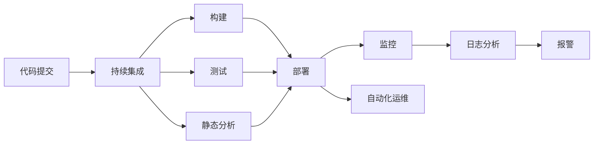

                 

# DevOps的理念与工具链生态

## 1. 背景介绍

随着云计算、容器化、微服务等技术的发展，软件开发和运维变得更加复杂和挑战重重。DevOps（Development and Operations）理念应运而生，旨在通过打破传统Dev和Ops的壁垒，实现自动化、快速交付和持续集成/持续交付（CI/CD），提升软件开发的效率和质量。

DevOps实践的核心思想是“以开发为中心，运维为支撑”。通过建立反馈环路，从开发到生产的全生命周期管理自动化，减少人为干预，提升软件交付速度和质量。DevOps不仅仅是一种方法论，更是一种文化，强调团队协作、持续改进和快速响应。

## 2. 核心概念与联系

### 2.1 核心概念概述

为了更好地理解DevOps的理念与工具链生态，本节将介绍几个关键的概念：

- **持续集成（CI）**：通过自动化工具将代码的频繁提交与自动构建、测试过程结合起来，快速反馈代码质量，减少人为错误。

- **持续交付（CD）**：在CI的基础上，增加部署环节，实现从代码提交到生产环境部署的自动化，缩短交付周期。

- **自动化部署（Auto-Deployment）**：使用自动化工具将代码部署到服务器上，实现无人工干预的快速部署。

- **容器化（Containerization）**：将应用程序及其依赖打包到容器（如Docker）中，实现环境的一致性和独立性，方便部署和管理。

- **监控与日志（Monitoring & Logging）**：通过实时监控和日志记录，及时发现系统问题，分析故障原因，快速恢复和改进。

- **自动化运维（Auto-Operations）**：使用自动化工具对生产环境进行监控、故障恢复、扩缩容等操作，提升运维效率。

### 2.2 核心概念原理和架构的 Mermaid 流程图



这个流程图展示了DevOps的核心流程：从代码提交到持续集成、构建、测试、部署，再到监控和自动化运维。这些环节通过自动化工具连接起来，形成了一个持续反馈和迭代的闭环，提升了软件开发的效率和质量。

## 3. 核心算法原理 & 具体操作步骤

### 3.1 算法原理概述

DevOps的核心算法原理主要围绕自动化、持续集成/持续交付（CI/CD）和容器化展开。其核心目标是通过自动化工具链将软件开发、测试、部署、运维等环节进行无缝集成，提升整体效率和质量。

### 3.2 算法步骤详解

#### 3.2.1 持续集成（CI）

1. **版本控制（Version Control）**：使用如Git、SVN等版本控制系统管理代码变更。
2. **构建与测试（Build & Test）**：使用如Jenkins、Travis CI等工具对代码进行构建和自动化测试，如单元测试、集成测试等。
3. **持续集成管道（CI Pipeline）**：将代码提交、构建、测试等环节整合到自动化流水线中，自动执行，及时反馈代码质量。

#### 3.2.2 持续交付（CD）

1. **自动部署（Auto-Deployment）**：使用如Jenkins、GitLab CI等工具，将构建后的代码自动部署到测试或生产环境。
2. **环境一致性管理（Environment Consistency Management）**：使用容器技术（如Docker）和容器编排工具（如Kubernetes），确保各环境的一致性，方便部署和管理。
3. **持续交付流程（CD Pipeline）**：将构建、测试、部署等环节整合到自动化流水线中，自动执行，及时将代码交付到生产环境。

#### 3.2.3 自动化运维（Auto-Operations）

1. **监控与日志（Monitoring & Logging）**：使用如Prometheus、Grafana等工具进行实时监控和日志记录，及时发现和解决系统问题。
2. **故障恢复（Fault Recovery）**：使用自动化工具（如Ansible、Puppet）自动执行故障恢复操作，减少人为干预。
3. **扩缩容管理（Scalability Management）**：使用自动化工具（如Kubernetes）进行自动扩缩容管理，提升系统容量和稳定性。

### 3.3 算法优缺点

**优点**：
1. **提升效率**：自动化流水线和工具链将开发、测试、部署、运维等环节进行无缝集成，提升了整体效率。
2. **减少人为错误**：自动化工具减少了人工干预，降低了人为错误的概率。
3. **提升质量**：持续集成和持续交付能够及时发现和修复代码问题，提升了代码质量。
4. **快速响应**：自动化工具能够快速响应代码变更和故障，提升了系统稳定性。

**缺点**：
1. **依赖工具链**：DevOps的实现高度依赖自动化工具链，工具链的选择和配置可能会影响整个流程。
2. **学习曲线**：工具链和流程的复杂性可能会带来一定的学习曲线，需要一定的培训和经验。
3. **资源消耗**：自动化工具链和持续集成/持续交付流程需要大量的计算和存储资源。

### 3.4 算法应用领域

DevOps的理念与工具链生态已经在多个领域得到了广泛的应用，例如：

- **软件开发**：使用CI/CD流程提升软件开发的效率和质量，减少人为错误。
- **云服务**：使用容器化和自动化运维技术，提升云服务的部署和运维效率。
- **金融科技**：使用DevOps实践，提升金融应用的安全性和稳定性。
- **物联网**：使用DevOps工具链管理物联网设备的开发和部署，提升设备管理的效率。
- **自动化测试**：使用自动化测试工具链，提升测试覆盖率和测试效率。

## 4. 数学模型和公式 & 详细讲解 & 举例说明

### 4.1 数学模型构建

在DevOps的实现中，数学模型的构建主要围绕自动化流水线和持续集成/持续交付流程展开。这里以Jenkins为例，构建一个简单的持续集成/持续交付模型。

假设Jenkins的CI Pipeline配置如下：

1. **代码提交**：当代码提交到Git仓库后，触发Jenkins的CI Pipeline。
2. **构建与测试**：Jenkins自动从Git仓库拉取最新代码，构建并执行自动化测试脚本。
3. **持续交付**：如果测试通过，Jenkins自动将构建后的代码部署到测试环境，并执行部署脚本。
4. **监控与日志**：部署完成后，Jenkins自动开启监控和日志记录，记录部署过程和系统状态。

### 4.2 公式推导过程

假设测试通过的概率为$p$，部署成功的概率为$q$，监控发现的故障概率为$r$，故障恢复的平均时间（MTTR）为$t$，则整个CI/CD流程的成功概率为：

$$
P_{\text{success}} = p \times q \times (1 - r)
$$

故障恢复的时间成本为：

$$
C_{\text{MTTR}} = t \times r
$$

通过数学模型推导，可以直观地看到各个环节的失败概率和成本，从而优化CI/CD流程。

### 4.3 案例分析与讲解

以GitLab CI为例，分析其CI/CD流程和数学模型：

1. **代码提交**：当代码提交到Git仓库后，触发GitLab CI Pipeline。
2. **构建与测试**：GitLab CI自动从Git仓库拉取最新代码，构建并执行自动化测试脚本。
3. **持续交付**：如果测试通过，GitLab CI自动将构建后的代码部署到测试或生产环境，并执行部署脚本。
4. **监控与日志**：部署完成后，GitLab CI自动开启监控和日志记录，记录部署过程和系统状态。

假设构建成功的概率为$p$，测试通过的概率为$q$，部署成功的概率为$r$，监控发现的故障概率为$s$，故障恢复的平均时间（MTTR）为$t$，则整个CI/CD流程的成功概率为：

$$
P_{\text{success}} = p \times q \times r \times (1 - s)
$$

故障恢复的时间成本为：

$$
C_{\text{MTTR}} = t \times s
$$

通过数学模型推导，可以直观地看到各个环节的失败概率和成本，从而优化CI/CD流程。

## 5. 项目实践：代码实例和详细解释说明

### 5.1 开发环境搭建

在进行DevOps实践前，我们需要准备好开发环境。以下是使用Jenkins进行持续集成的环境配置流程：

1. 安装Jenkins：从官网下载并安装Jenkins，并配置Jenkins的主机和端口。
2. 安装插件：安装Git、GitLab、Maven、Gradle等插件，以便进行持续集成。
3. 配置Git仓库：在Jenkins中添加Git仓库的地址、用户名和密码，以便Jenkins能够拉取和提交代码。

### 5.2 源代码详细实现

这里我们以Jenkins的CI Pipeline配置为例，给出完整的CI Pipeline配置文件：

```groovy
pipeline {
    agent any
    stages {
        stage('构建') {
            steps {
                git branch: 'master', url: 'https://github.com/example/example.git'
                sh 'mvn clean install'
            }
        }
        stage('测试') {
            steps {
                sh 'mvn test'
            }
        }
        stage('部署') {
            steps {
                withMaven 'maven3:1.7.1' {
                    sh 'mvn package'
                    withMaven 'maven3:1.7.1' {
                        sh 'mvn clean deploy'
                    }
                }
            }
        }
        stage('监控') {
            steps {
                sh 'curl http://localhost:8080/actuator/health'
                sh 'curl http://localhost:8080/actuator/logs'
            }
        }
    }
}
```

该配置文件包括构建、测试、部署和监控四个阶段，每个阶段执行相应的命令，将构建结果自动提交到测试环境和生产环境，并开启监控。

### 5.3 代码解读与分析

**Pipeline脚本**：
- `pipeline`关键字定义一个Jenkins Pipeline。
- `agent any`表示使用任意类型的代理。
- `stages`关键字定义Pipeline的阶段，每个阶段执行相应的命令。
- `stage`关键字定义Pipeline的子任务，可以包含多个`steps`。
- `git`关键字指定Git仓库的地址和分支。
- `sh`关键字执行命令行命令。

**Pipeline配置**：
- 构建阶段使用`mvn clean install`命令编译项目。
- 测试阶段使用`mvn test`命令执行单元测试。
- 部署阶段使用`mvn package`命令打包项目，使用`mvn clean deploy`命令部署到测试环境和生产环境。
- 监控阶段使用`curl`命令访问Jenkins Actuator接口，获取系统的健康状态和日志。

## 6. 实际应用场景

### 6.1 软件开发

DevOps的理念与工具链生态在软件开发领域得到了广泛应用。通过CI/CD流程，开发人员可以频繁提交代码，并通过自动化工具链进行构建和测试，及时反馈代码质量，提升开发效率。

在实际应用中，可以使用Jenkins、GitLab CI等工具进行持续集成和持续交付，使用Docker进行容器化，使用Kubernetes进行自动化部署和运维。通过DevOps实践，开发团队可以及时发现和修复代码问题，快速交付软件，提升软件质量和用户满意度。

### 6.2 云服务

云服务提供商广泛应用DevOps理念与工具链生态，提升云服务的自动化程度和部署效率。通过CI/CD流程，开发人员可以频繁提交代码，并通过自动化工具链进行构建、测试和部署，快速将代码部署到云平台。

在实际应用中，可以使用Jenkins、GitLab CI等工具进行持续集成和持续交付，使用Docker进行容器化，使用Kubernetes进行自动化部署和运维。通过DevOps实践，云服务提供商可以快速响应用户需求，提升服务质量和用户体验。

### 6.3 金融科技

金融科技公司广泛应用DevOps理念与工具链生态，提升金融应用的安全性和稳定性。通过CI/CD流程，开发人员可以频繁提交代码，并通过自动化工具链进行构建、测试和部署，快速将代码部署到生产环境。

在实际应用中，可以使用Jenkins、GitLab CI等工具进行持续集成和持续交付，使用Docker进行容器化，使用Kubernetes进行自动化部署和运维。通过DevOps实践，金融科技公司可以及时发现和修复代码问题，提升金融应用的安全性和稳定性，保障金融业务的连续性和可靠性。

### 6.4 物联网

物联网设备广泛应用DevOps理念与工具链生态，提升设备管理的自动化程度和效率。通过CI/CD流程，开发人员可以频繁提交代码，并通过自动化工具链进行构建、测试和部署，快速将代码部署到物联网设备上。

在实际应用中，可以使用Jenkins、GitLab CI等工具进行持续集成和持续交付，使用Docker进行容器化，使用Kubernetes进行自动化部署和运维。通过DevOps实践，物联网设备制造商可以及时发现和修复代码问题，提升设备管理的自动化程度和效率，保障设备的稳定性和可靠性。

### 6.5 自动化测试

自动化测试工具广泛应用DevOps理念与工具链生态，提升测试效率和测试覆盖率。通过CI/CD流程，测试人员可以频繁提交测试用例，并通过自动化工具链进行构建和测试，及时反馈测试结果。

在实际应用中，可以使用Jenkins、GitLab CI等工具进行持续集成和持续交付，使用Selenium、Appium等工具进行自动化测试，使用JMeter、LoadRunner等工具进行性能测试。通过DevOps实践，测试团队可以及时发现和修复测试问题，提升测试效率和测试覆盖率，保障软件质量。

## 7. 工具和资源推荐

### 7.1 学习资源推荐

为了帮助开发者系统掌握DevOps的理念与工具链生态，这里推荐一些优质的学习资源：

1. **《DevOps实践指南》**：Jez Humble和David Farley撰写的经典著作，详细介绍了DevOps理念与工具链生态。
2. **《Jenkins用户手册》**：Jenkins官方文档，提供了Jenkins的安装、配置和使用的详细指南。
3. **《Kubernetes：生产实践》**：Kubernetes官方文档，提供了Kubernetes的安装、配置和使用的详细指南。
4. **《Docker实战》**：Docker官方文档，提供了Docker的安装、配置和使用的详细指南。
5. **《GitLab DevOps指南》**：GitLab官方文档，提供了GitLab的安装、配置和使用的详细指南。

通过对这些资源的学习实践，相信你一定能够快速掌握DevOps的理念与工具链生态，并用于解决实际的开发和运维问题。

### 7.2 开发工具推荐

高效的开发离不开优秀的工具支持。以下是几款用于DevOps实践的常用工具：

1. **Jenkins**：持续集成和持续交付的首选工具，支持丰富的插件和扩展。
2. **GitLab CI/CD**：GitLab提供的持续集成和持续交付工具，支持丰富的配置和调度。
3. **Git**：版本控制系统，广泛用于代码管理。
4. **Docker**：容器化工具，支持应用程序和依赖的打包和分发。
5. **Kubernetes**：容器编排工具，支持容器的自动部署和扩展。
6. **Prometheus**：监控工具，支持实时的数据收集和可视化。
7. **Grafana**：仪表板工具，支持实时的数据可视化和告警。
8. **Ansible**：自动化运维工具，支持自动化部署和管理。

合理利用这些工具，可以显著提升DevOps实践的效率和质量，加快创新迭代的步伐。

### 7.3 相关论文推荐

DevOps的理念与工具链生态已经形成了较为成熟的研究领域，以下是几篇奠基性的相关论文，推荐阅读：

1. **《A Survey on DevOps: Its Impact on Software Delivery Practices》**：Toraldo等人撰写的综述性论文，详细介绍了DevOps理念与工具链生态的影响。
2. **《CI/CD for Cloud-Native Applications》**：Brougham等人撰写的论文，介绍了云原生应用和CI/CD流程的结合。
3. **《The Continuous Integration System Architecture》**：Smith等人撰写的论文，介绍了持续集成系统的架构和实现。
4. **《An Overview of Automated Deployment in DevOps》**：Moon等人撰写的论文，介绍了自动化部署在DevOps中的应用。
5. **《The Impact of Continuous Integration on Software Quality》**：Ford等人撰写的论文，介绍了持续集成对软件质量的影响。

这些论文代表了大规模软件开发的DevOps实践研究，帮助理解DevOps理念与工具链生态的核心思想和技术方法。

## 8. 总结：未来发展趋势与挑战

### 8.1 研究成果总结

本文对DevOps的理念与工具链生态进行了全面系统的介绍。首先阐述了DevOps的理念与工具链生态的研究背景和意义，明确了DevOps在提升软件交付效率和质量方面的独特价值。其次，从原理到实践，详细讲解了DevOps的核心算法原理和具体操作步骤，给出了DevOps任务开发的完整代码实例。同时，本文还广泛探讨了DevOps理念与工具链生态在软件开发、云服务、金融科技、物联网、自动化测试等多个领域的应用前景，展示了DevOps范式的巨大潜力。此外，本文精选了DevOps技术的各类学习资源，力求为读者提供全方位的技术指引。

通过本文的系统梳理，可以看到，DevOps的理念与工具链生态已经成为软件开发和运维的重要方法论，极大地提升了软件交付的效率和质量。未来，伴随DevOps技术的不断演进，相信DevOps范式将进一步拓展，在更多领域得到应用，为软件工程的发展带来深远影响。

### 8.2 未来发展趋势

展望未来，DevOps的理念与工具链生态将呈现以下几个发展趋势：

1. **全生命周期自动化**：DevOps的实践范围将进一步扩大，从开发到生产的全生命周期都将实现自动化，提升整体效率。
2. **微服务架构**：DevOps将与微服务架构紧密结合，提升系统的模块化和可扩展性，减少跨服务依赖。
3. **云原生技术**：DevOps将与云原生技术深度融合，提升云服务的自动化部署和运维能力。
4. **自动化工具链**：DevOps的工具链将更加丰富和多样化，支持更多平台和环境，提升开发和运维效率。
5. **持续学习和改进**：DevOps将引入机器学习、持续学习等技术，提升自动化流程的智能性和适应性。

这些趋势凸显了DevOps技术的广泛应用前景，将进一步提升软件开发和运维的效率和质量，推动软件工程的发展。

### 8.3 面临的挑战

尽管DevOps的理念与工具链生态已经取得了瞩目成就，但在迈向更加智能化、普适化应用的过程中，它仍面临着诸多挑战：

1. **工具链选择复杂**：DevOps的工具链种类繁多，选择和管理工具链是一个复杂的过程，需要考虑工具的兼容性、扩展性和稳定性。
2. **学习曲线陡峭**：DevOps的工具链和实践方法需要一定的学习曲线，特别是在复杂环境中，可能需要较高的技术水平。
3. **资源消耗大**：DevOps的自动化流程需要大量的计算和存储资源，特别是在大规模环境中，资源消耗是一个重要问题。
4. **安全性和可靠性**：DevOps的自动化流程可能会引入新的安全漏洞和可靠性问题，需要加强安全管理和监控。
5. **团队协作困难**：DevOps需要团队协作，但在实际应用中，不同的开发和运维团队可能会存在沟通和协作的障碍。

这些挑战需要开发者在实践中不断探索和优化，通过持续改进和创新，逐步克服。只有不断优化DevOps实践，才能充分发挥其优势，提升整体效率和质量。

### 8.4 研究展望

面对DevOps理念与工具链生态面临的挑战，未来的研究需要在以下几个方面寻求新的突破：

1. **自动化工具链优化**：开发更加智能、高效和稳定的自动化工具链，提升DevOps的自动化程度和效率。
2. **持续学习和改进**：引入机器学习、持续学习等技术，提升DevOps自动化流程的智能性和适应性，避免过拟合和路径依赖。
3. **安全性与可靠性**：引入安全管理和监控机制，提升DevOps自动化流程的安全性和可靠性，确保系统稳定运行。
4. **团队协作工具**：开发更加高效的团队协作工具，促进不同团队之间的沟通和协作，提升团队合作效率。
5. **云原生技术融合**：深入研究云原生技术与DevOps的融合，提升云服务的自动化部署和运维能力，降低云平台运维成本。

这些研究方向的探索，将引领DevOps技术迈向更高的台阶，为软件开发和运维带来更大的提升。只有不断探索和创新，才能充分发挥DevOps的优势，推动软件工程的发展。

## 9. 附录：常见问题与解答

**Q1：如何选择合适的DevOps工具链？**

A: 选择合适的DevOps工具链需要考虑以下几个方面：
1. **适用性**：选择适合自己团队和环境的工具链，考虑工具链的兼容性、扩展性和稳定性。
2. **易用性**：选择易于上手和使用的工具链，减少学习和使用成本。
3. **社区支持**：选择有活跃社区支持和丰富文档的工具链，便于问题的解决和技术的更新。
4. **成本效益**：选择成本效益高的工具链，避免不必要的资源浪费。

**Q2：如何使用DevOps提高开发效率？**

A: 使用DevOps提高开发效率需要以下几个步骤：
1. **持续集成（CI）**：通过自动化工具链，将代码提交、构建和测试环节进行无缝集成，及时反馈代码质量。
2. **持续交付（CD）**：通过自动化工具链，将构建和测试结果自动部署到生产环境，快速交付软件。
3. **自动化运维（Auto-Operations）**：通过自动化工具链，对生产环境进行监控、故障恢复和扩缩容管理，提升运维效率。
4. **反馈环路**：通过持续集成和持续交付流程，形成持续反馈环路，提升开发效率和质量。

**Q3：如何应对DevOps工具链的资源消耗问题？**

A: 应对DevOps工具链的资源消耗问题需要以下几个方面：
1. **资源优化**：使用梯度积累、混合精度训练等技术，优化模型的资源消耗。
2. **环境管理**：使用容器化和容器编排工具，管理环境的一致性和独立性，减少资源浪费。
3. **缓存机制**：使用缓存机制，减少重复计算和数据传输，提升效率。
4. **云资源管理**：使用云资源管理工具，动态调整资源配置，平衡性能和成本。

**Q4：如何提升DevOps的自动化程度？**

A: 提升DevOps的自动化程度需要以下几个步骤：
1. **自动化流水线**：将开发、测试、部署、运维等环节整合到自动化流水线中，自动执行。
2. **自动化测试**：使用自动化测试工具链，提升测试效率和测试覆盖率。
3. **自动化部署**：使用自动化部署工具链，快速将代码部署到生产环境。
4. **自动化监控和运维**：使用自动化监控和运维工具链，提升系统的自动化程度和稳定性。

**Q5：如何保障DevOps的安全性和可靠性？**

A: 保障DevOps的安全性和可靠性需要以下几个方面：
1. **安全管理**：引入安全管理和监控机制，及时发现和修复安全漏洞。
2. **可靠性管理**：引入可靠性管理和监控机制，确保系统稳定运行。
3. **风险管理**：引入风险管理和监控机制，评估和控制风险。
4. **合规管理**：确保DevOps实践符合相关法律法规和标准规范。

这些问题是DevOps实践中的常见问题，通过系统回答和分析，希望能够帮助开发者更好地理解和使用DevOps技术。

---

作者：禅与计算机程序设计艺术 / Zen and the Art of Computer Programming

