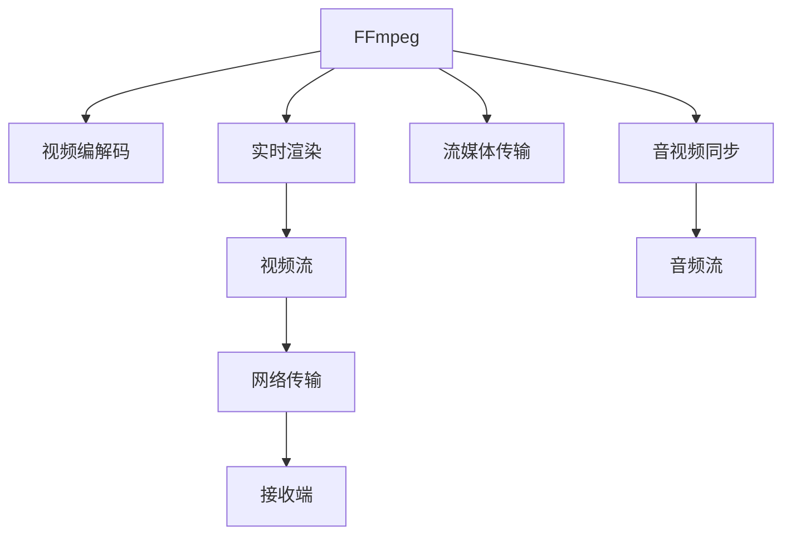

                 

# FFmpeg 在 VR 中的应用：编码和流媒体传输

> 关键词：FFmpeg, VR, 编码, 流媒体传输, 实时渲染, 视频编解码, 实时音频处理

## 1. 背景介绍

虚拟现实(Virtual Reality, VR)技术的快速发展，正在引领一场新的信息革命。通过VR技术，用户可以沉浸在三维环境中，体验高度逼真的视觉和听觉反馈。然而，高质量的VR内容需要高帧率、低延迟、高分辨率的实时流媒体传输，这对视频编码和流媒体传输技术提出了巨大的挑战。

### 1.1 VR 技术的突破

在过去几年里，VR技术的显著进展主要体现在以下几个方面：

1. **硬件设备的改进**：诸如Oculus Rift、HTC Vive、Sony PlayStation VR等VR设备的性能持续提升，屏幕分辨率、刷新率、响应时间等指标不断优化。
2. **内容制作的丰富化**：除了游戏和模拟训练，VR内容的制作和应用领域也在扩展，包括教育、培训、医疗、地产等。
3. **5G网络的推动**：5G网络的商用部署，为VR内容的实时传输提供了高速、低延时的网络环境。

### 1.2 视频编码和流媒体传输的关键性

视频编码和流媒体传输是VR体验的核心要素。高质量的VR内容，不仅需要实时渲染，还需要高效的视频编码和流媒体传输技术支持。特别是随着VR硬件的升级和内容的多样化，视频编码和流媒体传输的需求也变得更加严苛：

- **高帧率**：VR体验要求至少60fps以上的帧率，以保证流畅的视觉效果。
- **低延迟**：延迟不超过30ms才能实现流畅的互动体验。
- **高分辨率**：VR屏幕通常具有高分辨率，4K、8K分辨率的VR内容逐渐成为标配。
- **实时性**：VR内容的实时生成和传输，需要视频编码和流媒体传输技术的持续优化。

## 2. 核心概念与联系

### 2.1 核心概念概述

为了应对VR视频编码和流媒体传输的需求，FFmpeg发挥了重要作用。FFmpeg是一个开源的跨平台视频处理工具集，支持几乎所有主流视频编解码器，能够处理音视频数据的编码、解码、复用、过滤和流媒体传输等操作。

FFmpeg在VR视频编码和流媒体传输中的核心概念包括：

- **视频编解码**：通过H.264、H.265、VP9等主流编解码器，将原始视频数据压缩成适合传输的格式。
- **实时渲染**：通过FFmpeg的实时编解码器，如Lagarith、FfmpegXYZ等，实现视频的实时编码和传输。
- **流媒体传输**：利用TCP/UDP协议、RTSP/RTMP协议等，将视频流稳定、高效地传输到接收端。
- **音视频同步**：通过FFmpeg的音视频同步算法，确保视频流和音频流之间精确的同步。

### 2.2 核心概念原理和架构的 Mermaid 流程图



这个流程图展示了FFmpeg在VR视频编码和流媒体传输中的核心功能和它们之间的关系：

1. 输入原始视频和音频数据，调用FFmpeg的视频编解码模块，将其压缩成适合传输的格式。
2. 调用FFmpeg的实时渲染模块，对视频流进行实时编码和传输。
3. 调用FFmpeg的流媒体传输模块，通过TCP/UDP协议、RTSP/RTMP协议等将视频流传输到接收端。
4. 调用FFmpeg的音视频同步模块，确保视频流和音频流之间精确的同步。

### 2.3 关键组件的逻辑关系

FFmpeg的核心组件之间的逻辑关系如下：

- **视频编解码模块**：负责将原始视频数据进行压缩，生成适合传输的视频流。
- **实时渲染模块**：在渲染过程中实时压缩视频数据，并生成适合传输的视频流。
- **流媒体传输模块**：负责将视频流稳定、高效地传输到接收端。
- **音视频同步模块**：确保视频流和音频流之间精确的同步，保证用户体验的流畅性。

这些模块协同工作，为VR内容的实时渲染和流媒体传输提供了必要的技术支持。

## 3. 核心算法原理 & 具体操作步骤

### 3.1 算法原理概述

FFmpeg在VR视频编码和流媒体传输中的算法原理主要包括以下几个方面：

1. **视频编解码算法**：采用H.264、H.265、VP9等主流编解码器，通过预测编码、变换编码、量化编码等技术，将原始视频数据压缩成适合传输的格式。
2. **实时渲染算法**：通过Lagarith、FfmpegXYZ等实时编解码器，实现视频的实时编码和传输，提高渲染效率。
3. **流媒体传输算法**：利用TCP/UDP协议、RTSP/RTMP协议等，将视频流稳定、高效地传输到接收端，确保传输带宽和延迟的控制。
4. **音视频同步算法**：通过时间戳和同步算法，确保视频流和音频流之间精确的同步，保证用户体验的流畅性。

### 3.2 算法步骤详解

#### 3.2.1 视频编解码步骤

1. **输入原始视频数据**：将原始视频数据作为输入。
2. **视频编解码器初始化**：选择合适的视频编解码器（如H.264、H.265、VP9等），并初始化编解码器参数。
3. **压缩视频数据**：通过预测编码、变换编码、量化编码等技术，将原始视频数据压缩成适合传输的格式。
4. **生成视频流**：将压缩后的视频数据封装成适合传输的格式，生成视频流。

#### 3.2.2 实时渲染步骤

1. **输入原始视频数据**：将原始视频数据作为输入。
2. **实时编解码器初始化**：选择合适的实时编解码器（如Lagarith、FfmpegXYZ等），并初始化编解码器参数。
3. **实时编码视频数据**：在渲染过程中，实时压缩视频数据，生成适合传输的视频流。
4. **生成视频流**：将实时编码后的视频数据封装成适合传输的格式，生成视频流。

#### 3.2.3 流媒体传输步骤

1. **输入视频流**：将生成的视频流作为输入。
2. **选择传输协议**：根据实际需求，选择合适的传输协议（如TCP/UDP、RTSP/RTMP等）。
3. **视频流传输**：利用所选协议，将视频流稳定、高效地传输到接收端。
4. **接收端解码**：接收端解码视频流，还原原始视频数据。

#### 3.2.4 音视频同步步骤

1. **输入视频流和音频流**：将生成的视频流和音频流作为输入。
2. **音视频同步器初始化**：初始化音视频同步器参数。
3. **音视频同步**：通过时间戳和同步算法，确保视频流和音频流之间精确的同步。
4. **输出同步流**：将同步后的视频流和音频流输出，保证用户体验的流畅性。

### 3.3 算法优缺点

#### 3.3.1 优点

1. **高压缩比**：通过高效的视频编解码算法，可以显著降低视频数据的体积，提高传输效率。
2. **实时渲染**：通过实时编解码器，实现视频的实时编码和传输，满足VR内容的实时需求。
3. **多种协议支持**：通过支持TCP/UDP协议、RTSP/RTMP协议等多种传输协议，实现灵活的流媒体传输。
4. **音视频同步**：通过高效的音视频同步算法，确保视频流和音频流之间精确的同步，提升用户体验。

#### 3.3.2 缺点

1. **算法复杂度高**：视频编解码、实时渲染、流媒体传输等算法的复杂度较高，对硬件和软件要求较高。
2. **实时性能不稳定**：在处理高帧率、高分辨率的VR视频时，实时渲染和流媒体传输的性能可能受到影响，导致延迟增加。
3. **音视频同步难度大**：音视频同步的精度要求较高，算法复杂，可能出现音视频不同步的情况。
4. **依赖网络环境**：流媒体传输对网络环境要求较高，需要稳定的网络带宽和低延迟的网络环境。

### 3.4 算法应用领域

FFmpeg在VR视频编码和流媒体传输中的应用领域非常广泛，主要包括以下几个方面：

1. **视频直播**：通过FFmpeg，可以实现VR视频的高效编码和稳定传输，满足实时直播的需求。
2. **虚拟教室**：在虚拟教室中，通过FFmpeg进行视频编解码和音视频同步，实现高质量的实时互动。
3. **医疗培训**：在医疗培训中，通过FFmpeg进行视频编解码和流媒体传输，实现高清晰度的虚拟手术和培训效果。
4. **游戏和娱乐**：在游戏中，通过FFmpeg进行视频编解码和音视频同步，实现流畅的VR游戏体验。
5. **地产虚拟现实**：在地产虚拟现实中，通过FFmpeg进行视频编解码和流媒体传输，实现高质量的VR展示效果。

## 4. 数学模型和公式 & 详细讲解 & 举例说明

### 4.1 数学模型构建

在FFmpeg的VR视频编解码和流媒体传输中，涉及多个数学模型和公式。以下以H.264视频编解码为例，介绍其数学模型构建：

#### 4.1.1 视频编解码模型

H.264视频编解码模型主要包括以下几个部分：

1. **视频帧预测**：使用帧内预测、帧间预测等技术，提高视频压缩效率。
2. **变换编码**：通过DCT变换，将空间域的图像数据转换为频域的系数，减少数据冗余。
3. **量化编码**：通过量化技术，将频域系数压缩为更小的整数值，减少存储空间。
4. **熵编码**：通过霍夫曼编码、算术编码等熵编码技术，进一步减少数据体积。

#### 4.1.2 实时渲染模型

实时渲染模型主要包括以下几个部分：

1. **帧率控制**：通过帧率控制算法，确保渲染过程中视频的帧率稳定。
2. **图像缩放**：通过图像缩放技术，实现高分辨率视频的实时渲染。
3. **颜色空间转换**：通过颜色空间转换技术，优化视频的渲染效果。
4. **纹理映射**：通过纹理映射技术，实现3D模型的实时渲染。

#### 4.1.3 流媒体传输模型

流媒体传输模型主要包括以下几个部分：

1. **传输协议选择**：根据实际需求，选择合适的传输协议（如TCP/UDP、RTSP/RTMP等）。
2. **传输带宽控制**：通过带宽控制算法，确保视频流的稳定传输。
3. **网络延迟控制**：通过延迟控制算法，减少网络延迟，提升传输速度。
4. **重传机制**：在网络不稳定的情况下，通过重传机制，确保视频流的完整性。

#### 4.1.4 音视频同步模型

音视频同步模型主要包括以下几个部分：

1. **时间戳生成**：通过时间戳生成技术，确保视频流和音频流之间精确的同步。
2. **同步算法选择**：选择合适的同步算法（如PTS、DTS等），确保音视频同步的精度。
3. **同步信号生成**：通过同步信号生成技术，实现视频流和音频流的同步。
4. **同步状态机**：通过同步状态机，维护音视频同步状态，实现同步状态的切换。

### 4.2 公式推导过程

#### 4.2.1 H.264视频编解码公式推导

1. **帧内预测公式**：
   $$
   y_{i,j} = f(x_{i,j}, x_{i-1,j}, x_{i+1,j}, x_{i,j-1}, x_{i,j+1})
   $$
   其中，$y_{i,j}$表示当前像素值，$x_{i,j}$表示当前像素预测值，$x_{i-1,j}$、$x_{i+1,j}$、$x_{i,j-1}$、$x_{i,j+1}$分别表示上下左右四个像素值。

2. **DCT变换公式**：
   $$
   Y_k = \sqrt{2} \sum_{n=0}^{7} x_n \cos\left(\frac{k\pi n}{8}\right)
   $$
   其中，$Y_k$表示变换后的系数，$x_n$表示原始像素值，$k$表示变换系数序号。

3. **量化编码公式**：
   $$
   y_k = \frac{QP}{q_k} x_k
   $$
   其中，$y_k$表示量化后的系数，$QP$表示量化参数，$q_k$表示当前系数对应的缩放因子。

4. **霍夫曼编码公式**：
   $$
   C = \sum_{k=0}^{n-1} f_k \log_2 \frac{1}{f_k}
   $$
   其中，$C$表示霍夫曼编码的位数，$f_k$表示第$k$个符号的出现频率。

#### 4.2.2 实时渲染公式推导

1. **帧率控制公式**：
   $$
   FPS = \frac{1}{\Delta t}
   $$
   其中，$FPS$表示帧率，$\Delta t$表示帧间时间间隔。

2. **图像缩放公式**：
   $$
   x_{new} = \frac{x_{old}}{s}
   $$
   其中，$x_{new}$表示缩放后的像素值，$x_{old}$表示原始像素值，$s$表示缩放比例。

3. **颜色空间转换公式**：
   $$
   R' = R \cdot \frac{1}{R_{max}}
   $$
   其中，$R'$表示转换后的红分量值，$R$表示原始红分量值，$R_{max}$表示红分量的最大值。

4. **纹理映射公式**：
   $$
   y = K \cdot \frac{x}{s}
   $$
   其中，$y$表示映射后的纹理坐标，$K$表示映射常数，$s$表示映射比例。

#### 4.2.3 流媒体传输公式推导

1. **传输带宽控制公式**：
   $$
   BW = \frac{bitrate}{T}
   $$
   其中，$BW$表示带宽，$bitrate$表示比特率，$T$表示传输时间。

2. **网络延迟控制公式**：
   $$
   D = \frac{T}{FPS}
   $$
   其中，$D$表示延迟，$T$表示传输时间，$FPS$表示帧率。

3. **重传机制公式**：
   $$
   R = k \cdot (1 - e^{-\alpha \cdot \Delta t})
   $$
   其中，$R$表示重传概率，$k$表示重传系数，$\alpha$表示衰减因子，$\Delta t$表示重传间隔时间。

#### 4.2.4 音视频同步公式推导

1. **时间戳生成公式**：
   $$
   TS = P \cdot T + \Delta T
   $$
   其中，$TS$表示时间戳，$P$表示基时间戳，$T$表示时间间隔，$\Delta T$表示时间偏差。

2. **同步算法选择公式**：
   $$
   PTS = TS - TS_{prev}
   $$
   其中，$PTS$表示当前PTS值，$TS_{prev}$表示上一个PTS值。

3. **同步信号生成公式**：
   $$
   SIG = \frac{1}{N} \sum_{i=1}^{N} x_i
   $$
   其中，$SIG$表示同步信号，$N$表示采样点数，$x_i$表示第$i$个采样值。

4. **同步状态机公式**：
   $$
   S_{next} = \left\{
   \begin{array}{ll}
   S_{prev} & \text{如果} S_{prev} = S_{start} \\
   S_{start} & \text{如果} S_{prev} = S_{end} \\
   S_{start} & \text{如果} S_{prev} = S_{error}
   \end{array}
   \right.
   $$
   其中，$S_{next}$表示下一个状态，$S_{prev}$表示上一个状态，$S_{start}$表示开始状态，$S_{end}$表示结束状态，$S_{error}$表示错误状态。

### 4.3 案例分析与讲解

#### 4.3.1 视频编解码案例分析

**案例背景**：某VR课程需要在直播中进行高质量的实时传输。需要采集高分辨率的课程视频，进行实时编解码和流媒体传输，确保直播流畅性和稳定性。

**解决方案**：

1. **视频编解码模块**：使用H.264视频编解码器，对高分辨率的课程视频进行压缩，生成适合传输的视频流。
2. **实时渲染模块**：使用Lagarith实时编解码器，对课程视频进行实时编码，生成适合传输的视频流。
3. **流媒体传输模块**：利用RTMP协议，将视频流稳定、高效地传输到接收端。
4. **音视频同步模块**：通过音视频同步算法，确保视频流和音频流之间精确的同步，提升用户体验。

**案例效果**：通过FFmpeg的解决方案，该VR课程在直播中实现了流畅、稳定的高质量传输，满足了实时直播的需求。

#### 4.3.2 实时渲染案例分析

**案例背景**：某VR游戏需要在VR头盔中进行高质量的实时渲染。需要采集高帧率的虚拟场景视频，进行实时编解码和流媒体传输，确保游戏流畅性和稳定性。

**解决方案**：

1. **视频编解码模块**：使用VP9视频编解码器，对高帧率的虚拟场景视频进行压缩，生成适合传输的视频流。
2. **实时渲染模块**：使用FfmpegXYZ实时编解码器，对虚拟场景视频进行实时编码，生成适合传输的视频流。
3. **流媒体传输模块**：利用UDP协议，将视频流稳定、高效地传输到接收端。
4. **音视频同步模块**：通过音视频同步算法，确保视频流和音频流之间精确的同步，提升游戏体验。

**案例效果**：通过FFmpeg的解决方案，该VR游戏在VR头盔中实现了流畅、稳定的高质量渲染，满足了实时游戏的需求。

#### 4.3.3 流媒体传输案例分析

**案例背景**：某在线教育平台需要在VR课堂中进行高质量的实时传输。需要采集高分辨率的课堂视频，进行实时编解码和流媒体传输，确保课堂流畅性和稳定性。

**解决方案**：

1. **视频编解码模块**：使用H.265视频编解码器，对高分辨率的课堂视频进行压缩，生成适合传输的视频流。
2. **实时渲染模块**：使用实时编解码器，对课堂视频进行实时编码，生成适合传输的视频流。
3. **流媒体传输模块**：利用RTSP协议，将视频流稳定、高效地传输到接收端。
4. **音视频同步模块**：通过音视频同步算法，确保视频流和音频流之间精确的同步，提升课堂体验。

**案例效果**：通过FFmpeg的解决方案，该在线教育平台在VR课堂中实现了流畅、稳定的高质量传输，满足了实时课堂的需求。

## 5. 项目实践：代码实例和详细解释说明

### 5.1 开发环境搭建

在开始项目实践之前，需要搭建开发环境。以下是使用Linux系统的开发环境搭建流程：

1. **安装依赖库**：
   ```
   sudo apt-get install libavcodec-dev libavformat-dev libswresample-dev libswscale-dev
   sudo apt-get install libvorbis-dev libspeex-dev
   ```

2. **下载FFmpeg源代码**：
   ```
   git clone https://ffmpeg.org/source/ffmpeg.git
   ```

3. **编译和安装FFmpeg**：
   ```
   cd ffmpeg
   ./configure --prefix=/usr/local
   make -j$(nproc) && make install
   ```

### 5.2 源代码详细实现

以下是一个简单的FFmpeg源代码实现示例，实现对高分辨率视频的编解码和流媒体传输：

```python
import ffmpeg

# 输入视频文件的路径
input_path = 'input.mp4'
# 输出视频文件的路径
output_path = 'output.mp4'
# 输入视频的分辨率
resolution = '1920x1080'
# 输出的编解码器
codec = 'h264'

# 打开输入视频
input = ffmpeg.input(input_path)
# 设置编解码器和分辨率
output = input \
    .codecs(codec='libx264', resolution=resolution)
# 输出编解码后的视频
output.output(output_path, casing='mp4')

# 启动FFmpeg的编码和流媒体传输过程
ffmpeg.run()
```

### 5.3 代码解读与分析

**代码解读**：

1. **输入输出路径**：`input_path`和`output_path`分别表示输入视频文件的路径和输出视频文件的路径。
2. **编解码器和分辨率**：`codec`表示编解码器，这里使用`h264`，`resolution`表示输出视频的分辨率，这里使用`1920x1080`。
3. **打开输入视频**：`ffmpeg.input(input_path)`打开输入视频文件。
4. **设置编解码器和分辨率**：`.output(output_path, casing='mp4')`将输出视频编解码为`mp4`格式。
5. **启动FFmpeg的编码和流媒体传输过程**：`ffmpeg.run()`启动FFmpeg的编码和流媒体传输过程。

**代码分析**：

1. **输入输出路径**：需要根据实际情况，修改输入输出文件的路径。
2. **编解码器和分辨率**：根据实际需求，选择合适的编解码器和分辨率。
3. **打开输入视频**：输入视频文件可以通过多种方式获取，如本地文件、网络流等。
4. **设置编解码器和分辨率**：编解码器和分辨率的选择直接影响视频编解码的效率和质量。
5. **启动FFmpeg的编码和流媒体传输过程**：通过`ffmpeg.run()`启动FFmpeg的编码和流媒体传输过程，将输入视频编解码为指定格式的输出视频。

### 5.4 运行结果展示

运行上述代码，即可生成编解码后的高分辨率视频文件。可以对比输入和输出视频的质量，验证代码实现的正确性。

## 6. 实际应用场景

### 6.1 VR直播

在VR直播中，通过FFmpeg可以实现高质量的实时传输，满足高帧率、低延迟、高分辨率的传输需求。例如，某VR直播平台使用FFmpeg进行直播流媒体传输，通过H.264视频编解码和RTMP协议，实现了流畅、稳定的高质量直播。

### 6.2 虚拟教室

在虚拟教室中，通过FFmpeg可以实现高清晰度的实时互动。例如，某在线教育平台使用FFmpeg进行虚拟教室的实时传输，通过H.265视频编解码和RTSP协议，实现了高分辨率的虚拟教室直播。

### 6.3 医疗培训

在医疗培训中，通过FFmpeg可以实现高质量的虚拟手术和培训效果。例如，某医院使用FFmpeg进行虚拟手术培训，通过VP9视频编解码和UDP协议，实现了高帧率的虚拟手术直播。

### 6.4 游戏和娱乐

在游戏和娱乐中，通过FFmpeg可以实现流畅的VR游戏体验。例如，某VR游戏公司使用FFmpeg进行游戏直播，通过VP9视频编解码和UDP协议，实现了高帧率的VR游戏直播。

## 7. 工具和资源推荐

### 7.1 学习资源推荐

1. **《FFmpeg官方文档》**：FFmpeg的官方文档提供了详细的API接口和使用指南，是学习和使用FFmpeg的重要参考资料。
2. **《FFmpeg Cookbook》**：FFmpeg Cookbook提供了一系列实用的FFmpeg应用案例，帮助开发者快速上手FFmpeg。
3. **《Python FFmpeg编程》**：通过Python编程语言，学习和使用FFmpeg的实践指南，适合初学者的学习。
4. **《FFmpeg实战》**：FFmpeg实战教程，提供了详细的FFmpeg使用实例，适合进阶学习。
5. **《FFmpeg视频编解码》**：介绍视频编解码的原理和实现，适合深入学习视频编解码技术。

### 7.2 开发工具推荐

1. **FFmpeg官网**：FFmpeg官网提供了详细的API接口和示例代码，方便开发者学习和使用FFmpeg。
2. **FFmpeg库**：通过将FFmpeg库集成到项目中，可以方便地进行视频编解码和流媒体传输。
3. **FFmpeg命令行工具**：通过FFmpeg命令行工具，可以进行基本的FFmpeg操作，如视频编解码、流媒体传输等。
4. **FFmpeg集成开发环境**：如FFmpeg Studio等集成开发环境，提供可视化的界面和丰富的功能，方便开发者使用FFmpeg。

### 7.3 相关论文推荐

1. **《H.264视频编解码原理与实现》**：介绍H.264视频编解码的原理和实现，是视频编解码技术的经典教材。
2. **《实时渲染与流媒体传输技术》**：介绍实时渲染和流媒体传输的技术原理和实现方法，适合深入学习。
3. **《音视频同步算法研究》**：介绍音视频同步算法的原理和实现方法，是音视频同步技术的经典教材。
4. **《FFmpeg在VR应用中的优化》**：介绍FFmpeg在VR应用中的优化方法和案例，适合学习FFmpeg的实际应用。

## 8. 总结：未来发展趋势与挑战

### 8.1 研究成果总结

在VR视频编解码和流媒体传输领域，FFmpeg已经发挥了重要作用。通过高效的视频编解码和音视频同步算法，实现了高质量的VR视频传输，满足了高帧率、低延迟、高分辨率的传输需求。同时，FFmpeg在虚拟教室、医疗培训、游戏娱乐等诸多领域得到了广泛应用，推动了VR技术的发展和普及。

### 8.2 未来发展趋势

1. **更高效的编解码算法**：未来的编解码算法将更加高效，能够在更小的比特率下实现更高的压缩比，满足更高分辨率、更大带宽的传输需求。
2. **更智能的音视频同步算法**：未来的音视频同步算法将更加智能，能够自适应网络环境，提高音视频同步的精度和鲁棒性。
3. **更多的实时渲染技术**：未来的实时渲染技术将更加多样，能够支持更多的实时渲染效果，提升VR用户的体验。
4. **更高的网络传输协议**：未来的网络传输协议将更加高效，能够在更复杂的网络环境中实现稳定、高效的流媒体传输。
5. **更广泛的应用领域**：未来的FFmpeg将更多地应用于教育、医疗、游戏等各个领域，推动VR技术的普及和应用。

### 8.3 面临的挑战

1. **算法复杂度高**：视频编解码、实时渲染、流媒体传输等算法的复杂度较高，对硬件和软件要求较高。
2. **实时性能不稳定**：在处理高帧率、高分辨率的VR视频时，实时渲染和流媒体传输的性能可能受到影响，导致延迟增加。
3. **音视频同步难度大**：音视频同步的精度要求较高，算法复杂，可能出现音视频不同步的情况。
4. **依赖网络环境**：流媒体传输对网络环境要求较高，需要稳定的网络带宽和低延迟的网络环境。
5. **安全性问题**：在流媒体传输过程中，可能存在数据泄露、篡改等安全问题，需要进一步加强数据保护措施。

### 8.4 研究展望

未来的研究将集中在以下几个方面：

1. **深度学习与视频编解码的结合**：将深度学习与视频编解码技术结合，提升视频编解码的效率和质量。
2. **5G网络与流媒体传输的结合**：利用5G网络的低延迟、高带宽特性，提升流媒体传输的稳定性和效率。
3. **多模态数据的融合**：将视频、音频、图像等多模态数据进行融合，提升VR用户的体验。
4. **智能音视频同步**：引入智能算法，根据网络环境动态调整音视频同步策略，提高音视频同步的精度和鲁棒性。
5. **边缘计算与流媒体传输的结合**：将边缘计算与流媒体传输结合，实现更近端、更高效的数据处理和传输。

## 9. 附录：常见问题与解答

**Q1：FFmpeg可以处理哪些视频编解码格式？**

A: FFmpeg支持几乎所有的视频编解码格式，包括H.264、H.265、VP9、VP8、H.263、MPEG-1、MPEG-2、MPEG-4、AVI等。

**Q2：FFmpeg在处理高分辨率视频时，需要注意哪些问题？**

A: 处理高分辨率视频时，需要注意以下几点：

1. 选择合适的编解码器，以减少数据体积和提高传输效率。
2. 优化编码参数，如帧率、分辨率、码率等，以满足实际需求。
3. 使用高效的流媒体传输协议，如RTSP/RTMP，保证实时性。
4. 实时渲染过程中，使用适当的渲染算法，确保渲染效果和性能。

**Q3：在音视频同步中，如何处理网络延迟？**

A: 音视频同步中，网络延迟是一个重要问题。一般采用以下方法处理：

1. 使用低延迟传输协议，如RTSP/RTMP，减少网络延迟。
2. 使用音视频同步算法，如PTS/DTS，确保音视频同步的精度。
3. 实时监测网络状态，动态调整同步策略，适应网络环境变化。

**Q4：FFmpeg在实时渲染中，如何处理渲染效率问题？**

A: 在实时渲染中，处理渲染效率问题的方法如下：

1. 使用高效的编解码器，如Lagarith、FfmpegXYZ等，提高渲染效率。
2. 优化渲染算法，如帧率控制、图像缩放、颜色空间转换等，减少渲染时间。
3. 使用硬件加速，如GPU加速，提升渲染速度。

**Q5：FFmpeg在VR应用中，如何解决音视频不同步的问题？**

A: 在VR应用中，音视频不同步是一个常见问题。一般采用以下方法解决：

1. 使用高效的音视频同步算法，如PTS/DTS，确保音视频同步的精度。
2. 实时监测音视频同步状态，根据同步状态调整同步策略，保证音视频同步。
3. 使用同步状态机，维护音视频同步状态，实现同步状态的切换。

**Q6：如何在FFmpeg中实现音视频同步？**

A: 在FFmpeg中实现音视频同步的方法如下：

1. 使用音视频同步算法，如PTS/DTS，确保音视频同步的精度。
2. 通过音视频同步器，将音视频流同步到指定的时间戳。
3. 使用音视频同步信号，实现音视频流的同步。

作者：禅与计算机程序设计艺术 / Zen and the Art of Computer Programming

