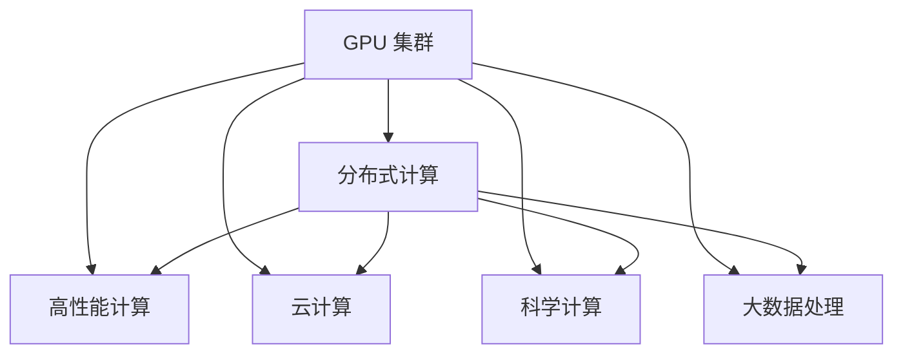

                 

# GPU 集群和分布式计算

> 关键词：GPU 集群,分布式计算,高性能计算,深度学习,科学计算,大数据处理,计算机网络,并行计算

## 1. 背景介绍

### 1.1 问题由来

随着计算任务的复杂度不断增加，传统的单机计算资源已无法满足需求。同时，数据集规模的爆炸式增长，也带来了巨大的存储和处理压力。为了应对这一挑战，研究人员和工程师们探索了各种计算模式。

分布式计算作为一种基于网络、计算机集群的高效计算方式，已经广泛应用于高性能计算、云计算、大数据处理等多个领域。特别是在深度学习和大数据处理任务中，分布式计算已成为必不可少的计算方式。

GPU 集群作为分布式计算中的一种重要形式，通过将多个GPU设备协同工作，实现了高性能的并行计算，显著提升了计算效率。本文将详细探讨GPU 集群和分布式计算的基本原理、关键技术以及应用实例。

## 2. 核心概念与联系

### 2.1 核心概念概述

为更好地理解GPU 集群和分布式计算，本节将介绍几个关键概念：

- **GPU 集群 (GPU Cluster)**：由多个GPU设备组成的计算集群，通过网络相互连接，共同完成计算任务。

- **分布式计算 (Distributed Computing)**：将计算任务分散到多个计算机节点上进行并行计算，提高计算效率和处理能力。

- **高性能计算 (High-Performance Computing, HPC)**：针对复杂计算密集型任务，如科学计算、深度学习、大数据处理等，提供高性能的计算能力。

- **云计算 (Cloud Computing)**：通过互联网提供可扩展的计算资源和存储服务，按需分配和使用计算资源。

- **科学计算 (Scientific Computing)**：利用计算机进行科学实验、模拟和数据分析等任务，加速科学研究进程。

- **大数据处理 (Big Data Processing)**：处理海量数据，从数据中提取有价值的信息和知识，进行数据挖掘、分析和可视化。

这些核心概念之间的逻辑关系可以通过以下Mermaid流程图来展示：



这个流程图展示了大语言模型的核心概念及其之间的关系：

1. GPU 集群通过多个GPU设备组成计算集群，实现并行计算。
2. 分布式计算将计算任务分散到多个计算机节点上进行并行计算，提高计算效率。
3. 高性能计算针对复杂计算密集型任务，如科学计算、深度学习等，提供高性能的计算能力。
4. 云计算通过互联网提供可扩展的计算资源和存储服务，按需分配和使用计算资源。
5. 科学计算利用计算机进行科学实验、模拟和数据分析等任务，加速科学研究进程。
6. 大数据处理处理海量数据，从数据中提取有价值的信息和知识，进行数据挖掘、分析和可视化。

这些核心概念共同构成了高性能计算和分布式计算的框架，使其能够在复杂计算密集型任务中发挥强大的计算能力。通过理解这些核心概念，我们可以更好地把握GPU 集群和分布式计算的工作原理和优化方向。

## 3. 核心算法原理 & 具体操作步骤
### 3.1 算法原理概述

GPU 集群和分布式计算的核心思想是：将大规模计算任务分散到多个计算节点上进行并行处理，通过网络通信协调各节点之间的数据传输和计算结果汇总，实现高性能计算。

在GPU 集群中，多个GPU设备通过高速网络互联，共同完成计算任务。每个GPU设备可以独立执行部分计算任务，并通过共享内存区域进行数据交换和同步。这种并行计算方式显著提高了计算效率，适用于深度学习、科学计算等计算密集型任务。

在分布式计算中，多个计算节点通过网络互联，共同完成计算任务。每个节点可以独立执行部分计算任务，并通过消息传递机制进行数据传输和结果汇总。分布式计算方式适用于数据密集型任务，如大数据处理、科学计算等。

### 3.2 算法步骤详解

GPU 集群和分布式计算的一般流程如下：

**Step 1: 准备计算资源**

1. 配置计算资源：根据任务需求，选择合适的GPU设备和网络设备，搭建GPU 集群。
2. 安装计算软件：在计算节点上安装所需的计算软件和库，如CUDA、cuDNN、MPI等，确保所有节点环境一致。

**Step 2: 设计任务并拆解**

1. 定义计算任务：明确计算任务的目标和输入输出格式，确定计算流程。
2. 任务拆解：将计算任务拆分成多个子任务，分配给不同的计算节点并行处理。

**Step 3: 数据分布与传输**

1. 数据拆分：将输入数据按照节点数进行拆分，确保每个节点能够独立处理部分数据。
2. 数据传输：通过网络通信将数据从源节点传输到目标节点，确保数据传输高效可靠。

**Step 4: 任务并行执行**

1. 节点启动：启动计算节点上的计算进程，开始执行子任务。
2. 数据交换：节点之间通过共享内存或消息传递机制进行数据交换和同步，确保计算结果一致。

**Step 5: 结果汇总与输出**

1. 结果收集：收集各个节点计算结果，进行汇总和整理。
2. 结果输出：将计算结果输出为最终结果，供用户使用。

### 3.3 算法优缺点

GPU 集群和分布式计算的优势在于：

1. **计算效率高**：通过并行计算，能够在短时间内完成大规模计算任务，加速计算进程。
2. **数据传输快**：通过高速网络通信，可以高效传输大量数据，确保数据传输速率。
3. **资源利用率高**：通过分布式计算，可以充分利用计算资源，提高资源利用效率。
4. **扩展性强**：通过增加计算节点，可以轻松扩展计算能力，支持更大规模的计算任务。

同时，这些方法也存在一些局限性：

1. **部署复杂**：需要配置大量计算资源，搭建计算集群，部署过程较为复杂。
2. **通信开销高**：数据传输和节点间通信开销较大，可能会影响计算效率。
3. **同步困难**：节点之间需要进行数据同步和通信协调，可能会导致同步问题。
4. **故障容错性差**：单个节点故障可能会导致整个计算任务失败，故障容错性较差。

尽管存在这些局限性，GPU 集群和分布式计算仍然是高性能计算和大型数据处理任务不可或缺的工具。未来相关研究的重点在于如何进一步提升通信效率、优化资源利用率，并提高系统的可扩展性和容错性。

### 3.4 算法应用领域

GPU 集群和分布式计算在多个领域得到了广泛应用，以下是一些典型的应用场景：

1. **深度学习训练**：通过并行计算，加速深度学习模型的训练过程，提高模型精度。
2. **科学计算**：如天气预报、模拟仿真等复杂科学计算任务，通过分布式计算实现高效计算。
3. **大数据处理**：处理海量数据，进行数据挖掘、分析和可视化，如Hadoop、Spark等大数据处理框架。
4. **生物信息学**：进行基因组分析、蛋白质结构预测等生物信息学计算任务。
5. **金融工程**：进行金融模型模拟、风险分析等金融计算任务。
6. **机器学习**：训练大规模机器学习模型，提升模型效果。
7. **图像处理**：处理大规模图像数据，进行图像识别、分割等任务。

除了上述这些经典应用外，GPU 集群和分布式计算还被创新性地应用于更多场景中，如自然语言处理、推荐系统、游戏仿真等，为高性能计算技术带来了新的突破。

## 4. 数学模型和公式 & 详细讲解
### 4.1 数学模型构建

为了更好地理解GPU 集群和分布式计算的计算模型，本节将使用数学语言对并行计算进行更加严格的刻画。

设任务 $T$ 需要计算的数据量为 $D$，计算复杂度为 $C$，单个节点的计算速度为 $v$，节点数为 $n$。在分布式计算中，任务 $T$ 被拆分为 $n$ 个子任务 $T_i$，每个节点独立执行子任务 $T_i$，计算时间分别为 $t_i$。

计算总时间为 $T_{total}$，则有：

$$
T_{total} = \sum_{i=1}^{n} t_i
$$

根据任务拆分的合理性，$t_i$ 与节点数 $n$ 的关系可以近似为：

$$
t_i = \frac{D}{n} + C/v
$$

因此，总计算时间可以表示为：

$$
T_{total} = \frac{nD}{n} + \frac{nC}{nv} = \frac{D}{n} + \frac{C}{v}
$$

可以看出，计算时间与节点数 $n$ 成反比，计算时间与节点速度 $v$ 成正比。

### 4.2 公式推导过程

以深度学习训练为例，推导分布式计算的时间复杂度。

设深度学习模型包含 $N$ 层神经网络，每一层的计算量为 $C_i$，总计算量为 $C_{total} = \sum_{i=1}^{N} C_i$。

在单节点计算中，每一层的计算时间分别为 $t_i = \frac{C_i}{v}$，总计算时间为 $T_{single} = \sum_{i=1}^{N} \frac{C_i}{v}$。

在分布式计算中，将计算任务拆分为 $n$ 个节点并行计算，计算时间分别为 $t_i = \frac{C_i}{nv}$，总计算时间为 $T_{distributed} = \sum_{i=1}^{N} \frac{C_i}{nv}$。

可以看出，分布式计算的总计算时间与单节点计算时间的关系为：

$$
T_{distributed} = \frac{1}{n} T_{single}
$$

因此，分布式计算的计算效率与节点数 $n$ 成正比，与单节点计算速度 $v$ 成反比。

### 4.3 案例分析与讲解

**案例一：深度学习模型训练**

设深度学习模型包含 $N=10$ 层神经网络，每一层的计算量为 $C_i=10^6$，单节点计算速度为 $v=1Gflops$，节点数为 $n=8$。

在单节点计算中，总计算时间为 $T_{single} = \sum_{i=1}^{N} \frac{C_i}{v} = 10N \times \frac{C_i}{v} = 10 \times 10^6 \times \frac{1}{1Gflops} = 10^7$ 秒。

在分布式计算中，总计算时间为 $T_{distributed} = \frac{1}{n} T_{single} = \frac{1}{8} \times 10^7 = 1.25 \times 10^6$ 秒。

可以看出，分布式计算大大缩短了计算时间，提高了计算效率。

**案例二：科学计算**

设科学计算任务需要计算 $D=10^{12}$ 次，单节点计算速度为 $v=1Gflops$，节点数为 $n=8$。

在单节点计算中，总计算时间为 $T_{single} = \frac{D}{v} = 10^{12} \times \frac{1}{1Gflops} = 10^{12}$ 秒。

在分布式计算中，总计算时间为 $T_{distributed} = \frac{D}{nv} = 10^{12} \times \frac{1}{8Gflops} = 1.25 \times 10^{10}$ 秒。

可以看出，分布式计算在科学计算任务中同样能够显著提高计算效率。

## 5. 项目实践：代码实例和详细解释说明
### 5.1 开发环境搭建

在进行GPU 集群和分布式计算的实践前，我们需要准备好开发环境。以下是使用Python和CUDA进行高性能计算的环境配置流程：

1. 安装Anaconda：从官网下载并安装Anaconda，用于创建独立的Python环境。

2. 创建并激活虚拟环境：
```bash
conda create -n pytorch-env python=3.8 
conda activate pytorch-env
```

3. 安装CUDA：根据CUDA版本，从官网获取对应的安装命令。例如：
```bash
conda install cudatoolkit=11.1 -c pytorch -c conda-forge
```

4. 安装PyTorch：根据CUDA版本，从官网获取对应的安装命令。例如：
```bash
conda install pytorch torchvision torchaudio cudatoolkit=11.1 -c pytorch -c conda-forge
```

5. 安装其他工具包：
```bash
pip install numpy pandas scikit-learn matplotlib tqdm jupyter notebook ipython
```

完成上述步骤后，即可在`pytorch-env`环境中开始高性能计算实践。

### 5.2 源代码详细实现

下面我们以深度学习模型训练为例，给出使用PyTorch进行分布式计算的PyTorch代码实现。

首先，定义分布式计算函数：

```python
import torch
import torch.distributed as dist
import torch.multiprocessing as mp

def train_distributed(model, optimizer, train_loader, device, log_interval=100):
    train_rank = dist.get_rank()
    epoch = 1
    total_train_loss = 0
    model.train()

    for batch_idx, (data, target) in enumerate(train_loader):
        data, target = data.to(device), target.to(device)
        optimizer.zero_grad()
        output = model(data)
        loss = loss_function(output, target)
        loss.backward()
        optimizer.step()

        total_train_loss += loss.item()

        if (batch_idx+1) % log_interval == 0:
            print(f'Rank {train_rank}, Epoch {epoch}, Loss: {total_train_loss / log_interval:.4f}')
            total_train_loss = 0

        if (batch_idx+1) % dist.get_world_size() == 0:
            print(f'Finished {epoch} epochs, training on rank {train_rank}')
            break
```

然后，定义主函数进行分布式计算：

```python
if __name__ == '__main__':
    # 初始化分布式环境
    dist.init_process_group(backend='nccl', world_size=8, rank=mp.get_rank())

    # 配置训练数据和模型
    train_loader = ...
    model = ...
    optimizer = ...

    # 启动分布式训练
    mp.spawn(train_distributed, nprocs=8, args=(model, optimizer, train_loader, 'cuda'))
```

可以看到，上述代码中，通过`dist.init_process_group`初始化分布式环境，将训练数据和模型分布到多个节点上进行并行计算。在主函数中，使用`mp.spawn`启动多个进程，并行执行训练任务。

### 5.3 代码解读与分析

让我们再详细解读一下关键代码的实现细节：

**train_distributed函数**：
- `train_rank`变量：表示当前进程的ID。
- `epoch`变量：表示当前训练轮次。
- `total_train_loss`变量：用于累加训练损失。
- `model.train()`：将模型设置为训练模式。

**主函数**：
- `mp.get_rank()`函数：获取当前进程的ID。
- `dist.get_world_size()`函数：获取进程总数。
- `mp.spawn`函数：启动多个进程，执行`train_distributed`函数，将`model`、`optimizer`、`train_loader`、`device`等参数传递给进程。

通过上述代码，可以看出分布式计算的关键在于通过`dist.init_process_group`初始化分布式环境，并通过`mp.spawn`启动多个进程，实现并行计算。

当然，实际应用中还需要进一步考虑通信机制、故障处理、负载均衡等问题，以确保分布式计算的稳定性和效率。

## 6. 实际应用场景
### 6.1 智能交通管理

智能交通管理是GPU 集群和分布式计算的重要应用场景之一。随着城市交通压力的不断增加，如何高效处理交通数据，优化交通信号控制，成为了城市管理的关键问题。

通过GPU 集群和分布式计算，可以快速处理海量交通数据，实时分析交通流量、路况、事故等信息，优化信号灯控制策略，减少交通拥堵，提高交通效率。具体应用包括：

- 实时监控：通过分布式计算，实时监控城市交通状态，识别交通异常，及时采取措施。
- 数据分析：通过分布式计算，处理海量交通数据，提取交通规律，优化信号灯控制。
- 预测分析：通过分布式计算，预测交通流量变化，提前调整信号灯控制策略。

### 6.2 基因组测序

基因组测序是大数据处理的重要应用之一。随着基因组测序技术的进步，基因组数据量呈指数级增长，如何进行高效数据分析和处理，成为了基因组学研究的重要挑战。

通过GPU 集群和分布式计算，可以高效处理大规模基因组数据，进行序列比对、基因注释、变异分析等复杂计算任务。具体应用包括：

- 序列比对：通过分布式计算，快速比对大量基因组序列，识别基因突变、重组等事件。
- 基因注释：通过分布式计算，注释基因组序列，识别基因功能、表达调控等关键信息。
- 变异分析：通过分布式计算，分析基因组变异事件，识别基因突变、缺失等关键信息。

### 6.3 金融风险管理

金融风险管理是高性能计算的重要应用场景之一。随着金融市场的发展，如何高效处理海量金融数据，进行风险评估和预测，成为了金融行业的重要挑战。

通过GPU 集群和分布式计算，可以高效处理海量金融数据，进行风险评估、市场预测、模型训练等复杂计算任务。具体应用包括：

- 风险评估：通过分布式计算，快速评估金融产品的风险，制定风险管理策略。
- 市场预测：通过分布式计算，预测金融市场变化，进行投资决策。
- 模型训练：通过分布式计算，训练复杂的金融模型，提高模型精度。

### 6.4 未来应用展望

随着GPU 集群和分布式计算技术的不断发展，其在更多领域的应用前景将会更加广阔。

在智慧医疗领域，GPU 集群和分布式计算可以用于医学影像处理、电子病历分析等任务，提升医疗服务的智能化水平，辅助医生诊断和治疗。

在智能制造领域，GPU 集群和分布式计算可以用于工业数据分析、生产过程优化等任务，提升制造效率和质量。

在智能农业领域，GPU 集群和分布式计算可以用于农业大数据分析、农业机器人控制等任务，提升农业生产智能化水平。

此外，在能源、环保、安全等领域，GPU 集群和分布式计算也将发挥重要作用，推动各行各业数字化转型升级。

## 7. 工具和资源推荐
### 7.1 学习资源推荐

为了帮助开发者系统掌握GPU 集群和分布式计算的理论基础和实践技巧，这里推荐一些优质的学习资源：

1. **《并行计算》**：由IEEE计算专家撰写，全面介绍了并行计算的基本概念、原理和应用。

2. **《分布式系统原理与设计》**：由清华大学教授撰写，介绍了分布式系统的基本原理、设计方法和实际应用。

3. **《CUDA编程》**：由NVIDIA官方撰写，介绍了CUDA编程的基础知识和高级技巧，帮助开发者高效使用CUDA并行计算。

4. **《深度学习与高性能计算》**：由Google和DeepMind合作出版，介绍了深度学习在高性能计算中的实际应用，包括分布式计算和模型加速。

5. **《科学计算与Python》**：由南京大学教授撰写，介绍了Python在科学计算中的应用，包括分布式计算和科学计算库。

6. **《分布式计算系统》**：由UC Berkeley教授撰写，介绍了分布式计算系统的基本原理和设计方法。

通过这些资源的学习实践，相信你一定能够快速掌握GPU 集群和分布式计算的精髓，并用于解决实际的计算问题。

### 7.2 开发工具推荐

高效的开发离不开优秀的工具支持。以下是几款用于GPU 集群和分布式计算开发的常用工具：

1. **PyTorch**：基于Python的深度学习框架，支持分布式计算和GPU加速，提供了丰富的深度学习模型和算法。

2. **TensorFlow**：由Google开发的深度学习框架，支持分布式计算和GPU加速，提供了丰富的深度学习模型和算法。

3. **MPI (Message Passing Interface)**：跨平台的消息传递接口，支持分布式计算和并行计算，用于节点间通信和数据交换。

4. **Hadoop**：Apache基金会开源的分布式计算框架，用于大数据处理和分布式存储，支持大规模数据集的处理和分析。

5. **Spark**：由Apache基金会开源的分布式计算框架，用于大规模数据处理和机器学习，支持实时计算和数据流处理。

6. **Dask**：Python的分布式计算库，支持大规模数据处理和并行计算，提供简单易用的API接口。

合理利用这些工具，可以显著提升GPU 集群和分布式计算的开发效率，加快创新迭代的步伐。

### 7.3 相关论文推荐

GPU 集群和分布式计算的研究源于学界的持续研究。以下是几篇奠基性的相关论文，推荐阅读：

1. **《MapReduce: Simplified Data Processing on Large Clusters》**：谷歌发布的MapReduce论文，介绍了分布式计算的基本原理和实现方法。

2. **《Spark: Cluster Computing with Fault Tolerance》**：Apache基金会发布的Spark论文，介绍了Spark分布式计算框架的基本原理和实现方法。

3. **《Distributed Deep Learning》**：NVIDIA发布的分布式深度学习论文，介绍了在分布式计算环境中进行深度学习的最佳实践。

4. **《CUDA: A Parallel Computing Platform and Programming Model》**：NVIDIA发布的CUDA编程模型论文，介绍了CUDA编程的基础知识和高级技巧。

5. **《GPUDirect with RDMA》**：NVIDIA发布的GPUDirect论文，介绍了使用GPUDirect进行分布式计算的性能提升方法。

这些论文代表了大规模计算和分布式计算的研究方向，通过学习这些前沿成果，可以帮助研究者把握学科前进方向，激发更多的创新灵感。

## 8. 总结：未来发展趋势与挑战
### 8.1 总结

本文对GPU 集群和分布式计算的基本原理、关键技术以及应用实例进行了详细探讨。首先阐述了GPU 集群和分布式计算的研究背景和意义，明确了其在高性能计算、大数据处理等多个领域的重要作用。其次，从原理到实践，详细讲解了GPU 集群和分布式计算的数学模型和关键步骤，给出了分布式计算的代码实现示例。最后，广泛探讨了GPU 集群和分布式计算在多个领域的应用前景，展示了其在高性能计算中的广阔前景。

通过本文的系统梳理，可以看到，GPU 集群和分布式计算已经成为高性能计算和大型数据处理任务不可或缺的工具。得益于分布式计算的优势，其广泛应用于深度学习、科学计算、大数据处理等多个领域，为各行各业带来了巨大的效益。未来，伴随技术的不断演进，GPU 集群和分布式计算将进一步拓展计算能力的边界，为人工智能技术在更多领域的应用提供强有力的支持。

### 8.2 未来发展趋势

展望未来，GPU 集群和分布式计算的发展趋势将呈现以下几个方向：

1. **计算资源更丰富**：随着计算资源成本的下降，GPU 集群和分布式计算的计算能力将进一步提升，适用于更复杂的计算任务。

2. **计算效率更高**：通过更先进的计算模型和算法，GPU 集群和分布式计算的计算效率将进一步提升，支持更大规模的计算任务。

3. **数据传输更高效**：通过更高效的数据传输机制，GPU 集群和分布式计算的数据传输速度将进一步提升，降低数据传输开销。

4. **系统容错性更强**：通过更可靠的系统设计和故障恢复机制，GPU 集群和分布式计算的容错性将进一步提升，确保计算任务的稳定性和可靠性。

5. **应用场景更广泛**：GPU 集群和分布式计算将进一步拓展应用场景，应用于更多领域，如智能交通、智慧医疗、智能制造等。

6. **跨平台互操作性更好**：通过更灵活的编程模型和接口设计，GPU 集群和分布式计算的平台互操作性将进一步提升，支持更多计算平台和系统。

7. **分布式学习更广泛**：通过更丰富的分布式学习算法，GPU 集群和分布式计算的分布式学习能力将进一步提升，支持更大规模的模型训练。

### 8.3 面临的挑战

尽管GPU 集群和分布式计算已经取得了巨大的成功，但在迈向更高级阶段的过程中，仍面临诸多挑战：

1. **部署复杂性高**：搭建GPU 集群和分布式计算系统需要大量计算资源和复杂的网络配置，部署过程复杂。

2. **通信开销高**：节点间通信和数据传输开销较大，可能会影响计算效率。

3. **资源利用率低**：在分布式计算中，单个节点的计算资源可能存在浪费，资源利用率较低。

4. **故障容错性差**：单个节点故障可能导致整个计算任务失败，故障容错性较差。

5. **编程复杂度高**：分布式计算的编程模型复杂，开发难度较高。

6. **数据同步难度大**：节点间数据同步和协调难度较大，可能会导致同步问题。

7. **可扩展性不足**：在面对大规模计算任务时，分布式计算的可扩展性仍存在不足。

8. **硬件成本高**：GPU 集群和分布式计算的硬件成本较高，对于中小企业可能存在负担。

### 8.4 研究展望

面对GPU 集群和分布式计算所面临的挑战，未来的研究需要在以下几个方面寻求新的突破：

1. **更高效的通信机制**：开发更高效的通信机制，降低节点间通信开销，提升计算效率。

2. **更灵活的计算模型**：开发更灵活的计算模型，提高系统可扩展性和容错性。

3. **更高效的资源管理**：开发更高效的资源管理算法，提高资源利用率，降低资源成本。

4. **更可靠的系统设计**：设计更可靠的系统架构，提高系统的容错性和鲁棒性。

5. **更高效的编程模型**：开发更高效的编程模型，降低分布式计算的开发难度。

6. **更广泛的应用场景**：拓展GPU 集群和分布式计算的应用场景，支持更多领域的计算任务。

7. **更先进的算法设计**：开发更先进的分布式计算算法，提升系统性能和效率。

8. **跨平台互操作性更好**：提升分布式计算的跨平台互操作性，支持更多计算平台和系统。

这些研究方向的探索，必将引领GPU 集群和分布式计算技术迈向更高的台阶，为高性能计算和大型数据处理任务提供强有力的支持。面向未来，GPU 集群和分布式计算技术还需要与其他人工智能技术进行更深入的融合，如知识表示、因果推理、强化学习等，多路径协同发力，共同推动高性能计算和人工智能技术的进步。只有勇于创新、敢于突破，才能不断拓展计算能力的边界，为人工智能技术在更多领域的应用提供强有力的支持。

## 9. 附录：常见问题与解答

**Q1：GPU 集群和分布式计算的计算效率如何？**

A: GPU 集群和分布式计算的计算效率显著高于单机计算。通过并行计算，能够在短时间内完成大规模计算任务，加速计算进程。

**Q2：如何提高GPU 集群和分布式计算的资源利用率？**

A: 通过更高效的资源管理算法，可以提升GPU 集群和分布式计算的资源利用率。例如，通过动态资源分配和负载均衡，合理分配计算任务，避免资源浪费。

**Q3：GPU 集群和分布式计算的部署过程复杂吗？**

A: GPU 集群和分布式计算的部署过程较为复杂，需要配置大量计算资源，搭建计算集群，进行网络配置和系统调优。但是一旦部署完成，运行效率和可扩展性将显著提升。

**Q4：GPU 集群和分布式计算的通信开销大吗？**

A: GPU 集群和分布式计算的通信开销较大，特别是在节点数较多时。需要采用高效的通信机制和算法，降低通信开销，提升计算效率。

**Q5：GPU 集群和分布式计算的硬件成本高吗？**

A: GPU 集群和分布式计算的硬件成本较高，特别是对于中小企业可能存在负担。但是随着硬件成本的下降和计算能力的提升，GPU 集群和分布式计算的应用将越来越广泛。

通过本文的系统梳理，可以看到，GPU 集群和分布式计算已经成为高性能计算和大型数据处理任务不可或缺的工具。得益于分布式计算的优势，其广泛应用于深度学习、科学计算、大数据处理等多个领域，为各行各业带来了巨大的效益。未来，伴随技术的不断演进，GPU 集群和分布式计算将进一步拓展计算能力的边界，为人工智能技术在更多领域的应用提供强有力的支持。

---

作者：禅与计算机程序设计艺术 / Zen and the Art of Computer Programming

