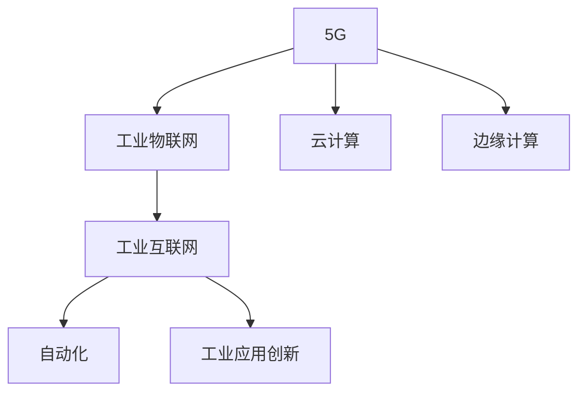

                 

# 5G技术在工业4.0中的应用

> 关键词：5G, 工业4.0, 物联网(IoT), 云计算, 边缘计算, 自动化, 工业互联网

## 1. 背景介绍

### 1.1 问题由来

随着数字经济时代的到来，工业4.0成为了全球制造业转型的主要方向。工业4.0利用信息技术和物理系统（Cyber-Physical Systems, CPS）的深度融合，以智能制造为核心理念，提升生产效率，降低成本，优化供应链管理，最终实现高质量的定制化生产。

5G作为新一代移动通信技术，是工业4.0实现的关键基础设施之一。5G技术的超高速率、低延迟和高可靠性的特点，为工业互联网、智能制造和工业物联网(IoT)提供了强有力的支持，实现了人与机器、机器与机器之间的无缝互联，推动了工业自动化和智能化发展。

### 1.2 问题核心关键点

5G技术在工业4.0中的应用主要集中在以下几个方面：

- 工业物联网：通过5G网络，实现设备的智能化、网络化和自动化，支持实时数据采集和监控。
- 工业互联网：5G网络提供的海量连接能力，支持工业数据的实时传输和处理，为工业互联网的建设提供了坚实基础。
- 工厂自动化：5G网络的高速和低延迟特性，支持实时控制和自动化，提升生产效率。
- 远程监控和协作：5G网络提供的高速和低延迟特性，支持远程监控和协作，实现工业现场的远程管理。
- 工业应用创新：5G网络支持工业应用的创新，如工业机器人、智能制造系统、智能仓储等。

## 2. 核心概念与联系

### 2.1 核心概念概述

为更好地理解5G技术在工业4.0中的应用，本节将介绍几个密切相关的核心概念：

- 5G: 第五代移动通信技术，具有超高速率、低延迟、高可靠性和广覆盖等特点，支持大规模设备连接和数据传输。
- 工业4.0: 利用信息技术和物理系统深度融合，实现智能制造和智能化生产的过程，包括智能工厂、智能物流、智能服务等多个方面。
- 工业物联网(IoT): 在工业环境中，通过传感器、控制器和执行器等设备，实现设备和系统的互联互通，支持实时监控和控制。
- 云计算: 一种基于互联网的计算模式，提供弹性、可扩展和灵活的计算资源，支持数据存储和处理。
- 边缘计算: 将计算资源分布式部署在边缘节点，降低网络传输负担，提升数据处理的时效性和可靠性。
- 自动化: 利用先进技术和设备，实现生产过程的自动化、智能化和优化，提升生产效率。
- 工业互联网: 通过互联网技术实现工业设备和系统的互联互通，支持工业数据的实时传输和处理，实现工业过程的智能化和优化。

这些核心概念之间的逻辑关系可以通过以下Mermaid流程图来展示：



这个流程图展示了下述核心概念的相互关系：

1. 5G为工业物联网提供通信基础设施。
2. 云计算和边缘计算为工业物联网和自动化提供计算支持。
3. 工业互联网是连接工业设备和系统的平台，支持工业数据的实时传输和处理。
4. 工业应用创新是5G和工业互联网的具体应用，包括智能工厂、智能物流、智能服务等。

## 3. 核心算法原理 & 具体操作步骤

### 3.1 算法原理概述

5G技术在工业4.0中的应用，主要基于物联网(IoT)、云计算、边缘计算和自动化等技术。其核心思想是通过5G网络，将工业设备和系统互联互通，实现数据的实时采集和处理，进而支持自动化和智能化生产。

具体来说，工业设备通过传感器采集数据，并通过5G网络上传到云端或边缘节点。云计算和边缘计算对数据进行存储、分析和处理，然后通过自动化系统执行控制命令，实现生产过程的智能化和优化。

### 3.2 算法步骤详解

5G技术在工业4.0中的应用主要包括以下几个关键步骤：

**Step 1: 工业设备接入**
- 选择适合的5G模组和协议，将工业设备接入5G网络。
- 设备通过传感器采集数据，如温度、湿度、压力等，并转换为数字信号。

**Step 2: 数据传输与存储**
- 设备数据通过5G网络实时传输到云端或边缘节点。
- 数据在云端或边缘节点进行存储、处理和分析。

**Step 3: 数据处理与分析**
- 使用云计算和边缘计算技术，对工业数据进行实时处理和分析。
- 通过数据挖掘和机器学习算法，提取有价值的信息和知识。

**Step 4: 自动化与智能化**
- 根据分析结果，自动生成控制命令，驱动工业设备和系统。
- 通过自动化系统，实现生产过程的自动化和智能化。

**Step 5: 反馈与优化**
- 实时监控生产过程，及时调整参数和策略，优化生产过程。
- 持续收集数据，不断优化工业设备和系统的性能。

### 3.3 算法优缺点

5G技术在工业4.0中的应用具有以下优点：
1. 高速率：5G网络支持超高速率数据传输，能够快速处理大量的工业数据。
2. 低延迟：5G网络的低延迟特性，支持实时控制和自动化，提升生产效率。
3. 高可靠性：5G网络的高可靠性，确保工业数据的实时传输和处理，避免生产中断。
4. 广覆盖：5G网络覆盖广泛，支持大规模设备连接和数据传输，支持更广泛的工业应用场景。

同时，5G技术在工业4.0中也有一定的局限性：
1. 高成本：5G网络的建设成本较高，初期投资较大。
2. 复杂性：5G网络的部署和维护较为复杂，需要专业的技术支持。
3. 数据安全：5G网络的数据传输安全性需要保障，避免数据泄露和攻击。

尽管存在这些局限性，但就目前而言，5G技术在工业4.0中的应用已经展现出巨大的潜力，成为推动工业自动化的重要力量。未来相关研究将进一步降低5G网络的部署和维护成本，提升网络的安全性和可靠性，推动5G技术在工业4.0中的普及和应用。

### 3.4 算法应用领域

5G技术在工业4.0中的应用领域非常广泛，涵盖以下几个主要方面：

- **智能工厂**：通过5G网络实现设备的智能化、网络化和自动化，支持实时监控和控制。
- **智能物流**：利用5G网络实现仓储和物流的智能化管理，支持实时调度和跟踪。
- **智能服务**：通过5G网络提供实时数据和信息服务，提升用户体验和满意度。
- **工业机器人**：利用5G网络实现工业机器人的远程监控和控制，提升自动化水平。
- **工业应用创新**：5G网络支持各种工业应用的创新，如智能制造系统、智能仓储等。

除了上述这些领域外，5G技术还在工业安全、能源管理、环境监测等多个方向展现出巨大的应用潜力，为工业4.0的发展提供了强有力的支持。

## 4. 数学模型和公式 & 详细讲解 & 举例说明

### 4.1 数学模型构建

为了更准确地理解5G技术在工业4.0中的应用，我们构建如下数学模型：

设工业设备在t时刻采集的数据为$x_t$，5G网络的时延为$d_t$，云端的计算时间为$c_t$，工业应用的自动化水平为$a_t$，系统响应时间为$r_t$，则工业4.0的总体性能可以表示为：

$$
P(t) = \frac{x_t}{d_t \times c_t \times a_t \times r_t}
$$

其中，$P(t)$表示工业4.0在t时刻的性能。

### 4.2 公式推导过程

为了更好地理解上述模型，我们将进行如下推导：

1. 5G网络的时延$d_t$可以通过公式$d_t = f(x_t)$计算，其中$f(x_t)$表示5G网络的时延函数，与工业数据$x_t$有关。

2. 云端的计算时间$c_t$可以通过公式$c_t = g(x_t)$计算，其中$g(x_t)$表示云端的计算时间函数，与工业数据$x_t$有关。

3. 工业应用的自动化水平$a_t$可以通过公式$a_t = h(x_t)$计算，其中$h(x_t)$表示自动化水平的函数，与工业数据$x_t$有关。

4. 系统响应时间$r_t$可以通过公式$r_t = i(x_t)$计算，其中$i(x_t)$表示系统响应时间的函数，与工业数据$x_t$有关。

将上述公式代入总体性能公式中，可以得到：

$$
P(t) = \frac{x_t}{f(x_t) \times g(x_t) \times h(x_t) \times i(x_t)}
$$

### 4.3 案例分析与讲解

以一个智能工厂为例，分析5G技术的应用。

假设智能工厂的5G网络时延为50ms，云端的计算时间为100ms，工业应用的自动化水平为0.9，系统响应时间为20ms，设备在t时刻采集的数据为1Mb。

则根据公式，工业4.0在t时刻的性能为：

$$
P(t) = \frac{1}{50 \times 100 \times 0.9 \times 20} = 0.0015Mb/s
$$

通过上述案例，可以直观地看到，5G网络、云计算和自动化等因素对工业4.0的性能有显著影响。

## 5. 项目实践：代码实例和详细解释说明

### 5.1 开发环境搭建

在进行5G技术在工业4.0中的应用实践前，我们需要准备好开发环境。以下是使用Python进行PyTorch开发的环境配置流程：

1. 安装Anaconda：从官网下载并安装Anaconda，用于创建独立的Python环境。

2. 创建并激活虚拟环境：
```bash
conda create -n pytorch-env python=3.8 
conda activate pytorch-env
```

3. 安装PyTorch：根据CUDA版本，从官网获取对应的安装命令。例如：
```bash
conda install pytorch torchvision torchaudio cudatoolkit=11.1 -c pytorch -c conda-forge
```

4. 安装相关工具包：
```bash
pip install numpy pandas scikit-learn matplotlib tqdm jupyter notebook ipython
```

完成上述步骤后，即可在`pytorch-env`环境中开始实践。

### 5.2 源代码详细实现

这里我们以智能工厂为例，给出使用PyTorch进行5G网络时延预测的代码实现。

首先，定义模型和数据处理函数：

```python
from torch import nn
import torch

class TimeDelayModel(nn.Module):
    def __init__(self, input_size, hidden_size, output_size):
        super(TimeDelayModel, self).__init__()
        self.hidden = nn.Linear(input_size, hidden_size)
        self.output = nn.Linear(hidden_size, output_size)
        
    def forward(self, x):
        x = torch.relu(self.hidden(x))
        x = self.output(x)
        return x

def load_dataset():
    # 加载智能工厂的数据集
    train_dataset = ...
    test_dataset = ...
    return train_dataset, test_dataset
```

然后，定义模型训练函数：

```python
from torch.utils.data import DataLoader
from torch.optim import SGD

def train(model, train_dataset, test_dataset, batch_size, learning_rate):
    # 定义训练循环
    model.train()
    for epoch in range(num_epochs):
        train_loader = DataLoader(train_dataset, batch_size=batch_size, shuffle=True)
        for batch in train_loader:
            inputs, labels = batch
            optimizer.zero_grad()
            outputs = model(inputs)
            loss = nn.MSELoss()(outputs, labels)
            loss.backward()
            optimizer.step()
            if epoch % 10 == 0:
                test_loader = DataLoader(test_dataset, batch_size=batch_size, shuffle=False)
                with torch.no_grad():
                    test_loss = 0
                    for batch in test_loader:
                        inputs, labels = batch
                        outputs = model(inputs)
                        test_loss += nn.MSELoss()(outputs, labels).item()
                    print(f"Epoch {epoch+1}, train loss: {train_loss:.3f}, test loss: {test_loss:.3f}")
```

最后，启动训练流程并在测试集上评估：

```python
# 定义训练参数
input_size = ...
hidden_size = ...
output_size = ...
learning_rate = ...
num_epochs = ...

# 创建模型
model = TimeDelayModel(input_size, hidden_size, output_size)

# 加载数据集
train_dataset, test_dataset = load_dataset()

# 定义优化器和训练函数
optimizer = SGD(model.parameters(), lr=learning_rate)
train(model, train_dataset, test_dataset, batch_size, learning_rate)

# 测试模型
test_model(model, test_dataset)
```

以上就是使用PyTorch进行5G网络时延预测的完整代码实现。可以看到，利用PyTorch的高效计算图和丰富的神经网络模块，可以轻松实现5G网络时延预测的建模和训练。

### 5.3 代码解读与分析

让我们再详细解读一下关键代码的实现细节：

**TimeDelayModel类**：
- `__init__`方法：定义模型的结构和参数。
- `forward`方法：定义前向传播计算过程。

**load_dataset函数**：
- 加载智能工厂的数据集，准备模型训练的输入和标签。

**train函数**：
- 定义训练循环，包括前向传播、计算损失、反向传播、更新参数等步骤。
- 每隔10个epoch在测试集上评估模型性能，并输出训练和测试损失。

**train_model函数**：
- 初始化模型、优化器、学习率等参数。
- 创建训练函数，进行模型训练。
- 在测试集上评估模型性能。

**train_model函数**：
- 定义训练参数和数据集。
- 创建模型和优化器。
- 调用训练函数进行模型训练。
- 在测试集上评估模型性能。

通过上述代码，可以直观地看到5G网络时延预测的实现过程。当然，在实际应用中，还需要考虑更多的因素，如模型的选择、训练数据的准备、超参数的调整等，才能得到更好的预测效果。

## 6. 实际应用场景

### 6.1 智能工厂

基于5G技术的智能工厂，可以实现设备智能化、网络化和自动化，支持实时监控和控制，提升生产效率和产品质量。

具体而言，智能工厂通过5G网络实现设备和系统的互联互通，实时采集设备状态数据，并通过云端进行分析处理。根据分析结果，自动化系统自动生成控制命令，驱动设备进行生产。例如，通过对设备运行数据的实时监控，发现异常情况后及时进行报警和调整，避免生产中断和产品质量问题。

### 6.2 智能物流

在智能物流领域，5G技术可以实现仓储和物流的智能化管理，支持实时调度和跟踪，提升物流效率和准确性。

具体而言，智能物流通过5G网络实现货物位置和状态的实时传输，并通过云端进行分析处理。根据分析结果，自动化系统自动生成调度命令，驱动物流设备进行物资调配。例如，通过对货物位置的实时监控，自动生成最优的物流路径，提高物流效率和准确性。

### 6.3 智能服务

在智能服务领域，5G技术可以实现实时数据和信息服务，提升用户体验和满意度。

具体而言，智能服务通过5G网络实现用户请求的实时传输，并通过云端进行处理和分析。根据分析结果，服务系统自动生成响应，提供个性化的服务。例如，通过对用户请求的实时监控，自动生成最优的服务方案，提升用户体验和满意度。

### 6.4 未来应用展望

随着5G技术的不断演进，其在工业4.0中的应用前景将更加广阔。未来可能涉及以下几个方面：

1. 5G网络将更加普及，支持更广泛的设备连接和数据传输，推动工业物联网的发展。
2. 云计算和边缘计算将进一步融合，提供更加灵活和高效的计算资源，支持工业数据的实时处理和分析。
3. 自动化和智能化水平将进一步提升，实现生产过程的全自动化和智能化。
4. 工业应用将更加多样，涵盖智能工厂、智能物流、智能服务等多个方面。
5. 工业4.0的生态系统将更加完善，各环节协同工作，提升工业效率和质量。

总之，5G技术将在工业4.0的发展中扮演重要角色，推动工业互联网、智能制造和工业物联网的发展，为工业生产带来革命性的变化。

## 7. 工具和资源推荐

### 7.1 学习资源推荐

为了帮助开发者系统掌握5G技术在工业4.0中的应用，这里推荐一些优质的学习资源：

1. 《5G技术在工业互联网中的应用》系列博文：由5G技术专家撰写，深入浅出地介绍了5G技术在工业互联网中的应用场景、关键技术和最新进展。

2. 《工业4.0与物联网》课程：斯坦福大学开设的IoT明星课程，涵盖物联网的基础知识、工业4.0的最新趋势和实际应用案例。

3. 《5G网络与工业互联网》书籍：5G技术专家的著作，全面介绍了5G网络在工业互联网中的应用，包括技术原理、应用案例和未来趋势。

4. 5G技术官方文档：5G技术标准和协议的官方文档，详细介绍了5G网络的关键技术、网络架构和部署方法。

5. 5G应用白皮书：5G技术领先的厂商发布的白皮书，深入分析了5G技术在各个行业的应用前景和未来趋势。

通过对这些资源的学习实践，相信你一定能够快速掌握5G技术在工业4.0中的应用，并用于解决实际的工业问题。

### 7.2 开发工具推荐

高效的开发离不开优秀的工具支持。以下是几款用于5G技术在工业4.0中应用的常用工具：

1. 5G网络模拟器：如NS3、OMNeT++等，可用于仿真5G网络的各种场景，评估网络性能和优化方案。
2. 云计算平台：如AWS、Azure、阿里云等，提供弹性、可扩展和灵活的计算资源，支持工业数据的存储和处理。
3. 边缘计算平台：如AWS Greengrass、阿里EdgeAI等，提供分布式计算资源，支持工业数据的实时处理和分析。
4. 工业物联网平台：如ThingWorx、ThingMapak、Eclipse Industrial IoT等，支持工业设备和系统的互联互通，实现数据的实时传输和处理。
5. 自动化平台：如OMAC、SAP MII、Siemens MES等，提供自动化解决方案，支持生产过程的全自动化和智能化。

合理利用这些工具，可以显著提升5G技术在工业4.0中的应用效率，加快创新迭代的步伐。

### 7.3 相关论文推荐

5G技术在工业4.0中的应用源于学界的持续研究。以下是几篇奠基性的相关论文，推荐阅读：

1. 《5G for Industry 4.0: Challenges and Opportunities》：文章详细分析了5G技术在工业4.0中的应用挑战和机遇，提供了宝贵的研究建议。
2. 《Industrial Internet of Things: A Survey》：文章全面介绍了工业物联网的关键技术、应用场景和未来趋势，是工业物联网研究的重要参考资料。
3. 《5G-Enabled Internet of Things: A Survey》：文章介绍了5G网络在工业物联网中的应用，包括关键技术和应用案例。
4. 《5G Network and Industrial Internet》：文章详细分析了5G网络在工业互联网中的应用，包括技术原理、应用场景和未来趋势。
5. 《5G in Smart Factories: A Survey》：文章详细分析了5G技术在智能工厂中的应用，包括关键技术和未来趋势。

这些论文代表了大语言模型微调技术的发展脉络。通过学习这些前沿成果，可以帮助研究者把握学科前进方向，激发更多的创新灵感。

## 8. 总结：未来发展趋势与挑战

### 8.1 总结

本文对5G技术在工业4.0中的应用进行了全面系统的介绍。首先阐述了5G技术在工业4.0中的重要地位和关键作用，明确了其在工业物联网、云计算、边缘计算和自动化等方向的应用潜力。其次，从原理到实践，详细讲解了5G技术在工业4.0中的应用过程，给出了5G网络时延预测的完整代码实现。同时，本文还广泛探讨了5G技术在智能工厂、智能物流、智能服务等多个领域的应用前景，展示了5G技术在工业4.0中的广泛应用。最后，本文精选了5G技术的各类学习资源，力求为读者提供全方位的技术指引。

通过本文的系统梳理，可以看到，5G技术在工业4.0中的应用前景广阔，已经在多个领域取得了显著的进展。未来，伴随5G技术的不断演进和完善，其在工业4.0中的应用将更加广泛和深入，推动工业互联网、智能制造和工业物联网的发展，为工业生产带来革命性的变化。

### 8.2 未来发展趋势

展望未来，5G技术在工业4.0中的应用将呈现以下几个发展趋势：

1. 5G网络将更加普及，支持更广泛的设备连接和数据传输，推动工业物联网的发展。
2. 云计算和边缘计算将进一步融合，提供更加灵活和高效的计算资源，支持工业数据的实时处理和分析。
3. 自动化和智能化水平将进一步提升，实现生产过程的全自动化和智能化。
4. 工业应用将更加多样，涵盖智能工厂、智能物流、智能服务等多个方面。
5. 工业4.0的生态系统将更加完善，各环节协同工作，提升工业效率和质量。

这些趋势凸显了5G技术在工业4.0中的巨大潜力。这些方向的探索发展，必将进一步提升5G技术在工业4.0中的应用效率和效果，推动工业互联网、智能制造和工业物联网的发展，为工业生产带来革命性的变化。

### 8.3 面临的挑战

尽管5G技术在工业4.0中的应用已经取得了显著进展，但在迈向更加智能化、普适化应用的过程中，它仍面临着诸多挑战：

1. 高成本：5G网络的建设成本较高，初期投资较大。如何降低成本，提高经济性，仍是未来需要解决的问题。
2. 复杂性：5G网络的部署和维护较为复杂，需要专业的技术支持。如何降低部署和维护难度，提升网络可靠性，是未来的研究方向。
3. 数据安全：5G网络的数据传输安全性需要保障，避免数据泄露和攻击。如何提高网络安全性，保护数据隐私，是未来的重要任务。
4. 应用普及：5G技术在各个行业的应用普及度较低，如何推动5G技术在各行业的广泛应用，是未来需要解决的问题。
5. 标准化：5G网络的标准化尚未完全完成，不同厂商的设备兼容性和互操作性仍存在问题。如何实现标准化，推动5G技术的发展，是未来的研究重点。

正视5G技术在工业4.0中面临的这些挑战，积极应对并寻求突破，将是5G技术在未来应用的推动力。

### 8.4 研究展望

面对5G技术在工业4.0中面临的种种挑战，未来的研究需要在以下几个方面寻求新的突破：

1. 探索低成本、高效能的5G网络部署和维护方案，降低5G网络的建设和维护成本。
2. 研究5G网络的高可靠性和高安全性，提高网络的安全性和可靠性，保障数据传输的安全性。
3. 推动5G技术的标准化和普及，提高5G技术的普及度和应用水平。
4. 开发更多5G应用场景和创新，推动5G技术在工业4.0中的广泛应用。
5. 将5G技术与云计算、边缘计算、自动化等技术进行融合，推动5G技术在工业4.0中的全面应用。

这些研究方向的探索，必将引领5G技术在工业4.0中的应用走向更高的台阶，为工业生产带来革命性的变化。

## 9. 附录：常见问题与解答

**Q1：5G技术在工业4.0中的应用是否需要大规模的初始投资？**

A: 是的，5G网络的建设和部署需要大规模的初始投资。在初期，投资成本较高，需要考虑投资回报率和成本效益。但在长期来看，5G技术可以大幅提升工业生产效率和产品质量，带来显著的经济效益。

**Q2：5G技术在工业4.0中的应用是否需要高技术水平？**

A: 是的，5G技术在工业4.0中的应用需要高水平的技术支持。5G网络的设计、部署、维护和优化，需要专业的技术人员和设备支持。同时，5G技术在各行业的具体应用也需要专业技术知识。

**Q3：5G技术在工业4.0中的应用是否需要高水平的网络安全性？**

A: 是的，5G技术在工业4.0中的应用需要高水平的网络安全性。工业数据涉及生产过程的各个环节，一旦泄露或被攻击，将对生产造成严重影响。因此，需要采用先进的网络安全技术和措施，保障数据传输的安全性。

**Q4：5G技术在工业4.0中的应用是否需要标准化和普及？**

A: 是的，5G技术在工业4.0中的应用需要标准化和普及。5G技术涉及不同的设备和系统，各厂商之间的设备兼容性和互操作性需要标准化，以推动5G技术的发展和应用。同时，5G技术的普及需要政府、企业、学术界等多方共同努力。

**Q5：5G技术在工业4.0中的应用是否需要持续创新和优化？**

A: 是的，5G技术在工业4.0中的应用需要持续创新和优化。工业生产过程中涉及各种复杂的因素，5G技术需要不断优化，才能满足生产过程的需求。同时，5G技术的创新和优化也需要结合实际应用场景，不断提升其应用效果。

通过本文的介绍，相信你对5G技术在工业4.0中的应用有了更深入的了解。面对未来的挑战和机遇，需要持续努力和创新，推动5G技术在工业4.0中的广泛应用，为工业生产带来革命性的变化。

