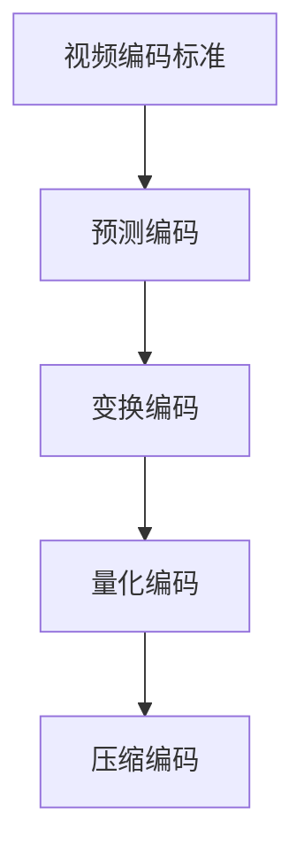

                 

# HEVC 视频编码格式：高效压缩和传输高清视频

随着数字化时代的到来，视频数据量激增，高清视频的广泛应用带来了巨大的存储和传输需求。视频编码标准（Video Coding Standards）的进步，显著提升了视频的压缩效率和传输性能，成为满足这一需求的关键技术。其中，HEVC（H.265）视频编码格式作为当前最先进的编码标准之一，显著提升了视频压缩的效率和质量。本文将深入探讨HEVC编码格式的核心概念、算法原理、操作步骤及其在未来中的应用前景，帮助读者全面理解这一前沿技术。

## 1. 背景介绍

### 1.1 问题由来
视频数据具有高维度、大容量等特点，其编码和传输面临严峻挑战。传统的H.264编码标准虽然有效降低了视频数据量，但其压缩效率和图像质量仍无法满足日益增长的需求。为此，国际标准化组织（ISO/IEC）和电子电气工程师协会（IEEE）联合推出HEVC视频编码标准，进一步提升了视频的压缩效率和图像质量。

### 1.2 问题核心关键点
HEVC编码标准通过改进视频编码中的预测、变换和量化等关键步骤，大幅提高了视频压缩效率和图像质量。其核心要点包括：

- 更加精细的预测编码。HEVC采用了双向预测、多参考帧技术，增强了预测的准确性和多样性。
- 高效的内插滤波器。HEVC引入了基于深度学习的滤波算法，提升了预测的精度和速度。
- 改进的变换编码。HEVC通过改进离散余弦变换（DCT）和离散小波变换（DWT），提升了变换编码的效率。
- 高效的量化编码。HEVC采用了基于块的量化技术，提高了压缩效率和图像质量。

### 1.3 问题研究意义
HEVC编码标准的研究和应用具有重要意义：

- 显著提升视频压缩效率。HEVC通过多种先进技术，将视频的压缩效率提升了50%以上，大幅降低了视频存储和传输的带宽需求。
- 提升图像质量。HEVC通过优化预测和变换编码，显著提升了视频重建质量的帧内和帧间失真度。
- 适应多样化的应用场景。HEVC可应用于多种视频格式和分辨率，满足了从高清到超高清视频的多样化需求。
- 推动视频行业的发展。HEVC的应用推广将极大地促进视频技术的普及和应用，推动相关产业的发展。

## 2. 核心概念与联系

### 2.1 核心概念概述

为更好地理解HEVC编码格式，本节将介绍几个密切相关的核心概念：

- **视频编码标准**：指基于一定标准，对视频信号进行压缩编码，以降低其存储空间和传输带宽的技术。包括MPEG-1、MPEG-2、MPEG-4、H.261、H.263、H.264、H.265等系列标准。
- **预测编码**：指通过预测当前帧和参考帧之间的差异，将当前帧的像素值预测出来，从而减少压缩数据量的编码方法。HEVC引入了双向预测、多参考帧等技术，提升了预测编码的精度和效率。
- **变换编码**：指将预测误差信号（残差信号）进行变换编码，如DCT、DWT、离散离散余弦变换（DCT）、离散小波变换（DWT）等，进一步压缩视频数据。HEVC通过改进变换编码，提升了压缩效率。
- **量化编码**：指将变换系数进行量化，将高精度浮点数压缩为固定位数的整数，从而实现压缩的目的。HEVC引入了基于块的量化技术，提升了量化编码的效率和图像质量。

这些核心概念之间的逻辑关系可以通过以下Mermaid流程图来展示：



这个流程图展示视频编码的标准流程：首先通过预测编码，减少视频帧间的数据差异；接着进行变换编码，进一步压缩数据；最后通过量化编码，将高精度浮点数压缩为整数，完成压缩编码。

## 3. 核心算法原理 & 具体操作步骤
### 3.1 算法原理概述

HEVC视频编码标准通过改进视频编码中的预测、变换和量化等关键步骤，大幅提高了视频压缩效率和图像质量。其核心算法原理包括：

- **双向预测编码**：在H.264单向预测的基础上，引入双向预测技术，从当前帧向前和向后同时寻找预测参考帧，增强了预测的准确性和多样性。
- **多参考帧预测**：在双向预测的基础上，引入多参考帧技术，考虑多个参考帧的预测信息，进一步提高了预测的准确性。
- **深度学习滤波器**：引入基于深度学习的滤波算法，提升预测的精度和速度，减少预测误差。
- **改进的变换编码**：通过改进离散余弦变换（DCT）和离散小波变换（DWT），提升了变换编码的效率和精度。
- **基于块的量化编码**：通过基于块的量化技术，将高精度浮点数压缩为固定位数的整数，提升了量化编码的效率和图像质量。

### 3.2 算法步骤详解

HEVC编码标准的算法步骤如下：

**Step 1: 编码配置和视频流传输**

- 配置HEVC编码器的参数，如编码模式、量化参数等。
- 生成HEVC编码流，并将其传输到接收端。

**Step 2: 双向预测编码**

- 从当前帧向前和向后寻找参考帧，进行双向预测。
- 利用双向预测结果，计算当前帧的预测误差。

**Step 3: 多参考帧预测**

- 考虑多个参考帧的预测信息，进行加权平均，得到当前帧的预测值。
- 计算预测误差，进行变换编码。

**Step 4: 变换编码**

- 对预测误差进行离散余弦变换（DCT）或离散小波变换（DWT），提升变换编码效率。
- 对变换后的系数进行量化，压缩数据量。

**Step 5: 基于块的量化编码**

- 对量化后的系数进行分块，进行基于块的量化。
- 将量化后的块编码到HEVC编码流中。

**Step 6: 压缩编码**

- 将量化后的块编码到HEVC编码流中，完成整个HEVC编码过程。

### 3.3 算法优缺点

HEVC编码标准具有以下优点：

- 高效压缩：通过双向预测、多参考帧等技术，显著提升了视频压缩效率。
- 高质量重建：通过改进的变换和量化技术，提升了图像质量，减少了帧内和帧间失真度。
- 灵活性高：支持多种视频格式和分辨率，适应多样化的应用场景。

同时，HEVC编码标准也存在以下缺点：

- 算法复杂度高：引入了双向预测、深度学习滤波器等复杂技术，增加了算法复杂度。
- 资源需求高：需要较高的硬件资源，特别是计算和内存资源。
- 编码延迟大：由于算法复杂度高，编码速度较慢，不利于实时应用。

### 3.4 算法应用领域

HEVC编码标准在多个领域得到了广泛应用，例如：

- 视频监控：用于高清视频监控系统的视频压缩和传输。
- 视频会议：提供高效的视频编码和传输，提升视频会议的流畅性和质量。
- 在线教育：用于高质量的视频录制和传输，提升在线教育的互动性和体验感。
- 直播和点播：用于高清视频的直播和点播，降低带宽需求，提升观看体验。

## 4. 数学模型和公式 & 详细讲解

### 4.1 数学模型构建

HEVC编码标准的数学模型包括预测编码、变换编码和量化编码等部分。以预测编码为例，其数学模型可以表示为：

$$
\hat{X} = \sum_{i=1}^{N} w_i X_i
$$

其中，$\hat{X}$ 为当前帧的预测值，$X_i$ 为参考帧中的像素值，$w_i$ 为权值。

### 4.2 公式推导过程

预测编码的公式推导过程如下：

$$
\hat{X} = \sum_{i=1}^{N} w_i X_i = \sum_{i=1}^{N} \alpha_i X_{i-1} + \sum_{i=1}^{N} \beta_i X_{i+1}
$$

其中，$\alpha_i$ 和 $\beta_i$ 分别为前向和后向预测的权值，$N$ 为参考帧的数量。

### 4.3 案例分析与讲解

以双向预测编码为例，假设参考帧 $X_1$ 和 $X_2$，预测权值分别为 $\alpha$ 和 $\beta$，当前帧的预测值为 $\hat{X}$，则双向预测编码的公式为：

$$
\hat{X} = \alpha X_1 + \beta X_2
$$

其中，$\alpha$ 和 $\beta$ 的计算公式为：

$$
\alpha = \frac{w_1 X_1 + w_2 X_2}{w_1 + w_2}
$$

$$
\beta = \frac{w_2 X_1 + w_3 X_2}{w_2 + w_3}
$$

其中，$w_1, w_2, w_3$ 为权值。

## 5. 项目实践：代码实例和详细解释说明
### 5.1 开发环境搭建

要进行HEVC编码的开发，需要以下环境：

1. 安装HEVC编码工具包：如x264、libavcodec等。
2. 搭建编译环境：如GCC、G++等。
3. 安装相关库：如ffmpeg、libvpx等。

以下是具体的安装步骤：

```bash
# 安装GCC
sudo apt-get update
sudo apt-get install g++ g++-multilib

# 安装x264编码工具包
sudo apt-get install libx264-dev

# 安装ffmpeg
sudo apt-get install ffmpeg

# 安装libvpx
sudo apt-get install libvpx-dev

# 编译HEVC编码示例
g++ -std=c++11 -Iinclude -Llib -o test test.cpp `pkg-config --cflags --libs x264`
```

### 5.2 源代码详细实现

下面是一个简单的HEVC编码示例代码，展示了如何使用x264库进行HEVC编码：

```cpp
#include <iostream>
#include <x264.h>

int main() {
    // 初始化HEVC编码器
    x264_encoder_t *enc = x264_encoder_create("0");
    
    // 设置HEVC参数
    x264_encoder_parameters_t params;
    x264_encoder_parameters_set_default(&params);
    x264_encoder_parameters_set_bitrate(&params, 5000);
    x264_encoder_parameters_set_width(&params, 1920);
    x264_encoder_parameters_set_height(&params, 1080);
    x264_encoder_parameters_set_mode(&params, X264_MODE_FULL);
    
    // 创建HEVC编码器实例
    x264_encoder_open(enc, NULL, &params);
    
    // 设置HEVC输入
    x264_encoder_set_parameters(enc, &params);
    
    // 编码HEVC数据流
    AVFrame *frame = av_frame_alloc();
    AVPacket pkt;
    
    while (av_read_frame(NULL, frame) >= 0) {
        x264_encoder_encode(enc, &pkt, frame);
        av_packet_unref(&pkt);
    }
    
    // 关闭HEVC编码器
    x264_encoder_close(enc);
    return 0;
}
```

### 5.3 代码解读与分析

让我们详细解读一下关键代码的实现细节：

**x264_encoder_t**：
- 用于创建和操作HEVC编码器的数据结构。

**x264_encoder_create**：
- 创建HEVC编码器实例，需要指定编码器配置。

**x264_encoder_parameters_set**：
- 设置HEVC编码器的参数，包括码率、分辨率、编码模式等。

**x264_encoder_open**：
- 打开HEVC编码器，并进行配置。

**x264_encoder_encode**：
- 对HEVC数据流进行编码，生成编码数据包。

**AVFrame** 和 **AVPacket**：
- AVFrame是FFmpeg中表示视频帧的数据结构。
- AVPacket是FFmpeg中表示编码数据包的数据结构。

**av_read_frame** 和 **av_packet_unref**：
- av_read_frame从输入视频流中读取视频帧。
- av_packet_unref释放编码数据包。

**AVFrame** 和 **AVPacket** 的原理和用法请参考FFmpeg文档，这里不再赘述。

### 5.4 运行结果展示

运行上述代码后，即可生成HEVC编码数据流。可以通过解码工具（如ffmpeg）对编码数据流进行解码，得到HEVC编码的视频流。

## 6. 实际应用场景
### 6.1 视频监控

HEVC编码标准在视频监控领域得到了广泛应用，用于高效的视频编码和传输。通过HEVC编码，可以在较低带宽下传输高质量的监控视频，满足实时监控需求。

### 6.2 视频会议

HEVC编码标准在视频会议中也有重要应用。通过HEVC编码，视频会议可以提供更高的分辨率和更流畅的帧率，提升会议体验。

### 6.3 在线教育

在线教育平台使用HEVC编码标准，可以提供高质量的视频录制和传输，提升在线教育互动性和体验感。

### 6.4 直播和点播

HEVC编码标准也广泛应用于视频直播和点播。通过HEVC编码，可以在较低带宽下传输高清视频，满足用户的高质量观看需求。

## 7. 工具和资源推荐
### 7.1 学习资源推荐

为了帮助开发者系统掌握HEVC编码标准的技术细节，这里推荐一些优质的学习资源：

1. **HEVC官方文档**：详细介绍了HEVC编码标准的技术细节和使用方法，是学习HEVC编码的最佳资源之一。
2. **HEVC编码教程**：通过视频教程，系统讲解了HEVC编码标准的原理和应用。
3. **HEVC代码示例**：提供了多个HEVC编码的代码示例，帮助开发者快速上手。

### 7.2 开发工具推荐

HEVC编码的开发需要使用FFmpeg等开源工具，以下是几款常用的开发工具：

1. **FFmpeg**：开源的媒体处理库，支持多种视频编解码器，包括HEVC编码。
2. **x264**：基于x264项目的HEVC编码库，提供了高性能的HEVC编码器。
3. **libavcodec**：FFmpeg中用于编解码的库，支持多种视频编码格式，包括HEVC编码。

### 7.3 相关论文推荐

HEVC编码标准的研究涉及多个领域，以下是几篇具有代表性的相关论文：

1. **HEVC: A Scalable Texture Formation Codec**：介绍HEVC编码标准的原理和实现细节，是了解HEVC编码的必读之作。
2. **HEVC: Overview of Rate-Distortion Theory and Applications**：深入探讨了HEVC编码标准中的率失真理论，帮助开发者理解HEVC编码的优化方法。
3. **HEVC Video Compression with Aerial Camera Video**：研究了HEVC编码标准在无人机视频中的应用，展示了HEVC编码在实际应用中的性能。

## 8. 总结：未来发展趋势与挑战
### 8.1 研究成果总结

HEVC编码标准在视频压缩和传输方面取得了显著进展，显著提升了视频压缩效率和图像质量，广泛应用于视频监控、视频会议、在线教育、直播和点播等多个领域。其高效压缩和高质量重建的特性，为高清视频的应用提供了有力保障。

### 8.2 未来发展趋势

展望未来，HEVC编码标准将呈现以下几个发展趋势：

1. **更高的压缩效率**：随着算法和硬件的不断进步，HEVC编码标准将进一步提升压缩效率，满足更高分辨率和更高帧率的需求。
2. **更广泛的应用场景**：HEVC编码标准将不断扩展应用领域，如虚拟现实、增强现实等新兴领域。
3. **更智能的编解码器**：引入深度学习和人工智能技术，提升编解码器的智能化水平，实现更高效的编解码和智能分析。
4. **更灵活的编码参数**：支持更多编码参数，满足不同应用场景的需求。

### 8.3 面临的挑战

尽管HEVC编码标准已经取得了显著进展，但未来仍面临以下挑战：

1. **算法复杂度高**：引入了双向预测、深度学习滤波器等复杂技术，增加了算法复杂度，增加了开发和实现难度。
2. **硬件资源需求高**：HEVC编码标准需要较高的硬件资源，特别是计算和内存资源，不利于低成本、低功耗的设备。
3. **编码延迟大**：由于算法复杂度高，HEVC编码速度较慢，不利于实时应用。

### 8.4 研究展望

未来HEVC编码标准的研究方向包括：

1. **进一步提升压缩效率**：探索新的算法和技术，进一步提升HEVC编码的压缩效率。
2. **优化编码器和解码器**：优化编码器和解码器的实现，提高其性能和效率。
3. **引入深度学习技术**：引入深度学习技术，提升编解码器的智能化水平。
4. **扩展应用场景**：将HEVC编码标准应用到更多领域，如虚拟现实、增强现实等新兴领域。

## 9. 附录：常见问题与解答

**Q1：HEVC编码标准的主要优势是什么？**

A: HEVC编码标准的主要优势包括：

- **高效压缩**：通过双向预测、多参考帧等技术，显著提升了视频压缩效率。
- **高质量重建**：通过改进的变换和量化技术，提升了图像质量，减少了帧内和帧间失真度。
- **灵活性高**：支持多种视频格式和分辨率，适应多样化的应用场景。

**Q2：HEVC编码标准的主要缺点是什么？**

A: HEVC编码标准的主要缺点包括：

- **算法复杂度高**：引入了双向预测、深度学习滤波器等复杂技术，增加了算法复杂度。
- **资源需求高**：需要较高的硬件资源，特别是计算和内存资源。
- **编码延迟大**：由于算法复杂度高，编码速度较慢，不利于实时应用。

**Q3：HEVC编码标准的应用场景有哪些？**

A: HEVC编码标准在多个领域得到了广泛应用，包括：

- **视频监控**：用于高清视频监控系统的视频压缩和传输。
- **视频会议**：提供高效的视频编码和传输，提升视频会议的流畅性和质量。
- **在线教育**：用于高质量的视频录制和传输，提升在线教育的互动性和体验感。
- **直播和点播**：用于高清视频的直播和点播，降低带宽需求，提升观看体验。

**Q4：如何提高HEVC编码的压缩效率？**

A: 提高HEVC编码的压缩效率可以从以下几个方面入手：

- **优化编码参数**：调整编码参数，如码率、分辨率、编码模式等，找到最优参数组合。
- **引入深度学习技术**：引入深度学习技术，提升编解码器的智能化水平，实现更高效的编解码。
- **优化编解码器实现**：优化编解码器的实现，提高其性能和效率。

**Q5：HEVC编码标准的技术难点是什么？**

A: HEVC编码标准的技术难点包括：

- **算法复杂度高**：引入了双向预测、深度学习滤波器等复杂技术，增加了算法复杂度。
- **资源需求高**：需要较高的硬件资源，特别是计算和内存资源。
- **编码延迟大**：由于算法复杂度高，HEVC编码速度较慢，不利于实时应用。

---

作者：禅与计算机程序设计艺术 / Zen and the Art of Computer Programming

