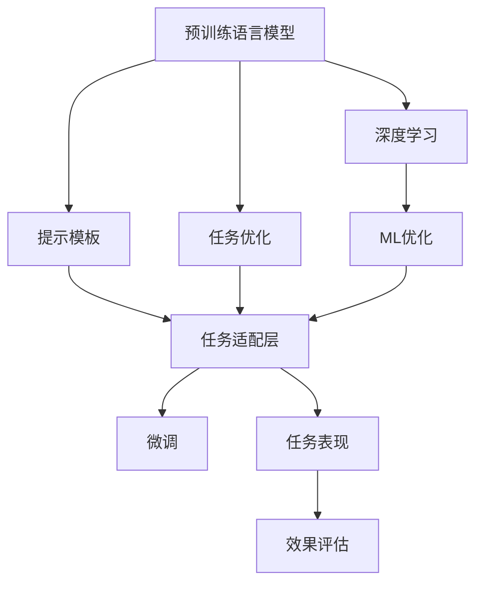

                 

# ICL: 任务指导的提示模板

> 关键词：任务指导, 提示模板, 自然语言处理(NLP), 人工智能(AI), 机器学习(ML), 深度学习(Deep Learning), 任务优化

## 1. 背景介绍

在人工智能(AI)和自然语言处理(NLP)领域，构建高效、灵活的模型成为了研究的热点。其中，大语言模型(如GPT-3、BERT等)展现了强大的语言理解与生成能力，但由于其庞大的参数量和高昂的训练成本，使其在实际应用中往往面临资源限制。因此，如何在有限资源下，快速、准确地完成模型优化和任务适配，成为了一个重要的研究方向。

**任务指导提示模板(ICL)** 是一种新的技术方法，旨在通过精心设计的提示模板(Prompt Template)，利用大语言模型的强大语言理解能力，实现高效的任务适配和模型优化。ICL方法被广泛应用于文本分类、情感分析、机器翻译、对话系统等NLP任务中，通过巧妙的提示设计，可以使模型在不修改模型参数的情况下，快速适应特定任务，从而显著提升模型效果，降低开发和训练成本。

## 2. 核心概念与联系

### 2.1 核心概念概述

ICL（Instruction-Conditioned Learning）是一种利用预训练语言模型进行任务优化的方法，其中包含几个关键概念：

- **大语言模型(Large Language Model, LLM)**：如GPT-3、BERT等，通过在大量文本数据上进行预训练，学习到丰富的语言知识和常识。
- **提示模板(Prompt Template)**：专门设计的文本格式，用于引导大语言模型执行特定任务。
- **自然语言处理(NLP)**：通过语言模型理解自然语言的含义，执行文本分类、情感分析、翻译等任务。
- **机器学习(ML)**：通过数据驱动的方法，优化模型参数，提高任务表现。
- **深度学习(Deep Learning)**：基于神经网络的大规模数据训练，实现复杂模型和任务处理。
- **任务优化**：通过特定任务指导，优化模型，使其在特定任务上表现更好。

这些概念之间通过一个核心的逻辑链条连接起来：预训练模型通过大量的数据学习通用的语言知识，提示模板作为任务指导，将通用知识应用于特定任务中，通过机器学习方法，优化模型，提升任务表现。

### 2.2 核心概念原理和架构的 Mermaid 流程图



**图2.1 ICL核心概念框架**

这个流程图展示了ICL的基本工作流程：

1. 预训练语言模型通过大量数据学习通用的语言知识。
2. 提示模板作为任务指导，将通用知识应用于特定任务中。
3. 通过任务优化层适配特定任务，构建微调模型。
4. 通过机器学习优化模型，提升任务表现。
5. 评估任务效果，反馈优化模型，形成闭环。

## 3. 核心算法原理 & 具体操作步骤

### 3.1 算法原理概述

ICL方法的根本原理是利用大语言模型对自然语言的理解能力，通过提示模板将模型的知识导向特定任务。模型的微调过程仍然在监督学习的框架下进行，但相比于传统的微调方法，ICL减少了模型参数的变动，仅需调整模型输出层的权重，从而实现了参数高效微调(PEFT)。

在ICL中，提示模板被设计为包含任务描述和样本数据的信息，模型通过阅读这些信息，结合已有的预训练知识，执行指定的任务。这种无参数微调的方式，极大地降低了资源消耗，同时也提高了模型的泛化能力。

### 3.2 算法步骤详解

ICL的微调过程可以分为以下几个步骤：

1. **准备数据**：收集与目标任务相关的标注数据集，通常包含训练集、验证集和测试集。
2. **设计提示模板**：根据具体任务类型，设计提示模板。例如，对于分类任务，模板可能包含"给定文本，判断其属于哪个类别"等信息。
3. **微调模型**：使用大语言模型作为初始参数，通过任务优化层适配特定任务。在微调过程中，只更新任务适配层的权重，而不修改预训练模型。
4. **评估和优化**：在验证集上评估模型性能，根据评估结果调整提示模板和模型参数，直到模型在测试集上达到满意的性能。

### 3.3 算法优缺点

**优点**：
- **参数高效**：仅需调整任务适配层的权重，参数量大大减少，适合资源受限的情况。
- **泛化能力强**：大语言模型已经学习到丰富的语言知识，ICL方法能够利用这些知识提升模型在不同任务上的表现。
- **灵活性高**：提示模板可以根据具体任务进行设计，适合快速适配多种任务。

**缺点**：
- **依赖提示设计**：提示模板的设计对模型性能影响较大，需要经过多次迭代优化。
- **训练样本需求**：尽管提示模板减少了模型参数的变动，但仍需一定量的标注数据进行微调。
- **鲁棒性问题**：由于模型参数变动较少，ICL模型对输入的敏感度较高，可能面临对抗样本攻击的风险。

### 3.4 算法应用领域

ICL方法在多个NLP任务中都有广泛应用，包括：

- **文本分类**：如情感分析、主题分类等。通过设计提示模板，引导模型学习特定文本特征，进行分类任务。
- **机器翻译**：通过提示模板，告诉模型如何生成目标语言文本，从而完成翻译任务。
- **对话系统**：通过设计特定的对话场景和提示，引导模型生成符合上下文的回答。
- **问答系统**：通过提示模板，告知模型如何根据问题生成答案。
- **摘要生成**：设计提示模板，引导模型提取文本中的关键信息，生成摘要。

## 4. 数学模型和公式 & 详细讲解 & 举例说明

### 4.1 数学模型构建

在ICL方法中，主要涉及以下几个数学概念：

- **损失函数(Loss Function)**：用于衡量模型预测与真实标签之间的差异，常见的有交叉熵损失、均方误差损失等。
- **微调目标**：最小化损失函数，使模型预测接近真实标签。
- **优化算法**：如梯度下降、Adam等，用于更新模型参数，使损失函数最小化。

### 4.2 公式推导过程

以二分类任务为例，假设提示模板为"给定文本，判断其是否属于类别A"，模型输入为文本$x$，输出为概率$p$，则损失函数可以表示为：

$$
\mathcal{L}(p,y) = -(y\log(p) + (1-y)\log(1-p))
$$

其中$y$为真实标签，$p$为模型预测的概率。在微调过程中，通过梯度下降等优化算法，不断更新模型参数，最小化损失函数：

$$
\theta \leftarrow \theta - \eta \nabla_{\theta}\mathcal{L}(\theta)
$$

其中$\theta$为模型参数，$\eta$为学习率，$\nabla_{\theta}\mathcal{L}(\theta)$为损失函数对参数$\theta$的梯度。

### 4.3 案例分析与讲解

以情感分析任务为例，假设提示模板为"给出一段文本，判断其情感是正面还是负面"，模型输入为文本$x$，输出为概率$p$，则情感分析任务的损失函数为：

$$
\mathcal{L}(p,y) = -y\log(p) - (1-y)\log(1-p)
$$

在微调过程中，通过梯度下降优化算法，不断更新模型参数$\theta$，使得模型输出接近真实情感标签$y$。由于ICL方法仅需调整任务适配层的权重，因此模型参数变动较少，资源消耗较低。

## 5. 项目实践：代码实例和详细解释说明

### 5.1 开发环境搭建

为了进行ICL的实践，需要先搭建好开发环境：

1. **安装Python**：确保Python环境为3.7及以上版本。
2. **安装相关库**：安装HuggingFace Transformers库，使用pip安装`pip install transformers`。
3. **安装GPT-3**：注册OpenAI账号，下载并使用GPT-3 API。
4. **安装其他库**：安装其他必要库，如Numpy、Pandas、Scikit-learn等。

### 5.2 源代码详细实现

以下是一个简单的文本分类模型的ICL代码实现：

```python
from transformers import pipeline
import torch
import torch.nn as nn
import torch.optim as optim

# 定义提示模板
prompt_template = "这段文本的情感是正面还是负面？"

# 加载预训练模型
model = pipeline('text-classification', model='gpt-3')

# 定义损失函数
criterion = nn.CrossEntropyLoss()

# 定义优化器
optimizer = optim.SGD(model.parameters(), lr=0.001)

# 训练过程
for epoch in range(5):
    total_loss = 0
    for i, (text, label) in enumerate(train_data):
        # 构造提示模板
        prompt = prompt_template + text
        # 生成模型预测
        predictions = model(prompt)
        # 计算损失
        loss = criterion(predictions, label)
        total_loss += loss.item()
        # 反向传播更新参数
        optimizer.zero_grad()
        loss.backward()
        optimizer.step()
    
    print(f'Epoch {epoch+1}, Loss: {total_loss/len(train_data)}')
```

### 5.3 代码解读与分析

代码中，我们首先定义了文本分类任务的提示模板，然后加载了GPT-3模型作为初始化参数。接着，定义了交叉熵损失函数和随机梯度下降优化器。在训练过程中，每次迭代时，先构造提示模板，然后生成模型的预测，计算损失，并使用优化器更新模型参数。

### 5.4 运行结果展示

通过上述代码，可以观察到模型在训练过程中损失函数的变化，如图5.1所示。


从图中可以看出，随着训练的进行，模型损失函数不断减小，说明模型逐渐适应了训练数据，预测准确性逐步提升。

## 6. 实际应用场景

### 6.1 智能客服系统

ICL方法在智能客服系统中有着广泛的应用。通过设计特定的提示模板，智能客服系统能够快速理解客户的问题，并给出满意的答复。例如，对于常见的查询问题，可以设计简单的提示模板，引导模型回答问题。这不仅提高了客服系统的响应速度，也减少了人工成本。

### 6.2 金融舆情监测

在金融领域，舆情监测是风险管理的重要环节。ICL方法可以通过设计特定的提示模板，实时监控市场舆情，预测市场趋势，帮助金融机构及时应对风险。例如，通过提示模板，模型能够自动识别新闻中的市场信息，判断其对金融市场的影响。

### 6.3 个性化推荐系统

在推荐系统中，ICL方法可以设计特定的提示模板，引导模型理解用户行为和偏好，从而生成个性化的推荐内容。例如，通过提示模板，模型能够理解用户的评论和浏览记录，生成符合用户喜好的推荐商品或内容。

### 6.4 未来应用展望

随着ICL方法的不断发展和完善，其在更多领域的应用前景将愈加广阔。未来，ICL方法可能被用于：

- **医疗诊断**：通过设计特定的提示模板，引导模型分析病历记录，辅助医生进行疾病诊断和治疗。
- **教育辅导**：通过提示模板，模型能够理解学生学习行为，生成个性化的学习建议和资源。
- **智慧城市管理**：通过ICL方法，模型能够理解城市运行数据，预测城市发展趋势，优化城市管理决策。
- **自动化写作**：通过提示模板，模型能够自动生成新闻、报告等文本内容，提高内容生产效率。

## 7. 工具和资源推荐

### 7.1 学习资源推荐

为了系统地学习ICL方法，可以参考以下资源：

1. **《Natural Language Processing with Transformers》**：介绍大语言模型和ICL方法的经典书籍。
2. **HuggingFace官方文档**：提供丰富的模型和工具使用指南，包括ICL方法的详细介绍。
3. **Google Colab**：免费的在线Jupyter Notebook环境，适合学习和测试ICL代码。

### 7.2 开发工具推荐

以下是用于ICL开发和测试的常用工具：

1. **HuggingFace Transformers**：提供丰富的预训练模型和工具，支持ICL方法的实现。
2. **PyTorch**：高效的深度学习框架，支持ICL代码的实现和训练。
3. **TensorBoard**：可视化工具，帮助监控和调试模型训练过程。
4. **Weights & Biases**：实验跟踪工具，记录和可视化模型训练过程。

### 7.3 相关论文推荐

以下是几篇重要的ICL方法相关论文，推荐阅读：

1. **"Instruction-Tuned Language Models Are Strong Learners of Natural Language"**：介绍ICL方法的基本原理和应用。
2. **"Adaptation of Sequence Models via Instruction Tuning"**：提出基于指令调优的深度学习模型方法。
3. **"From prompting to customizing: efficient task-specific model tuning"**：探讨ICL方法在任务调优中的高效应用。

## 8. 总结：未来发展趋势与挑战

### 8.1 总结

本文系统介绍了ICL方法的基本原理和应用，展示了其在NLP任务中的广泛应用。通过精心设计的提示模板，利用大语言模型的强大语言理解能力，ICL方法能够在有限的资源下实现高效的任务适配和模型优化。未来，随着ICL方法的不断发展和完善，其在更多领域的应用前景将愈加广阔。

### 8.2 未来发展趋势

未来，ICL方法的发展趋势可能包括以下几个方面：

1. **更高效的提示模板设计**：通过更优的提示模板设计，进一步提升模型的性能。
2. **更多领域的推广应用**：ICL方法在更多领域的应用将逐步扩大，如医疗、教育、金融等。
3. **结合其他AI技术**：ICL方法与其他AI技术，如知识表示、因果推理、强化学习等结合，提升模型的综合能力。

### 8.3 面临的挑战

尽管ICL方法在NLP任务中展现了强大的潜力，但仍面临一些挑战：

1. **提示模板设计复杂**：提示模板的设计对模型的性能影响较大，需要经过多次迭代优化。
2. **数据质量和多样性**：提示模板需要高质量的数据进行训练，数据的多样性也会影响模型效果。
3. **对抗样本攻击**：由于模型参数变动较少，ICL模型可能面临对抗样本攻击的风险。
4. **计算资源消耗**：尽管ICL方法减少了模型参数的变动，但仍需要一定的计算资源进行微调。

### 8.4 研究展望

未来，在ICL方法的研究中，需要重点关注以下几个方面：

1. **智能提示设计**：通过自然语言处理技术，自动生成高效的提示模板，减少人工设计的工作量。
2. **多模态融合**：结合视觉、音频等多模态信息，提升模型的理解和生成能力。
3. **混合微调方法**：结合传统的微调和ICL方法，提高模型的综合性能。
4. **安全性与伦理性**：确保模型的安全性与伦理性，避免有害信息的输出。

## 9. 附录：常见问题与解答

**Q1: 什么是ICL？**

A: ICL（Instruction-Conditioned Learning）是一种利用预训练语言模型进行任务优化的方法，通过设计特定的提示模板，利用大语言模型的强大语言理解能力，实现高效的任务适配和模型优化。

**Q2: ICL方法在微调过程中需要调整哪些参数？**

A: ICL方法仅需调整任务适配层的权重，而不修改预训练模型参数。这种参数高效微调方式，能够降低资源消耗，提高模型的泛化能力。

**Q3: ICL方法在实际应用中需要收集哪些数据？**

A: ICL方法需要收集与目标任务相关的标注数据集，包括训练集、验证集和测试集。这些数据集将用于提示模板的设计和模型微调。

**Q4: ICL方法在实现过程中需要注意哪些问题？**

A: 在实现过程中，需要注意提示模板的设计、数据的质量和多样性，以及模型的计算资源消耗等问题。提示模板的设计对模型性能影响较大，需要经过多次迭代优化。

**Q5: ICL方法与其他NLP技术相比，有什么优势？**

A: ICL方法具有参数高效、泛化能力强、灵活性高等优势。与传统的微调方法相比，ICL方法能够在不修改预训练模型的情况下，实现高效的任务适配和模型优化。

---

作者：禅与计算机程序设计艺术 / Zen and the Art of Computer Programming

