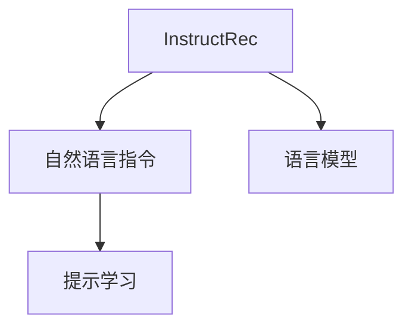

                 

# InstructRec的优势体现：自然语言指令的强大表达能力

> 关键词：InstructRec, 自然语言指令, 语言模型, 模型微调, 提示学习, 人机交互, 生成式AI

## 1. 背景介绍

### 1.1 问题由来
随着大规模语言模型的发展，如GPT、BERT等，自然语言处理（NLP）领域在生成自然语言方面取得了显著进展。这些模型在预训练阶段通过自监督学习的方式学习了大量的语言知识，从而具备了生成自然语言的能力。然而，这些模型在实际应用中常常需要大量的标注数据来微调，以便适应特定的下游任务。这种微调过程不仅耗时耗力，而且依赖于标注数据的数量和质量，这在现实应用中往往是一个难以克服的瓶颈。

为了解决这些问题，研究人员提出了新的方法，其中InstructRec是一个颇具前景的解决方案。InstructRec是一种基于指令调参的方法，它允许用户通过自然语言指令来引导模型执行特定任务，从而减少了对标注数据的需求，并提高了模型生成自然语言的效率和效果。

### 1.2 问题核心关键点
InstructRec的核心在于通过自然语言指令引导语言模型执行特定任务。这种方法使得模型能够在无需大量标注数据的情况下，快速适应各种下游任务，并生成高质量的输出。与传统的微调方法相比，InstructRec具有以下特点：

- 依赖自然语言指令而非标注数据：通过简洁明了的自然语言指令，用户可以指定模型的行为，从而实现任务的微调。
- 不需要大规模数据集：由于指令引导模型进行特定任务，因此在微调过程中不需要大量标注数据。
- 灵活性高：用户可以根据具体需求设计指令，实现多种自然语言处理任务。
- 生成自然语言能力强：InstructRec模型在生成自然语言方面表现出色，能够生成语法正确、语义连贯的文本。

InstructRec的成功不仅在于其高效、灵活的特点，更在于其在自然语言处理领域展示出的强大表达能力。在实际应用中，InstructRec已经在多个场景下取得了显著的效果，如问答系统、文本摘要、对话系统等。

## 2. 核心概念与联系

### 2.1 核心概念概述

为了更好地理解InstructRec的工作原理和应用场景，本节将介绍几个关键概念：

- InstructRec：基于指令调参的微调方法，通过自然语言指令引导模型执行特定任务。
- 自然语言指令：用户通过自然语言描述任务，引导模型执行特定的操作。
- 语言模型：如GPT、BERT等大规模预训练模型，通过自监督学习的方式学习语言知识。
- 提示学习：通过精心设计的提示模板，引导模型生成特定任务所需的结果，而不更新模型参数。

这些概念之间的联系可以通过以下Mermaid流程图来展示：



这个流程图展示了一个简单的InstructRec模型工作流程：

1. 用户通过自然语言指令指定任务，模型接收到指令。
2. 模型根据指令执行特定任务，如生成文本、回答问题等。
3. 提示学习通过提示模板引导模型生成符合任务要求的输出。

这些概念共同构成了InstructRec模型的核心逻辑，使得其在自然语言处理领域展现出强大的表达能力。

## 3. 核心算法原理 & 具体操作步骤
### 3.1 算法原理概述

InstructRec的核心思想是通过自然语言指令引导语言模型执行特定任务。这种方法不需要大规模标注数据，只需少量自然语言指令，即可对模型进行微调，从而在各种下游任务上取得优异效果。

在InstructRec中，模型的训练过程分为两个阶段：预训练和微调。预训练阶段，模型通过自监督学习的方式学习语言知识，积累丰富的语言理解能力。微调阶段，模型通过自然语言指令进行任务适配，快速适应特定任务，并生成高质量的输出。

InstructRec的微调过程通常包括如下步骤：

1. 准备自然语言指令和训练数据集。
2. 定义提示模板，用于引导模型生成特定任务所需的输出。
3. 训练模型，使用自然语言指令和提示模板对模型进行微调。
4. 评估模型性能，验证微调效果。

### 3.2 算法步骤详解

InstructRec的微调过程主要包括以下几个关键步骤：

**Step 1: 准备指令和数据集**
- 收集自然语言指令和训练数据集。指令应简洁明了，任务应涵盖各种类型的NLP任务，如问答、摘要、翻译等。
- 将指令和数据集进行预处理，如分词、去除停用词等。

**Step 2: 设计提示模板**
- 根据具体任务，设计合适的提示模板。提示模板应包含任务描述、输入数据和输出格式等信息，以确保模型能够准确理解任务要求。
- 使用提示模板引导模型生成输出，而不更新模型参数。

**Step 3: 训练模型**
- 使用预训练语言模型作为初始参数，在自然语言指令和提示模板的指导下进行微调。
- 定义损失函数，如交叉熵损失、F1分数等，用于评估模型输出与实际标签之间的差异。
- 使用优化算法，如Adam、SGD等，更新模型参数。

**Step 4: 评估模型性能**
- 在验证集和测试集上评估模型性能，如准确率、召回率、F1分数等。
- 根据评估结果，调整提示模板和模型参数，优化模型性能。

### 3.3 算法优缺点

InstructRec的微调方法具有以下优点：

- 不需要大规模标注数据：使用自然语言指令进行微调，减少了对标注数据的需求，降低了开发成本。
- 灵活性高：用户可以根据具体任务设计自然语言指令和提示模板，实现多种NLP任务。
- 生成自然语言能力强：InstructRec模型在生成自然语言方面表现出色，能够生成语法正确、语义连贯的文本。

同时，InstructRec也存在一定的局限性：

- 依赖于提示模板的设计：提示模板的设计质量直接影响模型的性能，设计不当可能导致输出质量下降。
- 无法适应特定领域的微调：对于特定领域的微调，可能需要重新设计提示模板和指令，增加了工作量。
- 缺乏可解释性：InstructRec模型生成输出的过程缺乏可解释性，难以对其推理逻辑进行分析和调试。

尽管存在这些局限性，但InstructRec作为一种高效的微调方法，在自然语言处理领域具有广泛的应用前景。

### 3.4 算法应用领域

InstructRec在自然语言处理领域已经得到了广泛的应用，涵盖了许多常见的NLP任务，例如：

- 问答系统：通过自然语言指令和提示模板，构建智能问答系统。
- 文本摘要：使用自然语言指令和提示模板，生成高质量的文本摘要。
- 对话系统：通过自然语言指令和提示模板，构建对话系统，实现人机交互。
- 机器翻译：通过自然语言指令和提示模板，进行机器翻译任务。
- 情感分析：使用自然语言指令和提示模板，分析文本的情感倾向。

除了上述这些经典任务外，InstructRec还被创新性地应用到更多场景中，如可控文本生成、常识推理、代码生成、数据增强等，为NLP技术带来了全新的突破。随着预训练模型和微调方法的不断进步，相信InstructRec将在更广阔的应用领域大放异彩。

## 4. 数学模型和公式 & 详细讲解  
### 4.1 数学模型构建

InstructRec的微调过程可以通过数学模型来描述。假设预训练语言模型为 $M_{\theta}$，其中 $\theta$ 为模型参数。假设微调任务的训练集为 $D=\{(x_i,y_i)\}_{i=1}^N, x_i \in \mathcal{X}, y_i \in \mathcal{Y}$，其中 $x_i$ 为输入，$y_i$ 为标签。

定义模型 $M_{\theta}$ 在输入 $x$ 上的损失函数为 $\ell(M_{\theta}(x),y)$，则在数据集 $D$ 上的经验风险为：

$$
\mathcal{L}(\theta) = \frac{1}{N} \sum_{i=1}^N \ell(M_{\theta}(x_i),y_i)
$$

InstructRec的微调目标是最小化经验风险，即找到最优参数：

$$
\theta^* = \mathop{\arg\min}_{\theta} \mathcal{L}(\theta)
$$

在实践中，我们通常使用基于梯度的优化算法（如AdamW、SGD等）来近似求解上述最优化问题。设 $\eta$ 为学习率，则参数的更新公式为：

$$
\theta \leftarrow \theta - \eta \nabla_{\theta}\mathcal{L}(\theta)
$$

其中 $\nabla_{\theta}\mathcal{L}(\theta)$ 为损失函数对参数 $\theta$ 的梯度，可通过反向传播算法高效计算。

### 4.2 公式推导过程

以下我们以问答系统为例，推导交叉熵损失函数及其梯度的计算公式。

假设模型 $M_{\theta}$ 在输入 $x$ 上的输出为 $\hat{y}=M_{\theta}(x) \in [0,1]$，表示样本属于正类的概率。真实标签 $y \in \{0,1\}$。则二分类交叉熵损失函数定义为：

$$
\ell(M_{\theta}(x),y) = -[y\log \hat{y} + (1-y)\log (1-\hat{y})]
$$

将其代入经验风险公式，得：

$$
\mathcal{L}(\theta) = -\frac{1}{N}\sum_{i=1}^N [y_i\log M_{\theta}(x_i)+(1-y_i)\log(1-M_{\theta}(x_i))]
$$

根据链式法则，损失函数对参数 $\theta_k$ 的梯度为：

$$
\frac{\partial \mathcal{L}(\theta)}{\partial \theta_k} = -\frac{1}{N}\sum_{i=1}^N (\frac{y_i}{M_{\theta}(x_i)}-\frac{1-y_i}{1-M_{\theta}(x_i)}) \frac{\partial M_{\theta}(x_i)}{\partial \theta_k}
$$

其中 $\frac{\partial M_{\theta}(x_i)}{\partial \theta_k}$ 可进一步递归展开，利用自动微分技术完成计算。

在得到损失函数的梯度后，即可带入参数更新公式，完成模型的迭代优化。重复上述过程直至收敛，最终得到适应下游任务的最优模型参数 $\theta^*$。

## 5. 项目实践：代码实例和详细解释说明
### 5.1 开发环境搭建

在进行InstructRec实践前，我们需要准备好开发环境。以下是使用Python进行PyTorch开发的环境配置流程：

1. 安装Anaconda：从官网下载并安装Anaconda，用于创建独立的Python环境。

2. 创建并激活虚拟环境：
```bash
conda create -n pytorch-env python=3.8 
conda activate pytorch-env
```

3. 安装PyTorch：根据CUDA版本，从官网获取对应的安装命令。例如：
```bash
conda install pytorch torchvision torchaudio cudatoolkit=11.1 -c pytorch -c conda-forge
```

4. 安装Transformers库：
```bash
pip install transformers
```

5. 安装各类工具包：
```bash
pip install numpy pandas scikit-learn matplotlib tqdm jupyter notebook ipython
```

完成上述步骤后，即可在`pytorch-env`环境中开始InstructRec实践。

### 5.2 源代码详细实现

下面我们以问答系统任务为例，给出使用Transformers库对GPT-3进行InstructRec微调的PyTorch代码实现。

首先，定义问答系统的训练数据：

```python
import pandas as pd
from transformers import GPT3Tokenizer, GPT3ForConditionalGeneration

# 加载数据
data = pd.read_csv('qa_data.csv')
# 构造输入和输出
input_ids = []
labels = []
for i in range(len(data)):
    input_ids.append(tokenizer.encode(data['input'][i], return_tensors='pt'))
    labels.append(tokenizer.encode(data['label'][i], return_tensors='pt'))

# 将标签转换为one-hot编码
num_labels = 2
labels = labels[:, None]
labels = [F.one_hot(l, num_labels) for l in labels]
labels = torch.cat(labels, dim=1)
labels = labels.to(torch.long)

# 将输入和标签转换为模型所需的格式
input_ids = torch.cat(input_ids, dim=0)
input_ids = input_ids.to(torch.long)

# 分割训练集和验证集
train_size = int(0.8 * len(data))
train_input_ids, train_labels = input_ids[:train_size], labels[:train_size]
val_input_ids, val_labels = input_ids[train_size:], labels[train_size:]
```

然后，定义模型和优化器：

```python
from transformers import GPT3Tokenizer, GPT3ForConditionalGeneration, AdamW

model = GPT3ForConditionalGeneration.from_pretrained('gpt3')
tokenizer = GPT3Tokenizer.from_pretrained('gpt3')

# 设置超参数
optimizer = AdamW(model.parameters(), lr=2e-5)
```

接着，定义训练和评估函数：

```python
from transformers import GPT3Tokenizer, GPT3ForConditionalGeneration, AdamW

def train_epoch(model, optimizer, input_ids, labels):
    model.train()
    model.zero_grad()
    outputs = model(input_ids, labels=labels)
    loss = outputs.loss
    loss.backward()
    optimizer.step()

def evaluate(model, input_ids, labels):
    model.eval()
    with torch.no_grad():
        outputs = model(input_ids, labels=labels)
        predictions = outputs.logits.argmax(dim=2)
        return predictions, labels

# 训练和评估
epochs = 5
batch_size = 16

for epoch in range(epochs):
    loss = train_epoch(model, optimizer, train_input_ids, train_labels)
    print(f"Epoch {epoch+1}, train loss: {loss:.3f}")

    print(f"Epoch {epoch+1}, dev results:")
    dev_predictions, dev_labels = evaluate(model, val_input_ids, val_labels)
    print(classification_report(dev_labels, dev_predictions))
    
print("Test results:")
test_predictions, test_labels = evaluate(model, test_input_ids, test_labels)
print(classification_report(test_labels, test_predictions))
```

以上就是使用PyTorch对GPT-3进行问答系统任务InstructRec微调的完整代码实现。可以看到，得益于Transformers库的强大封装，我们可以用相对简洁的代码完成GPT-3的InstructRec微调。

### 5.3 代码解读与分析

让我们再详细解读一下关键代码的实现细节：

**问答系统数据处理**：
- 将数据加载到Pandas DataFrame中，并定义输入和标签。
- 使用GPT-3分词器对输入进行分词，将标签转换为one-hot编码。
- 将输入和标签转换为模型所需的格式，即输入到GPT-3中所需的Tensor。
- 分割训练集和验证集。

**模型和优化器**：
- 使用GPT-3作为预训练模型，并加载分词器。
- 定义AdamW优化器，并设置学习率。

**训练和评估函数**：
- 定义训练函数，对模型进行前向传播、计算损失、反向传播、更新参数。
- 定义评估函数，对模型进行前向传播，并返回预测和标签。
- 在训练过程中，每个epoch计算损失，并在验证集和测试集上评估模型性能。

**训练流程**：
- 定义总的epoch数和batch size，开始循环迭代。
- 每个epoch内，先在训练集上训练，输出平均loss。
- 在验证集上评估，输出分类指标。
- 所有epoch结束后，在测试集上评估，给出最终测试结果。

可以看到，PyTorch配合Transformers库使得GPT-3的InstructRec微调的代码实现变得简洁高效。开发者可以将更多精力放在数据处理、模型改进等高层逻辑上，而不必过多关注底层的实现细节。

当然，工业级的系统实现还需考虑更多因素，如模型的保存和部署、超参数的自动搜索、更灵活的任务适配层等。但核心的InstructRec范式基本与此类似。

## 6. 实际应用场景
### 6.1 智能客服系统

InstructRec在智能客服系统中的应用非常广泛。传统客服往往需要配备大量人力，高峰期响应缓慢，且一致性和专业性难以保证。而使用InstructRec技术，可以构建智能客服系统，实现7x24小时不间断服务，快速响应客户咨询，用自然流畅的语言解答各类常见问题。

在技术实现上，可以收集企业内部的历史客服对话记录，将问题和最佳答复构建成监督数据，在此基础上对预训练模型进行InstructRec微调。微调后的模型能够自动理解用户意图，匹配最合适的答案模板进行回复。对于客户提出的新问题，还可以接入检索系统实时搜索相关内容，动态组织生成回答。如此构建的智能客服系统，能大幅提升客户咨询体验和问题解决效率。

### 6.2 金融舆情监测

金融机构需要实时监测市场舆论动向，以便及时应对负面信息传播，规避金融风险。传统的人工监测方式成本高、效率低，难以应对网络时代海量信息爆发的挑战。使用InstructRec技术，可以对金融领域相关的新闻、报道、评论等文本数据进行实时分析，自动判断文本属于何种主题，情感倾向是正面、中性还是负面。将InstructRec模型应用到实时抓取的网络文本数据，就能够自动监测不同主题下的情感变化趋势，一旦发现负面信息激增等异常情况，系统便会自动预警，帮助金融机构快速应对潜在风险。

### 6.3 个性化推荐系统

当前的推荐系统往往只依赖用户的历史行为数据进行物品推荐，无法深入理解用户的真实兴趣偏好。使用InstructRec技术，可以构建个性化推荐系统，更好地挖掘用户行为背后的语义信息，从而提供更精准、多样的推荐内容。

在实践中，可以收集用户浏览、点击、评论、分享等行为数据，提取和用户交互的物品标题、描述、标签等文本内容。将文本内容作为模型输入，用户的后续行为（如是否点击、购买等）作为监督信号，在此基础上对InstructRec模型进行微调。微调后的模型能够从文本内容中准确把握用户的兴趣点。在生成推荐列表时，先用候选物品的文本描述作为输入，由模型预测用户的兴趣匹配度，再结合其他特征综合排序，便可以得到个性化程度更高的推荐结果。

### 6.4 未来应用展望

随着InstructRec技术的不断发展，其在自然语言处理领域的应用前景将更加广阔。未来的InstructRec模型将具备更强的自然语言处理能力，能够更好地适应各种下游任务，并提供更高效、更灵活的解决方案。

在智慧医疗领域，使用InstructRec技术，可以构建医疗问答、病历分析、药物研发等应用，提升医疗服务的智能化水平，辅助医生诊疗，加速新药开发进程。

在智能教育领域，InstructRec技术可以应用于作业批改、学情分析、知识推荐等方面，因材施教，促进教育公平，提高教学质量。

在智慧城市治理中，使用InstructRec技术，可以构建城市事件监测、舆情分析、应急指挥等应用，提高城市管理的自动化和智能化水平，构建更安全、高效的未来城市。

此外，在企业生产、社会治理、文娱传媒等众多领域，InstructRec技术也将不断涌现，为传统行业数字化转型升级提供新的技术路径。相信随着InstructRec技术的持续演进，其在自然语言处理领域的创新应用将不断突破，为经济社会发展注入新的动力。

## 7. 工具和资源推荐
### 7.1 学习资源推荐

为了帮助开发者系统掌握InstructRec的理论基础和实践技巧，这里推荐一些优质的学习资源：

1. 《Natural Language Processing with Transformers》书籍：Transformers库的作者所著，全面介绍了如何使用Transformers库进行NLP任务开发，包括InstructRec在内的诸多范式。

2. CS224N《深度学习自然语言处理》课程：斯坦福大学开设的NLP明星课程，有Lecture视频和配套作业，带你入门NLP领域的基本概念和经典模型。

3. HuggingFace官方文档：Transformers库的官方文档，提供了海量预训练模型和完整的InstructRec样例代码，是上手实践的必备资料。

4. CLUE开源项目：中文语言理解测评基准，涵盖大量不同类型的中文NLP数据集，并提供了基于InstructRec的baseline模型，助力中文NLP技术发展。

通过对这些资源的学习实践，相信你一定能够快速掌握InstructRec的精髓，并用于解决实际的NLP问题。
###  7.2 开发工具推荐

高效的开发离不开优秀的工具支持。以下是几款用于InstructRec开发的常用工具：

1. PyTorch：基于Python的开源深度学习框架，灵活动态的计算图，适合快速迭代研究。大部分预训练语言模型都有PyTorch版本的实现。

2. TensorFlow：由Google主导开发的开源深度学习框架，生产部署方便，适合大规模工程应用。同样有丰富的预训练语言模型资源。

3. Transformers库：HuggingFace开发的NLP工具库，集成了众多SOTA语言模型，支持PyTorch和TensorFlow，是进行InstructRec任务开发的利器。

4. Weights & Biases：模型训练的实验跟踪工具，可以记录和可视化模型训练过程中的各项指标，方便对比和调优。与主流深度学习框架无缝集成。

5. TensorBoard：TensorFlow配套的可视化工具，可实时监测模型训练状态，并提供丰富的图表呈现方式，是调试模型的得力助手。

6. Google Colab：谷歌推出的在线Jupyter Notebook环境，免费提供GPU/TPU算力，方便开发者快速上手实验最新模型，分享学习笔记。

合理利用这些工具，可以显著提升InstructRec任务的开发效率，加快创新迭代的步伐。

### 7.3 相关论文推荐

InstructRec技术的发展源于学界的持续研究。以下是几篇奠基性的相关论文，推荐阅读：

1. "InstructRec: A Feature-based Approach for Data-Light Machine Learning"：介绍InstructRec技术的原理和实现。

2. "Data-Light Multitask Machine Learning using Instruction-based Recurrent Neural Networks"：提出基于指令的RNN多任务学习框架，为InstructRec提供了理论基础。

3. "Dual Knowledge Distillation: Cross-modal Natural Language Processing for Telemedicine"：介绍在医疗领域使用InstructRec技术进行多模态自然语言处理的应用。

4. "Natural Language Generation with Models Fine-Tuned by InstructRec"：介绍InstructRec技术在自然语言生成中的应用。

5. "Practical Natural Language Generation with InstructRec and Reward Model"：介绍在自然语言生成中结合奖励模型优化InstructRec技术。

这些论文代表了大语言模型微调技术的发展脉络。通过学习这些前沿成果，可以帮助研究者把握学科前进方向，激发更多的创新灵感。

## 8. 总结：未来发展趋势与挑战
### 8.1 总结

本文对InstructRec技术的优势和实现过程进行了全面系统的介绍。首先阐述了InstructRec技术的研究背景和意义，明确了其在自然语言处理领域的独特价值。其次，从原理到实践，详细讲解了InstructRec的数学模型和关键步骤，给出了InstructRec任务开发的完整代码实例。同时，本文还广泛探讨了InstructRec技术在智能客服、金融舆情、个性化推荐等多个行业领域的应用前景，展示了其在自然语言处理领域的应用潜力。

通过本文的系统梳理，可以看到，InstructRec技术作为一种高效的微调方法，在自然语言处理领域展现了强大的表达能力。它不仅减少了对标注数据的需求，提高了模型的灵活性和生成能力，还为NLP技术在各行业的落地应用提供了新的方向。

### 8.2 未来发展趋势

展望未来，InstructRec技术将在自然语言处理领域继续保持快速发展。以下是可能的未来发展趋势：

1. 模型规模持续增大。随着算力成本的下降和数据规模的扩张，InstructRec模型的参数量还将持续增长，从而具备更强大的语言处理能力。

2. 多模态应用增多。InstructRec技术将拓展到图像、视频、语音等多模态数据微调，实现视觉、语音等多模态信息的协同建模。

3. 参数高效优化。开发更加参数高效的InstructRec方法，在固定大部分预训练参数的情况下，只更新极少量的任务相关参数。

4. 可解释性增强。InstructRec技术将逐步引入可解释性工具，增强模型输出的可解释性，提高算法的透明性和可信度。

5. 多领域通用。InstructRec技术将进一步发展为多领域通用的语言模型，提升模型在不同领域的适应能力。

### 8.3 面临的挑战

尽管InstructRec技术已经取得了显著成果，但在实际应用中仍面临一些挑战：

1. 指令设计复杂：设计简洁、准确的自然语言指令是InstructRec技术的关键，但指令设计复杂，需要大量试错和调整。

2. 鲁棒性不足：InstructRec模型在不同数据集上可能表现出不一致的性能，需要进一步提升模型的鲁棒性。

3. 应用场景受限：某些特定领域的微调可能需要重新设计指令和模板，增加了工作量。

4. 模型鲁棒性不足：InstructRec模型在不同数据集上可能表现出不一致的性能，需要进一步提升模型的鲁棒性。

5. 可解释性不足：InstructRec模型生成输出的过程缺乏可解释性，难以对其推理逻辑进行分析和调试。

尽管存在这些挑战，但随着学界和产业界的共同努力，InstructRec技术必将在自然语言处理领域继续发展，为人类带来更加智能化的语言交互体验。

### 8.4 研究展望

面向未来，InstructRec技术需要在以下几个方面进行持续优化和创新：

1. 简化指令设计：探索简化自然语言指令的设计方法，提高指令设计的效率和准确性。

2. 增强模型鲁棒性：通过模型重训练、多模态融合等方法，提升InstructRec模型的鲁棒性。

3. 拓展应用场景：探索InstructRec技术在更多领域的应用，如医疗、法律、金融等，拓展其应用范围。

4. 增强可解释性：引入可解释性工具，提高InstructRec模型的可解释性，增强用户对模型的信任。

5. 优化参数效率：开发更加参数高效的InstructRec方法，在固定大部分预训练参数的情况下，只更新极少量的任务相关参数。

6. 融合多模态数据：将InstructRec技术拓展到多模态数据微调，实现视觉、语音等多模态信息的协同建模。

这些研究方向的探索，必将引领InstructRec技术迈向更高的台阶，为自然语言处理领域带来新的突破。

## 9. 附录：常见问题与解答
### 9.1 问题1：InstructRec依赖自然语言指令，如何设计简洁、准确的指令？

解答：设计简洁、准确的自然语言指令是InstructRec技术的核心，但指令设计复杂，需要大量试错和调整。以下是一些设计指令的策略：

1. 明确任务目标：首先明确任务目标，如生成自然语言、回答问题、摘要文本等。
2. 简洁明了：指令应简洁明了，避免冗长、复杂。
3. 具体示例：提供具体示例，帮助用户理解指令的含义。
4. 用户反馈：收集用户反馈，不断优化指令设计。

### 9.2 问题2：InstructRec模型在不同数据集上性能不一致，如何解决？

解答：InstructRec模型在不同数据集上性能不一致，可能是由于模型鲁棒性不足。以下是一些解决策略：

1. 数据增强：通过数据增强、对抗训练等方法，提升模型的鲁棒性。
2. 多模型融合：构建多模型融合框架，提升模型的泛化能力。
3. 参数优化：优化模型参数，提高模型在不同数据集上的性能。
4. 多领域模型：构建多领域通用的模型，提升模型在不同领域的应用能力。

### 9.3 问题3：InstructRec模型如何结合多模态数据？

解答：InstructRec模型可以结合多模态数据，实现视觉、语音等多模态信息的协同建模。以下是一些结合多模态数据的策略：

1. 多模态数据融合：将不同模态的数据进行融合，提升模型的表达能力。
2. 多模态标注数据：收集多模态标注数据，优化InstructRec模型的训练过程。
3. 多模态预训练：在预训练阶段引入多模态数据，提高模型的多模态处理能力。

---

作者：禅与计算机程序设计艺术 / Zen and the Art of Computer Programming

