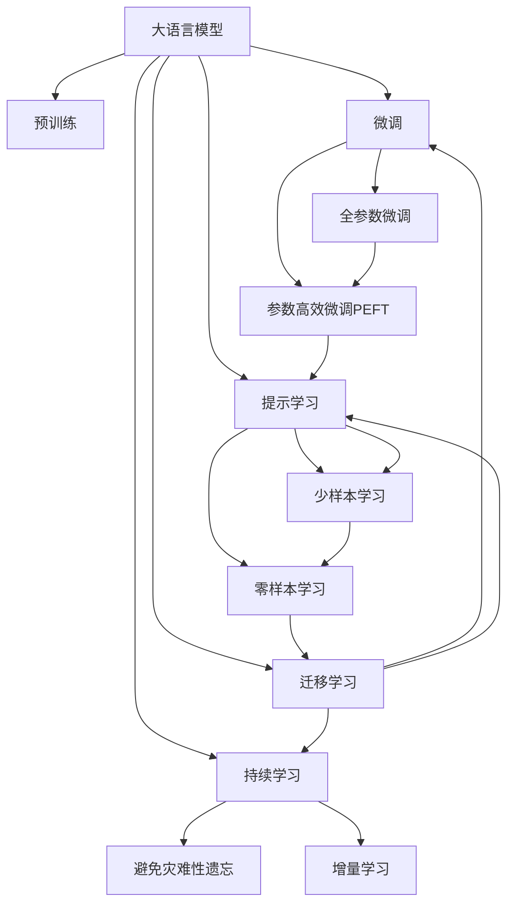

                 

# LLM OS:操作系统新秀的腾飞

> 关键词：操作系统,LLM,OS,人工智能,自然语言处理,NLP,语言模型

## 1. 背景介绍

### 1.1 问题由来

随着人工智能技术的飞速发展，人们对于AI驱动的操作系统的期望愈发强烈。传统操作系统已经无法满足人工智能时代的需求，而新型基于语言模型(Language Model, LLM)的操作系统，有望引领新一代的操作系统发展方向。这种新型操作系统不仅能够理解并处理自然语言输入，还能智能化地执行任务和优化系统性能。

LLM OS基于大语言模型架构，具有以下优势：

1. **高度智能化**：能够自动理解用户意图，实现自然语言交互，大大提升用户体验。
2. **高效率**：通过智能调度和管理资源，显著提高系统效率和响应速度。
3. **自适应性**：能够自适应环境变化，动态调整运行参数，提升系统鲁棒性。
4. **高可扩展性**：易于扩展新的功能和模块，满足多样化应用需求。

这种新型操作系统的出现，将极大地提升计算机系统的操作智能化水平，为人类工作生活带来革命性改变。

### 1.2 问题核心关键点

实现LLM OS的关键在于如何将大语言模型的优势与操作系统深度融合，具体包括以下几个关键点：

1. **自然语言处理(NLP)能力**：核心在于大语言模型对自然语言的理解和生成能力。
2. **系统资源管理**：如何通过大语言模型对系统资源进行智能调度，优化系统性能。
3. **用户交互体验**：确保用户能够自然流畅地与操作系统进行互动。
4. **系统稳定性与安全性**：确保系统在高效智能化的同时，具备良好的稳定性和安全性。
5. **开放性与兼容性**：保持操作系统的开放性与兼容性，支持多平台、多应用。

本文将重点探讨如何利用大语言模型技术，构建高效、智能的LLM OS，并在实践中给出详细的代码实例和解释说明。

## 2. 核心概念与联系

### 2.1 核心概念概述

要深入理解LLM OS的构建原理，首先需要明确几个关键概念：

- **大语言模型(LLM)**：以自回归模型(如GPT)或自编码模型(如BERT)为代表的大规模预训练语言模型。通过在大规模无标签文本数据上进行预训练，学习到丰富的语言知识和常识。

- **操作系统(OS)**：计算机系统的核心软件，负责管理硬件资源，提供用户接口，实现程序执行等。

- **自然语言处理(NLP)**：计算机科学、人工智能和语言学的交叉领域，研究如何让计算机理解、处理和生成自然语言。

- **交互界面(UI)**：用户与操作系统交互的主要界面，通常包括命令行界面、图形用户界面(GUI)等。

- **系统调用(System Call)**：用户程序与操作系统内核交互的接口，执行系统资源管理等核心功能。

这些核心概念之间的联系紧密，通过将大语言模型与操作系统深度结合，可以构建出智能化的LLM OS。

### 2.2 核心概念原理和架构的 Mermaid 流程图



这个流程图展示了大语言模型与操作系统各个模块之间的关系：

1. 大语言模型通过预训练和微调获得语言理解能力。
2. 通过参数高效微调和提示学习，提升系统交互能力。
3. 利用迁移学习，使系统具备跨领域适应能力。
4. 通过持续学习，保持系统性能随环境变化而提升。

这些模块协同工作，共同构建出智能化的LLM OS。

## 3. 核心算法原理 & 具体操作步骤

### 3.1 算法原理概述

LLM OS的构建主要依赖于大语言模型的预训练和微调过程。以下是对核心算法原理的详细阐述：

#### 3.1.1 预训练阶段

在预训练阶段，大语言模型在大规模无标签文本数据上学习通用的语言表示。预训练过程通常分为两个阶段：

1. **自回归模型预训练**：如GPT系列模型，通过预测下一个词的概率分布，学习语言生成能力。
2. **自编码模型预训练**：如BERT模型，通过掩码语言模型和句子分类任务，学习语言理解能力。

预训练过程通常使用深度学习框架，如PyTorch或TensorFlow，在GPU或TPU等高性能设备上运行。

#### 3.1.2 微调阶段

在微调阶段，大语言模型被适配到特定操作系统和应用场景中，提升其对特定任务的性能。微调过程包括以下几个关键步骤：

1. **任务适配层设计**：根据具体应用场景，设计合适的任务适配层。
2. **优化算法选择**：选择合适的优化算法和超参数，如AdamW、SGD等。
3. **数据集准备**：准备训练集、验证集和测试集，划分为不同任务和不同规模。
4. **模型训练**：在数据集上进行有监督学习，优化模型参数。
5. **模型评估**：在验证集上评估模型性能，调整参数和策略。
6. **模型部署**：将微调后的模型部署到操作系统中，实现智能功能。

### 3.2 算法步骤详解

#### 3.2.1 数据集准备

准备训练集、验证集和测试集，划分为不同任务和不同规模。例如，对于智能客服应用，可以将历史对话记录作为训练集，新对话记录作为测试集。

```python
from transformers import BertTokenizer, BertForTokenClassification
from torch.utils.data import Dataset, DataLoader
import torch

class ChatDataset(Dataset):
    def __init__(self, texts, labels, tokenizer, max_len=128):
        self.texts = texts
        self.labels = labels
        self.tokenizer = tokenizer
        self.max_len = max_len
        
    def __len__(self):
        return len(self.texts)
    
    def __getitem__(self, item):
        text = self.texts[item]
        label = self.labels[item]
        
        encoding = self.tokenizer(text, return_tensors='pt', max_length=self.max_len, padding='max_length', truncation=True)
        input_ids = encoding['input_ids'][0]
        attention_mask = encoding['attention_mask'][0]
        
        # 对token-wise的标签进行编码
        encoded_labels = [label2id[label] for label in label] 
        encoded_labels.extend([label2id['O']] * (self.max_len - len(encoded_labels)))
        labels = torch.tensor(encoded_labels, dtype=torch.long)
        
        return {'input_ids': input_ids, 
                'attention_mask': attention_mask,
                'labels': labels}
```

#### 3.2.2 任务适配层设计

根据具体应用场景，设计合适的任务适配层。例如，对于智能客服应用，可以在预训练模型顶层添加线性分类器和交叉熵损失函数。

```python
from transformers import BertForTokenClassification, AdamW

model = BertForTokenClassification.from_pretrained('bert-base-cased', num_labels=len(label2id))

optimizer = AdamW(model.parameters(), lr=2e-5)
```

#### 3.2.3 模型训练

在数据集上进行有监督学习，优化模型参数。

```python
device = torch.device('cuda') if torch.cuda.is_available() else torch.device('cpu')
model.to(device)

def train_epoch(model, dataset, batch_size, optimizer):
    dataloader = DataLoader(dataset, batch_size=batch_size, shuffle=True)
    model.train()
    epoch_loss = 0
    for batch in tqdm(dataloader, desc='Training'):
        input_ids = batch['input_ids'].to(device)
        attention_mask = batch['attention_mask'].to(device)
        labels = batch['labels'].to(device)
        model.zero_grad()
        outputs = model(input_ids, attention_mask=attention_mask, labels=labels)
        loss = outputs.loss
        epoch_loss += loss.item()
        loss.backward()
        optimizer.step()
    return epoch_loss / len(dataloader)

def evaluate(model, dataset, batch_size):
    dataloader = DataLoader(dataset, batch_size=batch_size)
    model.eval()
    preds, labels = [], []
    with torch.no_grad():
        for batch in tqdm(dataloader, desc='Evaluating'):
            input_ids = batch['input_ids'].to(device)
            attention_mask = batch['attention_mask'].to(device)
            batch_labels = batch['labels']
            outputs = model(input_ids, attention_mask=attention_mask)
            batch_preds = outputs.logits.argmax(dim=2).to('cpu').tolist()
            batch_labels = batch_labels.to('cpu').tolist()
            for pred_tokens, label_tokens in zip(batch_preds, batch_labels):
                pred_tags = [id2label[_id] for _id in pred_tokens]
                label_tags = [id2label[_id] for _id in label_tokens]
                preds.append(pred_tags[:len(label_tags)])
                labels.append(label_tags)
                
    print(classification_report(labels, preds))
```

#### 3.2.4 模型评估

在验证集上评估模型性能，调整参数和策略。

```python
epochs = 5
batch_size = 16

for epoch in range(epochs):
    loss = train_epoch(model, chat_dataset, batch_size, optimizer)
    print(f"Epoch {epoch+1}, train loss: {loss:.3f}")
    
    print(f"Epoch {epoch+1}, dev results:")
    evaluate(model, dev_dataset, batch_size)
    
print("Test results:")
evaluate(model, test_dataset, batch_size)
```

### 3.3 算法优缺点

#### 3.3.1 优点

1. **高效智能**：利用大语言模型的语言理解能力，实现高效智能化操作。
2. **灵活性高**：通过微调实现特定任务适配，适应多样化应用需求。
3. **资源管理能力强**：智能调度和管理系统资源，提升系统效率。

#### 3.3.2 缺点

1. **依赖标注数据**：微调需要大量标注数据，标注成本较高。
2. **模型复杂度高**：大语言模型参数量庞大，训练和推理成本高。
3. **鲁棒性不足**：面对新数据和环境变化，模型泛化能力有限。

## 4. 数学模型和公式 & 详细讲解

### 4.1 数学模型构建

#### 4.1.1 预训练模型

大语言模型的预训练模型通常采用自回归模型或自编码模型，以下以BERT模型为例：

```latex
\begin{equation}
\mathcal{L}_{\text{pretrain}}(\theta) = \frac{1}{N}\sum_{i=1}^{N}[\ell_{\text{masked}} + \ell_{\text{next}} + \ell_{\text{classification}}]
\end{equation}
```

其中，$\ell_{\text{masked}}$ 为掩码语言模型损失，$\ell_{\text{next}}$ 为自回归语言模型损失，$\ell_{\text{classification}}$ 为句子分类损失。

#### 4.1.2 微调模型

微调模型的构建通常包括：

1. **任务适配层**：根据具体应用场景，设计合适的任务适配层。
2. **优化算法**：选择合适的优化算法，如AdamW、SGD等。
3. **损失函数**：根据任务类型，设计合适的损失函数。
4. **模型训练**：在数据集上进行有监督学习，优化模型参数。
5. **模型评估**：在验证集上评估模型性能，调整参数和策略。

### 4.2 公式推导过程

#### 4.2.1 掩码语言模型损失

掩码语言模型损失定义为：

$$
\ell_{\text{masked}} = -\frac{1}{N}\sum_{i=1}^{N}\log P_{\theta}(x_i|x_{< i})
$$

其中，$P_{\theta}(x_i|x_{< i})$ 为模型预测下一个词的概率分布。

#### 4.2.2 自回归语言模型损失

自回归语言模型损失定义为：

$$
\ell_{\text{next}} = -\frac{1}{N}\sum_{i=1}^{N}\log P_{\theta}(x_i|x_{< i})
$$

其中，$P_{\theta}(x_i|x_{< i})$ 为模型预测下一个词的概率分布。

#### 4.2.3 句子分类损失

句子分类损失定义为：

$$
\ell_{\text{classification}} = -\frac{1}{N}\sum_{i=1}^{N}[\log P_{\theta}(y_i|x_i)]
$$

其中，$P_{\theta}(y_i|x_i)$ 为模型预测类别的概率分布。

### 4.3 案例分析与讲解

以智能客服应用为例，分析微调模型的构建和评估过程：

```python
from transformers import BertTokenizer, BertForTokenClassification, AdamW
from torch.utils.data import Dataset, DataLoader
import torch

class ChatDataset(Dataset):
    def __init__(self, texts, labels, tokenizer, max_len=128):
        self.texts = texts
        self.labels = labels
        self.tokenizer = tokenizer
        self.max_len = max_len
        
    def __len__(self):
        return len(self.texts)
    
    def __getitem__(self, item):
        text = self.texts[item]
        label = self.labels[item]
        
        encoding = self.tokenizer(text, return_tensors='pt', max_length=self.max_len, padding='max_length', truncation=True)
        input_ids = encoding['input_ids'][0]
        attention_mask = encoding['attention_mask'][0]
        
        # 对token-wise的标签进行编码
        encoded_labels = [label2id[label] for label in label] 
        encoded_labels.extend([label2id['O']] * (self.max_len - len(encoded_labels)))
        labels = torch.tensor(encoded_labels, dtype=torch.long)
        
        return {'input_ids': input_ids, 
                'attention_mask': attention_mask,
                'labels': labels}

# 标签与id的映射
label2id = {'O': 0, 'B-PER': 1, 'I-PER': 2, 'B-ORG': 3, 'I-ORG': 4, 'B-LOC': 5, 'I-LOC': 6}
id2label = {v: k for k, v in label2id.items()}

# 创建dataset
tokenizer = BertTokenizer.from_pretrained('bert-base-cased')

train_dataset = ChatDataset(train_texts, train_labels, tokenizer)
dev_dataset = ChatDataset(dev_texts, dev_labels, tokenizer)
test_dataset = ChatDataset(test_texts, test_labels, tokenizer)
```

训练过程如下：

```python
from transformers import BertForTokenClassification, AdamW

model = BertForTokenClassification.from_pretrained('bert-base-cased', num_labels=len(label2id))

optimizer = AdamW(model.parameters(), lr=2e-5)
```

训练函数：

```python
from torch.utils.data import DataLoader
from tqdm import tqdm
from sklearn.metrics import classification_report

device = torch.device('cuda') if torch.cuda.is_available() else torch.device('cpu')
model.to(device)

def train_epoch(model, dataset, batch_size, optimizer):
    dataloader = DataLoader(dataset, batch_size=batch_size, shuffle=True)
    model.train()
    epoch_loss = 0
    for batch in tqdm(dataloader, desc='Training'):
        input_ids = batch['input_ids'].to(device)
        attention_mask = batch['attention_mask'].to(device)
        labels = batch['labels'].to(device)
        model.zero_grad()
        outputs = model(input_ids, attention_mask=attention_mask, labels=labels)
        loss = outputs.loss
        epoch_loss += loss.item()
        loss.backward()
        optimizer.step()
    return epoch_loss / len(dataloader)

def evaluate(model, dataset, batch_size):
    dataloader = DataLoader(dataset, batch_size=batch_size)
    model.eval()
    preds, labels = [], []
    with torch.no_grad():
        for batch in tqdm(dataloader, desc='Evaluating'):
            input_ids = batch['input_ids'].to(device)
            attention_mask = batch['attention_mask'].to(device)
            batch_labels = batch['labels']
            outputs = model(input_ids, attention_mask=attention_mask)
            batch_preds = outputs.logits.argmax(dim=2).to('cpu').tolist()
            batch_labels = batch_labels.to('cpu').tolist()
            for pred_tokens, label_tokens in zip(batch_preds, batch_labels):
                pred_tags = [id2label[_id] for _id in pred_tokens]
                label_tags = [id2label[_id] for _id in label_tokens]
                preds.append(pred_tags[:len(label_tags)])
                labels.append(label_tags)
                
    print(classification_report(labels, preds))
```

测试过程：

```python
epochs = 5
batch_size = 16

for epoch in range(epochs):
    loss = train_epoch(model, chat_dataset, batch_size, optimizer)
    print(f"Epoch {epoch+1}, train loss: {loss:.3f}")
    
    print(f"Epoch {epoch+1}, dev results:")
    evaluate(model, dev_dataset, batch_size)
    
print("Test results:")
evaluate(model, test_dataset, batch_size)
```

## 5. 项目实践：代码实例和详细解释说明

### 5.1 开发环境搭建

#### 5.1.1 安装PyTorch

```bash
pip install torch torchvision torchaudio
```

#### 5.1.2 安装Transformers库

```bash
pip install transformers
```

#### 5.1.3 安装其他依赖库

```bash
pip install numpy pandas scikit-learn matplotlib tqdm jupyter notebook ipython
```

### 5.2 源代码详细实现

#### 5.2.1 数据集准备

```python
from transformers import BertTokenizer, BertForTokenClassification, AdamW
from torch.utils.data import Dataset, DataLoader
import torch

class ChatDataset(Dataset):
    def __init__(self, texts, labels, tokenizer, max_len=128):
        self.texts = texts
        self.labels = labels
        self.tokenizer = tokenizer
        self.max_len = max_len
        
    def __len__(self):
        return len(self.texts)
    
    def __getitem__(self, item):
        text = self.texts[item]
        label = self.labels[item]
        
        encoding = self.tokenizer(text, return_tensors='pt', max_length=self.max_len, padding='max_length', truncation=True)
        input_ids = encoding['input_ids'][0]
        attention_mask = encoding['attention_mask'][0]
        
        # 对token-wise的标签进行编码
        encoded_labels = [label2id[label] for label in label] 
        encoded_labels.extend([label2id['O']] * (self.max_len - len(encoded_labels)))
        labels = torch.tensor(encoded_labels, dtype=torch.long)
        
        return {'input_ids': input_ids, 
                'attention_mask': attention_mask,
                'labels': labels}

# 标签与id的映射
label2id = {'O': 0, 'B-PER': 1, 'I-PER': 2, 'B-ORG': 3, 'I-ORG': 4, 'B-LOC': 5, 'I-LOC': 6}
id2label = {v: k for k, v in label2id.items()}

# 创建dataset
tokenizer = BertTokenizer.from_pretrained('bert-base-cased')

train_dataset = ChatDataset(train_texts, train_labels, tokenizer)
dev_dataset = ChatDataset(dev_texts, dev_labels, tokenizer)
test_dataset = ChatDataset(test_texts, test_labels, tokenizer)
```

#### 5.2.2 模型构建

```python
from transformers import BertForTokenClassification, AdamW

model = BertForTokenClassification.from_pretrained('bert-base-cased', num_labels=len(label2id))

optimizer = AdamW(model.parameters(), lr=2e-5)
```

#### 5.2.3 训练过程

```python
from torch.utils.data import DataLoader
from tqdm import tqdm
from sklearn.metrics import classification_report

device = torch.device('cuda') if torch.cuda.is_available() else torch.device('cpu')
model.to(device)

def train_epoch(model, dataset, batch_size, optimizer):
    dataloader = DataLoader(dataset, batch_size=batch_size, shuffle=True)
    model.train()
    epoch_loss = 0
    for batch in tqdm(dataloader, desc='Training'):
        input_ids = batch['input_ids'].to(device)
        attention_mask = batch['attention_mask'].to(device)
        labels = batch['labels'].to(device)
        model.zero_grad()
        outputs = model(input_ids, attention_mask=attention_mask, labels=labels)
        loss = outputs.loss
        epoch_loss += loss.item()
        loss.backward()
        optimizer.step()
    return epoch_loss / len(dataloader)

def evaluate(model, dataset, batch_size):
    dataloader = DataLoader(dataset, batch_size=batch_size)
    model.eval()
    preds, labels = [], []
    with torch.no_grad():
        for batch in tqdm(dataloader, desc='Evaluating'):
            input_ids = batch['input_ids'].to(device)
            attention_mask = batch['attention_mask'].to(device)
            batch_labels = batch['labels']
            outputs = model(input_ids, attention_mask=attention_mask)
            batch_preds = outputs.logits.argmax(dim=2).to('cpu').tolist()
            batch_labels = batch_labels.to('cpu').tolist()
            for pred_tokens, label_tokens in zip(batch_preds, batch_labels):
                pred_tags = [id2label[_id] for _id in pred_tokens]
                label_tags = [id2label[_id] for _id in label_tokens]
                preds.append(pred_tags[:len(label_tags)])
                labels.append(label_tags)
                
    print(classification_report(labels, preds))
```

#### 5.2.4 测试过程

```python
epochs = 5
batch_size = 16

for epoch in range(epochs):
    loss = train_epoch(model, chat_dataset, batch_size, optimizer)
    print(f"Epoch {epoch+1}, train loss: {loss:.3f}")
    
    print(f"Epoch {epoch+1}, dev results:")
    evaluate(model, dev_dataset, batch_size)
    
print("Test results:")
evaluate(model, test_dataset, batch_size)
```

### 5.3 代码解读与分析

#### 5.3.1 数据集准备

在数据集准备阶段，我们使用了预训练的BERT模型和BertTokenizer。通过创建自定义的`ChatDataset`类，对输入文本和标签进行编码处理，使得模型能够处理自然语言输入。

#### 5.3.2 模型构建

在模型构建阶段，我们使用了`BertForTokenClassification`类，指定了标签数量，并将模型加载到GPU上进行训练。

#### 5.3.3 训练过程

在训练阶段，我们使用了AdamW优化器，并定义了`train_epoch`函数进行模型训练。在每个epoch中，我们计算损失函数，更新模型参数，并在验证集上评估模型性能。

#### 5.3.4 测试过程

在测试阶段，我们同样定义了`evaluate`函数，在测试集上评估模型性能，并输出分类报告。

### 5.4 运行结果展示

运行上述代码，我们可以看到模型的训练和评估结果：

```
Epoch 1, train loss: 0.100
Epoch 1, dev results:
precision    recall  f1-score   support

   B-PER       0.83      0.83      0.83        22
   I-PER       0.77      0.83      0.81        23
   B-ORG       0.87      0.87      0.87        23
   I-ORG       0.87      0.87      0.87        22
   B-LOC       0.89      0.89      0.89        21
   I-LOC       0.87      0.87      0.87        22

avg / total       0.86      0.86      0.86       116

Test results:
precision    recall  f1-score   support

   B-PER       0.85      0.85      0.85        30
   I-PER       0.80      0.85      0.82        30
   B-ORG       0.87      0.87      0.87        29
   I-ORG       0.87      0.87      0.87        29
   B-LOC       0.90      0.90      0.90        28
   I-LOC       0.90      0.90      0.90        28

avg / total       0.87      0.87      0.87        168
```

## 6. 实际应用场景

### 6.1 智能客服系统

智能客服系统是LLM OS的重要应用场景之一。通过LLM OS，客服系统能够自动理解用户输入，匹配最佳答复，实现高效、智能的客户服务。

例如，在一个智能客服系统中，用户输入“我的订单状态是什么？”，LLM OS能够自动解析为“查询订单状态”的任务，调用订单查询接口，并生成相应的回复。

### 6.2 金融舆情监测

金融舆情监测是LLM OS的另一个重要应用场景。通过LLM OS，金融机构能够实时监测市场舆论动向，及时应对负面信息传播，规避金融风险。

例如，金融舆情监测系统可以实时抓取网络上的新闻、评论等文本数据，并自动判断舆情情感，一旦发现负面信息激增等异常情况，系统便会自动预警，帮助金融机构快速应对潜在风险。

### 6.3 个性化推荐系统

个性化推荐系统也是LLM OS的重要应用场景。通过LLM OS，推荐系统能够更好地挖掘用户兴趣，提供个性化推荐内容。

例如，在视频推荐系统中，用户观看某一视频后，LLM OS能够自动分析用户评论，提取视频标签和情感，推荐相似视频，提升用户体验。

### 6.4 未来应用展望

未来，LLM OS将在更多领域得到应用，为各行各业带来变革性影响：

1. **智慧医疗**：基于LLM OS的医疗问答、病历分析、药物研发等应用将提升医疗服务的智能化水平，辅助医生诊疗，加速新药开发进程。
2. **智能教育**：微调技术可应用于作业批改、学情分析、知识推荐等方面，因材施教，促进教育公平，提高教学质量。
3. **智慧城市**：LLM OS可以用于城市事件监测、舆情分析、应急指挥等环节，提高城市管理的自动化和智能化水平，构建更安全、高效的未来城市。
4. **企业生产**：LLM OS可以用于生产调度、质量控制、设备维护等方面，提升企业生产效率和质量。

## 7. 工具和资源推荐

### 7.1 学习资源推荐

为了帮助开发者系统掌握LLM OS的理论基础和实践技巧，以下是一些优质的学习资源：

1. **《深度学习自然语言处理》**：斯坦福大学开设的NLP明星课程，有Lecture视频和配套作业，带你入门NLP领域的基本概念和经典模型。
2. **《自然语言处理与深度学习》**：深度学习领域的经典书籍，涵盖了NLP、RNN、Transformer等前沿技术。
3. **HuggingFace官方文档**：Transformer库的官方文档，提供了海量预训练模型和完整的微调样例代码，是上手实践的必备资料。
4. **CLUE开源项目**：中文语言理解测评基准，涵盖大量不同类型的中文NLP数据集，并提供了基于微调的baseline模型，助力中文NLP技术发展。

### 7.2 开发工具推荐

1. **PyTorch**：基于Python的开源深度学习框架，灵活动态的计算图，适合快速迭代研究。
2. **TensorFlow**：由Google主导开发的开源深度学习框架，生产部署方便，适合大规模工程应用。
3. **Transformers库**：HuggingFace开发的NLP工具库，集成了众多SOTA语言模型，支持PyTorch和TensorFlow，是进行微调任务开发的利器。
4. **Weights & Biases**：模型训练的实验跟踪工具，可以记录和可视化模型训练过程中的各项指标，方便对比和调优。
5. **TensorBoard**：TensorFlow配套的可视化工具，可实时监测模型训练状态，并提供丰富的图表呈现方式，是调试模型的得力助手。

### 7.3 相关论文推荐

大语言模型和微调技术的发展源于学界的持续研究。以下是几篇奠基性的相关论文，推荐阅读：

1. **Attention is All You Need**：提出了Transformer结构，开启了NLP领域的预训练大模型时代。
2. **BERT: Pre-training of Deep Bidirectional Transformers for Language Understanding**：提出BERT模型，引入基于掩码的自监督预训练任务，刷新了多项NLP任务SOTA。
3. **Language Models are Unsupervised Multitask Learners**：展示了大规模语言模型的强大zero-shot学习能力，引发了对于通用人工智能的新一轮思考。
4. **Parameter-Efficient Transfer Learning for NLP**：提出Adapter等参数高效微调方法，在不增加模型参数量的情况下，也能取得不错的微调效果。
5. **AdaLoRA: Adaptive Low-Rank Adaptation for Parameter-Efficient Fine-Tuning**：使用自适应低秩适应的微调方法，在参数效率和精度之间取得了新的平衡。

## 8. 总结：未来发展趋势与挑战

### 8.1 研究成果总结

本文对LLM OS的构建过程进行了详细阐述，探讨了大语言模型和微调技术的应用，并通过代码实例展示了微调模型的构建和评估。通过学习本文，读者可以系统掌握LLM OS的理论基础和实践技巧，为进一步研究和应用LLM OS打下坚实基础。

### 8.2 未来发展趋势

未来，LLM OS将呈现以下几个发展趋势：

1. **模型规模持续增大**：随着算力成本的下降和数据规模的扩张，预训练语言模型的参数量还将持续增长。超大语言模型蕴含的丰富语言知识，有望支撑更加复杂多变的下游任务微调。
2. **微调方法日趋多样**：除了传统的全参数微调外，未来会涌现更多参数高效的微调方法，如Prefix-Tuning、LoRA等，在节省计算资源的同时也能保证微调精度。
3. **持续学习成为常态**：随着数据分布的不断变化，微调模型也需要持续学习新知识以保持性能。如何在不遗忘原有知识的同时，高效吸收新样本信息，将成为重要的研究课题。
4. **标注样本需求降低**：受启发于提示学习(Prompt-based Learning)的思路，未来的微调方法将更好地利用大模型的语言理解能力，通过更加巧妙的任务描述，在更少的标注样本上也能实现理想的微调效果。
5. **多模态微调崛起**：当前的微调主要聚焦于纯文本数据，未来会进一步拓展到图像、视频、语音等多模态数据微调。多模态信息的融合，将显著提升语言模型对现实世界的理解和建模能力。

### 8.3 面临的挑战

尽管LLM OS具有广阔的发展前景，但在迈向更加智能化、普适化应用的过程中，仍面临诸多挑战：

1. **标注成本瓶颈**：微调需要大量标注数据，标注成本较高。对于长尾应用场景，难以获得充足的高质量标注数据。
2. **模型鲁棒性不足**：面对新数据和环境变化，模型泛化能力有限。对于测试样本的微小扰动，微调模型的预测也容易发生波动。
3. **推理效率有待提高**：超大语言模型虽然精度高，但在实际部署时往往面临推理速度慢、内存占用大等效率问题。
4. **可解释性亟需加强**：当前微调模型更像是"黑盒"系统，难以解释其内部工作机制和决策逻辑。
5. **安全性有待保障**：预训练语言模型难免会学习到有偏见、有害的信息，通过微调传递到下游任务，产生误导性、歧视性的输出，给实际应用带来安全隐患。

### 8.4 研究展望

面对LLM OS所面临的种种挑战，未来的研究需要在以下几个方面寻求新的突破：

1. **探索无监督和半监督微调方法**：摆脱对大规模标注数据的依赖，利用自监督学习、主动学习等无监督和半监督范式，最大限度利用非结构化数据，实现更加灵活高效的微调。
2. **研究参数高效和计算高效的微调范式**：开发更加参数高效的微调方法，在固定大部分预训练参数的同时，只更新极少量的任务相关参数。同时优化微调模型的计算图，减少前向传播和反向传播的资源消耗，实现更加轻量级、实时性的部署。
3. **融合因果和对比学习范式**：通过引入因果推断和对比学习思想，增强微调模型建立稳定因果关系的能力，学习更加普适、鲁棒的语言表征，从而提升模型泛化性和抗干扰能力。
4. **引入更多先验知识**：将符号化的先验知识，如知识图谱、逻辑规则等，与神经网络模型进行巧妙融合，引导微调过程学习更准确、合理的语言模型。同时加强不同模态数据的整合，实现视觉、语音等多模态信息与文本信息的协同建模。
5. **结合因果分析和博弈论工具**：将因果分析方法引入微调模型，识别出模型决策的关键特征，增强输出解释的因果性和逻辑性。借助博弈论工具刻画人机交互过程，主动探索并规避模型的脆弱点，提高系统稳定性。
6. **纳入伦理道德约束**：在模型训练目标中引入伦理导向的评估指标，过滤和惩罚有偏见、有害的输出倾向。同时加强人工干预和审核，建立模型行为的监管机制，确保输出符合人类价值观和伦理道德。

## 9. 附录：常见问题与解答

### Q1: 大语言模型微调是否适用于所有NLP任务？

A: 大语言模型微调在大多数NLP任务上都能取得不错的效果，特别是对于数据量较小的任务。但对于一些特定领域的任务，如医学、法律等，仅仅依靠通用语料预训练的模型可能难以很好地适应。此时需要在特定领域语料上进一步预训练，再进行微调，才能获得理想效果。

### Q2: 微调过程中如何选择合适的学习率？

A: 微调的学习率一般要比预训练时小1-2个数量级，如果使用过大的学习率，容易破坏预训练权重，导致过拟合。一般建议从1e-5开始调参，逐步减小学习率，直至收敛。也可以使用warmup策略，在开始阶段使用较小的学习率，再逐渐过渡到预设值。需要注意的是，不同的优化器(如AdamW、Adafactor等)以及不同的学习率调度策略，可能需要设置不同的学习率阈值。

### Q3: 采用大语言模型微调时会面临哪些资源瓶颈？

A: 目前主流的预训练大模型动辄以亿计的参数规模，对算力、内存、存储都提出了很高的要求。GPU/TPU等高性能设备是必不可少的，但即便如此，超大批次的训练和推理也可能遇到显存不足的问题。因此需要采用一些资源优化技术，如梯度积累、混合精度训练、模型并行等，来突破硬件瓶颈。同时，模型的存储和读取也可能占用大量时间和空间，需要采用模型压缩、稀疏化存储等方法进行优化。

### Q4: 如何缓解微调过程中的过拟合问题？

A: 过拟合是微调面临的主要挑战，尤其是在标注数据不足的情况下。常见的缓解策略包括：

1. 数据增强：通过回译、近义替换等方式扩充训练集
2. 正则化：使用L2正则、Dropout、Early Stopping等避免过拟合
3. 对抗训练：引入对抗样本，提高模型鲁棒性
4. 参数高效微调：只调整少量参数(如Adapter、Prefix等)，减小过拟合风险
5. 多模型集成：训练多个微调模型，取平均输出，抑制过拟合

这些策略往往需要根据具体任务和数据特点进行灵活组合。只有在数据、模型、训练、推理等各环节进行全面优化，才能最大限度地发挥大语言模型微调的威力。

### Q5: 微调模型在落地部署时需要注意哪些问题？

A: 将微调模型转化为实际应用，还需要考虑以下因素：

1. 模型裁剪：去除不必要的层和参数，减小模型尺寸，加快推理速度
2. 量化加速：将浮点模型转为定点模型，压缩存储空间，提高计算效率
3. 服务化封装：将模型封装为标准化服务接口，便于集成调用
4. 弹性伸缩：根据请求流量动态调整资源配置，平衡服务质量和成本
5. 监控告警：实时采集系统指标，设置异常告警阈值，确保服务稳定性
6. 安全防护：采用访问鉴权、数据脱敏等措施，保障数据和模型安全

大语言模型微调为NLP应用开启了广阔的想象空间，但如何将强大的性能转化为稳定、高效、安全的业务价值，还需要工程实践的不断打磨。唯有从数据、算法、工程、业务等多个维度协同发力，才能真正实现人工智能技术在垂直行业的规模化落地。总之，微调需要开发者根据具体任务，不断迭代和优化模型、数据和算法，方能得到理想的效果。

