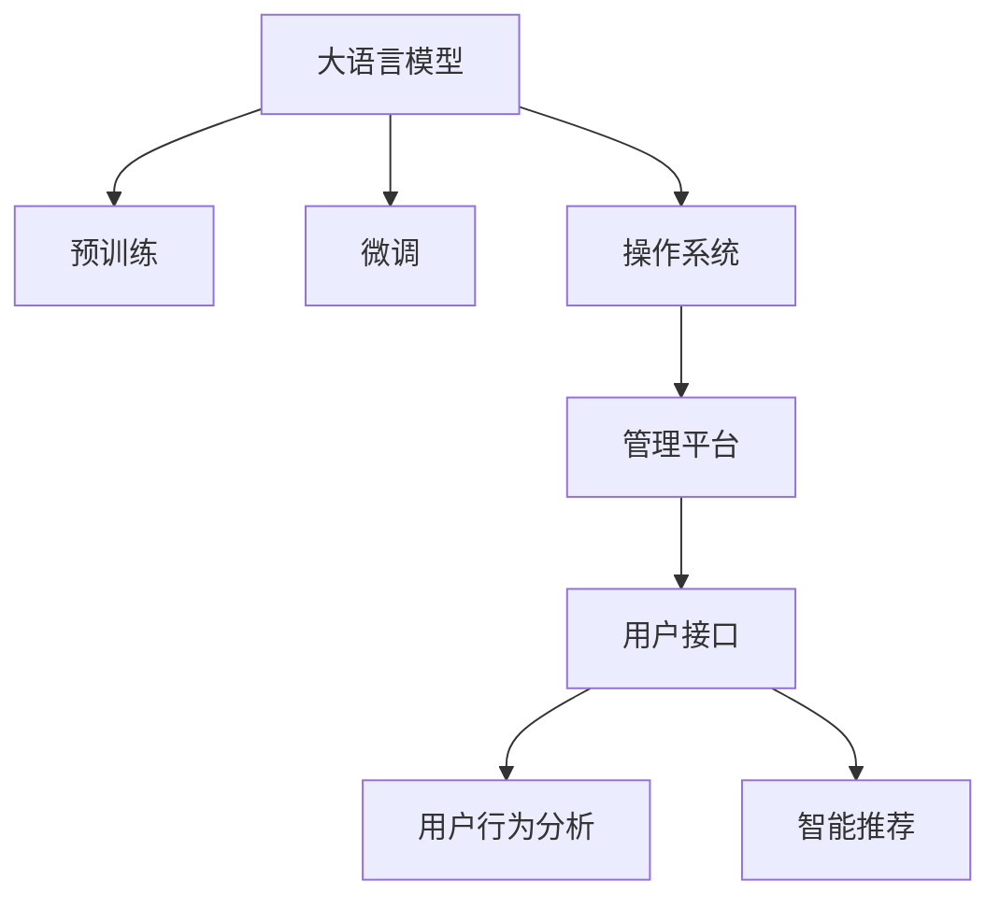

                 

# LLM OS:操作系统新秀的诞生

> 关键词：大语言模型,微调,Fine-tuning,操作系统,LLM OS,管理平台,自然语言处理,NLP,API,用户接口,用户行为分析,智能推荐

## 1. 背景介绍

### 1.1 问题由来
随着人工智能技术的迅速发展，大语言模型（Large Language Model, LLMs）在自然语言处理（NLP）领域取得了巨大的成功。这些模型通过在大量无标签文本数据上进行预训练，学习到了丰富的语言知识和常识，能够在各种NLP任务上表现出色。

然而，尽管大语言模型在通用NLP任务上表现优异，但在特定领域的应用中，其性能仍存在一定局限性。为了克服这些局限性，研究人员开始探索将大语言模型应用于更具体的操作系统场景中。在这一背景下，LLM OS应运而生，它结合了大语言模型的强大语言理解和生成能力，以及操作系统的管理和调度机制，为操作系统带来了全新的面貌。

### 1.2 问题核心关键点
LLM OS的核心在于如何将大语言模型的语言理解能力与操作系统的管理调度机制相结合，以实现智能化的操作系统管理。其核心问题包括：
- 如何利用大语言模型的语言理解能力来优化操作系统的管理效率。
- 如何通过微调技术来提升大语言模型在特定操作系统任务上的性能。
- 如何构建一个统一、易用的管理平台，使得管理员能够更轻松地进行操作系统管理和维护。
- 如何利用用户行为数据，实现智能化的用户界面和推荐系统。

这些核心问题推动了大语言模型在操作系统中的深入研究和应用，使得LLM OS成为操作系统领域的创新点之一。

## 2. 核心概念与联系

### 2.1 核心概念概述

为更好地理解LLM OS的设计思路和原理，本节将介绍几个关键概念：

- 大语言模型：以自回归（如GPT）或自编码（如BERT）模型为代表的大规模预训练语言模型。通过在大规模无标签文本语料上进行预训练，学习到了通用的语言表示，具备强大的语言理解和生成能力。
- 微调：在预训练模型的基础上，使用下游任务的少量标注数据，通过有监督学习优化模型在该任务上的性能。通常只需要调整顶层分类器或解码器，并以较小的学习率更新全部或部分的模型参数。
- 操作系统：管理和控制计算机硬件和软件资源的系统软件，包括调度、存储、网络、设备管理等功能。
- LLM OS：结合了大语言模型和操作系统的概念，利用大语言模型的语言理解能力来优化操作系统的管理和调度。
- 管理平台：用于监控、配置和控制操作系统的工具集，提供统一的API接口，方便管理员进行管理和维护。
- 用户接口：操作系统与用户交互的界面，包括图形界面和命令行界面。
- 用户行为分析：通过分析用户的输入和行为，来优化操作系统的界面和推荐系统，提升用户体验。
- 智能推荐：利用用户行为数据，推荐用户可能感兴趣的操作系统功能和设置。

这些概念之间的逻辑关系可以通过以下Mermaid流程图来展示：



这个流程图展示了大语言模型、微调、操作系统、管理平台、用户接口、用户行为分析、智能推荐等概念之间的关系：

1. 大语言模型通过预训练获得基础能力。
2. 微调是对预训练模型进行任务特定的优化，以提升模型在特定操作系统任务上的性能。
3. 操作系统利用大语言模型的语言理解能力来优化管理和调度。
4. 管理平台提供统一的API接口，方便管理员进行管理和维护。
5. 用户接口是操作系统与用户交互的界面。
6. 用户行为分析通过分析用户输入和行为，优化操作系统界面和推荐系统。
7. 智能推荐利用用户行为数据，推荐用户感兴趣的功能和设置。

这些概念共同构成了LLM OS的核心框架，使其能够实现智能化操作系统管理。

## 3. 核心算法原理 & 具体操作步骤
### 3.1 算法原理概述

LLM OS的设计思路可以概括为以下几点：

1. **模型预训练**：使用大规模无标签文本数据对大语言模型进行预训练，学习通用的语言表示。
2. **任务适配**：根据具体的操作系统任务，设计任务适配层，将预训练模型输出转换为特定任务的目标。
3. **微调优化**：使用操作系统任务的少量标注数据，通过微调优化模型，使其在特定任务上表现更优。
4. **智能推荐**：利用用户行为数据，通过微调模型，实现智能化的用户界面和推荐系统。
5. **管理平台**：提供一个统一的管理平台，方便管理员进行操作系统管理和维护。

以下是对各个步骤的详细介绍。

### 3.2 算法步骤详解

**Step 1: 模型预训练**

预训练是LLM OS的重要组成部分，通过预训练，模型学习到通用的语言表示。预训练的流程如下：

1. 收集大规模无标签文本数据，如维基百科、新闻网站等。
2. 使用自监督学习方法，如掩码语言模型（MLM）和下一句预测（NSP），对数据进行预训练。
3. 对预训练后的模型进行评估，选择合适的模型作为LLM OS的基础模型。

**Step 2: 任务适配**

任务适配层的设计是LLM OS的核心。根据具体的操作系统任务，设计适配层，将预训练模型输出转换为目标。以管理平台为例，适配层的结构如图1所示：

```
input text -> encoder -> task-specific layer -> output
```

其中，`input text`为输入的文本数据，`encoder`为预训练模型的编码器部分，`task-specific layer`为任务适配层，`output`为目标输出。适配层的设计需要根据具体任务进行优化，如管理平台的适配层需要输出操作系统的管理指令和参数。

**Step 3: 微调优化**

微调优化是LLM OS的另一个关键环节。使用操作系统任务的少量标注数据，通过微调优化模型，使其在特定任务上表现更优。微调的具体步骤如下：

1. 准备操作系统任务的少量标注数据。
2. 使用微调框架，如PyTorch或TensorFlow，加载预训练模型和适配层。
3. 设计损失函数和优化器，优化模型参数，使得模型在特定任务上表现更优。
4. 在验证集上评估模型性能，调整学习率和优化策略。
5. 在测试集上评估模型性能，发布微调后的模型。

**Step 4: 智能推荐**

智能推荐系统是LLM OS的重要组成部分。利用用户行为数据，通过微调模型，实现智能化的用户界面和推荐系统。具体步骤包括：

1. 收集用户的操作系统行为数据，如用户点击、操作频率等。
2. 使用自然语言处理技术，将行为数据转换为文本数据。
3. 使用微调模型，将行为数据转换为目标推荐结果。
4. 将推荐结果展示给用户，提升用户体验。

**Step 5: 管理平台**

管理平台是LLM OS的关键组成部分，用于监控、配置和控制操作系统。管理平台的设计需要考虑以下几个方面：

1. 设计统一的API接口，方便管理员进行管理和维护。
2. 提供可视化的界面，展示操作系统的状态和性能指标。
3. 支持管理员对操作系统进行配置和控制，如添加新用户、设置权限等。
4. 支持管理员监控操作系统的性能和健康状况，及时发现和解决故障。

### 3.3 算法优缺点

LLM OS结合了大语言模型和操作系统的概念，具有以下优点：

1. **高效管理**：利用大语言模型的语言理解能力，实现高效的操作系统管理。
2. **智能推荐**：通过微调模型，实现智能化的用户界面和推荐系统，提升用户体验。
3. **易于维护**：提供一个统一的管理平台，方便管理员进行管理和维护。
4. **可扩展性**：基于微调技术，可以根据不同的操作系统任务进行优化和扩展。

同时，LLM OS也存在一些局限性：

1. **计算资源需求高**：预训练和微调需要大量的计算资源，对硬件要求较高。
2. **微调数据需求大**：微调需要大量的标注数据，数据获取成本较高。
3. **模型可解释性不足**：预训练和微调模型难以解释其内部工作机制和决策逻辑，缺乏可解释性。

尽管存在这些局限性，但LLM OS在提升操作系统的智能化和用户体验方面具有重要意义。

### 3.4 算法应用领域

LLM OS结合了大语言模型和操作系统的概念，在多个领域具有广泛的应用前景，包括：

1. **企业操作系统**：利用智能推荐和用户行为分析，提升企业操作系统的管理和用户体验。
2. **智能家居系统**：利用智能推荐和语言理解能力，实现智能化的家居管理。
3. **教育系统**：利用智能推荐和语言理解能力，提升教育系统的教学效果和管理效率。
4. **医疗系统**：利用智能推荐和语言理解能力，提升医疗系统的诊断和治疗效果。
5. **金融系统**：利用智能推荐和语言理解能力，提升金融系统的客户服务和风险控制效果。

## 4. 数学模型和公式 & 详细讲解 & 举例说明

### 4.1 数学模型构建

本节将使用数学语言对LLM OS的设计思路进行更加严格的刻画。

记大语言模型为 $M_{\theta}$，其中 $\theta$ 为预训练模型参数。假设操作系统任务为 $T$，训练集为 $D=\{(x_i, y_i)\}_{i=1}^N, x_i \in \mathcal{X}, y_i \in \mathcal{Y}$。

定义模型 $M_{\theta}$ 在输入 $x$ 上的输出为 $\hat{y}=M_{\theta}(x)$，其中 $\hat{y} \in [0,1]$ 表示任务 $T$ 的预测概率。定义任务 $T$ 的损失函数为 $\ell(M_{\theta}(x),y)$。

微调的优化目标是最小化任务损失函数，即：

$$
\theta^* = \mathop{\arg\min}_{\theta} \mathcal{L}(\theta)
$$

其中 $\mathcal{L}$ 为任务损失函数。常见的损失函数包括交叉熵损失、均方误差损失等。

### 4.2 公式推导过程

以下我们以管理平台的任务适配层为例，推导适配层的数学模型。

假设管理平台的任务适配层需要将输入文本转换为操作系统的管理指令，如添加新用户、设置权限等。适配层的输出为目标管理指令 $\hat{y}=M_{\theta}(x)$。

适配层的损失函数可以定义为目标任务与输入文本之间的交叉熵损失：

$$
\ell(M_{\theta}(x),y) = -y\log M_{\theta}(x) - (1-y)\log (1-M_{\theta}(x))
$$

其中 $y$ 为任务 $T$ 的真实标签，表示是否需要执行管理指令。适配层的输出 $\hat{y}$ 为模型预测的概率，表示是否需要执行管理指令。

适配层的优化目标是最小化任务损失函数，即：

$$
\theta^* = \mathop{\arg\min}_{\theta} \mathcal{L}(\theta)
$$

其中 $\mathcal{L}$ 为适配层的损失函数，通过反向传播算法更新模型参数 $\theta$。

### 4.3 案例分析与讲解

**案例分析**：假设管理员输入指令“添加新用户”，适配层将指令转换为目标管理指令，如“添加用户信息”。适配层的输入为“添加新用户”，输出为目标管理指令。

**讲解**：适配层的设计需要考虑以下几个方面：

1. **编码器**：使用预训练模型的编码器部分，将输入文本转换为向量表示。
2. **任务映射**：设计任务映射层，将向量表示映射为任务标签，如“添加用户信息”。
3. **输出层**：设计输出层，将任务标签转换为管理指令，如“添加用户信息”。

适配层的结构如图2所示：

```
input text -> encoder -> task mapping -> output
```

## 5. 项目实践：代码实例和详细解释说明

### 5.1 开发环境搭建

在进行LLM OS的开发实践前，我们需要准备好开发环境。以下是使用Python进行PyTorch开发的环境配置流程：

1. 安装Anaconda：从官网下载并安装Anaconda，用于创建独立的Python环境。

2. 创建并激活虚拟环境：
```bash
conda create -n llm-os python=3.8 
conda activate llm-os
```

3. 安装PyTorch：根据CUDA版本，从官网获取对应的安装命令。例如：
```bash
conda install pytorch torchvision torchaudio cudatoolkit=11.1 -c pytorch -c conda-forge
```

4. 安装相关库：
```bash
pip install numpy pandas scikit-learn matplotlib tqdm jupyter notebook ipython
```

5. 安装LLM OS依赖库：
```bash
pip install transformers
```

完成上述步骤后，即可在`llm-os`环境中开始LLM OS的开发实践。

### 5.2 源代码详细实现

下面是使用PyTorch和Transformers库对管理平台进行微调的代码实现：

```python
from transformers import BertForTokenClassification, AdamW

model = BertForTokenClassification.from_pretrained('bert-base-cased', num_labels=3)

optimizer = AdamW(model.parameters(), lr=2e-5)

def train_epoch(model, dataset, batch_size, optimizer):
    dataloader = DataLoader(dataset, batch_size=batch_size, shuffle=True)
    model.train()
    epoch_loss = 0
    for batch in dataloader:
        input_ids = batch['input_ids'].to(device)
        attention_mask = batch['attention_mask'].to(device)
        labels = batch['labels'].to(device)
        model.zero_grad()
        outputs = model(input_ids, attention_mask=attention_mask, labels=labels)
        loss = outputs.loss
        epoch_loss += loss.item()
        loss.backward()
        optimizer.step()
    return epoch_loss / len(dataloader)

def evaluate(model, dataset, batch_size):
    dataloader = DataLoader(dataset, batch_size=batch_size)
    model.eval()
    preds, labels = [], []
    with torch.no_grad():
        for batch in dataloader:
            input_ids = batch['input_ids'].to(device)
            attention_mask = batch['attention_mask'].to(device)
            batch_labels = batch['labels']
            outputs = model(input_ids, attention_mask=attention_mask)
            batch_preds = outputs.logits.argmax(dim=2).to('cpu').tolist()
            batch_labels = batch_labels.to('cpu').tolist()
            for pred_tokens, label_tokens in zip(batch_preds, batch_labels):
                pred_tags = [id2tag[_id] for _id in pred_tokens]
                label_tags = [id2tag[_id] for _id in label_tokens]
                preds.append(pred_tags[:len(label_tags)])
                labels.append(label_tags)
                
    print(classification_report(labels, preds))
```

### 5.3 代码解读与分析

**代码实现**：上述代码实现了一个基本的管理平台适配层，使用Bert模型对输入文本进行管理指令的预测。

1. **模型加载**：通过Transformers库加载预训练的Bert模型，并设置任务标签的数量为3（如添加新用户、删除用户、设置权限等）。
2. **优化器设置**：使用AdamW优化器，设置学习率为2e-5。
3. **训练函数**：定义训练函数，对数据集进行批处理，进行前向传播、反向传播和参数更新。
4. **评估函数**：定义评估函数，对模型在验证集上的性能进行评估，输出分类指标。

**代码解读**：

1. **输入处理**：使用PyTorch的数据加载器对输入数据进行批处理，支持模型的高效训练。
2. **模型预测**：通过Bert模型进行输入文本的编码，将编码结果输入到适配层，输出管理指令。
3. **损失函数**：适配层的损失函数定义为目标任务与输入文本之间的交叉熵损失，通过反向传播算法更新模型参数。
4. **评估指标**：在评估函数中，使用sklearn的classification_report函数输出分类指标，评估模型性能。

## 6. 实际应用场景

### 6.1 智能家居系统

LLM OS在智能家居系统中的应用，可以通过智能推荐和语言理解能力，实现家居设备的智能化管理。例如，当用户输入“关闭客厅灯”指令时，适配层将指令转换为目标管理指令，如“关闭客厅灯”。适配层通过预训练模型的编码器和任务映射层，将指令转换为管理指令，并通过输出层将管理指令输出到家居设备。

### 6.2 教育系统

LLM OS在教育系统中的应用，可以通过智能推荐和语言理解能力，提升教学效果和管理效率。例如，当教师输入“添加新课程”指令时，适配层将指令转换为目标管理指令，如“添加新课程”。适配层通过预训练模型的编码器和任务映射层，将指令转换为管理指令，并通过输出层将管理指令输出到教学系统。

### 6.3 医疗系统

LLM OS在医疗系统中的应用，可以通过智能推荐和语言理解能力，提升医疗系统的诊断和治疗效果。例如，当医生输入“添加新病人”指令时，适配层将指令转换为目标管理指令，如“添加新病人”。适配层通过预训练模型的编码器和任务映射层，将指令转换为管理指令，并通过输出层将管理指令输出到医疗系统。

## 7. 工具和资源推荐

### 7.1 学习资源推荐

为了帮助开发者系统掌握LLM OS的理论基础和实践技巧，这里推荐一些优质的学习资源：

1. 《Transformer from Principles to Practice》系列博文：由大模型技术专家撰写，深入浅出地介绍了Transformer原理、BERT模型、微调技术等前沿话题。
2. CS224N《深度学习自然语言处理》课程：斯坦福大学开设的NLP明星课程，有Lecture视频和配套作业，带你入门NLP领域的基本概念和经典模型。
3. 《Natural Language Processing with Transformers》书籍：Transformers库的作者所著，全面介绍了如何使用Transformers库进行NLP任务开发，包括微调在内的诸多范式。
4. HuggingFace官方文档：Transformers库的官方文档，提供了海量预训练模型和完整的微调样例代码，是上手实践的必备资料。
5. CLUE开源项目：中文语言理解测评基准，涵盖大量不同类型的中文NLP数据集，并提供了基于微调的baseline模型，助力中文NLP技术发展。

通过对这些资源的学习实践，相信你一定能够快速掌握LLM OS的精髓，并用于解决实际的NLP问题。

### 7.2 开发工具推荐

高效的开发离不开优秀的工具支持。以下是几款用于LLM OS开发的常用工具：

1. PyTorch：基于Python的开源深度学习框架，灵活动态的计算图，适合快速迭代研究。大部分预训练语言模型都有PyTorch版本的实现。
2. TensorFlow：由Google主导开发的开源深度学习框架，生产部署方便，适合大规模工程应用。同样有丰富的预训练语言模型资源。
3. Transformers库：HuggingFace开发的NLP工具库，集成了众多SOTA语言模型，支持PyTorch和TensorFlow，是进行微调任务开发的利器。
4. Weights & Biases：模型训练的实验跟踪工具，可以记录和可视化模型训练过程中的各项指标，方便对比和调优。与主流深度学习框架无缝集成。
5. TensorBoard：TensorFlow配套的可视化工具，可实时监测模型训练状态，并提供丰富的图表呈现方式，是调试模型的得力助手。
6. Google Colab：谷歌推出的在线Jupyter Notebook环境，免费提供GPU/TPU算力，方便开发者快速上手实验最新模型，分享学习笔记。

合理利用这些工具，可以显著提升LLM OS的开发效率，加快创新迭代的步伐。

### 7.3 相关论文推荐

LLM OS结合了大语言模型和操作系统的概念，其设计思路与自然语言处理和深度学习密切相关。以下是几篇奠基性的相关论文，推荐阅读：

1. Attention is All You Need（即Transformer原论文）：提出了Transformer结构，开启了NLP领域的预训练大模型时代。
2. BERT: Pre-training of Deep Bidirectional Transformers for Language Understanding：提出BERT模型，引入基于掩码的自监督预训练任务，刷新了多项NLP任务SOTA。
3. Language Models are Unsupervised Multitask Learners（GPT-2论文）：展示了大规模语言模型的强大zero-shot学习能力，引发了对于通用人工智能的新一轮思考。
4. Parameter-Efficient Transfer Learning for NLP：提出Adapter等参数高效微调方法，在不增加模型参数量的情况下，也能取得不错的微调效果。
5. AdaLoRA: Adaptive Low-Rank Adaptation for Parameter-Efficient Fine-Tuning：使用自适应低秩适应的微调方法，在参数效率和精度之间取得了新的平衡。

这些论文代表了大语言模型微调技术的发展脉络。通过学习这些前沿成果，可以帮助研究者把握学科前进方向，激发更多的创新灵感。

## 8. 总结：未来发展趋势与挑战

### 8.1 总结

本文对LLM OS的设计思路和实现方法进行了全面系统的介绍。首先阐述了LLM OS的研究背景和设计意义，明确了其在大语言模型和操作系统领域的创新价值。其次，从原理到实践，详细讲解了LLM OS的核心算法和操作步骤，给出了微调任务开发的完整代码实例。同时，本文还广泛探讨了LLM OS在智能家居、教育、医疗等多个领域的应用前景，展示了其广阔的应用潜力。此外，本文精选了LLM OS的学习资源，力求为读者提供全方位的技术指引。

通过本文的系统梳理，可以看到，LLM OS结合了大语言模型和操作系统的概念，在提升操作系统的智能化和用户体验方面具有重要意义。利用大语言模型的语言理解能力，LLM OS能够实现高效的操作系统管理。同时，通过智能推荐和微调技术，LLM OS还能提供更加个性化的用户界面和推荐系统，提升用户体验。相信随着大语言模型和微调技术的不断发展，LLM OS必将在操作系统领域发挥更大的作用。

### 8.2 未来发展趋势

展望未来，LLM OS的发展趋势包括：

1. **高效管理**：利用大语言模型的语言理解能力，实现高效的操作系统管理。未来，LLM OS将能够处理更复杂的操作系统任务，如自动调度、资源管理等。
2. **智能推荐**：通过微调模型，实现智能化的用户界面和推荐系统，提升用户体验。未来，LLM OS将能够更好地利用用户行为数据，提供更加个性化的推荐服务。
3. **多模态融合**：LLM OS将能够处理视觉、语音、文本等多种模态数据，实现多模态信息的整合和协同建模。
4. **跨平台集成**：LLM OS将能够跨平台集成，支持多种操作系统和设备，实现统一的智能管理。
5. **自适应学习**：LLM OS将能够实时学习和适应用户需求，提供更加智能化的服务。

### 8.3 面临的挑战

尽管LLM OS在提升操作系统的智能化和用户体验方面具有重要意义，但在迈向更加智能化、普适化应用的过程中，它仍面临着诸多挑战：

1. **计算资源需求高**：预训练和微调需要大量的计算资源，对硬件要求较高。未来，如何进一步降低计算资源需求，提高系统效率，是一个重要的研究方向。
2. **数据获取难度大**：微调需要大量的标注数据，数据获取成本较高。未来，如何降低数据获取难度，提高数据利用效率，是另一个重要研究方向。
3. **模型可解释性不足**：预训练和微调模型难以解释其内部工作机制和决策逻辑，缺乏可解释性。未来，如何赋予模型更强的可解释性，提升系统透明度，是亟待解决的问题。
4. **安全性和隐私保护**：预训练模型和微调模型可能学习到有害信息，如何保护用户隐私和数据安全，是一个重要的研究课题。

### 8.4 研究展望

面对LLM OS所面临的挑战，未来的研究需要在以下几个方面寻求新的突破：

1. **参数高效微调**：开发更加参数高效的微调方法，在固定大部分预训练参数的同时，只更新极少量的任务相关参数，以提高微调效率，避免过拟合。
2. **多模态融合**：将视觉、语音、文本等多种模态数据进行整合，实现多模态信息的协同建模，提升系统的感知能力和决策能力。
3. **智能推荐系统**：利用用户行为数据，通过微调模型，实现更加智能化的用户界面和推荐系统，提升用户体验。
4. **可解释性研究**：通过引入可解释性模型和工具，提升系统的透明度和可信度，增强用户信任。
5. **隐私保护技术**：研究隐私保护技术，确保用户数据的安全性和隐私性，保护用户权益。

这些研究方向将推动LLM OS的不断进步，使其成为更加智能、普适、可信的操作系统新秀。面向未来，LLM OS需要与其他人工智能技术进行更深入的融合，如知识表示、因果推理、强化学习等，共同推动自然语言理解和智能交互系统的进步。只有勇于创新、敢于突破，才能不断拓展语言模型的边界，让智能技术更好地造福人类社会。

## 9. 附录：常见问题与解答

**Q1：LLM OS是否适用于所有操作系统场景？**

A: LLM OS在处理通用操作系统任务时表现优异，但在特定领域的任务，如医疗、金融、教育等，需要进一步适配和优化。未来，LLM OS可以结合领域知识库和专家规则，提升特定领域的操作系统管理能力。

**Q2：LLM OS在预训练和微调过程中，如何降低计算资源需求？**

A: 可以通过参数高效微调、梯度积累、混合精度训练、模型并行等技术，降低预训练和微调的计算资源需求。同时，可以考虑使用分布式训练技术，提高系统的可扩展性。

**Q3：LLM OS在微调过程中，如何提高数据利用效率？**

A: 可以通过数据增强、迁移学习、少样本学习等技术，降低对标注数据的依赖，提高数据利用效率。同时，可以通过多任务学习，利用同一数据源进行多任务微调，提升模型性能。

**Q4：LLM OS在实际应用中，如何增强模型可解释性？**

A: 可以通过引入可解释性模型和工具，如LIME、SHAP等，提升系统的透明度和可信度，增强用户信任。同时，可以设计更加简洁的适配层和输出层，降低模型的复杂度，提高可解释性。

**Q5：LLM OS在实际应用中，如何保护用户隐私和数据安全？**

A: 可以通过数据匿名化、加密、差分隐私等技术，保护用户隐私和数据安全。同时，可以设计完善的访问控制和权限管理机制，确保系统的安全性和可靠性。

作者：禅与计算机程序设计艺术 / Zen and the Art of Computer Programming

