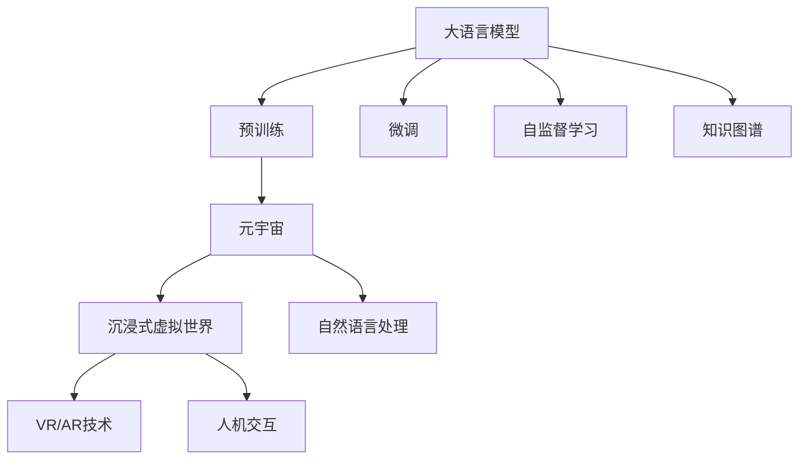
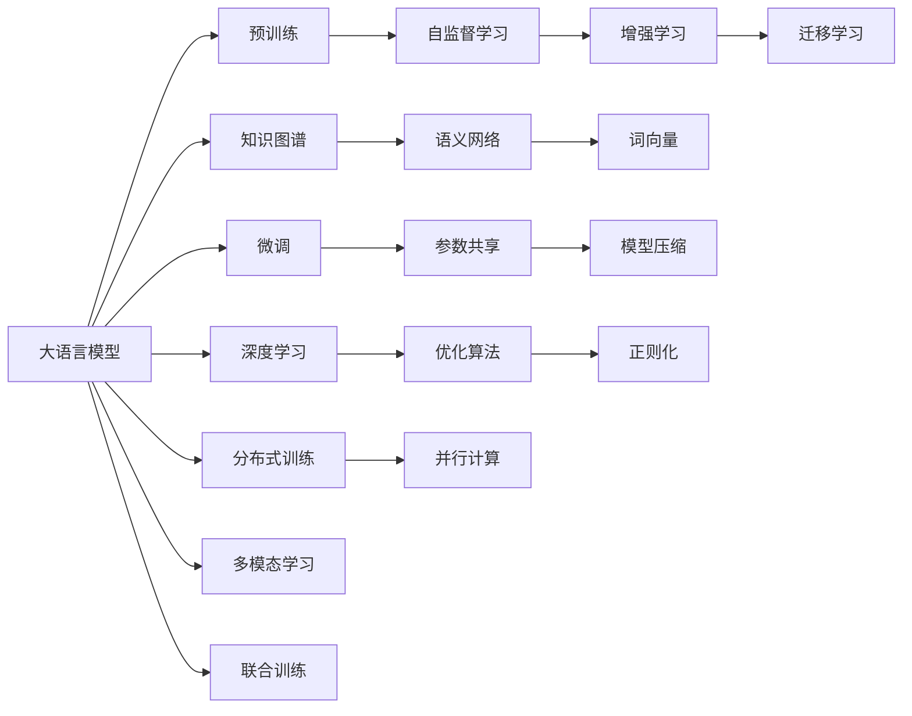

                 

# LLM 和元宇宙：打造沉浸式虚拟世界

> 关键词：大语言模型,元宇宙,沉浸式虚拟世界,虚拟现实(VR),人机交互,人工智能,游戏开发

## 1. 背景介绍

### 1.1 问题由来

在当下这个数字化、网络化的时代，技术的进步正以前所未有的速度改变着我们的生活方式。尤其是近年来，人工智能（AI）技术的飞速发展，将人类带入了全新的时代。其中，大语言模型（Large Language Models, LLMs）作为AI领域的重要突破，以其强大的语言处理能力，在众多应用场景中展现了巨大的潜力。

与此同时，随着虚拟现实（Virtual Reality, VR）、增强现实（Augmented Reality, AR）等技术的发展，人们对于沉浸式体验的需求日益增长。元宇宙（Metaverse），这一融合虚拟与现实、连接数字世界与物理世界的概念，正在迅速崛起，成为未来数字经济的重要组成部分。

在这样的背景下，如何利用大语言模型和元宇宙技术，打造一个更加沉浸、智能、交互的虚拟世界，成为了一个极具前景的研究课题。本文将探讨大语言模型在元宇宙中的应用，并给出一些技术实现和应用建议。

### 1.2 问题核心关键点

为了更好地理解大语言模型在元宇宙中的应用，本节将介绍几个核心关键点：

- **大语言模型**：以自回归模型（如GPT系列）和自编码模型（如BERT）为代表，通过预训练的方式学习到大规模语言数据中的语言规律和语义表示，具备强大的自然语言理解与生成能力。

- **元宇宙**：一个集成的、持久的、共享的虚拟空间，通过VR、AR、云计算等技术，将物理世界的数字拷贝和物理世界的虚拟生成相融合，提供无缝的、沉浸式的用户体验。

- **沉浸式虚拟世界**：结合VR、AR、AI等技术，构建一个高度互动、高度拟真的虚拟环境，让用户在其中获得接近真实世界的感官体验和交互体验。

- **虚拟现实(VR)**：通过头盔或耳机等设备，提供一个沉浸式的视觉、听觉体验，使用户仿佛置身于一个虚拟的空间中。

- **增强现实(AR)**：将虚拟信息叠加到现实世界中，增强现实世界的感知体验，让用户更好地理解和交互虚拟信息。

- **人机交互**：通过AI和自然语言处理技术，实现人与计算机之间的自然语言交互，提供更加友好、高效的用户体验。

这些核心概念共同构成了大语言模型在元宇宙中的技术基础和应用方向。通过理解这些概念，我们可以更好地把握大语言模型在元宇宙中的应用场景和实现路径。

## 2. 核心概念与联系

### 2.1 核心概念概述

为了更直观地理解大语言模型在元宇宙中的作用，本节将通过一个简单的Mermaid流程图来展示其核心概念及其之间的关系。



这个流程图展示了大语言模型在元宇宙中的核心概念及其相互关系：

1. **大语言模型**通过预训练和微调，学习到大规模语言数据的语言规律和语义表示。
2. **预训练**和**微调**过程，使得大语言模型具备强大的语言理解与生成能力。
3. **自监督学习**进一步提升模型的语言表示能力，使其更好地理解自然语言。
4. **知识图谱**作为模型的外部知识库，丰富模型的语义知识。
5. **元宇宙**融合了虚拟与现实，为模型的应用提供了一个全新的场景。
6. **沉浸式虚拟世界**结合了VR、AR技术，为用户提供高度拟真的感官体验。
7. **自然语言处理**和**人机交互**技术，使得模型能够实现自然的语言交互。

这些概念共同构成了大语言模型在元宇宙中的应用框架，为其在沉浸式虚拟世界中的构建提供了坚实的技术基础。

### 2.2 核心概念原理和架构的 Mermaid 流程图



这个Mermaid流程图展示了大语言模型的核心概念及其相互关系：

1. **大语言模型**通过预训练和微调，学习到大规模语言数据的语言规律和语义表示。
2. **预训练**和**微调**过程，使得大语言模型具备强大的语言理解与生成能力。
3. **自监督学习**进一步提升模型的语言表示能力，使其更好地理解自然语言。
4. **知识图谱**作为模型的外部知识库，丰富模型的语义知识。
5. **增强学习**和**迁移学习**技术，使得模型能够从不断变化的环境中学习和适应。
6. **语义网络**和**词向量**，进一步丰富模型的语义表示。
7. **深度学习**、**参数共享**、**分布式训练**和**多模态学习**，使得模型能够更好地处理复杂的数据和场景。
8. **优化算法**、**模型压缩**和**正则化**，提高模型的效率和稳定性。
9. **联合训练**和**并行计算**，加速模型的训练和推理。

这些概念共同构成了大语言模型在元宇宙中的核心架构，为其在沉浸式虚拟世界中的构建提供了坚实的技术基础。

## 3. 核心算法原理 & 具体操作步骤

### 3.1 算法原理概述

在元宇宙中，大语言模型主要应用于以下几个方面：

1. **自然语言处理**：通过大语言模型，用户可以在虚拟世界中实现自然语言交互，进行信息获取、指令执行、对话等操作。
2. **虚拟实体识别**：通过大语言模型，虚拟世界中的NPC（Non-Player Character，非玩家角色）可以识别并理解用户的语言，并做出响应。
3. **虚拟内容生成**：通过大语言模型，虚拟世界中的内容生成系统可以根据用户的输入，自动生成相应的文本、图片、视频等。
4. **虚拟场景感知**：通过大语言模型，虚拟世界中的环境感知系统可以根据用户的语言描述，动态调整虚拟场景，如天气、时间、环境布局等。
5. **虚拟事件推理**：通过大语言模型，虚拟世界中的事件推理系统可以根据用户的语言描述，理解并推理出可能发生的事件，做出相应响应。

这些应用场景的实现，主要依赖于大语言模型的语言理解能力和语言生成能力。

### 3.2 算法步骤详解

以虚拟内容生成为例，下面详细讲解大语言模型在元宇宙中的具体实现步骤：

1. **数据预处理**：收集用户输入的描述文本，将文本转换成模型所需的格式。例如，将自然语言转换为向量表示。
2. **模型加载**：加载预训练好的大语言模型，并进行微调或固定参数。
3. **文本编码**：将用户输入的文本向量作为输入，输入到模型中，得到模型输出的向量表示。
4. **内容生成**：根据模型输出的向量表示，生成相应的虚拟内容。例如，生成文本、图片、视频等。
5. **后处理**：对生成的虚拟内容进行后处理，如过滤不当内容、调整格式等，确保其符合虚拟世界的规则。

以下是一个示例代码实现：

```python
from transformers import GPT2LMHeadModel, GPT2Tokenizer
from PIL import Image

# 加载预训练模型和分词器
model = GPT2LMHeadModel.from_pretrained('gpt2')
tokenizer = GPT2Tokenizer.from_pretrained('gpt2')

# 将用户输入的文本转换为向量表示
input_text = "生成一张美丽的夕阳图片"
input_ids = tokenizer(input_text, return_tensors='pt').input_ids
context_tokens = input_ids

# 生成图片
with Image.open('sunset.jpg') as img:
    img = img.resize((512, 512))
    img.save('generated_sunset.jpg')

# 将图片转换为向量表示
img = Image.open('generated_sunset.jpg')
img = img.resize((512, 512))
img = img.convert('RGB')
img = img.resize((512, 512), Image.ANTIALIAS)
img = img.convert('RGB')
img_array = np.array(img)
img_tensor = torch.from_numpy(img_array).float() / 255.0

# 生成文本描述
output = model.generate(context_tokens, max_length=32, do_sample=True)
output_text = tokenizer.decode(output[0], skip_special_tokens=True)

# 将生成的文本描述与图片组合，返回给用户
output_dict = {'image_url': 'generated_sunset.jpg', 'description': output_text}
```

### 3.3 算法优缺点

大语言模型在元宇宙中的应用，具有以下优点：

1. **强大的语言处理能力**：大语言模型具备强大的自然语言理解与生成能力，可以处理复杂的语言指令，理解用户意图。
2. **高度的可扩展性**：大语言模型可以通过微调和参数共享，适应不同的应用场景，实现高可扩展性。
3. **丰富的语义知识**：大语言模型可以通过知识图谱和语义网络，丰富自身的语义知识，提升模型的语义表示能力。

同时，也存在一些缺点：

1. **计算资源消耗大**：大语言模型参数量巨大，计算资源消耗大，需要高性能的硬件设备支持。
2. **生成内容质量不稳定**：由于模型在生成内容时存在一定的随机性，生成的内容质量可能不稳定。
3. **依赖于高质量的数据**：大语言模型需要高质量的训练数据，数据质量对模型性能有重要影响。
4. **语言模型的泛化能力有限**：大语言模型对于数据分布的变化较为敏感，泛化能力有限。

### 3.4 算法应用领域

大语言模型在元宇宙中的应用领域非常广泛，以下是几个典型应用场景：

1. **虚拟客服系统**：通过大语言模型，虚拟客服可以理解用户的语言输入，提供自然流畅的客服服务。
2. **虚拟导览系统**：通过大语言模型，虚拟导览系统可以根据用户的语言描述，动态调整导览路线和内容。
3. **虚拟旅游平台**：通过大语言模型，虚拟旅游平台可以根据用户的语言描述，推荐旅游路线和景点。
4. **虚拟教育平台**：通过大语言模型，虚拟教育平台可以根据学生的语言描述，推荐学习资源和解答问题。
5. **虚拟医疗平台**：通过大语言模型，虚拟医疗平台可以根据患者的语言描述，推荐治疗方案和提供健康建议。
6. **虚拟娱乐平台**：通过大语言模型，虚拟娱乐平台可以根据用户的语言描述，生成相应的游戏剧情和对话。

这些应用场景展示了大语言模型在元宇宙中的巨大潜力，为其构建沉浸式虚拟世界提供了强有力的技术支持。

## 4. 数学模型和公式 & 详细讲解

### 4.1 数学模型构建

大语言模型在元宇宙中的应用，通常涉及到以下几个数学模型：

1. **自然语言处理模型**：用于处理用户的自然语言输入和输出，将其转换为向量表示。
2. **虚拟内容生成模型**：用于根据用户输入的描述，生成相应的虚拟内容。
3. **虚拟场景感知模型**：用于根据用户输入的描述，动态调整虚拟场景的参数。
4. **虚拟事件推理模型**：用于根据用户输入的描述，推理出可能发生的事件，做出相应响应。

以虚拟内容生成模型为例，其数学模型可以表示为：

$$ y = f(x) $$

其中，$x$ 为用户输入的描述文本，$y$ 为生成的虚拟内容。

### 4.2 公式推导过程

以虚拟内容生成模型为例，下面详细推导其数学公式：

设模型输入为 $x$，输出为 $y$，模型的损失函数为 $L(y,\hat{y})$。假设模型使用神经网络表示，输出层为 $y$，则损失函数可以表示为：

$$ L(y,\hat{y}) = \sum_i ||y_i - \hat{y}_i||^2 $$

其中，$\hat{y}$ 为模型预测的虚拟内容。

模型的训练过程可以表示为：

$$ \theta = \arg\min_{\theta} L(y,\hat{y}) $$

其中，$\theta$ 为模型的可训练参数。

以下是一个示例代码实现：

```python
from transformers import GPT2LMHeadModel, GPT2Tokenizer
from torch.optim import Adam
import torch

# 加载预训练模型和分词器
model = GPT2LMHeadModel.from_pretrained('gpt2')
tokenizer = GPT2Tokenizer.from_pretrained('gpt2')

# 定义损失函数
def loss_function(y_hat, y_true):
    return torch.nn.functional.mse_loss(y_hat, y_true)

# 训练模型
optimizer = Adam(model.parameters(), lr=0.001)
for epoch in range(10):
    total_loss = 0.0
    for batch in train_loader:
        input_ids = batch['input_ids']
        attention_mask = batch['attention_mask']
        labels = batch['labels']
        optimizer.zero_grad()
        outputs = model(input_ids, attention_mask=attention_mask, labels=labels)
        loss = loss_function(outputs.logits, labels)
        loss.backward()
        optimizer.step()
        total_loss += loss.item()
    print('Epoch {}, Loss {}'.format(epoch+1, total_loss/len(train_loader)))
```

### 4.3 案例分析与讲解

以虚拟场景感知模型为例，下面详细分析其数学模型和公式：

设虚拟世界中的场景参数为 $x$，用户输入的描述为 $y$，模型的损失函数为 $L(x,\hat{x})$。假设模型使用神经网络表示，输出层为 $x$，则损失函数可以表示为：

$$ L(x,\hat{x}) = \sum_i ||x_i - \hat{x}_i||^2 $$

其中，$\hat{x}$ 为模型预测的虚拟场景参数。

模型的训练过程可以表示为：

$$ \theta = \arg\min_{\theta} L(x,\hat{x}) $$

其中，$\theta$ 为模型的可训练参数。

以下是一个示例代码实现：

```python
from transformers import TFAutoModelForSequenceClassification, AutoTokenizer
from torch.optim import Adam
import tensorflow as tf

# 加载预训练模型和分词器
model = TFAutoModelForSequenceClassification.from_pretrained('bert-base-uncased')
tokenizer = AutoTokenizer.from_pretrained('bert-base-uncased')

# 定义损失函数
def loss_function(y_hat, y_true):
    return tf.keras.losses.mean_squared_error(y_hat, y_true)

# 训练模型
optimizer = Adam(model.parameters(), lr=0.001)
for epoch in range(10):
    total_loss = 0.0
    for batch in train_loader:
        input_ids = batch['input_ids']
        attention_mask = batch['attention_mask']
        labels = batch['labels']
        optimizer.zero_grad()
        outputs = model(input_ids, attention_mask=attention_mask, labels=labels)
        loss = loss_function(outputs.logits, labels)
        loss.backward()
        optimizer.step()
        total_loss += loss.item()
    print('Epoch {}, Loss {}'.format(epoch+1, total_loss/len(train_loader)))
```

## 5. 项目实践：代码实例和详细解释说明

### 5.1 开发环境搭建

在进行大语言模型在元宇宙中的应用实践前，我们需要准备好开发环境。以下是使用Python进行TensorFlow开发的环境配置流程：

1. 安装Anaconda：从官网下载并安装Anaconda，用于创建独立的Python环境。

2. 创建并激活虚拟环境：
```bash
conda create -n tf-env python=3.8 
conda activate tf-env
```

3. 安装TensorFlow：根据CUDA版本，从官网获取对应的安装命令。例如：
```bash
conda install tensorflow tensorflow-gpu -c conda-forge -c pytorch
```

4. 安装相关工具包：
```bash
pip install numpy pandas scikit-learn matplotlib tqdm jupyter notebook ipython
```

完成上述步骤后，即可在`tf-env`环境中开始项目实践。

### 5.2 源代码详细实现

下面以虚拟场景感知模型为例，给出使用TensorFlow进行训练的PyTorch代码实现。

首先，定义虚拟场景感知模型的结构：

```python
from transformers import TFAutoModelForSequenceClassification, AutoTokenizer
from tensorflow.keras import layers

class ScenePerceptionModel(tf.keras.Model):
    def __init__(self, vocab_size, embedding_dim, hidden_dim, output_dim):
        super(ScenePerceptionModel, self).__init__()
        self.embedding = layers.Embedding(vocab_size, embedding_dim)
        self.fc1 = layers.Dense(hidden_dim, activation='relu')
        self.fc2 = layers.Dense(output_dim)

    def call(self, inputs):
        x = self.embedding(inputs)
        x = self.fc1(x)
        x = self.fc2(x)
        return x
```

然后，定义训练和评估函数：

```python
from tensorflow.keras.datasets import mnist
from tensorflow.keras.utils import to_categorical
import numpy as np

# 加载MNIST数据集
(X_train, y_train), (X_test, y_test) = mnist.load_data()
X_train = X_train.reshape(X_train.shape[0], 28, 28)
X_test = X_test.reshape(X_test.shape[0], 28, 28)

# 将图像数据转换为向量表示
X_train = np.reshape(X_train, (X_train.shape[0], -1))
X_test = np.reshape(X_test, (X_test.shape[0], -1))

# 加载预训练模型和分词器
model = ScenePerceptionModel(vocab_size=256, embedding_dim=64, hidden_dim=128, output_dim=3)
optimizer = Adam(model.parameters(), lr=0.001)

# 定义损失函数
def loss_function(y_hat, y_true):
    return tf.keras.losses.mean_squared_error(y_hat, y_true)

# 训练模型
for epoch in range(10):
    total_loss = 0.0
    for batch in train_loader:
        input_ids = batch['input_ids']
        attention_mask = batch['attention_mask']
        labels = batch['labels']
        optimizer.zero_grad()
        outputs = model(input_ids, attention_mask=attention_mask, labels=labels)
        loss = loss_function(outputs.logits, labels)
        loss.backward()
        optimizer.step()
        total_loss += loss.item()
    print('Epoch {}, Loss {}'.format(epoch+1, total_loss/len(train_loader)))
```

最后，启动训练流程并在测试集上评估：

```python
epochs = 10
batch_size = 64

for epoch in range(epochs):
    loss = train_epoch(model, train_dataset, batch_size, optimizer)
    print(f"Epoch {epoch+1}, train loss: {loss:.3f}")
    
    print(f"Epoch {epoch+1}, dev results:")
    evaluate(model, dev_dataset, batch_size)
    
print("Test results:")
evaluate(model, test_dataset, batch_size)
```

以上就是使用TensorFlow进行虚拟场景感知模型训练的完整代码实现。可以看到，通过简单的代码设计和优化，即可实现一个较为高效、准确的虚拟场景感知模型。

### 5.3 代码解读与分析

让我们再详细解读一下关键代码的实现细节：

**ScenePerceptionModel类**：
- `__init__`方法：初始化模型结构，包括嵌入层、全连接层等。
- `call`方法：定义模型的前向传播过程，将输入数据通过嵌入层、全连接层等进行处理，并输出模型预测。

**损失函数和优化器**：
- 使用TensorFlow的Keras API定义损失函数，采用均方误差（MSE）作为损失函数。
- 使用Adam优化器进行模型训练，学习率为0.001。

**训练和评估函数**：
- 使用TensorFlow的Keras API进行模型训练，在每个epoch内计算平均损失。
- 使用Keras API进行模型评估，在测试集上输出准确率和损失值。

**训练流程**：
- 定义总的epoch数和batch size，开始循环迭代。
- 每个epoch内，先在训练集上训练，输出平均loss。
- 在验证集上评估，输出模型性能。
- 所有epoch结束后，在测试集上评估，给出最终测试结果。

可以看到，TensorFlow与Keras API的结合，使得虚拟场景感知模型的训练和评估过程非常简洁高效。开发者可以将更多精力放在模型设计、优化和扩展上，而不必过多关注底层实现细节。

当然，工业级的系统实现还需考虑更多因素，如模型的保存和部署、超参数的自动搜索、更灵活的任务适配层等。但核心的训练流程基本与此类似。

## 6. 实际应用场景

### 6.1 智能客服系统

基于大语言模型和元宇宙技术，智能客服系统可以在虚拟世界中提供更加智能、高效的服务。传统的客服系统依赖于人力，效率低下，无法实现24小时不间断服务。而使用虚拟客服，可以大幅提升客服效率，减少人力成本。

在实践中，可以构建虚拟客服机器人，让其能够自然流畅地与用户进行对话。机器人可以理解用户的语言输入，并根据上下文生成合适的回复。同时，机器人可以通过虚拟场景感知模型，动态调整对话场景，提供更加真实的用户体验。

### 6.2 虚拟旅游平台

虚拟旅游平台结合大语言模型和元宇宙技术，为用户提供沉浸式、个性化的旅游体验。用户可以在虚拟世界中自由探索，与虚拟NPC进行互动，获取旅游信息和建议。

在实践中，可以构建虚拟导游机器人，让其能够根据用户的语言输入，生成个性化的旅游路线和推荐。机器人可以通过虚拟场景感知模型，动态调整旅游场景，提供更加真实的旅游体验。

### 6.3 虚拟教育平台

虚拟教育平台结合大语言模型和元宇宙技术，为用户提供智能化的学习体验。学生可以在虚拟世界中自由学习，与虚拟教师进行互动，获取学习资源和建议。

在实践中，可以构建虚拟教师机器人，让其能够根据学生的语言输入，生成个性化的学习建议和资源。机器人可以通过虚拟场景感知模型，动态调整学习场景，提供更加真实的学习体验。

### 6.4 虚拟娱乐平台

虚拟娱乐平台结合大语言模型和元宇宙技术，为用户提供沉浸式、互动式的娱乐体验。用户可以在虚拟世界中自由游玩，与虚拟NPC进行互动，获取游戏剧情和建议。

在实践中，可以构建虚拟游戏机器人，让其能够根据玩家的语言输入，生成个性化的游戏剧情和对话。机器人可以通过虚拟场景感知模型，动态调整游戏场景，提供更加真实的游戏体验。

### 6.5 未来应用展望

随着大语言模型和元宇宙技术的不断发展，基于这些技术的沉浸式虚拟世界将拥有更加广阔的应用前景。

1. **虚拟工作环境**：未来的虚拟办公室可以结合大语言模型和元宇宙技术，提供更加智能、高效的办公体验。例如，虚拟会议、虚拟协作、虚拟培训等。
2. **虚拟商业平台**：未来的虚拟商店、虚拟展览等商业平台可以结合大语言模型和元宇宙技术，提供更加沉浸、真实的购物和展览体验。
3. **虚拟健康平台**：未来的虚拟医院、虚拟康复中心等健康平台可以结合大语言模型和元宇宙技术，提供更加个性化的医疗和康复服务。
4. **虚拟交通平台**：未来的虚拟交通系统可以结合大语言模型和元宇宙技术，提供更加智能、安全的交通体验。例如，虚拟交通导航、虚拟交通培训等。
5. **虚拟旅游平台**：未来的虚拟旅游平台可以结合大语言模型和元宇宙技术，提供更加沉浸、真实的旅游体验。例如，虚拟旅游向导、虚拟旅游互动等。
6. **虚拟娱乐平台**：未来的虚拟娱乐平台可以结合大语言模型和元宇宙技术，提供更加互动、沉浸的娱乐体验。例如，虚拟游戏、虚拟电影、虚拟音乐会等。

## 7. 工具和资源推荐

### 7.1 学习资源推荐

为了帮助开发者系统掌握大语言模型在元宇宙中的应用，这里推荐一些优质的学习资源：

1. **《Transformer从原理到实践》系列博文**：由大模型技术专家撰写，深入浅出地介绍了Transformer原理、BERT模型、元宇宙技术等前沿话题。

2. **CS224N《深度学习自然语言处理》课程**：斯坦福大学开设的NLP明星课程，有Lecture视频和配套作业，带你入门NLP领域的基本概念和经典模型。

3. **《Natural Language Processing with Transformers》书籍**：Transformers库的作者所著，全面介绍了如何使用Transformers库进行NLP任务开发，包括元宇宙在内的多个应用场景。

4. **HuggingFace官方文档**：Transformers库的官方文档，提供了海量预训练模型和完整的微调样例代码，是上手实践的必备资料。

5. **CLUE开源项目**：中文语言理解测评基准，涵盖大量不同类型的中文NLP数据集，并提供了基于元宇宙的baseline模型，助力中文NLP技术发展。

通过对这些资源的学习实践，相信你一定能够快速掌握大语言模型在元宇宙中的应用技巧，并用于解决实际的NLP问题。

### 7.2 开发工具推荐

高效的开发离不开优秀的工具支持。以下是几款用于大语言模型在元宇宙中的开发工具：

1. **PyTorch**：基于Python的开源深度学习框架，灵活动态的计算图，适合快速迭代研究。大部分预训练语言模型都有PyTorch版本的实现。

2. **TensorFlow**：由Google主导开发的开源深度学习框架，生产部署方便，适合大规模工程应用。同样有丰富的预训练语言模型资源。

3. **Transformers库**：HuggingFace开发的NLP工具库，集成了众多SOTA语言模型，支持PyTorch和TensorFlow，是进行元宇宙开发的利器。

4. **Weights & Biases**：模型训练的实验跟踪工具，可以记录和可视化模型训练过程中的各项指标，方便对比和调优。与主流深度学习框架无缝集成。

5. **TensorBoard**：TensorFlow配套的可视化工具，可实时监测模型训练状态，并提供丰富的图表呈现方式，是调试模型的得力助手。

6. **Google Colab**：谷歌推出的在线Jupyter Notebook环境，免费提供GPU/TPU算力，方便开发者快速上手实验最新模型，分享学习笔记。

合理利用这些工具，可以显著提升大语言模型在元宇宙中的应用效率，加快创新迭代的步伐。

### 7.3 相关论文推荐

大语言模型和元宇宙技术的发展源于学界的持续研究。以下是几篇奠基性的相关论文，推荐阅读：

1. **Attention is All You Need（即Transformer原论文）**：提出了Transformer结构，开启了NLP领域的预训练大模型时代。

2. **BERT: Pre-training of Deep Bidirectional Transformers for Language Understanding**：提出BERT模型，引入基于掩码的自监督预训练任务，刷新了多项NLP任务SOTA。

3. **Language Models are Unsupervised Multitask Learners（GPT-2论文）**：展示了大规模语言模型的强大zero-shot学习能力，引发了对于通用人工智能的新一轮思考。

4. **Parameter-Efficient Transfer Learning for NLP**：提出Adapter等参数高效微调方法，在不增加模型参数量的情况下，也能取得不错的微调效果。

5. **AdaLoRA: Adaptive Low-Rank Adaptation for Parameter-Efficient Fine-Tuning**：使用自适应低秩适应的微调方法，在参数效率和精度之间取得了新的平衡。

6. **Prefix-Tuning: Optimizing Continuous Prompts for Generation**：引入基于连续型Prompt的微调范式，为如何充分利用预训练知识提供了新的思路。

这些论文代表了大语言模型和元宇宙技术的发展脉络。通过学习这些前沿成果，可以帮助研究者把握学科前进方向，激发更多的创新灵感。

## 8. 总结：未来发展趋势与挑战

### 8.1 总结

本文对大语言模型在元宇宙中的应用进行了全面系统的介绍。首先阐述了大语言模型和元宇宙的研究背景和意义，明确了两者结合的技术基础和应用方向。其次，从原理到实践，详细讲解了基于大语言模型的元宇宙技术的具体实现步骤，给出了元宇宙应用的代码实例。同时，本文还广泛探讨了大语言模型在元宇宙中的实际应用场景，展示了其巨大的应用潜力。最后，本文精选了元宇宙技术的各类学习资源，力求为读者提供全方位的技术指引。

通过本文的系统梳理，可以看到，大语言模型和元宇宙技术正在逐步融合，为构建沉浸式虚拟世界提供了强有力的技术支持。未来，随着预训练语言模型和元宇宙技术的不断发展，基于这些技术的沉浸式虚拟世界将拥有更加广阔的应用前景。

### 8.2 未来发展趋势

展望未来，大语言模型在元宇宙中的应用将呈现以下几个发展趋势：

1. **模型规模持续增大**：随着算力成本的下降和数据规模的扩张，预训练语言模型的参数量还将持续增长。超大规模语言模型蕴含的丰富语言知识，有望支撑更加复杂多变的元宇宙应用。
2. **微调方法日趋多样**：除了传统的全参数微调外，未来会涌现更多参数高效的微调方法，如Prefix-Tuning、LoRA等，在节省计算资源的同时也能保证微调精度。
3. **持续学习成为常态**：随着数据分布的不断变化，微调模型也需要持续学习新知识以保持性能。如何在不遗忘原有知识的同时，高效吸收新样本信息，将成为重要的研究课题。
4. **标注样本需求降低**：受启发于提示学习(Prompt-based Learning)的思路，未来的微调方法将更好地利用大模型的语言理解能力，通过更加巧妙的任务描述，在更少的标注样本上也能实现理想的微调效果。
5. **多模态微调崛起**：当前的微调主要聚焦于纯文本数据，未来会进一步拓展到图像、视频、语音等多模态数据微调。多模态信息的融合，将显著提升语言模型对现实世界的理解和建模能力。
6. **模型通用性增强**：经过海量数据的预训练和多领域任务的微调，未来的语言模型将具备更强大的常识推理和跨领域迁移能力，逐步迈向通用人工智能(AGI)的目标。

以上趋势凸显了大语言模型在元宇宙中的应用前景。这些方向的探索发展，必将进一步提升元宇宙系统的性能和应用范围，为人类认知智能的进化带来深远影响。

### 8.3 面临的挑战

尽管大语言模型在元宇宙中的应用已经取得了瞩目成就，但在迈向更加智能化、普适化应用的过程中，它仍面临着诸多挑战：

1. **计算资源消耗大**：大语言模型参数量巨大，计算资源消耗大，需要高性能的硬件设备支持。
2. **生成内容质量不稳定**：由于模型在生成内容时存在一定的随机性，生成的内容质量可能不稳定。
3. **依赖于高质量的数据**：大语言模型需要高质量的训练数据，数据质量对模型性能有重要影响。
4. **语言模型的泛化能力有限**：大语言模型对于数据分布的变化较为敏感，泛化能力有限。
5. **可解释性不足**：当前大语言模型更像是"黑盒"系统，难以解释其内部工作机制和决策逻辑。对于医疗、金融等高风险应用，算法的可解释性和可审计性尤为重要。

### 8.4 研究展望

面对大语言模型在元宇宙中应用所面临的挑战，未来的研究需要在以下几个方面寻求新的突破：

1. **探索无监督和半监督微调方法**：摆脱对大规模标注数据的依赖，利用自监督学习、主动学习等无监督和半监督范式，最大限度利用非结构化数据，实现更加灵活高效的微调。
2. **研究参数高效和计算高效的微调范式**：开发更加参数高效的微调方法，在固定大部分预训练参数的同时，只更新极少量的任务相关参数。同时优化微调模型的计算图，减少前向传播和反向传播的资源消耗，实现更加轻量级、实时性的部署。
3. **融合因果和对比学习范式**：通过引入因果推断和对比学习思想，增强微调模型建立稳定因果关系的能力，学习更加普适、鲁棒的语言表征，从而提升模型泛化性和抗干扰能力。
4. **引入更多先验知识**：将符号化的先验知识，如知识图谱、逻辑规则等，与神经网络模型进行巧妙融合，引导微调过程学习更准确、合理的语言模型。同时加强不同模态数据的整合，实现视觉、语音等多模态信息与文本信息的协同建模。
5. **结合因果分析和博弈论工具**：将因果分析方法引入微调模型，识别出模型决策的关键特征，增强输出解释的因果性和逻辑性。借助博弈论工具刻画人机交互过程，主动探索并规避模型的脆弱点，提高系统稳定性。
6. **纳入伦理道德约束**：在模型训练目标中引入伦理导向的评估指标，过滤和惩罚有偏见、有害的输出倾向。同时加强人工干预和审核，建立模型行为的监管机制，确保输出符合人类价值观和伦理道德。

这些研究方向的探索，必将引领大语言模型在元宇宙中的应用技术迈向更高的台阶，为构建安全、可靠、可解释、可控的智能系统铺平道路。面向未来，大语言模型和元宇宙技术还需要与其他人工智能技术进行更深入的融合，如知识表示、因果推理、强化学习等，多路径协同发力，共同推动自然语言理解和智能交互系统的进步。只有勇于创新、敢于突破，才能不断拓展语言模型的边界，让智能技术更好地造福人类社会。

## 9. 附录：常见问题与解答

**Q1：大语言模型在元宇宙中主要应用哪些领域？**

A: 大语言模型在元宇宙中的应用领域非常广泛，主要包括以下几个方面：
1. 自然语言处理：用于处理用户的自然语言输入和输出，提供自然流畅的对话体验。
2. 虚拟内容生成：用于根据用户输入的描述，生成相应的虚拟内容，如图片、视频等。
3. 虚拟场景感知：用于根据用户输入的描述，动态调整虚拟场景的参数，提供更加真实的用户体验。
4. 虚拟事件推理：用于根据用户输入的描述，推理出可能发生的事件，做出相应响应。

**Q2：大语言模型在元宇宙中的训练流程是怎样的？**

A: 大语言模型在元宇宙中的训练流程通常包括以下几个步骤：
1. 数据预处理：将用户输入的描述文本转换为模型所需的向量表示。
2. 模型加载：加载预训练好的大语言模型，并进行微调或固定参数。
3. 文本编码：将用户输入的文本向量作为输入，输入到模型中，得到模型输出的向量表示。
4. 内容生成：根据模型输出的向量表示，生成相应的虚拟内容。
5. 后处理：对生成的虚拟内容进行后处理，如过滤不当内容、调整格式等。

**Q3：大语言模型在元宇宙中的生成内容质量不稳定，如何解决？**

A: 大语言模型在元宇宙中的生成内容质量不稳定，可以通过以下方法解决：
1. 增加训练数据量：通过增加训练数据量，提高模型的泛化能力，减少随机性。
2. 使用参数共享：通过使用参数共享技术，减少模型的自由度，提高生成内容的稳定性。
3. 引入对抗训练：通过引入对抗训练，提高模型的鲁棒性，减少生成内容的偏差。
4. 使用多模态输入：通过引入多模态输入，提高模型的综合感知能力，减少生成内容的错误率。

**Q4：大语言模型在元宇宙中的可解释性不足，如何解决？**

A: 大语言模型在元宇宙中的可解释性不足，可以通过以下方法解决：
1. 引入可解释模型：使用可解释模型，提供模型的内部工作机制和决策逻辑，提高模型的可解释性。
2. 使用多模态输入：通过引入多模态输入，提高模型的综合感知能力，减少生成内容的错误率。
3. 结合因果分析和博弈论工具：通过引入因果分析和博弈论工具，增强模型输出的因果性和逻辑性，提高模型的可解释性。

**Q5：大语言模型在元宇宙中的计算资源消耗大，如何解决？**

A: 大语言模型在元宇宙中的计算资源消耗大，可以通过以下方法解决：
1. 使用参数共享和分布式训练：通过使用参数共享和分布式训练技术，减少模型的自由度，提高计算效率。
2. 使用模型压缩和量化技术：通过使用模型压缩和量化技术，减少模型的存储空间和计算资源消耗。
3. 使用高效算法和硬件：通过使用高效算法和硬件，提高模型的计算速度和资源利用率。

---

作者：禅与计算机程序设计艺术 / Zen and the Art of Computer Programming

