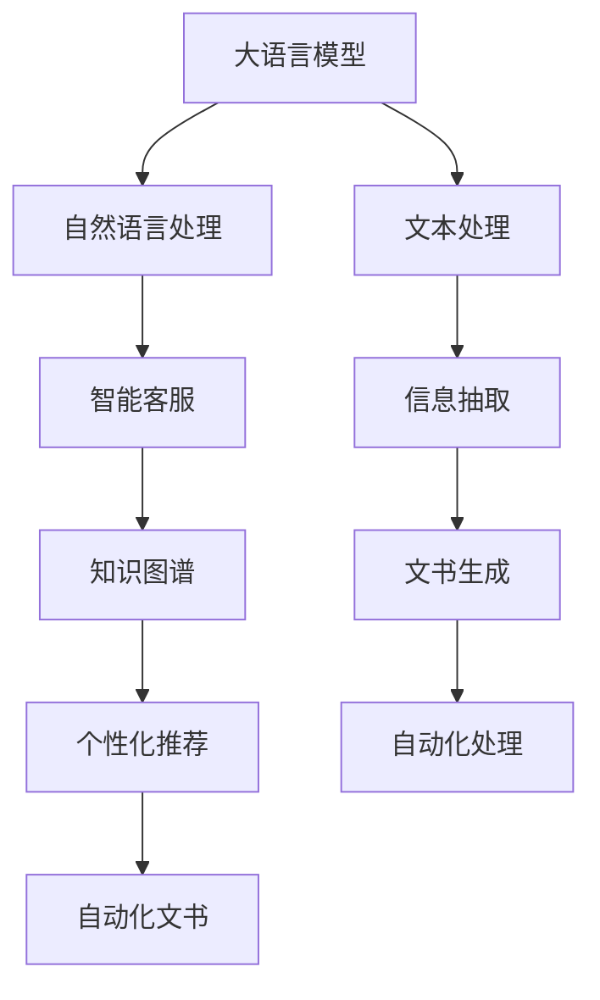

                 

# LLM 在政府和公共服务中的应用：提高效率和透明度

> 关键词：自然语言处理, 大语言模型, 智能客服, 政府自动化, 公共服务优化

## 1. 背景介绍

在现代政府和公共服务领域，信息化和数字化转型已经成为提升服务效率、优化治理结构的重要驱动力。然而，传统的信息系统往往存在数据孤岛、交互复杂、响应缓慢等问题，难以满足公众对于及时、高效、个性化服务的需求。大语言模型（Large Language Models, LLMs）作为一种新兴的AI技术，以其强大的自然语言处理（Natural Language Processing, NLP）能力，正在逐步改写政府和公共服务的管理模式。

### 1.1 问题由来

政府和公共服务部门需要处理大量的文本数据，包括但不限于政策文件、公共报告、行政文书、客户服务请求等。这些数据不仅数量庞大，而且形式多样，涉及的语言复杂，处理起来成本高、效率低。传统的文本处理方式，如规则引擎、模板匹配等，存在响应速度慢、灵活性不足、可扩展性差等缺点。大语言模型的出现，为解决这些问题提供了新的思路。

大语言模型通过大规模预训练获得通用的语言知识，能够理解复杂的自然语言，通过微调可以针对特定任务进行优化。相较于传统的文本处理系统，大语言模型具备更高的灵活性、更强的泛化能力，以及更低的人力和时间成本。

### 1.2 问题核心关键点

在大语言模型在政府和公共服务中的应用中，核心关键点包括：
1. 文本数据的自动化处理。通过大语言模型，能够快速解析文本内容，抽取关键信息，生成文本摘要，提高信息处理的效率。
2. 智能客服系统的构建。大语言模型可以自动回答常见问题，处理复杂请求，提升客户服务的响应速度和质量。
3. 知识图谱的自动构建和更新。大语言模型可以自动从海量文本中挖掘实体和关系，构建和更新知识图谱，辅助决策支持。
4. 个性化推荐系统的实现。大语言模型可以分析用户行为，推荐符合其需求的政策和服务，增强用户体验。
5. 自动化文书生成。大语言模型可以自动生成标准化的行政文书，提高文书处理的规范性和一致性。

这些关键点展示了大语言模型在政府和公共服务中的应用潜力，能够显著提升服务效率和透明度，推动数字化转型的进程。

## 2. 核心概念与联系

### 2.1 核心概念概述

为了更好地理解大语言模型在政府和公共服务中的应用，我们先来介绍几个核心概念：

- **大语言模型 (LLM)**：一种基于深度学习的大型神经网络模型，能够在理解和生成自然语言方面表现出色。常见的预训练大语言模型包括BERT、GPT-3、T5等。
- **自然语言处理 (NLP)**：人工智能领域中用于理解、处理和生成自然语言的技术。NLP可以包括文本分类、信息抽取、情感分析、问答系统等。
- **智能客服系统**：利用人工智能技术，自动解答客户咨询，提供自动化服务。智能客服系统包括自然语言理解和生成、多轮对话管理等技术。
- **知识图谱**：一种用于表示实体及其关系的数据结构，能够帮助理解和推理复杂的信息。知识图谱在决策支持、推荐系统等领域具有重要应用。
- **个性化推荐系统**：根据用户的历史行为和偏好，推荐符合其需求的产品或服务。推荐系统可以应用于广告、电子商务、内容推送等领域。
- **自动化文书生成**：利用自然语言生成技术，自动生成符合规范的行政文书。自动化文书生成可以提高文书处理效率，减少人为错误。

这些核心概念构成了政府和公共服务领域数字化转型的基础，通过大语言模型的应用，可以实现从文本处理到知识管理，再到个性化服务的全链条优化。

### 2.2 核心概念原理和架构的 Mermaid 流程图



这个流程图展示了从大语言模型的预训练到具体应用场景的全链条，从文本处理到文书生成，实现各环节的自动化和智能化。

## 3. 核心算法原理 & 具体操作步骤

### 3.1 算法原理概述

大语言模型在政府和公共服务中的应用，主要是通过自然语言处理（NLP）技术，实现文本数据的自动化处理、智能客服系统的构建、知识图谱的自动构建和更新、个性化推荐系统的实现以及自动化文书生成。

自然语言处理（NLP）的核心任务包括文本分类、实体识别、关系抽取、情感分析、问答系统等。大语言模型通过预训练学习到了丰富的语言知识，可以通过微调（Fine-tuning）来适应特定的政府和公共服务需求。

### 3.2 算法步骤详解

基于大语言模型的应用，主要涉及以下几个步骤：

1. **数据准备**：收集政府和公共服务领域的文本数据，包括政策文件、公共报告、行政文书、客户服务请求等。

2. **预训练模型选择**：选择合适的预训练大语言模型，如BERT、GPT-3、T5等，作为初始化参数。

3. **微调模型**：根据具体应用场景，设计任务适配层，如文本分类、实体识别、关系抽取等，通过微调优化模型性能。

4. **模型集成**：将微调后的模型集成到智能客服系统、知识图谱、推荐系统、文书生成系统等应用中。

5. **模型部署**：将训练好的模型部署到生产环境，供实际应用使用。

6. **持续优化**：根据实际应用反馈，定期更新模型，优化性能。

### 3.3 算法优缺点

大语言模型在政府和公共服务中的应用，具有以下优点：

- **高效处理大规模文本数据**：大语言模型具备强大的文本处理能力，能够快速处理大规模的文本数据，提高信息处理的效率。
- **提升客户服务质量**：智能客服系统通过大语言模型，可以自动解答常见问题，处理复杂请求，提升客户服务的响应速度和质量。
- **辅助决策支持**：知识图谱和大语言模型结合，能够自动从文本中挖掘实体和关系，构建和更新知识图谱，辅助决策支持。
- **个性化推荐服务**：个性化推荐系统通过分析用户行为，推荐符合其需求的政策和服务，增强用户体验。
- **自动化文书生成**：自动化文书生成可以提高文书处理效率，减少人为错误。

然而，大语言模型也存在一些局限性：

- **依赖标注数据**：微调模型的效果很大程度上取决于标注数据的质量和数量，获取高质量标注数据的成本较高。
- **模型泛化能力有限**：当目标任务与预训练数据的分布差异较大时，微调的性能提升有限。
- **数据隐私和安全问题**：政府和公共服务部门处理的数据往往涉及隐私和安全问题，如何保护数据隐私和安全是大语言模型应用的一大挑战。
- **解释性和透明度不足**：大语言模型的决策过程通常缺乏可解释性，难以对其推理逻辑进行分析和调试。

### 3.4 算法应用领域

大语言模型在政府和公共服务中的应用，涵盖多个领域：

- **智能客服系统**：构建智能客服系统，提升客户服务响应速度和质量。
- **知识图谱构建**：自动从文本中挖掘实体和关系，构建和更新知识图谱，辅助决策支持。
- **个性化推荐系统**：根据用户行为，推荐符合其需求的政策和服务，增强用户体验。
- **文书自动化处理**：自动化生成标准化的行政文书，提高文书处理效率和规范性。
- **舆情监测**：自动监测舆情变化，识别潜在风险，支持应急响应。

## 4. 数学模型和公式 & 详细讲解 & 举例说明

### 4.1 数学模型构建

假设大语言模型为 $M_{\theta}$，其中 $\theta$ 为模型参数。政府和公共服务领域的应用场景通常包括文本分类、实体识别、关系抽取等任务。我们将这些问题转化为机器学习任务，通过微调优化模型参数 $\theta$。

以文本分类为例，假设训练集为 $D=\{(x_i,y_i)\}_{i=1}^N$，其中 $x_i$ 为文本，$y_i$ 为分类标签。微调的目标是找到最优参数 $\theta^*$，使得损失函数 $\mathcal{L}(\theta)$ 最小化。常用的损失函数包括交叉熵损失、逻辑回归损失等。

### 4.2 公式推导过程

以二分类任务为例，推导交叉熵损失函数及其梯度的计算公式。

假设模型 $M_{\theta}$ 在输入 $x$ 上的输出为 $\hat{y}=M_{\theta}(x) \in [0,1]$，表示样本属于正类的概率。真实标签 $y \in \{0,1\}$。则二分类交叉熵损失函数定义为：

$$
\ell(M_{\theta}(x),y) = -[y\log \hat{y} + (1-y)\log (1-\hat{y})]
$$

将其代入经验风险公式，得：

$$
\mathcal{L}(\theta) = -\frac{1}{N}\sum_{i=1}^N [y_i\log M_{\theta}(x_i)+(1-y_i)\log(1-M_{\theta}(x_i))]
$$

根据链式法则，损失函数对参数 $\theta_k$ 的梯度为：

$$
\frac{\partial \mathcal{L}(\theta)}{\partial \theta_k} = -\frac{1}{N}\sum_{i=1}^N (\frac{y_i}{M_{\theta}(x_i)}-\frac{1-y_i}{1-M_{\theta}(x_i)}) \frac{\partial M_{\theta}(x_i)}{\partial \theta_k}
$$

其中 $\frac{\partial M_{\theta}(x_i)}{\partial \theta_k}$ 可进一步递归展开，利用自动微分技术完成计算。

### 4.3 案例分析与讲解

假设我们要将大语言模型微调为一个智能客服系统，用于处理常见的用户服务请求。我们收集了1000个已标注的客服请求和回答数据集，将其分为训练集、验证集和测试集。

首先，我们需要选择合适的预训练模型，如BERT，并加载其模型参数。然后，设计任务适配层，如文本分类层和生成层，将用户请求分类并生成响应。在训练集上进行微调，通过交叉熵损失函数进行优化。微调过程中，我们可以设置学习率为1e-5，迭代轮数为100。

具体实现步骤如下：

1. 数据预处理：使用BERT提供的分词器将文本转换为token ids，并进行padding和truncation。

2. 模型构建：定义BERT的文本分类和生成层，加载预训练的BERT模型参数。

3. 微调训练：在训练集上进行微调，设置交叉熵损失函数和AdamW优化器，设置学习率为1e-5，迭代轮数为100。

4. 模型评估：在验证集上评估模型性能，调整超参数。

5. 模型部署：将微调后的模型集成到智能客服系统中，提供自动化服务。

通过上述步骤，我们得到了一个能够处理常见客服请求的智能客服系统，提升了客户服务的响应速度和质量。

## 5. 项目实践：代码实例和详细解释说明

### 5.1 开发环境搭建

在进行大语言模型微调实践前，我们需要准备好开发环境。以下是使用Python进行PyTorch开发的环境配置流程：

1. 安装Anaconda：从官网下载并安装Anaconda，用于创建独立的Python环境。

2. 创建并激活虚拟环境：
```bash
conda create -n pytorch-env python=3.8 
conda activate pytorch-env
```

3. 安装PyTorch：根据CUDA版本，从官网获取对应的安装命令。例如：
```bash
conda install pytorch torchvision torchaudio cudatoolkit=11.1 -c pytorch -c conda-forge
```

4. 安装Transformers库：
```bash
pip install transformers
```

5. 安装各类工具包：
```bash
pip install numpy pandas scikit-learn matplotlib tqdm jupyter notebook ipython
```

完成上述步骤后，即可在`pytorch-env`环境中开始微调实践。

### 5.2 源代码详细实现

下面我们以智能客服系统为例，给出使用Transformers库对BERT模型进行微调的PyTorch代码实现。

首先，定义智能客服系统的数据处理函数：

```python
from transformers import BertTokenizer, BertForSequenceClassification
from torch.utils.data import Dataset
import torch

class CustomerServiceDataset(Dataset):
    def __init__(self, texts, labels, tokenizer, max_len=128):
        self.texts = texts
        self.labels = labels
        self.tokenizer = tokenizer
        self.max_len = max_len
        
    def __len__(self):
        return len(self.texts)
    
    def __getitem__(self, item):
        text = self.texts[item]
        label = self.labels[item]
        
        encoding = self.tokenizer(text, return_tensors='pt', max_length=self.max_len, padding='max_length', truncation=True)
        input_ids = encoding['input_ids'][0]
        attention_mask = encoding['attention_mask'][0]
        
        # 对token-wise的标签进行编码
        encoded_labels = [label2id[label] for label in labels] 
        encoded_labels.extend([label2id['O']] * (self.max_len - len(encoded_labels)))
        labels = torch.tensor(encoded_labels, dtype=torch.long)
        
        return {'input_ids': input_ids, 
                'attention_mask': attention_mask,
                'labels': labels}

# 标签与id的映射
label2id = {'O': 0, 'Q': 1, 'A': 2}
id2label = {v: k for k, v in label2id.items()}

# 创建dataset
tokenizer = BertTokenizer.from_pretrained('bert-base-cased')

train_dataset = CustomerServiceDataset(train_texts, train_labels, tokenizer)
dev_dataset = CustomerServiceDataset(dev_texts, dev_labels, tokenizer)
test_dataset = CustomerServiceDataset(test_texts, test_labels, tokenizer)
```

然后，定义模型和优化器：

```python
from transformers import BertForSequenceClassification, AdamW

model = BertForSequenceClassification.from_pretrained('bert-base-cased', num_labels=len(label2id))

optimizer = AdamW(model.parameters(), lr=2e-5)
```

接着，定义训练和评估函数：

```python
from torch.utils.data import DataLoader
from tqdm import tqdm
from sklearn.metrics import classification_report

device = torch.device('cuda') if torch.cuda.is_available() else torch.device('cpu')
model.to(device)

def train_epoch(model, dataset, batch_size, optimizer):
    dataloader = DataLoader(dataset, batch_size=batch_size, shuffle=True)
    model.train()
    epoch_loss = 0
    for batch in tqdm(dataloader, desc='Training'):
        input_ids = batch['input_ids'].to(device)
        attention_mask = batch['attention_mask'].to(device)
        labels = batch['labels'].to(device)
        model.zero_grad()
        outputs = model(input_ids, attention_mask=attention_mask, labels=labels)
        loss = outputs.loss
        epoch_loss += loss.item()
        loss.backward()
        optimizer.step()
    return epoch_loss / len(dataloader)

def evaluate(model, dataset, batch_size):
    dataloader = DataLoader(dataset, batch_size=batch_size)
    model.eval()
    preds, labels = [], []
    with torch.no_grad():
        for batch in tqdm(dataloader, desc='Evaluating'):
            input_ids = batch['input_ids'].to(device)
            attention_mask = batch['attention_mask'].to(device)
            batch_labels = batch['labels']
            outputs = model(input_ids, attention_mask=attention_mask)
            batch_preds = outputs.logits.argmax(dim=2).to('cpu').tolist()
            batch_labels = batch_labels.to('cpu').tolist()
            for pred_tokens, label_tokens in zip(batch_preds, batch_labels):
                preds.append(pred_tokens[:len(label_tokens)])
                labels.append(label_tokens)
                
    print(classification_report(labels, preds))
```

最后，启动训练流程并在测试集上评估：

```python
epochs = 5
batch_size = 16

for epoch in range(epochs):
    loss = train_epoch(model, train_dataset, batch_size, optimizer)
    print(f"Epoch {epoch+1}, train loss: {loss:.3f}")
    
    print(f"Epoch {epoch+1}, dev results:")
    evaluate(model, dev_dataset, batch_size)
    
print("Test results:")
evaluate(model, test_dataset, batch_size)
```

以上就是使用PyTorch对BERT进行智能客服系统微调的完整代码实现。可以看到，得益于Transformers库的强大封装，我们可以用相对简洁的代码完成BERT模型的加载和微调。

### 5.3 代码解读与分析

让我们再详细解读一下关键代码的实现细节：

**CustomerServiceDataset类**：
- `__init__`方法：初始化文本、标签、分词器等关键组件。
- `__len__`方法：返回数据集的样本数量。
- `__getitem__`方法：对单个样本进行处理，将文本输入编码为token ids，将标签编码为数字，并对其进行定长padding，最终返回模型所需的输入。

**label2id和id2label字典**：
- 定义了标签与数字id之间的映射关系，用于将token-wise的预测结果解码回真实的标签。

**训练和评估函数**：
- 使用PyTorch的DataLoader对数据集进行批次化加载，供模型训练和推理使用。
- 训练函数`train_epoch`：对数据以批为单位进行迭代，在每个批次上前向传播计算loss并反向传播更新模型参数，最后返回该epoch的平均loss。
- 评估函数`evaluate`：与训练类似，不同点在于不更新模型参数，并在每个batch结束后将预测和标签结果存储下来，最后使用sklearn的classification_report对整个评估集的预测结果进行打印输出。

**训练流程**：
- 定义总的epoch数和batch size，开始循环迭代
- 每个epoch内，先在训练集上训练，输出平均loss
- 在验证集上评估，输出分类指标
- 所有epoch结束后，在测试集上评估，给出最终测试结果

可以看到，PyTorch配合Transformers库使得BERT微调的代码实现变得简洁高效。开发者可以将更多精力放在数据处理、模型改进等高层逻辑上，而不必过多关注底层的实现细节。

当然，工业级的系统实现还需考虑更多因素，如模型的保存和部署、超参数的自动搜索、更灵活的任务适配层等。但核心的微调范式基本与此类似。

## 6. 实际应用场景

### 6.1 智能客服系统

智能客服系统是大语言模型在政府和公共服务中应用的典型场景。传统的客服方式往往需要配备大量人力，高峰期响应缓慢，且一致性和专业性难以保证。而使用微调后的智能客服系统，可以7x24小时不间断服务，快速响应客户咨询，用自然流畅的语言解答各类常见问题。

在技术实现上，可以收集企业内部的历史客服对话记录，将问题和最佳答复构建成监督数据，在此基础上对预训练对话模型进行微调。微调后的对话模型能够自动理解用户意图，匹配最合适的答案模板进行回复。对于客户提出的新问题，还可以接入检索系统实时搜索相关内容，动态组织生成回答。如此构建的智能客服系统，能大幅提升客户咨询体验和问题解决效率。

### 6.2 知识图谱构建

知识图谱是一种用于表示实体及其关系的数据结构，能够帮助理解和推理复杂的信息。知识图谱在决策支持、推荐系统等领域具有重要应用。大语言模型可以自动从海量文本中挖掘实体和关系，构建和更新知识图谱，辅助决策支持。

具体而言，可以收集政府和公共服务领域的相关文档和报告，使用自然语言处理技术识别出其中的实体和关系，构建知识图谱。通过持续微调，模型可以不断学习新的实体和关系，保持知识图谱的时效性和准确性。

### 6.3 个性化推荐系统

推荐系统可以根据用户的历史行为和偏好，推荐符合其需求的产品或服务。在大语言模型中，可以分析用户行为，推荐符合其需求的政策和服务，增强用户体验。

在实践中，可以收集用户浏览、点击、评论等行为数据，提取和用户交互的政策和服务文本内容。将文本内容作为模型输入，用户的后续行为（如是否点击、阅读等）作为监督信号，在此基础上微调预训练语言模型。微调后的模型能够从文本内容中准确把握用户的兴趣点，生成个性化的推荐内容。

### 6.4 自动化文书生成

自动化文书生成可以显著提高文书处理效率，减少人为错误。大语言模型可以自动生成符合规范的行政文书，如公文、报告等。

在实践中，可以收集大量的行政文书样本，提取其中的文本格式、内容和结构信息。通过自然语言生成技术，模型可以自动生成符合规范的文书。

## 7. 工具和资源推荐

### 7.1 学习资源推荐

为了帮助开发者系统掌握大语言模型在政府和公共服务中的应用，这里推荐一些优质的学习资源：

1. 《Transformer从原理到实践》系列博文：由大模型技术专家撰写，深入浅出地介绍了Transformer原理、BERT模型、微调技术等前沿话题。

2. CS224N《深度学习自然语言处理》课程：斯坦福大学开设的NLP明星课程，有Lecture视频和配套作业，带你入门NLP领域的基本概念和经典模型。

3. 《Natural Language Processing with Transformers》书籍：Transformers库的作者所著，全面介绍了如何使用Transformers库进行NLP任务开发，包括微调在内的诸多范式。

4. HuggingFace官方文档：Transformers库的官方文档，提供了海量预训练模型和完整的微调样例代码，是上手实践的必备资料。

5. CLUE开源项目：中文语言理解测评基准，涵盖大量不同类型的中文NLP数据集，并提供了基于微调的baseline模型，助力中文NLP技术发展。

通过对这些资源的学习实践，相信你一定能够快速掌握大语言模型在政府和公共服务中的应用精髓，并用于解决实际的NLP问题。

### 7.2 开发工具推荐

高效的开发离不开优秀的工具支持。以下是几款用于大语言模型微调开发的常用工具：

1. PyTorch：基于Python的开源深度学习框架，灵活动态的计算图，适合快速迭代研究。大部分预训练语言模型都有PyTorch版本的实现。

2. TensorFlow：由Google主导开发的开源深度学习框架，生产部署方便，适合大规模工程应用。同样有丰富的预训练语言模型资源。

3. Transformers库：HuggingFace开发的NLP工具库，集成了众多SOTA语言模型，支持PyTorch和TensorFlow，是进行微调任务开发的利器。

4. Weights & Biases：模型训练的实验跟踪工具，可以记录和可视化模型训练过程中的各项指标，方便对比和调优。与主流深度学习框架无缝集成。

5. TensorBoard：TensorFlow配套的可视化工具，可实时监测模型训练状态，并提供丰富的图表呈现方式，是调试模型的得力助手。

6. Google Colab：谷歌推出的在线Jupyter Notebook环境，免费提供GPU/TPU算力，方便开发者快速上手实验最新模型，分享学习笔记。

合理利用这些工具，可以显著提升大语言模型微调任务的开发效率，加快创新迭代的步伐。

### 7.3 相关论文推荐

大语言模型和微调技术的发展源于学界的持续研究。以下是几篇奠基性的相关论文，推荐阅读：

1. Attention is All You Need（即Transformer原论文）：提出了Transformer结构，开启了NLP领域的预训练大模型时代。

2. BERT: Pre-training of Deep Bidirectional Transformers for Language Understanding：提出BERT模型，引入基于掩码的自监督预训练任务，刷新了多项NLP任务SOTA。

3. Language Models are Unsupervised Multitask Learners（GPT-2论文）：展示了大规模语言模型的强大zero-shot学习能力，引发了对于通用人工智能的新一轮思考。

4. Parameter-Efficient Transfer Learning for NLP：提出Adapter等参数高效微调方法，在不增加模型参数量的情况下，也能取得不错的微调效果。

5. Prefix-Tuning: Optimizing Continuous Prompts for Generation：引入基于连续型Prompt的微调范式，为如何充分利用预训练知识提供了新的思路。

6. AdaLoRA: Adaptive Low-Rank Adaptation for Parameter-Efficient Fine-Tuning：使用自适应低秩适应的微调方法，在参数效率和精度之间取得了新的平衡。

这些论文代表了大语言模型微调技术的发展脉络。通过学习这些前沿成果，可以帮助研究者把握学科前进方向，激发更多的创新灵感。

## 8. 总结：未来发展趋势与挑战

### 8.1 总结

本文对基于大语言模型的政府和公共服务应用进行了全面系统的介绍。首先阐述了政府和公共服务领域数字化转型的背景和需求，明确了大语言模型在提高效率和透明度方面的独特价值。其次，从原理到实践，详细讲解了自然语言处理技术的核心算法和具体操作步骤，给出了智能客服系统微调的完整代码实现。同时，本文还探讨了知识图谱构建、个性化推荐系统、自动化文书生成等多个应用场景，展示了大语言模型在政府和公共服务中的应用潜力。

通过本文的系统梳理，可以看到，大语言模型在政府和公共服务中的应用，能够显著提升服务效率和透明度，推动数字化转型的进程。未来，伴随大语言模型和微调方法的持续演进，这些技术的实际应用前景将更加广阔。

### 8.2 未来发展趋势

展望未来，大语言模型在政府和公共服务中的应用将呈现以下几个发展趋势：

1. 模型规模持续增大。随着算力成本的下降和数据规模的扩张，预训练语言模型的参数量还将持续增长。超大模型的通用语言知识，有望支撑更加复杂多变的政府和公共服务需求。

2. 微调方法日趋多样。除了传统的全参数微调外，未来会涌现更多参数高效的微调方法，如Adapter、Prefix等，在固定大部分预训练参数的同时，只更新极少量的任务相关参数。

3. 知识图谱自动构建和更新。未来的知识图谱将与大语言模型紧密结合，实现实体的自动挖掘和关系的自动推理，提供更丰富的决策支持。

4. 个性化推荐系统普及。政府和公共服务中的个性化推荐系统将进一步普及，提升用户体验和满意度。

5. 自动化文书生成系统发展。自动化文书生成系统将进一步完善，提高文书处理的规范性和效率。

以上趋势凸显了大语言模型在政府和公共服务中的应用潜力，能够显著提升服务效率和透明度，推动数字化转型的进程。相信随着预训练语言模型和微调方法的不断进步，这些应用场景将得到更加深入的探索和发展。

### 8.3 面临的挑战

尽管大语言模型在政府和公共服务中的应用前景广阔，但在迈向更加智能化、普适化应用的过程中，它仍面临着诸多挑战：

1. 标注成本瓶颈。尽管微调降低了对标注数据的依赖，但对于某些长尾应用场景，获取高质量标注数据的成本仍然较高。如何进一步降低微调对标注样本的依赖，将是一大难题。

2. 模型鲁棒性不足。当前微调模型面对域外数据时，泛化性能往往不足。如何提高微调模型的鲁棒性，避免灾难性遗忘，还需要更多理论和实践的积累。

3. 数据隐私和安全问题。政府和公共服务部门处理的数据往往涉及隐私和安全问题，如何保护数据隐私和安全是大语言模型应用的一大挑战。

4. 解释性和透明度不足。大语言模型的决策过程通常缺乏可解释性，难以对其推理逻辑进行分析和调试。

5. 安全性有待保障。预训练语言模型难免会学习到有偏见、有害的信息，通过微调传递到下游任务，产生误导性、歧视性的输出，给实际应用带来安全隐患。

6. 知识整合能力不足。现有的微调模型往往局限于任务内数据，难以灵活吸收和运用更广泛的先验知识。如何让微调过程更好地与外部知识库、规则库等专家知识结合，形成更加全面、准确的信息整合能力，还有很大的想象空间。

正视大语言模型应用所面临的这些挑战，积极应对并寻求突破，将是大语言模型在政府和公共服务中持续发展的重要方向。

### 8.4 研究展望

面对大语言模型在政府和公共服务中的挑战，未来的研究需要在以下几个方面寻求新的突破：

1. 探索无监督和半监督微调方法。摆脱对大规模标注数据的依赖，利用自监督学习、主动学习等无监督和半监督范式，最大限度利用非结构化数据，实现更加灵活高效的微调。

2. 研究参数高效和计算高效的微调范式。开发更加参数高效的微调方法，在固定大部分预训练参数的同时，只更新极少量的任务相关参数。同时优化微调模型的计算图，减少前向传播和反向传播的资源消耗，实现更加轻量级、实时性的部署。

3. 融合因果和对比学习范式。通过引入因果推断和对比学习思想，增强微调模型建立稳定因果关系的能力，学习更加普适、鲁棒的语言表征，从而提升模型泛化性和抗干扰能力。

4. 引入更多先验知识。将符号化的先验知识，如知识图谱、逻辑规则等，与神经网络模型进行巧妙融合，引导微调过程学习更准确、合理的语言模型。同时加强不同模态数据的整合，实现视觉、语音等多模态信息与文本信息的协同建模。

5. 结合因果分析和博弈论工具。将因果分析方法引入微调模型，识别出模型决策的关键特征，增强输出解释的因果性和逻辑性。借助博弈论工具刻画人机交互过程，主动探索并规避模型的脆弱点，提高系统稳定性。

6. 纳入伦理道德约束。在模型训练目标中引入伦理导向的评估指标，过滤和惩罚有偏见、有害的输出倾向。同时加强人工干预和审核，建立模型行为的监管机制，确保输出符合人类价值观和伦理道德。

这些研究方向的探索，必将引领大语言模型在政府和公共服务中的应用迈向更高的台阶，为构建安全、可靠、可解释、可控的智能系统铺平道路。面向未来，大语言模型在政府和公共服务中的研究还需要与其他人工智能技术进行更深入的融合，如知识表示、因果推理、强化学习等，多路径协同发力，共同推动自然语言理解和智能交互系统的进步。只有勇于创新、敢于突破，才能不断拓展语言模型的边界，让智能技术更好地造福人类社会。

## 9. 附录：常见问题与解答

**Q1：大语言模型微调是否适用于所有政府和公共服务任务？**

A: 大语言模型微调在大多数政府和公共服务任务上都能取得不错的效果，特别是对于数据量较小的任务。但对于一些特定领域的任务，如医疗、法律等，仅仅依靠通用语料预训练的模型可能难以很好地适应。此时需要在特定领域语料上进一步预训练，再进行微调，才能获得理想效果。

**Q2：微调过程中如何选择合适的学习率？**

A: 微调的学习率一般要比预训练时小1-2个数量级，如果使用过大的学习率，容易破坏预训练权重，导致过拟合。一般建议从1e-5开始调参，逐步减小学习率，直至收敛。也可以使用warmup策略，在开始阶段使用较小的学习率，再逐渐过渡到预设值。需要注意的是，不同的优化器(如AdamW、Adafactor等)以及不同的学习率调度策略，可能需要设置不同的学习率阈值。

**Q3：采用大语言模型微调时会面临哪些资源瓶颈？**

A: 目前主流的预训练大模型动辄以亿计的参数规模，对算力、内存、存储都提出了很高的要求。GPU/TPU等高性能设备是必不可少的，但即便如此，超大批次的训练和推理也可能遇到显存不足的问题。因此需要采用一些资源优化技术，如梯度积累、混合精度训练、模型并行等，来突破硬件瓶颈。同时，模型的存储和读取也可能占用大量时间和空间，需要采用模型压缩、稀疏化存储等方法进行优化。

**Q4：如何缓解微调过程中的过拟合问题？**

A: 过拟合是微调面临的主要挑战，尤其是在标注数据不足的情况下。常见的缓解策略包括：
1. 数据增强：通过回译、近义替换等方式扩充训练集
2. 正则化：使用L2正则、Dropout、Early Stopping等避免过拟合
3. 对抗训练：引入对抗样本，提高模型鲁棒性
4. 参数高效微调：只调整少量参数(如Adapter、Prefix等)，减小过拟合风险
5. 多模型集成：训练多个微调模型，取平均输出，抑制过拟合

这些策略往往需要根据具体任务和数据特点进行灵活组合。只有在数据、模型、训练、推理等各环节进行全面优化，才能最大限度地发挥大语言模型微调的威力。

**Q5：大语言模型在政府和公共服务中的应用前景如何？**

A: 大语言模型在政府和公共服务中的应用前景广阔，能够显著提升服务效率和透明度。智能客服系统、知识图谱构建、个性化推荐系统、自动化文书生成等应用场景，展示了大语言模型在提升用户体验、辅助决策支持等方面的巨大潜力。

通过本文的系统梳理，可以看到，大语言模型在政府和公共服务中的应用，能够显著提升服务效率和透明度，推动数字化转型的进程。未来，伴随预训练语言模型和微调方法的持续演进，这些技术的实际应用前景将更加广阔。

