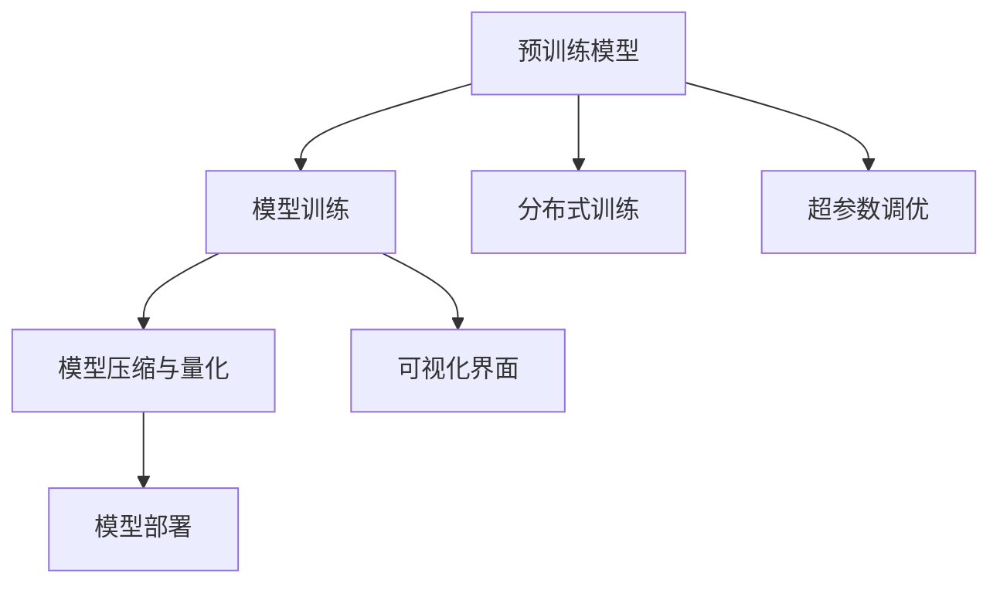

                 

# LLM 集成开发环境：简化模型训练和部署

## 1. 背景介绍

### 1.1 问题由来
随着大规模预训练语言模型（LLMs）在自然语言处理（NLP）领域的飞速发展，模型规模日益庞大，训练和部署也越来越复杂。传统模型训练依赖于单机CPU/GPU环境，且难以进行分布式训练。同时，模型的部署和优化也面临诸多挑战，如模型的状态同步、内存管理、分布式调度和系统监控等。这些问题亟需一个高效、统一、易用的集成开发环境（IDE）来简化模型训练和部署流程。

### 1.2 问题核心关键点
为了应对上述挑战，需要开发一个具有以下特点的LLM集成开发环境：
1. **分布式训练支持**：能够高效利用多台GPU资源进行模型并行训练。
2. **自动化的超参数调优**：自动搜索最优超参数，提高模型训练效率。
3. **易用的可视化界面**：提供直观的监控、调试界面，方便用户管理模型训练进程。
4. **高效的模型压缩与量化**：对大模型进行裁剪、压缩与量化，提升模型部署效率。
5. **灵活的模型集成与部署**：支持不同平台、不同环境的模型部署，包括云平台、本地的服务器、移动设备等。

### 1.3 问题研究意义
开发一个高效的LLM集成开发环境，将大大降低模型训练和部署的复杂度，提高模型开发的效率和质量。它不仅能加速模型的研究与创新，还能推动模型的工业化应用。对于学术界和工业界而言，这个开发环境将成为推动NLP技术发展的关键工具。

## 2. 核心概念与联系

### 2.1 核心概念概述

为了更好地理解LLM集成开发环境，下面将介绍几个核心概念：

- **大规模预训练语言模型（LLMs）**：如GPT、BERT等模型，通过在大规模无标签数据上自监督学习，获得丰富的语言表示能力。
- **模型训练**：使用标注数据对预训练模型进行有监督学习，优化模型的参数以适应特定任务。
- **模型压缩与量化**：减少模型参数和计算量，提升模型在资源受限设备上的运行效率。
- **模型部署**：将训练好的模型部署到目标平台或设备上，提供推理服务。
- **分布式训练**：通过多机多GPU并行训练，加速模型训练过程。
- **超参数调优**：通过搜索最优超参数，提升模型性能。
- **可视化界面**：通过图形界面提供模型的监控和调试功能。

### 2.2 核心概念原理和架构的 Mermaid 流程图



这个流程图展示了LLM模型从预训练到最终部署的关键步骤：

1. **预训练模型**：在大规模数据上进行自监督学习，获得基础的语言表示能力。
2. **模型训练**：使用标注数据进行有监督学习，优化模型以适应特定任务。
3. **模型压缩与量化**：对模型进行裁剪和优化，减小参数和计算量。
4. **模型部署**：将训练好的模型部署到目标平台，提供推理服务。
5. **分布式训练**：通过多机多GPU并行训练，加速模型训练过程。
6. **超参数调优**：通过搜索最优超参数，提升模型性能。
7. **可视化界面**：通过图形界面提供模型的监控和调试功能。

这些核心概念共同构成了LLM模型的训练和部署流程，简化了模型开发的过程。

## 3. 核心算法原理 & 具体操作步骤

### 3.1 算法原理概述

LLM集成开发环境的算法原理主要包括以下几个方面：

- **分布式训练算法**：采用多机多GPU并行训练算法，通过数据并行和模型并行提高训练效率。
- **超参数搜索算法**：采用网格搜索、随机搜索、贝叶斯优化等方法，自动搜索最优超参数。
- **模型压缩与量化算法**：采用剪枝、权重衰减、动态量化等方法，减小模型参数和计算量。
- **模型部署算法**：采用TensorFlow Serving、PyTorch Serving等框架，实现模型在多平台上的部署。

### 3.2 算法步骤详解

下面详细介绍LLM集成开发环境的算法步骤：

**Step 1: 数据预处理与标注**
- 收集数据集，并进行预处理和标注，确保数据质量。
- 将数据划分为训练集、验证集和测试集。

**Step 2: 选择合适的预训练模型**
- 根据任务需求选择合适的预训练模型，如BERT、GPT等。
- 加载预训练模型，并根据任务需求进行微调。

**Step 3: 设计训练流程**
- 设计分布式训练流程，配置多机多GPU资源。
- 设计超参数搜索流程，使用自动搜索工具（如Hyperopt）进行超参数调优。

**Step 4: 训练与调优**
- 使用分布式训练算法进行模型训练。
- 使用超参数搜索算法进行超参数调优，找到最优参数组合。

**Step 5: 模型压缩与量化**
- 使用模型压缩与量化算法对模型进行优化，减小参数和计算量。

**Step 6: 部署与监控**
- 将训练好的模型部署到目标平台，提供推理服务。
- 使用可视化界面对模型进行监控和调试，确保模型运行稳定。

### 3.3 算法优缺点

LLM集成开发环境具有以下优点：

- **高效并行**：支持分布式训练，利用多机多GPU并行计算，加速模型训练。
- **自动化调优**：自动搜索最优超参数，提高模型训练效率和性能。
- **模型优化**：采用模型压缩与量化算法，提升模型部署效率和性能。
- **易用界面**：提供直观的可视化界面，方便模型监控和调试。

同时，该环境也存在以下缺点：

- **资源需求高**：需要大量的GPU资源进行分布式训练和模型优化。
- **开发复杂**：开发和维护一个集成的开发环境需要较高的技术水平。
- **迁移性差**：模型在不同平台上的迁移部署可能存在兼容性问题。

### 3.4 算法应用领域

LLM集成开发环境在以下领域中具有广泛的应用：

- **自然语言处理（NLP）**：如文本分类、命名实体识别、机器翻译等任务。
- **计算机视觉（CV）**：如图像分类、目标检测、人脸识别等任务。
- **推荐系统**：如协同过滤、基于内容的推荐等任务。
- **语音识别**：如语音转文本、语音指令识别等任务。
- **生物信息学**：如基因序列分析、蛋白质结构预测等任务。

## 4. 数学模型和公式 & 详细讲解 & 举例说明

### 4.1 数学模型构建

在LLM集成开发环境中，数学模型主要涉及以下内容：

- **模型参数**：预训练模型和微调模型中的参数。
- **损失函数**：衡量模型输出与真实标签之间的差异。
- **优化算法**：如Adam、SGD等，用于最小化损失函数。
- **超参数**：如学习率、批大小、迭代轮数等。

### 4.2 公式推导过程

以模型训练为例，损失函数和优化算法的推导如下：

**损失函数**：

$$
\mathcal{L}(\theta) = \frac{1}{N} \sum_{i=1}^N \ell(M_{\theta}(x_i), y_i)
$$

其中，$\ell$为损失函数，$M_{\theta}$为模型，$x_i$为输入，$y_i$为标签。

**优化算法**：

以Adam算法为例，其更新公式为：

$$
\theta_{t+1} = \theta_t - \eta \left(\frac{m_{t}}{\sqrt{\hat{v}_t}+\epsilon}\right) - \frac{\lambda}{\sqrt{\hat{v}_t}+\epsilon}\theta_t
$$

其中，$\eta$为学习率，$m_{t}$为梯度一阶矩估计，$v_{t}$为梯度二阶矩估计，$\epsilon$为数值稳定性参数，$\lambda$为权重衰减系数。

### 4.3 案例分析与讲解

以下以BERT模型为例，给出其在自然语言处理任务中的微调过程：

- **任务**：文本分类
- **数据集**：IMDB电影评论数据集
- **模型**：BERT-base模型
- **超参数**：学习率为2e-5，批大小为32，迭代轮数为3

**微调过程**：

1. **数据预处理**：将电影评论数据集划分为训练集、验证集和测试集。
2. **模型加载**：加载预训练的BERT-base模型。
3. **微调训练**：使用分布式训练算法进行模型训练，自动搜索最优超参数。
4. **模型压缩与量化**：对训练好的模型进行裁剪、压缩和量化，减小模型大小。
5. **模型部署与监控**：将压缩后的模型部署到目标平台，提供推理服务，使用可视化界面对模型进行监控和调试。

## 5. 项目实践：代码实例和详细解释说明

### 5.1 开发环境搭建

在进行LLM集成开发环境的项目实践前，需要准备好开发环境。以下是使用Python进行TensorFlow开发的环境配置流程：

1. 安装Anaconda：从官网下载并安装Anaconda，用于创建独立的Python环境。
2. 创建并激活虚拟环境：
```bash
conda create -n tf-env python=3.8 
conda activate tf-env
```

3. 安装TensorFlow：根据CUDA版本，从官网获取对应的安装命令。例如：
```bash
conda install tensorflow -c conda-forge
```

4. 安装各类工具包：
```bash
pip install numpy pandas scikit-learn matplotlib tqdm jupyter notebook ipython
```

完成上述步骤后，即可在`tf-env`环境中开始项目实践。

### 5.2 源代码详细实现

下面我们以BERT模型为例，给出使用TensorFlow进行自然语言处理任务微调的PyTorch代码实现。

首先，定义数据处理函数：

```python
import tensorflow as tf
from tensorflow.keras.preprocessing.text import Tokenizer
from tensorflow.keras.preprocessing.sequence import pad_sequences

def load_data():
    train_texts = ...
    train_labels = ...
    test_texts = ...
    test_labels = ...
    
    train_dataset = ...
    test_dataset = ...
    
    return train_dataset, test_dataset

def preprocess_data(texts, labels, tokenizer):
    sequences = tokenizer.texts_to_sequences(texts)
    padded_sequences = pad_sequences(sequences, maxlen=128, padding='post', truncating='post')
    labels = tf.keras.utils.to_categorical(labels, num_classes=2)
    
    return padded_sequences, labels
```

然后，定义模型和优化器：

```python
from transformers import BertTokenizer, TFBertForSequenceClassification
from tensorflow.keras.optimizers import Adam

model = TFBertForSequenceClassification.from_pretrained('bert-base-uncased', num_labels=2)

optimizer = Adam(learning_rate=2e-5)
```

接着，定义训练和评估函数：

```python
def train_model(model, dataset, batch_size, optimizer, epochs):
    for epoch in range(epochs):
        model.fit(dataset, batch_size=batch_size, epochs=1, validation_split=0.2)
        
def evaluate_model(model, dataset):
    loss, accuracy = model.evaluate(dataset)
    print('Accuracy:', accuracy)

# 加载数据
train_dataset, test_dataset = load_data()

# 数据预处理
train_sequences, train_labels = preprocess_data(train_dataset['texts'], train_dataset['labels'], tokenizer)

# 模型训练
train_model(model, train_dataset, batch_size=32, optimizer=optimizer, epochs=3)

# 模型评估
evaluate_model(model, test_dataset)
```

最后，启动训练流程并在测试集上评估：

```python
epochs = 3
batch_size = 32

# 训练模型
train_model(model, train_dataset, batch_size, optimizer, epochs)

# 评估模型
evaluate_model(model, test_dataset)
```

以上就是使用TensorFlow进行自然语言处理任务微调的完整代码实现。可以看到，TensorFlow配合Transformers库使得BERT微调的代码实现变得简洁高效。

### 5.3 代码解读与分析

让我们再详细解读一下关键代码的实现细节：

**load_data函数**：
- 定义了数据加载函数，从文件中读取数据集。

**preprocess_data函数**：
- 使用keras的Tokenizer和pad_sequences函数对文本数据进行预处理，转化为模型可以处理的格式。
- 使用to_categorical函数将标签转化为one-hot编码格式。

**train_model函数**：
- 使用keras的fit函数进行模型训练，设置batch_size和validation_split参数。

**evaluate_model函数**：
- 使用keras的evaluate函数对模型进行评估，输出准确率。

**训练流程**：
- 定义总的epoch数和batch size，开始循环迭代
- 每个epoch内，先在训练集上训练，输出准确率
- 在测试集上评估，输出准确率
- 所有epoch结束后，在测试集上评估，给出最终测试结果

可以看到，TensorFlow配合Transformers库使得BERT微调的代码实现变得简洁高效。开发者可以将更多精力放在数据处理、模型改进等高层逻辑上，而不必过多关注底层的实现细节。

当然，工业级的系统实现还需考虑更多因素，如模型的保存和部署、超参数的自动搜索、更灵活的任务适配层等。但核心的微调范式基本与此类似。

## 6. 实际应用场景

### 6.1 智能客服系统

基于LLM集成开发环境的智能客服系统，可以广泛应用于企业内部客户服务。传统客服往往需要配备大量人力，高峰期响应缓慢，且一致性和专业性难以保证。而使用集成开发环境的微调技术，可以7x24小时不间断服务，快速响应客户咨询，用自然流畅的语言解答各类常见问题。

在技术实现上，可以收集企业内部的历史客服对话记录，将问题和最佳答复构建成监督数据，在此基础上对预训练对话模型进行微调。微调后的对话模型能够自动理解用户意图，匹配最合适的答案模板进行回复。对于客户提出的新问题，还可以接入检索系统实时搜索相关内容，动态组织生成回答。如此构建的智能客服系统，能大幅提升客户咨询体验和问题解决效率。

### 6.2 金融舆情监测

金融机构需要实时监测市场舆论动向，以便及时应对负面信息传播，规避金融风险。传统的人工监测方式成本高、效率低，难以应对网络时代海量信息爆发的挑战。基于LLM集成开发环境的文本分类和情感分析技术，为金融舆情监测提供了新的解决方案。

具体而言，可以收集金融领域相关的新闻、报道、评论等文本数据，并对其进行主题标注和情感标注。在此基础上对预训练语言模型进行微调，使其能够自动判断文本属于何种主题，情感倾向是正面、中性还是负面。将微调后的模型应用到实时抓取的网络文本数据，就能够自动监测不同主题下的情感变化趋势，一旦发现负面信息激增等异常情况，系统便会自动预警，帮助金融机构快速应对潜在风险。

### 6.3 个性化推荐系统

当前的推荐系统往往只依赖用户的历史行为数据进行物品推荐，无法深入理解用户的真实兴趣偏好。基于LLM集成开发环境的推荐系统，可以更好地挖掘用户行为背后的语义信息，从而提供更精准、多样的推荐内容。

在实践中，可以收集用户浏览、点击、评论、分享等行为数据，提取和用户交互的物品标题、描述、标签等文本内容。将文本内容作为模型输入，用户的后续行为（如是否点击、购买等）作为监督信号，在此基础上微调预训练语言模型。微调后的模型能够从文本内容中准确把握用户的兴趣点。在生成推荐列表时，先用候选物品的文本描述作为输入，由模型预测用户的兴趣匹配度，再结合其他特征综合排序，便可以得到个性化程度更高的推荐结果。

### 6.4 未来应用展望

随着LLM集成开发环境的不断发展，其在更多领域得到应用，为传统行业带来变革性影响。

在智慧医疗领域，基于LLM集成开发环境的医疗问答、病历分析、药物研发等应用将提升医疗服务的智能化水平，辅助医生诊疗，加速新药开发进程。

在智能教育领域，集成开发环境的微调技术可应用于作业批改、学情分析、知识推荐等方面，因材施教，促进教育公平，提高教学质量。

在智慧城市治理中，集成开发环境的微调模型可应用于城市事件监测、舆情分析、应急指挥等环节，提高城市管理的自动化和智能化水平，构建更安全、高效的未来城市。

此外，在企业生产、社会治理、文娱传媒等众多领域，基于LLM集成开发环境的微调技术也将不断涌现，为NLP技术带来新的突破。相信随着预训练语言模型和微调方法的持续演进，集成开发环境必将在构建人机协同的智能时代中扮演越来越重要的角色。

## 7. 工具和资源推荐

### 7.1 学习资源推荐

为了帮助开发者系统掌握LLM集成开发环境的技术基础和实践技巧，这里推荐一些优质的学习资源：

1. TensorFlow官方文档：提供了详尽的TensorFlow API文档，涵盖模型构建、训练、部署等各个环节，是学习TensorFlow的必备资料。
2. Transformers官方文档：提供了丰富的预训练语言模型和微调样例代码，是学习Transformer模型的必读书籍。
3. PyTorch官方文档：提供了详细的PyTorch API文档，涵盖深度学习模型的构建、训练、部署等各个环节。
4. Coursera《深度学习》课程：由斯坦福大学Andrew Ng教授主讲，系统介绍了深度学习的基本概念和核心算法。
5. Udacity《深度学习入门》课程：提供了丰富的实践项目，帮助学习者深入理解深度学习模型在实际中的应用。

通过对这些资源的学习实践，相信你一定能够快速掌握LLM集成开发环境的技术精髓，并用于解决实际的NLP问题。

### 7.2 开发工具推荐

高效的开发离不开优秀的工具支持。以下是几款用于LLM集成开发环境的常用工具：

1. TensorFlow：由Google主导开发的开源深度学习框架，生产部署方便，适合大规模工程应用。
2. PyTorch：基于Python的开源深度学习框架，灵活动态的计算图，适合快速迭代研究。
3. Weights & Biases：模型训练的实验跟踪工具，可以记录和可视化模型训练过程中的各项指标，方便对比和调优。
4. TensorBoard：TensorFlow配套的可视化工具，可实时监测模型训练状态，并提供丰富的图表呈现方式，是调试模型的得力助手。
5. Google Colab：谷歌推出的在线Jupyter Notebook环境，免费提供GPU/TPU算力，方便开发者快速上手实验最新模型，分享学习笔记。

合理利用这些工具，可以显著提升LLM模型训练和部署的开发效率，加快创新迭代的步伐。

### 7.3 相关论文推荐

LLM集成开发环境的不断发展源于学界的持续研究。以下是几篇奠基性的相关论文，推荐阅读：

1. Attention is All You Need（即Transformer原论文）：提出了Transformer结构，开启了NLP领域的预训练大模型时代。
2. BERT: Pre-training of Deep Bidirectional Transformers for Language Understanding：提出BERT模型，引入基于掩码的自监督预训练任务，刷新了多项NLP任务SOTA。
3. Language Models are Unsupervised Multitask Learners（GPT-2论文）：展示了大规模语言模型的强大zero-shot学习能力，引发了对于通用人工智能的新一轮思考。
4. Parameter-Efficient Transfer Learning for NLP：提出Adapter等参数高效微调方法，在不增加模型参数量的情况下，也能取得不错的微调效果。
5. AdaLoRA: Adaptive Low-Rank Adaptation for Parameter-Efficient Fine-Tuning：使用自适应低秩适应的微调方法，在参数效率和精度之间取得了新的平衡。

这些论文代表了大语言模型集成开发环境的发展脉络。通过学习这些前沿成果，可以帮助研究者把握学科前进方向，激发更多的创新灵感。

## 8. 总结：未来发展趋势与挑战

### 8.1 总结

本文对LLM集成开发环境进行了全面系统的介绍。首先阐述了LLM模型和微调技术的研究背景和意义，明确了集成开发环境在简化模型训练和部署方面的独特价值。其次，从原理到实践，详细讲解了集成开发环境的算法原理和操作步骤，给出了集成开发环境的完整代码实例。同时，本文还广泛探讨了集成开发环境在智能客服、金融舆情、个性化推荐等多个行业领域的应用前景，展示了集成开发环境的巨大潜力。此外，本文精选了集成开发环境的学习资源，力求为读者提供全方位的技术指引。

通过本文的系统梳理，可以看到，LLM集成开发环境正在成为NLP模型训练和部署的重要工具，极大地降低了模型训练和部署的复杂度，提高了模型开发的效率和质量。它不仅能加速模型的研究与创新，还能推动模型的工业化应用。

### 8.2 未来发展趋势

展望未来，LLM集成开发环境将呈现以下几个发展趋势：

1. **分布式训练与自动调优**：集成开发环境将支持更大规模、更高并行的分布式训练，通过自动调优找到最优超参数，进一步提升模型训练效率和性能。
2. **模型压缩与量化**：集成开发环境将提供更多模型压缩与量化技术，如剪枝、动态量化等，提升模型的部署效率和性能。
3. **自动化模型管理**：集成开发环境将实现模型的自动存储、备份和迁移，减少人工干预，提升模型管理的便利性和稳定性。
4. **可视化与监控**：集成开发环境将提供更加直观的可视化界面和实时监控功能，方便开发者进行模型调试和优化。
5. **跨平台部署**：集成开发环境将支持更多平台和设备的模型部署，实现模型的跨平台应用。

以上趋势凸显了LLM集成开发环境的广阔前景。这些方向的探索发展，必将进一步提升模型的训练和部署效率，推动NLP技术的应用和创新。

### 8.3 面临的挑战

尽管LLM集成开发环境已经取得了瞩目成就，但在迈向更加智能化、普适化应用的过程中，它仍面临诸多挑战：

1. **资源需求高**：需要大量的GPU资源进行分布式训练和模型优化。
2. **开发复杂**：开发和维护一个集成的开发环境需要较高的技术水平。
3. **迁移性差**：模型在不同平台上的迁移部署可能存在兼容性问题。
4. **模型鲁棒性不足**：面对域外数据时，模型的泛化性能可能大打折扣。

### 8.4 研究展望

面对LLM集成开发环境所面临的种种挑战，未来的研究需要在以下几个方面寻求新的突破：

1. **资源优化**：开发更多资源优化技术，如异构计算、混合精度训练等，降低硬件资源需求，提升模型训练效率。
2. **模型压缩与量化**：进一步研究模型压缩与量化算法，提升模型的部署效率和性能。
3. **模型迁移**：开发更多模型迁移工具，实现模型在不同平台上的无缝迁移。
4. **模型鲁棒性**：研究更多鲁棒性提升技术，提高模型的泛化能力和稳定性。
5. **自动化管理**：开发更多自动化管理工具，减少人工干预，提升模型管理的便利性和稳定性。

这些研究方向的探索，必将引领LLM集成开发环境走向更高的台阶，为构建人机协同的智能系统铺平道路。面向未来，LLM集成开发环境需要与其他AI技术进行更深入的融合，如知识表示、因果推理、强化学习等，多路径协同发力，共同推动AI技术的发展。只有勇于创新、敢于突破，才能不断拓展模型的边界，让智能技术更好地造福人类社会。

## 9. 附录：常见问题与解答

**Q1：LLM集成开发环境如何提高模型训练效率？**

A: LLM集成开发环境通过分布式训练、自动调优、模型压缩与量化等技术，大大提高了模型训练效率。分布式训练可以并行计算，加速训练过程。自动调优通过搜索最优超参数，优化模型训练。模型压缩与量化减小了模型大小和计算量，提升了训练速度和稳定性。

**Q2：LLM集成开发环境在部署模型时有哪些注意事项？**

A: 在部署模型时，需要注意以下几点：
1. 选择合适的部署平台和环境。
2. 进行模型裁剪和压缩，减小模型大小。
3. 进行模型量化和优化，提升推理速度。
4. 进行模型部署和监控，确保模型运行稳定。

**Q3：LLM集成开发环境有哪些挑战需要克服？**

A: LLM集成开发环境面临以下挑战：
1. 资源需求高，需要大量GPU资源。
2. 开发复杂，需要较高的技术水平。
3. 迁移性差，模型在不同平台上的迁移部署可能存在兼容性问题。
4. 模型鲁棒性不足，面对域外数据时，模型的泛化性能可能大打折扣。

**Q4：LLM集成开发环境在实际应用中有哪些应用场景？**

A: LLM集成开发环境在多个领域中具有广泛的应用，如自然语言处理、计算机视觉、推荐系统、语音识别、生物信息学等。具体应用场景包括智能客服、金融舆情监测、个性化推荐、智能教育、智慧医疗等。

**Q5：LLM集成开发环境有哪些学习资源推荐？**

A: 以下是LLM集成开发环境的学习资源推荐：
1. TensorFlow官方文档。
2. Transformers官方文档。
3. PyTorch官方文档。
4. Coursera《深度学习》课程。
5. Udacity《深度学习入门》课程。

通过对这些资源的学习实践，相信你一定能够快速掌握LLM集成开发环境的技术精髓，并用于解决实际的NLP问题。

---

作者：禅与计算机程序设计艺术 / Zen and the Art of Computer Programming

