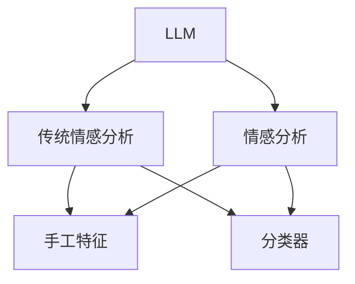

                 

# LLM与传统情感分析技术的比较

> 关键词：
1. 大语言模型(LLM)
2. 情感分析
3. 深度学习
4. 自然语言处理(NLP)
5. 机器学习
6. 特征工程
7. 模型评估

## 1. 背景介绍

### 1.1 问题由来
情感分析(Sentiment Analysis)是自然语言处理领域的重要任务，旨在从文本中识别和提取情感信息，以辅助业务决策、舆情监控、产品推荐等场景。传统的情感分析方法依赖于手工构建特征，并使用分类器进行训练和预测。而近年来，基于深度学习的大语言模型(LLM)在情感分析任务上表现出了卓越的性能，吸引了越来越多的关注。

### 1.2 问题核心关键点
本文将对比传统情感分析方法和基于大语言模型的情感分析方法，分析其优劣、适用场景和未来发展趋势。我们将从核心概念、算法原理、具体实现、应用场景等多个维度，深入探讨大语言模型在情感分析任务中的优势和局限。

## 2. 核心概念与联系

### 2.1 核心概念概述

大语言模型(LLM)是一种基于深度学习框架的模型，通过在大规模无标签文本数据上进行预训练，学习到通用的语言表示，具备强大的语言理解和生成能力。LLM在自然语言处理(NLP)领域广泛应用，包括机器翻译、文本摘要、问答系统等任务。

情感分析，也称为意见挖掘(Opinion Mining)，是NLP中的一个子任务，目标是从文本中提取出情感信息，如正面、负面或中性情感倾向。传统情感分析方法依赖于手工构建的特征，并使用分类器进行训练和预测。常见的特征包括词袋模型、TF-IDF、情感词典等。

### 2.2 核心概念原理和架构的 Mermaid 流程图



## 3. 核心算法原理 & 具体操作步骤

### 3.1 算法原理概述

传统情感分析方法依赖于手工构建特征，通过分类器进行训练和预测。常用的特征包括词袋模型、TF-IDF、情感词典等。而基于大语言模型的情感分析方法则是通过预训练得到的语言模型，直接对文本进行编码，并输出情感标签。

#### 3.1.1 传统情感分析

传统的情感分析方法通常分为三个步骤：

1. **特征提取**：使用手工构建的特征（如词袋模型、TF-IDF等）将文本表示为向量。
2. **模型训练**：在标注数据集上训练分类器（如SVM、逻辑回归、随机森林等）。
3. **预测**：使用训练好的分类器对新文本进行情感分类。

#### 3.1.2 基于大语言模型的情感分析

基于大语言模型的情感分析方法则通过预训练得到的语言模型，直接对文本进行编码，并输出情感标签。具体步骤如下：

1. **预训练模型选择**：选择合适的预训练语言模型（如BERT、GPT等）。
2. **微调模型**：在标注数据集上微调预训练模型，输出情感标签。
3. **预测**：使用微调后的模型对新文本进行情感分类。

### 3.2 算法步骤详解

#### 3.2.1 传统情感分析

1. **特征提取**：使用手工构建的特征（如词袋模型、TF-IDF等）将文本表示为向量。
2. **模型训练**：在标注数据集上训练分类器（如SVM、逻辑回归、随机森林等）。
3. **预测**：使用训练好的分类器对新文本进行情感分类。

#### 3.2.2 基于大语言模型的情感分析

1. **预训练模型选择**：选择合适的预训练语言模型（如BERT、GPT等）。
2. **微调模型**：在标注数据集上微调预训练模型，输出情感标签。
3. **预测**：使用微调后的模型对新文本进行情感分类。

### 3.3 算法优缺点

#### 3.3.1 传统情感分析

**优点**：
1. **手工特征工程**：可以根据具体任务特点构建适合的特征，提高模型的表现。
2. **计算成本低**：不需要大规模的计算资源，适用于小规模标注数据集。

**缺点**：
1. **特征工程复杂**：需要手工构建和选择特征，工作量大，且易受主观因素影响。
2. **泛化能力有限**：手工特征缺乏通用性，可能无法适应新任务和新数据。
3. **精度受限**：手工特征工程难以捕获复杂的语言现象，导致模型精度受限。

#### 3.3.2 基于大语言模型的情感分析

**优点**：
1. **自动化特征学习**：预训练模型自动学习通用的语言表示，无需手工特征工程。
2. **泛化能力强**：预训练模型可以处理多种任务，泛化能力更强。
3. **精度高**：预训练模型可以捕获更丰富的语言现象，模型精度更高。

**缺点**：
1. **计算成本高**：需要大规模的计算资源进行预训练和微调。
2. **数据依赖性强**：微调模型对标注数据集的质量和数量要求较高。
3. **解释性差**：预训练模型的决策过程缺乏可解释性，难以调试。

### 3.4 算法应用领域

#### 3.4.1 传统情感分析

1. **产品评价**：通过客户评价提取情感倾向，帮助企业优化产品。
2. **市场舆情**：监测社交媒体、新闻等文本数据中的情感信息，了解市场情绪。
3. **广告优化**：分析广告文本的情感倾向，优化广告投放策略。

#### 3.4.2 基于大语言模型的情感分析

1. **自然语言理解**：通过预训练语言模型理解文本情感，辅助自然语言生成、对话系统等。
2. **智能客服**：通过情感分析识别用户情绪，优化客户服务体验。
3. **金融舆情**：分析金融领域相关文本数据中的情感信息，预警金融风险。

## 4. 数学模型和公式 & 详细讲解

### 4.1 数学模型构建

#### 4.1.1 传统情感分析

假设文本序列为 $X=\{x_1,x_2,\ldots,x_n\}$，对应的情感标签为 $Y=\{y_1,y_2,\ldots,y_n\}$，其中 $y_i \in \{+1,0,-1\}$ 分别表示正、中、负情感。

设文本 $x_i$ 的词向量表示为 $\vec{x_i}$，使用手工构建的特征 $f(x_i)$ 将其表示为向量，分类器为 $h(\cdot)$，则情感分类问题可以表示为：

$$
\max_{h(\cdot)} \frac{1}{N}\sum_{i=1}^N \mathcal{L}(h(f(x_i)),y_i)
$$

其中 $\mathcal{L}$ 为分类损失函数，如交叉熵损失函数。

#### 4.1.2 基于大语言模型的情感分析

使用预训练语言模型 $M_{\theta}$ 将文本 $x_i$ 表示为向量 $\vec{x_i}=M_{\theta}(x_i)$，分类器为 $h(\cdot)$，则情感分类问题可以表示为：

$$
\max_{h(\cdot)} \frac{1}{N}\sum_{i=1}^N \mathcal{L}(h(\vec{x_i}),y_i)
$$

其中 $\mathcal{L}$ 为分类损失函数，如交叉熵损失函数。

### 4.2 公式推导过程

#### 4.2.1 传统情感分析

假设文本 $x_i$ 的词向量表示为 $\vec{x_i}$，使用词袋模型 $f(x_i)=(\omega_1,\omega_2,\ldots,\omega_n)$，其中 $\omega_j$ 表示词 $j$ 在文本中出现的次数。分类器为线性回归模型 $h(\vec{x_i})=\vec{w}\cdot\vec{x_i}+b$，其中 $\vec{w}$ 为模型参数。

设 $Y=\{y_1,y_2,\ldots,y_n\}$ 为情感标签，则分类器损失函数为：

$$
\mathcal{L}(h(\vec{x_i}),y_i)=-\sum_{i=1}^N (y_i\log h(\vec{x_i})+(1-y_i)\log (1-h(\vec{x_i})))
$$

设标注数据集为 $D=\{(x_1,y_1),(x_2,y_2),\ldots,(x_N,y_N)\}$，则分类器的优化目标为：

$$
\max_{h(\cdot)} \frac{1}{N}\sum_{i=1}^N \mathcal{L}(h(f(x_i)),y_i)
$$

#### 4.2.2 基于大语言模型的情感分析

使用BERT等预训练语言模型 $M_{\theta}$ 将文本 $x_i$ 表示为向量 $\vec{x_i}=M_{\theta}(x_i)$，分类器为线性回归模型 $h(\vec{x_i})=\vec{w}\cdot\vec{x_i}+b$，其中 $\vec{w}$ 为模型参数。

设 $Y=\{y_1,y_2,\ldots,y_n\}$ 为情感标签，则分类器损失函数为：

$$
\mathcal{L}(h(\vec{x_i}),y_i)=-\sum_{i=1}^N (y_i\log h(\vec{x_i})+(1-y_i)\log (1-h(\vec{x_i})))
$$

设标注数据集为 $D=\{(x_1,y_1),(x_2,y_2),\ldots,(x_N,y_N)\}$，则分类器的优化目标为：

$$
\max_{h(\cdot)} \frac{1}{N}\sum_{i=1}^N \mathcal{L}(h(\vec{x_i}),y_i)
$$

### 4.3 案例分析与讲解

#### 4.3.1 传统情感分析

假设有一个简单的文本情感分类任务，文本为“This product is very good”，情感标签为 $+1$。使用词袋模型 $f(x_i)=(1,0,0,0,1)$，分类器为线性回归模型 $h(\vec{x_i})=0.5\vec{w}\cdot\vec{x_i}+b$。设标注数据集为 $D=\{(x_1,y_1),(x_2,y_2),\ldots,(x_N,y_N)\}$。

设分类器损失函数为交叉熵损失函数，则优化目标为：

$$
\max_{h(\cdot)} \frac{1}{N}\sum_{i=1}^N \mathcal{L}(h(f(x_i)),y_i)
$$

#### 4.3.2 基于大语言模型的情感分析

假设使用BERT模型作为预训练语言模型 $M_{\theta}$ 将文本“This product is very good”表示为向量 $\vec{x_i}=M_{\theta}(x_i)$，分类器为线性回归模型 $h(\vec{x_i})=\vec{w}\cdot\vec{x_i}+b$。设标注数据集为 $D=\{(x_1,y_1),(x_2,y_2),\ldots,(x_N,y_N)\}$。

设分类器损失函数为交叉熵损失函数，则优化目标为：

$$
\max_{h(\cdot)} \frac{1}{N}\sum_{i=1}^N \mathcal{L}(h(\vec{x_i}),y_i)
$$

## 5. 项目实践：代码实例和详细解释说明

### 5.1 开发环境搭建

为了进行情感分析模型的开发和训练，我们需要准备以下环境：

1. **安装Python**：从官网下载并安装Python，选择适合版本的Python版本。

2. **安装PyTorch**：使用pip安装PyTorch库。

3. **安装TensorBoard**：使用pip安装TensorBoard库，用于可视化训练过程。

4. **安装Scikit-learn**：使用pip安装Scikit-learn库，用于数据预处理和模型评估。

### 5.2 源代码详细实现

#### 5.2.1 传统情感分析

```python
import numpy as np
from sklearn.feature_extraction.text import CountVectorizer
from sklearn.linear_model import LogisticRegression

# 文本数据
texts = ["This product is very good", "This product is not good", "I love this product"]
# 情感标签
labels = [1, 0, 1]

# 使用词袋模型进行特征提取
vectorizer = CountVectorizer()
features = vectorizer.fit_transform(texts)

# 使用逻辑回归模型进行训练和预测
model = LogisticRegression()
model.fit(features, labels)
predictions = model.predict(features)

# 输出预测结果
for i, prediction in enumerate(predictions):
    print(f"Text: {texts[i]}, Prediction: {prediction}")
```

#### 5.2.2 基于大语言模型的情感分析

```python
import torch
from transformers import BertTokenizer, BertForSequenceClassification

# 文本数据
texts = ["This product is very good", "This product is not good", "I love this product"]
# 情感标签
labels = [1, 0, 1]

# 初始化BERT tokenizer
tokenizer = BertTokenizer.from_pretrained('bert-base-uncased')

# 将文本数据转换为token ids
inputs = tokenizer(texts, padding=True, truncation=True, return_tensors='pt')

# 初始化BERT分类器
model = BertForSequenceClassification.from_pretrained('bert-base-uncased', num_labels=2)

# 定义损失函数和优化器
loss_fn = torch.nn.CrossEntropyLoss()
optimizer = torch.optim.Adam(model.parameters(), lr=0.001)

# 训练模型
for epoch in range(5):
    model.train()
    optimizer.zero_grad()
    outputs = model(inputs.input_ids, attention_mask=inputs.attention_mask)
    loss = loss_fn(outputs.logits, inputs.labels)
    loss.backward()
    optimizer.step()

# 测试模型
model.eval()
with torch.no_grad():
    outputs = model(inputs.input_ids, attention_mask=inputs.attention_mask)
    predictions = torch.argmax(outputs.logits, dim=1)
    for i, prediction in enumerate(predictions):
        print(f"Text: {texts[i]}, Prediction: {prediction}")
```

### 5.3 代码解读与分析

#### 5.3.1 传统情感分析

1. **特征提取**：使用CountVectorizer将文本转换为词袋模型表示。
2. **模型训练**：使用逻辑回归模型进行训练和预测。
3. **预测结果**：输出模型对新文本的预测结果。

#### 5.3.2 基于大语言模型的情感分析

1. **特征提取**：使用BERT tokenizer将文本转换为token ids。
2. **模型初始化**：初始化BERT分类器，并定义损失函数和优化器。
3. **模型训练**：使用Adam优化器进行模型训练，定义损失函数。
4. **模型测试**：使用测试集对模型进行评估，输出预测结果。

## 6. 实际应用场景

### 6.1 智能客服

智能客服是情感分析应用的重要场景之一，通过情感分析识别用户情绪，优化客户服务体验。智能客服系统可以实时监测客户的情感倾向，提供相应的解决方案，提升客户满意度。

### 6.2 金融舆情

金融舆情监测是情感分析在金融领域的重要应用之一，通过监测社交媒体、新闻等文本数据中的情感信息，预警金融风险，辅助金融决策。

### 6.3 电商推荐

电商推荐系统可以分析用户评论的情感倾向，优化产品推荐策略，提升用户购买体验。

## 7. 工具和资源推荐

### 7.1 学习资源推荐

1. 《自然语言处理》（《Speech and Language Processing》）：斯坦福大学提供的经典NLP教材，包含情感分析等众多NLP任务。
2. 《深度学习》（《Deep Learning》）：Ian Goodfellow撰写的深度学习教材，包含情感分析等NLP任务。
3. 《NLP入门与实战》：深入浅出地介绍了NLP基础和情感分析等任务。

### 7.2 开发工具推荐

1. PyTorch：基于Python的开源深度学习框架，灵活的计算图，支持多种深度学习模型。
2. TensorFlow：由Google主导的开源深度学习框架，生产部署方便，支持多种深度学习模型。
3. HuggingFace Transformers：提供了多种预训练语言模型，方便快速实现微调和预测。

### 7.3 相关论文推荐

1. "A Survey on Sentiment Analysis"：综述了情感分析技术的研究现状和未来发展方向。
2. "BERT: Pre-training of Deep Bidirectional Transformers for Language Understanding"：提出了BERT模型，为情感分析提供了新的范式。
3. "Improving Sentiment Classification Using Transfer Learning"：介绍了迁移学习在情感分析中的应用。

## 8. 总结：未来发展趋势与挑战

### 8.1 研究成果总结

本文对比了传统情感分析和基于大语言模型的情感分析，分析了各自的优劣、适用场景和未来发展趋势。

### 8.2 未来发展趋势

1. **模型规模增大**：随着深度学习技术的不断发展，大语言模型的规模将不断增大，处理能力将更强。
2. **跨模态情感分析**：将视觉、语音等多模态数据与文本数据结合，提高情感分析的准确性和鲁棒性。
3. **预训练与微调结合**：将预训练和微调结合，提高情感分析的泛化能力和精度。

### 8.3 面临的挑战

1. **数据获取困难**：情感分析需要大量的标注数据，但获取标注数据成本高，且标注质量受限。
2. **模型复杂度高**：大语言模型的训练和推理复杂度较高，需要大量计算资源。
3. **模型鲁棒性不足**：情感分析模型面对噪声和干扰的鲁棒性不足，需要进一步提升。

### 8.4 研究展望

1. **无监督情感分析**：探索无监督情感分析方法，减少对标注数据的依赖。
2. **多模态情感分析**：将视觉、语音等多模态数据与文本数据结合，提升情感分析的鲁棒性和准确性。
3. **跨领域情感分析**：探索跨领域的情感分析方法，提高情感分析的通用性和泛化能力。

## 9. 附录：常见问题与解答

### 9.1 常见问题

1. **传统情感分析与大语言模型情感分析的对比**
   - **区别**：传统情感分析依赖手工特征工程，需要大量标注数据；大语言模型情感分析自动学习语言表示，泛化能力强。
   - **优点**：传统情感分析适用于数据量较小、特征工程简单的场景；大语言模型情感分析适用于数据量较大、模型复杂度高的场景。

2. **如何选择预训练语言模型**
   - **建议**：选择与任务相关的预训练语言模型，如文本分类选择BERT，文本生成选择GPT等。

3. **微调模型的参数设置**
   - **建议**：使用较小的学习率，避免破坏预训练权重；选择合适的正则化技术，防止过拟合；使用对抗训练提高鲁棒性。

4. **如何处理小规模数据集**
   - **建议**：使用数据增强、模型集成等技术，提高模型泛化能力；使用参数高效微调，减少计算资源消耗。

5. **如何评估模型性能**
   - **建议**：使用F1-score、准确率等指标进行评估；使用混淆矩阵等工具进行可视化分析。

---

作者：禅与计算机程序设计艺术 / Zen and the Art of Computer Programming

