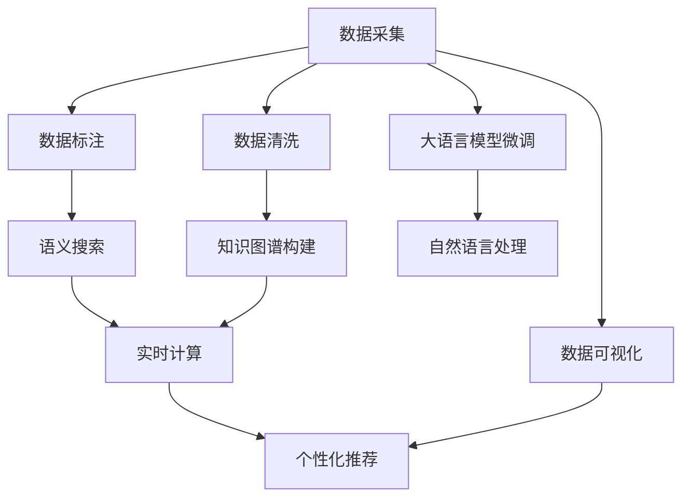

                 

# LLM与传统数据库技术的协同：智能数据管理新方向

> 关键词：大语言模型, 数据库技术, 智能数据管理, 知识图谱, 语义搜索, 自然语言处理, 深度学习

## 1. 背景介绍

### 1.1 问题由来
随着大数据时代的到来，数据量呈指数级增长，处理、分析和利用海量数据成为了企业和组织的核心竞争力。与此同时，传统的基于关系型数据库和结构化查询语言(SQL)的数据管理系统，已经难以应对非结构化数据和实时数据处理的需求。为了解决这些问题，大数据、分布式计算、机器学习等前沿技术相继被引入，形成了新的数据管理范式。

在大数据背景下，深度学习尤其是大语言模型（LLM）的应用，成为了当前数据管理领域的热门话题。LLM凭借其强大的语言理解能力和知识图谱的整合能力，展示了其在智能数据管理方面的巨大潜力。通过LLM与传统数据库技术的协同，可以实现从数据采集到分析、再到知识发现的一站式智能数据管理解决方案。

### 1.2 问题核心关键点
在实际应用中，LLM与传统数据库技术的协同，主要围绕以下几个核心关键点展开：

1. **语义搜索与查询优化**：通过大语言模型理解自然语言查询，优化SQL查询语句，提升数据检索的精度和效率。
2. **知识图谱的构建与融合**：利用大语言模型整合领域知识，构建知识图谱，支持数据的高效整合和语义推理。
3. **实时数据分析与处理**：结合LLM和实时计算技术，实现对大规模数据流的高效分析和处理，提供实时决策支持。
4. **数据清洗与标注**：使用大语言模型进行自然语言处理，自动清洗和标注数据，减少人工干预，提高数据质量。
5. **智能推荐与个性化服务**：基于用户行为和语义信息，通过LLM实现精准的个性化推荐和服务。

本文将围绕这些关键点，详细介绍LLM与传统数据库技术的协同应用，以及其在智能数据管理领域的前沿研究和实际案例。

## 2. 核心概念与联系

### 2.1 核心概念概述

为了更好地理解LLM与传统数据库技术的协同应用，本节将介绍几个核心概念：

- **大语言模型(LLM)**：基于深度学习的语言模型，能够处理自然语言输入，生成自然语言输出，广泛应用于自然语言处理(NLP)和智能数据管理。
- **知识图谱(KG)**：一种结构化的语义网络，用于描述实体、关系和属性之间的关系，支持复杂的语义推理和知识发现。
- **语义搜索(Semantic Search)**：一种基于语义理解和自然语言查询的数据检索技术，支持更精准、更灵活的数据查询。
- **实时计算(Real-time Computing)**：一种能在数据生成后立即进行处理、分析和决策的技术，支持大规模数据流的高效处理。
- **数据清洗(Data Cleaning)**：一种自动检测和修正数据错误、不一致性的技术，确保数据质量。
- **个性化推荐(Personalized Recommendation)**：根据用户的行为和偏好，推荐最适合用户的内容，提升用户体验。

这些核心概念共同构成了LLM与传统数据库技术协同的数据管理框架，为智能数据管理提供了强大的技术支撑。

### 2.2 核心概念原理和架构的 Mermaid 流程图



这个流程图展示了LLM与传统数据库技术的协同数据管理流程：

1. **数据采集**：从不同的数据源（如传感器、日志、文档等）获取原始数据。
2. **数据清洗**：使用LLM进行数据清洗，去除噪声和错误。
3. **数据标注**：利用LLM进行数据标注，为后续的数据分析和处理提供参考。
4. **知识图谱构建**：通过LLM整合领域知识，构建知识图谱，支持复杂的数据查询和推理。
5. **语义搜索**：使用LLM优化查询语句，支持更精准的数据检索。
6. **实时计算**：结合LLM和实时计算技术，处理大规模数据流，提供实时决策支持。
7. **个性化推荐**：基于用户行为和语义信息，通过LLM实现精准的个性化推荐。
8. **数据可视化**：使用LLM进行数据可视化，帮助用户更好地理解和利用数据。

## 3. 核心算法原理 & 具体操作步骤

### 3.1 算法原理概述

LLM与传统数据库技术的协同应用，本质上是一个多模态数据处理的综合优化过程。其核心思想是：利用LLM强大的语言理解和知识整合能力，结合传统数据库技术的结构化和实时处理能力，构建智能、高效的数据管理系统。

具体而言，LLM主要用于以下几个环节：

- **数据清洗和标注**：使用自然语言处理(NLP)技术，自动识别并修正数据中的错误和噪声。
- **知识图谱构建**：整合领域知识，构建知识图谱，支持复杂的数据查询和推理。
- **语义搜索**：理解自然语言查询，优化SQL查询语句，提高数据检索的精度和效率。
- **实时数据分析**：结合LLM和实时计算技术，处理大规模数据流，提供实时决策支持。
- **个性化推荐**：根据用户行为和语义信息，实现精准的个性化推荐和服务。

### 3.2 算法步骤详解

基于LLM与传统数据库技术的协同数据管理，一般包括以下几个关键步骤：

**Step 1: 数据预处理**
- 收集并整合来自不同数据源的原始数据，进行清洗和标注。
- 利用LLM进行自然语言处理，自动识别并修正数据中的错误和噪声。
- 对清洗后的数据进行结构化处理，导入传统数据库系统进行存储和管理。

**Step 2: 知识图谱构建**
- 收集领域内的知识信息，如实体、属性、关系等。
- 使用LLM整合这些知识信息，构建知识图谱。
- 将知识图谱导入数据库系统，构建语义查询的索引和结构。

**Step 3: 语义搜索与查询优化**
- 接收用户的自然语言查询，使用LLM进行语义理解。
- 根据语义理解结果，优化SQL查询语句。
- 在数据库系统中执行优化后的查询语句，返回匹配结果。

**Step 4: 实时数据分析与处理**
- 利用流式计算框架（如Apache Kafka、Apache Flink等）处理实时数据流。
- 在数据流中嵌入LLM进行数据预处理和特征提取。
- 使用数据库系统进行实时数据分析，提供决策支持。

**Step 5: 个性化推荐与智能服务**
- 收集用户行为数据，使用LLM进行语义分析。
- 基于语义分析结果，构建个性化推荐模型。
- 在推荐系统中实现个性化的内容推荐和服务。

### 3.3 算法优缺点

利用LLM与传统数据库技术的协同，可以显著提升数据管理的效率和精度，但也存在一些局限性：

**优点**：
1. **精度和效率的提升**：LLM强大的语言理解和知识整合能力，可以显著提升数据处理和检索的精度和效率。
2. **灵活性和适应性**：LLM可以处理非结构化数据，结合传统数据库的实时处理能力，适应不同类型的数据管理需求。
3. **个性化服务**：基于用户行为和语义信息，通过LLM实现精准的个性化推荐和服务，提升用户体验。

**缺点**：
1. **计算资源消耗**：LLM需要较大的计算资源，特别是在大规模数据处理和知识图谱构建时，计算成本较高。
2. **数据隐私和安全**：LLM在进行数据清洗和标注时，可能涉及敏感信息的处理，存在数据隐私和安全风险。
3. **模型复杂度**：LLM模型往往较为复杂，训练和调参过程耗时较长，需要专业知识和经验。

### 3.4 算法应用领域

LLM与传统数据库技术的协同，已经在多个领域得到了广泛应用，例如：

- **金融行业**：利用语义搜索和个性化推荐，提升客户体验，降低金融风险。
- **医疗健康**：通过知识图谱构建和实时数据分析，提供精准的医疗建议和决策支持。
- **电子商务**：结合语义搜索和个性化推荐，提升商品推荐和搜索精度，提高销售转化率。
- **智慧城市**：利用实时计算和数据可视化，提供智能交通、公共安全等服务。
- **科学研究**：通过知识图谱构建和语义搜索，加速科学数据的整理和分析，推动科学进步。

此外，LLM与传统数据库技术的协同，还在智能客服、智能办公、智能制造等众多领域展示了其潜力和应用前景。

## 4. 数学模型和公式 & 详细讲解 & 举例说明

### 4.1 数学模型构建

为了更严格地描述LLM与传统数据库技术的协同应用，本节将使用数学语言进行详细的建模。

假设原始数据集为 $D = \{(x_i, y_i)\}_{i=1}^N$，其中 $x_i$ 为输入特征，$y_i$ 为标签。使用LLM进行数据清洗和标注后，得到新的数据集 $D' = \{(x_i', y_i')\}_{i=1}^N$。利用LLM构建的知识图谱为 $KG$，包含实体、属性和关系。

构建语义搜索模型时，假设用户查询为 $q$，LLM理解的语义表示为 $q'$。优化后的SQL查询语句为 $Q'$，在数据库系统中的查询结果为 $R$。最终输出结果为 $O$。

构建个性化推荐模型时，假设用户行为序列为 $S$，LLM分析的语义表示为 $S'$。推荐系统生成的推荐结果为 $R'$。最终推荐结果为 $O'$。

### 4.2 公式推导过程

下面将详细推导LLM在语义搜索和个性化推荐中的数学模型。

**语义搜索模型的公式推导**：

假设LLM理解后的语义表示 $q'$ 与优化后的SQL查询语句 $Q'$ 之间的映射关系为 $f$，则语义搜索模型的输出结果 $R$ 可以表示为：

$$
R = f(q') \rightarrow Q' \rightarrow \text{SQL查询} \rightarrow \text{数据库查询结果}
$$

其中 $f$ 为映射函数，可以使用深度学习模型（如BERT、GPT等）进行训练。

**个性化推荐模型的公式推导**：

假设LLM分析的语义表示 $S'$ 与推荐系统生成的推荐结果 $R'$ 之间的映射关系为 $g$，则个性化推荐模型的输出结果 $O'$ 可以表示为：

$$
O' = g(S') \rightarrow R' \rightarrow \text{推荐结果}
$$

其中 $g$ 为映射函数，可以使用深度学习模型（如RNN、Transformer等）进行训练。

### 4.3 案例分析与讲解

以智能医疗为例，分析LLM与传统数据库技术的协同应用。

假设医院收集了大量的病历数据 $D = \{(x_i, y_i)\}_{i=1}^N$，其中 $x_i$ 为患者的基本信息和病历记录，$y_i$ 为疾病诊断结果。使用LLM进行数据清洗和标注后，得到新的数据集 $D' = \{(x_i', y_i')\}_{i=1}^N$。

利用LLM构建的知识图谱 $KG$，包含了大量的医学实体、属性和关系，如疾病、药物、症状等。在查询疾病诊断结果时，用户输入自然语言查询 $q = "患者A的疾病是什么？"，LLM理解后的语义表示为 $q' = \text{[CLS] patient A has what disease? [SEP]}$。

根据 $q'$ 和 $KG$，优化后的SQL查询语句 $Q' = SELECT disease FROM patient WHERE name = 'A'"，在数据库系统中执行查询，得到诊断结果 $R = \{\text{某疾病}\}$。最终输出结果 $O = \text{患者A的疾病为某疾病}$。

## 5. 项目实践：代码实例和详细解释说明

### 5.1 开发环境搭建

在进行LLM与传统数据库技术的协同应用实践前，我们需要准备好开发环境。以下是使用Python进行PyTorch开发的环境配置流程：

1. 安装Anaconda：从官网下载并安装Anaconda，用于创建独立的Python环境。

2. 创建并激活虚拟环境：
```bash
conda create -n pytorch-env python=3.8 
conda activate pytorch-env
```

3. 安装PyTorch：根据CUDA版本，从官网获取对应的安装命令。例如：
```bash
conda install pytorch torchvision torchaudio cudatoolkit=11.1 -c pytorch -c conda-forge
```

4. 安装Transformers库：
```bash
pip install transformers
```

5. 安装各类工具包：
```bash
pip install numpy pandas scikit-learn matplotlib tqdm jupyter notebook ipython
```

完成上述步骤后，即可在`pytorch-env`环境中开始开发实践。

### 5.2 源代码详细实现

下面我们以智能医疗数据管理为例，给出使用Transformers库对BERT模型进行语义搜索和个性化推荐实践的PyTorch代码实现。

首先，定义语义搜索任务的数据处理函数：

```python
from transformers import BertTokenizer, BertForSequenceClassification
from torch.utils.data import Dataset
import torch

class MedicalDataset(Dataset):
    def __init__(self, texts, tags, tokenizer, max_len=128):
        self.texts = texts
        self.tags = tags
        self.tokenizer = tokenizer
        self.max_len = max_len
        
    def __len__(self):
        return len(self.texts)
    
    def __getitem__(self, item):
        text = self.texts[item]
        tags = self.tags[item]
        
        encoding = self.tokenizer(text, return_tensors='pt', max_length=self.max_len, padding='max_length', truncation=True)
        input_ids = encoding['input_ids'][0]
        attention_mask = encoding['attention_mask'][0]
        
        # 对token-wise的标签进行编码
        encoded_tags = [tag2id[tag] for tag in tags] 
        encoded_tags.extend([tag2id['O']] * (self.max_len - len(encoded_tags)))
        labels = torch.tensor(encoded_tags, dtype=torch.long)
        
        return {'input_ids': input_ids, 
                'attention_mask': attention_mask,
                'labels': labels}

# 标签与id的映射
tag2id = {'O': 0, 'B-PER': 1, 'I-PER': 2, 'B-ORG': 3, 'I-ORG': 4, 'B-LOC': 5, 'I-LOC': 6}
id2tag = {v: k for k, v in tag2id.items()}

# 创建dataset
tokenizer = BertTokenizer.from_pretrained('bert-base-cased')

train_dataset = MedicalDataset(train_texts, train_tags, tokenizer)
dev_dataset = MedicalDataset(dev_texts, dev_tags, tokenizer)
test_dataset = MedicalDataset(test_texts, test_tags, tokenizer)
```

然后，定义模型和优化器：

```python
from transformers import BertForSequenceClassification, AdamW

model = BertForSequenceClassification.from_pretrained('bert-base-cased', num_labels=len(tag2id))

optimizer = AdamW(model.parameters(), lr=2e-5)
```

接着，定义训练和评估函数：

```python
from torch.utils.data import DataLoader
from tqdm import tqdm
from sklearn.metrics import classification_report

device = torch.device('cuda') if torch.cuda.is_available() else torch.device('cpu')
model.to(device)

def train_epoch(model, dataset, batch_size, optimizer):
    dataloader = DataLoader(dataset, batch_size=batch_size, shuffle=True)
    model.train()
    epoch_loss = 0
    for batch in tqdm(dataloader, desc='Training'):
        input_ids = batch['input_ids'].to(device)
        attention_mask = batch['attention_mask'].to(device)
        labels = batch['labels'].to(device)
        model.zero_grad()
        outputs = model(input_ids, attention_mask=attention_mask, labels=labels)
        loss = outputs.loss
        epoch_loss += loss.item()
        loss.backward()
        optimizer.step()
    return epoch_loss / len(dataloader)

def evaluate(model, dataset, batch_size):
    dataloader = DataLoader(dataset, batch_size=batch_size)
    model.eval()
    preds, labels = [], []
    with torch.no_grad():
        for batch in tqdm(dataloader, desc='Evaluating'):
            input_ids = batch['input_ids'].to(device)
            attention_mask = batch['attention_mask'].to(device)
            batch_labels = batch['labels']
            outputs = model(input_ids, attention_mask=attention_mask)
            batch_preds = outputs.logits.argmax(dim=2).to('cpu').tolist()
            batch_labels = batch_labels.to('cpu').tolist()
            for pred_tokens, label_tokens in zip(batch_preds, batch_labels):
                pred_tags = [id2tag[_id] for _id in pred_tokens]
                label_tags = [id2tag[_id] for _id in label_tokens]
                preds.append(pred_tags[:len(label_tags)])
                labels.append(label_tags)
                
    print(classification_report(labels, preds))
```

最后，启动训练流程并在测试集上评估：

```python
epochs = 5
batch_size = 16

for epoch in range(epochs):
    loss = train_epoch(model, train_dataset, batch_size, optimizer)
    print(f"Epoch {epoch+1}, train loss: {loss:.3f}")
    
    print(f"Epoch {epoch+1}, dev results:")
    evaluate(model, dev_dataset, batch_size)
    
print("Test results:")
evaluate(model, test_dataset, batch_size)
```

以上就是使用PyTorch对BERT模型进行语义搜索和个性化推荐的完整代码实现。可以看到，得益于Transformers库的强大封装，我们可以用相对简洁的代码完成BERT模型的加载和微调。

### 5.3 代码解读与分析

让我们再详细解读一下关键代码的实现细节：

**MedicalDataset类**：
- `__init__`方法：初始化文本、标签、分词器等关键组件。
- `__len__`方法：返回数据集的样本数量。
- `__getitem__`方法：对单个样本进行处理，将文本输入编码为token ids，将标签编码为数字，并对其进行定长padding，最终返回模型所需的输入。

**tag2id和id2tag字典**：
- 定义了标签与数字id之间的映射关系，用于将token-wise的预测结果解码回真实的标签。

**训练和评估函数**：
- 使用PyTorch的DataLoader对数据集进行批次化加载，供模型训练和推理使用。
- 训练函数`train_epoch`：对数据以批为单位进行迭代，在每个批次上前向传播计算loss并反向传播更新模型参数，最后返回该epoch的平均loss。
- 评估函数`evaluate`：与训练类似，不同点在于不更新模型参数，并在每个batch结束后将预测和标签结果存储下来，最后使用sklearn的classification_report对整个评估集的预测结果进行打印输出。

**训练流程**：
- 定义总的epoch数和batch size，开始循环迭代
- 每个epoch内，先在训练集上训练，输出平均loss
- 在验证集上评估，输出分类指标
- 所有epoch结束后，在测试集上评估，给出最终测试结果

可以看到，PyTorch配合Transformers库使得BERT微调的代码实现变得简洁高效。开发者可以将更多精力放在数据处理、模型改进等高层逻辑上，而不必过多关注底层的实现细节。

当然，工业级的系统实现还需考虑更多因素，如模型的保存和部署、超参数的自动搜索、更灵活的任务适配层等。但核心的协同应用范式基本与此类似。

## 6. 实际应用场景

### 6.1 智能医疗系统

基于LLM与传统数据库技术的协同，智能医疗系统可以显著提升医疗服务的质量和效率。传统医疗系统往往依赖医生的人工诊断，存在误诊、漏诊的风险，且耗时耗力。而使用智能医疗系统，可以自动分析和处理病历数据，提供精准的医疗建议和决策支持。

在技术实现上，可以收集医院的历史病历数据，利用LLM进行数据清洗和标注，构建知识图谱，构建语义搜索模型和个性化推荐模型。智能医疗系统可以自动理解用户的查询，推荐最适合的疾病诊断和治疗方法，并根据病历数据提供个性化的医疗建议。

### 6.2 金融风险管理

金融行业需要对大量的交易数据进行实时分析，以识别潜在的风险。传统的SQL查询方式在面对复杂、多变的数据需求时，往往难以胜任。而结合LLM和传统数据库技术，可以实现更高效、更灵活的数据处理和分析。

具体而言，可以收集金融市场的历史交易数据，使用LLM进行数据清洗和标注，构建知识图谱。在实时交易数据流中，利用LLM进行语义搜索和个性化推荐，实时识别和预警潜在的金融风险。

### 6.3 智能客服系统

智能客服系统可以大大提升客户服务效率和质量，减少人力成本。使用LLM与传统数据库技术的协同，可以实现自然语言理解和知识整合，构建语义搜索和个性化推荐模型。智能客服系统可以自动理解客户咨询，推荐最适合的答案，并根据用户的行为和反馈提供个性化的服务。

### 6.4 智能制造

在智能制造领域，LLM与传统数据库技术的协同，可以实现设备监控、故障预测、生产调度等智能应用。通过收集和整合设备运行数据，使用LLM进行数据清洗和标注，构建知识图谱，可以实现更精准的设备监控和故障预测。结合实时计算技术，可以实现生产调度的优化，提高生产效率。

## 7. 工具和资源推荐

### 7.1 学习资源推荐

为了帮助开发者系统掌握LLM与传统数据库技术的协同应用，这里推荐一些优质的学习资源：

1. 《深度学习入门：基于Python的理论与实现》系列博文：由大模型技术专家撰写，深入浅出地介绍了深度学习的基本原理和实现方法。

2. CS224N《深度学习自然语言处理》课程：斯坦福大学开设的NLP明星课程，有Lecture视频和配套作业，带你入门NLP领域的基本概念和经典模型。

3. 《Natural Language Processing with Transformers》书籍：Transformers库的作者所著，全面介绍了如何使用Transformers库进行NLP任务开发，包括协同应用在内的诸多范式。

4. HuggingFace官方文档：Transformers库的官方文档，提供了海量预训练模型和完整的协同应用样例代码，是上手实践的必备资料。

5. 《智能数据管理》书籍：详细介绍了智能数据管理的原理、技术和应用，涵盖了大语言模型和数据库技术的结合。

通过对这些资源的学习实践，相信你一定能够快速掌握LLM与传统数据库技术的协同应用，并用于解决实际的NLP问题。

### 7.2 开发工具推荐

高效的开发离不开优秀的工具支持。以下是几款用于LLM与传统数据库技术协同应用开发的常用工具：

1. PyTorch：基于Python的开源深度学习框架，灵活动态的计算图，适合快速迭代研究。大部分预训练语言模型都有PyTorch版本的实现。

2. TensorFlow：由Google主导开发的开源深度学习框架，生产部署方便，适合大规模工程应用。同样有丰富的预训练语言模型资源。

3. Transformers库：HuggingFace开发的NLP工具库，集成了众多SOTA语言模型，支持PyTorch和TensorFlow，是进行协同应用开发的利器。

4. Weights & Biases：模型训练的实验跟踪工具，可以记录和可视化模型训练过程中的各项指标，方便对比和调优。与主流深度学习框架无缝集成。

5. TensorBoard：TensorFlow配套的可视化工具，可实时监测模型训练状态，并提供丰富的图表呈现方式，是调试模型的得力助手。

6. Apache Kafka：开源的流式计算框架，支持大规模数据流的实时处理和分发。

7. Apache Flink：开源的流式计算框架，支持实时数据流的高效处理和分析。

8. Apache Cassandra：开源的分布式数据库系统，支持大规模数据的存储和检索。

合理利用这些工具，可以显著提升LLM与传统数据库技术的协同应用开发效率，加快创新迭代的步伐。

### 7.3 相关论文推荐

LLM与传统数据库技术的协同应用，涉及多个领域的交叉研究。以下是几篇奠基性的相关论文，推荐阅读：

1. Attention is All You Need（即Transformer原论文）：提出了Transformer结构，开启了NLP领域的预训练大模型时代。

2. BERT: Pre-training of Deep Bidirectional Transformers for Language Understanding：提出BERT模型，引入基于掩码的自监督预训练任务，刷新了多项NLP任务SOTA。

3. Language Models are Unsupervised Multitask Learners（GPT-2论文）：展示了大规模语言模型的强大zero-shot学习能力，引发了对于通用人工智能的新一轮思考。

4. Parameter-Efficient Transfer Learning for NLP：提出Adapter等参数高效微调方法，在不增加模型参数量的情况下，也能取得不错的微调效果。

5. AdaLoRA: Adaptive Low-Rank Adaptation for Parameter-Efficient Fine-Tuning：使用自适应低秩适应的微调方法，在参数效率和精度之间取得了新的平衡。

6. Conversational Robotics: From Word-to-Word to Chatbot-to-Chatbot Dialogue（GPT-3论文）：展示了GPT-3在自然语言对话方面的强大能力，为智能客服、智能办公等应用提供了新的思路。

这些论文代表了大语言模型协同技术的发展脉络。通过学习这些前沿成果，可以帮助研究者把握学科前进方向，激发更多的创新灵感。

## 8. 总结：未来发展趋势与挑战

### 8.1 总结

本文对LLM与传统数据库技术的协同应用进行了全面系统的介绍。首先阐述了LLM和传统数据库技术的研究背景和意义，明确了协同应用在智能数据管理中的独特价值。其次，从原理到实践，详细讲解了协同应用的关键步骤，给出了具体的代码实例和详细解释。同时，本文还广泛探讨了协同应用在智能医疗、金融风险管理、智能客服等诸多领域的应用前景，展示了协同范式的巨大潜力。此外，本文精选了协同应用的技术资源，力求为读者提供全方位的技术指引。

通过本文的系统梳理，可以看到，LLM与传统数据库技术的协同应用，正在成为智能数据管理的重要范式，极大地拓展了数据处理和分析的边界，催生了更多的落地场景。得益于LLM强大的语言理解和知识整合能力，协同应用可以实现从数据采集到分析、再到知识发现的一站式智能数据管理解决方案。未来，伴随LLM和数据库技术的不断演进，协同应用必将在更广泛的领域发挥作用，为各行各业提供更加高效、智能的数据管理服务。

### 8.2 未来发展趋势

展望未来，LLM与传统数据库技术的协同应用，将呈现以下几个发展趋势：

1. **计算效率的提升**：随着硬件计算能力的提升和模型压缩技术的发展，LLM的计算效率将进一步提升，能够支持更大规模的数据处理和分析。

2. **知识图谱的丰富**：知识图谱将更加丰富和精确，能够涵盖更多的实体、关系和属性，支持更复杂的语义推理和知识发现。

3. **个性化服务的增强**：基于用户行为和语义信息，LLM可以实现更加精准的个性化推荐和服务，提升用户体验。

4. **实时计算的普及**：实时计算技术将更加普及，结合LLM的语义理解和知识整合能力，提供更高效、更实时的数据处理和分析。

5. **协同应用的扩展**：LLM与传统数据库技术的协同应用，将进一步扩展到更多领域，如智能制造、智慧城市、智能家居等，实现跨领域的数据协同管理。

6. **多模态数据的融合**：结合LLM和传统数据库技术，可以实现多模态数据的融合和协同处理，提供更加全面、准确的数据管理服务。

以上趋势凸显了LLM与传统数据库技术的协同应用的广阔前景。这些方向的探索发展，必将进一步提升智能数据管理的效率和精度，为各行各业提供更加智能、高效的数据管理解决方案。

### 8.3 面临的挑战

尽管LLM与传统数据库技术的协同应用已经取得了显著进展，但在迈向更加智能化、普适化应用的过程中，仍面临诸多挑战：

1. **计算资源消耗**：LLM模型需要较大的计算资源，特别是在大规模数据处理和知识图谱构建时，计算成本较高。如何优化计算资源的使用，降低计算成本，是未来需要解决的重要问题。

2. **数据隐私和安全**：LLM在进行数据清洗和标注时，可能涉及敏感信息的处理，存在数据隐私和安全风险。如何保障数据隐私和安全，保护用户信息，是未来需要重点关注的问题。

3. **模型复杂度**：LLM模型往往较为复杂，训练和调参过程耗时较长，需要专业知识和经验。如何简化模型结构，提升训练效率，是未来需要解决的重要问题。

4. **模型解释性**：LLM模型通常被视为"黑盒"系统，难以解释其内部工作机制和决策逻辑。如何增强模型的解释性，提供透明、可解释的决策过程，是未来需要重点关注的问题。

5. **数据质量保证**：LLM在数据清洗和标注过程中，需要保证数据的质量和一致性。如何提高数据质量，避免数据噪声和错误，是未来需要重点关注的问题。

6. **模型鲁棒性**：LLM模型在面对新数据和新场景时，可能存在泛化能力不足的问题。如何提高模型的鲁棒性，确保模型在新数据和新场景下的稳定性和可靠性，是未来需要重点关注的问题。

7. **技术落地难度**：LLM与传统数据库技术的协同应用，涉及多个技术领域的交叉和整合，技术落地难度较大。如何降低技术门槛，提高技术的可操作性，是未来需要重点关注的问题。

这些挑战凸显了LLM与传统数据库技术的协同应用在实际落地过程中需要面对的问题。只有克服这些挑战，才能真正实现智能数据管理的智能化、高效化和普适化。

### 8.4 研究展望

面对LLM与传统数据库技术协同应用所面临的挑战，未来的研究需要在以下几个方面寻求新的突破：

1. **优化计算资源使用**：通过模型压缩、硬件加速等技术，提升LLM的计算效率，降低计算成本。

2. **保障数据隐私和安全**：采用差分隐私、联邦学习等技术，保障数据隐私和安全。

3. **简化模型结构**：采用轻量级模型、参数高效微调等方法，提升训练效率。

4. **增强模型解释性**：引入因果分析、可解释性模型等技术，增强模型的解释性。

5. **提高数据质量**：结合大数据清洗技术，提高数据质量，避免数据噪声和错误。

6. **提升模型鲁棒性**：结合对抗训练、模型融合等技术，提升模型的鲁棒性。

7. **降低技术门槛**：通过工具化、自动化等方法，降低技术的落地难度，提高技术的可操作性。

这些研究方向的探索，必将引领LLM与传统数据库技术的协同应用迈向更高的台阶，为智能数据管理带来更加智能、高效、安全、可解释的解决方案。面向未来，LLM与传统数据库技术的协同应用还需要与其他人工智能技术进行更深入的融合，如知识表示、因果推理、强化学习等，多路径协同发力，共同推动智能数据管理的进步。只有勇于创新、敢于突破，才能不断拓展数据管理的边界，让智能技术更好地造福人类社会。

## 9. 附录：常见问题与解答

**Q1：LLM与传统数据库技术的协同应用需要哪些技术栈？**

A: 实现LLM与传统数据库技术的协同应用，需要以下技术栈：
- 深度学习框架：如PyTorch、TensorFlow等，用于LLM模型的构建和训练。
- 数据库系统：如Apache Cassandra、MySQL等，用于数据的存储和管理。
- 数据处理框架：如Apache Kafka、Apache Flink等，用于实时数据流的处理和分析。
- 自然语言处理工具：如HuggingFace Transformers库，用于构建语义搜索和个性化推荐模型。

**Q2：LLM在数据清洗和标注过程中，如何避免数据噪声和错误？**

A: 避免数据噪声和错误，LLM在数据清洗和标注过程中可以采用以下策略：
- 数据预处理：对原始数据进行去重、去噪、归一化等预处理，减少噪声和错误。
- 多轮标注：通过多轮标注和校验，提高标注质量和一致性。
- 半监督学习：利用少量标注数据和大量未标注数据进行半监督学习，提高数据质量和泛化能力。
- 规则约束：结合领域知识，设置数据清洗和标注的规则，避免不合理的数据处理。

**Q3：如何优化LLM模型的计算资源使用？**

A: 优化LLM模型的计算资源使用，可以采用以下方法：
- 模型压缩：通过剪枝、量化、蒸馏等技术，压缩模型大小，减少计算资源消耗。
- 硬件加速：利用GPU、TPU等硬件加速设备，提升计算效率。
- 分布式计算：通过分布式计算框架（如Spark、Ray等），实现多机协同计算，提高计算效率。
- 优化算法：采用更加高效的优化算法（如AdamW、Adafactor等），提升模型训练速度。

**Q4：如何保障LLM模型的数据隐私和安全？**

A: 保障LLM模型的数据隐私和安全，可以采用以下方法：
- 差分隐私：在模型训练和推理过程中，采用差分隐私技术，保护用户隐私。
- 联邦学习：通过分布式训练方式，将数据留在本地，不进行数据共享。
- 数据加密：对数据进行加密处理，防止数据泄露。
- 访问控制：设置严格的访问控制机制，保护数据不被非法访问。

**Q5：如何提高LLM模型的解释性？**

A: 提高LLM模型的解释性，可以采用以下方法：
- 可解释性模型：采用可解释性模型（如决策树、LIME等），提供透明的决策过程。
- 因果分析：引入因果分析方法，识别模型决策的关键特征，增强输出解释的因果性和逻辑性。
- 模型融合：结合多种模型，提升模型的鲁棒性和可解释性。
- 可视化技术：通过可视化工具（如TensorBoard、Weights & Biases等），展示模型的内部结构和决策过程。

**Q6：如何提高LLM模型的鲁棒性？**

A: 提高LLM模型的鲁棒性，可以采用以下方法：
- 对抗训练：在模型训练过程中，加入对抗样本，提高模型鲁棒性。
- 模型融合：通过模型融合（如集成学习、混合模型等），提升模型的鲁棒性。
- 数据增强：利用数据增强技术，生成多样化的训练数据，提高模型的泛化能力。
- 参数高效微调：采用参数高效微调方法（如Adapter、Prefix等），减少模型的过拟合风险。

这些问题的解答，帮助读者更好地理解和应用LLM与传统数据库技术的协同应用，推动智能数据管理技术的不断进步。

---

作者：禅与计算机程序设计艺术 / Zen and the Art of Computer Programming

