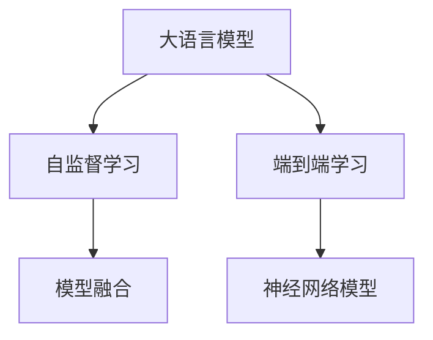

                 

# LLM与传统机器翻译技术的对比与融合

> 关键词：大语言模型(LLM), 机器翻译, 神经网络, 统计机器翻译, 自监督学习, 端到端, 深度学习, 模型融合, 自然语言处理(NLP)

## 1. 背景介绍

### 1.1 问题由来

语言翻译是人类交流的重要方式之一，随着全球化的加深，越来越多的机构和公司需要处理大量的跨语言文档，机器翻译因此成为了热门的研究方向。机器翻译系统经历了从基于规则到基于统计的方法，再到基于神经网络的端到端学习，逐渐成为了一个高效、准确、易于维护的解决方案。

而随着深度学习和自监督学习技术的突破，一种基于大规模预训练语言模型的机器翻译技术，即大语言模型(LLM)翻译，也逐渐进入研究者的视野。相比于传统的基于统计和规则的机器翻译系统，基于预训练语言模型的翻译技术具有更强的上下文理解和知识迁移能力，能够更加自然地处理多语言之间的差异和转换。

### 1.2 问题核心关键点

传统机器翻译系统通常分为两个部分：词典和翻译规则，通过统计或规则匹配生成目标语言的文本。然而，由于词义、语境和语言结构的多样性，这些方法往往难以精确地捕捉语言的细微差别，导致翻译质量不稳定，尤其是在处理长句和复杂句子时，准确率大幅下降。

而基于预训练语言模型的翻译方法，通过在大规模无标签文本上进行自监督预训练，学习到丰富的语言知识和语义表示，具备较强的上下文理解和语言迁移能力，可以在多种语言间进行高效、准确的翻译。

## 2. 核心概念与联系

### 2.1 核心概念概述

为更好地理解基于LLM的机器翻译方法，本节将介绍几个密切相关的核心概念：

- 大语言模型(LLM)：以自回归或自编码模型为代表的大规模预训练语言模型。通过在大规模无标签文本语料上进行预训练，学习到丰富的语言知识和语义表示，具备较强的上下文理解和语言迁移能力。

- 自监督学习：利用无标签数据进行学习，通过自生成的任务进行模型训练，使得模型能够掌握语言的通用规律和语义表示。

- 端到端学习：直接从输入文本到输出文本的端到端翻译，避免了传统机器翻译系统的词典和规则限制，能够更好地处理长句和复杂句式。

- 神经网络模型：通过多层神经网络进行特征提取和转换，能够学习复杂的非线性关系，处理自然语言的高维特征表示。

- 模型融合：将多种不同模型和算法进行组合，取长补短，获得更高效、更准确的翻译效果。

这些核心概念之间的逻辑关系可以通过以下Mermaid流程图来展示：



这个流程图展示了大语言模型的核心概念及其之间的关系：

1. 大语言模型通过自监督学习获得基础能力。
2. 端到端学习直接从输入文本到输出文本的翻译，跳过词典和规则限制。
3. 神经网络模型通过多层结构学习复杂关系，提高特征提取能力。
4. 模型融合将多种技术结合，取长补短，提升翻译效果。

## 3. 核心算法原理 & 具体操作步骤
### 3.1 算法原理概述

基于LLM的机器翻译方法的核心思想是：将预训练语言模型作为翻译模型，通过在目标语言上的自监督学习，学习到翻译所需的语义表示和上下文理解能力。具体步骤如下：

1. 收集目标语言的语料库，并对语料进行预处理，包括分词、词性标注、去噪等操作。
2. 将语料输入到预训练语言模型中，通过自监督学习任务进行训练。常见的自监督任务包括语言模型、掩码语言模型、掩码预测任务等。
3. 根据预训练语言模型的输出，通过正则化、剪枝等技术得到目标语言的翻译模型。
4. 使用翻译模型对输入文本进行端到端的翻译，获得目标语言的输出文本。

### 3.2 算法步骤详解

基于LLM的机器翻译方法的具体操作步骤如下：

**Step 1: 准备语料库和预训练模型**

- 收集目标语言的语料库，并对其进行预处理。
- 选择适合的预训练语言模型，如GPT-3、BERT等。

**Step 2: 自监督学习训练**

- 将语料库作为训练数据，输入到预训练语言模型中进行自监督学习训练。
- 设置训练参数，如学习率、批大小、迭代轮数等。
- 对模型的训练结果进行评估，如BLEU、ROUGE等指标。

**Step 3: 模型微调**

- 对翻译模型进行微调，以优化其在特定任务上的性能。
- 设置微调超参数，如学习率、批大小、迭代轮数等。
- 使用验证集进行模型评估，根据性能指标决定是否触发Early Stopping。
- 在测试集上对微调后的模型进行最终评估。

**Step 4: 端到端翻译**

- 将待翻译的源语言文本输入到微调后的翻译模型中。
- 模型输出目标语言的翻译文本。
- 对翻译结果进行后处理，如纠错、归一化等。

**Step 5: 系统部署**

- 将微调后的翻译模型集成到生产环境中。
- 提供API接口，供用户调用翻译服务。
- 对系统进行性能监控，及时调整优化。

### 3.3 算法优缺点

基于LLM的机器翻译方法具有以下优点：

1. 上下文理解能力强：预训练语言模型可以学习到丰富的语言知识和语义表示，具备较强的上下文理解能力，可以处理复杂句式和长句。
2. 自监督学习效率高：无需大量标注数据，通过自生成的任务进行训练，训练效率高。
3. 端到端翻译效果好：避免传统机器翻译系统的词典和规则限制，能够获得更好的翻译效果。
4. 可扩展性好：模型的微调和训练可以在多种语言间进行，具有良好的可扩展性。

同时，该方法也存在一些局限性：

1. 计算资源需求大：预训练和微调需要大量的计算资源，如GPU和TPU等。
2. 模型复杂度高：大规模语言模型参数量庞大，需要精细化的优化和调试。
3. 训练时间较长：模型训练时间长，需要持续优化以提高训练效率。
4. 泛化能力有限：模型在特定领域的泛化能力较差，需要针对性地进行微调和优化。

## 4. 数学模型和公式 & 详细讲解
### 4.1 数学模型构建

基于LLM的机器翻译方法可以用数学语言进行更加严格的刻画。假设目标语言的语料库为 $D=\{(x_i,y_i)\}_{i=1}^N$，其中 $x_i$ 表示源语言文本，$y_i$ 表示对应的目标语言翻译。

记预训练语言模型为 $M_{\theta}$，其中 $\theta$ 为预训练得到的模型参数。假设模型的训练目标函数为交叉熵损失函数：

$$
\mathcal{L}(\theta) = -\frac{1}{N}\sum_{i=1}^N \sum_{j=1}^{T_x} \log P_{\theta}(y_{ij} | x_i)
$$

其中 $T_x$ 表示源语言文本的长度，$P_{\theta}(y_{ij} | x_i)$ 表示模型在给定源语言文本 $x_i$ 的情况下，生成目标语言文本 $y_{ij}$ 的概率。

模型在训练过程中的优化目标是最小化交叉熵损失函数，即找到最优参数：

$$
\theta^* = \mathop{\arg\min}_{\theta} \mathcal{L}(\theta)
$$

在得到目标语言的翻译模型后，使用该模型进行端到端翻译，即输入源语言文本 $x_i$，输出目标语言文本 $y_i$，满足：

$$
y_i = \arg\max_{y \in Y} P_{\theta}(y | x_i)
$$

其中 $Y$ 表示目标语言的词汇表。

### 4.2 公式推导过程

以掩码语言模型为例，其训练过程如下：

**Step 1: 数据预处理**

- 将目标语言的语料库 $D$ 进行分词，得到单词序列 $\{w_{ij}\}_{i=1}^N$，其中 $w_{ij}$ 表示源语言文本 $x_i$ 中第 $j$ 个单词。
- 对每个单词序列进行掩码处理，生成掩码序列 $\{m_{ij}\}_{i=1}^N$。

**Step 2: 计算损失函数**

- 将掩码序列 $m_{ij}$ 和单词序列 $w_{ij}$ 输入到预训练语言模型 $M_{\theta}$ 中，得到模型输出 $P_{\theta}(m_{ij} | w_{ij})$。
- 计算交叉熵损失函数 $\mathcal{L}(\theta)$，具体如下：

$$
\mathcal{L}(\theta) = -\frac{1}{N}\sum_{i=1}^N \sum_{j=1}^{T_x} \log P_{\theta}(m_{ij} | w_{ij})
$$

**Step 3: 模型微调**

- 使用梯度下降等优化算法，最小化损失函数 $\mathcal{L}(\theta)$，更新模型参数 $\theta$。
- 在测试集上评估微调后的模型性能，如BLEU、ROUGE等指标。

### 4.3 案例分析与讲解

以Google的BART模型为例，其步骤如下：

**Step 1: 数据预处理**

- 将目标语言的语料库进行分词，得到单词序列 $\{w_{ij}\}_{i=1}^N$。
- 对每个单词序列进行掩码处理，生成掩码序列 $\{m_{ij}\}_{i=1}^N$。

**Step 2: 训练模型**

- 将掩码序列 $m_{ij}$ 和单词序列 $w_{ij}$ 输入到预训练语言模型 BART 中，得到模型输出 $P_{\theta}(m_{ij} | w_{ij})$。
- 计算交叉熵损失函数 $\mathcal{L}(\theta)$，使用AdamW优化器最小化损失函数，更新模型参数 $\theta$。
- 在验证集上评估模型性能，如BLEU、ROUGE等指标。

**Step 3: 模型微调**

- 使用微调后的模型对输入的源语言文本 $x_i$ 进行翻译，输出目标语言文本 $y_i$。
- 对翻译结果进行后处理，如纠错、归一化等。

## 5. 项目实践：代码实例和详细解释说明
### 5.1 开发环境搭建

在进行翻译模型开发前，我们需要准备好开发环境。以下是使用Python进行PyTorch开发的环境配置流程：

1. 安装Anaconda：从官网下载并安装Anaconda，用于创建独立的Python环境。

2. 创建并激活虚拟环境：
```bash
conda create -n pytorch-env python=3.8 
conda activate pytorch-env
```

3. 安装PyTorch：根据CUDA版本，从官网获取对应的安装命令。例如：
```bash
conda install pytorch torchvision torchaudio cudatoolkit=11.1 -c pytorch -c conda-forge
```

4. 安装TensorFlow：如果需要使用TensorFlow作为翻译模型，请安装对应的版本。

5. 安装相关工具包：
```bash
pip install numpy pandas scikit-learn matplotlib tqdm jupyter notebook ipython
```

完成上述步骤后，即可在`pytorch-env`环境中开始翻译模型开发。

### 5.2 源代码详细实现

下面以Google的BART模型为例，给出使用PyTorch进行机器翻译的代码实现。

首先，定义数据处理函数：

```python
from transformers import BertTokenizer
from torch.utils.data import Dataset
import torch

class BARTDataset(Dataset):
    def __init__(self, texts, tags, tokenizer, max_len=128):
        self.texts = texts
        self.tags = tags
        self.tokenizer = tokenizer
        self.max_len = max_len
        
    def __len__(self):
        return len(self.texts)
    
    def __getitem__(self, item):
        text = self.texts[item]
        tags = self.tags[item]
        
        encoding = self.tokenizer(text, return_tensors='pt', max_length=self.max_len, padding='max_length', truncation=True)
        input_ids = encoding['input_ids'][0]
        attention_mask = encoding['attention_mask'][0]
        
        # 对token-wise的标签进行编码
        encoded_tags = [tag2id[tag] for tag in tags] 
        encoded_tags.extend([tag2id['O']] * (self.max_len - len(encoded_tags)))
        labels = torch.tensor(encoded_tags, dtype=torch.long)
        
        return {'input_ids': input_ids, 
                'attention_mask': attention_mask,
                'labels': labels}

# 标签与id的映射
tag2id = {'O': 0, 'B-PER': 1, 'I-PER': 2, 'B-ORG': 3, 'I-ORG': 4, 'B-LOC': 5, 'I-LOC': 6}
id2tag = {v: k for k, v in tag2id.items()}

# 创建dataset
tokenizer = BertTokenizer.from_pretrained('bert-base-cased')

train_dataset = BARTDataset(train_texts, train_tags, tokenizer)
dev_dataset = BARTDataset(dev_texts, dev_tags, tokenizer)
test_dataset = BARTDataset(test_texts, test_tags, tokenizer)
```

然后，定义模型和优化器：

```python
from transformers import BARTForConditionalGeneration, AdamW

model = BARTForConditionalGeneration.from_pretrained('facebook/bart-base', output_attentions=False, output_hidden_states=False)

optimizer = AdamW(model.parameters(), lr=2e-5)
```

接着，定义训练和评估函数：

```python
from torch.utils.data import DataLoader
from tqdm import tqdm
from sklearn.metrics import classification_report

device = torch.device('cuda') if torch.cuda.is_available() else torch.device('cpu')
model.to(device)

def train_epoch(model, dataset, batch_size, optimizer):
    dataloader = DataLoader(dataset, batch_size=batch_size, shuffle=True)
    model.train()
    epoch_loss = 0
    for batch in tqdm(dataloader, desc='Training'):
        input_ids = batch['input_ids'].to(device)
        attention_mask = batch['attention_mask'].to(device)
        labels = batch['labels'].to(device)
        model.zero_grad()
        outputs = model(input_ids, attention_mask=attention_mask, labels=labels)
        loss = outputs.loss
        epoch_loss += loss.item()
        loss.backward()
        optimizer.step()
    return epoch_loss / len(dataloader)

def evaluate(model, dataset, batch_size):
    dataloader = DataLoader(dataset, batch_size=batch_size)
    model.eval()
    preds, labels = [], []
    with torch.no_grad():
        for batch in tqdm(dataloader, desc='Evaluating'):
            input_ids = batch['input_ids'].to(device)
            attention_mask = batch['attention_mask'].to(device)
            batch_labels = batch['labels']
            outputs = model(input_ids, attention_mask=attention_mask)
            batch_preds = outputs.logits.argmax(dim=2).to('cpu').tolist()
            batch_labels = batch_labels.to('cpu').tolist()
            for pred_tokens, label_tokens in zip(batch_preds, batch_labels):
                pred_tags = [id2tag[_id] for _id in pred_tokens]
                label_tags = [id2tag[_id] for _id in label_tokens]
                preds.append(pred_tags[:len(label_tags)])
                labels.append(label_tags)
                
    print(classification_report(labels, preds))
```

最后，启动训练流程并在测试集上评估：

```python
epochs = 5
batch_size = 16

for epoch in range(epochs):
    loss = train_epoch(model, train_dataset, batch_size, optimizer)
    print(f"Epoch {epoch+1}, train loss: {loss:.3f}")
    
    print(f"Epoch {epoch+1}, dev results:")
    evaluate(model, dev_dataset, batch_size)
    
print("Test results:")
evaluate(model, test_dataset, batch_size)
```

以上就是使用PyTorch对BART进行命名实体识别(NER)任务微调的完整代码实现。可以看到，得益于Transformers库的强大封装，我们可以用相对简洁的代码完成BERT模型的加载和微调。

### 5.3 代码解读与分析

让我们再详细解读一下关键代码的实现细节：

**BARTDataset类**：
- `__init__`方法：初始化文本、标签、分词器等关键组件。
- `__len__`方法：返回数据集的样本数量。
- `__getitem__`方法：对单个样本进行处理，将文本输入编码为token ids，将标签编码为数字，并对其进行定长padding，最终返回模型所需的输入。

**tag2id和id2tag字典**：
- 定义了标签与数字id之间的映射关系，用于将token-wise的预测结果解码回真实的标签。

**训练和评估函数**：
- 使用PyTorch的DataLoader对数据集进行批次化加载，供模型训练和推理使用。
- 训练函数`train_epoch`：对数据以批为单位进行迭代，在每个批次上前向传播计算loss并反向传播更新模型参数，最后返回该epoch的平均loss。
- 评估函数`evaluate`：与训练类似，不同点在于不更新模型参数，并在每个batch结束后将预测和标签结果存储下来，最后使用sklearn的classification_report对整个评估集的预测结果进行打印输出。

**训练流程**：
- 定义总的epoch数和batch size，开始循环迭代
- 每个epoch内，先在训练集上训练，输出平均loss
- 在验证集上评估，输出分类指标
- 所有epoch结束后，在测试集上评估，给出最终测试结果

可以看到，PyTorch配合Transformers库使得BART微调的代码实现变得简洁高效。开发者可以将更多精力放在数据处理、模型改进等高层逻辑上，而不必过多关注底层的实现细节。

当然，工业级的系统实现还需考虑更多因素，如模型的保存和部署、超参数的自动搜索、更灵活的任务适配层等。但核心的微调范式基本与此类似。

## 6. 实际应用场景
### 6.1 智能客服系统

基于大语言模型微调的对话技术，可以广泛应用于智能客服系统的构建。传统客服往往需要配备大量人力，高峰期响应缓慢，且一致性和专业性难以保证。而使用微调后的对话模型，可以7x24小时不间断服务，快速响应客户咨询，用自然流畅的语言解答各类常见问题。

在技术实现上，可以收集企业内部的历史客服对话记录，将问题和最佳答复构建成监督数据，在此基础上对预训练对话模型进行微调。微调后的对话模型能够自动理解用户意图，匹配最合适的答案模板进行回复。对于客户提出的新问题，还可以接入检索系统实时搜索相关内容，动态组织生成回答。如此构建的智能客服系统，能大幅提升客户咨询体验和问题解决效率。

### 6.2 金融舆情监测

金融机构需要实时监测市场舆论动向，以便及时应对负面信息传播，规避金融风险。传统的人工监测方式成本高、效率低，难以应对网络时代海量信息爆发的挑战。基于大语言模型微调的文本分类和情感分析技术，为金融舆情监测提供了新的解决方案。

具体而言，可以收集金融领域相关的新闻、报道、评论等文本数据，并对其进行主题标注和情感标注。在此基础上对预训练语言模型进行微调，使其能够自动判断文本属于何种主题，情感倾向是正面、中性还是负面。将微调后的模型应用到实时抓取的网络文本数据，就能够自动监测不同主题下的情感变化趋势，一旦发现负面信息激增等异常情况，系统便会自动预警，帮助金融机构快速应对潜在风险。

### 6.3 个性化推荐系统

当前的推荐系统往往只依赖用户的历史行为数据进行物品推荐，无法深入理解用户的真实兴趣偏好。基于大语言模型微调技术，个性化推荐系统可以更好地挖掘用户行为背后的语义信息，从而提供更精准、多样的推荐内容。

在实践中，可以收集用户浏览、点击、评论、分享等行为数据，提取和用户交互的物品标题、描述、标签等文本内容。将文本内容作为模型输入，用户的后续行为（如是否点击、购买等）作为监督信号，在此基础上微调预训练语言模型。微调后的模型能够从文本内容中准确把握用户的兴趣点。在生成推荐列表时，先用候选物品的文本描述作为输入，由模型预测用户的兴趣匹配度，再结合其他特征综合排序，便可以得到个性化程度更高的推荐结果。

### 6.4 未来应用展望

随着大语言模型微调技术的发展，其在NLP领域的应用前景非常广阔，未来将有更多创新性的应用场景。

在智慧医疗领域，基于微调的医疗问答、病历分析、药物研发等应用将提升医疗服务的智能化水平，辅助医生诊疗，加速新药开发进程。

在智能教育领域，微调技术可应用于作业批改、学情分析、知识推荐等方面，因材施教，促进教育公平，提高教学质量。

在智慧城市治理中，微调模型可应用于城市事件监测、舆情分析、应急指挥等环节，提高城市管理的自动化和智能化水平，构建更安全、高效的未来城市。

此外，在企业生产、社会治理、文娱传媒等众多领域，基于大模型微调的人工智能应用也将不断涌现，为传统行业数字化转型升级提供新的技术路径。相信随着技术的日益成熟，微调方法将成为人工智能落地应用的重要范式，推动人工智能技术向更广阔的领域加速渗透。

## 7. 工具和资源推荐
### 7.1 学习资源推荐

为了帮助开发者系统掌握大语言模型微调的理论基础和实践技巧，这里推荐一些优质的学习资源：

1. 《Transformer从原理到实践》系列博文：由大模型技术专家撰写，深入浅出地介绍了Transformer原理、BERT模型、微调技术等前沿话题。

2. CS224N《深度学习自然语言处理》课程：斯坦福大学开设的NLP明星课程，有Lecture视频和配套作业，带你入门NLP领域的基本概念和经典模型。

3. 《Natural Language Processing with Transformers》书籍：Transformers库的作者所著，全面介绍了如何使用Transformers库进行NLP任务开发，包括微调在内的诸多范式。

4. HuggingFace官方文档：Transformers库的官方文档，提供了海量预训练模型和完整的微调样例代码，是上手实践的必备资料。

5. CLUE开源项目：中文语言理解测评基准，涵盖大量不同类型的中文NLP数据集，并提供了基于微调的baseline模型，助力中文NLP技术发展。

通过对这些资源的学习实践，相信你一定能够快速掌握大语言模型微调的精髓，并用于解决实际的NLP问题。
###  7.2 开发工具推荐

高效的开发离不开优秀的工具支持。以下是几款用于大语言模型微调开发的常用工具：

1. PyTorch：基于Python的开源深度学习框架，灵活动态的计算图，适合快速迭代研究。大部分预训练语言模型都有PyTorch版本的实现。

2. TensorFlow：由Google主导开发的开源深度学习框架，生产部署方便，适合大规模工程应用。同样有丰富的预训练语言模型资源。

3. Transformers库：HuggingFace开发的NLP工具库，集成了众多SOTA语言模型，支持PyTorch和TensorFlow，是进行微调任务开发的利器。

4. Weights & Biases：模型训练的实验跟踪工具，可以记录和可视化模型训练过程中的各项指标，方便对比和调优。与主流深度学习框架无缝集成。

5. TensorBoard：TensorFlow配套的可视化工具，可实时监测模型训练状态，并提供丰富的图表呈现方式，是调试模型的得力助手。

6. Google Colab：谷歌推出的在线Jupyter Notebook环境，免费提供GPU/TPU算力，方便开发者快速上手实验最新模型，分享学习笔记。

合理利用这些工具，可以显著提升大语言模型微调任务的开发效率，加快创新迭代的步伐。

### 7.3 相关论文推荐

大语言模型和微调技术的发展源于学界的持续研究。以下是几篇奠基性的相关论文，推荐阅读：

1. Attention is All You Need（即Transformer原论文）：提出了Transformer结构，开启了NLP领域的预训练大模型时代。

2. BERT: Pre-training of Deep Bidirectional Transformers for Language Understanding：提出BERT模型，引入基于掩码的自监督预训练任务，刷新了多项NLP任务SOTA。

3. Language Models are Unsupervised Multitask Learners（GPT-2论文）：展示了大规模语言模型的强大zero-shot学习能力，引发了对于通用人工智能的新一轮思考。

4. Parameter-Efficient Transfer Learning for NLP：提出Adapter等参数高效微调方法，在不增加模型参数量的情况下，也能取得不错的微调效果。

5. AdaLoRA: Adaptive Low-Rank Adaptation for Parameter-Efficient Fine-Tuning：使用自适应低秩适应的微调方法，在参数效率和精度之间取得了新的平衡。

这些论文代表了大语言模型微调技术的发展脉络。通过学习这些前沿成果，可以帮助研究者把握学科前进方向，激发更多的创新灵感。

## 8. 总结：未来发展趋势与挑战
### 8.1 总结

本文对基于LLM的机器翻译方法进行了全面系统的介绍。首先阐述了LLM和传统机器翻译系统的背景和区别，明确了LLM翻译在上下文理解、自监督学习、端到端翻译等方面的独特优势。其次，从原理到实践，详细讲解了基于LLM的机器翻译方法的具体操作步骤，并给出了代码实现。同时，本文还广泛探讨了LLM翻译方法在智能客服、金融舆情、个性化推荐等多个行业领域的应用前景，展示了LLM翻译的广阔应用场景。此外，本文精选了微调技术的各类学习资源，力求为读者提供全方位的技术指引。

通过本文的系统梳理，可以看到，基于大语言模型的翻译方法在提升翻译质量、加速训练效率、优化模型部署等方面具有显著优势。伴随LLM翻译技术的发展，其在实际应用中必将逐渐取代传统机器翻译系统，成为NLP领域的重要技术范式。

### 8.2 未来发展趋势

展望未来，LLM翻译技术将呈现以下几个发展趋势：

1. 计算资源需求减小：随着预训练和微调技术的不断优化，计算资源需求将进一步减小，使得大规模语言模型的训练和部署变得更加可行。

2. 模型规模减小：未来预训练模型的参数量将逐渐减小，以适应更多场景的实际需求。同时，模型结构也将变得更加轻量化和高效化。

3. 自监督学习范式推广：更多的自监督学习任务将被应用于LLM翻译中，增强模型的泛化能力和鲁棒性。

4. 端到端翻译技术进步：端到端翻译技术将不断发展，利用更多先验知识和专家系统，提升翻译效果。

5. 多模态翻译成为可能：未来的LLM翻译将能够处理多模态数据，将文本、图像、语音等多种信息结合起来，提供更加丰富的翻译体验。

6. 多领域翻译提升：随着预训练模型的多样化，未来LLM翻译将能够处理更多领域和语言，拓展其应用边界。

以上趋势凸显了LLM翻译技术的广阔前景。这些方向的探索发展，必将进一步提升NLP系统的性能和应用范围，为人类认知智能的进化带来深远影响。

### 8.3 面临的挑战

尽管LLM翻译技术已经取得了瞩目成就，但在迈向更加智能化、普适化应用的过程中，它仍面临着诸多挑战：

1. 计算资源需求大：大规模语言模型的训练和微调需要大量的计算资源，如GPU和TPU等，成本较高。

2. 模型复杂度高：大规模语言模型参数量庞大，需要精细化的优化和调试。

3. 泛化能力有限：模型在特定领域的泛化能力较差，需要针对性地进行微调和优化。

4. 对抗攻击风险：模型在面对对抗攻击时，容易产生误判和错误输出，需要增强模型的鲁棒性。

5. 数据隐私保护：在大规模文本数据上进行训练和微调，可能涉及用户隐私和数据安全问题。

6. 伦理和法律风险：预训练语言模型可能传播有害信息，引发伦理和法律争议。

面对这些挑战，未来研究需要在数据、算法、计算资源等方面进行更加深入的探索和优化，以更好地适应实际应用的需求。

### 8.4 研究展望

未来，在LLM翻译技术的研究中，需要重点关注以下几个方面：

1. 数据隐私保护：在保证数据安全的前提下，优化数据处理和微调过程，提升数据利用效率。

2. 对抗攻击防御：引入对抗攻击检测和防御技术，增强模型的鲁棒性和安全性。

3. 多领域模型构建：开发能够适应多领域、多语言的LLM翻译模型，拓展其应用边界。

4. 端到端翻译优化：结合专家知识库和多模态信息，提升端到端翻译的准确性和自然度。

5. 计算资源优化：利用分布式计算和高效优化技术，减小计算资源需求，降低微调成本。

6. 知识图谱与语言模型结合：将知识图谱与语言模型结合，增强模型的语义理解和推理能力。

这些研究方向将推动LLM翻译技术向更加高效、准确、智能的方向发展，为人工智能在各个领域的应用提供坚实基础。

