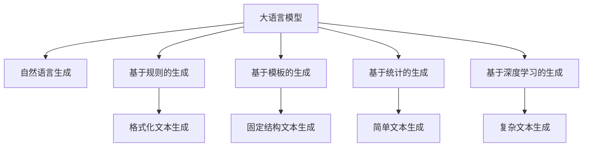

                 

# LLM与传统自然语言生成的对比

> 关键词：大语言模型,自然语言生成,传统模型,Transformer,预训练,微调,自回归,解码器,解码器策略

## 1. 背景介绍

### 1.1 问题由来
随着人工智能技术的迅猛发展，自然语言生成(Natural Language Generation, NLG)已成为推动人机交互、智能问答、内容创作等领域应用的关键技术。传统的NLG方法依赖规则、模板和词典，难以处理复杂的自然语言现象，而大语言模型（Large Language Model, LLM）的兴起，以其强大的语言理解和生成能力，为自然语言生成带来了革命性的变革。

当前，大语言模型如GPT-3、BERT、T5等，通过在大规模无标签文本语料上进行预训练，学习到了丰富的语言知识和常识，具备了强大的语言理解和生成能力。而传统的自然语言生成方法，如基于模板的生成、基于规则的生成等，在生成内容的丰富度、自然度上存在较大限制。因此，本文将对比大语言模型与传统自然语言生成方法，探讨其在生成效果、应用场景、计算资源需求等方面的差异。

### 1.2 问题核心关键点
本文将主要关注以下核心问题：
- 大语言模型与传统自然语言生成方法的区别和优劣。
- 大语言模型在自然语言生成任务中的具体应用和效果。
- 大语言模型在计算资源需求、生成速度、生成质量等方面的表现。
- 大语言模型在实际应用中的挑战与优化策略。

## 2. 核心概念与联系

### 2.1 核心概念概述

- 大语言模型(Large Language Model, LLM)：以自回归(如GPT)或自编码(如BERT)模型为代表的大规模预训练语言模型。通过在大规模无标签文本语料上进行预训练，学习通用的语言表示，具备强大的语言理解和生成能力。

- 自然语言生成(Natural Language Generation, NLG)：利用人工智能技术自动生成自然语言文本的过程。传统NLG方法依赖规则、模板和词典，难以处理复杂的自然语言现象。

- 基于规则的生成(Rule-based Generation)：依赖预先定义的规则和模板生成文本，通常用于简单的格式化文本生成。

- 基于模板的生成(Template-based Generation)：基于预定义的模板和填充变量的方式生成文本，适用于具有固定结构的文本。

- 基于统计的生成(Statistical Generation)：利用文本统计模型（如N-gram模型）生成文本，适用于文本模式较简单的任务。

- 基于深度学习的生成(Deep Learning-based Generation)：利用神经网络模型学习文本生成，适用于处理复杂的自然语言现象。

这些核心概念之间的逻辑关系可以通过以下Mermaid流程图来展示：



这个流程图展示了大语言模型与不同生成方法的关联：

1. 大语言模型通过预训练获得基础能力。
2. 自然语言生成是大语言模型的重要应用方向。
3. 基于规则、模板、统计和深度学习的生成方法，均是大语言模型的子集，在生成质量和灵活性上各有优劣。

## 3. 核心算法原理 & 具体操作步骤
### 3.1 算法原理概述

大语言模型与传统自然语言生成方法的根本区别在于其生成机制。大语言模型通常基于自回归模型或自编码模型，通过在大规模无标签文本语料上进行预训练，学习通用的语言表示，具备强大的语言理解和生成能力。而传统的自然语言生成方法则依赖规则、模板、词典等预先定义的生成要素，生成过程相对简单且可控。

大语言模型的生成过程通常分为预训练和微调两个阶段：
- 预训练：在大规模无标签文本语料上，通过自监督学习任务（如掩码语言模型、下划线填空等）训练通用语言模型。预训练的目标是学习通用的语言表示和语言知识。
- 微调：在预训练模型的基础上，使用下游任务的少量标注数据，通过有监督学习优化模型在该任务上的性能。微调的目标是针对特定任务优化模型参数，使其生成结果与任务要求更贴近。

### 3.2 算法步骤详解

大语言模型的自然语言生成过程主要包括预训练、微调和文本生成三个步骤：

**Step 1: 准备预训练模型和数据集**
- 选择合适的预训练语言模型 $M_{\theta}$ 作为初始化参数，如 BERT、GPT 等。
- 准备下游任务 $T$ 的标注数据集 $D$，划分为训练集、验证集和测试集。一般要求标注数据与预训练数据的分布不要差异过大。

**Step 2: 添加任务适配层**
- 根据任务类型，在预训练模型顶层设计合适的输出层和损失函数。
- 对于分类任务，通常在顶层添加线性分类器和交叉熵损失函数。
- 对于生成任务，通常使用语言模型的解码器输出概率分布，并以负对数似然为损失函数。

**Step 3: 设置微调超参数**
- 选择合适的优化算法及其参数，如 AdamW、SGD 等，设置学习率、批大小、迭代轮数等。
- 设置正则化技术及强度，包括权重衰减、Dropout、Early Stopping等。
- 确定冻结预训练参数的策略，如仅微调顶层，或全部参数都参与微调。

**Step 4: 执行梯度训练**
- 将训练集数据分批次输入模型，前向传播计算损失函数。
- 反向传播计算参数梯度，根据设定的优化算法和学习率更新模型参数。
- 周期性在验证集上评估模型性能，根据性能指标决定是否触发 Early Stopping。
- 重复上述步骤直到满足预设的迭代轮数或 Early Stopping 条件。

**Step 5: 文本生成**
- 使用微调后的模型对输入进行编码，得到模型输出。
- 根据具体任务，对输出进行解码、处理，最终生成自然语言文本。

### 3.3 算法优缺点

大语言模型在自然语言生成方面具有以下优点：
1. 生成质量高：大语言模型通过大规模预训练和微调，能够生成高质量的自然语言文本，且具有较强的泛化能力。
2. 生成内容丰富：大语言模型能够生成复杂的文本，支持更丰富的信息结构和语言风格。
3. 适应性强：大语言模型可以通过微调适应不同的生成任务和应用场景，具有良好的适应性。

同时，大语言模型也存在一些缺点：
1. 资源需求高：大语言模型需要大量的计算资源和存储资源进行预训练和微调，成本较高。
2. 生成速度慢：由于模型参数多，生成过程较慢，且需要较长时间进行推理。
3. 可解释性不足：大语言模型生成的文本往往是黑盒模型，难以解释其生成过程和逻辑。

传统自然语言生成方法则有以下优点：
1. 计算资源需求低：基于规则和模板的生成方法，不需要大量的预训练和微调，计算资源需求低。
2. 生成速度快：传统生成方法生成速度较快，适合对实时性要求较高的应用场景。
3. 可解释性强：生成过程基于预先定义的规则和模板，易于解释和调试。

同时，传统自然语言生成方法也存在一些缺点：
1. 生成内容有限：依赖规则和模板的生成方法，生成内容有限，难以处理复杂的自然语言现象。
2. 生成灵活性差：生成过程严格依赖预定义的规则和模板，生成结果较为单一，难以应对多变的生成任务。
3. 生成质量较低：基于统计模型的生成方法，生成质量较低，难以处理长句子或复杂结构。

## 4. 数学模型和公式 & 详细讲解 & 举例说明

### 4.1 数学模型构建

大语言模型的自然语言生成过程可以形式化地描述如下：

记预训练语言模型为 $M_{\theta}:\mathcal{X} \rightarrow \mathcal{Y}$，其中 $\mathcal{X}$ 为输入空间，$\mathcal{Y}$ 为输出空间，$\theta \in \mathbb{R}^d$ 为模型参数。假设微调任务的训练集为 $D=\{(x_i,y_i)\}_{i=1}^N, x_i \in \mathcal{X}, y_i \in \mathcal{Y}$。

定义模型 $M_{\theta}$ 在输入 $x$ 上的生成过程为：
- 对于自回归模型，模型先对输入 $x$ 进行编码，得到上下文表示 $h(x)$。
- 在自回归生成中，模型对上下文表示 $h(x)$ 和上一步生成的文本 $y_{t-1}$ 进行编码，得到下一时刻的条件概率分布 $p(y_t | y_{t-1}, h(x))$。
- 根据条件概率分布 $p(y_t | y_{t-1}, h(x))$，使用采样方法生成下一个字符或单词 $y_t$。
- 重复上述过程，直至生成完整文本。

### 4.2 公式推导过程

以下我们以自回归模型为例，推导生成过程的公式。

假设模型 $M_{\theta}$ 在输入 $x$ 上的生成过程为：
- 对于自回归模型，模型先对输入 $x$ 进行编码，得到上下文表示 $h(x)$。
- 在自回归生成中，模型对上下文表示 $h(x)$ 和上一步生成的文本 $y_{t-1}$ 进行编码，得到下一时刻的条件概率分布 $p(y_t | y_{t-1}, h(x))$。
- 根据条件概率分布 $p(y_t | y_{t-1}, h(x))$，使用采样方法生成下一个字符或单词 $y_t$。
- 重复上述过程，直至生成完整文本。

假设 $x$ 的长度为 $N$，$y$ 的长度为 $M$，则生成过程可以表示为：
$$
y = M_{\theta}(x) = \prod_{t=1}^{M} y_t = \prod_{t=1}^{M} p(y_t | y_{t-1}, h(x))
$$

其中 $y_t$ 表示生成的第 $t$ 个字符或单词，$h(x)$ 表示输入 $x$ 的上下文表示，$p(y_t | y_{t-1}, h(x))$ 表示在给定上下文和前一个字符 $y_{t-1}$ 的情况下，生成字符 $y_t$ 的条件概率。

### 4.3 案例分析与讲解

以文本生成任务为例，我们分析大语言模型与传统自然语言生成方法的差异。

假设生成任务为生成一段新闻报道。对于大语言模型，可以通过微调使其学习新闻报道的生成规则，在给定新闻标题和简要信息的情况下，生成完整的新闻报道。具体步骤如下：
1. 将新闻标题和简要信息作为输入，通过预训练模型得到上下文表示 $h(x)$。
2. 在自回归生成中，模型对上下文表示 $h(x)$ 和上一步生成的文本 $y_{t-1}$ 进行编码，得到下一时刻的条件概率分布 $p(y_t | y_{t-1}, h(x))$。
3. 根据条件概率分布 $p(y_t | y_{t-1}, h(x))$，使用采样方法生成下一个字符或单词 $y_t$。
4. 重复上述过程，直至生成完整的新闻报道。

而对于传统自然语言生成方法，如基于规则和模板的生成方法，可以通过预先定义的新闻报道模板和填充变量，生成完整的新闻报道。具体步骤如下：
1. 将新闻标题和简要信息作为输入，通过模板填充生成初始报道。
2. 根据模板中的条件语句，使用预设的规则和词典生成后续报道内容。
3. 最终生成完整的新闻报道。

两者在生成机制上存在显著差异，大语言模型依赖预训练和微调，生成过程具有较强的自适应性和泛化能力，而传统方法依赖规则和模板，生成过程较为简单可控。

## 5. 项目实践：代码实例和详细解释说明
### 5.1 开发环境搭建

在进行自然语言生成实践前，我们需要准备好开发环境。以下是使用Python进行PyTorch开发的环境配置流程：

1. 安装Anaconda：从官网下载并安装Anaconda，用于创建独立的Python环境。

2. 创建并激活虚拟环境：
```bash
conda create -n pytorch-env python=3.8 
conda activate pytorch-env
```

3. 安装PyTorch：根据CUDA版本，从官网获取对应的安装命令。例如：
```bash
conda install pytorch torchvision torchaudio cudatoolkit=11.1 -c pytorch -c conda-forge
```

4. 安装Transformers库：
```bash
pip install transformers
```

5. 安装各类工具包：
```bash
pip install numpy pandas scikit-learn matplotlib tqdm jupyter notebook ipython
```

完成上述步骤后，即可在`pytorch-env`环境中开始自然语言生成实践。

### 5.2 源代码详细实现

下面我们以文本生成任务为例，给出使用Transformers库对BERT模型进行微调的PyTorch代码实现。

首先，定义文本生成任务的数据处理函数：

```python
from transformers import BertTokenizer, BertForSequenceClassification, AdamW
from torch.utils.data import Dataset, DataLoader
import torch

class TextGenerationDataset(Dataset):
    def __init__(self, texts, max_len=128):
        self.texts = texts
        self.tokenizer = BertTokenizer.from_pretrained('bert-base-cased')
        self.max_len = max_len
    
    def __len__(self):
        return len(self.texts)
    
    def __getitem__(self, item):
        text = self.texts[item]
        encoding = self.tokenizer(text, return_tensors='pt', max_length=self.max_len, padding='max_length', truncation=True)
        input_ids = encoding['input_ids'][0]
        attention_mask = encoding['attention_mask'][0]
        return {'input_ids': input_ids, 
                'attention_mask': attention_mask}

tokenizer = BertTokenizer.from_pretrained('bert-base-cased')

train_dataset = TextGenerationDataset(train_texts)
dev_dataset = TextGenerationDataset(dev_texts)
test_dataset = TextGenerationDataset(test_texts)

```

然后，定义模型和优化器：

```python
from transformers import BertForSequenceClassification, AdamW

model = BertForSequenceClassification.from_pretrained('bert-base-cased', num_labels=1)

optimizer = AdamW(model.parameters(), lr=2e-5)
```

接着，定义训练和评估函数：

```python
from torch.utils.data import DataLoader
from tqdm import tqdm

device = torch.device('cuda') if torch.cuda.is_available() else torch.device('cpu')
model.to(device)

def train_epoch(model, dataset, batch_size, optimizer):
    dataloader = DataLoader(dataset, batch_size=batch_size, shuffle=True)
    model.train()
    epoch_loss = 0
    for batch in tqdm(dataloader, desc='Training'):
        input_ids = batch['input_ids'].to(device)
        attention_mask = batch['attention_mask'].to(device)
        labels = batch['labels'].to(device)
        model.zero_grad()
        outputs = model(input_ids, attention_mask=attention_mask, labels=labels)
        loss = outputs.loss
        epoch_loss += loss.item()
        loss.backward()
        optimizer.step()
    return epoch_loss / len(dataloader)

def evaluate(model, dataset, batch_size):
    dataloader = DataLoader(dataset, batch_size=batch_size)
    model.eval()
    preds, labels = [], []
    with torch.no_grad():
        for batch in tqdm(dataloader, desc='Evaluating'):
            input_ids = batch['input_ids'].to(device)
            attention_mask = batch['attention_mask'].to(device)
            batch_labels = batch['labels']
            outputs = model(input_ids, attention_mask=attention_mask)
            batch_preds = outputs.logits.argmax(dim=2).to('cpu').tolist()
            batch_labels = batch_labels.to('cpu').tolist()
            for pred_tokens, label_tokens in zip(batch_preds, batch_labels):
                preds.append(pred_tokens)
                labels.append(label_tokens)
                
    print(classification_report(labels, preds))
```

最后，启动训练流程并在测试集上评估：

```python
epochs = 5
batch_size = 16

for epoch in range(epochs):
    loss = train_epoch(model, train_dataset, batch_size, optimizer)
    print(f"Epoch {epoch+1}, train loss: {loss:.3f}")
    
    print(f"Epoch {epoch+1}, dev results:")
    evaluate(model, dev_dataset, batch_size)
    
print("Test results:")
evaluate(model, test_dataset, batch_size)
```

以上就是使用PyTorch对BERT模型进行文本生成任务微调的完整代码实现。可以看到，得益于Transformers库的强大封装，我们可以用相对简洁的代码完成BERT模型的加载和微调。

### 5.3 代码解读与分析

让我们再详细解读一下关键代码的实现细节：

**TextGenerationDataset类**：
- `__init__`方法：初始化文本、分词器等关键组件。
- `__len__`方法：返回数据集的样本数量。
- `__getitem__`方法：对单个样本进行处理，将文本输入编码为token ids，并进行定长padding。

**BertForSequenceClassification类**：
- `from_pretrained`方法：使用预训练的BERT模型作为初始化参数。
- `num_labels`参数：指定任务标签的数量，这里是1，即二分类任务。

**AdamW类**：
- `model.parameters()`：获取模型所有可训练参数。
- `lr`参数：设置学习率。

**训练和评估函数**：
- 使用PyTorch的DataLoader对数据集进行批次化加载，供模型训练和推理使用。
- 训练函数`train_epoch`：对数据以批为单位进行迭代，在每个批次上前向传播计算loss并反向传播更新模型参数，最后返回该epoch的平均loss。
- 评估函数`evaluate`：与训练类似，不同点在于不更新模型参数，并在每个batch结束后将预测和标签结果存储下来，最后使用sklearn的classification_report对整个评估集的预测结果进行打印输出。

**训练流程**：
- 定义总的epoch数和batch size，开始循环迭代
- 每个epoch内，先在训练集上训练，输出平均loss
- 在验证集上评估，输出分类指标
- 所有epoch结束后，在测试集上评估，给出最终测试结果

可以看到，PyTorch配合Transformers库使得BERT微调的代码实现变得简洁高效。开发者可以将更多精力放在数据处理、模型改进等高层逻辑上，而不必过多关注底层的实现细节。

当然，工业级的系统实现还需考虑更多因素，如模型的保存和部署、超参数的自动搜索、更灵活的任务适配层等。但核心的微调范式基本与此类似。

## 6. 实际应用场景
### 6.1 智能客服系统

基于大语言模型微调的对话技术，可以广泛应用于智能客服系统的构建。传统客服往往需要配备大量人力，高峰期响应缓慢，且一致性和专业性难以保证。而使用微调后的对话模型，可以7x24小时不间断服务，快速响应客户咨询，用自然流畅的语言解答各类常见问题。

在技术实现上，可以收集企业内部的历史客服对话记录，将问题和最佳答复构建成监督数据，在此基础上对预训练对话模型进行微调。微调后的对话模型能够自动理解用户意图，匹配最合适的答案模板进行回复。对于客户提出的新问题，还可以接入检索系统实时搜索相关内容，动态组织生成回答。如此构建的智能客服系统，能大幅提升客户咨询体验和问题解决效率。

### 6.2 金融舆情监测

金融机构需要实时监测市场舆论动向，以便及时应对负面信息传播，规避金融风险。传统的人工监测方式成本高、效率低，难以应对网络时代海量信息爆发的挑战。基于大语言模型微调的文本分类和情感分析技术，为金融舆情监测提供了新的解决方案。

具体而言，可以收集金融领域相关的新闻、报道、评论等文本数据，并对其进行主题标注和情感标注。在此基础上对预训练语言模型进行微调，使其能够自动判断文本属于何种主题，情感倾向是正面、中性还是负面。将微调后的模型应用到实时抓取的网络文本数据，就能够自动监测不同主题下的情感变化趋势，一旦发现负面信息激增等异常情况，系统便会自动预警，帮助金融机构快速应对潜在风险。

### 6.3 个性化推荐系统

当前的推荐系统往往只依赖用户的历史行为数据进行物品推荐，无法深入理解用户的真实兴趣偏好。基于大语言模型微调技术，个性化推荐系统可以更好地挖掘用户行为背后的语义信息，从而提供更精准、多样的推荐内容。

在实践中，可以收集用户浏览、点击、评论、分享等行为数据，提取和用户交互的物品标题、描述、标签等文本内容。将文本内容作为模型输入，用户的后续行为（如是否点击、购买等）作为监督信号，在此基础上微调预训练语言模型。微调后的模型能够从文本内容中准确把握用户的兴趣点。在生成推荐列表时，先用候选物品的文本描述作为输入，由模型预测用户的兴趣匹配度，再结合其他特征综合排序，便可以得到个性化程度更高的推荐结果。

### 6.4 未来应用展望

随着大语言模型微调技术的发展，其在自然语言生成领域的应用前景将更加广阔。

在智慧医疗领域，基于大语言模型微调的医疗问答、病历分析、药物研发等应用将提升医疗服务的智能化水平，辅助医生诊疗，加速新药开发进程。

在智能教育领域，微调技术可应用于作业批改、学情分析、知识推荐等方面，因材施教，促进教育公平，提高教学质量。

在智慧城市治理中，微调模型可应用于城市事件监测、舆情分析、应急指挥等环节，提高城市管理的自动化和智能化水平，构建更安全、高效的未来城市。

此外，在企业生产、社会治理、文娱传媒等众多领域，基于大模型微调的人工智能应用也将不断涌现，为经济社会发展注入新的动力。相信随着技术的日益成熟，微调方法将成为人工智能技术落地应用的重要范式，推动人工智能技术向更广阔的领域加速渗透。

## 7. 工具和资源推荐
### 7.1 学习资源推荐

为了帮助开发者系统掌握大语言模型微调的理论基础和实践技巧，这里推荐一些优质的学习资源：

1. 《Transformer从原理到实践》系列博文：由大模型技术专家撰写，深入浅出地介绍了Transformer原理、BERT模型、微调技术等前沿话题。

2. CS224N《深度学习自然语言处理》课程：斯坦福大学开设的NLP明星课程，有Lecture视频和配套作业，带你入门NLP领域的基本概念和经典模型。

3. 《Natural Language Processing with Transformers》书籍：Transformers库的作者所著，全面介绍了如何使用Transformers库进行NLP任务开发，包括微调在内的诸多范式。

4. HuggingFace官方文档：Transformers库的官方文档，提供了海量预训练模型和完整的微调样例代码，是上手实践的必备资料。

5. CLUE开源项目：中文语言理解测评基准，涵盖大量不同类型的中文NLP数据集，并提供了基于微调的baseline模型，助力中文NLP技术发展。

通过对这些资源的学习实践，相信你一定能够快速掌握大语言模型微调的精髓，并用于解决实际的NLP问题。
###  7.2 开发工具推荐

高效的开发离不开优秀的工具支持。以下是几款用于大语言模型微调开发的常用工具：

1. PyTorch：基于Python的开源深度学习框架，灵活动态的计算图，适合快速迭代研究。大部分预训练语言模型都有PyTorch版本的实现。

2. TensorFlow：由Google主导开发的开源深度学习框架，生产部署方便，适合大规模工程应用。同样有丰富的预训练语言模型资源。

3. Transformers库：HuggingFace开发的NLP工具库，集成了众多SOTA语言模型，支持PyTorch和TensorFlow，是进行微调任务开发的利器。

4. Weights & Biases：模型训练的实验跟踪工具，可以记录和可视化模型训练过程中的各项指标，方便对比和调优。与主流深度学习框架无缝集成。

5. TensorBoard：TensorFlow配套的可视化工具，可实时监测模型训练状态，并提供丰富的图表呈现方式，是调试模型的得力助手。

6. Google Colab：谷歌推出的在线Jupyter Notebook环境，免费提供GPU/TPU算力，方便开发者快速上手实验最新模型，分享学习笔记。

合理利用这些工具，可以显著提升大语言模型微调任务的开发效率，加快创新迭代的步伐。

### 7.3 相关论文推荐

大语言模型和微调技术的发展源于学界的持续研究。以下是几篇奠基性的相关论文，推荐阅读：

1. Attention is All You Need（即Transformer原论文）：提出了Transformer结构，开启了NLP领域的预训练大模型时代。

2. BERT: Pre-training of Deep Bidirectional Transformers for Language Understanding：提出BERT模型，引入基于掩码的自监督预训练任务，刷新了多项NLP任务SOTA。

3. Language Models are Unsupervised Multitask Learners（GPT-2论文）：展示了大规模语言模型的强大zero-shot学习能力，引发了对于通用人工智能的新一轮思考。

4. Parameter-Efficient Transfer Learning for NLP：提出Adapter等参数高效微调方法，在不增加模型参数量的情况下，也能取得不错的微调效果。

5. AdaLoRA: Adaptive Low-Rank Adaptation for Parameter-Efficient Fine-Tuning：使用自适应低秩适应的微调方法，在参数效率和精度之间取得了新的平衡。

6. Pegasus: Pre-training for Natural Language Generation from Scratch：提出Pegasus模型，使用自监督学习进行文本生成，无需大规模标注数据。

这些论文代表了大语言模型微调技术的发展脉络。通过学习这些前沿成果，可以帮助研究者把握学科前进方向，激发更多的创新灵感。

## 8. 总结：未来发展趋势与挑战

### 8.1 总结

本文对大语言模型与传统自然语言生成方法进行了全面系统的对比。首先阐述了大语言模型和微调技术的研究背景和意义，明确了微调在拓展预训练模型应用、提升下游任务性能方面的独特价值。其次，从原理到实践，详细讲解了监督微调的数学原理和关键步骤，给出了微调任务开发的完整代码实例。同时，本文还广泛探讨了微调方法在智能客服、金融舆情、个性化推荐等多个行业领域的应用前景，展示了微调范式的巨大潜力。此外，本文精选了微调技术的各类学习资源，力求为读者提供全方位的技术指引。

通过本文的系统梳理，可以看到，大语言模型在自然语言生成方面已经展现出巨大的潜力和优越性，成功取代了传统的基于规则和模板的生成方法。未来的自然语言生成技术将在大语言模型的推动下，向着更加智能化、普适化和高效化方向发展。

### 8.2 未来发展趋势

展望未来，大语言模型在自然语言生成领域的发展趋势将更加显著：

1. 生成质量将进一步提升：大语言模型在预训练和微调过程中，通过大规模语料和复杂任务，将进一步学习到更丰富的语言知识和生成技巧，生成内容将更加自然流畅。

2. 生成速度将逐步加快：随着硬件性能的提升和模型压缩技术的发展，大语言模型的生成速度将逐步加快，实时性要求高的应用场景将得到更好的支持。

3. 生成内容将更加多样化：大语言模型将能够处理更多样化的生成任务，如对话生成、文本摘要、机器翻译等，为更丰富的应用场景提供支持。

4. 生成过程将更加透明：未来的大语言模型将具备更好的可解释性，能够提供生成过程的详细步骤和逻辑，增强用户的信任感和满意度。

5. 生成效果将更加稳定：大语言模型将通过更多的正则化技术和对抗训练，提升生成结果的稳定性和鲁棒性，避免生成过程中的波动和误差。

6. 生成系统将更加智能：未来的大语言模型将与其他AI技术（如知识图谱、逻辑推理等）进行深度融合，提升生成系统的智能化水平和应用广度。

以上趋势凸显了大语言模型在自然语言生成领域的巨大前景。这些方向的探索发展，必将进一步提升自然语言生成系统的性能和应用范围，为自然语言处理技术带来革命性变化。

### 8.3 面临的挑战

尽管大语言模型在自然语言生成方面已经取得了瞩目成就，但在迈向更加智能化、普适化应用的过程中，它仍面临诸多挑战：

1. 数据质量和标注成本：大语言模型在微调过程中，需要大量高质量标注数据，标注成本高昂，且数据质量对生成效果影响巨大。如何降低数据标注成本，提高数据质量，仍是一大难题。

2. 生成内容的泛化性：大语言模型在处理特定领域的任务时，往往需要针对特定领域的语料进行微调，泛化性不足。如何在保持通用性的同时，兼顾特定领域的应用需求，仍是一个挑战。

3. 生成模型的鲁棒性：大语言模型在处理长文本、多模态数据时，容易产生噪声和干扰，生成结果不稳定性较强。如何提升生成模型的鲁棒性，增强其对噪声和干扰的抵抗能力，仍需进一步研究。

4. 生成内容的准确性：大语言模型在生成过程中，容易引入错误和偏见，生成的内容不够准确。如何提升生成内容的准确性和可信度，增强其应用价值，仍是一个挑战。

5. 生成模型的可解释性：大语言模型在生成过程中，常常缺乏可解释性，难以解释其内部逻辑和决策过程。如何在保持生成效果的同时，提升生成模型的可解释性，仍是一个难题。

6. 生成模型的安全性：大语言模型在生成过程中，容易产生有害和误导性内容，带来安全隐患。如何保障生成模型的安全性，防止有害内容传播，仍是一个挑战。

正视这些挑战，积极应对并寻求突破，将是大语言模型微调技术走向成熟的必由之路。相信随着学界和产业界的共同努力，这些挑战终将一一被克服，大语言模型微调必将在构建安全、可靠、可解释、可控的智能系统方面发挥重要作用。

### 8.4 研究展望

面对大语言模型微调所面临的种种挑战，未来的研究需要在以下几个方面寻求新的突破：

1. 探索无监督和半监督微调方法。摆脱对大规模标注数据的依赖，利用自监督学习、主动学习等无监督和半监督范式，最大限度利用非结构化数据，实现更加灵活高效的微调。

2. 研究参数高效和计算高效的微调范式。开发更加参数高效的微调方法，在固定大部分预训练参数的同时，只更新极少量的任务相关参数。同时优化微调模型的计算图，减少前向传播和反向传播的资源消耗，实现更加轻量级、实时性的部署。

3. 融合因果和对比学习范式。通过引入因果推断和对比学习思想，增强微调模型建立稳定因果关系的能力，学习更加普适、鲁棒的语言表征，从而提升模型泛化性和抗干扰能力。

4. 引入更多先验知识。将符号化的先验知识，如知识图谱、逻辑规则等，与神经网络模型进行巧妙融合，引导微调过程学习更准确、合理的语言模型。同时加强不同模态数据的整合，实现视觉、语音等多模态信息与文本信息的协同建模。

5. 结合因果分析和博弈论工具。将因果分析方法引入微调模型，识别出模型决策的关键特征，增强输出解释的因果性和逻辑性。借助博弈论工具刻画人机交互过程，主动探索并规避模型的脆弱点，提高系统稳定性。

6. 纳入伦理道德约束。在模型训练目标中引入伦理导向的评估指标，过滤和惩罚有偏见、有害的输出倾向。同时加强人工干预和审核，建立模型行为的监管机制，确保输出符合人类价值观和伦理道德。

这些研究方向的探索，必将引领大语言模型微调技术迈向更高的台阶，为构建安全、可靠、可解释、可控的智能系统铺平道路。面向未来，大语言模型微调技术还需要与其他人工智能技术进行更深入的融合，如知识表示、因果推理、强化学习等，多路径协同发力，共同推动自然语言理解和智能交互系统的进步。只有勇于创新、敢于突破，才能不断拓展语言模型的边界，让智能技术更好地造福人类社会。

## 9. 附录：常见问题与解答

**Q1：大语言模型与传统自然语言生成方法的主要区别是什么？**

A: 大语言模型与传统自然语言生成方法的主要区别在于其生成机制。大语言模型依赖预训练和微调，能够生成高质量的自然语言文本，具备较强的泛化能力和自适应性。而传统方法依赖规则和模板，生成过程较为简单可控，但生成内容有限，难以处理复杂的自然语言现象。

**Q2：大语言模型在自然语言生成任务中具有哪些优势？**

A: 大语言模型在自然语言生成任务中具有以下优势：
1. 生成质量高：大语言模型通过大规模预训练和微调，能够生成高质量的自然语言文本，且具有较强的泛化能力。
2. 生成内容丰富：大语言模型能够生成复杂的文本，支持更丰富的信息结构和语言风格。
3. 适应性强：大语言模型可以通过微调适应不同的生成任务和应用场景，具有良好的适应性。

**Q3：大语言模型在计算资源需求、生成速度、生成质量等方面表现如何？**

A: 大语言模型在计算资源需求、生成速度、生成质量等方面表现如下：
1. 计算资源需求高：大语言模型需要大量的计算资源和存储资源进行预训练和微调，成本较高。
2. 生成速度慢：由于模型参数多，生成过程较慢，且需要较长时间进行推理。
3. 生成质量高：大语言模型通过大规模预训练和微调，能够生成高质量的自然语言文本，且具有较强的泛化能力。

**Q4：如何缓解大语言模型生成过程中的过拟合问题？**

A: 缓解大语言模型生成过程中的过拟合问题，可以采取以下策略：
1. 数据增强：通过回译、近义替换等方式扩充训练集
2. 正则化：使用L2正则、Dropout、Early Stopping等避免过拟合
3. 对抗训练：引入对抗样本，提高模型鲁棒性
4. 参数高效微调：只调整少量参数(如Adapter、Prefix等)，减小过拟合风险
5. 多模型集成：训练多个微调模型，取平均输出，抑制过拟合

这些策略往往需要根据具体任务和数据特点进行灵活组合。只有在数据、模型、训练、推理等各环节进行全面优化，才能最大限度地发挥大语言模型的威力。

**Q5：大语言模型在实际应用中如何优化？**

A: 大语言模型在实际应用中可以通过以下方式进行优化：
1. 数据质量：确保训练数据的质量和多样性，避免数据噪声和偏差。
2. 超参数调优：通过超参数调优，找到最优的模型参数组合。
3. 模型压缩：通过模型压缩技术，减小模型大小和计算资源需求。
4. 混合精度训练：使用混合精度训练，提高训练效率和稳定性。
5. 模型融合：将多个模型进行融合，提高生成效果和鲁棒性。

通过这些优化措施，可以显著提升大语言模型的性能和应用效果，满足不同场景的需求。

---

作者：禅与计算机程序设计艺术 / Zen and the Art of Computer Programming

