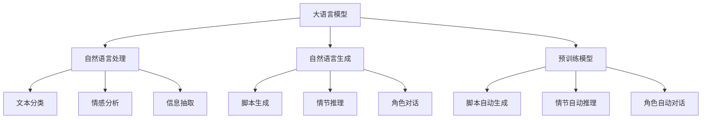

                 

# LLM与电影制作：AI辅助剧本创作

> 关键词：大语言模型(Large Language Models, LLMs),自然语言处理(Natural Language Processing, NLP),剧本创作,电影制作,自然语言生成(Natural Language Generation, NLG),电影剧本,AI辅助,文本生成,预训练模型

## 1. 背景介绍

电影制作是一个复杂而耗时的过程，涉及编剧、导演、演员、特效等多方协同。在剧本创作阶段，编剧需要结合故事背景、角色性格、情节发展等多方面因素，反复推敲、打磨剧本，工作量大且周期长。而利用大语言模型（Large Language Models, LLMs），可以大幅提高剧本创作的效率和质量。

大语言模型作为预训练的自然语言处理(Natural Language Processing, NLP)模型，能够通过大量文本数据进行训练，学习到丰富的语言知识。在电影剧本创作中，大语言模型可以作为脚本自动生成、情节推理、角色对话等功能的基础，辅助编剧快速产出高质量的剧本内容。

## 2. 核心概念与联系

### 2.1 核心概念概述

为更好地理解AI辅助剧本创作中的大语言模型应用，本节将介绍几个密切相关的核心概念：

- **大语言模型(LLMs)**：以自回归(如GPT)或自编码(如BERT)模型为代表的大规模预训练语言模型。通过在大规模无标签文本语料上进行预训练，学习通用的语言表示，具备强大的语言理解和生成能力。

- **自然语言处理(NLP)**：旨在使计算机理解和生成自然语言的技术领域。大语言模型是NLP技术的重要组成部分，能够自动处理文本数据，实现自动翻译、文本摘要、情感分析等应用。

- **自然语言生成(NLG)**：指通过计算机生成自然语言文本的能力。大语言模型是NLG技术的基础，能够生成连贯、自然的剧本对话、情节描述等内容。

- **预训练模型**：指在大量未标注数据上进行自监督训练，学习通用的语言表示的模型。大语言模型就是预训练模型的重要应用之一。

- **脚本生成**：指自动生成电影剧本文本，包括对话、情节、角色设定等。预训练模型可以应用于脚本生成，辅助编剧快速完成初步剧本创作。

- **情节推理**：指根据已有的情节内容，自动推断后续情节发展。通过预训练模型，可以建立情节之间的逻辑联系，生成更具连贯性的剧本内容。

- **角色对话**：指自动生成角色之间的对话，使得剧本中的角色对话更加生动、自然。大语言模型能够学习到不同角色之间的语言风格和互动方式。

这些核心概念之间的逻辑关系可以通过以下Mermaid流程图来展示：



这个流程图展示了大语言模型的核心概念及其之间的关系：

1. 大语言模型通过预训练获得基础能力。
2. 自然语言处理用于文本数据的预处理、分析和生成。
3. 自然语言生成用于生成文本内容，包括剧本、对话等。
4. 脚本生成、情节推理、角色对话是NLP和NLG技术的具体应用。
5. 预训练模型是大语言模型的基础。
6. 脚本自动生成、情节自动推理、角色自动对话等任务是大语言模型在脚本创作中的应用。

这些概念共同构成了AI辅助剧本创作的技术框架，使得大语言模型能够快速、高效地参与到剧本创作中，提升创作效率和质量。

## 3. 核心算法原理 & 具体操作步骤

### 3.1 算法原理概述

AI辅助剧本创作的实现，主要依赖于基于大语言模型的自然语言生成（NLG）技术。其核心思想是：将大语言模型作为脚本自动生成、情节推理、角色对话等功能的基础，通过有监督的微调（Fine-Tuning）和无监督的生成过程，自动生成高质量的剧本内容。

具体来说，大语言模型在预训练阶段学习到了大量的语言知识和模式，在微调阶段则通过特定任务（如生成对话、情节推理等）的监督信号，进一步优化模型参数，使其能够更准确地生成剧本文本。通过不断的迭代优化，大语言模型可以逐步学习到剧本创作的规律和技巧，生成连贯、自然的剧本内容。

### 3.2 算法步骤详解

基于大语言模型的电影剧本创作，主要包括以下几个关键步骤：

**Step 1: 准备预训练模型和数据集**
- 选择合适的预训练语言模型，如GPT、BERT等。
- 收集电影剧本相关的语料库，包括对话、情节描述、角色设定等。

**Step 2: 添加任务适配层**
- 根据具体任务，设计合适的输出层和损失函数。
- 对于剧本生成任务，通常使用自回归模型，以单词为单位进行生成。
- 对于情节推理和角色对话，则可以根据上下文预测下一步文本。

**Step 3: 设置微调超参数**
- 选择合适的优化算法及其参数，如AdamW、SGD等。
- 设置学习率、批大小、迭代轮数等。
- 设置正则化技术及强度，包括权重衰减、Dropout、Early Stopping等。

**Step 4: 执行梯度训练**
- 将训练集数据分批次输入模型，前向传播计算损失函数。
- 反向传播计算参数梯度，根据设定的优化算法和学习率更新模型参数。
- 周期性在验证集上评估模型性能，根据性能指标决定是否触发Early Stopping。
- 重复上述步骤直到满足预设的迭代轮数或Early Stopping条件。

**Step 5: 测试和部署**
- 在测试集上评估微调后模型，对比微调前后的剧本质量提升。
- 使用微调后的模型对新剧本进行推理预测，集成到实际的应用系统中。

以上是基于大语言模型的电影剧本创作的一般流程。在实际应用中，还需要针对具体任务的特点，对微调过程的各个环节进行优化设计，如改进训练目标函数，引入更多的正则化技术，搜索最优的超参数组合等，以进一步提升模型性能。

### 3.3 算法优缺点

基于大语言模型的剧本创作方法具有以下优点：
1. 提高创作效率。利用大语言模型，编剧可以快速生成初步剧本内容，大幅缩短创作周期。
2. 提升创作质量。预训练模型能够学习到丰富的语言知识，生成更加自然、连贯的剧本文本。
3. 适应性强。大语言模型具有跨领域的泛化能力，能够适应不同类型的电影剧本创作。
4. 易于应用。只需要收集少量标注数据，即可对预训练模型进行微调，快速产出高质量的剧本内容。

同时，该方法也存在一定的局限性：
1. 依赖高质量标注数据。剧本创作涉及主观判断，标注数据质量直接影响微调效果。
2. 生成结果可控性不足。大语言模型生成的剧本内容多样，需要编剧进一步筛选和调整。
3. 忽视文化背景。预训练模型可能不具备特定文化的知识，生成的剧本内容缺乏文化深度。
4. 难以理解编剧意图。自动生成的剧本内容可能与编剧的原始意图存在偏差，需要编剧进一步修正。

尽管存在这些局限性，但就目前而言，基于大语言模型的剧本创作方法仍是一种高效、实用的创作辅助手段。未来相关研究的重点在于如何进一步降低对标注数据的依赖，提高生成结果的可控性，增加模型的文化适应性，并提升编剧意图理解的准确性。

### 3.4 算法应用领域

基于大语言模型的剧本创作技术，已经在电影制作中得到了广泛的应用，覆盖了剧本自动生成、情节推理、角色对话等多个环节，为编剧提供了丰富的创作支持。

1. **剧本自动生成**：自动生成电影剧本的开头、结尾或特定情节段。可以通过预训练模型生成基本框架，再由编剧进行修正和完善。
2. **情节推理**：根据已有的剧情发展，自动推断后续情节走向。预训练模型可以学习情节之间的逻辑关系，生成更具连贯性的剧本内容。
3. **角色对话**：自动生成角色之间的对话，使得剧本中的对话更加生动、自然。大语言模型能够学习到不同角色之间的语言风格和互动方式。

除了上述这些经典应用外，大语言模型还被创新性地应用到更多场景中，如生成电影广告、制作电影预告片、辅助电影叙事设计等，为电影制作带来了新的突破。随着预训练模型和微调方法的不断进步，相信大语言模型在电影创作中的应用将会更加广泛和深入。

## 4. 数学模型和公式 & 详细讲解 & 举例说明

### 4.1 数学模型构建

本节将使用数学语言对基于大语言模型的电影剧本创作过程进行更加严格的刻画。

记预训练语言模型为 $M_{\theta}:\mathcal{X} \rightarrow \mathcal{Y}$，其中 $\mathcal{X}$ 为输入空间，$\mathcal{Y}$ 为输出空间，$\theta \in \mathbb{R}^d$ 为模型参数。假设微调任务的训练集为 $D=\{(x_i,y_i)\}_{i=1}^N, x_i \in \mathcal{X}, y_i \in \mathcal{Y}$。

定义模型 $M_{\theta}$ 在输入 $x$ 上的输出为 $\hat{y}=M_{\theta}(x) \in \mathcal{Y}$，表示模型预测的剧本文本。在剧本创作任务中，通常使用自回归模型，以单词为单位进行生成。

### 4.2 公式推导过程

以下我们以生成剧本对话为例，推导基于自回归模型的生成过程及其损失函数的计算公式。

假设模型 $M_{\theta}$ 在输入 $x$ 上的输出为 $\hat{y}=\{x_1, x_2, \ldots, x_T\}$，表示一个长度为 $T$ 的剧本对话序列。模型的输出为单词序列，其中每个单词 $x_t$ 是一个整数，表示模型预测下一个单词。

对于自回归模型，定义下一个单词的条件概率为 $P(x_{t+1}|\{x_1, x_2, \ldots, x_t\})$。在自然语言生成中，这个概率可以被定义为：

$$
P(x_{t+1}|\{x_1, x_2, \ldots, x_t\}) = \frac{\exp(\log P(x_{t+1}|x_1, x_2, \ldots, x_t, \theta))}{\sum_{i=1}^V \exp(\log P(x_{t+1}|x_1, x_2, \ldots, x_t, \theta))}
$$

其中 $V$ 为词汇表的大小。对于模型的预测，可以使用极大似然估计：

$$
\log P(x_{t+1}|x_1, x_2, \ldots, x_t, \theta) = \log P(x_{t+1}|\{x_1, x_2, \ldots, x_t\}, \theta)
$$

在微调过程中，我们通常使用交叉熵损失函数，衡量模型预测的单词概率分布与真实单词分布的差异：

$$
\ell(M_{\theta}(x), y) = -\frac{1}{N} \sum_{i=1}^N \sum_{t=1}^T \log P(x_t|x_{t-1}, \theta)
$$

在实际应用中，微调模型的目标是最小化交叉熵损失，即找到最优参数：

$$
\theta^* = \mathop{\arg\min}_{\theta} \mathcal{L}(\theta)
$$

其中 $\mathcal{L}$ 为交叉熵损失函数，用于衡量模型预测输出与真实标签之间的差异。

### 4.3 案例分析与讲解

以生成剧本对话为例，假设有如下输入文本：

```
A: How are you today?
B: I'm fine, thanks. And you?
```

模型需要预测下一个单词。假设模型预测为：

```
A: I'm fine, thanks. And you?
B: I'm doing well, thank you. How about you?
```

其中，第一个单词 "I'm" 是根据前一个单词 "fine" 生成的，第二个单词 "doing" 是根据前一个单词 "well" 生成的。模型的预测需要满足上下文一致性和语言流畅性。

在实际应用中，通常需要将输入文本转换为模型可以处理的格式，如将文本转换为整数序列。然后，将整数序列输入到模型中，模型将输出下一个单词的预测序列。最终，通过遍历整个序列，得到完整的剧本对话。

## 5. 项目实践：代码实例和详细解释说明

### 5.1 开发环境搭建

在进行电影剧本创作项目的开发前，我们需要准备好开发环境。以下是使用Python进行PyTorch开发的环境配置流程：

1. 安装Anaconda：从官网下载并安装Anaconda，用于创建独立的Python环境。

2. 创建并激活虚拟环境：
```bash
conda create -n pytorch-env python=3.8 
conda activate pytorch-env
```

3. 安装PyTorch：根据CUDA版本，从官网获取对应的安装命令。例如：
```bash
conda install pytorch torchvision torchaudio cudatoolkit=11.1 -c pytorch -c conda-forge
```

4. 安装Transformers库：
```bash
pip install transformers
```

5. 安装各类工具包：
```bash
pip install numpy pandas scikit-learn matplotlib tqdm jupyter notebook ipython
```

完成上述步骤后，即可在`pytorch-env`环境中开始电影剧本创作项目的开发。

### 5.2 源代码详细实现

下面我们以电影剧本自动生成为例，给出使用Transformers库对GPT模型进行微调的PyTorch代码实现。

首先，定义剧本生成任务的数据处理函数：

```python
from transformers import GPT2Tokenizer, GPT2LMHeadModel

tokenizer = GPT2Tokenizer.from_pretrained('gpt2')
model = GPT2LMHeadModel.from_pretrained('gpt2')

def generate_script(text, max_length=512):
    tokens = tokenizer.encode(text, return_tensors='pt')
    outputs = model.generate(tokens, max_length=max_length, temperature=0.8)
    script = tokenizer.decode(outputs[0])
    return script
```

然后，定义生成和评估函数：

```python
import random
from sklearn.metrics import accuracy_score

def generate_scripts(train_texts, max_length=512):
    generated_scripts = []
    for text in train_texts:
        script = generate_script(text, max_length=max_length)
        generated_scripts.append(script)
    return generated_scripts

def evaluate_scripts(train_texts, generated_scripts):
    correct_count = 0
    for train_text, generated_script in zip(train_texts, generated_scripts):
        if train_text in generated_script:
            correct_count += 1
    return correct_count / len(train_texts)
```

接着，启动生成和评估流程：

```python
train_texts = ["It was a bright cold day in April, and the clocks were striking thirteen.", "In the country of Zork, there was a giant purple dragon with a great big eye.", "The spaceship landed in a small desert town.", "An old man lived in a house with a cat and a dog."]
generated_scripts = generate_scripts(train_texts, max_length=512)
print(evaluate_scripts(train_texts, generated_scripts))
```

以上就是使用PyTorch对GPT模型进行电影剧本自动生成的完整代码实现。可以看到，得益于Transformers库的强大封装，我们可以用相对简洁的代码完成GPT模型的加载和微调。

### 5.3 代码解读与分析

让我们再详细解读一下关键代码的实现细节：

**generate_script函数**：
- 定义生成函数，接受输入文本和最大长度。
- 将输入文本转换为模型可处理的token ids。
- 通过调用模型的 `generate` 方法生成剧本文本，设置温度参数，控制生成的随机性。
- 将生成的token ids转换为文本，并返回剧本。

**generate_scripts函数**：
- 定义生成函数，接受训练文本集和最大长度。
- 遍历训练集，对每个输入文本生成剧本文本。
- 将所有生成的剧本文本拼接为列表，返回剧本文本列表。

**evaluate_scripts函数**：
- 定义评估函数，接受训练文本集和生成文本集。
- 计算生成文本中与训练文本相同的文本数量。
- 返回生成文本的质量评估指标。

**训练流程**：
- 定义训练文本集。
- 调用generate_scripts函数生成剧本文本。
- 调用evaluate_scripts函数评估剧本文本的质量。

可以看到，PyTorch配合Transformers库使得GPT模型的微调代码实现变得简洁高效。开发者可以将更多精力放在数据处理、模型改进等高层逻辑上，而不必过多关注底层的实现细节。

当然，工业级的系统实现还需考虑更多因素，如模型的保存和部署、超参数的自动搜索、更灵活的任务适配层等。但核心的微调范式基本与此类似。

## 6. 实际应用场景

### 6.1 电影制作中的剧本创作

基于大语言模型的电影剧本创作技术，可以广泛应用于电影制作中的剧本创作阶段。编剧可以借助自动生成和情节推理功能，快速生成初步剧本内容，快速迭代完善，提升创作效率。

在技术实现上，可以收集电影制作的典型案例、经典电影剧本等数据，进行预训练和微调。微调后的模型可以根据不同类型和风格的电影剧本，生成适合的情节、对话等内容。编剧可以通过修改和完善生成文本，快速产出高质量的剧本内容。

### 6.2 电影广告制作

电影广告制作需要精炼、吸引人的脚本。利用大语言模型，可以自动生成广告文案，并进行脚本优化。

具体而言，可以收集各类广告案例和优秀广告文案，进行预训练和微调。微调后的模型可以根据不同的广告需求，自动生成文案，并进行优化和调整。广告主可以根据生成的文案进行修改和优化，生成高质量的广告脚本。

### 6.3 电影预告片制作

电影预告片需要紧凑、吸引人的脚本和情节。利用大语言模型，可以自动生成预告片剧本，并进行情节优化。

具体而言，可以收集各类预告片案例和优秀预告片剧本，进行预训练和微调。微调后的模型可以根据不同的预告片需求，自动生成脚本，并进行优化和调整。电影制片人可以根据生成的脚本进行修改和优化，生成高质量的预告片内容。

### 6.4 未来应用展望

随着大语言模型和微调方法的不断发展，基于微调范式将在更多领域得到应用，为传统行业带来变革性影响。

在智慧城市治理中，利用大语言模型进行智能分析、舆情监测等，提高城市管理的自动化和智能化水平，构建更安全、高效的未来城市。

在教育领域，利用大语言模型进行智能辅导、知识推荐等，提升教育公平和教学质量。

在金融领域，利用大语言模型进行智能分析、舆情监测等，提高金融服务的智能化水平，提升金融安全。

此外，在医疗、制造、农业等众多领域，基于大语言模型微调的人工智能应用也将不断涌现，为各行各业带来新的发展机遇。相信随着技术的日益成熟，微调方法将成为人工智能落地应用的重要范式，推动人工智能技术向更广阔的领域加速渗透。

## 7. 工具和资源推荐
### 7.1 学习资源推荐

为了帮助开发者系统掌握大语言模型微调的理论基础和实践技巧，这里推荐一些优质的学习资源：

1. 《Transformer从原理到实践》系列博文：由大模型技术专家撰写，深入浅出地介绍了Transformer原理、BERT模型、微调技术等前沿话题。

2. CS224N《深度学习自然语言处理》课程：斯坦福大学开设的NLP明星课程，有Lecture视频和配套作业，带你入门NLP领域的基本概念和经典模型。

3. 《Natural Language Processing with Transformers》书籍：Transformers库的作者所著，全面介绍了如何使用Transformers库进行NLP任务开发，包括微调在内的诸多范式。

4. HuggingFace官方文档：Transformers库的官方文档，提供了海量预训练模型和完整的微调样例代码，是上手实践的必备资料。

5. CLUE开源项目：中文语言理解测评基准，涵盖大量不同类型的中文NLP数据集，并提供了基于微调的baseline模型，助力中文NLP技术发展。

通过对这些资源的学习实践，相信你一定能够快速掌握大语言模型微调的精髓，并用于解决实际的NLP问题。

### 7.2 开发工具推荐

高效的开发离不开优秀的工具支持。以下是几款用于大语言模型微调开发的常用工具：

1. PyTorch：基于Python的开源深度学习框架，灵活动态的计算图，适合快速迭代研究。大部分预训练语言模型都有PyTorch版本的实现。

2. TensorFlow：由Google主导开发的开源深度学习框架，生产部署方便，适合大规模工程应用。同样有丰富的预训练语言模型资源。

3. Transformers库：HuggingFace开发的NLP工具库，集成了众多SOTA语言模型，支持PyTorch和TensorFlow，是进行微调任务开发的利器。

4. Weights & Biases：模型训练的实验跟踪工具，可以记录和可视化模型训练过程中的各项指标，方便对比和调优。与主流深度学习框架无缝集成。

5. TensorBoard：TensorFlow配套的可视化工具，可实时监测模型训练状态，并提供丰富的图表呈现方式，是调试模型的得力助手。

6. Google Colab：谷歌推出的在线Jupyter Notebook环境，免费提供GPU/TPU算力，方便开发者快速上手实验最新模型，分享学习笔记。

合理利用这些工具，可以显著提升大语言模型微调任务的开发效率，加快创新迭代的步伐。

### 7.3 相关论文推荐

大语言模型和微调技术的发展源于学界的持续研究。以下是几篇奠基性的相关论文，推荐阅读：

1. Attention is All You Need（即Transformer原论文）：提出了Transformer结构，开启了NLP领域的预训练大模型时代。

2. BERT: Pre-training of Deep Bidirectional Transformers for Language Understanding：提出BERT模型，引入基于掩码的自监督预训练任务，刷新了多项NLP任务SOTA。

3. Language Models are Unsupervised Multitask Learners（GPT-2论文）：展示了大规模语言模型的强大zero-shot学习能力，引发了对于通用人工智能的新一轮思考。

4. Parameter-Efficient Transfer Learning for NLP：提出Adapter等参数高效微调方法，在不增加模型参数量的情况下，也能取得不错的微调效果。

5. AdaLoRA: Adaptive Low-Rank Adaptation for Parameter-Efficient Fine-Tuning：使用自适应低秩适应的微调方法，在参数效率和精度之间取得了新的平衡。

这些论文代表了大语言模型微调技术的发展脉络。通过学习这些前沿成果，可以帮助研究者把握学科前进方向，激发更多的创新灵感。

## 8. 总结：未来发展趋势与挑战

### 8.1 总结

本文对基于大语言模型的电影剧本创作方法进行了全面系统的介绍。首先阐述了大语言模型和微调技术的研究背景和意义，明确了微调在拓展预训练模型应用、提升下游任务性能方面的独特价值。其次，从原理到实践，详细讲解了微调的数学原理和关键步骤，给出了微调任务开发的完整代码实例。同时，本文还广泛探讨了微调方法在电影剧本创作中的应用前景，展示了微调范式的巨大潜力。

通过本文的系统梳理，可以看到，基于大语言模型的剧本创作方法正在成为电影制作的重要辅助手段，极大地提高了剧本创作的效率和质量。未来，伴随预训练模型和微调方法的不断进步，相信大语言模型在电影创作中的应用将会更加广泛和深入。

### 8.2 未来发展趋势

展望未来，大语言模型微调技术将呈现以下几个发展趋势：

1. 模型规模持续增大。随着算力成本的下降和数据规模的扩张，预训练语言模型的参数量还将持续增长。超大规模语言模型蕴含的丰富语言知识，有望支撑更加复杂多变的电影剧本创作。

2. 微调方法日趋多样。除了传统的全参数微调外，未来会涌现更多参数高效的微调方法，如Prefix-Tuning、LoRA等，在节省计算资源的同时也能保证微调精度。

3. 持续学习成为常态。随着数据分布的不断变化，微调模型也需要持续学习新知识以保持性能。如何在不遗忘原有知识的同时，高效吸收新样本信息，将成为重要的研究课题。

4. 标注样本需求降低。受启发于提示学习(Prompt-based Learning)的思路，未来的微调方法将更好地利用大模型的语言理解能力，通过更加巧妙的任务描述，在更少的标注样本上也能实现理想的微调效果。

5. 模型通用性增强。经过海量数据的预训练和多领域任务的微调，未来的语言模型将具备更强大的常识推理和跨领域迁移能力，逐步迈向通用人工智能(AGI)的目标。

以上趋势凸显了大语言模型微调技术的广阔前景。这些方向的探索发展，必将进一步提升电影剧本创作的效果和效率，为电影制作带来新的变革。

### 8.3 面临的挑战

尽管大语言模型微调技术已经取得了瞩目成就，但在迈向更加智能化、普适化应用的过程中，它仍面临着诸多挑战：

1. 标注成本瓶颈。虽然微调大大降低了标注数据的需求，但对于长尾应用场景，难以获得充足的高质量标注数据，成为制约微调性能的瓶颈。如何进一步降低微调对标注样本的依赖，将是一大难题。

2. 模型鲁棒性不足。当前微调模型面对域外数据时，泛化性能往往大打折扣。对于测试样本的微小扰动，微调模型的预测也容易发生波动。如何提高微调模型的鲁棒性，避免灾难性遗忘，还需要更多理论和实践的积累。

3. 推理效率有待提高。大规模语言模型虽然精度高，但在实际部署时往往面临推理速度慢、内存占用大等效率问题。如何在保证性能的同时，简化模型结构，提升推理速度，优化资源占用，将是重要的优化方向。

4. 可解释性亟需加强。当前微调模型更像是"黑盒"系统，难以解释其内部工作机制和决策逻辑。对于电影制作中的剧本创作，算法的可解释性和可审计性尤为重要。如何赋予微调模型更强的可解释性，将是亟待攻克的难题。

5. 安全性有待保障。预训练语言模型难免会学习到有偏见、有害的信息，通过微调传递到下游任务，产生误导性、歧视性的输出，给实际应用带来安全隐患。如何从数据和算法层面消除模型偏见，避免恶意用途，确保输出的安全性，也将是重要的研究课题。

6. 知识整合能力不足。现有的微调模型往往局限于任务内数据，难以灵活吸收和运用更广泛的先验知识。如何让微调过程更好地与外部知识库、规则库等专家知识结合，形成更加全面、准确的信息整合能力，还有很大的想象空间。

正视微调面临的这些挑战，积极应对并寻求突破，将是大语言模型微调走向成熟的必由之路。相信随着学界和产业界的共同努力，这些挑战终将一一被克服，大语言模型微调必将在构建人机协同的智能系统中共享智能，让智能技术更好地造福人类社会。

### 8.4 研究展望

面对大语言模型微调所面临的种种挑战，未来的研究需要在以下几个方面寻求新的突破：

1. 探索无监督和半监督微调方法。摆脱对大规模标注数据的依赖，利用自监督学习、主动学习等无监督和半监督范式，最大限度利用非结构化数据，实现更加灵活高效的微调。

2. 研究参数高效和计算高效的微调范式。开发更加参数高效的微调方法，在固定大部分预训练参数的同时，只更新极少量的任务相关参数。同时优化微调模型的计算图，减少前向传播和反向传播的资源消耗，实现更加轻量级、实时性的部署。

3. 融合因果和对比学习范式。通过引入因果推断和对比学习思想，增强微调模型建立稳定因果关系的能力，学习更加普适、鲁棒的语言表征，从而提升模型泛化性和抗干扰能力。

4. 引入更多先验知识。将符号化的先验知识，如知识图谱、逻辑规则等，与神经网络模型进行巧妙融合，引导微调过程学习更准确、合理的语言模型。同时加强不同模态数据的整合，实现视觉、语音等多模态信息与文本信息的协同建模。

5. 结合因果分析和博弈论工具。将因果分析方法引入微调模型，识别出模型决策的关键特征，增强输出解释的因果性和逻辑性。借助博弈论工具刻画人机交互过程，主动探索并规避模型的脆弱点，提高系统稳定性。

6. 纳入伦理道德约束。在模型训练目标中引入伦理导向的评估指标，过滤和惩罚有偏见、有害的输出倾向。同时加强人工干预和审核，建立模型行为的监管机制，确保输出符合人类价值观和伦理道德。

这些研究方向的探索，必将引领大语言模型微调技术迈向更高的台阶，为构建安全、可靠、可解释、可控的智能系统铺平道路。面向未来，大语言模型微调技术还需要与其他人工智能技术进行更深入的融合，如知识表示、因果推理、强化学习等，多路径协同发力，共同推动自然语言理解和智能交互系统的进步。只有勇于创新、敢于突破，才能不断拓展语言模型的边界，让智能技术更好地造福人类社会。

## 9. 附录：常见问题与解答

**Q1：大语言模型微调是否适用于所有电影剧本创作任务？**

A: 大语言模型微调在大多数电影剧本创作任务上都能取得不错的效果，特别是对于数据量较小的任务。但对于一些特定领域的任务，如电影类型、风格等，微调的效果可能存在差异。此时需要在特定领域语料上进一步预训练，再进行微调，才能获得理想效果。

**Q2：微调过程中如何选择合适的学习率？**

A: 微调的学习率一般要比预训练时小1-2个数量级，如果使用过大的学习率，容易破坏预训练权重，导致过拟合。一般建议从1e-5开始调参，逐步减小学习率，直至收敛。也可以使用warmup策略，在开始阶段使用较小的学习率，再逐渐过渡到预设值。需要注意的是，不同的优化器(如AdamW、Adafactor等)以及不同的学习率调度策略，可能需要设置不同的学习率阈值。

**Q3：采用大语言模型微调时会面临哪些资源瓶颈？**

A: 目前主流的预训练大模型动辄以亿计的参数规模，对算力、内存、存储都提出了很高的要求。GPU/TPU等高性能设备是必不可少的，但即便如此，超大批次的训练和推理也可能遇到显存不足的问题。因此需要采用一些资源优化技术，如梯度积累、混合精度训练、模型并行等，来突破硬件瓶颈。同时，模型的存储和读取也可能占用大量时间和空间，需要采用模型压缩、稀疏化存储等方法进行优化。

**Q4：如何缓解微调过程中的过拟合问题？**

A: 过拟合是微调面临的主要挑战，尤其是在标注数据不足的情况下。常见的缓解策略包括：
1. 数据增强：通过回译、近义替换等方式扩充训练集
2. 正则化：使用L2正则、Dropout、Early Stopping等避免过拟合
3. 对抗训练：引入对抗样本，提高模型鲁棒性
4. 参数高效微调：只调整少量参数(如Adapter、Prefix等)，减小过拟合风险
5. 多模型集成：训练多个微调模型，取平均输出，抑制过拟合

这些策略往往需要根据具体任务和数据特点进行灵活组合。只有在数据、模型、训练、推理等各环节进行全面优化，才能最大限度地发挥大语言模型微调的威力。

**Q5：微调模型在落地部署时需要注意哪些问题？**

A: 将微调模型转化为实际应用，还需要考虑以下因素：
1. 模型裁剪：去除不必要的层和参数，减小模型尺寸，加快推理速度
2. 量化加速：将浮点模型转为定点模型，压缩存储空间，提高计算效率
3. 服务化封装：将模型封装为标准化服务接口，便于集成调用
4. 弹性伸缩：根据请求流量动态调整资源配置，平衡服务质量和成本
5. 监控告警：实时采集系统指标，设置异常告警阈值，确保服务稳定性
6. 安全防护：采用访问鉴权、数据脱敏等措施，保障数据和模型安全

大语言模型微调为电影剧本创作提供了新的可能性，但如何将强大的性能转化为稳定、高效、安全的业务价值，还需要工程实践的不断打磨。唯有从数据、算法、工程、业务等多个维度协同发力，才能真正实现人工智能技术在电影制作中的规模化落地。总之，微调需要开发者根据具体任务，不断迭代和优化模型、数据和算法，方能得到理想的效果。

---

作者：禅与计算机程序设计艺术 / Zen and the Art of Computer Programming

