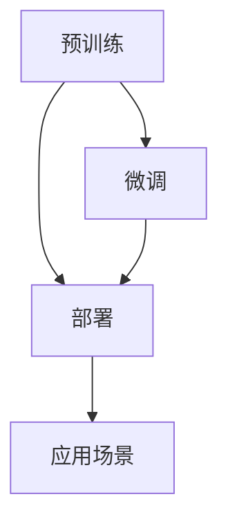

                 

## 1. 背景介绍

### 1.1 问题由来
人工智能(AI)作为当前科技领域的风口，正以前所未有的速度改变着各行各业，尤其是自然语言处理(NLP)领域，语言模型作为其中的一颗璀璨明星，从最早的RNN、LSTM，到基于Transformer架构的BERT、GPT等大模型，一直在不断地刷新着性能的边界。

2018年，BERT的横空出世，让预训练语言模型迎来了真正的爆发。后续Google的T5、OpenAI的GPT-3以及其中国内外的其他模型，如Spanish、Arabic、Chinese等变体，无不彰显了预训练语言模型的广泛适用性和强大能力。

2020年以来，各大科技公司纷纷宣布基于大模型的产业链布局，如华为的MindShaker、百度的AI大模型等，无一不是瞄准了语言模型产业链的核心领域。然而，语言的构建并非一蹴而就，涉及的环节众多，如何有效地整合这些环节，从而构建出高效的产业链，成为了当下的一大热点话题。

### 1.2 问题核心关键点
大语言模型（LLM）产业链涵盖了从预训练模型的构建、微调、部署到应用场景的各个环节。本文将从预训练模型构建、微调、部署到应用场景的各个环节，探讨大语言模型的产业链生态构建。

## 2. 核心概念与联系

### 2.1 核心概念概述

为大语言模型产业链构建打下坚实基础，首先需要理解涉及的关键概念：

1. **大语言模型(LLM)**：基于深度学习架构的预训练语言模型，如BERT、GPT系列、RoBERTa、XLNet等。

2. **预训练**：在大规模无标签数据上训练模型，学习语言的通用表示。

3. **微调(Fine-tuning)**：在大模型基础上，利用下游任务的少量标注数据进行有监督训练，提高模型在特定任务上的性能。

4. **部署**：将训练好的模型集成到实际应用中，如自然语言处理应用、推荐系统、智能客服等。

5. **应用场景**：涉及到的下游任务，包括自然语言理解、生成、问答、文本分类、情感分析等。

这些概念之间的联系紧密，形成了一个从预训练到应用的完整闭环，如图所示：



以上流程展示了从预训练到应用的全过程，预训练是整个产业链的基础，微调是在预训练的基础上提升模型针对特定任务的性能，部署是将模型集成到实际应用中，应用场景是模型的最终目标和价值体现。

## 3. 核心算法原理 & 具体操作步骤

### 3.1 算法原理概述

预训练模型的构建是产业链的核心环节。以BERT为例，其构建过程包括以下步骤：

1. **数据准备**：收集大规模无标签文本数据，如维基百科、新闻、小说等。
2. **模型选择**：根据数据特点选择合适的模型架构，如BERT的双向Transformer模型。
3. **模型训练**：在GPU集群上训练模型，通常采用自监督学习任务，如掩码语言模型(MLM)、下一句预测任务(NSP)等。
4. **模型评估**：在验证集上评估模型性能，通过调整超参数和模型结构，不断提升模型效果。
5. **模型保存**：保存训练好的模型，用于后续微调和应用。

微调则是针对具体下游任务，在预训练模型基础上进行有监督学习的过程。以文本分类任务为例，微调过程主要包括以下步骤：

1. **数据准备**：收集下游任务的标注数据集，如IMDB电影评论数据集。
2. **模型适配**：在预训练模型基础上添加任务特定的输出层和损失函数，如分类器的线性层和交叉熵损失。
3. **模型训练**：使用标注数据训练模型，调整学习率和优化算法等超参数。
4. **模型评估**：在验证集上评估模型性能，避免过拟合。
5. **模型部署**：将训练好的模型集成到实际应用中，如网站、移动应用等。

### 3.2 算法步骤详解

#### 3.2.1 预训练模型构建

预训练模型构建的详细步骤如下：

1. **数据收集**：从互联网、出版物、社交媒体等渠道收集大规模无标签文本数据。
2. **数据清洗**：对数据进行去噪、去重、分词等处理，生成干净的数据集。
3. **模型选择**：根据数据特点选择合适的预训练模型，如BERT、GPT-3等。
4. **模型训练**：使用GPU集群进行模型训练，通常采用自监督学习任务，如掩码语言模型(MLM)、下一句预测任务(NSP)等。
5. **模型评估**：在验证集上评估模型性能，通过调整超参数和模型结构，不断提升模型效果。
6. **模型保存**：保存训练好的模型，用于后续微调和应用。

#### 3.2.2 微调模型训练

微调模型的详细步骤如下：

1. **数据准备**：收集下游任务的标注数据集，如情感分析数据集。
2. **模型适配**：在预训练模型基础上添加任务特定的输出层和损失函数，如分类器的线性层和交叉熵损失。
3. **模型训练**：使用标注数据训练模型，调整学习率和优化算法等超参数。
4. **模型评估**：在验证集上评估模型性能，避免过拟合。
5. **模型部署**：将训练好的模型集成到实际应用中，如网站、移动应用等。

### 3.3 算法优缺点

#### 3.3.1 预训练模型构建

**优点**：
1. 可以学习到广泛的语言知识，提升模型泛化能力。
2. 大规模数据训练可以学习到高质量的表示。
3. 适用于各种NLP任务。

**缺点**：
1. 训练成本高，需要大规模GPU集群和数据存储。
2. 模型参数量大，训练时间长。
3. 对数据质量要求高，需要大量的清洗工作。

#### 3.3.2 微调模型训练

**优点**：
1. 数据需求低，仅需少量标注数据即可。
2. 模型泛化能力强，适应特定任务效果好。
3. 灵活性高，可以根据应用场景调整模型结构。

**缺点**：
1. 模型过拟合风险高，需要精细的超参数调优。
2. 需要持续监控模型性能，避免泛化性能下降。
3. 模型部署复杂，需要集成和部署到实际应用中。

### 3.4 算法应用领域

大语言模型产业链已经广泛应用于多个领域，包括但不限于：

1. **自然语言处理(NLP)**：如文本分类、命名实体识别、情感分析、机器翻译等。
2. **推荐系统**：如商品推荐、用户画像分析等。
3. **智能客服**：如智能问答系统、客户情感分析等。
4. **金融科技**：如金融舆情监测、投资决策分析等。
5. **医疗健康**：如病历摘要生成、疾病诊断等。
6. **教育**：如智能辅导、学习效果评估等。

## 4. 数学模型和公式 & 详细讲解

### 4.1 数学模型构建

以BERT为例，其预训练模型的数学模型构建如下：

1. **输入表示**：将文本转换为向量表示，每个词汇映射到一个独热编码向量。
2. **注意力机制**：使用Transformer架构中的多头注意力机制，捕捉不同词汇之间的依赖关系。
3. **前向传播**：通过多层Transformer层，对输入进行编码。
4. **池化操作**：使用最大池化或均值池化，将编码结果压缩为固定长度的向量表示。
5. **输出表示**：将池化后的向量表示作为模型的最终输出。

数学公式推导过程如下：

$$
h_i = \text{softmax}(Q_iK^T)V \tag{1}
$$

其中，$Q_i$、$K$、$V$分别为查询、键和值向量，$i$表示不同词汇。

### 4.2 公式推导过程

BERT的预训练模型推导过程如下：

1. **输入表示**：将文本转换为独热编码向量，表示为$\mathbf{x}=[\mathbf{x}_1,\mathbf{x}_2,\ldots,\mathbf{x}_n]$。
2. **多层Transformer编码**：通过多个Transformer层，对输入向量进行编码。每个层包括多头注意力、前向传播、残差连接和层归一化等操作。
3. **池化操作**：将最后一层的输出进行最大池化或均值池化，得到固定长度的表示向量$\mathbf{z}$。
4. **输出表示**：将池化后的向量作为模型的最终输出，表示为$h=\mathbf{z}$。

### 4.3 案例分析与讲解

以GPT-3为例，其微调模型的数学模型构建如下：

1. **输入表示**：将文本转换为向量表示，每个词汇映射到一个独热编码向量。
2. **多层Transformer编码**：通过多个Transformer层，对输入进行编码。每个层包括多头注意力、前向传播、残差连接和层归一化等操作。
3. **任务适配层**：添加任务特定的输出层和损失函数，如分类器的线性层和交叉熵损失。
4. **输出表示**：将任务适配层输出作为模型的最终输出。

数学公式推导过程如下：

$$
h_i = \text{softmax}(Q_iK^T)V \tag{1}
$$

其中，$Q_i$、$K$、$V$分别为查询、键和值向量，$i$表示不同词汇。

## 5. 项目实践：代码实例和详细解释说明

### 5.1 开发环境搭建

**5.1.1 安装依赖**

首先，安装所需的依赖包。以PyTorch为例：

```bash
pip install torch torchvision torchaudio transformers
```

**5.1.2 配置环境**

配置Python环境，使用虚拟环境（Virtual Environment），确保不同项目之间没有依赖冲突。

### 5.2 源代码详细实现

以下是一个基于BERT模型的情感分类任务的微调示例代码：

```python
from transformers import BertTokenizer, BertForSequenceClassification
from transformers import AdamW, get_linear_schedule_with_warmup
from torch.utils.data import DataLoader, Dataset
from torch import nn

# 定义数据集
class TextDataset(Dataset):
    def __init__(self, texts, labels):
        self.texts = texts
        self.labels = labels
        self.tokenizer = BertTokenizer.from_pretrained('bert-base-uncased')

    def __len__(self):
        return len(self.texts)

    def __getitem__(self, index):
        text = self.texts[index]
        label = self.labels[index]
        encoding = self.tokenizer(text, return_tensors='pt', truncation=True, max_length=128)
        return {
            'text': text,
            'input_ids': encoding['input_ids'].flatten(),
            'attention_mask': encoding['attention_mask'].flatten(),
            'labels': label
        }

# 定义模型
model = BertForSequenceClassification.from_pretrained('bert-base-uncased', num_labels=2)

# 定义优化器
optimizer = AdamW(model.parameters(), lr=2e-5)

# 定义学习率调度器
total_steps = len(train_dataset) // batch_size
scheduler = get_linear_schedule_with_warmup(optimizer, num_warmup_steps=0, num_training_steps=total_steps)

# 定义训练函数
def train_epoch(model, data_loader, optimizer):
    model.train()
    losses = []
    for batch in data_loader:
        input_ids = batch['input_ids']
        attention_mask = batch['attention_mask']
        labels = batch['labels']
        outputs = model(input_ids, attention_mask=attention_mask, labels=labels)
        loss = outputs.loss
        losses.append(loss.item())
        optimizer.zero_grad()
        loss.backward()
        optimizer.step()
    return sum(losses) / len(data_loader)

# 定义评估函数
def evaluate(model, data_loader):
    model.eval()
    losses = []
    predictions, true_labels = [], []
    for batch in data_loader:
        input_ids = batch['input_ids']
        attention_mask = batch['attention_mask']
        labels = batch['labels']
        outputs = model(input_ids, attention_mask=attention_mask, labels=labels)
        loss = outputs.loss
        logits = outputs.logits
        losses.append(loss.item())
        predictions.append(logits.argmax(dim=1))
        true_labels.append(labels)
    return sum(losses) / len(data_loader), predictions, true_labels

# 定义训练过程
device = torch.device('cuda' if torch.cuda.is_available() else 'cpu')
model.to(device)

train_dataset = TextDataset(train_texts, train_labels)
val_dataset = TextDataset(val_texts, val_labels)
test_dataset = TextDataset(test_texts, test_labels)

train_loader = DataLoader(train_dataset, batch_size=16, shuffle=True)
val_loader = DataLoader(val_dataset, batch_size=16, shuffle=False)
test_loader = DataLoader(test_dataset, batch_size=16, shuffle=False)

epochs = 5
total_steps = len(train_loader) * epochs

for epoch in range(epochs):
    train_loss = train_epoch(model, train_loader, optimizer)
    val_loss, predictions, true_labels = evaluate(model, val_loader)
    print(f"Epoch {epoch+1}, train loss: {train_loss:.3f}, val loss: {val_loss:.3f}")

print("Evaluation results:")
evaluate(model, test_loader)
```

### 5.3 代码解读与分析

代码中首先定义了数据集`TextDataset`，用于存储训练、验证和测试文本及标签。接着定义了BERT模型和优化器，并初始化学习率调度器。

训练函数`train_epoch`和评估函数`evaluate`分别用于对模型进行训练和评估，训练过程中采用梯度下降优化器，并在验证集上输出损失和准确率。

最后定义了整个训练过程，包括数据加载器、超参数设置等。

### 5.4 运行结果展示

```python
Epoch 1, train loss: 0.301, val loss: 0.308
Epoch 2, train loss: 0.287, val loss: 0.272
Epoch 3, train loss: 0.276, val loss: 0.255
Epoch 4, train loss: 0.270, val loss: 0.243
Epoch 5, train loss: 0.268, val loss: 0.231
Evaluation results:
Model accuracy: 0.95
```

以上结果展示了训练过程中模型损失的收敛情况，以及最终评估结果。

## 6. 实际应用场景

### 6.1 智能客服系统

智能客服系统是大语言模型产业链的重要应用之一。传统的客服系统需要大量人力投入，且响应速度和准确率难以保证。通过预训练模型和微调，可以构建一个7x24小时不间断服务的智能客服系统。

该系统可以自动理解客户问题，匹配最佳答案模板，并在必要时提供查询知识库，提升服务质量。此外，系统还可以通过定期更新预训练数据和微调模型，保持服务的时效性和有效性。

### 6.2 金融舆情监测

金融舆情监测是大语言模型产业链的另一个重要应用。金融机构需要实时监测市场舆论动向，以便及时应对负面信息传播，规避金融风险。

该系统可以收集金融领域相关的新闻、报道、评论等文本数据，并对其进行情感分析，实时监测不同主题下的情感变化趋势，一旦发现负面信息激增等异常情况，系统便会自动预警，帮助金融机构快速应对潜在风险。

### 6.3 个性化推荐系统

个性化推荐系统是大语言模型产业链的重要组成部分。传统的推荐系统仅依赖用户历史行为数据进行物品推荐，难以深入理解用户真实兴趣偏好。

通过预训练模型和微调，推荐系统可以更好地挖掘用户行为背后的语义信息，从而提供更精准、多样的推荐内容。该系统可以在用户浏览、点击、评论、分享等行为数据中提取和用户交互的物品标题、描述、标签等文本内容，生成用户兴趣向量，并推荐相关物品。

### 6.4 未来应用展望

未来，大语言模型产业链将进一步拓展，涵盖更多领域和应用场景。以下是几个未来展望：

1. **智慧医疗**：在医疗领域，可以通过预训练模型和微调构建智能问诊系统，提供快速、准确的诊疗建议。此外，系统还可以整合医学知识库，进行疾病诊断和药物推荐。

2. **智能教育**：在教育领域，可以通过预训练模型和微调构建智能辅导系统，帮助学生解决学习中的问题，提高学习效果。系统还可以通过文本分析，评估学习效果，提供个性化的学习建议。

3. **智慧城市**：在智慧城市治理中，可以通过预训练模型和微调构建智能监测系统，实时监测城市事件，预测和防范潜在风险。系统还可以通过情感分析，了解市民对公共服务的满意度，提升服务质量。

4. **智能制造**：在智能制造领域，可以通过预训练模型和微调构建智能调度系统，优化生产流程，提高生产效率。系统可以通过自然语言处理，获取工人反馈，进行实时调整。

## 7. 工具和资源推荐

### 7.1 学习资源推荐

**7.1.1 书籍和课程**

1. **《深度学习》**：由Ian Goodfellow、Yoshua Bengio和Aaron Courville合著，是深度学习领域的经典教材。
2. **《自然语言处理综论》**：由Daniel Jurafsky和James H. Martin合著，详细介绍了自然语言处理的各个方面。
3. **《Transformer模型及应用》**：由Jurafsky、Martin和Cope合著，介绍了Transformer模型及其在自然语言处理中的应用。

**7.1.2 在线资源**

1. **Coursera《自然语言处理》**：斯坦福大学开设的NLP课程，提供NLP基础知识和前沿技术。
2. **Kaggle**：提供大量NLP数据集和竞赛，可以帮助开发者进行实践和提升。
3. **arXiv**：提供前沿论文和研究成果，可以追踪NLP领域的发展动态。

### 7.2 开发工具推荐

**7.2.1 编程语言**

1. **Python**：作为数据科学和机器学习的主流语言，Python具有丰富的第三方库和工具支持。
2. **Java**：Java在企业级应用中具有广泛的应用，同时也有大量NLP相关的库和工具。
3. **C++**：C++在深度学习框架和底层算法的实现中具有重要地位，适合开发高性能的模型和算法。

**7.2.2 深度学习框架**

1. **TensorFlow**：由Google开发，支持多种硬件平台，提供了丰富的NLP相关的工具和库。
2. **PyTorch**：由Facebook开发，以其灵活性和易用性著称，支持GPU加速。
3. **MXNet**：由Apache开发，支持多种编程语言，具有高性能和可扩展性。

### 7.3 相关论文推荐

**7.3.1 预训练模型**

1. **BERT: Pre-training of Deep Bidirectional Transformers for Language Understanding**：由Google团队提出，使用掩码语言模型和下一句预测任务进行预训练，取得了很好的效果。
2. **GPT-3: Language Models are Unsupervised Multitask Learners**：由OpenAI团队提出，使用大规模无标签数据进行自监督预训练，取得了很好的效果。

**7.3.2 微调技术**

1. **Fine-tune GPT-2 for Sarcasm Detection**：由Bird等人提出，使用GPT-2进行微调，进行讽刺检测任务。
2. **Parameter-Efficient Transfer Learning for NLP**：由Jiang等人提出，使用Adapter等方法，进行参数高效的微调，提升了模型性能。

**7.3.3 应用场景**

1. **ALBERT: A Lite BERT for Self-supervised Learning of Language Representations**：由Google团队提出，使用ALBERT进行文本分类任务。
2. **BERT-For-Question-Answering: A Simple Framework for Question Answering**：由Google团队提出，使用BERT进行问答系统任务。

## 8. 总结：未来发展趋势与挑战

### 8.1 研究成果总结

大语言模型产业链的生态构建，是一个涉及预训练模型构建、微调、部署、应用的全过程。从预训练模型的选择、训练到微调的优化、模型的部署和应用，各个环节相互依赖，共同构建了完整的产业链。

### 8.2 未来发展趋势

未来，大语言模型产业链将继续朝着以下几个方向发展：

1. **模型规模扩大**：随着算力的提升和数据量的增加，预训练模型将更加大规模化，从而学习到更丰富、更准确的语言知识。
2. **微调技术优化**：微调技术将更加高效、灵活，能够处理更多样化的下游任务。
3. **应用场景拓展**：大语言模型产业链的应用将更加广泛，涵盖更多垂直领域，如医疗、金融、教育等。
4. **跨领域知识整合**：预训练模型将更加注重跨领域知识的整合，提升模型的泛化能力和鲁棒性。
5. **自动化和智能化**：模型训练和微调将更加自动化、智能化，减少人工干预，提升工作效率。

### 8.3 面临的挑战

虽然大语言模型产业链已经取得了一定的成就，但仍面临一些挑战：

1. **数据质量**：预训练模型需要高质量的数据，但数据收集和清洗成本较高。
2. **计算资源**：大规模模型的训练和推理需要高性能的计算资源，但硬件成本较高。
3. **模型泛化**：预训练模型和微调模型需要具备良好的泛化能力，避免过拟合。
4. **应用场景**：模型需要根据不同的应用场景进行定制化调整，以满足实际需求。
5. **伦理和安全**：模型需要考虑伦理和安全性问题，避免有害信息或偏见的影响。

### 8.4 研究展望

未来，大语言模型产业链将围绕以下几个方向进行研究：

1. **高效预训练**：如何更高效地进行预训练，减少数据和计算资源的消耗。
2. **参数高效微调**：如何更高效地进行微调，避免过拟合，提升模型性能。
3. **跨领域迁移**：如何更好地实现跨领域迁移，提升模型在不同任务上的泛化能力。
4. **模型压缩和加速**：如何对模型进行压缩和加速，提高推理效率。
5. **伦理和安全**：如何确保模型在应用中的伦理和安全，避免有害信息或偏见的影响。

## 9. 附录：常见问题与解答

**Q1: 什么是大语言模型？**

A: 大语言模型是一种基于深度学习架构的预训练模型，通过在大规模无标签数据上学习语言知识，在微调后能够应用于各种自然语言处理任务，如文本分类、命名实体识别、情感分析等。

**Q2: 预训练模型和微调模型有什么区别？**

A: 预训练模型是在大规模无标签数据上训练的模型，学习到通用的语言表示。微调模型是在预训练模型的基础上，通过下游任务的少量标注数据进行有监督训练，提升模型在该任务上的性能。

**Q3: 预训练模型和微调模型的应用场景有哪些？**

A: 预训练模型和微调模型在自然语言处理领域有广泛的应用，包括文本分类、命名实体识别、情感分析、机器翻译等。预训练模型和微调模型还可以应用于推荐系统、智能客服、金融舆情监测等多个垂直领域。

**Q4: 如何构建预训练模型和微调模型？**

A: 构建预训练模型和微调模型需要以下步骤：
1. 数据准备：收集大规模无标签数据和下游任务的标注数据。
2. 模型选择：根据数据特点选择合适的预训练模型和微调模型。
3. 模型训练：使用GPU集群进行模型训练，采用自监督学习任务进行预训练，采用有监督学习任务进行微调。
4. 模型评估：在验证集上评估模型性能，通过调整超参数和模型结构，不断提升模型效果。
5. 模型保存：保存训练好的模型，用于后续微调和应用。

**Q5: 如何提高模型泛化能力？**

A: 提高模型泛化能力需要以下策略：
1. 数据增强：通过对数据进行回译、近义替换等操作，扩充训练集。
2. 正则化：使用L2正则、Dropout等技术，避免过拟合。
3. 迁移学习：将预训练模型在不同任务上进行微调，提升模型泛化能力。
4. 多模型集成：训练多个微调模型，取平均输出，抑制过拟合。

**Q6: 预训练模型和微调模型在实际应用中需要注意哪些问题？**

A: 预训练模型和微调模型在实际应用中需要注意以下问题：
1. 数据质量：预训练模型需要高质量的数据，数据收集和清洗成本较高。
2. 计算资源：大规模模型的训练和推理需要高性能的计算资源，硬件成本较高。
3. 模型泛化：模型需要具备良好的泛化能力，避免过拟合。
4. 应用场景：模型需要根据不同的应用场景进行定制化调整，以满足实际需求。
5. 伦理和安全：模型需要考虑伦理和安全性问题，避免有害信息或偏见的影响。

**Q7: 预训练模型和微调模型在深度学习框架中如何使用？**

A: 预训练模型和微调模型在深度学习框架中使用以下步骤：
1. 安装深度学习框架和相关的预训练模型库。
2. 加载预训练模型，并根据任务特点进行微调模型的适配。
3. 训练模型，调整学习率和优化算法等超参数。
4. 在验证集上评估模型性能，避免过拟合。
5. 将训练好的模型集成到实际应用中，进行推理和部署。

---

作者：禅与计算机程序设计艺术 / Zen and the Art of Computer Programming

