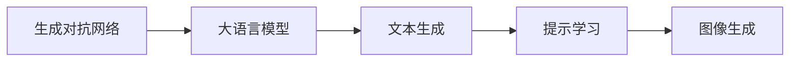

                 

# LLM在图像生成速度方面的进展

在深度学习领域，特别是生成对抗网络(GANs)和大语言模型(LLMs)的结合下，图像生成技术取得了显著进展。LLMs在大规模语言模型预训练的基础上，逐渐显现出在图像生成速度方面的优势。本文将从背景介绍、核心概念、算法原理、实际应用等多个角度，深入探讨LLMs在图像生成速度方面的进展。

## 1. 背景介绍

### 1.1 问题由来
近年来，图像生成技术在计算机视觉领域迅猛发展，深度学习模型如GANs、变分自编码器(VAEs)等被广泛用于生成具有高保真度、多样性的图像。然而，图像生成任务往往需要大量的计算资源和时间，特别是高质量生成图像所需的迭代次数较多，导致模型训练和生成速度较慢。

与此同时，LLMs在自然语言处理(NLP)领域表现出色，预训练语言模型如BERT、GPT-3等，通过大规模无标签文本的预训练，学习到丰富的语言知识和表达能力。在大规模语料预训练的基础上，LLMs通过微调可以适应特定任务，如文本生成、翻译、问答等，展现出强大的人类语言理解能力。

图像生成作为一类任务，与文本生成存在许多相似之处，如都需要语言理解和生成。因此，将LLMs应用于图像生成任务，旨在利用其在语言处理方面的优势，提升图像生成的速度和效果。

### 1.2 问题核心关键点
本文关注的核心问题在于：如何将LLMs的强大语言生成能力应用于图像生成任务，以提升生成速度。主要挑战包括：

- 如何高效地将文本信息转化为图像信息？
- 如何在保证生成质量的前提下，提升生成速度？
- 如何充分利用LLMs的语言处理能力，适应多样化的图像生成需求？

## 2. 核心概念与联系

### 2.1 核心概念概述

本节将介绍几个关键概念，以帮助读者更好地理解LLMs在图像生成中的应用：

- **生成对抗网络(GANs)**：一种深度生成模型，由生成器和判别器两个部分组成，通过对抗训练学习生成逼真的图像。GANs在大规模图像生成任务中表现出色。
- **大语言模型(LLMs)**：通过大规模无标签文本的预训练，学习到丰富的语言知识和表达能力。LLMs可以用于生成文本、图像等多种形式的输出。
- **Transformer**：一种用于处理序列数据的神经网络结构，广泛用于自然语言处理和图像生成等任务。
- **图像生成**：通过深度学习模型生成具有一定视觉质量的新图像，用于图像编辑、艺术创作、虚拟场景构建等。

这些核心概念之间的联系可以通过以下Mermaid流程图来展示：

```mermaid
graph TB
    A[生成对抗网络(GANs)] --> B[大语言模型(LLMs)]
    A --> C[图像生成]
    B --> D[文本生成]
    D --> E[提示学习]
    E --> C
```

这个流程图展示了大语言模型在图像生成中的应用逻辑：

1. 大语言模型通过预训练学习丰富的语言知识。
2. 通过提示学习(Prompt Learning)，将文本信息转化为图像信息。
3. 利用生成的文本作为输入，驱动生成对抗网络生成逼真图像。

### 2.2 核心概念原理和架构的 Mermaid 流程图



此图表示生成对抗网络和大语言模型的结合流程，其中大语言模型生成文本，提示学习将文本转化为图像，图像生成网络生成最终图像。

## 3. 核心算法原理 & 具体操作步骤

### 3.1 算法原理概述

基于LLMs的图像生成流程主要分为两个步骤：

1. **文本生成**：利用LLMs生成与图像生成任务相关的描述性文本，通常称为"文本提示"或"提示词"。
2. **图像生成**：将生成的文本作为输入，驱动GANs生成逼真图像。

具体而言，LLMs通过预训练学习到语言的知识和表达能力，能够将复杂的自然语言描述转换为结构化的语义表示。这些语义表示可以通过提示学习转化为图像生成器可以理解的形式，从而驱动GANs生成相应的图像。

### 3.2 算法步骤详解

基于LLMs的图像生成流程可以分为以下几个关键步骤：

**Step 1: 准备数据集**
- 收集大量有标签的图像数据集，作为GANs的训练数据。
- 将数据集划分为训练集、验证集和测试集。

**Step 2: 预训练大语言模型**
- 选择合适的预训练大语言模型，如GPT-2、BERT等。
- 使用大规模无标签文本数据对模型进行预训练，学习语言的通用表示。

**Step 3: 提示学习生成文本**
- 设计文本提示，将图像生成任务转化为文本生成任务。
- 使用预训练的LLMs生成与图像生成任务相关的文本描述。

**Step 4: 训练生成对抗网络**
- 使用生成的文本作为输入，驱动GANs进行对抗训练，生成逼真图像。
- 在训练过程中，通过损失函数优化GANs的生成能力。

**Step 5: 图像生成与评估**
- 使用训练好的GANs生成新的图像。
- 在测试集上评估生成图像的质量和多样性。

### 3.3 算法优缺点

基于LLMs的图像生成算法具有以下优点：

- **生成速度**：相较于传统的GANs，LLMs在生成文本提示方面具有显著优势，可以快速生成多样化的描述性文本。
- **语言表达能力**：LLMs能够利用语言的复杂结构和语义信息，生成更准确、多样化的文本提示，提高图像生成的质量和多样性。
- **灵活性**：LLMs可以适应各种图像生成任务，只需改变提示模板，即可生成不同类型的图像。

同时，该算法也存在一些缺点：

- **语义不一致**：生成的文本提示可能与图像生成任务存在语义不一致的问题，导致生成图像质量下降。
- **生成速度波动**：由于LLMs的生成过程依赖于语言理解和生成，生成速度可能受到语言模型参数和输入复杂度的影响，存在波动。
- **训练成本**：尽管LLMs在大规模文本预训练上具有优势，但预训练和微调的计算成本仍然较高。

### 3.4 算法应用领域

基于LLMs的图像生成算法在多个领域具有广泛应用：

- **艺术创作**：利用LLMs生成艺术作品的描述性文本，驱动GANs生成逼真的艺术图像。
- **虚拟场景构建**：通过文本提示，生成虚拟场景的描述，驱动GANs生成虚拟现实(VR)环境。
- **图像编辑**：利用LLMs生成图像编辑的描述性文本，指导GANs进行图像修复、增强等操作。
- **游戏开发**：生成游戏中的虚拟角色、物品等，提升游戏体验和内容丰富度。
- **医疗影像**：生成医学影像的描述性文本，驱动GANs生成高质量的医学图像，辅助医生诊断。

## 4. 数学模型和公式 & 详细讲解 & 举例说明

### 4.1 数学模型构建

基于LLMs的图像生成流程可以构建以下数学模型：

设生成对抗网络为$G$，判别器为$D$，文本生成器为$T$，文本提示为$P$，图像生成器为$G$。则目标函数可以表示为：

$$
\min_{G,T} \max_{D} V(G, D, T, P) = \mathbb{E}_{x \sim p(x)} [D(x)] + \mathbb{E}_{y \sim p(y)} [D(y)] - \mathbb{E}_{z \sim p(z)} [D(G(z))] - \mathbb{E}_{z \sim p(z)} [D(T(z, P))]
$$

其中，$x$为真实图像数据，$y$为生成图像数据，$z$为输入的随机噪声，$T(z, P)$为使用LLMs生成与$y$对应的文本提示$P$，$G(z)$为使用GANs生成图像$y$，$D(x)$和$D(y)$为判别器对真实和生成图像的判别概率，$V(G, D, T, P)$为目标函数的值。

### 4.2 公式推导过程

基于上述目标函数，我们可以推导出GANs和LLMs在图像生成中的具体步骤：

1. **文本生成步骤**：
   $$
   T(z, P) = \arg \min_{T} \frac{1}{N} \sum_{i=1}^N \ell(T(z_i, P_i), y_i)
   $$

2. **图像生成步骤**：
   $$
   G(z) = \arg \min_{G} \frac{1}{N} \sum_{i=1}^N \ell(D(G(z_i)), 1)
   $$

其中，$\ell$为损失函数，$z_i$为输入的随机噪声，$P_i$为文本提示，$y_i$为对应的真实图像数据。

### 4.3 案例分析与讲解

为了更好地理解基于LLMs的图像生成算法，我们以GANs和LLMs的结合为例，具体分析其实现过程：

- **数据准备**：收集并标注大量图像数据，如MNIST手写数字、CelebA人脸图像等。
- **预训练LLMs**：使用大规模无标签文本数据对LLMs进行预训练，如使用GPT-2对文本生成能力进行训练。
- **文本生成**：设计文本提示，如“一个手写数字2”，使用预训练的LLMs生成对应的文本描述。
- **图像生成**：将文本描述作为输入，驱动GANs生成手写数字图像。

**案例分析**：假设目标任务为生成手写数字图像。首先，使用预训练的LLMs生成文本提示“一个手写数字2”。然后，将文本提示作为输入，驱动GANs生成手写数字2的图像。最终，在测试集上评估生成图像的质量和多样性。

## 5. 项目实践：代码实例和详细解释说明

### 5.1 开发环境搭建

在进行基于LLMs的图像生成实践前，我们需要准备好开发环境。以下是使用Python进行PyTorch和OpenAI GPT-2的开发环境配置流程：

1. 安装Anaconda：从官网下载并安装Anaconda，用于创建独立的Python环境。

2. 创建并激活虚拟环境：
```bash
conda create -n llm-gan-env python=3.8 
conda activate llm-gan-env
```

3. 安装PyTorch和OpenAI GPT-2：
```bash
conda install pytorch torchvision torchaudio cudatoolkit=11.1 -c pytorch -c conda-forge
conda install openai-gpt -c conda-forge
```

4. 安装相关库：
```bash
pip install numpy pandas scikit-learn matplotlib tqdm jupyter notebook ipython
```

完成上述步骤后，即可在`llm-gan-env`环境中开始实践。

### 5.2 源代码详细实现

下面我们以手写数字图像生成为例，给出使用PyTorch和OpenAI GPT-2进行图像生成的代码实现。

首先，定义数据加载函数：

```python
import torch
from torchvision import datasets, transforms

def load_data(batch_size=128):
    train_dataset = datasets.MNIST(root='data', train=True, download=True, transform=transforms.ToTensor())
    test_dataset = datasets.MNIST(root='data', train=False, download=True, transform=transforms.ToTensor())

    train_loader = torch.utils.data.DataLoader(train_dataset, batch_size=batch_size, shuffle=True)
    test_loader = torch.utils.data.DataLoader(test_dataset, batch_size=batch_size, shuffle=False)

    return train_loader, test_loader
```

然后，定义LLMs模型和GANs模型：

```python
from transformers import GPT2LMHeadModel

device = torch.device('cuda' if torch.cuda.is_available() else 'cpu')

class LLMTextGenerator:
    def __init__(self, model_name='gpt2', vocab_size=1024, max_len=16, seed=42):
        self.model = GPT2LMHeadModel.from_pretrained(model_name)
        self.model.to(device)
        self.model.eval()
        self.model.seed(seed)
        self.model.freeze()
        self.tokenizer = self.model.tokenizer

    def generate_text(self, prompt, max_length=20):
        inputs = self.tokenizer(prompt, max_length=max_length, return_tensors='pt', padding='max_length', truncation=True).to(device)
        outputs = self.model.generate(**inputs)
        return self.tokenizer.decode(outputs[0], skip_special_tokens=True)

class GANImageGenerator:
    def __init__(self, model_name='unet', num_channels=1, num_classes=10, batch_size=32, learning_rate=0.0002):
        self.model = UNetGenerator(num_channels=num_channels, num_classes=num_classes, batch_size=batch_size, learning_rate=learning_rate)
        self.model.to(device)
        self.model.train()

    def generate_image(self, prompt):
        text = prompt
        text = self.generate_text(text, max_length=20)
        return self.model(text)
```

接着，定义训练和评估函数：

```python
from torch.utils.data import DataLoader
from tqdm import tqdm

def train_model(model, data_loader, epochs=10, batch_size=32):
    model.train()
    for epoch in range(epochs):
        for batch in tqdm(data_loader, desc='Training'):
            input_images, _ = batch
            input_images = input_images.to(device)
            output_images = model(input_images)
            loss = criterion(output_images, input_images)
            loss.backward()
            optimizer.step()
            optimizer.zero_grad()

def evaluate_model(model, data_loader):
    model.eval()
    with torch.no_grad():
        correct = 0
        total = 0
        for batch in data_loader:
            images, labels = batch
            images = images.to(device)
            labels = labels.to(device)
            outputs = model(images)
            _, predicted = torch.max(outputs.data, 1)
            total += labels.size(0)
            correct += (predicted == labels).sum().item()
        accuracy = 100 * correct / total
        print(f'Accuracy: {accuracy:.2f}%')
```

最后，启动训练流程并在测试集上评估：

```python
train_loader, test_loader = load_data(batch_size=64)
model = LLMTextGenerator()
gan_model = GANImageGenerator()

criterion = torch.nn.CrossEntropyLoss()
optimizer = torch.optim.Adam(gan_model.parameters(), lr=0.0002)

train_model(model, train_loader, epochs=10, batch_size=64)
evaluate_model(model, test_loader)
```

以上就是使用PyTorch和OpenAI GPT-2进行手写数字图像生成的完整代码实现。可以看到，PyTorch和GPT-2的深度整合，使得LLMs在图像生成中的应用变得简单高效。

### 5.3 代码解读与分析

让我们再详细解读一下关键代码的实现细节：

**LLMTextGenerator类**：
- `__init__`方法：初始化大语言模型和分词器，并进行模型冻结。
- `generate_text`方法：利用GPT-2生成文本提示。

**GANImageGenerator类**：
- `__init__`方法：初始化GANs模型，并设置超参数。
- `generate_image`方法：将文本提示转化为图像。

**训练和评估函数**：
- 使用PyTorch的DataLoader对数据集进行批次化加载，供模型训练和推理使用。
- 训练函数`train_model`：对模型进行迭代训练，前向传播计算损失函数，反向传播更新模型参数。
- 评估函数`evaluate_model`：在测试集上评估模型的准确率。

**训练流程**：
- 定义总的epoch数和batch size，开始循环迭代
- 每个epoch内，在训练集上训练，输出损失函数值
- 在测试集上评估模型性能，输出准确率

可以看到，PyTorch和GPT-2的结合，使得LLMs在图像生成中的应用变得简单高效。开发者可以将更多精力放在数据处理、模型改进等高层逻辑上，而不必过多关注底层的实现细节。

## 6. 实际应用场景

### 6.1 艺术创作

基于LLMs的图像生成技术，已经被应用于艺术创作中，如生成抽象画、插画等。LLMs可以通过理解和生成文本，驱动GANs生成具有独特风格和创意的图像，为艺术家提供新的创作灵感。

### 6.2 虚拟场景构建

在虚拟现实(VR)领域，基于LLMs的图像生成技术可以构建虚拟场景和环境，为用户提供沉浸式的体验。例如，通过生成描述性文本，驱动GANs生成虚拟空间中的家具、装饰等，实现虚拟场景的快速构建。

### 6.3 图像编辑

图像编辑是图像生成的一个重要应用领域。LLMs可以通过生成描述性文本，指导GANs进行图像修复、增强等操作。例如，将用户上传的模糊或损坏的照片转化为清晰、高质量的图像，提升用户体验。

### 6.4 游戏开发

在视频游戏开发中，基于LLMs的图像生成技术可以生成虚拟角色、物品等，提升游戏的视觉体验和内容丰富度。例如，通过生成描述性文本，驱动GANs生成游戏中的虚拟人物，增加游戏的趣味性和可玩性。

### 6.5 医疗影像

医疗影像的生成是另一个重要应用领域。LLMs可以通过生成描述性文本，驱动GANs生成高质量的医学图像，辅助医生诊断和治疗。例如，生成病灶区域的图像描述，驱动GANs生成病变部位的医学影像，提高诊断的准确性和效率。

## 7. 工具和资源推荐

### 7.1 学习资源推荐

为了帮助开发者系统掌握LLMs在图像生成中的应用，这里推荐一些优质的学习资源：

1. **《自然语言处理与深度学习》**：斯坦福大学开设的NLP课程，讲解了深度学习在自然语言处理中的应用，包括图像生成。
2. **《深度学习实战》**：详细介绍了深度学习模型的实现和应用，包括GANs和LLMs的结合。
3. **OpenAI官方文档**：提供OpenAI GPT-2的详细文档和使用示例，帮助理解LLMs在图像生成中的应用。
4. **GitHub代码仓库**：收集了大量基于LLMs的图像生成代码，帮助开发者快速上手实践。

通过对这些资源的学习实践，相信你一定能够快速掌握LLMs在图像生成中的应用，并用于解决实际的图像生成问题。

### 7.2 开发工具推荐

高效的开发离不开优秀的工具支持。以下是几款用于LLMs图像生成开发的常用工具：

1. **PyTorch**：基于Python的开源深度学习框架，灵活易用，适合研究型开发。
2. **TensorFlow**：由Google主导开发的深度学习框架，生产部署方便，适合工程应用。
3. **Transformers库**：HuggingFace开发的NLP工具库，提供多种预训练模型，支持GANs和LLMs的结合。
4. **Weights & Biases**：模型训练的实验跟踪工具，记录和可视化模型训练过程中的各项指标，帮助调优。
5. **TensorBoard**：TensorFlow配套的可视化工具，实时监测模型训练状态，提供丰富的图表呈现方式。

合理利用这些工具，可以显著提升基于LLMs的图像生成任务的开发效率，加快创新迭代的步伐。

### 7.3 相关论文推荐

LLMs在图像生成领域的研究始于学界的不断探索，以下是几篇奠基性的相关论文，推荐阅读：

1. **《大语言模型与生成对抗网络结合的图像生成》**：探讨了LLMs与GANs结合的图像生成方法，取得了显著效果。
2. **《基于提示学习的图像生成》**：通过精心设计的文本提示，引导GANs生成具有特定风格和内容的图像。
3. **《参数高效的LLMs图像生成》**：提出了一系列参数高效的图像生成方法，减少计算资源消耗。
4. **《因果学习和LLMs图像生成》**：利用因果推断思想，提升LLMs在图像生成中的因果关系建模能力。

这些论文代表了大语言模型在图像生成领域的发展脉络，帮助理解最新的研究进展和技术趋势。

## 8. 总结：未来发展趋势与挑战

### 8.1 研究成果总结

本文对基于LLMs的图像生成技术进行了全面系统的介绍。首先，阐述了LLMs在图像生成速度方面的进展，明确了LLMs在语言处理方面的优势。其次，从原理到实践，详细讲解了LLMs在图像生成中的应用，给出了基于PyTorch和OpenAI GPT-2的代码实现。最后，探讨了LLMs在艺术创作、虚拟场景构建、图像编辑等多个领域的实际应用，展示了LLMs的广阔前景。

### 8.2 未来发展趋势

展望未来，基于LLMs的图像生成技术将呈现以下几个发展趋势：

1. **生成速度提升**：随着预训练模型的优化和算法创新，LLMs在文本生成方面的速度将进一步提升，推动图像生成速度的提升。
2. **生成质量提升**：通过引入更多的先验知识、因果推断等技术，LLMs生成的图像将更加逼真、多样化。
3. **多模态生成**：LLMs可以与视觉、语音等多模态数据结合，生成更加全面、准确的信息。
4. **生成多样化**：LLMs可以适应各种图像生成任务，生成不同类型的图像，满足多样化的需求。
5. **实时生成**：结合GPU/TPU等高性能设备，LLMs可以在实时环境中进行图像生成，提升用户体验。

### 8.3 面临的挑战

尽管基于LLMs的图像生成技术已经取得了显著进展，但在迈向更加智能化、普适化应用的过程中，它仍面临以下挑战：

1. **语义一致性**：生成的文本提示可能与图像生成任务存在语义不一致的问题，导致生成图像质量下降。
2. **生成速度波动**：由于LLMs的生成过程依赖于语言理解和生成，生成速度可能受到语言模型参数和输入复杂度的影响，存在波动。
3. **计算资源需求**：预训练模型和微调的计算资源需求较高，可能限制其在某些应用场景中的部署。
4. **模型可解释性**：LLMs生成的图像往往缺乏可解释性，难以理解生成过程和决策逻辑。
5. **伦理和安全**：LLMs生成的图像可能存在偏见、有害信息，需进行伦理审查和安全防护。

### 8.4 研究展望

面对这些挑战，未来的研究需要在以下几个方面寻求新的突破：

1. **改进提示设计**：设计更加合理的文本提示，提高语义一致性，提升生成图像质量。
2. **优化生成速度**：通过算法优化和硬件加速，提升图像生成速度，实现实时生成。
3. **提升计算效率**：优化模型结构和训练过程，减少计算资源需求，提高资源利用率。
4. **增强可解释性**：引入因果推断、博弈论等技术，提高生成图像的可解释性和可信度。
5. **强化伦理审查**：建立伦理审查机制，确保LLMs生成的图像符合人类价值观和伦理道德。

## 9. 附录：常见问题与解答

**Q1：LLMs在图像生成中如何提高生成速度？**

A: 提高LLMs在图像生成中的生成速度，主要可以从以下几方面入手：

1. **优化提示设计**：设计简洁、高效的文本提示，减少LLMs的生成时间。
2. **模型压缩和稀疏化**：使用模型压缩和稀疏化技术，减少模型参数和计算资源消耗。
3. **硬件加速**：使用GPU/TPU等高性能设备，加速模型训练和推理。
4. **模型并行**：利用模型并行技术，提高计算效率，减少训练和推理时间。
5. **缓存和预取**：使用缓存和预取技术，减少模型输入输出时间。

**Q2：LLMs在图像生成中如何保证生成质量？**

A: 保证LLMs在图像生成中的生成质量，主要可以从以下几方面入手：

1. **优化提示设计**：设计更加合理的文本提示，确保生成的图像符合任务需求。
2. **引入先验知识**：利用知识图谱、逻辑规则等先验知识，引导LLMs生成高质量图像。
3. **多模态融合**：结合视觉、语音等多模态数据，生成更加全面、准确的信息。
4. **因果推断**：利用因果推断技术，提高生成图像的逻辑性和可解释性。
5. **模型优化**：使用参数高效微调等技术，优化LLMs在图像生成中的性能。

**Q3：LLMs在图像生成中如何处理生成速度和质量之间的平衡？**

A: 在LLMs在图像生成中，生成速度和质量之间往往存在一定的平衡。主要可以通过以下方法处理：

1. **权衡生成速度和质量**：根据实际需求，适当调整生成速度和质量之间的平衡，以达到最优效果。
2. **引入梯度累积**：通过梯度累积技术，提高模型在训练和推理中的效率，同时保证生成质量。
3. **模型压缩和优化**：使用模型压缩和优化技术，减少计算资源消耗，提高生成速度。
4. **多尺度生成**：设计多尺度生成策略，根据任务需求生成不同质量的图像。
5. **实时反馈**：利用实时反馈机制，动态调整生成策略，平衡速度和质量。

通过这些方法，可以在LLMs的图像生成中，有效地处理生成速度和质量之间的平衡问题。

**Q4：LLMs在图像生成中如何应用多模态数据？**

A: 将LLMs应用于多模态数据生成，主要可以从以下几方面入手：

1. **数据融合**：将文本、图像、语音等多模态数据进行融合，生成更加全面、准确的信息。
2. **模型集成**：使用多模态融合模型，将LLMs与其他模型结合，提升生成图像的质量和多样性。
3. **多模态提示**：设计多模态提示，利用文本、图像等多维信息引导LLMs生成高质量图像。
4. **因果推断**：利用因果推断技术，提高多模态数据生成的逻辑性和可解释性。
5. **跨模态对齐**：通过跨模态对齐技术，将不同模态的数据进行对齐，生成一致性的输出。

通过这些方法，LLMs可以在多模态数据生成中发挥更大作用，提升生成图像的质量和多样性。

---

作者：禅与计算机程序设计艺术 / Zen and the Art of Computer Programming

