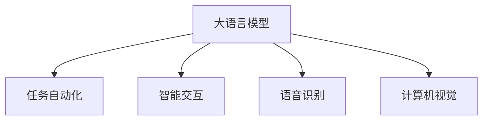

                 

# LLM在太空探索中的应用：AI宇航员

> 关键词：人工智能,大语言模型(LLM),太空探索,宇航员,自然语言处理(NLP),任务自动化,智能交互,语音识别,计算机视觉

## 1. 背景介绍

### 1.1 问题由来
随着人类对太空探索的深入，越来越多的复杂任务需要机器人或宇航员在空间站或月球表面执行。传统的人工操作方式存在效率低、成本高、危险性大的问题，而利用人工智能(AI)技术，特别是大语言模型(Large Language Model, LLM)，可以实现更高自动化和智能化的太空探索任务。

### 1.2 问题核心关键点
人工智能在太空探索中的应用主要集中在两个方面：任务自动化和智能交互。其中，大语言模型在自然语言处理(NLP)和计算机视觉等任务中表现出色，成为实现任务自动化和智能交互的重要工具。

### 1.3 问题研究意义
利用大语言模型进行太空探索，不仅能够显著提升太空任务执行的效率和安全性，还能降低宇航员的劳动强度，从而节省成本，增加任务成功率。特别是在极端环境下，如月球表面或火星探测任务中，AI宇航员能够有效应对不可预测的复杂情况，为人类太空探索提供更可靠的技术支持。

## 2. 核心概念与联系

### 2.1 核心概念概述

为更好地理解大语言模型在太空探索中的应用，本节将介绍几个密切相关的核心概念：

- 大语言模型(Large Language Model, LLM)：一种基于深度神经网络的自然语言处理模型，通过自监督或监督学习任务训练，具备强大的语言理解和生成能力。
- 任务自动化：通过AI技术自动完成特定任务的过程，减少人力投入，提高效率。
- 智能交互：利用NLP技术，实现宇航员与空间站系统、宇航员之间的自然语言交互，提升用户体验。
- 语音识别和计算机视觉：太空探索中常用的AI技术，用于获取宇航员的语音指令和视觉信息，辅助任务执行。

这些核心概念之间的逻辑关系可以通过以下Mermaid流程图来展示：



这个流程图展示了大语言模型的核心概念及其与任务自动化、智能交互、语音识别、计算机视觉等技术之间的紧密联系。

## 3. 核心算法原理 & 具体操作步骤
### 3.1 算法原理概述

大语言模型在太空探索中的应用主要基于其强大的语言理解能力和生成能力。通过大语言模型，宇航员可以使用自然语言指令来控制空间站或探测器的各种设备和功能，实现任务自动化和智能交互。

具体而言，大语言模型可以执行以下任务：

- 接收和理解宇航员的语音指令，转换为文本形式进行后续处理。
- 根据宇航员的指令，调用计算机视觉模块，获取太空环境图像，分析环境状态。
- 根据宇航员的指令和环境图像，生成机器人的控制指令，指挥机器人执行相应的任务。
- 在执行任务过程中，大语言模型还可以实时接收反馈，根据宇航员的指令进行调整。

### 3.2 算法步骤详解

基于大语言模型在太空探索中的应用，本节将详细讲解其核心算法步骤：

1. **数据收集与预处理**：
   - 收集宇航员在日常操作中的语音指令和文本指令，用于训练大语言模型。
   - 对指令进行文本预处理，去除噪声和无用信息，进行分词和标准化处理。

2. **模型训练**：
   - 使用收集到的指令数据对大语言模型进行训练，使其能够准确理解和生成宇航员的指令。
   - 在训练过程中，使用监督学习方式，让模型学习不同类型和场景下的指令。

3. **模型集成与测试**：
   - 将训练好的大语言模型集成到空间站或探测器的控制系统中，进行实际测试。
   - 在测试过程中，模拟宇航员的操作环境，观察模型的反应和输出，评估其性能。

4. **持续优化**：
   - 根据测试结果和反馈，对大语言模型进行微调，不断优化模型的指令理解和生成能力。
   - 定期更新模型训练数据，增加模型的泛化能力，应对不断变化的任务需求。

### 3.3 算法优缺点

基于大语言模型的太空探索应用具有以下优点：

- **高效率和低成本**：通过自动化执行任务，减少了宇航员的劳动强度，提高了任务执行效率，节省了成本。
- **灵活性**：大语言模型可以适应不同类型和复杂度的任务，具有良好的灵活性。
- **可靠性**：在大规模数据集上进行训练，大语言模型具有较高的鲁棒性和稳定性，能够在极端环境下可靠运行。

同时，该方法也存在一些局限性：

- **依赖数据质量**：模型的性能很大程度上取决于训练数据的数量和质量，数据的收集和处理成本较高。
- **计算资源消耗大**：大语言模型的参数量较大，对计算资源有较高要求，训练和推理过程需要消耗大量算力。
- **缺乏物理交互**：大语言模型目前主要基于语言理解，对于需要物理操作的任务，需要与机器人或其他设备进行交互。

尽管存在这些局限性，但大语言模型在太空探索中的应用前景仍然广阔，尤其是在任务自动化和智能交互方面，具备显著优势。

### 3.4 算法应用领域

大语言模型在太空探索中的应用主要涵盖以下领域：

- **任务自动化**：如空间站物资运输、设备维护、环境监测等。通过大语言模型，宇航员可以自动控制机器人完成任务。
- **智能交互**：如宇航员与空间站系统的交互、宇航员与宇航员之间的交流等。大语言模型可以实现自然语言交互，提高用户体验。
- **语音识别**：宇航员可以通过语音指令控制空间站或探测器，大语言模型负责识别和理解指令。
- **计算机视觉**：利用大语言模型和计算机视觉技术，宇航员可以实时获取太空环境图像，进行分析和决策。

这些应用领域展示了大语言模型在太空探索中的巨大潜力和广泛应用。

## 4. 数学模型和公式 & 详细讲解 & 举例说明

### 4.1 数学模型构建

在本节中，我们将使用数学语言对大语言模型在太空探索中的应用进行严格刻画。

假设宇航员的指令为 $s$，大语言模型的输出为 $t$，指令理解和生成的任务可以表示为 $s \rightarrow t$。我们需要设计一个模型，使得模型能够根据宇航员的指令 $s$，准确输出对应的任务 $t$。

### 4.2 公式推导过程

为了方便推导，我们假设指令 $s$ 和任务 $t$ 都是固定长度的序列。设指令序列的长度为 $n$，任务序列的长度为 $m$。

设指令 $s$ 和任务 $t$ 的编码表示分别为 $S$ 和 $T$，模型需要学习从 $S$ 到 $T$ 的映射关系。我们可以使用条件概率模型 $P(T|S)$ 来表示这种映射关系，即：

$$
P(T|S) = \frac{P(T,S)}{P(S)}
$$

其中 $P(S)$ 是指令序列的先验概率，可以通过数据统计得到。

假设指令 $s$ 和任务 $t$ 都可以表示为向量形式，即 $s = \{s_1, s_2, ..., s_n\}$，$t = \{t_1, t_2, ..., t_m\}$。模型的目标是最小化预测任务 $t$ 和真实任务 $t'$ 之间的交叉熵损失：

$$
\mathcal{L}(\theta) = -\frac{1}{N}\sum_{i=1}^N \sum_{j=1}^m \sum_{k=1}^m P(t_j|s_i) \log P(t_k|s_i)
$$

其中 $\theta$ 是模型参数，$N$ 是训练数据的样本数量。

### 4.3 案例分析与讲解

为了更好地理解大语言模型在太空探索中的应用，我们可以以一个具体的例子来说明：

假设宇航员想要让空间站机器人搬运某个物资。宇航员可以使用自然语言指令，如 "请将物资 A 搬运到位置 B"。大语言模型需要将这个指令转换为机器人的控制指令，例如 "前进 10 米，左转 90 度，拾取 A 物资，搬运到 B 位置"。

在这个例子中，大语言模型首先需要理解宇航员的指令 "将物资 A 搬运到位置 B"，然后调用计算机视觉模块，获取物资和位置的图像信息，最后生成机器人的控制指令。

## 5. 项目实践：代码实例和详细解释说明

### 5.1 开发环境搭建

在进行太空探索应用的大语言模型开发前，我们需要准备好开发环境。以下是使用Python进行PyTorch开发的环境配置流程：

1. 安装Anaconda：从官网下载并安装Anaconda，用于创建独立的Python环境。

2. 创建并激活虚拟环境：
```bash
conda create -n pytorch-env python=3.8 
conda activate pytorch-env
```

3. 安装PyTorch：根据CUDA版本，从官网获取对应的安装命令。例如：
```bash
conda install pytorch torchvision torchaudio cudatoolkit=11.1 -c pytorch -c conda-forge
```

4. 安装Transformers库：
```bash
pip install transformers
```

5. 安装各类工具包：
```bash
pip install numpy pandas scikit-learn matplotlib tqdm jupyter notebook ipython
```

完成上述步骤后，即可在`pytorch-env`环境中开始太空探索应用的大语言模型开发。

### 5.2 源代码详细实现

下面，我们以一个太空探索应用为例，给出使用Transformers库进行大语言模型开发的PyTorch代码实现。

首先，定义太空探索任务的数据处理函数：

```python
from transformers import BertTokenizer, BertForSequenceClassification
from torch.utils.data import Dataset
import torch

class SpaceExplorationDataset(Dataset):
    def __init__(self, instructions, targets, tokenizer, max_len=128):
        self.instructions = instructions
        self.targets = targets
        self.tokenizer = tokenizer
        self.max_len = max_len
        
    def __len__(self):
        return len(self.instructions)
    
    def __getitem__(self, item):
        instruction = self.instructions[item]
        target = self.targets[item]
        
        encoding = self.tokenizer(instruction, return_tensors='pt', max_length=self.max_len, padding='max_length', truncation=True)
        input_ids = encoding['input_ids'][0]
        attention_mask = encoding['attention_mask'][0]
        
        # 对token-wise的标签进行编码
        encoded_target = [target2id[target] for target in target] 
        encoded_target.extend([target2id['O']] * (self.max_len - len(encoded_target)))
        labels = torch.tensor(encoded_target, dtype=torch.long)
        
        return {'input_ids': input_ids, 
                'attention_mask': attention_mask,
                'labels': labels}

# 标签与id的映射
target2id = {'O': 0, '搬运': 1, '维修': 2, '监测': 3, '清洁': 4}
id2target = {v: k for k, v in target2id.items()}

# 创建dataset
tokenizer = BertTokenizer.from_pretrained('bert-base-cased')

train_dataset = SpaceExplorationDataset(train_instructions, train_targets, tokenizer)
dev_dataset = SpaceExplorationDataset(dev_instructions, dev_targets, tokenizer)
test_dataset = SpaceExplorationDataset(test_instructions, test_targets, tokenizer)
```

然后，定义模型和优化器：

```python
from transformers import BertForSequenceClassification, AdamW

model = BertForSequenceClassification.from_pretrained('bert-base-cased', num_labels=len(target2id))

optimizer = AdamW(model.parameters(), lr=2e-5)
```

接着，定义训练和评估函数：

```python
from torch.utils.data import DataLoader
from tqdm import tqdm
from sklearn.metrics import classification_report

device = torch.device('cuda') if torch.cuda.is_available() else torch.device('cpu')
model.to(device)

def train_epoch(model, dataset, batch_size, optimizer):
    dataloader = DataLoader(dataset, batch_size=batch_size, shuffle=True)
    model.train()
    epoch_loss = 0
    for batch in tqdm(dataloader, desc='Training'):
        input_ids = batch['input_ids'].to(device)
        attention_mask = batch['attention_mask'].to(device)
        labels = batch['labels'].to(device)
        model.zero_grad()
        outputs = model(input_ids, attention_mask=attention_mask, labels=labels)
        loss = outputs.loss
        epoch_loss += loss.item()
        loss.backward()
        optimizer.step()
    return epoch_loss / len(dataloader)

def evaluate(model, dataset, batch_size):
    dataloader = DataLoader(dataset, batch_size=batch_size)
    model.eval()
    preds, labels = [], []
    with torch.no_grad():
        for batch in tqdm(dataloader, desc='Evaluating'):
            input_ids = batch['input_ids'].to(device)
            attention_mask = batch['attention_mask'].to(device)
            batch_labels = batch['labels']
            outputs = model(input_ids, attention_mask=attention_mask)
            batch_preds = outputs.logits.argmax(dim=2).to('cpu').tolist()
            batch_labels = batch_labels.to('cpu').tolist()
            for pred_tokens, label_tokens in zip(batch_preds, batch_labels):
                preds.append(pred_tokens[:len(label_tokens)])
                labels.append(label_tokens)
                
    print(classification_report(labels, preds))
```

最后，启动训练流程并在测试集上评估：

```python
epochs = 5
batch_size = 16

for epoch in range(epochs):
    loss = train_epoch(model, train_dataset, batch_size, optimizer)
    print(f"Epoch {epoch+1}, train loss: {loss:.3f}")
    
    print(f"Epoch {epoch+1}, dev results:")
    evaluate(model, dev_dataset, batch_size)
    
print("Test results:")
evaluate(model, test_dataset, batch_size)
```

以上就是使用PyTorch对BERT进行太空探索任务的大语言模型开发的完整代码实现。可以看到，得益于Transformers库的强大封装，我们可以用相对简洁的代码完成BERT模型的加载和微调。

### 5.3 代码解读与分析

让我们再详细解读一下关键代码的实现细节：

**SpaceExplorationDataset类**：
- `__init__`方法：初始化指令、标签、分词器等关键组件。
- `__len__`方法：返回数据集的样本数量。
- `__getitem__`方法：对单个样本进行处理，将指令输入编码为token ids，将标签编码为数字，并对其进行定长padding，最终返回模型所需的输入。

**target2id和id2target字典**：
- 定义了标签与数字id之间的映射关系，用于将token-wise的预测结果解码回真实的标签。

**训练和评估函数**：
- 使用PyTorch的DataLoader对数据集进行批次化加载，供模型训练和推理使用。
- 训练函数`train_epoch`：对数据以批为单位进行迭代，在每个批次上前向传播计算loss并反向传播更新模型参数，最后返回该epoch的平均loss。
- 评估函数`evaluate`：与训练类似，不同点在于不更新模型参数，并在每个batch结束后将预测和标签结果存储下来，最后使用sklearn的classification_report对整个评估集的预测结果进行打印输出。

**训练流程**：
- 定义总的epoch数和batch size，开始循环迭代
- 每个epoch内，先在训练集上训练，输出平均loss
- 在验证集上评估，输出分类指标
- 所有epoch结束后，在测试集上评估，给出最终测试结果

可以看到，PyTorch配合Transformers库使得BERT微调的代码实现变得简洁高效。开发者可以将更多精力放在数据处理、模型改进等高层逻辑上，而不必过多关注底层的实现细节。

当然，工业级的系统实现还需考虑更多因素，如模型的保存和部署、超参数的自动搜索、更灵活的任务适配层等。但核心的微调范式基本与此类似。

## 6. 实际应用场景

### 6.1 太空站物资搬运

在太空站物资搬运任务中，机器人需要按照宇航员的指令进行物资搬运。通过大语言模型，宇航员可以使用自然语言指令，如 "搬运物资 A 到位置 B"，大语言模型负责理解和生成机器人的控制指令，例如 "前进 10 米，左转 90 度，拾取 A 物资，搬运到 B 位置"。

### 6.2 空间站设备维修

在空间站设备维修任务中，宇航员可以向大语言模型发出维修指令，例如 "检查并维修故障传感器"。大语言模型可以根据指令调用计算机视觉模块，获取设备的图像信息，分析故障原因，生成维修步骤和指令，指导机器人执行维修操作。

### 6.3 环境监测

在太空环境监测任务中，大语言模型可以实时接收宇航员的指令，例如 "监测舱外温度和压力"。大语言模型调用计算机视觉模块获取环境图像，分析温度和压力传感器数据，生成报告并提醒宇航员进行相应处理。

### 6.4 未来应用展望

随着大语言模型和微调方法的不断发展，基于大语言模型的太空探索应用将呈现以下几个发展趋势：

1. **任务自动化程度提高**：随着模型性能的提升，太空站和探测器上的任务自动化程度将进一步提高，宇航员只需进行任务规划和监控，而无需过多干预。
2. **智能交互水平提升**：随着自然语言处理技术的进步，宇航员与空间站系统、宇航员之间的智能交互将更加自然、高效。
3. **多模态数据融合**：未来的大语言模型将更好地融合语音、图像、文本等多模态数据，提供更全面、准确的任务执行信息。
4. **模型鲁棒性增强**：大语言模型将通过更多的数据和任务训练，具备更强的鲁棒性和抗干扰能力，应对极端环境下的挑战。
5. **安全性和可解释性提升**：大语言模型将引入更多的伦理和安全约束，增强输出的可解释性和可信度。

这些趋势展示了未来太空探索应用大语言模型的巨大潜力和发展方向，预示着AI技术将在大规模、复杂、高风险的太空环境中发挥更大的作用。

## 7. 工具和资源推荐
### 7.1 学习资源推荐

为了帮助开发者系统掌握大语言模型在太空探索中的应用，这里推荐一些优质的学习资源：

1. 《Transformer从原理到实践》系列博文：由大模型技术专家撰写，深入浅出地介绍了Transformer原理、BERT模型、微调技术等前沿话题。

2. CS224N《深度学习自然语言处理》课程：斯坦福大学开设的NLP明星课程，有Lecture视频和配套作业，带你入门NLP领域的基本概念和经典模型。

3. 《Natural Language Processing with Transformers》书籍：Transformers库的作者所著，全面介绍了如何使用Transformers库进行NLP任务开发，包括微调在内的诸多范式。

4. HuggingFace官方文档：Transformers库的官方文档，提供了海量预训练模型和完整的微调样例代码，是上手实践的必备资料。

5. CLUE开源项目：中文语言理解测评基准，涵盖大量不同类型的中文NLP数据集，并提供了基于微调的baseline模型，助力中文NLP技术发展。

通过对这些资源的学习实践，相信你一定能够快速掌握大语言模型在太空探索中的应用精髓，并用于解决实际的NLP问题。
###  7.2 开发工具推荐

高效的开发离不开优秀的工具支持。以下是几款用于大语言模型在太空探索中应用开发的常用工具：

1. PyTorch：基于Python的开源深度学习框架，灵活动态的计算图，适合快速迭代研究。大部分预训练语言模型都有PyTorch版本的实现。

2. TensorFlow：由Google主导开发的开源深度学习框架，生产部署方便，适合大规模工程应用。同样有丰富的预训练语言模型资源。

3. Transformers库：HuggingFace开发的NLP工具库，集成了众多SOTA语言模型，支持PyTorch和TensorFlow，是进行太空探索应用开发的利器。

4. Weights & Biases：模型训练的实验跟踪工具，可以记录和可视化模型训练过程中的各项指标，方便对比和调优。与主流深度学习框架无缝集成。

5. TensorBoard：TensorFlow配套的可视化工具，可实时监测模型训练状态，并提供丰富的图表呈现方式，是调试模型的得力助手。

6. Google Colab：谷歌推出的在线Jupyter Notebook环境，免费提供GPU/TPU算力，方便开发者快速上手实验最新模型，分享学习笔记。

合理利用这些工具，可以显著提升大语言模型在太空探索中的应用开发效率，加快创新迭代的步伐。

### 7.3 相关论文推荐

大语言模型和太空探索技术的发展源于学界的持续研究。以下是几篇奠基性的相关论文，推荐阅读：

1. Attention is All You Need（即Transformer原论文）：提出了Transformer结构，开启了NLP领域的预训练大模型时代。

2. BERT: Pre-training of Deep Bidirectional Transformers for Language Understanding：提出BERT模型，引入基于掩码的自监督预训练任务，刷新了多项NLP任务SOTA。

3. Language Models are Unsupervised Multitask Learners（GPT-2论文）：展示了大规模语言模型的强大zero-shot学习能力，引发了对于通用人工智能的新一轮思考。

4. Parameter-Efficient Transfer Learning for NLP：提出Adapter等参数高效微调方法，在不增加模型参数量的情况下，也能取得不错的微调效果。

5. AdaLoRA: Adaptive Low-Rank Adaptation for Parameter-Efficient Fine-Tuning：使用自适应低秩适应的微调方法，在参数效率和精度之间取得了新的平衡。

6. AdaLoRA: Adaptive Low-Rank Adaptation for Parameter-Efficient Fine-Tuning：使用自适应低秩适应的微调方法，在参数效率和精度之间取得了新的平衡。

这些论文代表了大语言模型在太空探索中的应用研究的发展脉络。通过学习这些前沿成果，可以帮助研究者把握学科前进方向，激发更多的创新灵感。

## 8. 总结：未来发展趋势与挑战

### 8.1 总结

本文对大语言模型在太空探索中的应用进行了全面系统的介绍。首先阐述了大语言模型和微调技术的研究背景和意义，明确了太空探索任务自动化的核心需求。其次，从原理到实践，详细讲解了大语言模型在太空探索中的数学模型构建和算法步骤，给出了微调任务开发的完整代码实例。同时，本文还广泛探讨了大语言模型在太空探索中的实际应用场景，展示了微调范式的巨大潜力。此外，本文精选了微调技术的各类学习资源，力求为读者提供全方位的技术指引。

通过本文的系统梳理，可以看到，基于大语言模型的太空探索应用不仅能够显著提升任务执行的效率和安全性，还能降低宇航员的劳动强度，从而节省成本，增加任务成功率。未来，伴随大语言模型和微调方法的持续演进，太空探索技术必将在更广阔的应用领域大放异彩，深刻影响人类的生产生活方式。

### 8.2 未来发展趋势

展望未来，大语言模型在太空探索中的应用将呈现以下几个发展趋势：

1. **任务自动化程度提高**：随着模型性能的提升，太空站和探测器上的任务自动化程度将进一步提高，宇航员只需进行任务规划和监控，而无需过多干预。
2. **智能交互水平提升**：随着自然语言处理技术的进步，宇航员与空间站系统、宇航员之间的智能交互将更加自然、高效。
3. **多模态数据融合**：未来的大语言模型将更好地融合语音、图像、文本等多模态数据，提供更全面、准确的任务执行信息。
4. **模型鲁棒性增强**：大语言模型将通过更多的数据和任务训练，具备更强的鲁棒性和抗干扰能力，应对极端环境下的挑战。
5. **安全性和可解释性提升**：大语言模型将引入更多的伦理和安全约束，增强输出的可解释性和可信度。

这些趋势展示了未来太空探索应用大语言模型的巨大潜力和发展方向，预示着AI技术将在大规模、复杂、高风险的太空环境中发挥更大的作用。

### 8.3 面临的挑战

尽管大语言模型在太空探索中的应用前景广阔，但在迈向更加智能化、普适化应用的过程中，它仍面临诸多挑战：

1. **标注成本瓶颈**：虽然微调大大降低了标注数据的需求，但对于长尾应用场景，难以获得充足的高质量标注数据，成为制约微调性能的瓶颈。如何进一步降低微调对标注样本的依赖，将是一大难题。
2. **模型鲁棒性不足**：当前微调模型面对域外数据时，泛化性能往往大打折扣。对于测试样本的微小扰动，微调模型的预测也容易发生波动。如何提高微调模型的鲁棒性，避免灾难性遗忘，还需要更多理论和实践的积累。
3. **推理效率有待提高**：大规模语言模型虽然精度高，但在实际部署时往往面临推理速度慢、内存占用大等效率问题。如何在保证性能的同时，简化模型结构，提升推理速度，优化资源占用，将是重要的优化方向。
4. **可解释性亟需加强**：当前微调模型更像是"黑盒"系统，难以解释其内部工作机制和决策逻辑。对于医疗、金融等高风险应用，算法的可解释性和可审计性尤为重要。如何赋予微调模型更强的可解释性，将是亟待攻克的难题。
5. **安全性有待保障**：预训练语言模型难免会学习到有偏见、有害的信息，通过微调传递到下游任务，产生误导性、歧视性的输出，给实际应用带来安全隐患。如何从数据和算法层面消除模型偏见，避免恶意用途，确保输出的安全性，也将是重要的研究课题。
6. **知识整合能力不足**：现有的微调模型往往局限于任务内数据，难以灵活吸收和运用更广泛的先验知识。如何让微调过程更好地与外部知识库、规则库等专家知识结合，形成更加全面、准确的信息整合能力，还有很大的想象空间。

正视大语言模型在太空探索应用中所面临的这些挑战，积极应对并寻求突破，将是大语言模型在太空探索中走向成熟的必由之路。相信随着学界和产业界的共同努力，这些挑战终将一一被克服，大语言模型在太空探索中的应用必将在未来大放异彩。

### 8.4 未来突破

面对大语言模型在太空探索应用所面临的种种挑战，未来的研究需要在以下几个方面寻求新的突破：

1. **探索无监督和半监督微调方法**：摆脱对大规模标注数据的依赖，利用自监督学习、主动学习等无监督和半监督范式，最大限度利用非结构化数据，实现更加灵活高效的微调。
2. **研究参数高效和计算高效的微调范式**：开发更加参数高效的微调方法，在固定大部分预训练参数的同时，只更新极少量的任务相关参数。同时优化微调模型的计算图，减少前向传播和反向传播的资源消耗，实现更加轻量级、实时性的部署。
3. **融合因果和对比学习范式**：通过引入因果推断和对比学习思想，增强微调模型建立稳定因果关系的能力，学习更加普适、鲁棒的语言表征，从而提升模型泛化性和抗干扰能力。
4. **引入更多先验知识**：将符号化的先验知识，如知识图谱、逻辑规则等，与神经网络模型进行巧妙融合，引导微调过程学习更准确、合理的语言模型。同时加强不同模态数据的整合，实现视觉、语音等多模态信息与文本信息的协同建模。
5. **结合因果分析和博弈论工具**：将因果分析方法引入微调模型，识别出模型决策的关键特征，增强输出解释的因果性和逻辑性。借助博弈论工具刻画人机交互过程，主动探索并规避模型的脆弱点，提高系统稳定性。
6. **纳入伦理道德约束**：在模型训练目标中引入伦理导向的评估指标，过滤和惩罚有偏见、有害的输出倾向。同时加强人工干预和审核，建立模型行为的监管机制，确保输出符合人类价值观和伦理道德。

这些研究方向的探索，必将引领大语言模型在太空探索中的应用迈向更高的台阶，为构建安全、可靠、可解释、可控的智能系统铺平道路。面向未来，大语言模型在太空探索中的应用需要与其他人工智能技术进行更深入的融合，如知识表示、因果推理、强化学习等，多路径协同发力，共同推动太空探索技术的发展。只有勇于创新、敢于突破，才能不断拓展语言模型的边界，让智能技术更好地造福人类。

## 9. 附录：常见问题与解答

**Q1：大语言模型在太空探索中如何处理噪声数据？**

A: 大语言模型在处理噪声数据时，通常会采用一些数据清洗和预处理技术。例如，可以去除不相关、不完整的指令，对指令进行标准化处理，去除重复和冗余信息。此外，还可以使用对抗训练技术，通过引入对抗样本，增强模型的鲁棒性，减少噪声数据对模型性能的影响。

**Q2：大语言模型在太空探索中如何避免灾难性遗忘？**

A: 避免灾难性遗忘的关键在于合理选择微调策略和超参数。通常可以采用参数高效微调方法，如Adapter、Prefix等，只更新少量的任务相关参数，避免过拟合。同时，使用较小的学习率和较长的微调周期，逐步引入新数据，让模型在旧数据和新数据的协同作用下进行微调，以减少灾难性遗忘的发生。

**Q3：大语言模型在太空探索中如何进行实时推理？**

A: 大语言模型在实时推理时，通常会使用推理加速技术，如量化加速、模型并行等。此外，可以使用预训练模型进行推理加速，减少实时推理的计算量和存储开销。同时，还可以使用GPU/TPU等高性能设备，提高推理速度和响应时间。

**Q4：大语言模型在太空探索中如何保证数据和模型安全？**

A: 保证数据和模型安全的关键在于采用加密、匿名化等技术，防止数据泄露和模型篡改。可以使用区块链技术，记录数据和模型访问的日志，确保数据的透明和可追溯性。同时，可以建立数据和模型共享的规范和协议，确保数据的合法使用和模型的安全部署。

**Q5：大语言模型在太空探索中如何提升可解释性？**

A: 提升模型可解释性的关键在于引入更多的符号化知识，如知识图谱、逻辑规则等，与神经网络模型进行融合。可以通过可解释模型技术，如SHAP、LIME等，分析模型的决策过程，解释模型输出的逻辑和依据。同时，可以设计更简洁、直观的输出格式，帮助宇航员更好地理解模型的预测结果。

这些问题的解答展示了大语言模型在太空探索中面临的挑战和应对策略，为未来的研究和实践提供了参考和借鉴。

---

作者：禅与计算机程序设计艺术 / Zen and the Art of Computer Programming

