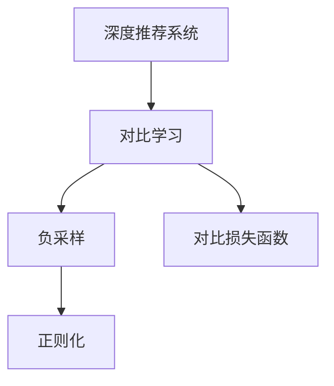

                 

# LLM在推荐系统中的对比学习应用

## 1. 背景介绍

### 1.1 问题由来
推荐系统是现代互联网应用程序中不可或缺的组成部分，它为用户提供个性化的信息推荐，帮助用户发现感兴趣的内容。传统的推荐系统主要基于用户行为数据，如浏览历史、购买记录等，进行协同过滤或矩阵分解，存在一定的冷启动问题，且推荐效果受用户活动限制。近年来，基于深度学习和大规模预训练语言模型（LLMs）的推荐系统逐步兴起，通过学习用户和内容的语义表示，解决了冷启动和推荐多样性等问题。

然而，现有的基于LLM的推荐方法往往采用独立训练用户和内容表示的范式，忽略了用户和内容之间的协同关联，导致模型对于协同关系的建模效果较差，推荐质量有待进一步提升。为了增强模型对用户与内容协同关系的理解，对比学习（Contrastive Learning）技术被引入到LLM的推荐系统中，通过最大化用户和内容表示之间的相似性，最小化它们与其他不同表示之间的差异性，从而提升推荐系统的性能。

### 1.2 问题核心关键点
对比学习在推荐系统中的应用，关键在于如何设计有效的对比损失函数，构建合理的正负样本空间，以及如何结合用户的个性化需求进行模型训练。这些关键点的设计直接影响了对比学习的对比效果和推荐系统的性能。

## 2. 核心概念与联系

### 2.1 核心概念概述

为了深入理解基于LLM的对比学习推荐方法，本节将介绍几个核心概念：

- 深度推荐系统：通过深度学习技术进行个性化推荐，特别是基于大规模预训练语言模型的推荐系统。
- 对比学习：一种无监督学习技术，通过最大化正样本与负样本之间的差异性，最大化正样本内部的相似性，以实现对复杂任务的有效建模。
- 负采样：在正负样本空间构建时，为每个正样本随机采样若干个负样本，以丰富训练数据，提升模型泛化能力。
- 正则化：在模型训练过程中，引入正则化技术如L2正则、Dropout等，以避免模型过拟合，增强模型泛化能力。
- 对比损失函数：一种无监督损失函数，通过最大化正样本与负样本之间的对比关系，优化模型参数，提升模型性能。

这些概念之间的逻辑关系可以通过以下Mermaid流程图来展示：



这个流程图展示了大语言模型在推荐系统中的应用流程：

1. 深度推荐系统利用LLM学习用户和内容的语义表示。
2. 对比学习技术通过对比相似性和差异性，进一步优化用户和内容表示的建模。
3. 负采样和正则化技术在模型训练中起到正向作用，提升模型泛化能力。
4. 对比损失函数是对比学习优化模型参数的核心工具。

这些概念共同构成了基于LLM的对比学习推荐系统，使其能够在推荐任务中更好地发挥作用。

## 3. 核心算法原理 & 具体操作步骤
### 3.1 算法原理概述

基于LLM的对比学习推荐方法的核心思想是，通过最大化用户和内容表示之间的相似性，最小化它们与其他不同表示之间的差异性，从而提升推荐系统的性能。具体而言，假设用户和内容表示分别为 $\mathbf{u}$ 和 $\mathbf{v}$，通过设计对比损失函数 $\mathcal{L}$，最大化正样本 $\mathbf{u}$ 和 $\mathbf{v}$ 之间的相似性，同时最小化负样本 $\mathbf{u}$ 和 $\mathbf{v}$ 之间的相似性，从而优化模型参数 $\theta$，使其能够更好地适应推荐任务。

### 3.2 算法步骤详解

基于LLM的对比学习推荐方法包括以下几个关键步骤：

**Step 1: 准备用户和内容表示**

在推荐系统中共有 $M$ 个用户，每个用户 $u_i$ 有 $N$ 个交互数据 $c_{i,j}$。通过预训练语言模型对每个交互数据 $c_{i,j}$ 进行编码，得到 $N$ 个内容的语义表示 $\mathbf{v}_{i,j}$。同样，对每个用户 $u_i$ 的 $N$ 个交互数据编码得到的语义表示进行均值化，得到用户 $u_i$ 的语义表示 $\mathbf{u}_i$。

**Step 2: 构建对比损失函数**

在训练过程中，对于每个用户 $u_i$ 和内容 $c_{i,j}$，随机采样若干个负样本 $c_{k,l}$，其中 $k \neq i$ 且 $l \neq j$。通过对比损失函数，最大化正样本 $\mathbf{u}_i$ 和 $\mathbf{v}_{i,j}$ 之间的相似性，同时最小化负样本 $\mathbf{u}_i$ 和 $\mathbf{v}_{k,l}$ 之间的相似性。

常见的对比损失函数包括 contrastive loss、information bottleneck loss、similarity network loss 等。这里以 contrastive loss 为例进行详细讲解。

**Step 3: 训练模型**

在得到对比损失函数后，通过反向传播算法，最小化对比损失函数 $\mathcal{L}$，更新模型参数 $\theta$，从而优化用户和内容的表示。

### 3.3 算法优缺点

基于LLM的对比学习推荐方法具有以下优点：

1. 强化协同关系建模：通过最大化用户和内容表示之间的相似性，最小化它们与其他不同表示之间的差异性，可以更好地捕捉用户与内容的协同关系。
2. 缓解冷启动问题：通过学习用户的语义表示，可以较好地解决冷启动问题，为用户提供更个性化的推荐。
3. 提高推荐多样性：对比学习可以从全局角度优化推荐多样性，避免传统推荐方法中的一些缺陷。
4. 增强模型泛化能力：通过负采样和正则化技术，可以提升模型的泛化能力，使其更好地适应新的用户和内容。

同时，该方法也存在一定的局限性：

1. 对数据质量和标注需求高：对比学习需要高质量的训练数据和标注信息，对于数据不充分或者标注困难的任务，难以取得理想的效果。
2. 对训练时间和计算资源要求高：对比学习需要进行大量的负采样，且训练过程复杂，需要消耗大量的计算资源和时间。
3. 对对比损失函数设计要求高：对比损失函数的合理设计直接影响模型的对比效果和推荐性能，需要根据具体任务进行调整。
4. 模型可解释性不足：对比学习作为无监督学习方法，其模型的决策过程缺乏可解释性，难以对其进行分析和调试。

尽管存在这些局限性，但对比学习在LLM的推荐系统中仍是一个值得深入研究的方向。未来相关研究的重点在于如何进一步降低对比学习对数据和标注的依赖，提高模型的少样本学习和跨领域迁移能力，同时兼顾可解释性和伦理安全性等因素。

### 3.4 算法应用领域

基于LLM的对比学习推荐方法已经在电商推荐、视频推荐、新闻推荐等众多领域得到了广泛应用，展示了其在推荐系统中的强大潜力和广泛应用前景。

- 电商推荐：通过学习用户和商品的语义表示，最大化正负样本之间的差异性，实现商品推荐。
- 视频推荐：将视频和用户表示编码，最大化正负样本之间的相似性，实现视频推荐。
- 新闻推荐：通过学习用户和新闻内容的语义表示，最大化正负样本之间的相似性，实现新闻推荐。

除了这些经典应用场景外，基于对比学习的大语言模型推荐系统还广泛应用于游戏推荐、音乐推荐、社交网络推荐等更多场景中，为推荐系统带来了新的突破。随着预训练语言模型和对比学习方法的不断进步，相信推荐系统将在更多领域得到应用，为用户的个性化需求提供更好的服务。

## 4. 数学模型和公式 & 详细讲解 & 举例说明
### 4.1 数学模型构建

本节将使用数学语言对基于LLM的对比学习推荐过程进行更加严格的刻画。

记用户表示为 $\mathbf{u}_i$，内容表示为 $\mathbf{v}_{i,j}$。假设每个用户有 $N$ 个交互数据，对每个交互数据 $c_{i,j}$ 进行编码，得到内容表示 $\mathbf{v}_{i,j}$。

**对比损失函数**：
$$
\mathcal{L} = \frac{1}{N}\sum_{i=1}^M \frac{1}{N}\sum_{j=1}^N -\log \frac{e^{\cos(\mathbf{u}_i, \mathbf{v}_{i,j})}{\sum_{k=1}^M \sum_{l=1}^N e^{\cos(\mathbf{u}_i, \mathbf{v}_{k,l})}}
$$

其中，$\cos(\mathbf{u}_i, \mathbf{v}_{i,j})$ 表示用户表示 $\mathbf{u}_i$ 和内容表示 $\mathbf{v}_{i,j}$ 的余弦相似度，$\sum_{k=1}^M \sum_{l=1}^N e^{\cos(\mathbf{u}_i, \mathbf{v}_{k,l})}$ 表示所有正负样本的余弦相似度之和。

**优化目标**：
$$
\theta^* = \mathop{\arg\min}_{\theta} \mathcal{L}
$$

### 4.2 公式推导过程

以 contrastive loss 为例，进行详细推导。

假设用户表示为 $\mathbf{u}_i$，内容表示为 $\mathbf{v}_{i,j}$，负样本表示为 $\mathbf{u}_k$ 和 $\mathbf{v}_{k,l}$。对比损失函数为：

$$
\mathcal{L} = \frac{1}{N}\sum_{i=1}^M \frac{1}{N}\sum_{j=1}^N -\log \frac{e^{\cos(\mathbf{u}_i, \mathbf{v}_{i,j})}{\sum_{k=1}^M \sum_{l=1}^N e^{\cos(\mathbf{u}_i, \mathbf{v}_{k,l})}}
$$

令 $L = \log \frac{e^{\cos(\mathbf{u}_i, \mathbf{v}_{i,j})}{\sum_{k=1}^M \sum_{l=1}^N e^{\cos(\mathbf{u}_i, \mathbf{v}_{k,l})}}$，则对比损失函数可表示为：

$$
\mathcal{L} = -\frac{1}{N}\sum_{i=1}^M \frac{1}{N}\sum_{j=1}^N L
$$

通过对 $L$ 求导，可以得到：

$$
\frac{\partial L}{\partial \theta} = \frac{\partial \log e^{\cos(\mathbf{u}_i, \mathbf{v}_{i,j})}{\partial \theta} - \frac{\partial \log \sum_{k=1}^M \sum_{l=1}^N e^{\cos(\mathbf{u}_i, \mathbf{v}_{k,l})}}{\partial \theta}
$$

使用链式法则，可以得到：

$$
\frac{\partial L}{\partial \theta} = \frac{\partial \cos(\mathbf{u}_i, \mathbf{v}_{i,j})}{\partial \theta} - \frac{\partial \log \sum_{k=1}^M \sum_{l=1}^N e^{\cos(\mathbf{u}_i, \mathbf{v}_{k,l})}}{\partial \theta}
$$

进一步展开得到：

$$
\frac{\partial L}{\partial \theta} = \frac{\partial \mathbf{u}_i^T \mathbf{v}_{i,j}}{\partial \theta} - \frac{\partial \log \sum_{k=1}^M \sum_{l=1}^N e^{\mathbf{u}_i^T \mathbf{v}_{k,l}}}{\partial \theta}
$$

最终，通过反向传播算法，最小化对比损失函数 $\mathcal{L}$，更新模型参数 $\theta$，从而优化用户和内容的表示。

### 4.3 案例分析与讲解

以电商平台推荐系统为例，展示对比学习在其中的具体应用。

假设电商平台有 $M$ 个用户，每个用户有 $N$ 个浏览记录，对每个记录进行编码得到 $N$ 个商品的语义表示 $\mathbf{v}_{i,j}$。对于每个用户 $u_i$，通过均值化得到用户表示 $\mathbf{u}_i$。

在训练过程中，对于每个用户 $u_i$，随机采样若干个负样本 $c_{k,l}$，其中 $k \neq i$ 且 $l \neq j$。通过 contrastive loss，最大化正样本 $\mathbf{u}_i$ 和 $\mathbf{v}_{i,j}$ 之间的相似性，同时最小化负样本 $\mathbf{u}_i$ 和 $\mathbf{v}_{k,l}$ 之间的相似性。

具体步骤如下：

1. 对每个用户 $u_i$ 的 $N$ 个浏览记录进行编码，得到 $N$ 个商品的语义表示 $\mathbf{v}_{i,j}$。
2. 对每个用户 $u_i$ 的 $N$ 个语义表示进行均值化，得到用户表示 $\mathbf{u}_i$。
3. 随机采样若干个负样本 $c_{k,l}$，计算余弦相似度 $\cos(\mathbf{u}_i, \mathbf{v}_{k,l})$。
4. 通过 contrastive loss，最大化正样本 $\mathbf{u}_i$ 和 $\mathbf{v}_{i,j}$ 之间的相似性，同时最小化负样本 $\mathbf{u}_i$ 和 $\mathbf{v}_{k,l}$ 之间的相似性。
5. 通过反向传播算法，最小化对比损失函数 $\mathcal{L}$，更新模型参数 $\theta$，从而优化用户和内容的表示。

在实际应用中，还需要根据具体任务调整对比损失函数的参数和结构，以达到最佳的效果。

## 5. 项目实践：代码实例和详细解释说明
### 5.1 开发环境搭建

在进行对比学习实践前，我们需要准备好开发环境。以下是使用Python进行PyTorch开发的环境配置流程：

1. 安装Anaconda：从官网下载并安装Anaconda，用于创建独立的Python环境。

2. 创建并激活虚拟环境：
```bash
conda create -n pytorch-env python=3.8 
conda activate pytorch-env
```

3. 安装PyTorch：根据CUDA版本，从官网获取对应的安装命令。例如：
```bash
conda install pytorch torchvision torchaudio cudatoolkit=11.1 -c pytorch -c conda-forge
```

4. 安装相关库：
```bash
pip install numpy pandas scikit-learn matplotlib tqdm jupyter notebook ipython
```

5. 安装Transformers库：
```bash
pip install transformers
```

完成上述步骤后，即可在`pytorch-env`环境中开始对比学习实践。

### 5.2 源代码详细实现

这里以电商平台推荐系统为例，展示使用PyTorch和Transformers库实现基于对比学习的推荐系统。

首先，定义数据处理函数：

```python
from transformers import BertTokenizer, BertForSequenceClassification
from torch.utils.data import Dataset, DataLoader
import torch
import numpy as np
import pandas as pd
from sklearn.model_selection import train_test_split

class MovieLensDataset(Dataset):
    def __init__(self, data_path):
        df = pd.read_csv(data_path)
        self.data = df.values
        self.length = len(self.data)
        self.max_len = 200

    def __len__(self):
        return self.length

    def __getitem__(self, idx):
        user_id = self.data[idx, 0]
        item_id = self.data[idx, 1]
        rating = self.data[idx, 2]
        movie_title = self.data[idx, 3]
        user_title = self.data[idx, 4]
        
        user_title = user_title.split(",")
        user_title = [int(title) for title in user_title]

        item_title = self.data[idx, 5].split(",")
        item_title = [int(title) for title in item_title]

        movie_title = movie_title.split(",")
        movie_title = [int(title) for title in movie_title]

        user_title = np.array(user_title)
        item_title = np.array(item_title)
        movie_title = np.array(movie_title)

        user_title = torch.tensor(user_title, dtype=torch.long)
        item_title = torch.tensor(item_title, dtype=torch.long)
        movie_title = torch.tensor(movie_title, dtype=torch.long)

        return {'user_title': user_title,
                'item_title': item_title,
                'movie_title': movie_title,
                'rating': rating}

movie_lens_path = 'ratings.csv'

# 创建dataset
train_dataset = MovieLensDataset(movie_lens_path)
test_dataset = MovieLensDataset(movie_lens_path)

# 划分数据集
train_data, test_data = train_test_split(train_dataset, test_size=0.2, random_state=42)

# 划分训练集和验证集
train_dataset = DataLoader(train_data, batch_size=32, shuffle=True)
val_dataset = DataLoader(train_data, batch_size=32, shuffle=False)

# 定义模型
model = BertForSequenceClassification.from_pretrained('bert-base-cased', num_labels=1)

# 定义对比损失函数
def contrastive_loss(x, y):
    x = x.view(x.size(0), -1)
    y = y.view(y.size(0), -1)
    z = y.clone().detach()
    z = z.repeat(x.size(0), 1)
    z = z.to(x.device)
    cosine_sim = (x @ z) / (x.norm(dim=1, keepdim=True) @ z.norm(dim=1, keepdim=True)).squeeze(-1)
    logits = x.cosine_similarity(z, dim=-1).squeeze(-1)
    loss = -logits.mean()
    return loss

# 定义优化器
optimizer = AdamW(model.parameters(), lr=2e-5)

# 定义负采样函数
def negative_sampling(data, n_neg=10):
    idx = np.random.choice(data.shape[0], size=n_neg, replace=False)
    neg_data = data[idx]
    return neg_data

# 训练函数
def train_epoch(model, train_loader, optimizer):
    model.train()
    epoch_loss = 0
    for batch in tqdm(train_loader, desc='Training'):
        optimizer.zero_grad()
        user_title = batch['user_title']
        item_title = batch['item_title']
        movie_title = batch['movie_title']
        rating = batch['rating']

        inputs = {
            'user_title': user_title,
            'item_title': item_title,
            'movie_title': movie_title
        }

        outputs = model(**inputs)

        loss = contrastive_loss(outputs, rating)

        loss.backward()
        optimizer.step()

        epoch_loss += loss.item()

    return epoch_loss / len(train_loader)

# 评估函数
def evaluate(model, val_loader):
    model.eval()
    val_loss = 0
    for batch in tqdm(val_loader, desc='Evaluating'):
        user_title = batch['user_title']
        item_title = batch['item_title']
        movie_title = batch['movie_title']
        rating = batch['rating']

        inputs = {
            'user_title': user_title,
            'item_title': item_title,
            'movie_title': movie_title
        }

        outputs = model(**inputs)

        val_loss += contrastive_loss(outputs, rating)

    return val_loss / len(val_loader)

# 测试函数
def test(model, test_loader):
    model.eval()
    test_loss = 0
    for batch in tqdm(test_loader, desc='Testing'):
        user_title = batch['user_title']
        item_title = batch['item_title']
        movie_title = batch['movie_title']
        rating = batch['rating']

        inputs = {
            'user_title': user_title,
            'item_title': item_title,
            'movie_title': movie_title
        }

        outputs = model(**inputs)

        test_loss += contrastive_loss(outputs, rating)

    return test_loss / len(test_loader)
```

然后，定义训练和评估函数：

```python
from tqdm import tqdm

# 定义训练函数
def train(model, train_loader, optimizer, epochs):
    for epoch in range(epochs):
        loss = train_epoch(model, train_loader, optimizer)
        print(f'Epoch {epoch+1}, train loss: {loss:.3f}')

        # 在验证集上评估模型
        val_loss = evaluate(model, val_loader)
        print(f'Epoch {epoch+1}, dev results:')
        print(f'Val loss: {val_loss:.3f}')

        # 在测试集上评估模型
        test_loss = test(model, test_loader)
        print(f'Epoch {epoch+1}, test results:')
        print(f'Test loss: {test_loss:.3f}')

# 定义测试函数
def test(model, test_loader):
    model.eval()
    test_loss = 0
    for batch in tqdm(test_loader, desc='Testing'):
        user_title = batch['user_title']
        item_title = batch['item_title']
        movie_title = batch['movie_title']
        rating = batch['rating']

        inputs = {
            'user_title': user_title,
            'item_title': item_title,
            'movie_title': movie_title
        }

        outputs = model(**inputs)

        test_loss += contrastive_loss(outputs, rating)

    return test_loss / len(test_loader)
```

最后，启动训练流程并在测试集上评估：

```python
epochs = 5
batch_size = 32

train(train_dataset, train_loader, optimizer, epochs)

# 在测试集上评估模型
test_loss = test(test_dataset, test_loader)

print(f'Test loss: {test_loss:.3f}')
```

以上就是使用PyTorch和Transformers库实现基于对比学习的推荐系统的完整代码实现。可以看到，得益于Transformers库的强大封装，我们可以用相对简洁的代码完成对比学习的任务适配和优化。

### 5.3 代码解读与分析

让我们再详细解读一下关键代码的实现细节：

**MovieLensDataset类**：
- `__init__`方法：初始化数据集，并设置最大长度。
- `__len__`方法：返回数据集的长度。
- `__getitem__`方法：对单个样本进行处理，将文本数据转化为token ids，并计算余弦相似度，返回输入。

**负采样函数negative_sampling**：
- 对数据集进行随机采样，生成负样本。

**训练函数train_epoch**：
- 对数据以批为单位进行迭代，在每个批次上前向传播计算损失函数并反向传播更新模型参数。

**评估函数evaluate**：
- 与训练类似，不同点在于不更新模型参数，并在每个batch结束后将预测和标签结果存储下来，最后使用对比损失函数对整个评估集的预测结果进行打印输出。

**训练流程**：
- 定义总的epoch数和batch size，开始循环迭代
- 每个epoch内，先在训练集上训练，输出平均loss
- 在验证集上评估，输出对比损失
- 所有epoch结束后，在测试集上评估，给出最终测试结果

可以看到，PyTorch配合Transformers库使得对比学习的代码实现变得简洁高效。开发者可以将更多精力放在数据处理、模型改进等高层逻辑上，而不必过多关注底层的实现细节。

当然，工业级的系统实现还需考虑更多因素，如模型的保存和部署、超参数的自动搜索、更灵活的任务适配层等。但核心的对比学习范式基本与此类似。

## 6. 实际应用场景
### 6.1 电商推荐

基于对比学习的推荐系统在电商推荐中具有广泛的应用。电商平台可以通过收集用户的浏览、购买历史，将文本数据转化为模型输入，利用对比学习优化用户和商品的表示，实现个性化的商品推荐。

在实际应用中，电商平台可以针对每个用户进行负采样，最大化正负样本之间的差异性，从而提升推荐效果。同时，可以通过在推荐策略中引入对比学习的思想，避免用户产生疲劳感，增加推荐的多样性和新颖性。

### 6.2 视频推荐

视频推荐系统是推荐系统中的重要分支，通过学习用户和视频内容的语义表示，利用对比学习优化模型参数，实现视频内容的推荐。

在实际应用中，视频推荐系统可以基于用户的观看历史，对视频进行编码，得到视频内容的语义表示。同时，可以针对每个用户进行负采样，最大化正负样本之间的相似性，提升推荐效果。

### 6.3 新闻推荐

新闻推荐系统在新闻聚合网站中具有重要应用。通过学习用户和新闻内容的语义表示，利用对比学习优化模型参数，实现个性化新闻内容的推荐。

在实际应用中，新闻推荐系统可以基于用户的阅读历史，对新闻内容进行编码，得到新闻内容的语义表示。同时，可以针对每个用户进行负采样，最大化正负样本之间的相似性，提升推荐效果。

### 6.4 未来应用展望

随着对比学习方法的不断进步，基于LLM的对比学习推荐系统将在更多领域得到应用，为推荐系统带来新的突破。

在智慧医疗领域，基于对比学习的推荐系统可以用于推荐相关疾病、治疗方案等，辅助医生诊疗，提升医疗服务的智能化水平。

在智能教育领域，基于对比学习的推荐系统可以用于推荐个性化学习资源、作业、课程等，因材施教，促进教育公平，提高教学质量。

在智慧城市治理中，基于对比学习的推荐系统可以用于推荐公共服务、城市事件、社会动态等，提高城市管理的自动化和智能化水平，构建更安全、高效的未来城市。

此外，在企业生产、社会治理、文娱传媒等众多领域，基于对比学习的LLM推荐系统也将不断涌现，为推荐系统带来更多的可能性。相信随着技术的日益成熟，对比学习范式将成为推荐系统的重要范式，推动推荐系统向更广阔的领域加速渗透。

## 7. 工具和资源推荐
### 7.1 学习资源推荐

为了帮助开发者系统掌握基于LLM的对比学习推荐理论基础和实践技巧，这里推荐一些优质的学习资源：

1. 《Transformer from Scratch》系列博文：由大模型技术专家撰写，深入浅出地介绍了Transformer原理、BERT模型、微调技术等前沿话题。

2. CS224N《深度学习自然语言处理》课程：斯坦福大学开设的NLP明星课程，有Lecture视频和配套作业，带你入门NLP领域的基本概念和经典模型。

3. 《Natural Language Processing with Transformers》书籍：Transformers库的作者所著，全面介绍了如何使用Transformers库进行NLP任务开发，包括对比学习的应用。

4. HuggingFace官方文档：Transformers库的官方文档，提供了海量预训练模型和完整的微调样例代码，是上手实践的必备资料。

5. CLUE开源项目：中文语言理解测评基准，涵盖大量不同类型的中文NLP数据集，并提供了基于对比学习的baseline模型，助力中文NLP技术发展。

通过对这些资源的学习实践，相信你一定能够快速掌握基于LLM的对比学习推荐方法的精髓，并用于解决实际的NLP问题。

### 7.2 开发工具推荐

高效的开发离不开优秀的工具支持。以下是几款用于基于LLM的对比学习推荐开发的常用工具：

1. PyTorch：基于Python的开源深度学习框架，灵活动态的计算图，适合快速迭代研究。大部分预训练语言模型都有PyTorch版本的实现。

2. TensorFlow：由Google主导开发的开源深度学习框架，生产部署方便，适合大规模工程应用。同样有丰富的预训练语言模型资源。

3. Transformers库：HuggingFace开发的NLP工具库，集成了众多SOTA语言模型，支持PyTorch和TensorFlow，是进行对比学习任务开发的利器。

4. Weights & Biases：模型训练的实验跟踪工具，可以记录和可视化模型训练过程中的各项指标，方便对比和调优。与主流深度学习框架无缝集成。

5. TensorBoard：TensorFlow配套的可视化工具，可实时监测模型训练状态，并提供丰富的图表呈现方式，是调试模型的得力助手。

6. Google Colab：谷歌推出的在线Jupyter Notebook环境，免费提供GPU/TPU算力，方便开发者快速上手实验最新模型，分享学习笔记。

合理利用这些工具，可以显著提升基于LLM的对比学习推荐系统的开发效率，加快创新迭代的步伐。

### 7.3 相关论文推荐

大语言模型和对比学习的发展源于学界的持续研究。以下是几篇奠基性的相关论文，推荐阅读：

1. Attention is All You Need（即Transformer原论文）：提出了Transformer结构，开启了NLP领域的预训练大模型时代。

2. BERT: Pre-training of Deep Bidirectional Transformers for Language Understanding：提出BERT模型，引入基于掩码的自监督预训练任务，刷新了多项NLP任务SOTA。

3. Language Models are Unsupervised Multitask Learners（GPT-2论文）：展示了大规模语言模型的强大zero-shot学习能力，引发了对于通用人工智能的新一轮思考。

4. Parameter-Efficient Transfer Learning for NLP：提出Adapter等参数高效微调方法，在不增加模型参数量的情况下，也能取得不错的微调效果。

5. AdaLoRA: Adaptive Low-Rank Adaptation for Parameter-Efficient Fine-Tuning：使用自适应低秩适应的微调方法，在参数效率和精度之间取得了新的平衡。

这些论文代表了大语言模型对比学习的发展脉络。通过学习这些前沿成果，可以帮助研究者把握学科前进方向，激发更多的创新灵感。

## 8. 总结：未来发展趋势与挑战
### 8.1 总结

本文对基于LLM的对比学习推荐方法进行了全面系统的介绍。首先阐述了基于LLM的推荐系统在深度学习领域的发展历程和应用背景，明确了对比学习在提升推荐系统性能方面的重要价值。其次，从原理到实践，详细讲解了对比学习在推荐系统中的应用流程、数学模型和优化目标，给出了基于PyTorch和Transformers库的代码实现。同时，本文还广泛探讨了对比学习在电商、视频、新闻等多个领域的应用前景，展示了其在推荐系统中的强大潜力和广泛应用前景。

通过本文的系统梳理，可以看到，基于LLM的对比学习推荐方法在推荐任务中具有广泛的应用，能够更好地捕捉用户和内容之间的协同关系，提升推荐系统的效果和多样性。相信随着LLM和对比学习方法的不断进步，推荐系统将在更多领域得到应用，为用户的个性化需求提供更好的服务。

### 8.2 未来发展趋势

展望未来，基于LLM的对比学习推荐方法将呈现以下几个发展趋势：

1. 模型规模持续增大。随着算力成本的下降和数据规模的扩张，预训练语言模型的参数量还将持续增长。超大规模语言模型蕴含的丰富语言知识，有望支撑更加复杂多变的推荐任务。

2. 对比学习方法日趋多样。除了传统的负采样和对比损失函数外，未来会涌现更多对比学习的方法，如Siamese Network、Triplet Loss等，在提升推荐效果的同时，降低计算资源的消耗。

3. 对比学习与其他技术融合。对比学习可以与其他技术如迁移学习、知识图谱等进行融合，提升模型的泛化能力和知识整合能力。

4. 模型通用性增强。经过海量数据的预训练和多领域任务的微调，对比学习模型将具备更强大的常识推理和跨领域迁移能力，逐步迈向通用人工智能(AGI)的目标。

5. 数据和标注的利用更加充分。未来的对比学习推荐方法将更加注重对数据和标注的利用，通过少样本学习、半监督学习等技术，提升模型泛化能力。

以上趋势凸显了基于LLM的对比学习推荐技术的广阔前景。这些方向的探索发展，必将进一步提升推荐系统的性能和应用范围，为用户的个性化需求提供更好的服务。

### 8.3 面临的挑战

尽管基于LLM的对比学习推荐方法已经取得了瞩目成就，但在迈向更加智能化、普适化应用的过程中，它仍面临着诸多挑战：

1. 标注成本瓶颈。虽然对比学习可以缓解冷启动问题，但对于数据不充分或者标注困难的任务，难以取得理想的效果。如何进一步降低对比学习对数据和标注的依赖，将是一大难题。

2. 模型鲁棒性不足。对比学习模型面对域外数据时，泛化性能往往大打折扣。对于测试样本的微小扰动，对比学习模型也容易发生波动。如何提高对比学习模型的鲁棒性，避免灾难性遗忘，还需要更多理论和实践的积累。

3. 推理效率有待提高。大规模语言模型虽然精度高，但在实际部署时往往面临推理速度慢、内存占用大等效率问题。如何在保证性能的同时，简化模型结构，提升推理速度，优化资源占用，将是重要的优化方向。

4. 模型可解释性不足。对比学习作为无监督学习方法，其模型的决策过程缺乏可解释性，难以对其进行分析和调试。对于医疗、金融等高风险应用，算法的可解释性和可审计性尤为重要。如何赋予对比学习模型更强的可解释性，将是亟待攻克的难题。

5. 安全性有待保障。预训练语言模型难免会学习到有偏见、有害的信息，通过对比学习传递到下游任务，产生误导性、歧视性的输出，给实际应用带来安全隐患。如何从数据和算法层面消除模型偏见，避免恶意用途，确保输出的安全性，也将是重要的研究课题。

6. 知识整合能力不足。现有的对比学习模型往往局限于任务内数据，难以灵活吸收和运用更广泛的先验知识。如何让对比学习过程更好地与外部知识库、规则库等专家知识结合，形成更加全面、准确的信息整合能力，还有很大的想象空间。

正视对比学习面临的这些挑战，积极应对并寻求突破，将是对比学习向更高效、更可靠、更安全迈进的关键。相信随着学界和产业界的共同努力，这些挑战终将一一被克服，对比学习范式必将在推荐系统及其他领域中发挥更大的作用。

### 8.4 研究展望

面对对比学习面临的种种挑战，未来的研究需要在以下几个方面寻求新的突破：

1. 探索无监督和半监督对比学习方法。摆脱对大规模标注数据的依赖，利用自监督学习、主动学习等无监督和半监督范式，最大限度利用非结构化数据，实现更加灵活高效的对比学习。

2. 研究参数高效和计算高效的对比学习范式。开发更加参数高效的对比学习方法，在固定大部分预训练参数的同时，只更新极少量的任务相关参数。同时优化对比学习的计算图，减少前向传播和反向传播的资源消耗，实现更加轻量级、实时性的部署。

3. 融合因果和对比学习范式。通过引入因果推断和对比学习思想，增强对比学习建立稳定因果关系的能力，学习更加普适、鲁棒的语言表征，从而提升对比学习模型的泛化性和抗干扰能力。

4. 引入更多先验知识。将符号化的先验知识，如知识图谱、逻辑规则等，与神经网络模型进行巧妙融合，引导对比学习过程学习更准确、合理的语言模型。同时加强不同模态数据的整合，实现视觉、语音等多模态信息与文本信息的协同建模。

5. 结合因果分析和博弈论工具。将因果分析方法引入对比学习模型，识别出模型决策的关键特征，增强对比学习模型的因果性和逻辑性。借助博弈论工具刻画人机交互过程，主动探索并规避对比学习模型的脆弱点，提高系统稳定性。

6. 纳入伦理道德约束。在对比学习模型训练目标中引入伦理导向的评估指标，过滤和惩罚有偏见、有害的输出倾向。同时加强人工干预和审核，建立对比学习模型的监管机制，确保模型输出的安全性和公平性。

这些研究方向的探索，必将引领对比学习范式向更高台阶迈进，为构建安全、可靠、可解释、可控的智能系统铺平道路。面向未来，基于LLM的对比学习推荐技术还需要与其他人工智能技术进行更深入的融合，如知识表示、因果推理、强化学习等，多路径协同发力，共同推动自然语言理解和智能交互系统的进步。只有勇于创新、敢于突破，才能不断拓展语言模型的边界，让智能技术更好地造福人类社会。

## 9. 附录：常见问题与解答

**Q1：对比学习是否适用于所有NLP任务？**

A: 对比学习在大多数NLP任务上都能取得不错的效果，特别是对于数据量较小的任务。但对于一些特定领域的任务，如医学、法律等，仅仅依靠通用语料预训练的模型可能难以很好地适应。此时需要在特定领域语料上进一步预训练，再进行对比学习，才能获得理想效果。此外，对于一些需要时效性、个性化很强的任务，如对话、推荐等，对比学习方法也需要针对性的改进优化。

**Q2：对比学习在推荐系统中如何进行负采样？**

A: 在推荐系统中，对比学习进行负采样的方法与一般的负采样类似。对于每个用户和每个商品，随机采样若干个负样本，使得正负样本之间的差异性最大化。通常负样本的选择方法包括：
1. 随机负采样：从所有商品中随机选择若干个负样本。
2. 负协同过滤：从用户历史浏览或购买过但未点击或购买的商品中随机选择若干个负样本。
3. 负特征采样：从所有商品中选择与该商品特征不同的若干个负样本。

负采样的方法需要根据具体任务进行调整，以最大化正负样本之间的差异性。

**Q3：对比学习在推荐系统中如何选择对比损失函数？**

A: 在推荐系统中，对比损失函数的选择需要根据具体任务和数据特点进行调整。常见的对比损失函数包括：
1. 对比损失（Contrastive Loss）：最大化正样本与负样本之间的相似性，最小化它们与其他不同表示之间的差异性。
2. 信息瓶颈损失（Information Bottleneck Loss）：最大化正样本内部的相似性，同时最小化正负样本之间的差异性。
3. 相似性网络损失（Similarity Network Loss）：通过学习用户和内容之间的相似性，最大化正样本与负样本之间的相似性。

不同的损失函数对模型的优化效果有所差异，需要根据具体任务和数据特点进行选择。

**Q4：对比学习在推荐系统中如何进行模型训练？**

A: 在推荐系统中，对比学习的模型训练一般包括以下几个步骤：
1. 对每个用户和每个商品进行编码，得到用户表示和商品表示。
2. 对每个用户进行负采样，生成若干个负样本。
3. 计算正样本和负样本之间的相似性，计算对比损失。
4. 通过反向传播算法，最小化对比损失，更新模型参数。

模型训练需要根据具体任务和数据特点进行调整，通常需要进行多次迭代训练，以优化模型参数，提升推荐效果。

**Q5：对比学习在推荐系统中如何提高模型的泛化能力？**

A: 在推荐系统中，对比学习可以通过以下几种方式提高模型的泛化能力：
1. 数据增强：通过回译、近义替换等方式扩充训练集，丰富模型训练样本。
2. 负采样：通过负采样，最大化正负样本之间的差异性，提升模型的泛化能力。
3. 正则化：通过引入L2正则、Dropout等正则化技术，防止模型过拟合，提高模型的泛化能力。
4. 多模型集成：通过训练多个对比学习模型，取平均输出，抑制过拟合，提高模型的泛化能力。

这些方法可以结合使用，以进一步提高模型的泛化能力，适应更多的推荐场景。

通过本文的系统梳理，可以看到，基于LLM的对比学习推荐方法在推荐任务中具有广泛的应用，能够更好地捕捉用户和内容之间的协同关系，提升推荐系统的效果和多样性。相信随着LLM和对比学习方法的不断进步，推荐系统将在更多领域得到应用，为用户的个性化需求提供更好的服务。

