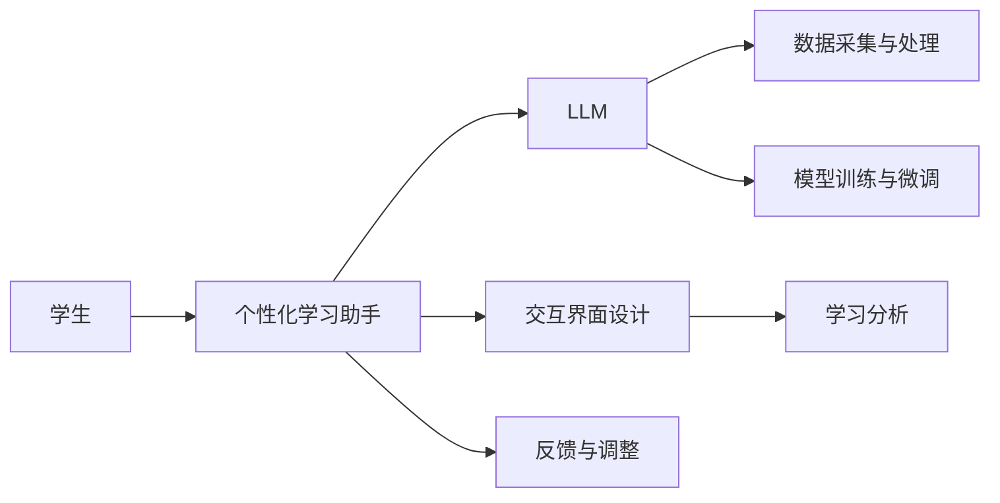

                 

# LLM在教育中的应用：个性化学习助手

> 关键词：人工智能,大语言模型,个性化教育,自适应学习,学习分析

## 1. 背景介绍

### 1.1 问题由来

在当今教育领域，个性化学习的理念被广泛认可，但其实施一直面临着技术难题。传统的教育方法往往采用“一刀切”的方式，难以针对每个学生的不同需求和兴趣提供定制化的学习路径。随着人工智能技术的迅速发展，尤其是大语言模型(Large Language Model, LLM)的涌现，个性化教育有了实现的可能。

大语言模型是一种能够理解和生成自然语言，具备强大推理和生成能力的人工智能模型。通过预训练和微调，LLM可以适应各种不同的应用场景，包括但不限于自然语言处理、文本生成、对话系统等。在教育领域，LLM可以通过个性化学习助手的形式，为每个学生提供量身定制的学习内容和建议，从而提升学习效果，促进学生的全面发展。

### 1.2 问题核心关键点

个性化学习助手的设计需要解决以下几个核心问题：
1. **数据采集与处理**：收集学生的学习数据，包括课程成绩、作业、课堂参与度等，以生成个性化的学习推荐。
2. **模型训练与微调**：基于收集到的数据，使用LLM进行训练和微调，学习与每个学生偏好和能力相匹配的策略。
3. **交互界面设计**：设计易于操作的用户界面，使学生能够轻松与个性化学习助手互动。
4. **反馈与调整**：通过学习者的反馈，不断调整和优化学习助手的策略，提升个性化学习的精度和效果。

本文将围绕上述核心问题，介绍如何利用LLM构建一个高效的个性化学习助手，并探讨其在教育领域的应用前景。

## 2. 核心概念与联系

### 2.1 核心概念概述

为更好地理解个性化学习助手的设计和应用，本节将介绍几个关键概念及其相互联系：

- **大语言模型(LLM)**：基于Transformer架构的深度学习模型，通过大规模语料库的预训练，具备理解自然语言的能力，能够进行文本生成、情感分析、问答等任务。
- **个性化学习(Adaptive Learning)**：根据每个学生的学习情况和偏好，动态调整教学内容和方式，以适应其个性化的学习需求。
- **自适应学习系统(Adaptive Learning System)**：集成了LLM的个性化学习助手，通过与学生的互动，不断调整教学策略，实现个性化教育的目标。
- **学习分析(Learning Analytics)**：通过分析学生的学习数据，了解其学习行为和效果，为个性化学习提供依据。
- **人机交互(Human-Computer Interaction, HCI)**：设计易于理解、操作的用户界面，增强学生与个性化学习助手之间的互动体验。

这些概念共同构成了个性化学习助手的核心框架，使其能够有效地支持学生的个性化学习需求。

### 2.2 核心概念原理和架构的 Mermaid 流程图



这个流程图展示了个性化学习助手的基本架构：
1. 学生与个性化学习助手进行互动。
2. 个性化学习助手利用LLM进行数据处理、模型训练和推理。
3. 收集学生的反馈数据，不断优化个性化策略。
4. 学习分析工具帮助理解学生学习行为，提供进一步的改进建议。

## 3. 核心算法原理 & 具体操作步骤
### 3.1 算法原理概述

个性化学习助手的核心算法原理基于监督学习和深度学习的思想。具体而言，它包括以下几个关键步骤：

1. **数据采集与预处理**：收集学生的学习数据，并进行预处理，如去除噪音、归一化等。
2. **模型训练与微调**：使用收集到的数据对LLM进行微调，使其能够预测每个学生的学习需求和偏好。
3. **推理与推荐**：利用微调后的LLM，生成个性化的学习推荐，如推荐阅读材料、习题等。
4. **交互与反馈**：通过与学生的互动，收集反馈信息，不断调整和优化模型。

### 3.2 算法步骤详解

以下是个性化学习助手设计中各个步骤的具体细节：

#### 3.2.1 数据采集与预处理

数据采集与预处理是个性化学习助手的第一步，其目标是收集和准备用于训练模型的数据。具体步骤如下：

1. **数据收集**：从学生的课程成绩、作业、课堂参与度等不同渠道收集学习数据。
2. **数据清洗**：对收集到的数据进行清洗和预处理，如去除异常值、填充缺失值等。
3. **特征工程**：将清洗后的数据转换为模型可以处理的格式，如提取关键词、计算统计指标等。
4. **数据划分**：将数据划分为训练集、验证集和测试集，以评估模型的性能。

#### 3.2.2 模型训练与微调

模型训练与微调是个性化学习助手的核心部分，其主要目标是通过训练，使LLM能够预测学生的学习需求和偏好。具体步骤如下：

1. **选择合适的模型**：根据任务需求选择合适的LLM模型，如GPT、BERT等。
2. **准备训练数据**：将预处理后的数据划分为训练集和验证集，并准备用于微调的标注数据。
3. **模型微调**：使用标注数据对预训练模型进行微调，优化模型的参数以适应具体任务。
4. **验证与调整**：在验证集上评估模型性能，根据反馈调整模型参数和训练策略。

#### 3.2.3 推理与推荐

推理与推荐是个性化学习助手的关键功能，其目标是根据学生的学习数据，生成个性化的学习推荐。具体步骤如下：

1. **输入数据**：将学生最新的学习数据输入到微调后的LLM中。
2. **生成推荐**：LLM根据输入数据生成个性化的学习推荐，如推荐阅读材料、习题等。
3. **交互反馈**：将推荐展示给学生，收集学生的反馈信息，进一步优化推荐策略。

#### 3.2.4 交互与反馈

交互与反馈是个性化学习助手的重要环节，其目标是通过与学生的互动，不断优化模型和推荐策略。具体步骤如下：

1. **用户界面设计**：设计易于操作的用户界面，方便学生与个性化学习助手进行互动。
2. **互动过程**：通过交互界面，学生可以看到个性化的学习推荐，并进行选择和反馈。
3. **数据收集**：收集学生的选择和反馈数据，用于后续的模型调整和优化。
4. **模型调整**：根据学生的反馈数据，调整和优化模型参数和推荐策略，以提高个性化推荐的准确性。

### 3.3 算法优缺点

个性化学习助手设计中采用的算法具有以下优点：
1. **个性化推荐**：基于学生的学习数据，能够生成个性化的学习推荐，提升学习效果。
2. **自适应学习**：能够根据学生的学习情况和反馈，动态调整教学策略，实现个性化教育。
3. **高效互动**：通过设计易用的用户界面，方便学生与系统进行互动，提升用户体验。

同时，该算法也存在一些缺点：
1. **数据隐私**：收集学生的学习数据需要考虑隐私保护，避免数据泄露。
2. **计算资源需求高**：大语言模型的训练和推理需要高性能计算资源，可能对硬件要求较高。
3. **模型复杂度高**：个性化学习助手的设计涉及多个模块，算法复杂度较高。
4. **反馈周期长**：从收集反馈到调整模型需要一定时间，难以实时响应学生需求。

### 3.4 算法应用领域

个性化学习助手的设计和应用领域非常广泛，以下是几个典型应用场景：

1. **个性化阅读推荐**：根据学生的阅读偏好和历史数据，推荐适合其阅读水平和兴趣的书籍和文章。
2. **个性化习题推荐**：根据学生的知识掌握情况和薄弱环节，推荐针对性的习题和练习，提升学习效果。
3. **个性化辅导系统**：结合语音识别和自然语言处理技术，提供个性化的学习辅导，解答学生的疑问。
4. **课堂互动系统**：利用自然语言理解技术，进行课堂互动，提高学生的参与度和学习效果。
5. **学习数据分析**：通过分析学生的学习数据，了解其学习行为和效果，提供进一步的改进建议。

## 4. 数学模型和公式 & 详细讲解 & 举例说明

### 4.1 数学模型构建

个性化学习助手的设计涉及多个数学模型，包括监督学习模型、推荐系统模型等。以下是一个简单的数学模型构建示例：

假设我们有一个二分类问题，目标是根据学生的学习数据预测其是否需要额外辅导。假设有两个特征$x_1$和$x_2$，模型输出的概率为$p(y|x_1, x_2)$，其中$y$表示是否需要辅导。我们可以使用逻辑回归模型来构建该模型，其损失函数为交叉熵损失：

$$
L(\theta) = -\frac{1}{N}\sum_{i=1}^N[y_i\log p(y|x_{1i}, x_{2i}) + (1-y_i)\log(1-p(y|x_{1i}, x_{2i}))]
$$

其中$\theta$为模型的参数，$N$为训练样本数，$x_{1i}$和$x_{2i}$为第$i$个样本的特征，$y_i$为样本标签。

### 4.2 公式推导过程

以下是逻辑回归模型的推导过程：

1. **模型定义**：假设模型的输出为$p(y|x)$，其中$y$为预测结果，$x$为输入特征。
2. **损失函数**：定义交叉熵损失函数$L(\theta)$。
3. **梯度计算**：计算损失函数对模型参数$\theta$的梯度。
4. **优化算法**：使用梯度下降等优化算法，最小化损失函数，更新模型参数$\theta$。

以二分类问题为例，模型的输出为：

$$
p(y|x) = \frac{1}{1+e^{-z}}
$$

其中$z = \theta_0 + \sum_{j=1}^n \theta_jx_j$，$\theta_0$和$\theta_j$为模型参数。

将$p(y|x)$带入交叉熵损失函数，得：

$$
L(\theta) = -\frac{1}{N}\sum_{i=1}^N[y_i\log p(y_i|x_{i}) + (1-y_i)\log(1-p(y_i|x_{i}))]
$$

对模型参数$\theta$求导，得：

$$
\frac{\partial L(\theta)}{\partial \theta_j} = \frac{1}{N}\sum_{i=1}^N[x_{ij}(y_i-p(y_i|x_i))]
$$

其中$x_{ij}$为第$i$个样本的第$j$个特征，$p(y_i|x_i)$为模型对样本$x_i$的预测结果。

通过上述公式，我们可以使用梯度下降等优化算法，最小化损失函数，更新模型参数$\theta$，从而实现个性化学习助手的训练和微调。

### 4.3 案例分析与讲解

假设我们有一个在线学习平台，需要为每位学生推荐适合的阅读材料。我们可以使用逻辑回归模型作为推荐系统，其输入为学生的阅读历史、兴趣偏好等特征，输出为阅读材料的推荐评分。

具体步骤如下：

1. **数据准备**：收集学生的阅读历史、兴趣偏好等数据，并准备用于训练的标注数据。
2. **模型训练**：使用逻辑回归模型对数据进行训练，优化模型参数以适应具体任务。
3. **特征提取**：从学生的阅读历史和兴趣偏好中提取特征，如阅读量、阅读偏好等。
4. **推荐生成**：将学生的特征输入到微调后的逻辑回归模型中，生成推荐评分。
5. **用户反馈**：收集学生对推荐结果的反馈，用于后续模型的调整和优化。

通过上述步骤，我们可以实现基于大语言模型的个性化阅读推荐，提升学生的学习体验和效果。

## 5. 项目实践：代码实例和详细解释说明

### 5.1 开发环境搭建

在进行个性化学习助手的设计和实现之前，我们需要准备好开发环境。以下是使用Python进行PyTorch开发的环境配置流程：

1. 安装Anaconda：从官网下载并安装Anaconda，用于创建独立的Python环境。

2. 创建并激活虚拟环境：
```bash
conda create -n pytorch-env python=3.8 
conda activate pytorch-env
```

3. 安装PyTorch：根据CUDA版本，从官网获取对应的安装命令。例如：
```bash
conda install pytorch torchvision torchaudio cudatoolkit=11.1 -c pytorch -c conda-forge
```

4. 安装Transformer库：
```bash
pip install transformers
```

5. 安装各类工具包：
```bash
pip install numpy pandas scikit-learn matplotlib tqdm jupyter notebook ipython
```

完成上述步骤后，即可在`pytorch-env`环境中开始开发。

### 5.2 源代码详细实现

下面我们以个性化阅读推荐系统为例，给出使用Transformers库对BERT模型进行微调的PyTorch代码实现。

首先，定义阅读推荐任务的数据处理函数：

```python
from transformers import BertTokenizer
from torch.utils.data import Dataset
import torch

class ReadingDataset(Dataset):
    def __init__(self, texts, tags, tokenizer, max_len=128):
        self.texts = texts
        self.tags = tags
        self.tokenizer = tokenizer
        self.max_len = max_len
        
    def __len__(self):
        return len(self.texts)
    
    def __getitem__(self, item):
        text = self.texts[item]
        tags = self.tags[item]
        
        encoding = self.tokenizer(text, return_tensors='pt', max_length=self.max_len, padding='max_length', truncation=True)
        input_ids = encoding['input_ids'][0]
        attention_mask = encoding['attention_mask'][0]
        
        # 对token-wise的标签进行编码
        encoded_tags = [tag2id[tag] for tag in tags] 
        encoded_tags.extend([tag2id['O']] * (self.max_len - len(encoded_tags)))
        labels = torch.tensor(encoded_tags, dtype=torch.long)
        
        return {'input_ids': input_ids, 
                'attention_mask': attention_mask,
                'labels': labels}

# 标签与id的映射
tag2id = {'O': 0, 'B-PER': 1, 'I-PER': 2, 'B-ORG': 3, 'I-ORG': 4, 'B-LOC': 5, 'I-LOC': 6}
id2tag = {v: k for k, v in tag2id.items()}

# 创建dataset
tokenizer = BertTokenizer.from_pretrained('bert-base-cased')

train_dataset = ReadingDataset(train_texts, train_tags, tokenizer)
dev_dataset = ReadingDataset(dev_texts, dev_tags, tokenizer)
test_dataset = ReadingDataset(test_texts, test_tags, tokenizer)
```

然后，定义模型和优化器：

```python
from transformers import BertForTokenClassification, AdamW

model = BertForTokenClassification.from_pretrained('bert-base-cased', num_labels=len(tag2id))

optimizer = AdamW(model.parameters(), lr=2e-5)
```

接着，定义训练和评估函数：

```python
from torch.utils.data import DataLoader
from tqdm import tqdm
from sklearn.metrics import classification_report

device = torch.device('cuda') if torch.cuda.is_available() else torch.device('cpu')
model.to(device)

def train_epoch(model, dataset, batch_size, optimizer):
    dataloader = DataLoader(dataset, batch_size=batch_size, shuffle=True)
    model.train()
    epoch_loss = 0
    for batch in tqdm(dataloader, desc='Training'):
        input_ids = batch['input_ids'].to(device)
        attention_mask = batch['attention_mask'].to(device)
        labels = batch['labels'].to(device)
        model.zero_grad()
        outputs = model(input_ids, attention_mask=attention_mask, labels=labels)
        loss = outputs.loss
        epoch_loss += loss.item()
        loss.backward()
        optimizer.step()
    return epoch_loss / len(dataloader)

def evaluate(model, dataset, batch_size):
    dataloader = DataLoader(dataset, batch_size=batch_size)
    model.eval()
    preds, labels = [], []
    with torch.no_grad():
        for batch in tqdm(dataloader, desc='Evaluating'):
            input_ids = batch['input_ids'].to(device)
            attention_mask = batch['attention_mask'].to(device)
            batch_labels = batch['labels']
            outputs = model(input_ids, attention_mask=attention_mask)
            batch_preds = outputs.logits.argmax(dim=2).to('cpu').tolist()
            batch_labels = batch_labels.to('cpu').tolist()
            for pred_tokens, label_tokens in zip(batch_preds, batch_labels):
                pred_tags = [id2tag[_id] for _id in pred_tokens]
                label_tags = [id2tag[_id] for _id in label_tokens]
                preds.append(pred_tags[:len(label_tags)])
                labels.append(label_tags)
                
    print(classification_report(labels, preds))
```

最后，启动训练流程并在测试集上评估：

```python
epochs = 5
batch_size = 16

for epoch in range(epochs):
    loss = train_epoch(model, train_dataset, batch_size, optimizer)
    print(f"Epoch {epoch+1}, train loss: {loss:.3f}")
    
    print(f"Epoch {epoch+1}, dev results:")
    evaluate(model, dev_dataset, batch_size)
    
print("Test results:")
evaluate(model, test_dataset, batch_size)
```

以上就是使用PyTorch对BERT进行个性化阅读推荐系统微调的完整代码实现。可以看到，得益于Transformers库的强大封装，我们可以用相对简洁的代码完成BERT模型的加载和微调。

### 5.3 代码解读与分析

让我们再详细解读一下关键代码的实现细节：

**ReadingDataset类**：
- `__init__`方法：初始化文本、标签、分词器等关键组件。
- `__len__`方法：返回数据集的样本数量。
- `__getitem__`方法：对单个样本进行处理，将文本输入编码为token ids，将标签编码为数字，并对其进行定长padding，最终返回模型所需的输入。

**tag2id和id2tag字典**：
- 定义了标签与数字id之间的映射关系，用于将token-wise的预测结果解码回真实的标签。

**训练和评估函数**：
- 使用PyTorch的DataLoader对数据集进行批次化加载，供模型训练和推理使用。
- 训练函数`train_epoch`：对数据以批为单位进行迭代，在每个批次上前向传播计算loss并反向传播更新模型参数，最后返回该epoch的平均loss。
- 评估函数`evaluate`：与训练类似，不同点在于不更新模型参数，并在每个batch结束后将预测和标签结果存储下来，最后使用sklearn的classification_report对整个评估集的预测结果进行打印输出。

**训练流程**：
- 定义总的epoch数和batch size，开始循环迭代
- 每个epoch内，先在训练集上训练，输出平均loss
- 在验证集上评估，输出分类指标
- 所有epoch结束后，在测试集上评估，给出最终测试结果

可以看到，PyTorch配合Transformers库使得BERT微调的代码实现变得简洁高效。开发者可以将更多精力放在数据处理、模型改进等高层逻辑上，而不必过多关注底层的实现细节。

当然，工业级的系统实现还需考虑更多因素，如模型的保存和部署、超参数的自动搜索、更灵活的任务适配层等。但核心的微调范式基本与此类似。

## 6. 实际应用场景

### 6.1 智能课堂

基于大语言模型的个性化学习助手可以在智能课堂中发挥重要作用。传统的课堂教学往往“一刀切”，难以照顾到每个学生的不同需求。通过个性化学习助手，教师可以实时了解每个学生的学习状态，提供个性化的教学建议和资源。

具体而言，教师可以利用个性化学习助手，在课堂上进行互动，实时收集学生的反馈信息。根据反馈数据，个性化学习助手可以动态调整课程内容和难度，以适应每个学生的学习节奏。同时，教师可以通过学习助手，针对性地解答学生的疑问，提升课堂效率。

### 6.2 个性化阅读

个性化阅读推荐系统是个性化学习助手的重要应用场景之一。通过分析学生的阅读历史和兴趣偏好，推荐系统可以生成个性化的阅读清单，引导学生自主阅读，提升阅读量和质量。

在技术实现上，阅读推荐系统可以集成到学习平台上，学生可以通过界面选择阅读材料。阅读推荐系统根据学生的阅读历史和兴趣偏好，生成个性化的推荐结果。同时，系统还可以记录学生的阅读反馈，不断优化推荐策略。

### 6.3 考试辅导

考试辅导是个性化学习助手的另一重要应用场景。通过个性化学习助手，学生可以获得定制化的考试辅导。根据学生的知识掌握情况和薄弱环节，系统可以推荐针对性的习题和复习材料，帮助学生提升考试成绩。

在技术实现上，个性化学习助手可以集成到考试辅导平台，学生可以在线进行测评和复习。系统根据测评结果，生成个性化的复习计划和习题推荐，帮助学生提升知识掌握能力。

### 6.4 未来应用展望

随着大语言模型微调技术的不断发展，个性化学习助手将在教育领域得到更广泛的应用。未来，基于个性化学习助手的教育系统将具有以下发展趋势：

1. **自适应学习**：通过不断收集学生的学习反馈，动态调整教学策略，实现真正意义上的自适应学习。
2. **多模态融合**：结合图像、视频、语音等多模态数据，实现更全面的个性化推荐。
3. **知识图谱**：将知识图谱与个性化学习助手结合，提供更准确的知识点推荐和关联。
4. **情感分析**：通过情感分析技术，了解学生的学习情绪，提供相应的心理支持和辅导。
5. **隐私保护**：在数据收集和分析过程中，注重隐私保护，确保学生数据的安全。

通过不断探索和创新，个性化学习助手将为教育领域带来革命性的变革，使每个学生都能得到最适合自己的教育。

## 7. 工具和资源推荐

### 7.1 学习资源推荐

为了帮助开发者系统掌握个性化学习助手的理论基础和实践技巧，这里推荐一些优质的学习资源：

1. 《深度学习》（Ian Goodfellow等著）：全面介绍了深度学习的基本概念和算法，是学习和理解个性化学习助手的理论基础。
2. 《TensorFlow实战Google AI》（Patricio Peña-Galera等著）：介绍了TensorFlow的使用方法，包含多个NLP应用实例，适合动手实践。
3. 《Python深度学习》（François Chollet著）：介绍了Keras的使用方法，包含多个NLP应用实例，适合动手实践。
4. Coursera《深度学习专项课程》：斯坦福大学开设的深度学习课程，涵盖了从基础到高级的多个主题。
5. edX《AI for Everyone》：麻省理工学院开设的AI入门课程，适合初学者学习。

通过对这些资源的学习实践，相信你一定能够快速掌握个性化学习助手的精髓，并用于解决实际的NLP问题。

### 7.2 开发工具推荐

高效的开发离不开优秀的工具支持。以下是几款用于个性化学习助手开发的常用工具：

1. PyTorch：基于Python的开源深度学习框架，灵活动态的计算图，适合快速迭代研究。大部分预训练语言模型都有PyTorch版本的实现。
2. TensorFlow：由Google主导开发的开源深度学习框架，生产部署方便，适合大规模工程应用。同样有丰富的预训练语言模型资源。
3. Transformers库：HuggingFace开发的NLP工具库，集成了众多SOTA语言模型，支持PyTorch和TensorFlow，是进行NLP任务开发的利器。
4. Weights & Biases：模型训练的实验跟踪工具，可以记录和可视化模型训练过程中的各项指标，方便对比和调优。与主流深度学习框架无缝集成。
5. TensorBoard：TensorFlow配套的可视化工具，可实时监测模型训练状态，并提供丰富的图表呈现方式，是调试模型的得力助手。
6. Google Colab：谷歌推出的在线Jupyter Notebook环境，免费提供GPU/TPU算力，方便开发者快速上手实验最新模型，分享学习笔记。

合理利用这些工具，可以显著提升个性化学习助手开发的效率，加快创新迭代的步伐。

### 7.3 相关论文推荐

个性化学习助手的研究涉及多个领域，以下是几篇奠基性的相关论文，推荐阅读：

1. Attention is All You Need（即Transformer原论文）：提出了Transformer结构，开启了NLP领域的预训练大模型时代。
2. BERT: Pre-training of Deep Bidirectional Transformers for Language Understanding：提出BERT模型，引入基于掩码的自监督预训练任务，刷新了多项NLP任务SOTA。
3. Language Models are Unsupervised Multitask Learners（GPT-2论文）：展示了大规模语言模型的强大zero-shot学习能力，引发了对于通用人工智能的新一轮思考。
4. Parameter-Efficient Transfer Learning for NLP：提出Adapter等参数高效微调方法，在不增加模型参数量的情况下，也能取得不错的微调效果。
5. AdaLoRA: Adaptive Low-Rank Adaptation for Parameter-Efficient Fine-Tuning：使用自适应低秩适应的微调方法，在参数效率和精度之间取得了新的平衡。
6. Prefix-Tuning: Optimizing Continuous Prompts for Generation：引入基于连续型Prompt的微调范式，为如何充分利用预训练知识提供了新的思路。

这些论文代表了大语言模型微调技术的发展脉络。通过学习这些前沿成果，可以帮助研究者把握学科前进方向，激发更多的创新灵感。

## 8. 总结：未来发展趋势与挑战

### 8.1 总结

本文对基于大语言模型的个性化学习助手进行了全面系统的介绍。首先阐述了个性化学习助手的研究背景和意义，明确了其在大语言模型微调中的应用价值。其次，从原理到实践，详细讲解了个性化学习助手的数学模型和关键步骤，给出了微调任务开发的完整代码实例。同时，本文还广泛探讨了个性化学习助手在智能课堂、个性化阅读、考试辅导等多个教育场景中的应用前景，展示了其巨大的应用潜力。

通过本文的系统梳理，可以看到，基于大语言模型的个性化学习助手正在成为教育技术的重要范式，极大地拓展了教育智能化水平，促进了学生的全面发展。未来，伴随个性化学习助手的不断优化和创新，教育技术必将迎来新的变革，推动人类社会的进步。

### 8.2 未来发展趋势

展望未来，个性化学习助手的设计和应用将呈现以下几个发展趋势：

1. **自适应学习**：通过不断收集学生的学习反馈，动态调整教学策略，实现真正意义上的自适应学习。
2. **多模态融合**：结合图像、视频、语音等多模态数据，实现更全面的个性化推荐。
3. **知识图谱**：将知识图谱与个性化学习助手结合，提供更准确的知识点推荐和关联。
4. **情感分析**：通过情感分析技术，了解学生的学习情绪，提供相应的心理支持和辅导。
5. **隐私保护**：在数据收集和分析过程中，注重隐私保护，确保学生数据的安全。

以上趋势凸显了个性化学习助手的广阔前景。这些方向的探索发展，必将进一步提升教育系统的智能化水平，推动人类社会的进步。

### 8.3 面临的挑战

尽管个性化学习助手的发展前景广阔，但在迈向更加智能化、普适化应用的过程中，它仍面临诸多挑战：

1. **数据隐私**：收集学生的学习数据需要考虑隐私保护，避免数据泄露。
2. **计算资源需求高**：大语言模型的训练和推理需要高性能计算资源，可能对硬件要求较高。
3. **算法复杂度高**：个性化学习助手的设计涉及多个模块，算法复杂度较高。
4. **反馈周期长**：从收集反馈到调整模型需要一定时间，难以实时响应学生需求。

### 8.4 研究展望

面对个性化学习助手所面临的挑战，未来的研究需要在以下几个方面寻求新的突破：

1. **无监督和半监督学习**：摆脱对大规模标注数据的依赖，利用自监督学习、主动学习等无监督和半监督范式，最大限度利用非结构化数据，实现更加灵活高效的个性化学习。
2. **参数高效和计算高效**：开发更加参数高效的微调方法，在固定大部分预训练参数的同时，只更新极少量的任务相关参数。同时优化微调模型的计算图，减少前向传播和反向传播的资源消耗，实现更加轻量级、实时性的部署。
3. **因果分析和博弈论工具**：将因果分析方法引入个性化学习助手，识别出模型决策的关键特征，增强输出解释的因果性和逻辑性。借助博弈论工具刻画人机交互过程，主动探索并规避模型的脆弱点，提高系统稳定性。
4. **知识整合能力**：将符号化的先验知识，如知识图谱、逻辑规则等，与神经网络模型进行巧妙融合，引导个性化学习助手学习更准确、合理的语言模型。同时加强不同模态数据的整合，实现视觉、语音等多模态信息与文本信息的协同建模。
5. **伦理道德约束**：在模型训练目标中引入伦理导向的评估指标，过滤和惩罚有偏见、有害的输出倾向。同时加强人工干预和审核，建立模型行为的监管机制，确保输出符合人类价值观和伦理道德。

这些研究方向的探索，必将引领个性化学习助手技术迈向更高的台阶，为构建安全、可靠、可解释、可控的智能系统铺平道路。面向未来，个性化学习助手技术还需要与其他人工智能技术进行更深入的融合，如知识表示、因果推理、强化学习等，多路径协同发力，共同推动自然语言理解和智能交互系统的进步。只有勇于创新、敢于突破，才能不断拓展个性化学习助手的边界，让智能技术更好地造福人类社会。

## 9. 附录：常见问题与解答

**Q1：如何选择合适的个性化学习助手？**

A: 选择合适的个性化学习助手需要考虑以下几个方面：
1. **任务适配性**：确保学习助手能够适应当前的教育场景和需求。
2. **用户友好性**：学习助手的界面设计和操作流程应简单易懂，适合学生使用。
3. **性能稳定性**：学习助手应具有稳定的性能和较高的准确率，保证推荐结果的可靠性。
4. **隐私保护**：学习助手应注重数据隐私保护，确保学生数据的安全。

**Q2：个性化学习助手的推荐算法有哪些？**

A: 常用的个性化学习助手推荐算法包括：
1. **协同过滤算法**：通过分析用户行为数据，推荐相似用户喜欢的物品。
2. **基于内容的推荐算法**：根据物品的属性特征，推荐与用户兴趣相似的物品。
3. **深度学习推荐算法**：使用深度神经网络，从用户和物品的隐向量中提取特征，进行推荐。
4. **混合推荐算法**：结合多种推荐算法，取长补短，提升推荐效果。

**Q3：个性化学习助手的设计难点有哪些？**

A: 个性化学习助手的设计难点包括：
1. **数据获取**：需要收集大量的用户数据，且数据质量对推荐效果有较大影响。
2. **模型训练**：大语言模型的训练需要高性能计算资源，且训练时间较长。
3. **推荐策略**：如何设计有效的推荐策略，是个性化学习助手设计中的重要环节。
4. **用户体验**：学习助手的界面设计和交互体验需要符合用户习惯，提升用户体验。

通过本文的系统梳理，可以看到，基于大语言模型的个性化学习助手正在成为教育技术的重要范式，极大地拓展了教育智能化水平，促进了学生的全面发展。未来，伴随个性化学习助手的不断优化和创新，教育技术必将迎来新的变革，推动人类社会的进步。

